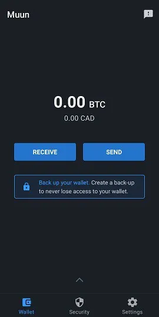
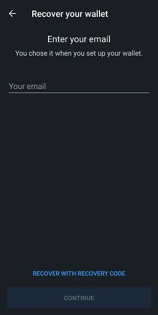
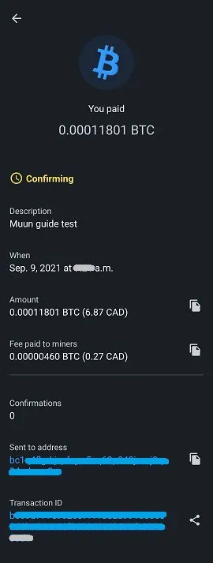

Muun (https://muun.com/) is a self-custodial wallet for bitcoin and lightning.

## video tutorial

## Muun Wallet - Guide d'utilisation complet

Guide d'utilisation complet (avec captures d'écran) de l'application Muun; un portefeuille mobile Bitcoin convivial vous permettant de transiger sur le Lightning Network.

### Télécharger Muun et créer son portefeuille

Premièrement, il faut télécharger l’application mobile, disponible autant sur iOS que Android. Assurez-vous toujours de télécharger la bonne version. Il existe parfois des répliques frauduleuses sur le marché. Je vous recommande de trouver le site web officiel de Muun wallet, en l’occurrence https://muun.com/ , et d’utiliser le lien vers votre système de choix (iOS/Android), de là vous serez certains que vous avez affaire à l’application officielle.

À l’ouverture de l’application, vous aurez le choix entre créer un nouveau portefeuille ou bien en récupérer un existant. Commençons d’abord par la création d’un nouveau portefeuille. Je démontrerai les étapes de récupération de portefeuille par après. Appuyez sur “Create a new wallet”.

Muun wallet vous demande ensuite de créer un numéro d’identification personnel (NIP/PIN) de quatre chiffres. Avec un PIN vous augmentez la sécurité de votre portefeuille au cas où, supposons, un acteur malicieux vous subtilisait votre téléphone et conséquemment vos bitcoins.

Voilà, l’application a généré un tout nouveau portefeuille qui deviendra désormais la page d'accueil. Il faut maintenant sécuriser les informations pertinentes à la récupération du portefeuille avant d’y envoyer des fonds, ce qui s’avèrerait être une pratique risquée.

### Sauvegarde de la clé

Appuyez sur l’encadré “Back up your wallet”, vous serez redirigé vers l’onglet “Security”. Le processus de sauvegarde de Muun est convenablement disposé en trois étapes. Il n’est pas obligatoire de compléter chacune des trois étapes, par contre la combinaison de celles-ci offre le maximum de précaution.

La première option vous permet de connecter votre portefeuille à une adresse courriel, en plus de le protéger d’un mot de passe. Cette option est facultative et peut être sautée sans problème. Si vous désirez l’employer, appuyez sur “1 : Back up your wallet” puis sur “Start” sur l’écran suivant et entrez une adresse courriel. L’écran suivant vous indiquera que vous devez valider le courriel en accédant à votre boîte aux lettres puis en cliquant sur le lien prévu à cet effet dans le courriel de Muun.

Une fois le courriel vérifié, vous serez amené à créer un mot de passe. Ensuite, il vous faudra cocher deux cases comme quoi vous comprenez que la récupération du portefeuille, si elle a lieu, nécessitera l’utilisation du courriel et du mot de passe tout juste choisi. Cela fait contraste aux programmes traditionnels qui vous offrent la possibilité de réinitialiser votre mot de passe en cas de perte ou d’oubli de ce dernier, alors assurez-vous de bien avoir noté le tout.​

​L’onglet “Security” vous indique désormais que vous avez une sauvegarde de base (“basic backup”). Vous pouvez donc retourner à l’onglet “Wallet” et utiliser l’application pour compléter des transactions (ces fonctions seront détaillées plus loin dans ce guide), sachant que le portefeuille est maintenant récupérable. Néanmoins, je vous recommande d’utiliser l’option de sécurité #2 pour générer un code de sauvegarde additionnel, au cas où le mot de passe entré à l’option #1 serait compromis ou que vous préférez ne pas employer l’option de récupération par courriel.

L’option “alternative backup” de Muun s’apparente à la phrase mnémonique utilisée par de multiples applications de portefeuille à laquelle une grande partie des utilisateurs Bitcoin sont habitués. Appuyez sur “Start” pour afficher votre code de récupération et inscrivez-le sur un morceau de papier (l’application censure la capture d’écran sur la page affichant le code). Une fois noté, comparez-le avec le code affiché à l’écran car vous devrez ensuite le retaper dans l’application pour confirmer la validité de celui-ci.

Encore une fois, Muun vous demande de confirmer votre compréhension de l’enjeu, c’est-à-dire que vous aurez besoin de ce code à 32 caractères dans l’éventualité où vous perdriez votre mot de passe établi précédemment.

La sauvegarde du portefeuille est maintenant largement sécurisée relativement aux standards modernes que nous connaissons. Cependant, l’application Muun comporte une troisième option de sécurité nommée “Emergency Kit”. La création du Emergency Kit vous permettra de récupérer votre portefeuille sans avoir besoin de passer par Muun. Autrement dit, en utilisant un logiciel de portefeuille Bitcoin différent de Muun.

Après avoir appuyé sur “Create an Emergency Kit”, on vous explique que ce kit vient sous la forme d’un document PDF contenant les informations & instructions relatives au transfert de vos fonds de manière indépendante. Le kit peut être stocké sur le cloud sans souci puisqu’il nécessite votre “Recovery Code” pour être utilisé, lequel ne figure pas dans le document en question. Faites glisser l’écran pour accéder à la page de création du kit.

Trois options s’offrent à vous :

- Sauvegarder sur le cloud de votre compte Google.
- Envoyer un courriel à votre propre adresse pour sauvegarder votre kit et y accéder.
- Sauvegarder manuellement avec une application locale sur votre appareil.

Assurez-vous de pouvoir consulter votre kit une fois que vous l’aurez envoyé à votre destination de sauvegarde de choix car Muun vous demandera ensuite, à des fins de validation, d’entrer un code à six chiffres se trouvant dans le kit.

Une fois cette dernière étape complétée, votre configuration de sécurité et de récupération de portefeuille est désormais terminée. Nous allons maintenant explorer les différentes façons de récupérer votre portefeuille en utilisant les sauvegardes fraîchement créées.
Récupération d’un portefeuille

Il existe une multitude de scénarios où un utilisateur peut momentanément perdre l’accès à son portefeuille & ses fonds; perte de l’appareil, application désinstallée/disparue, numéro d’identification personnel oublié, déconnexion du portefeuille, etc. Il est donc impératif de savoir comment récupérer cet accès. Lors de la récupération via l’application Muun, appuyez sur l’option “I Already Have A Wallet” sur l’écran d’ouverture.

### Récupération avec adresse courriel

Si vous avez utilisé l’option de sauvegarde #1 de Muun, entrez le courriel ayant été choisi à ce moment. Puisque cette option est facultative, vous pouvez également opter de poursuivre plutôt avec le code de récupération, lequel se trouvant à être l’option #2 offerte par Muun. Survolons d’abord l’option via courriel.

Une fois votre adresse courriel entrée, Muun vous indiquera qu’un courriel vous a été envoyé et que vous devez y accéder pour autoriser la récupération du portefeuille. Vérifiez votre boîte aux lettres (ainsi que la section indésirables) et utilisez le lien fourni dans le courriel de Muun. Vous serez redirigé dans l’application où l’écran vous demandera maintenant d’entrer votre mot de passe associé à l’adresse courriel inscrite.

La dernière étape est de créer un numéro d’identification personnel, vous serez ensuite de retour en territoire familier à la page d'accueil du portefeuille, vous indiquant le solde lié à celui-ci.

### Utilisation du “Recovery Code”

Lors du recouvrement de l’accès à un portefeuille existant, vous pouvez choisir d’utiliser le code de récupération (“Recovery Code” tel que désigné par Muun) que vous avez noté au préalable si vous avez opté pour l’option de sauvegarde #2.

Ce processus est similaire à celui détaillé dans la section précédente; récupération par courriel. Choisissez tout simplement d’utiliser l’option “Recover With Recovery Code” et entrez ce dernier dans les champs appropriés affichés à l’écran. Si votre portefeuille est également sauvegardé par un courriel en plus du code de récupération, Muun vous demandera de consulter votre boîte aux lettres pour autoriser le processus de recouvrement, lequel vous pourrez finaliser une fois de retour sur l’application après avoir appuyé sur le lien fourni. Cette fois encore, vous devez créer un numéro d’identification personnel. Voilà, vous aurez à nouveau accès à votre portefeuille.

### Récupération à l’aide du Emergency Kit

Pour récupérer votre portefeuille sans utiliser l’application Muun Wallet, vous aurez besoin de votre kit d’urgence (Emergency Kit), la troisième option de récupération offerte par Muun. Cette option vous permet d’envoyer les fonds détenus dans votre portefeuille Muun vers toute autre adresse Bitcoin. Assurez-vous donc d’avoir un portefeuille alternatif pouvant générer une adresse vers laquelle vous enverrez les fonds.

Accédez au document PDF que vous avez sauvegardé lors de la création du kit. Ce document contient les instructions nécessaires à la récupération de votre portefeuille. Notez que cette fonctionnalité nécessite l’utilisation d’un ordinateur de bureau ou portable puisqu’il vous faut télécharger un script créé par l’équipe de développement de Muun. Le lien est inclus dans le courriel, mais je vous le partage ici tout de même : https://github.com/muun/recovery​

Le kit d’urgence est muni d’un code de vérification, lequel vous avez déjà utilisé précédemment pour confirmer la création du kit, ainsi que de deux clés. Les clés seront nécessaires lorsque vous activerez le script de récupération de Muun. Assurez-vous donc de les avoir à votre portée lors de l’opération.

Voici la traduction des instructions :

Cette procédure d’urgence vous aidera à récupérer vos fonds si vous n’êtes pas en mesure d’utiliser Muun sur votre appareil.

1. Trouvez votre code de récupération

Vous avez écrit ce code sur un bout de papier avant de créer votre kit d’urgence. Vous en aurez besoin plus tard.

2. Téléchargez l’outil de recouvrement

Allez sur la page https://github.com/muun/recovery et téléchargez l’outil sur votre ordinateur

3. Récupérez vos fonds

Exécutez l’outil de récupération et suivez les étapes. L’outil se chargera de transférer vos fonds à une adresse Bitcoin de votre choix.

Une fois dans le script, il ne vous reste qu’à entrer les informations demandées à l’écran. Le script se chargera du processus de transfert des fonds pour vous. Sur la page “github” fourni ci-haut, un vidéo animé du processus est disponible, lequel vous permettra de voir exactement ce qui vous attend lorsque vous initierez le script de recouvrement.

## Recevoir des transactions

### Onglet Bitcoin

Nous allons maintenant couvrir la section “Receive” du portefeuille Muun ainsi que ses différentes fonctions. La page d'accueil de votre application est celle de l’onglet “Wallet”. Votre solde est affiché au centre, vous pouvez appuyer dessus pour alterner entre le masquage du montant et son affichage. Nous survolerons tous les paramètres de l’application plus loin dans cet article. Pour le moment, appuyons sur “Receive” pour explorer cette fonction.

Sur cette page, vous pouvez choisir de recevoir une transaction autant sur le réseau Bitcoin que Lightning. Une nouvelle adresse (et le code QR qui s’y rattache) correspondant au réseau désiré s’affichera. Par défaut, une adresse Bitcoin s’affiche à l’arrivée sur l’écran “Receive”. En appuyant sur le code QR, l’adresse sera copiée au tableau de votre appareil. Vous pouvez facilement partager l’adresse directement vers d’autres applications avec le bouton “Share” et vous pouvez aussi copier l’adresse avec le bouton “Copy”. Appuyer sur l’icône d'œil situé à la fin de l’adresse affichera cette dernière au complet, vous permettant de la comparer avec celle copiée au tableau lors du partage.

Ces informations comportent tout le nécessaire pour recevoir des transactions sur le réseau Bitcoin. Additionnellement, Muun vous offre quelques options de personnalisation sous le menu “Address settings”. D’un, il est possible d’ajouter un montant à la description de l’adresse. De deux, vous pouvez choisir d’utiliser une adresse Segwit (l’option par défaut) ou une adresse traditionnelle (legacy).

En appuyant sur “Add +”, vous pouvez ajouter un montant spécifique à l’adresse, facilitant ainsi la tâche du pair émetteur. Cette option est facultative. Notez qu’une fois qu’un montant est inscrit, le bouton “Copy” de la page précédente ajoutera de l’information à l’adresse copiée (“bitcoin:” en préfixe, puis le montant en suffixe.). Pour éviter d’avoir à régler cet impromptu, appuyez sur le code QR directement pour copier l’adresse. L’information du montant demeurera ancrée avec celle-ci. Également, l’application vous permet de choisir d’inscrire le montant dans la devise de votre choix, simplifiant ainsi le processus de conversion vers le BTC.

En ce qui à trait à la sélection du type d’adresse, Segwit ou Legacy, je recommande de laisser Segwit en place. Ce type d’adresse (commençant par “bc1”) réduit l’ampleur des données de la transaction et ainsi réduit les frais de transaction rattachés. Par contre, il se peut que vous ayez à utiliser le système “Legacy” (adresse débutant par “3”) dans l’éventualité où un portefeuille ou logiciel ne serait pas compatible avec les adresses Segwit. Il est donc important de savoir faire la distinction entre les deux types.

## Onglet Lightning

Pour recevoir des transactions via le réseau Lightning, il vous faut appuyer sur l’onglet du même nom au haut de l’écran. S’affichera désormais un code QR contenant une adresse Lightning, laquelle vous pourrez copier et partager de la même manière que celles Bitcoin survolées auparavant dans ce guide. Je vous rappelle que le réseau Lightning vous permet de profiter d’une rapidité de transaction quasi-instantanée en plus des frais de transactions qui sont une fraction de ceux sur la chaîne Bitcoin.

Les options de personnalisation se trouvent sous le menu “Invoice settings”. À cet endroit, vous pouvez modifier le montant lié à l’adresse en appuyant sur “Add +”. Selon mon expérience avec le réseau Lightning, il est de mon avis qu’il vaut mieux inscrire un montant lors de la création de la transaction car plusieurs portefeuilles réagissent mal aux factures (“invoices”) vierges. Également, vous constaterez qu’il y a une minuterie d’expiration dans ce menu. Sur cette application, la minuterie est configurée pour 60 minutes, après quoi l’adresse sera invalide. Prenez note que Muun génère une nouvelle adresse Lightning chaque fois que vous apportez une modification au montant ou bien que vous quittez et revenez sur la page.

##Utiliser la fonction LNURL

Le portefeuille Muun offre la possibilité d’utiliser LNURL pour recevoir des transactions. Cette fonction, qui s’active en appuyant sur le symbole carré de balayage (scan) situé en haut à droite de la page, comporte quelques avantages dont celle de vous éviter d’avoir à partager une facture pour recevoir une transaction. Plutôt, vous devez balayer un code QR pour recevoir les informations de paiement que vous pourrez ensuite valider pour confirmer le procédé transactionnel.

Muun vous montrera initialement une page explicative (voir capture d’écran ci-haut) puis vous demandera d’activer la saisie de caméra de votre appareil, une étape nécessaire à l’utilisation de l’application.Sachez que les adresses LNURL ne sont actuellement pas supportées par tous les portefeuilles Lightning. Ceux qui le supportent n’offrent en général que la possibilité d’utiliser LNURL pour recevoir des transactions et non d’en émettre.

## Émettre des transactions

### Via le réseau Bitcoin

Maintenant que nous avons vu comment recevoir des bitcoins avec Muun, explorons comment en envoyer. De retour à la page d'accueil sous l’onglet “Wallet”, vous devrez appuyer sur “Send”. Une page toute simple s’affichera maintenant où vous aurez la possibilité de copier une adresse Bitcoin ou Lightning dans le champ prévu à cet effet ou d’appuyer sur l’icône de code QR à la droite de ce champ pour activer la caméra et balayer une adresse sous forme de code QR.​

Lorsque vous arrivez sur la page “Send”, si vous avez déjà une adresse en copie sur votre appareil, Muun reconnaîtra le format de l’adresse (Bitcoin ou Lightning) et vous suggérera via un message encadré d’utiliser cette dernière pour diffuser une transaction.​

Lors de la préparation d’une transaction Bitcoin, il vous faut inscrire le montant à émettre. Assurez-vous que l’adresse de destination affichée au haut de l’écran correspond bien à l’adresse copiée auparavant. Sous le montant à envoyer, Muun affiche le solde de votre portefeuille et vous donne l’option d’utiliser tous vos fonds (“Use all funds”), une fonctionnalité fort utile si vous souhaitez vider votre portefeuille complètement en évitant qu’il ne reste des “poussières” (quelques satoshis).

Après avoir confirmé le montant à émettre, Muun vous demande sur la page suivante d'écrire une note. Ceci sert de validation additionnelle, vous êtes libre d’écrire ce que vous voulez, avec pertinence ou non.

Une dernier survol des détails de la transaction est nécessaire avant d’enfin diffuser celle-ci. Validez l’adresse et le montant inscrits puis personnalisez les frais de transactions au besoin en appuyant sur l’icône de crayon bleu situé à la droite de “Network fee”. Prendre connaissance des grandes lignes sur le fonctionnement du bassin de transactions (mempool) Bitcoin est une bonne expérience éducative qui pourrait vous permettre d’économiser bien des satoshis au fil du temps!

Muun implémente par défaut dans son logiciel un algorithme calculant les frais de transaction nécessaires pour une confirmation en 30 minutes et moins. C’est ce qui s’affichera lorsque vous tenterez de modifier les frais de transaction. Le bouton “Enter Fee Manually” vous permet de personnaliser vous même ce détail, une fonctionnalité se voulant bien pratique dans l’éventualité où vous auriez besoin d’une confirmation plus rapide ou, au contraire, si vous disposez d’une large marge de manœuvre.

En choisissant d’entrer vous-même le montant des frais de transaction, vous serez transporté à une nouvelle page vous indiquant le montant à inscrire dénominé en sat/vbyte (satoshis par virtual byte). Muun vous affiche même une estimation du temps de confirmation lié au montant choisi, en plus de ce qu’il vous coûtera en BTC et monnaie fiduciaire de votre choix.

Revenez sur la page de survol des détails de la transaction et appuyez sur “Send”. Voilà, votre transaction est diffusée sur le réseau Bitcoin! Vous serez redirigé à la page d'accueil du portefeuille où vous constaterez la déduction à votre solde. Centrée au bas de l’écran se trouve une flèche sur laquelle vous pouvez appuyer pour inspecter votre historique de transactions. Celle que vous venez de faire s’y ajoute au moment initial de son émission.

Appuyez sur une entrée pour consulter les détails d’une transaction en particulier. Votre transaction sera confirmée lorsqu’un mineur ajoutera un nouveau bloc, contenant celle-ci, à la chaîne. Muun vous partage au bas de l’écran l’identifiant de la transaction, vous permettant de vérifier sur un explorateur de bloc l’état de votre transaction.

## Via le réseau Lightning

Utilisons maintenant une facture Bolt 11 (“invoice” Lightning traditionnel/par défaut) pour effectuer une transaction. Copiez ou balayez une adresse Lightning dans la page “Send”. Vous serez redirigé vers une nouvelle page vous présentant les détails de la facture courante. Les montants de la transaction s’afficheront (incluant les frais du réseau), la note ou description inscrite à la facture, ainsi que la minuterie d’expiration tout au bas. Notez que les frais de transaction ne sont pas modifiables pour les transactions Lightning, Ils sont déterminés par la route de canal/canaux qu’elles devront emprunter pour aboutir au destinataire.

(Voici l’avertissement affiché à l’écran lors de l’utilisation d’une facture (“invoice”) vierge, c’est-à-dire n’ayant aucun montant inscrit au préalable. Certains portefeuilles supportent ce type de factures et vous permettent de personnaliser le montant vous-même. Ce n’est pas le cas pour Muun.)

Appuyer sur l’icône d'œil vous montre les détails du nœud Lightning avec lequel vous faites affaire dans cette transaction. Vous avez même l’option de consulter un explorateur web pour plus d’informations. C’est un bon exemple de l’abstraction technique réalisée par Muun.

Une fois que vous appuyez sur “Send” votre transaction sera lancée et, normalement, complétée en une fraction de seconde. Le montant payé sera déduit de votre solde, visible à la page d'accueil de l’application. Retournez dans votre historique de transaction pour visualiser la confirmation instantanée du paiement.

Notez que dans l’historique, les transactions Lightning & Bitcoin se distinguent par un symbole différent. Pour consulter les détails de la transaction Lightning, appuyez sur cette dernière à l’écran de votre historique.

## Paramètres de l’application

Le troisième onglet de la page d'accueil, “Settings”, est celui des paramètres. Cette page est étonnamment courte, particulièrement en comparaison à d’autres portefeuilles mobiles populaires. À mon avis ce n’est pas un désavantage, au contraire, je le vois plutôt comme un avantage d’un point de vue de simplicité.

Dans la catégorie générale, vous pouvez sélectionner vos préférences d’unité de compte et de devise, mais aussi l’apparence thème de l’application (sombre ou pâle) qui déterminera initialement ce mode en consultant le système de votre appareil.

Pour l’unité de compte de l’application; choisissez entre une dénomination en Bitcoin (BTC) ou en Satoshi (SAT). À titre d’information, un Satoshi se veut être la plus petite fraction d’un bitcoin, c’est-à-dire la huitième décimale (1 SAT = 0.00000001 BTC). Dénominer le portefeuille en Satoshis est souvent privilégié lorsque nous utilisons principalement le réseau Lightning avec de petits montants.

Muun comporte une vaste sélection de devises et avec lesquelles vous pourrez plus facilement trouver la conversion BTC nécessaire à vos besoins transactionnels et/ou personnels.

Si vous jugez nécessaire de modifier votre mot de passe de récupération de portefeuille, vous pouvez le faire dans la page des paramètres. Assurez-vous d’avoir en main le mot de passe actuel ou votre code de récupération, et accès à votre courriel.

Entrez votre mot de passe actuel ou choisissez plutôt d’inscrire votre code de récupération pour amorcer la réinitialisation. Muun enverra un courriel à l’adresse précédemment enregistrée.​

La section avancée des paramètres (“Advanced settings”) contient deux entrées : Bitcoin Netowrk et Lightning Network. Dans Bitcoin Network, on nous donne le choix d'activer les adresses de réception Taproot (bc1p, le type d'adresse le plus récent) par défaut.

À l'intérieur de Lightning Network se trouvent :

- Receiving Protocol : Choisissez votre réseau de réception affiché par défaut dans l'écran Receive. Une fonction expérimentale, Unified, est également disponible. Il s'agit d'un code QR unifiant autant les adresses Bitcoin que Lightning. Cependant, peu de logiciels Bitcoin supportent cette fonctionnalité à l'heure actuelle.
- Turbo Channels : Cette option permet d’activer ou désactiver la fonction Turbo channels. Par défaut, elle est activée.

Pour comprendre ce qu’on appelle les Turbo channels, nous devons d’abord savoir que les transactions Lightning s’effectuent via des canaux d’un utilisateur à l’autre, et que ces canaux doivent initialement être financés par une transaction sur la chaîne Bitcoin.

Les Turbo channels permettent de pouvoir commencer à transiger sur le réseau Lightning avant même que quelque transaction on-chain que ce soit n’ait été confirmée. Désactiver cette fonction fera en sorte que vous devrez patienter significativement plus longtemps pour pouvoir transiger sur le réseau Lightning, au profit d'une sécurité accrue de vos fonds, puisque qu'autrement vous devez faire confiance que Muun n'agira pas malicieusement (un double-spend très publique) le temps que votre transaction ne soit confirmée sur la blockchain.

Au bas de la page des paramètres se trouve l’option “Log out”. Vous pouvez utiliser cette fonction si vous souhaitez que l’application déconnecte le portefeuille présentement reconnu par celle-ci. Cela vous permettra de créer un nouveau portefeuille ou bien d’en importer ou de récupérer un existant.

