Muun (https://muun.com/) adalah dompet *self-custodial* untuk bitcoin dan lightning.

## Tutorial video

## Panduan Lengkap untuk Pengguna Muun Wallet

Berikut panduan pengguna lengkap (dengan tangkapan layar) untuk aplikasi Muun Wallet; dompet Bitcoin mobile yang ramah pengguna dan memungkinkan kamu bertransaksi lewat Lightning Network.

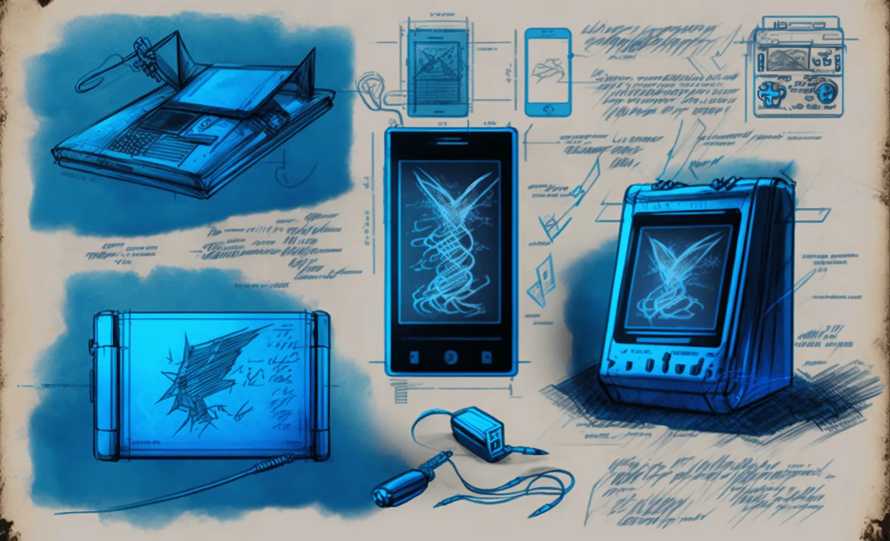

### Unduh Muun dan buat dompet milikmu

Pertama, kamu perlu mengunduh aplikasi *mobile* Muun, yang tersedia di iOS maupun Android. Pastikan selalu unduh versi yang benar, karena terkadang ada versi palsu yang beredar. Aku rekomendasikan kamu langsung ke situs resmi Muun di https://muun.com/
dan gunakan tautan sesuai sistem operasi pilihanmu (iOS/Android), biar kamu yakin aplikasi yang dipakai benar-benar resmi.

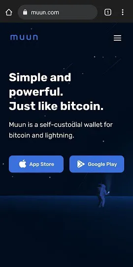

Saat kamu membuka aplikasi, akan ada opsi untuk membuat dompet baru atau memulihkan yang sudah ada. Kita mulai dulu dengan membuat dompet baru. Setelah itu, aku bakal tunjukin langkah-langkah untuk pemulihan dompet. Tekan "**Create a new wallet**".
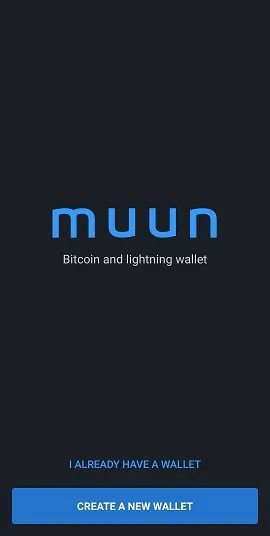

Dompet Muun kemudian akan meminta kamu membuat nomor identifikasi pribadi (PIN) empat digit. Dengan PIN ini, kamu menambah lapisan keamanan dompet agar penjahat nggak bisa mencuri ponsel dan bitcoin kamu.

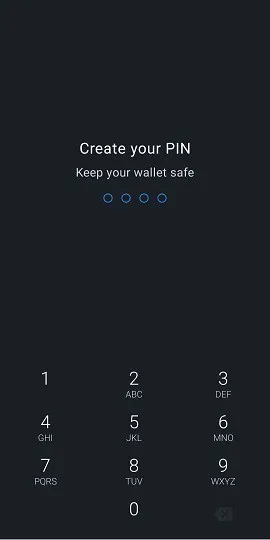

Setelah itu, dompet barumu berhasil dibuat dan yang muncul di layar adalah halaman utama. Sebelum menyimpan dana, pastikan dulu kamu mengamankan informasi pemulihan dompet, karena menyimpan dana tanpa langkah ini bisa sangat berisiko.

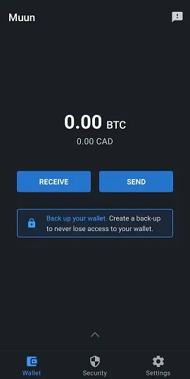

### Pencadangan Kunci

Tekan kotak "*Back up your wallet*", lalu kamu akan diarahkan ke tab "*Security*". Proses pencadangan di Muun dibagi jadi tiga langkah yang mudah diikuti. Walaupun kamu nggak wajib menjalankan semuanya, kombinasi ketiga langkah ini bakal kasih perlindungan maksimal buat kamu.

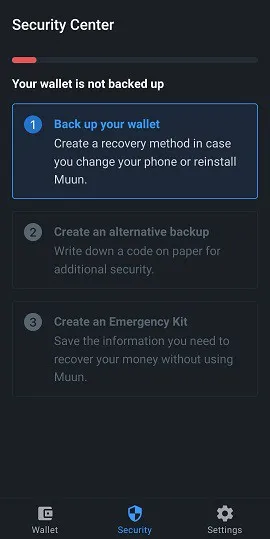

Opsi pertama memungkinkan kamu menghubungkan dompet ke alamat email dengan tambahan perlindungan password. Opsi ini sifatnya opsional dan bisa dilewati. Kalau kamu mau pakai, tekan "*1: Back up your wallet*" lalu tekan "*Start*" di layar berikutnya dan masukkan alamat email. Setelah itu, layar akan kasih tahu kalau kamu perlu validasi email dengan membuka kotak masuk dan mengklik tautan yang dikirim Muun.

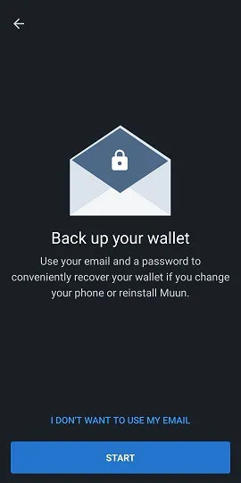

Setelah email terverifikasi, kamu akan diminta membuat kata sandi. Lalu, kamu perlu mencentang dua kotak sebagai tanda bahwa kamu paham kalau pemulihan dompet nantinya bakal butuh email dan kata sandi yang baru saja kamu buat. Ini berbeda dengan layanan lain yang biasanya kasih opsi reset kata sandi kalau kamu lupa atau hilang, jadi pastikan semuanya sudah kamu catat dengan baik.

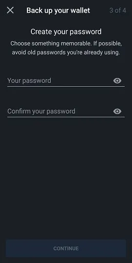
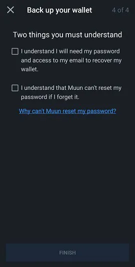

Tab "*Security*" sekarang akan menunjukkan bahwa kamu sudah punya pencadangan pertama. Kamu bisa kembali ke tab "Wallet" dan mulai pakai aplikasi untuk transaksi (fitur-fiturnya bakal dijelaskan lebih lanjut di panduan ini), dengan keyakinan bahwa dompetmu sekarang bisa dipulihkan. Tapi aku sarankan kamu juga pakai opsi keamanan #2 untuk bikin kode pencadangan tambahan, kalau-kalau kata sandi dari opsi #1 diketahui orang lain atau kalau kamu lebih pilih nggak pakai opsi pemulihan lewat email.

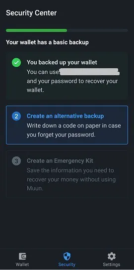
Opsi "*Alternative backup*" di Muun mirip dengan seedphrase (mnemonic phrase) yang jadi standar umum di banyak dompet Bitcoin. Tekan "*Start*" untuk menampilkan kode pemulihan dan tulis di selembar kertas (aplikasi nggak mengizinkan tangkapan layar di halaman yang menampilkan kode ini). Setelah mencatat, pastikan kodenya benar dan sesuai dengan yang muncul di layar, karena kamu bakal diminta mengetikkannya kembali untuk mengonfirmasi keakuratannya.
Sekali lagi, Muun bakal minta kamu mengonfirmasi bahwa kamu paham soal ini—bahwa kode 32 karakter ini wajib kamu simpan baik-baik, karena akan diperlukan kalau kamu kehilangan kata sandi yang sudah dibuat di langkah sebelumnya.

Sekarang, pencadangan dompetmu sudah jauh lebih aman sesuai standar modern yang kita kenal. Tapi, Muun juga punya opsi keamanan ketiga yang disebut "*Emergency Kit*". Dengan membuat Emergency Kit, kamu bisa memulihkan dompet tanpa harus pakai aplikasi Muun. Singkatnya, dompetmu bisa dipulihkan lewat perangkat lunak dompet Bitcoin lain.

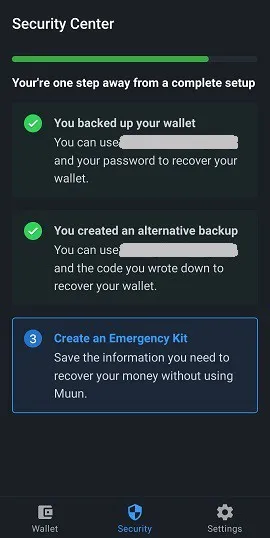

Setelah menekan "*Create an Emergency Kit*", kamu akan dijelaskan bahwa kit ini berupa dokumen PDF yang berisi informasi dan instruksi tentang cara mentransfer dana kamu secara mandiri. Nggak perlu khawatir kalau kit ini disimpan di cloud, karena tetap memerlukan "*Recovery Code*" (dari langkah pencadangan nomor 2) untuk bisa digunakan, dan kode tersebut tidak disertakan di dalam dokumen. Geser layar untuk lanjut ke halaman pembuatan Emergency Kit.

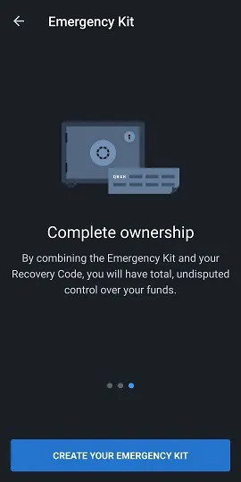

Ada tiga pilihan penyimpanan kit ini untukmu:

- Simpan ke *cloud* akun Google kamu.
- Kirim email ke alamatmu sendiri untuk mencadangkan kit dan bisa mengaksesnya kapan pun diperlukan.
- Pencadangan manual dengan aplikasi di perangkat.

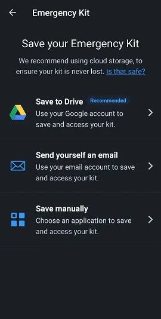

Pastikan kamu bisa mengakses kit setelah mengirimkannya ke tujuan pencadangan pilihanmu, karena Muun nanti akan minta kamu memasukkan kode enam digit yang ada di dalam kit untuk validasi.

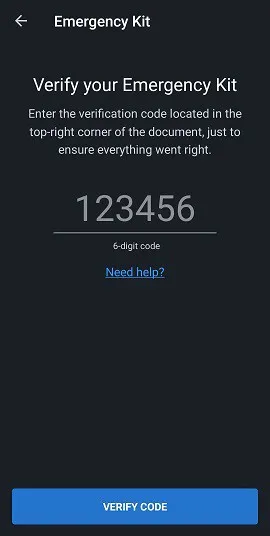

Setelah langkah terakhir ini, pengaturan keamanan dan pemulihan dompetmu sudah selesai. Sekarang kita akan menjelajahi berbagai cara untuk memulihkan dompet dengan pencadangan yang baru saja kamu buat.

## Pemulihan Dompet

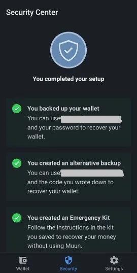

Ada banyak skenario di mana pengguna bisa kehilangan akses sementara ke dompet dan dana mereka; misalnya karena perangkat hilang, aplikasi terhapus, lupa PIN, dompet terputus, dan lain-lain. Karena itu, penting banget buat tahu cara memulihkan akses. Kalau kamu mau memulihkan lewat aplikasi Muun, tekan opsi "I already have a wallet" di layar awal saat pertama kali membuka Muun.

### Pemulihan dengan alamat email

Kalau kamu pakai opsi backup #1 di Muun, masukkan alamat email yang kamu gunakan waktu mencadangkannya. Karena opsi ini sifatnya opsional, kamu juga bisa lanjut dengan kode pemulihan, yaitu opsi #2 yang ditawarkan Muun. Tapi mari kita bahas dulu cara pemulihan lewat email.

Setelah kamu memasukkan alamat email, Muun bakal kasih tahu bahwa ada email yang dikirim ke kotak masukmu dan kamu perlu membukanya untuk mengizinkan pemulihan dompet. Cek kotak surat (termasuk folder spam) lalu klik tautan di email dari Muun. Setelah itu, kamu akan diarahkan kembali ke aplikasi, di mana layar akan minta kamu memasukkan kata sandi yang terkait dengan alamat email tersebut.

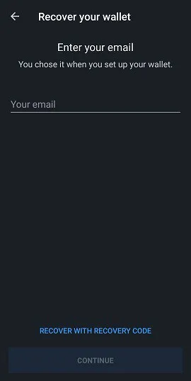

Langkah terakhir adalah membuat nomor identifikasi pribadi (PIN). Setelah itu, kamu akan kembali ke halaman utama dompet, dan saldo Bitcoin-mu akan tampil seperti sebelumnya.

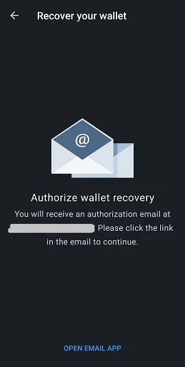

### Penggunaan "Kode Pemulihan"
Saat memulihkan akses ke dompet yang sudah ada, kamu bisa memilih untuk pakai kode pemulihan ("Recovery Code" yang diberikan Muun) yang sebelumnya sudah kamu catat kalau kamu memilih opsi backup #2. Prosesnya mirip dengan pemulihan lewat email yang dijelaskan sebelumnya. Cukup pilih opsi "Recover With Recovery Code" lalu masukkan kode tersebut ke kolom yang muncul di layar. Kalau dompetmu juga dicadangkan dengan email selain kode pemulihan, Muun bakal minta kamu cek kotak masuk email untuk konfirmasi proses pemulihan. Setelah kembali ke aplikasi lewat tautan yang disediakan, kamu harus bikin PIN lagi. Setelah itu, dompetmu bisa diakses kembali.

### Pemulihan menggunakan Emergency Kit

Untuk memulihkan dompet tanpa aplikasi Muun Wallet, kamu perlu Emergency Kit, yaitu opsi pemulihan ketiga yang ditawarkan Muun. Opsi ini memungkinkan kamu mengirim dana dari dompet Muun ke alamat Bitcoin lain. Jadi, pastikan kamu sudah punya dompet alternatif dengan alamat tujuan pengiriman dana.

Buka dokumen PDF yang kamu simpan saat membuat kit. Di dalamnya ada instruksi lengkap untuk memulihkan dompetmu. Perlu dicatat, fitur ini butuh komputer desktop atau laptop karena kamu harus mengunduh skrip yang dibuat tim pengembang Muun. Tautan unduhan sudah ada di email, tapi aku lampirkan juga di sini:
https://github.com/muun/recovery

Emergency Kit dilengkapi dengan kode verifikasi (yang sebelumnya sudah kamu gunakan saat konfirmasi pembuatan kit) serta dua kunci. Kedua kunci ini nantinya diperlukan saat kamu menjalankan skrip pemulihan Muun. Jadi, pastikan kamu sudah menyiapkannya sebelum mulai proses pemulihan dompet.

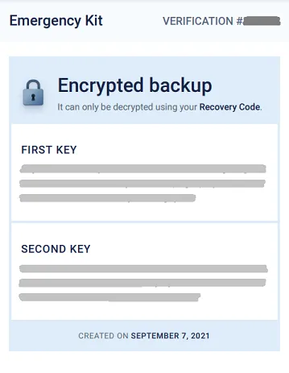

Berikut adalah terjemahan dari instruksinya:

Prosedur darurat ini akan membantu Anda memulihkan dana Anda jika Anda tidak dapat menggunakan Muun di perangkat Anda.

1. Cari kode pemulihanmu

Kamu menulis kode ini di selembar kertas sebelum membuat *emergency kit*. Kamu bakal membutuhkannya nanti.

2. Unduh alat pemulihan (*recovery tool*)

Kunjungi halaman https://github.com/muun/recovery dan unduh alat tersebut ke komputermu.

3. Pulihkan danamu

Jalankan alat pemulihan dan ikuti langkah-langkahnya. Alat tersebut akan mentransfer dana ke alamat Bitcoin yang kamu pilih.

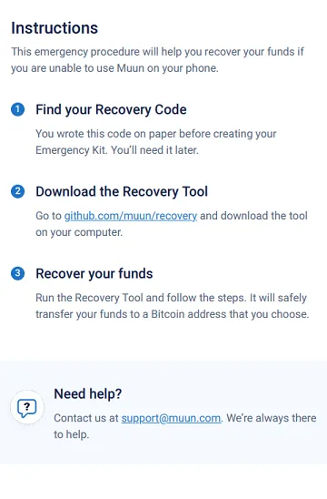

Setelah masuk ke dalam skrip, yang perlu kamu lakukan hanyalah memasukkan informasi yang diminta di layar. Skrip akan memproses pengiriman dana untukmu. Pada halaman GitHub yang tertera di atas, ada video animasi yang memperlihatkan proses ini, sehingga kamu bisa tahu tampilan apa saja yang akan muncul saat mulai menjalankan skrip pemulihan.

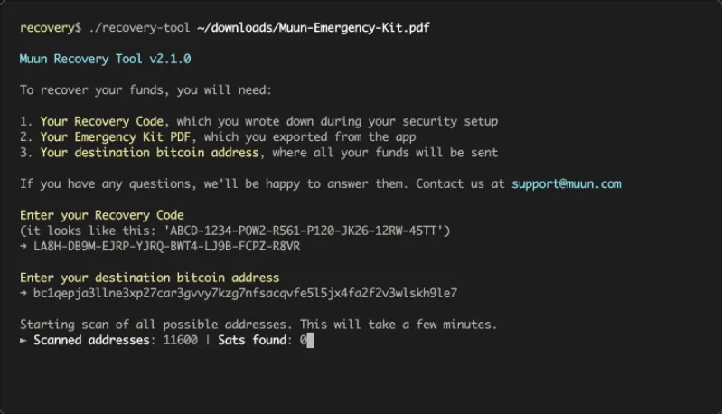

## Menerima transaksi

### Tab Bitcoin

Sekarang kita masuk ke bagian "*Receive*" dari dompet Muun dan berbagai fungsinya. Halaman utama aplikasi ada di tab "Wallet". Saldo kamu ditampilkan di tengah, dan bisa ditekan untuk menyembunyikan atau menampilkannya. Semua pengaturan aplikasi bakal kita bahas nanti di artikel ini. Untuk sekarang, mari tekan "Receive" biar kita bisa pahami fitur ini.

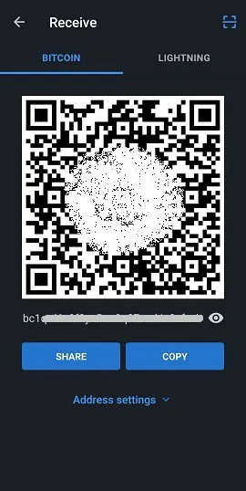
Di halaman ini, kamu bisa pilih untuk menerima transaksi lewat jaringan Bitcoin atau Lightning. Alamat baru (beserta kode QR) akan muncul sesuai jaringan yang kamu pilih. Secara default, saat membuka layar "*Receive*", yang ditampilkan adalah alamat Bitcoin. Kalau kamu tekan kode QR, alamatnya otomatis tersalin ke papan klip perangkatmu. Kamu juga bisa langsung bagikan alamat ke aplikasi lain lewat tombol "*Share*", atau salin alamat dengan tombol "*Copy*". Menekan ikon mata di ujung kanan alamat akan membuat Muun menampilkan alamat lengkap, supaya kamu bisa membandingkannya dengan alamat yang sudah tersalin ke papan klip saat pakai tombol "*Share*".
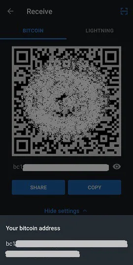

Informasi ini sudah mencakup semua yang kamu butuhkan untuk menerima transaksi di jaringan Bitcoin. Selain itu, Muun juga kasih beberapa opsi pengaturan lewat menu "*Address settings*". Pertama, kamu bisa menambahkan nominal ke deskripsi alamat. Kedua, kamu bisa pilih mau pakai alamat Segwit (default) atau alamat tradisional (legacy).

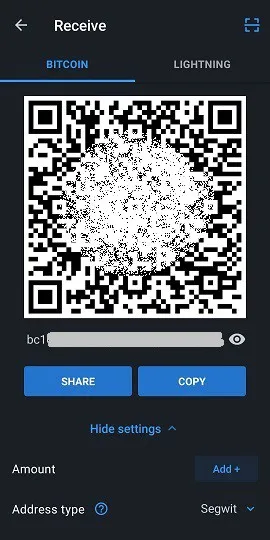

Dengan menekan "*Add +*", kamu bisa menambahkan nominal tertentu ke alamat terkait, supaya prosesnya lebih mudah buat pihak pengirim. Opsi ini sifatnya opsional. Perlu diperhatikan, setelah jumlah dimasukkan, tombol "*Copy*" di halaman sebelumnya akan menyalin alamat dengan tambahan informasi ("*bitcoin:*" sebagai awalan dan jumlah sebagai akhiran). Kalau kamu mau hindari perubahan mendadak, cukup tekan kode QR langsung untuk menyalin alamat. Informasi nominal tetap bakal terhubung ke alamat itu. Selain itu, aplikasi juga memungkinkan kamu memasukkan jumlah dalam mata uang pilihanmu, jadi lebih gampang buat konversi ke BTC.

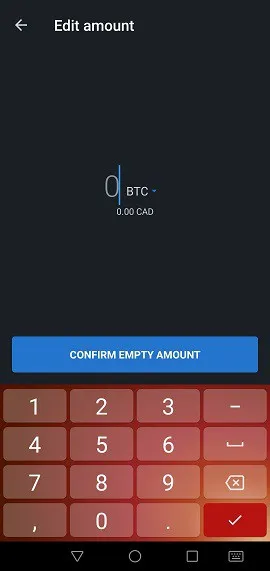

Dalam hal memilih jenis alamat, Segwit atau Legacy, aku sarankan tetap pakai Segwit. Alamat jenis ini (ditandai dengan awalan "bc1") bikin ukuran data transaksi lebih kecil, sehingga biaya transaksi juga bisa lebih rendah. Tapi, ada kalanya kamu mungkin perlu pakai sistem "*Legacy*" (alamat dengan awalan "3") kalau dompet atau perangkat lunak yang digunakan belum kompatibel dengan Segwit. Karena itu, penting buat tahu cara membedakan kedua jenis alamat ini.

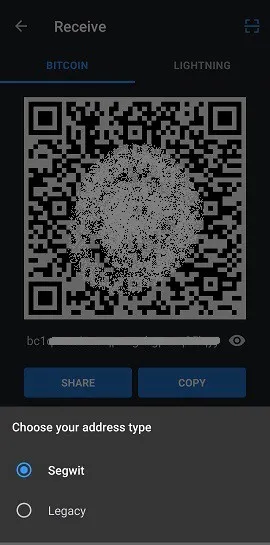

## Tab Lightning

Untuk menerima transaksi lewat jaringan Lightning, kamu perlu menekan tab Lightning di bagian atas layar. Kode QR berisi alamat Lightning akan langsung muncul, dan kamu bisa menyalin atau membagikannya dengan cara yang sama seperti alamat Bitcoin yang sudah dijelaskan sebelumnya di panduan ini. Perlu diingat, jaringan Lightning memungkinkan kamu melakukan transaksi hampir instan dengan biaya yang jauh lebih kecil dibanding biaya di jaringan Bitcoin.

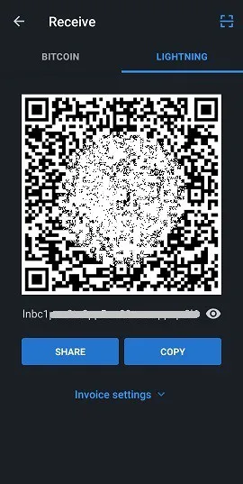

Opsi pengaturan bisa kamu temukan di bawah menu "*Invoice Settings*". Di sini, kamu bisa ubah jumlah yang terhubung dengan alamat dengan menekan "*Add +*". Dari pengalaman aku pakai jaringan Lightning, sebaiknya kamu langsung isi jumlah saat membuat transaksi, karena beberapa dompet nggak bisa membaca invoice kosong dengan baik. Kamu juga bakal lihat ada timer kedaluwarsa di menu ini. Di aplikasi Muun, timer ini diatur 60 menit, setelah itu alamat jadi nggak valid lagi. Perlu dicatat, Muun selalu bikin alamat Lightning baru setiap kali kamu ubah jumlah atau saat kamu keluar lalu balik lagi ke tab Lightning.

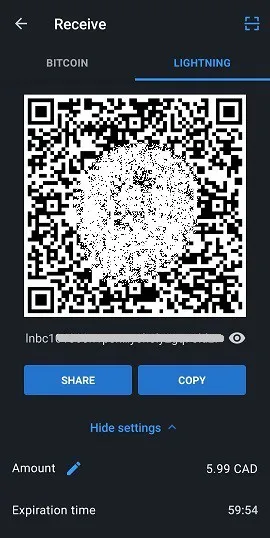

## Menggunakan fungsi LNURL
Dompet Muun juga mendukung penggunaan LNURL untuk menerima transaksi. Fitur ini bisa kamu aktifkan dengan menekan ikon pemindaian berbentuk persegi di pojok kanan atas halaman. Keuntungannya, kamu nggak perlu lagi berbagi invoice untuk menerima transaksi. Sebagai gantinya, cukup pindai kode QR untuk mendapatkan informasi pembayaran, lalu validasi agar transaksi bisa dikonfirmasi.
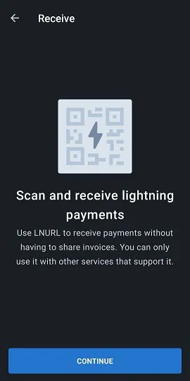

Muun pertama-tama akan menampilkan halaman penjelasan (lihat tangkapan layar di atas), lalu meminta izin akses kamera dari perangkatmu, karena langkah ini memang dibutuhkan untuk menjalankan fitur tersebut. Perlu dicatat, alamat LNURL saat ini belum didukung oleh semua dompet Lightning. Dompet yang mendukung biasanya hanya bisa memakai LNURL untuk menerima transaksi, bukan untuk mengirimkannya.

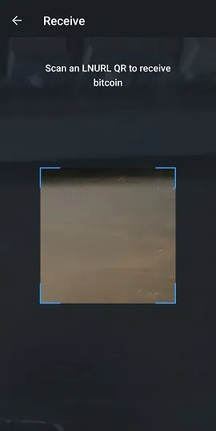

## Mengirim transaksi

### Melalui jaringan Bitcoin

Sekarang setelah kita bahas cara menerima bitcoin dengan Muun, mari kita lanjut ke cara mengirimkannya. Dari beranda di tab "*Wallet*", tekan tombol "*Send*". Akan muncul halaman di mana kamu bisa menempelkan alamat Bitcoin atau Lightning ke kolom yang tersedia, atau menekan ikon kode QR di sebelah kanan kolom tersebut untuk mengaktifkan kamera dan memindai alamat dalam bentuk kode QR.

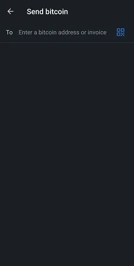
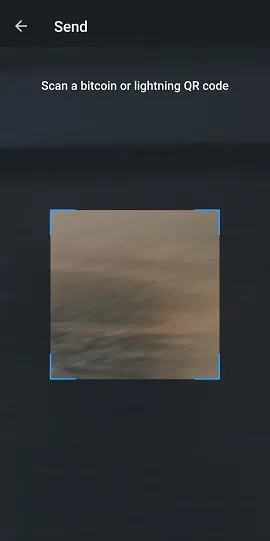

Saat kamu masuk ke halaman "*Send*", kalau sudah ada alamat yang tersalin di perangkatmu, Muun akan otomatis mengenali format alamat tersebut (Bitcoin atau Lightning) dan menyarankan untuk langsung menggunakannya dalam transaksi lewat sebuah notifikasi pesan.

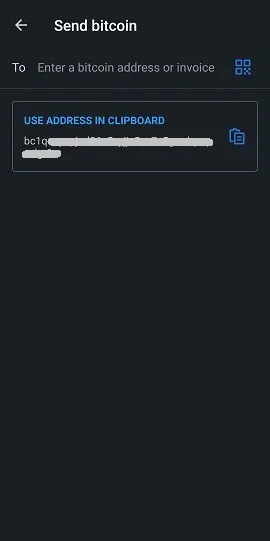
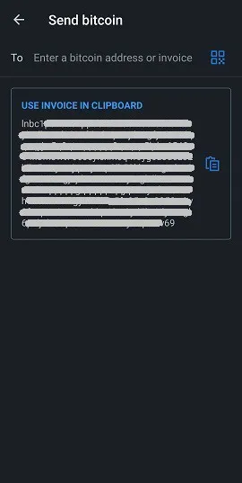

Saat menyiapkan transaksi Bitcoin, kamu perlu memasukkan jumlah yang mau dikirim. Pastikan alamat tujuan yang ditampilkan di bagian atas layar sesuai dengan alamat yang sebelumnya kamu salin. Di bawah kolom jumlah, Muun bakal menampilkan saldo dompetmu dan memberi opsi "*Use all funds*". Fitur ini sangat berguna kalau kamu mau mengosongkan dompet sepenuhnya dan menghindari meninggalkan "*debu*" (beberapa satoshi tersisa).

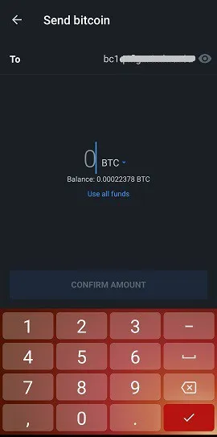

Setelah kamu mengonfirmasi jumlah yang akan dikirim, Muun akan minta kamu menulis catatan di halaman berikutnya. Catatan ini berfungsi sebagai validasi tambahan, dan kamu bebas menuliskan apa saja di kolom tersebut.

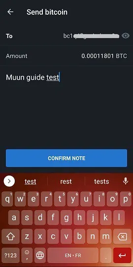

Sebelum transaksi dikirim ke jaringan Bitcoin, kamu perlu meninjau detailnya sekali lagi. Pastikan alamat dan jumlah sudah benar, lalu sesuaikan biaya transaksi kalau diperlukan dengan menekan ikon pensil biru di samping "*Network Fee*". Penting juga buat paham dasar cara kerja mempool (kolam transaksi Bitcoin), supaya kamu bisa ngerti mekanisme biaya transaksi dan belajar cara menghemat beberapa sats di masa depan!

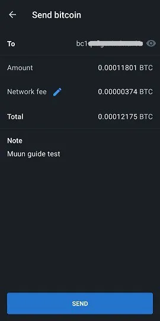

Perangkat lunak Muun secara default menggunakan algoritma yang menghitung biaya transaksi yang diperlukan untuk konfirmasi transaksi dalam 30 menit atau kurang. Inilah yang akan ditampilkan ketika Anda mencoba mengganti biaya transaksi. Tombol "*Enter Fee Manually*" memungkinkan Anda untuk menyesuaikan biaya ini sendiri, fitur yang bisa sangat berguna yang bergantung pada kebutuhan Anda akan perlu atau tidaknya konfirmasi transaksi secara cepat.

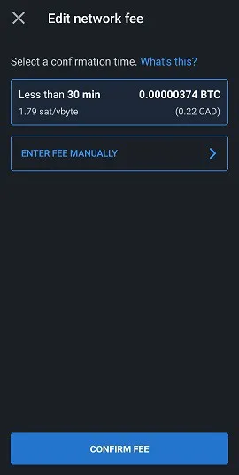
Kalau kamu pilih untuk memasukkan jumlah biaya transaksi sendiri, Muun akan bawa kamu ke halaman baru yang menampilkan biaya dalam satuan sat/vbyte (satoshi per byte virtual). Di sana, Muun juga kasih perkiraan waktu konfirmasi sesuai jumlah yang kamu pilih, plus rincian biaya dalam BTC dan juga mata uang fiat pilihanmu.
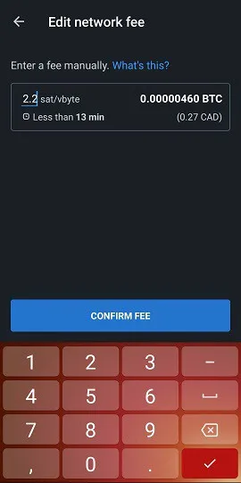
Kembali ke halaman ikhtisar detail transaksi lalu tekan "*Send*". Voilà, transaksi kamu sudah terkirim ke jaringan Bitcoin! Setelah itu kamu akan diarahkan kembali ke halaman utama dompet, dan saldo akan langsung berkurang. Di bagian bawah layar ada ikon panah yang bisa kamu tekan untuk melihat riwayat transaksi. Transaksi terbaru yang barusan kamu lakukan akan langsung muncul di daftar paling atas.
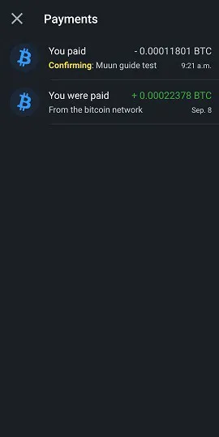

ChatGPT said:

Tekan salah satu transaksi untuk melihat detailnya. Transaksimu akan terkonfirmasi setelah penambang menambahkan blok baru yang menyertakannya ke dalam rantai. Di bagian bawah layar, Muun menampilkan ID transaksi, yang bisa kamu gunakan untuk mengecek status transaksi lewat *block explorer.*

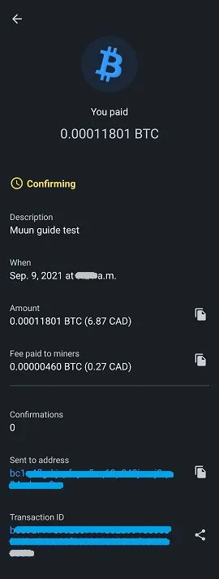

## Melalui Jaringan Lightning

Sekarang mari kita coba pakai invoice Bolt 11 (invoice Lightning tradisional/default) untuk melakukan transaksi. Salin atau pindai alamat Lightning di halaman "*Send*". Kamu akan diarahkan ke halaman baru yang menampilkan detail invoice tersebut. Jumlah transaksi akan muncul (termasuk biaya jaringan), bersama dengan catatan atau deskripsi yang ditulis pada invoice, serta timer kedaluwarsa di bagian bawah. Perlu dicatat, biaya transaksi Lightning nggak bisa kamu ubah. Biaya ini otomatis ditentukan oleh rute kanal yang harus dilewati sampai ke penerima.

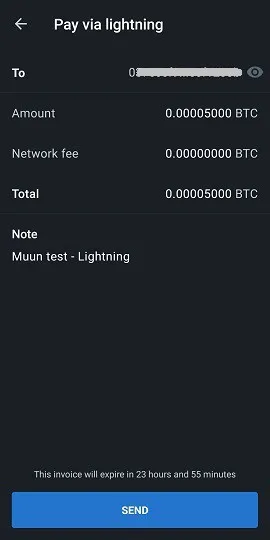

(Inilah peringatan yang muncul di layar saat kamu pakai *invoice* kosong, artinya nggak ada jumlah yang sudah diisi sebelumnya. Beberapa dompet memang mendukung invoice jenis ini dan memungkinkan kamu isi jumlah sendiri. Tapi Muun tidak mendukung hal tersebut.)

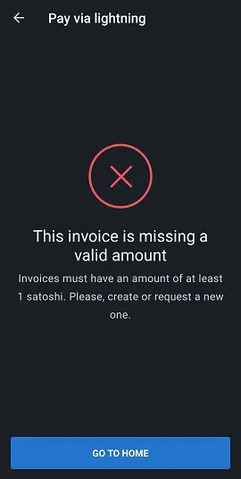

Kalau kamu menekan ikon mata, Muun akan menampilkan detail node Lightning yang terhubung dengan transaksi tersebut. Kamu bahkan bisa pilih untuk melihatnya lewat *web explorer* untuk informasi lebih lanjut. Ini jadi contoh bagus dari sisi teknis yang berhasil dihadirkan Muun.

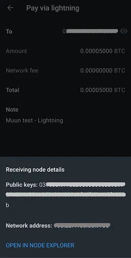

Setelah kamu menekan "*Send*", transaksi langsung dijalankan dan biasanya selesai dalam waktu kurang dari 1 detik. Jumlah yang dibayarkan otomatis terpotong dari saldo, dan langsung terlihat di halaman utama aplikasi. Kamu bisa kembali ke riwayat transaksi untuk melihat konfirmasi pembayaran secara instan.

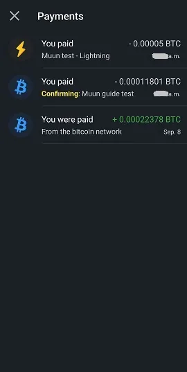

Perlu diperhatikan, di riwayat transaksi, Lightning dan Bitcoin dibedakan dengan simbol yang berbeda. Untuk melihat detail transaksi Lightning, cukup ketuk transaksi tersebut di riwayat layarmu.

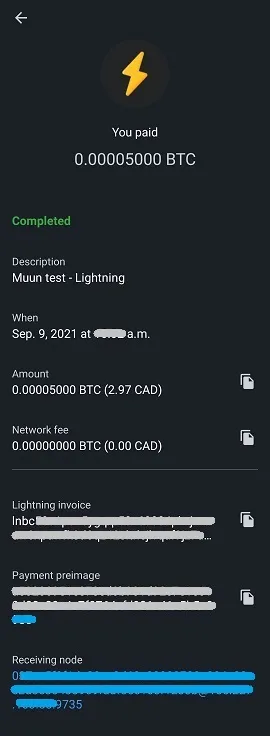

## Pengaturan Aplikasi

Tab ketiga pada halaman utama, yaitu "*Settings*", adalah tempat di mana kamu dapat menemukan pengaturan aplikasi. Bagian ini relatif sederhana jika dibandingkan dengan dompet seluler populer lainnya. Namun, justru kesederhanaan inilah yang menjadi kelebihannya, karena membuat pengalaman pengguna lebih ringkas dan mudah dipahami.

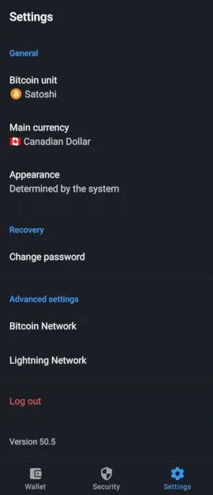

Dalam kategori umum, kamu bisa memilih unit akun dan mata uang aplikasi Muun, serta tema tampilan aplikasi (gelap atau terang), yang secara default mengikuti pengaturan sistem perangkatmu.

Untuk unit akun, kamu dapat memilih antara Bitcoin (BTC) atau Satoshi (SAT). Sebagai informasi, sebuah Satoshi adalah pecahan terkecil dari Bitcoin, di mana 1 SAT = 0.00000001 BTC. Menggunakan SAT sebagai unit akun dompet seringkali lebih disukai ketika bertransaksi di jaringan Lightning dengan jumlah kecil.

Muun juga menawarkan berbagai pilihan mata uang, sehingga memudahkan kamu untuk menghitung konversi BTC sesuai kebutuhan transaksional maupun pribadi.

Jika kamu merasa perlu mengubah kata sandi pemulihan dompet, hal itu bisa dilakukan di halaman Settings. Pastikan kamu memiliki kata sandi saat ini atau kode pemulihan, serta akses ke email yang terhubung.
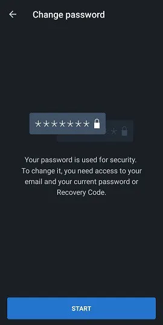

Masukkan kata sandi saat ini kamu atau pilih untuk memasukkan kode pemulihan kamu untuk memulai pengaturan ulang. Muun kemudian akan mengirimkan email ke alamat yang sudah kamu daftarkan sebelumnya.

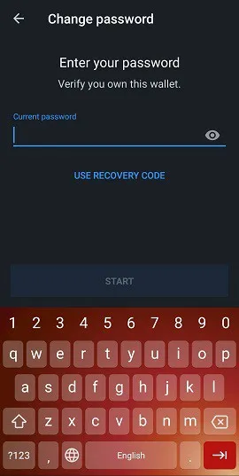
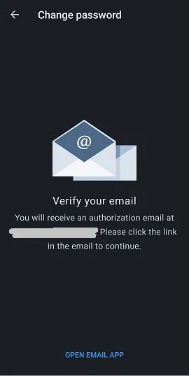

Bagian pengaturan lanjutan berisi dua hal: Jaringan Bitcoin dan Jaringan Lightning. Di Jaringan Bitcoin, kita diberi pilihan untuk mengaktifkan alamat penerimaan Taproot (bc1p, tipe alamat terbaru) secara default.

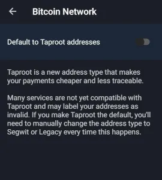

Di dalam Jaringan Lightning, kamu bakal menemukan:

- *Receiving Protocol*: Pilih jaringan penerimaan default yang ditampilkan di layar "Receive". Ada juga fitur uji coba bernama Unified, yaitu kode QR yang bisa dipakai untuk alamat Bitcoin maupun Lightning. Namun, saat ini hanya sedikit perangkat lunak Bitcoin yang mendukung fitur ini.

- *Turbo Channels*: Opsi ini memungkinkanmu untuk mengaktifkan atau menonaktifkan fitur Turbo channels. Secara default, fitur ini diaktifkan.

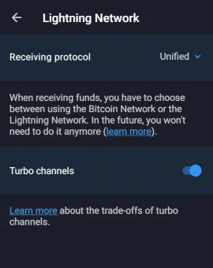

Untuk memahami apa yang disebut *Turbo channels*, kita harus terlebih dahulu tahu bahwa transaksi Lightning dilakukan melalui saluran dari satu pengguna ke pengguna lain, dan bahwa saluran-saluran ini harus didanai melalui transaksi di *blockchain* Bitcoin pada proses awalnya.

*Turbo channels* memungkinkanmu untuk bisa bertransaksi di jaringan Lightning bahkan sebelum transaksi *on-chain* apa pun telah dikonfirmasi. Kalau kamu menonaktifkan fungsi ini, maka kamu harus menunggu jauh lebih lama untuk bertransaksi di jaringan Lightning, sebagai imbalan untuk peningkatan keamanan dana-mu, karena sebaliknya kamu harus percaya bahwa Muun tidak akan menggunakan cara yang merugikan (*double-spend* yang bersifat publik) sambil menunggu transaksimu dikonfirmasi di rantai blok Bitcoin.

Di bagian bawah halaman pengaturan adalah opsi "*Log out*". kamu bisa menggunakan fungsi ini jika kamu ingin aplikasi memutuskan koneksi dengan dompet saat ini. Hal ini akan memungkinkanmu untuk membuat dompet baru atau mengimpor/memulihkan yang sudah ada.

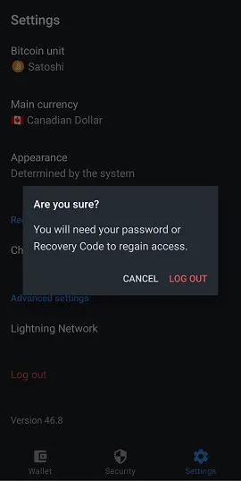
