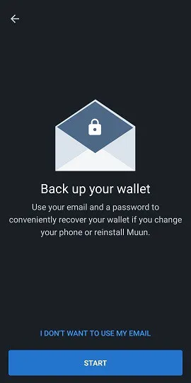
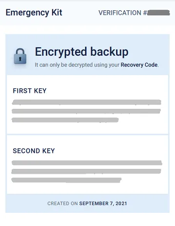
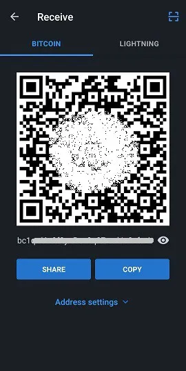
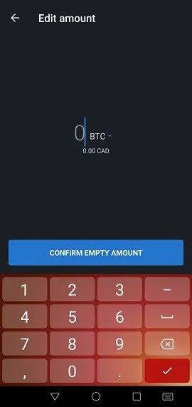
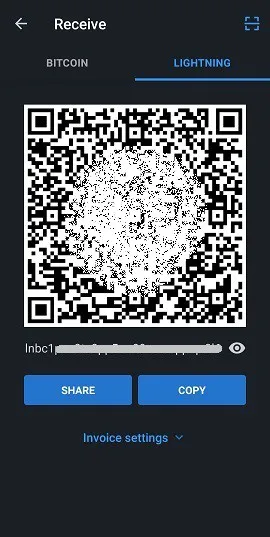
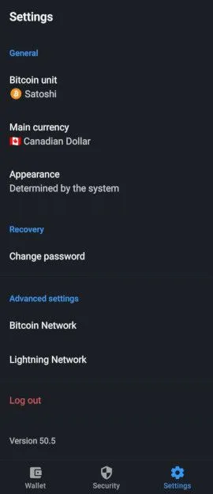
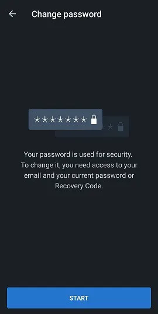

Muun (https://muun.com/) adalah dompet mandiri untuk bitcoin dan lightning.

## video tutorial

## Panduan Pengguna Muun Wallet - Lengkap

Panduan pengguna lengkap (dengan tangkapan layar) untuk aplikasi Muun; dompet Bitcoin mobile yang ramah pengguna yang memungkinkan Anda bertransaksi di Jaringan Lightning.

### Unduh Muun dan buat dompet Anda

Pertama, Anda perlu mengunduh aplikasi mobile, tersedia baik di iOS maupun Android. Pastikan selalu untuk mengunduh versi yang benar. Terkadang ada replika palsu di pasaran. Saya merekomendasikan untuk menemukan situs web dompet Muun resmi, yaitu https://muun.com/, dan menggunakan tautan untuk sistem pilihan Anda (iOS/Android), dari sana Anda bisa yakin bahwa Anda menggunakan aplikasi resmi.

Ketika Anda membuka aplikasi, Anda akan memiliki opsi untuk membuat dompet baru atau memulihkan yang sudah ada. Mari kita mulai dengan membuat dompet baru. Saya akan menunjukkan langkah-langkah untuk pemulihan dompet setelahnya. Tekan "Buat dompet baru".

Dompet Muun kemudian meminta Anda untuk membuat nomor identifikasi pribadi (PIN) empat digit. Dengan PIN, Anda meningkatkan keamanan dompet Anda jika, misalnya, aktor jahat mencuri ponsel Anda dan akibatnya bitcoin Anda.

Nah, aplikasi telah menghasilkan dompet baru yang sekarang akan menjadi halaman utama. Sekarang Anda perlu mengamankan informasi pemulihan dompet yang relevan sebelum mengirimkan dana ke sana, karena itu akan menjadi praktik yang berisiko.

### Cadangan Kunci

Tekan kotak "Cadangkan dompet Anda", dan Anda akan diarahkan ke tab "Keamanan". Proses cadangan Muun dibagi menjadi tiga langkah secara nyaman. Tidak wajib untuk menyelesaikan ketiga langkah tersebut, tetapi kombinasi dari mereka menawarkan tindakan pencegahan maksimum.

Opsi pertama memungkinkan Anda untuk menghubungkan dompet Anda ke alamat email, selain melindunginya dengan kata sandi. Opsi ini opsional dan dapat dilewati tanpa masalah. Jika Anda ingin menggunakannya, tekan "1: Cadangkan dompet Anda" lalu "Mulai" di layar berikutnya dan masukkan alamat email. Layar berikutnya akan memberi tahu Anda bahwa Anda perlu memvalidasi email dengan mengakses kotak surat Anda dan mengklik tautan yang disediakan dalam email Muun.

Setelah email diverifikasi, Anda akan diminta untuk membuat kata sandi. Kemudian, Anda perlu menandai dua kotak yang menunjukkan bahwa Anda memahami bahwa pemulihan dompet, jika diperlukan, akan memerlukan penggunaan email dan kata sandi yang baru saja Anda pilih. Ini berbeda dengan program tradisional yang memungkinkan Anda untuk mereset kata sandi Anda dalam kasus kehilangan atau lupa, jadi pastikan Anda telah mencatat semuanya.

Tab "Keamanan" sekarang menunjukkan bahwa Anda memiliki cadangan dasar. Anda sekarang dapat kembali ke tab "Dompet" dan menggunakan aplikasi untuk menyelesaikan transaksi (fungsi-fungsi ini akan dijelaskan lebih lanjut dalam panduan ini), mengetahui bahwa dompet sekarang dapat dipulihkan. Namun, saya merekomendasikan menggunakan opsi keamanan #2 untuk menghasilkan kode cadangan tambahan, jika kata sandi yang dimasukkan dalam opsi #1 dikompromikan atau jika Anda lebih memilih untuk tidak menggunakan opsi pemulihan email.

Opsi "backup alternatif" Muun mirip dengan frasa mnemonik yang digunakan oleh beberapa aplikasi dompet yang banyak dikenal oleh pengguna Bitcoin. Tekan "Mulai" untuk menampilkan kode pemulihan Anda dan tulislah pada selembar kertas (aplikasi menyensor tangkapan layar pada halaman yang menampilkan kode). Setelah dicatat, bandingkan dengan kode yang ditampilkan di layar karena Anda akan perlu mengetik ulangnya dalam aplikasi untuk mengonfirmasi keabsahannya.
Sekali lagi, Muun meminta Anda untuk mengonfirmasi pemahaman Anda tentang masalah ini, yaitu Anda akan memerlukan kode 32 karakter ini jika Anda kehilangan kata sandi yang telah Anda tetapkan sebelumnya.

Backup dompet sekarang jauh lebih aman menurut standar modern yang kita kenal. Namun, aplikasi Muun memiliki opsi keamanan ketiga yang disebut "Kit Darurat". Membuat Kit Darurat akan memungkinkan Anda untuk memulihkan dompet Anda tanpa perlu melalui Muun. Dengan kata lain, dengan menggunakan perangkat lunak dompet Bitcoin yang berbeda dari Muun.

Setelah menekan "Buat Kit Darurat", Anda akan dijelaskan bahwa kit ini berbentuk dokumen PDF yang berisi informasi & instruksi mengenai transfer dana Anda secara independen. Kit dapat disimpan di cloud tanpa khawatir karena memerlukan "Kode Pemulihan" Anda untuk digunakan, yang tidak disertakan dalam dokumen. Geser layar untuk mengakses halaman pembuatan kit.

Tiga opsi tersedia untuk Anda:

- Simpan ke cloud akun Google Anda.
- Kirim email ke alamat Anda sendiri untuk membackup kit Anda dan mengaksesnya.
- Backup manual dengan aplikasi lokal di perangkat Anda.

Pastikan Anda dapat mengakses kit Anda setelah Anda mengirimkannya ke tujuan backup pilihan Anda karena Muun kemudian akan meminta Anda, untuk tujuan validasi, untuk memasukkan kode enam digit yang ditemukan dalam kit.

Setelah langkah terakhir ini selesai, konfigurasi keamanan dan pemulihan dompet Anda sekarang telah selesai. Kita sekarang akan menjelajahi berbagai cara untuk memulihkan dompet Anda menggunakan backup yang baru dibuat.
Pemulihan Dompet

Ada banyak skenario di mana pengguna mungkin sementara kehilangan akses ke dompet & dana mereka; kehilangan perangkat, aplikasi yang dihapus/hilang, lupa nomor identifikasi pribadi, pemutusan koneksi dompet, dll. Oleh karena itu, sangat penting untuk mengetahui cara mendapatkan kembali akses ini. Saat memulihkan melalui aplikasi Muun, tekan opsi "Saya Sudah Memiliki Dompet" pada layar pembuka.

### Pemulihan dengan alamat email

Jika Anda menggunakan opsi backup #1 Muun, masukkan alamat email yang dipilih pada saat itu. Karena opsi ini opsional, Anda juga dapat memilih untuk melanjutkan dengan kode pemulihan, yang kebetulan adalah opsi #2 yang ditawarkan oleh Muun. Mari kita bahas terlebih dahulu opsi email.

Setelah alamat email Anda dimasukkan, Muun akan memberi tahu Anda bahwa email telah dikirim kepada Anda dan Anda perlu mengaksesnya untuk mengizinkan pemulihan dompet. Periksa kotak surat Anda (termasuk bagian spam) dan gunakan tautan yang disediakan dalam email Muun. Anda akan diarahkan kembali ke aplikasi di mana layar sekarang akan meminta Anda untuk memasukkan kata sandi yang terkait dengan alamat email yang terdaftar.

Langkah terakhir adalah membuat nomor identifikasi pribadi, dan kemudian Anda akan kembali ke wilayah yang familiar di halaman utama dompet, menunjukkan saldo yang terkait dengannya.

### Penggunaan "Kode Pemulihan"
Saat memulihkan akses ke dompet yang sudah ada, Anda dapat memilih untuk menggunakan kode pemulihan ("Recovery Code" sebagaimana ditetapkan oleh Muun) yang sebelumnya Anda catat jika Anda memilih opsi cadangan #2. Proses ini serupa dengan yang dijelaskan di bagian sebelumnya; pemulihan melalui email. Cukup pilih opsi "Recover With Recovery Code" dan masukkan kode tersebut ke dalam kolom yang ditampilkan di layar. Jika dompet Anda juga dicadangkan oleh email selain kode pemulihan, Muun akan meminta Anda untuk memeriksa kotak masuk email Anda untuk mengotorisasi proses pemulihan, yang dapat Anda selesaikan setelah Anda kembali ke aplikasi setelah mengklik tautan yang disediakan. Sekali lagi, Anda harus membuat nomor identifikasi pribadi. Nah, Anda akan dapat mengakses dompet Anda lagi.

### Pemulihan menggunakan Emergency Kit

Untuk memulihkan dompet Anda tanpa menggunakan aplikasi Muun Wallet, Anda akan memerlukan emergency kit, opsi pemulihan ketiga yang ditawarkan oleh Muun. Opsi ini memungkinkan Anda untuk mengirim dana yang ada di dompet Muun Anda ke alamat Bitcoin lain. Jadi, pastikan Anda memiliki dompet alternatif yang dapat menghasilkan alamat tempat Anda akan mengirim dana.

Akses dokumen PDF yang Anda simpan saat membuat kit. Dokumen ini berisi instruksi yang diperlukan untuk memulihkan dompet Anda. Perhatikan bahwa fitur ini memerlukan penggunaan komputer desktop atau laptop karena Anda perlu mengunduh skrip yang dibuat oleh tim pengembangan Muun. Tautan termasuk dalam email, tetapi saya akan membagikannya di sini juga: https://github.com/muun/recovery

Emergency kit dilengkapi dengan kode verifikasi, yang telah Anda gunakan untuk mengonfirmasi pembuatan kit, serta dua kunci. Kunci-kunci ini akan diperlukan saat Anda mengaktifkan skrip pemulihan Muun. Jadi, pastikan Anda memilikinya di tangan selama operasi.

Berikut adalah terjemahan instruksinya:

Prosedur darurat ini akan membantu Anda memulihkan dana Anda jika Anda tidak dapat menggunakan Muun di perangkat Anda.

1. Temukan kode pemulihan Anda

Anda menulis kode ini di selembar kertas sebelum membuat emergency kit. Anda akan membutuhkannya nanti.

2. Unduh alat pemulihan

Kunjungi halaman https://github.com/muun/recovery dan unduh alat tersebut ke komputer Anda.

3. Pulihkan dana Anda

Jalankan alat pemulihan dan ikuti langkah-langkahnya. Alat tersebut akan mentransfer dana Anda ke alamat Bitcoin pilihan Anda.

Setelah berada di skrip, yang harus Anda lakukan hanyalah memasukkan informasi yang diminta di layar. Skrip akan mengurus proses transfer dana untuk Anda. Di halaman "github" yang disediakan di atas, video animasi tentang proses tersebut tersedia, yang akan menunjukkan kepada Anda apa yang diharapkan saat Anda memulai skrip pemulihan.

## Menerima transaksi

### Tab Bitcoin

Sekarang, kita akan membahas bagian "Receive" dari dompet Muun dan berbagai fungsinya. Halaman utama aplikasi Anda adalah tab "Wallet". Saldo Anda ditampilkan di tengah, dan Anda dapat mengetuknya untuk beralih antara menyembunyikan jumlah dan menampilkannya. Kami akan membahas semua pengaturan aplikasi nanti dalam artikel ini. Untuk sekarang, mari kita tekan "Receive" untuk menjelajahi fungsi ini.

Di halaman ini, Anda dapat memilih untuk menerima transaksi baik di jaringan Bitcoin maupun Lightning. Alamat baru (dan kode QR yang terkait) sesuai dengan jaringan yang diinginkan akan ditampilkan. Secara default, alamat Bitcoin ditampilkan ketika Anda tiba di layar "Terima". Dengan mengetuk kode QR, alamat akan disalin ke papan klip perangkat Anda. Anda dapat dengan mudah membagikan alamat langsung ke aplikasi lain dengan tombol "Bagikan", dan Anda juga dapat menyalin alamat dengan tombol "Salin". Menekan ikon mata di akhir alamat akan menampilkan alamat lengkap, memungkinkan Anda untuk membandingkannya dengan yang disalin ke papan klip saat berbagi.

Informasi ini berisi segala yang Anda butuhkan untuk menerima transaksi di jaringan Bitcoin. Selain itu, Muun menawarkan Anda beberapa opsi kustomisasi di bawah menu "Pengaturan Alamat". Pertama, Anda dapat menambahkan jumlah ke deskripsi alamat. Kedua, Anda dapat memilih untuk menggunakan alamat Segwit (opsi default) atau alamat tradisional (legacy).

Dengan menekan "Tambah +", Anda dapat menambahkan jumlah tertentu ke alamat, membuatnya lebih mudah bagi pihak pengirim. Opsi ini bersifat opsional. Perhatikan bahwa setelah jumlah dimasukkan, tombol "Salin" di halaman sebelumnya akan menambahkan informasi ke alamat yang disalin ("bitcoin:" sebagai awalan, diikuti oleh jumlah sebagai akhiran). Untuk menghindari penyesuaian mendadak ini, tekan langsung kode QR untuk menyalin alamat. Informasi jumlah akan tetap melekat dengannya. Selain itu, aplikasi memungkinkan Anda untuk memilih memasukkan jumlah dalam mata uang pilihan Anda, memudahkan proses konversi ke BTC.

Mengenai pemilihan jenis alamat, Segwit atau Legacy, saya merekomendasikan untuk membiarkan Segwit tetap digunakan. Jenis alamat ini (dimulai dengan "bc1") mengurangi ukuran data transaksi dan dengan demikian mengurangi biaya transaksi yang terkait. Namun, mungkin Anda perlu menggunakan sistem "Legacy" (alamat dimulai dengan "3") dalam kejadian dompet atau perangkat lunak tidak kompatibel dengan alamat Segwit. Oleh karena itu, penting untuk mengetahui cara membedakan antara kedua jenis tersebut.

## Tab Lightning

Untuk menerima transaksi melalui jaringan Lightning, Anda perlu mengetuk tab dengan nama yang sama di bagian atas layar. Kode QR yang berisi alamat Lightning sekarang akan ditampilkan, yang dapat Anda salin dan bagikan dengan cara yang sama seperti alamat Bitcoin yang disebutkan sebelumnya dalam panduan ini. Saya mengingatkan Anda bahwa jaringan Lightning memungkinkan Anda menikmati kecepatan transaksi yang hampir instan selain biaya transaksi yang hanya sebagian kecil dari biaya pada rantai Bitcoin.

Opsi kustomisasi dapat ditemukan di bawah menu "Pengaturan Invoice". Di sini, Anda dapat mengubah jumlah yang terkait dengan alamat dengan mengetuk "Tambah +". Berdasarkan pengalaman saya dengan jaringan Lightning, saya percaya lebih baik memasukkan jumlah saat membuat transaksi karena beberapa dompet tidak merespons dengan baik terhadap invoice kosong. Anda juga akan melihat bahwa ada timer kedaluwarsa di menu ini. Dalam aplikasi ini, timer diatur selama 60 menit, setelah itu alamat akan menjadi tidak valid. Perhatikan bahwa Muun menghasilkan alamat Lightning baru setiap kali Anda membuat perubahan pada jumlah atau ketika Anda keluar dan kembali ke halaman.

## Menggunakan fungsi LNURL
Dompet Muun menawarkan kemampuan untuk menggunakan LNURL untuk menerima transaksi. Fungsi ini, yang diaktifkan dengan mengetuk simbol pemindaian persegi yang terletak di pojok kanan atas halaman, memiliki beberapa keuntungan, termasuk menghindari kebutuhan untuk berbagi faktur untuk menerima transaksi. Sebagai gantinya, Anda perlu memindai kode QR untuk menerima informasi pembayaran, yang kemudian dapat Anda validasi untuk mengonfirmasi proses transaksi.

Muun akan awalnya menunjukkan kepada Anda sebuah halaman penjelasan (lihat tangkapan layar di atas) dan kemudian meminta Anda untuk mengaktifkan input kamera dari perangkat Anda, sebuah langkah yang diperlukan untuk menggunakan aplikasi. Harap dicatat bahwa alamat LNURL saat ini tidak didukung oleh semua dompet Lightning. Mereka yang mendukungnya umumnya hanya menawarkan kemampuan untuk menggunakan LNURL untuk menerima transaksi dan tidak untuk mengirimkannya.

## Mengirim transaksi

### Melalui jaringan Bitcoin

Sekarang setelah kita telah melihat cara menerima bitcoin dengan Muun, mari kita jelajahi cara mengirimkannya. Kembali ke beranda di bawah tab "Wallet", Anda perlu menekan "Send". Sebuah halaman sederhana akan muncul di mana Anda akan memiliki opsi untuk menyalin alamat Bitcoin atau Lightning ke dalam bidang yang ditentukan atau menekan ikon kode QR di sebelah kanan bidang ini untuk mengaktifkan kamera dan memindai alamat dalam bentuk kode QR.

Ketika Anda tiba di halaman "Send", jika Anda sudah memiliki alamat yang disalin pada perangkat Anda, Muun akan mengenali format alamat (Bitcoin atau Lightning) dan menyarankan menggunakannya untuk menyiarkan transaksi melalui pesan berbingkai.

Saat mempersiapkan transaksi Bitcoin, Anda perlu memasukkan jumlah yang akan dikirim. Pastikan bahwa alamat tujuan yang ditampilkan di bagian atas layar cocok dengan alamat yang sebelumnya disalin. Di bawah jumlah yang akan dikirim, Muun menampilkan saldo dompet Anda dan memberi Anda opsi untuk menggunakan semua dana Anda, fitur yang sangat berguna jika Anda ingin mengosongkan dompet Anda sepenuhnya dan menghindari meninggalkan "debu" (beberapa satoshi).

Setelah mengonfirmasi jumlah yang akan dikirim, Muun meminta Anda di halaman berikutnya untuk menulis catatan. Ini berfungsi sebagai validasi tambahan, dan Anda bebas menulis apa pun yang Anda inginkan, relevan atau tidak.

Tinjauan akhir dari detail transaksi diperlukan sebelum akhirnya menyiarkannya. Validasi alamat dan jumlah yang dimasukkan, kemudian sesuaikan biaya transaksi jika diperlukan dengan menekan ikon pensil biru di sebelah kanan "Biaya Jaringan". Memahami dasar-dasar cara kerja kolam transaksi Bitcoin (mempool) adalah pengalaman edukatif yang baik yang bisa menghemat banyak satoshi Anda dari waktu ke waktu!

Perangkat lunak Muun secara default mengimplementasikan algoritma yang menghitung biaya transaksi yang diperlukan untuk konfirmasi dalam 30 menit atau kurang. Inilah yang akan ditampilkan ketika Anda mencoba memodifikasi biaya transaksi. Tombol "Masukkan Biaya Secara Manual" memungkinkan Anda untuk menyesuaikan detail ini sendiri, fitur yang bisa sangat berguna jika Anda memerlukan konfirmasi lebih cepat atau, sebaliknya, jika Anda memiliki margin manuver yang luas.

Dengan memilih untuk memasukkan jumlah biaya transaksi sendiri, Anda akan dibawa ke halaman baru yang menunjukkan jumlah yang harus dimasukkan dalam sat/vbyte (satoshi per byte virtual). Muun bahkan menampilkan perkiraan waktu konfirmasi yang terkait dengan jumlah yang dipilih, serta biaya dalam BTC dan mata uang fiat pilihan Anda.

Kembali ke halaman ikhtisar detail transaksi dan tekan "Kirim". Voilà, transaksi Anda disiarkan di jaringan Bitcoin! Anda akan diarahkan kembali ke halaman utama dompet di mana Anda akan melihat pengurangan dari saldo Anda. Di bagian bawah layar, ada sebuah panah yang dapat Anda tekan untuk memeriksa riwayat transaksi Anda. Transaksi yang baru saja Anda lakukan akan ditambahkan pada saat awal penerbitannya.

Tekan sebuah entri untuk melihat detail dari transaksi tertentu. Transaksi Anda akan dikonfirmasi ketika seorang penambang menambahkan blok baru yang mengandungnya ke dalam rantai. Muun membagikan ID transaksi di bagian bawah layar, memungkinkan Anda untuk memeriksa status transaksi Anda pada sebuah block explorer.

## Melalui Jaringan Lightning

Sekarang mari kita gunakan invoice Bolt 11 (invoice Lightning tradisional/default) untuk melakukan transaksi. Salin atau pindai alamat Lightning di halaman "Kirim". Anda akan diarahkan ke halaman baru yang menunjukkan detail dari invoice saat ini. Jumlah transaksi akan ditampilkan (termasuk biaya jaringan), bersama dengan catatan atau deskripsi yang ditulis pada invoice, dan timer kedaluwarsa di bagian bawah. Perhatikan bahwa biaya transaksi tidak dapat dimodifikasi untuk transaksi Lightning. Biaya tersebut ditentukan oleh rute kanal yang harus dilalui untuk mencapai penerima.

(Ini adalah peringatan yang ditampilkan di layar ketika menggunakan invoice kosong, yang berarti tidak ada jumlah yang telah diisi sebelumnya. Beberapa dompet mendukung jenis invoice ini dan memungkinkan Anda untuk menyesuaikan jumlahnya sendiri. Ini bukan kasus untuk Muun.)

Menekan ikon mata menunjukkan detail dari node Lightning yang Anda hadapi dalam transaksi ini. Anda bahkan memiliki opsi untuk melihat web explorer untuk informasi lebih lanjut. Ini adalah contoh baik dari abstraksi teknis yang dicapai oleh Muun.

Setelah Anda menekan "Kirim", transaksi Anda akan diluncurkan dan, biasanya, selesai dalam sebagian kecil detik. Jumlah yang dibayarkan akan dikurangkan dari saldo Anda, terlihat di halaman utama aplikasi. Kembali ke riwayat transaksi Anda untuk melihat konfirmasi pembayaran secara instan.

Perhatikan bahwa dalam riwayat, transaksi Lightning & Bitcoin dibedakan dengan simbol yang berbeda. Untuk melihat detail dari transaksi Lightning, ketuk pada riwayat layar Anda.

## Pengaturan Aplikasi

Tab ketiga di halaman utama, "Pengaturan," adalah tempat Anda dapat menemukan pengaturan aplikasi. Halaman ini cukup singkat, terutama jika dibandingkan dengan dompet seluler populer lainnya. Menurut saya, ini bukan sebuah kelemahan; sebaliknya, saya melihatnya sebagai keuntungan dalam hal kesederhanaan.

Dalam kategori umum, Anda dapat memilih unit akun dan mata uang yang Anda sukai, serta tema tampilan aplikasi (gelap atau terang), yang awalnya akan ditentukan berdasarkan sistem perangkat Anda.

Untuk unit akun aplikasi, pilih antara Bitcoin (BTC) atau Satoshi (SAT). Hanya untuk informasi Anda, sebuah Satoshi adalah pecahan terkecil dari bitcoin, yang berada di tempat desimal kedelapan (1 SAT = 0.00000001 BTC). Mendominasi dompet dalam Satoshis seringkali lebih disukai ketika menggunakan jaringan Lightning dengan jumlah kecil.

Muun menawarkan berbagai pilihan mata uang, membuatnya lebih mudah bagi Anda untuk menemukan konversi BTC yang diperlukan untuk kebutuhan transaksional dan/atau pribadi Anda.
Jika Anda merasa perlu untuk mengubah kata sandi pemulihan dompet Anda, Anda dapat melakukannya di halaman pengaturan. Pastikan Anda memiliki kata sandi saat ini atau kode pemulihan dan akses ke email Anda.

Masukkan kata sandi saat ini Anda atau pilih untuk memasukkan kode pemulihan Anda untuk memulai pengaturan ulang. Muun akan mengirimkan email ke alamat yang telah terdaftar sebelumnya.

Bagian pengaturan lanjutan berisi dua entri: Jaringan Bitcoin dan Jaringan Lightning. Di Jaringan Bitcoin, kita diberi pilihan untuk mengaktifkan alamat penerimaan Taproot (bc1p, tipe alamat terbaru) secara default.

Di dalam Jaringan Lightning, Anda akan menemukan:

- Protokol Penerimaan: Pilih jaringan penerimaan default Anda yang ditampilkan di layar Terima. Sebuah fungsi eksperimental, Unified, juga tersedia. Ini adalah kode QR yang menyatukan kedua alamat Bitcoin dan Lightning. Namun, sedikit perangkat lunak Bitcoin yang saat ini mendukung fitur ini.
-
- Turbo Channels: Opsi ini memungkinkan Anda untuk mengaktifkan atau menonaktifkan fitur Turbo channels. Secara default, fitur ini diaktifkan.

Untuk memahami apa yang disebut Turbo channels, kita harus terlebih dahulu tahu bahwa transaksi Lightning dilakukan melalui saluran dari satu pengguna ke pengguna lain, dan bahwa saluran-saluran ini harus awalnya didanai oleh transaksi di blockchain Bitcoin.

Turbo channels memungkinkan Anda untuk mulai bertransaksi di jaringan Lightning bahkan sebelum transaksi on-chain apa pun telah dikonfirmasi. Menonaktifkan fungsi ini akan berarti bahwa Anda harus menunggu jauh lebih lama untuk bertransaksi di jaringan Lightning, sebagai imbalan untuk peningkatan keamanan dana Anda, karena sebaliknya Anda harus percaya bahwa Muun tidak akan bertindak dengan cara yang merugikan (double-spend yang sangat publik) sambil menunggu transaksi Anda dikonfirmasi di blockchain.

Di bagian bawah halaman pengaturan adalah opsi "Log out". Anda dapat menggunakan fungsi ini jika Anda ingin aplikasi memutuskan koneksi dompet yang saat ini dikenali. Ini akan memungkinkan Anda untuk membuat dompet baru atau mengimpor/memulihkan yang sudah ada.

