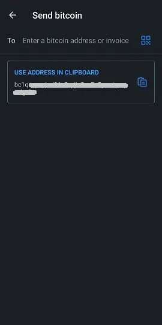

Muun (https://muun.com/) è un portafoglio auto-custodito per bitcoin e lightning.

## tutorial video

## Muun Wallet - Guida completa all'uso

Guida completa all'uso (con screenshot) dell'applicazione Muun; un portafoglio mobile Bitcoin user-friendly che consente di effettuare transazioni sulla rete Lightning.

### Scaricare Muun e creare il proprio portafoglio

Innanzitutto, è necessario scaricare l'applicazione mobile, disponibile sia su iOS che su Android. Assicurati sempre di scaricare la versione corretta. A volte ci sono repliche fraudolente sul mercato. Ti consiglio di trovare il sito web ufficiale di Muun wallet, ovvero https://muun.com/, e utilizzare il link per il tuo sistema preferito (iOS/Android), in questo modo sarai sicuro di utilizzare l'applicazione ufficiale.

All'apertura dell'applicazione, avrai la possibilità di creare un nuovo portafoglio o recuperarne uno esistente. Iniziamo creando un nuovo portafoglio. Successivamente mostrerò i passaggi per il recupero del portafoglio. Premi su "Crea un nuovo portafoglio".

Muun wallet ti chiederà quindi di creare un numero di identificazione personale (NIP/PIN) di quattro cifre. Con un PIN aumenti la sicurezza del tuo portafoglio nel caso in cui, ad esempio, un attore malintenzionato ti rubi il telefono e di conseguenza i tuoi bitcoin.

Ecco fatto, l'applicazione ha generato un nuovo portafoglio che diventerà la tua home page. Ora è necessario proteggere le informazioni rilevanti per il recupero del portafoglio prima di inviare fondi, altrimenti sarebbe una pratica rischiosa.

### Backup della chiave

Premi sulla sezione "Effettua il backup del tuo portafoglio", verrai reindirizzato alla scheda "Sicurezza". Il processo di backup di Muun è suddiviso in tre fasi. Non è obbligatorio completare tutte e tre le fasi, ma la combinazione di esse offre il massimo della sicurezza.

La prima opzione consente di collegare il portafoglio a un indirizzo e-mail e di proteggerlo con una password. Questa opzione è facoltativa e può essere saltata senza problemi. Se desiderate utilizzarla, premete "1: Backup del portafoglio" e poi "Avvia" nella schermata successiva e inserite un indirizzo e-mail. La schermata successiva vi dirà che dovete convalidare l'e-mail accedendo alla vostra casella di posta elettronica e cliccando sul link fornito nell'e-mail di Muun.

immagine](assets/6.webp)

Una volta verificata l'e-mail, vi verrà chiesto di creare una password. Verrà poi chiesto di spuntare due caselle in cui si dichiara di essere consapevoli che il recupero del portafoglio, se avverrà, richiederà l'uso dell'e-mail e della password appena scelti. Ciò è in contrasto con i programmi tradizionali che offrono la possibilità di reimpostare la password in caso di perdita o dimenticanza, quindi assicuratevi di averla scritta.

La scheda "Sicurezza" indica ora che si dispone di un backup di base. È quindi possibile tornare alla scheda "Portafoglio" e utilizzare l'applicazione per completare le transazioni (queste funzioni saranno descritte in dettaglio più avanti in questa guida), sapendo che il portafoglio è ora recuperabile. Tuttavia, vi consiglio di utilizzare l'opzione di sicurezza #2 per generare un codice di backup aggiuntivo, nel caso in cui la password inserita nell'opzione #1 sia compromessa o preferiate non utilizzare l'opzione di recupero via e-mail.

L'opzione "backup alternativo" di Muun è simile alla mnemonica utilizzata da molte applicazioni di portafoglio a cui molti utenti di Bitcoin sono abituati. Premete "Start" per visualizzare il vostro codice di recupero e scrivetelo su un pezzo di carta (l'applicazione censura lo screenshot sulla pagina che mostra il codice). Una volta scritto, confrontatelo con il codice visualizzato sullo schermo, poiché dovrete poi riscriverlo nell'applicazione per confermarne la validità.

Ancora una volta, Muun vi chiede di confermare la vostra comprensione della questione, ossia che avrete bisogno di questo codice di 32 caratteri nel caso in cui perdiate la password precedentemente impostata.

Il backup del portafoglio è ormai ampiamente sicuro secondo gli standard moderni. Tuttavia, l'applicazione Muun include una terza opzione di sicurezza chiamata "Kit di emergenza". La creazione del Kit di emergenza consente di recuperare il portafoglio senza dover passare per Muun. In altre parole, utilizzando un software per portafogli Bitcoin diverso da Muun.

Dopo aver premuto su "Crea un Kit di Emergenza", ti verrà spiegato che questo kit viene fornito sotto forma di un documento PDF contenente informazioni e istruzioni relative al trasferimento dei tuoi fondi in modo indipendente. Il kit può essere archiviato sul cloud senza problemi in quanto richiede il tuo "Codice di Recupero" per essere utilizzato, che non è presente nel documento in questione. Scorri lo schermo per accedere alla pagina di creazione del kit.

Hai tre opzioni:

- Salva sul cloud del tuo account Google.
- Invia un'email al tuo indirizzo personale per salvare il tuo kit e accedervi.
- Salva manualmente con un'applicazione locale sul tuo dispositivo.

Assicurati di poter consultare il tuo kit una volta che l'hai inviato alla tua destinazione di backup preferita, poiché Muun ti chiederà successivamente, per scopi di convalida, di inserire un codice di sei cifre presente nel kit.

Una volta completato questo ultimo passaggio, la tua configurazione di sicurezza e di ripristino del portafoglio è ora completa. Ora esploreremo i diversi modi per recuperare il tuo portafoglio utilizzando i backup appena creati.
Recupero di un portafoglio

Ci sono molti scenari in cui un utente può temporaneamente perdere l'accesso al suo portafoglio e ai suoi fondi; perdita del dispositivo, disinstallazione/scomparsa dell'applicazione, dimenticanza del codice PIN, disconnessione del portafoglio, ecc. È quindi fondamentale sapere come recuperare questo accesso. Durante il recupero tramite l'applicazione Muun, premi sull'opzione "Ho già un portafoglio" sulla schermata di apertura.

### Recupero tramite indirizzo email

Se hai utilizzato l'opzione di backup n. 1 di Muun, inserisci l'email che hai scelto in quel momento. Poiché questa opzione è facoltativa, puoi anche optare per continuare con il codice di recupero, che è l'opzione n. 2 offerta da Muun. Esaminiamo prima l'opzione tramite email.

Una volta inserito il tuo indirizzo email, Muun ti informerà che ti è stato inviato un'email e che devi accedervi per autorizzare il recupero del portafoglio. Controlla la tua casella di posta (anche la cartella dello spam) e utilizza il link fornito nell'email di Muun. Sarai reindirizzato nell'applicazione dove lo schermo ti chiederà ora di inserire la tua password associata all'indirizzo email inserito.

L'ultimo passaggio è creare un codice PIN, quindi tornerai nella schermata principale del portafoglio, che ti mostrerà il saldo associato ad esso.

### Utilizzo del "Codice di Recupero"

Durante il recupero dell'accesso a un portafoglio esistente, puoi scegliere di utilizzare il codice di recupero ("Recovery Code" come indicato da Muun) che hai annotato in precedenza se hai optato per l'opzione di backup #2.

Questo processo è simile a quello dettagliato nella sezione precedente; recupero tramite email. Semplicemente scegli di utilizzare l'opzione "Recupera con il Codice di Recupero" e inseriscilo nei campi appropriati visualizzati sullo schermo. Se il tuo portafoglio è anche backuppato tramite email oltre al codice di recupero, Muun ti chiederà di controllare la tua casella di posta per autorizzare il processo di recupero, che potrai completare una volta tornato nell'applicazione dopo aver premuto sul link fornito. Anche questa volta dovrai creare un numero di identificazione personale. Ecco, avrai di nuovo accesso al tuo portafoglio.

### Recupero tramite Emergency Kit

Per recuperare il tuo portafoglio senza utilizzare l'applicazione Muun Wallet, avrai bisogno del tuo kit di emergenza (Emergency Kit), la terza opzione di recupero offerta da Muun. Questa opzione ti consente di inviare i fondi detenuti nel tuo portafoglio Muun a qualsiasi altro indirizzo Bitcoin. Assicurati quindi di avere un portafoglio alternativo in grado di generare un indirizzo a cui inviare i fondi.

Accedi al documento PDF che hai salvato durante la creazione del kit. Questo documento contiene le istruzioni necessarie per il recupero del tuo portafoglio. Nota che questa funzionalità richiede l'uso di un computer desktop o portatile in quanto è necessario scaricare uno script creato dal team di sviluppo di Muun. Il link è incluso nell'email, ma lo condivido comunque qui: https://github.com/muun/recovery

Il kit di emergenza è dotato di un codice di verifica, che hai già utilizzato in precedenza per confermare la creazione del kit, e di due chiavi. Le chiavi saranno necessarie quando attiverai lo script di recupero di Muun. Assicurati quindi di averle a portata di mano durante l'operazione.

Ecco la traduzione delle istruzioni:

Questa procedura di emergenza ti aiuterà a recuperare i tuoi fondi se non sei in grado di utilizzare Muun sul tuo dispositivo.

1. Trova il tuo codice di recupero

Hai scritto questo codice su un pezzo di carta prima di creare il tuo kit di emergenza. Ne avrai bisogno in seguito.

2. Scarica lo strumento di recupero

Vai alla pagina https://github.com/muun/recovery e scarica lo strumento sul tuo computer.

3. Recupera i tuoi fondi

Esegui lo strumento di recupero e segui i passaggi. Lo strumento si occuperà di trasferire i tuoi fondi a un indirizzo Bitcoin a tua scelta.

Una volta nel programma, ti basterà inserire le informazioni richieste sullo schermo. Il programma si occuperà del processo di trasferimento dei fondi per te. Sulla pagina "github" fornita sopra, è disponibile un video animato del processo, che ti permetterà di vedere esattamente cosa ti aspetta quando avvierai il programma di recupero.

## Ricevere transazioni

### Scheda Bitcoin

Ora passeremo alla sezione "Ricevi" del portafoglio Muun e alle sue diverse funzioni. La schermata iniziale dell'applicazione è quella della scheda "Portafoglio". Il tuo saldo viene visualizzato al centro, puoi toccarlo per alternare tra la mascheratura dell'importo e la sua visualizzazione. Esamineremo tutti i parametri dell'applicazione più avanti in questo articolo. Per ora, premiamo su "Ricevi" per esplorare questa funzione.

In questa pagina, puoi scegliere di ricevere una transazione sia sulla rete Bitcoin che sulla Lightning. Verrà visualizzato un nuovo indirizzo (e il relativo codice QR) corrispondente alla rete desiderata. Di default, viene visualizzato un indirizzo Bitcoin quando si arriva alla schermata "Ricevi". Toccando il codice QR, l'indirizzo verrà copiato negli appunti del tuo dispositivo. Puoi facilmente condividere l'indirizzo direttamente con altre applicazioni utilizzando il pulsante "Condividi" e puoi anche copiare l'indirizzo con il pulsante "Copia". Toccando l'icona dell'occhio alla fine dell'indirizzo, verrà visualizzato l'indirizzo completo, consentendoti di confrontarlo con quello copiato negli appunti durante la condivisione.

Queste informazioni contengono tutto il necessario per ricevere transazioni sulla rete Bitcoin. Inoltre, Muun offre alcune opzioni di personalizzazione nel menu "Impostazioni indirizzo". In primo luogo, è possibile aggiungere un importo alla descrizione dell'indirizzo. In secondo luogo, puoi scegliere di utilizzare un indirizzo Segwit (opzione predefinita) o un indirizzo tradizionale (legacy).

Premendo su "Aggiungi +", puoi aggiungere un importo specifico all'indirizzo, semplificando così il compito del mittente. Questa opzione è facoltativa. Nota che una volta inserito un importo, il pulsante "Copia" della pagina precedente aggiungerà informazioni all'indirizzo copiato ("bitcoin:" come prefisso, seguito dall'importo come suffisso). Per evitare di dover gestire questa situazione imprevista, tocca direttamente il codice QR per copiare l'indirizzo. Le informazioni sull'importo rimarranno associate ad esso. Inoltre, l'applicazione ti consente di scegliere di inserire l'importo nella valuta di tua scelta, semplificando così il processo di conversione in BTC.

Per quanto riguarda la selezione del tipo di indirizzo, Segwit o Legacy, consiglio di lasciare Segwit attivo. Questo tipo di indirizzo (che inizia con "bc1") riduce la quantità di dati della transazione e quindi riduce le commissioni di transazione associate. Tuttavia, potrebbe essere necessario utilizzare il sistema "Legacy" (indirizzo che inizia con "3") nel caso in cui un portafoglio o un software non sia compatibile con gli indirizzi Segwit. È quindi importante saper distinguere tra i due tipi.

## Scheda Lightning

Per ricevere transazioni tramite la rete Lightning, è necessario fare clic sulla scheda con lo stesso nome in alto dello schermo. Verrà visualizzato un codice QR contenente un indirizzo Lightning, che potrete copiare e condividere allo stesso modo degli indirizzi Bitcoin menzionati in precedenza in questa guida. Vi ricordo che la rete Lightning vi consente di beneficiare di una velocità di transazione quasi istantanea oltre a commissioni di transazione che sono una frazione di quelle sulla catena Bitcoin.

Le opzioni di personalizzazione si trovano nel menu "Impostazioni fattura". Qui è possibile modificare l'importo associato all'indirizzo premendo su "Aggiungi +". Sulla base della mia esperienza con la rete Lightning, ritengo che sia meglio inserire un importo durante la creazione della transazione perché molti portafogli reagiscono male alle fatture vuote. Inoltre, noterete che c'è un timer di scadenza in questo menu. In questa applicazione, il timer è impostato su 60 minuti, dopo i quali l'indirizzo sarà invalido. Tenete presente che Muun genera un nuovo indirizzo Lightning ogni volta che apportate una modifica all'importo o quando uscite e tornate alla pagina.

## Utilizzare la funzione LNURL

Il portafoglio Muun offre la possibilità di utilizzare LNURL per ricevere transazioni. Questa funzione, che si attiva premendo il simbolo quadrato di scansione in alto a destra della pagina, ha alcuni vantaggi, tra cui evitare di dover condividere una fattura per ricevere una transazione. Invece, è necessario scansionare un codice QR per ricevere le informazioni di pagamento che potrete poi confermare per confermare il processo di transazione.

Inizialmente, Muun mostrerà una pagina esplicativa (vedi screenshot sopra) e quindi vi chiederà di attivare l'accesso alla fotocamera del vostro dispositivo, un passaggio necessario per l'utilizzo dell'applicazione. Sappiate che gli indirizzi LNURL attualmente non sono supportati da tutti i portafogli Lightning. Quelli che li supportano di solito offrono solo la possibilità di utilizzare LNURL per ricevere transazioni e non per emetterle.

## Emettere transazioni

### Attraverso la rete Bitcoin

Ora che abbiamo visto come ricevere bitcoin con Muun, esploriamo come inviarli. Tornando alla pagina principale nell'etichetta "Portafoglio", dovrai premere su "Invia". Ora verrà visualizzata una semplice pagina in cui avrai la possibilità di copiare un indirizzo bitcoin o Lightning nel campo apposito o di premere sull'icona del codice QR a destra di questo campo per attivare la fotocamera e scannerizzare un indirizzo sotto forma di codice QR.

Quando arrivi alla pagina "Invia", se hai già un indirizzo copiato sul tuo dispositivo, Muun riconoscerà il formato dell'indirizzo (bitcoin o Lightning) e ti suggerirà tramite un messaggio incorniciato di utilizzare quest'ultimo per inviare una transazione.

Durante la preparazione di una transazione bitcoin, devi inserire l'importo da inviare. Assicurati che l'indirizzo di destinazione visualizzato in alto sullo schermo corrisponda all'indirizzo copiato in precedenza. Sotto l'importo da inviare, Muun mostra il saldo del tuo portafoglio e ti dà l'opzione di utilizzare tutti i tuoi fondi ("Usa tutti i fondi"), una funzionalità molto utile se desideri svuotare completamente il tuo portafoglio evitando che rimangano "polveri" (alcuni satoshi).

Dopo aver confermato l'importo da inviare, Muun ti chiede nella pagina successiva di scrivere una nota. Questo serve come ulteriore convalida, sei libero di scrivere quello che vuoi, in modo pertinente o meno.

È necessario fare un'ultima panoramica dei dettagli della transazione prima di inviarla definitivamente. Conferma l'indirizzo e l'importo inseriti, quindi personalizza le commissioni di transazione se necessario premendo sull'icona della penna blu a destra di "Commissione di rete". Conoscere i principi di base del funzionamento del mempool di Bitcoin può essere un'esperienza educativa utile che potrebbe consentirti di risparmiare molti satoshi nel tempo!

Muun implementa di default nel suo software un algoritmo che calcola le commissioni di transazione necessarie per una conferma entro 30 minuti o meno. Questo è ciò che verrà visualizzato quando cercherai di modificare le commissioni di transazione. Il pulsante "Inserisci manualmente la commissione" ti consente di personalizzare questo dettaglio da solo, una funzionalità molto utile nel caso in cui tu abbia bisogno di una conferma più rapida o, al contrario, se hai una grande flessibilità.

Scegliendo di inserire tu stesso l'importo delle commissioni di transazione, verrai portato a una nuova pagina che ti indicherà l'importo da inserire denominato in sat/vbyte (satoshis per virtual byte). Muun ti mostrerà anche una stima del tempo di conferma legato all'importo scelto, oltre a quanto ti costerà in BTC e valuta fiduciaria della tua scelta.

Torna alla pagina di riepilogo dei dettagli della transazione e premi "Invia". Ecco, la tua transazione è diffusa sulla rete Bitcoin! Sarai reindirizzato alla homepage del portafoglio dove vedrai la deduzione dal tuo saldo. In basso a sinistra dello schermo c'è una freccia su cui puoi premere per visualizzare la tua cronologia delle transazioni. Quella che hai appena fatto verrà aggiunta al momento iniziale della sua emissione.

Premi su una voce per visualizzare i dettagli di una particolare transazione. La tua transazione verrà confermata quando un minatore aggiungerà un nuovo blocco, contenente la transazione stessa, alla catena. Muun ti mostra in basso a sinistra dello schermo l'ID della transazione, che ti permette di verificare lo stato della tua transazione su un esploratore di blocchi.

## Attraverso la rete Lightning

Ora utilizziamo una fattura Bolt 11 (fattura Lightning tradizionale/predefinita) per effettuare una transazione. Copia o scannerizza un indirizzo Lightning nella pagina "Invia". Sarai reindirizzato a una nuova pagina che ti mostrerà i dettagli della fattura corrente. Gli importi della transazione verranno visualizzati (compresi i costi di rete), la nota o descrizione inserita nella fattura, insieme al timer di scadenza in basso. Nota che le commissioni di transazione non sono modificabili per le transazioni Lightning, sono determinate dal percorso del canale/canali che devono percorrere per raggiungere il destinatario.

(Ecco l'avviso visualizzato sullo schermo quando si utilizza una fattura vuota, cioè senza alcun importo preimpostato. Alcuni portafogli supportano questo tipo di fatture e ti consentono di personalizzare l'importo tu stesso. Questo non è il caso di Muun.)

Premendo l'icona dell'occhio puoi visualizzare i dettagli del nodo Lightning con cui stai facendo affari in questa transazione. Hai anche l'opzione di consultare un esploratore web per ulteriori informazioni. Questo è un buon esempio dell'astrazione tecnica realizzata da Muun.

Una volta premuto "Invia", la tua transazione verrà avviata e, normalmente, completata in una frazione di secondo. L'importo pagato verrà dedotto dal tuo saldo, visibile nella homepage dell'applicazione. Torna alla tua cronologia delle transazioni per visualizzare la conferma istantanea del pagamento.

Si nota che nella cronologia, le transazioni Lightning e Bitcoin sono distinte da un simbolo diverso. Per visualizzare i dettagli della transazione Lightning, premere su di essa nella schermata della cronologia.

## Impostazioni dell'applicazione

La terza scheda nella pagina principale, "Impostazioni", è quella delle impostazioni. Questa pagina è sorprendentemente breve, soprattutto in confronto ad altre popolari app per portafogli mobili. A mio parere, questo non è uno svantaggio, anzi, lo vedo come un vantaggio in termini di semplicità.

Nella categoria generale, è possibile selezionare le preferenze dell'unità di conto e della valuta, nonché il tema dell'applicazione (scuro o chiaro) che determinerà inizialmente la modalità di visualizzazione in base alle impostazioni del dispositivo.

Per l'unità di conto dell'applicazione, è possibile scegliere tra Bitcoin (BTC) o Satoshi (SAT). A titolo informativo, un Satoshi è la più piccola frazione di un bitcoin, ovvero l'ottava cifra decimale (1 SAT = 0.00000001 BTC). La denominazione del portafoglio in Satoshis è spesso preferita quando si utilizza principalmente la rete Lightning con importi ridotti.

Muun offre una vasta selezione di valute con cui è possibile trovare più facilmente la conversione BTC necessaria per le proprie transazioni e/o esigenze personali.

Se si ritiene necessario modificare la password di recupero del portafoglio, è possibile farlo nella pagina delle impostazioni. Assicurarsi di avere a disposizione la password attuale o il codice di recupero e l'accesso alla propria email.

Inserire la password attuale o scegliere di inserire il codice di recupero per avviare la reimpostazione. Muun invierà un'email all'indirizzo precedentemente registrato.

La sezione avanzata delle impostazioni ("Impostazioni avanzate") contiene due voci: Rete Bitcoin e Rete Lightning. Nella Rete Bitcoin, viene data la possibilità di attivare gli indirizzi di ricezione Taproot (bc1p, il tipo di indirizzo più recente) per impostazione predefinita.

All'interno della Rete Lightning si trovano:

- Protocollo di ricezione: Scegliere la rete di ricezione visualizzata per impostazione predefinita nella schermata Ricevi. È disponibile anche una funzione sperimentale, Unified, che unifica gli indirizzi Bitcoin e Lightning in un unico codice QR. Tuttavia, attualmente pochi software Bitcoin supportano questa funzionalità.
- Turbo Channels: Questa opzione consente di attivare o disattivare la funzione Turbo channels. Per impostazione predefinita, è attivata.

Per comprendere cosa si intendono per Turbo channels, dobbiamo prima sapere che le transazioni Lightning avvengono attraverso canali da un utente all'altro e che questi canali devono essere inizialmente finanziati da una transazione sulla catena Bitcoin.
I Turbo channels consentono di iniziare a effettuare transazioni sulla rete Lightning prima che qualsiasi transazione on-chain sia stata confermata. Disabilitando questa funzione, dovrai attendere significativamente più a lungo per poter effettuare transazioni sulla rete Lightning, a vantaggio di una maggiore sicurezza dei tuoi fondi, poiché altrimenti devi fidarti che Muun non agisca in modo malizioso (un double-spend molto pubblico) fino a quando la tua transazione non viene confermata sulla blockchain.

In fondo alla pagina delle impostazioni si trova l'opzione "Log out". Puoi utilizzare questa funzione se desideri che l'applicazione scollega il portafoglio attualmente riconosciuto da essa. Ciò ti consentirà di creare un nuovo portafoglio o di importare o recuperare uno esistente.

