Muum (https://muun.com/) はビットコインとライトニングネットワーク用の自己管理型ウォレットです。

## ビデオチュートリアル

## Muumウォレット - 完全なユーザーガイド

Muumアプリケーションの完全なユーザーガイド（スクリーンショット付き）; ライトニングネットワークで取引を行うことができるユーザーフレンドリーなモバイルビットコインウォレットです。

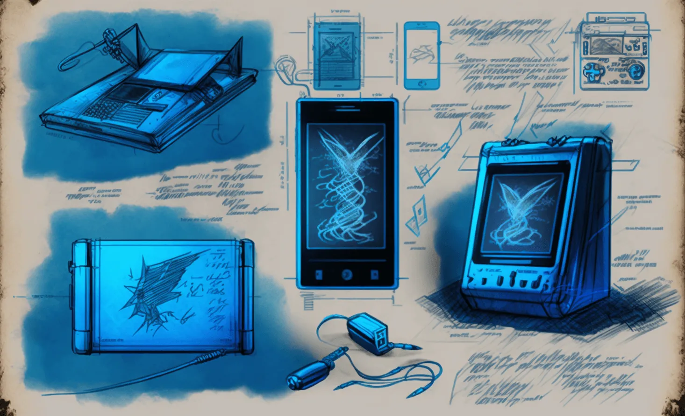

### Muumをダウンロードしてウォレットを作成する

まず、iOSとAndroidの両方で利用可能なモバイルアプリケーションをダウンロードする必要があります。常に正しいバージョンをダウンロードしていることを確認してください。市場には時々、詐欺的なレプリカが存在します。公式のMuumウォレットウェブサイトであるhttps://muun.com/を見つけ、そこから選択したシステム（iOS/Android）のリンクを使用することをお勧めします。そうすれば、公式アプリケーションを使用していることが確実になります。

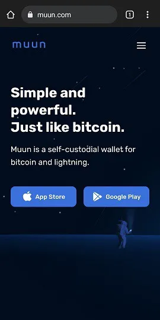

アプリケーションを開くと、新しいウォレットを作成するか、既存のウォレットを回復するかのオプションが表示されます。新しいウォレットの作成から始めましょう。その後、ウォレットの回復手順を説明します。「新しいウォレットを作成」を押します。

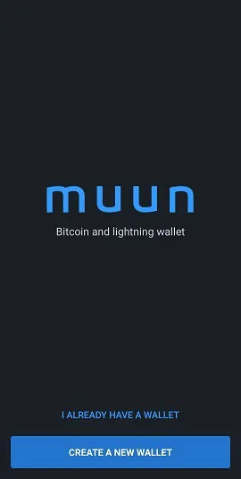

次に、Muumウォレットは4桁の個人識別番号（PIN）の作成を求めます。PINを設定することで、例えば悪意のある者があなたの電話とそれに伴うビットコインを盗んだ場合でも、ウォレットのセキュリティを高めることができます。

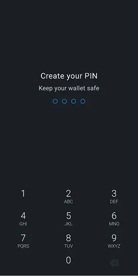

これで、アプリケーションは新しいウォレットを生成し、それがホームページになりました。これから、資金を送る前に関連するウォレット回復情報を確実に保護する必要があります。これはリスキーな行為になり得ます。

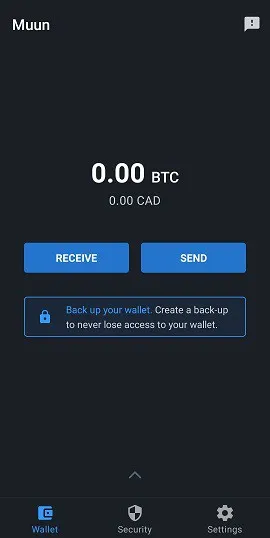

### キーバックアップ

「ウォレットのバックアップ」ボックスを押すと、「セキュリティ」タブにリダイレクトされます。Muumのバックアッププロセスは便利に3つのステップに分かれています。全てのステップを完了する必要はありませんが、それらの組み合わせが最大の予防策を提供します。

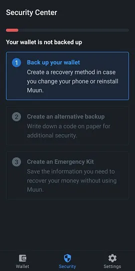

最初のオプションでは、ウォレットをメールアドレスに接続し、パスワードで保護することができます。このオプションは任意であり、問題なくスキップできます。使用したい場合は、「1: ウォレットのバックアップ」を押し、次の画面で「開始」を押してメールアドレスを入力します。次の画面では、メールボックスにアクセスしてMuumからのメールに記載されているリンクをクリックし、メールを検証する必要があることが示されます。

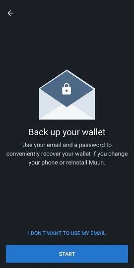

メールが検証されると、パスワードの作成を求められます。その後、必要に応じてウォレットの回復には選択したメールとパスワードの使用が必要であることを理解していることを示す2つのボックスをチェックする必要があります。これは、パスワードの紛失や忘れた場合にパスワードをリセットできる従来のプログラムとは対照的ですので、すべてをメモしておくことを確認してください。

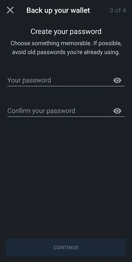
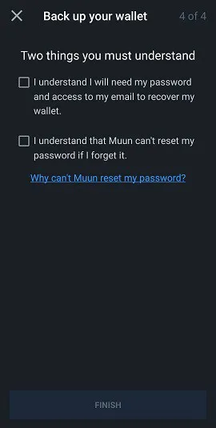

「セキュリティ」タブは現在、基本的なバックアップがあることを示しています。これで、「ウォレット」タブに戻り、アプリケーションを使用して取引を完了することができます（これらの機能はこのガイドの後半で詳しく説明されます）。しかし、オプション#1で入力したパスワードが危険にさらされた場合や、メール回復オプションを使用したくない場合に備えて、セキュリティオプション#2を使用して追加のバックアップコードを生成することをお勧めします。

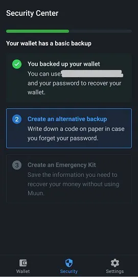
Muunの「代替バックアップ」オプションは、多くのBitcoinユーザーが馴染みのある、複数のウォレットアプリケーションで使用されるニーモニックフレーズに似ています。リカバリーコードを表示するには「Start」を押し、紙に書き留めてください（アプリケーションはコードを表示しているページでスクリーンショットをセンサーします）。メモしたら、そのコードを画面上で再度確認し、アプリケーション内で再入力してその有効性を確認する必要があります。

再度、Muunはあなたに問題の理解を確認させます。それは、以前に設定したパスワードを失った場合にこの32文字のコードが必要になるということです。

ウォレットのバックアップは、現代の基準によればかなり安全になりました。しかし、Muunアプリケーションには「Emergency Kit」と呼ばれる第三のセキュリティオプションがあります。Emergency Kitを作成することで、Muunを介さずにウォレットを回復することができます。言い換えれば、Muun以外の異なるBitcoinウォレットソフトウェアを使用して回復することができます。

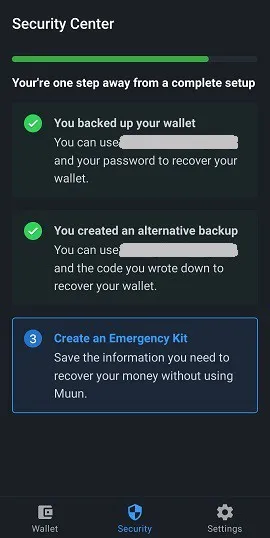

「Create an Emergency Kit」を押すと、このキットが資金の独立した移転に関する情報と指示を含むPDFドキュメントの形で提供されることが説明されます。キットは「Recovery Code」が必要であり、そのコードはドキュメントに含まれていないため、クラウドに安心して保存できます。キット作成ページにアクセスするために画面をスワイプします。

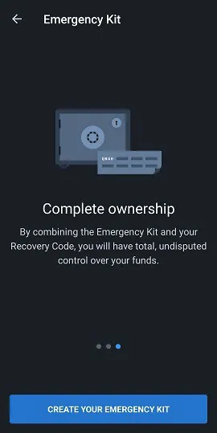

三つのオプションが利用可能です：

- Googleアカウントのクラウドに保存します。
- キットをバックアップしてアクセスするために自分のアドレスにメールを送信します。
- デバイス上のローカルアプリケーションで手動でバックアップします。

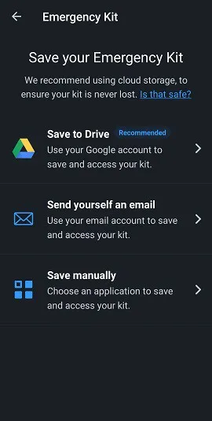

選択したバックアップ先にキットを送信したら、Muunが検証目的でキットに記載されている6桁のコードを入力するよう求めるため、キットにアクセスできることを確認してください。

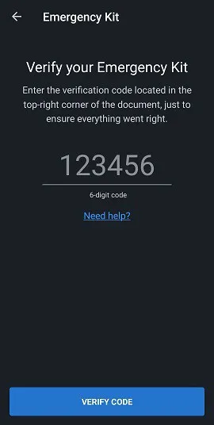

この最後のステップが完了すると、ウォレットのセキュリティと回復設定が完了します。これで、新たに作成されたバックアップを使用してウォレットを回復するさまざまな方法を探ることができます。
ウォレットの回復

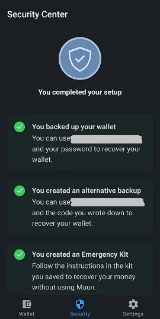

ユーザーがウォレットと資金へのアクセスを一時的に失うシナリオは多くあります。デバイスの紛失、アプリケーションのアンインストール/見つからない、個人識別番号の忘れ、ウォレットの切断などです。したがって、このアクセスを取り戻す方法を知っておくことが不可欠です。Muunアプリケーションを介して回復する場合は、オープニング画面で「I Already Have A Wallet」オプションを押します。

### メールアドレスでの回復

Muunのバックアップオプション＃1を使用した場合は、その時に選択したメールアドレスを入力します。このオプションは任意なので、代わりに回復コードを使用して進むこともできます。これはMuunによって提供されるオプション＃2です。まずはメールオプションについて説明しましょう。

メールアドレスを入力すると、Muunはメールが送信されたことを通知し、ウォレットの回復を承認するためにそれにアクセスする必要があると伝えます。メールボックス（スパムセクションも含む）を確認し、Muunのメールに記載されているリンクを使用します。アプリケーションにリダイレクトされ、画面が登録されたメールアドレスに関連付けられたパスワードの入力を求めるようになります。

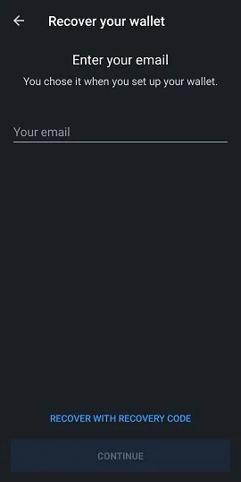

最後のステップは、個人識別番号を作成し、それからウォレットのホームページに戻り、それに関連付けられた残高が表示されます。

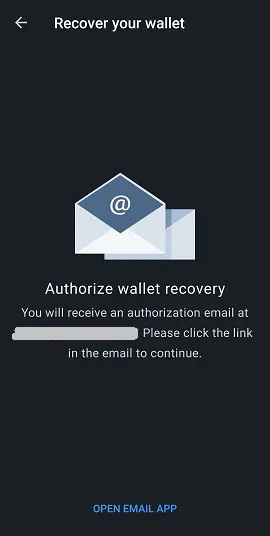

### 「Recovery Code」の使用
既存のウォレットへのアクセスを回復する際には、バックアップオプション＃2を選択した場合に以前メモしたリカバリーコード（Muunが指定する「Recovery Code」）を使用することを選択できます。このプロセスは、前のセクションで詳述されたもの、つまりメールによる回復と似ています。単に「Recover With Recovery Code」オプションを選択し、画面に表示される適切なフィールドにそれを入力します。ウォレットがリカバリーコードに加えてメールによってもバックアップされている場合、Muunは回復プロセスを承認するためにメールボックスを確認するように求め、提供されたリンクをクリックしてアプリケーションに戻った後にプロセスを完了することができます。再び、個人識別番号を作成する必要があります。そうすれば、再びウォレットにアクセスできるようになります。

### 緊急キットを使用した回復

Muun Walletアプリケーションを使用せずにウォレットを回復するには、Muunが提供する第三の回復オプションである緊急キットが必要になります。このオプションを使用すると、Muunウォレットに保持されている資金を任意のBitcoinアドレスに送信できます。したがって、資金を送信するアドレスを生成できる代替のウォレットを用意しておくことが重要です。

キットを作成した際に保存したPDFドキュメントにアクセスします。このドキュメントには、ウォレットを回復するために必要な指示が含まれています。この機能を使用するには、Muun開発チームが作成したスクリプトをダウンロードするためにデスクトップまたはラップトップコンピュータが必要です。リンクはメールに含まれていますが、ここでも共有します：https://github.com/muun/recovery

緊急キットには、キットの作成を確認するためにすでに使用した検証コードと、2つのキーが装備されています。Muun回復スクリプトをアクティブ化する際に、これらのキーが必要になります。したがって、操作中にそれらを手元に置いておくことを確認してください。

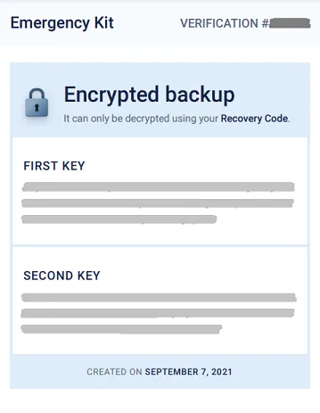

以下は、指示の翻訳です：

この緊急手順は、デバイスでMuunを使用できない場合に資金を回復するのに役立ちます。

1. リカバリーコードを見つける

このコードは、緊急キットを作成する前に紙に書きました。後で必要になります。

2. 回復ツールをダウンロードする

https://github.com/muun/recovery のページにアクセスし、ツールをコンピュータにダウンロードします。

3. 資金を回復する

回復ツールを実行し、手順に従います。ツールは、あなたの選択したBitcoinアドレスに資金を転送します。

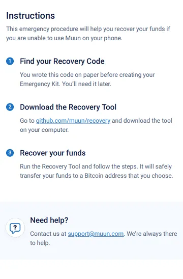

スクリプト内で、画面に要求された情報を入力するだけです。スクリプトが資金転送プロセスを処理します。上記で提供された「github」ページには、回復スクリプトを開始したときに何を期待すべきかを正確に示すアニメーションビデオがあります。

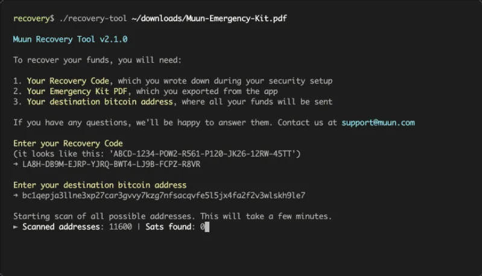

## 取引の受け取り

### Bitcoinタブ

ここでは、Muunウォレットの「受け取り」セクションとその様々な機能について説明します。アプリケーションのホームページは「Wallet」タブです。あなたの残高は中央に表示され、それをタップすると、金額を隠すか表示するかを切り替えることができます。この記事の後半でアプリケーションの設定全体について説明します。今のところ、「受け取り」を押してこの機能を探索しましょう。

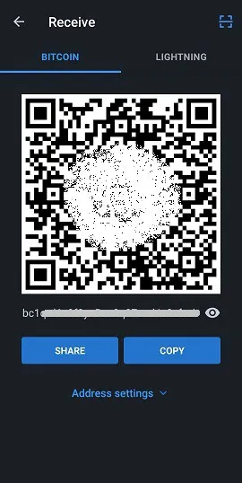
このページでは、BitcoinネットワークとLightningネットワークの両方でトランザクションを受け取ることを選択できます。希望するネットワークに対応する新しいアドレス（および関連するQRコード）が表示されます。デフォルトでは、「受け取り」画面に到着したときにBitcoinアドレスが表示されます。QRコードをタップすると、アドレスがデバイスのクリップボードにコピーされます。「共有」ボタンを使って他のアプリケーションに直接アドレスを簡単に共有できるほか、「コピー」ボタンでもアドレスをコピーできます。アドレスの最後にある目のアイコンを押すと、完全なアドレスが表示され、共有時にクリップボードにコピーされたものと比較できます。
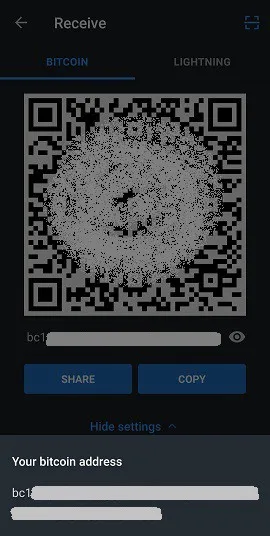

この情報には、Bitcoinネットワークでトランザクションを受け取るために必要なすべてが含まれています。さらに、Muunは「アドレス設定」メニューの下でいくつかのカスタマイズオプションを提供しています。まず、アドレスの説明に金額を追加することができます。次に、Segwitアドレス（デフォルトオプション）または従来のアドレス（レガシー）を使用するかを選択できます。

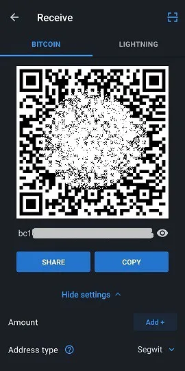

「追加 +」を押すと、送信者にとって簡単になるようにアドレスに特定の金額を追加できます。このオプションは任意です。金額が入力されると、前のページの「コピー」ボタンはコピーされたアドレスに情報を追加します（プレフィックスとして「bitcoin:」、サフィックスとして金額）。この即席の調整を避けるためには、直接QRコードを押してアドレスをコピーしてください。金額情報はそれと一緒に固定されます。さらに、アプリケーションでは、好みの通貨で金額を入力し、BTCへの変換プロセスを簡素化することを選択できます。

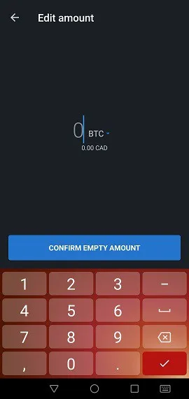

アドレスタイプ、SegwitまたはLegacyの選択に関しては、Segwitをそのまま使用することをお勧めします。このタイプのアドレス（「bc1」で始まる）はトランザクションデータのサイズを減らし、それに伴うトランザクション手数料を削減します。しかし、Segwitアドレスと互換性のないウォレットやソフトウェアがある場合には、「レガシー」システム（「3」で始まるアドレス）を使用する必要があるかもしれません。したがって、2つのタイプを区別する方法を知っておくことが重要です。

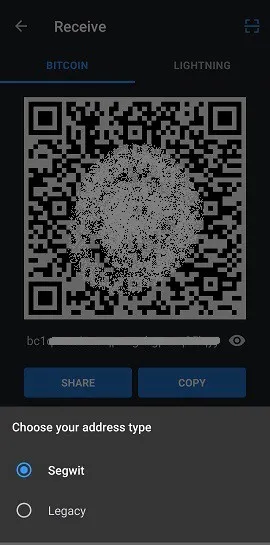

## Lightningタブ

Lightningネットワークを介してトランザクションを受け取るには、画面上部の同名のタブをタップする必要があります。Lightningアドレスを含むQRコードが表示され、これまでのガイドで述べたBitcoinアドレスと同様に、コピーして共有することができます。Lightningネットワークは、Bitcoinチェーン上のものと比較して、ほぼ瞬時のトランザクション速度とごくわずかなトランザクション手数料を楽しむことができることを思い出してください。

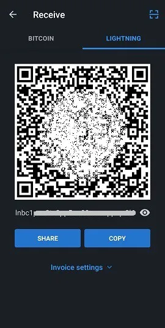

カスタマイズオプションは「請求書設定」メニューの下にあります。ここでは、「追加 +」をタップすることでアドレスに関連付けられた金額を変更できます。Lightningネットワークでの経験に基づいて、トランザクションを作成する際に金額を入力する方が良いと考えます。なぜなら、いくつかのウォレットは空白の請求書にうまく対応しないからです。このメニューには有効期限タイマーもあります。このアプリケーションでは、タイマーは60分に設定されており、その後アドレスは無効になります。金額を変更するたび、またはページを離れて戻ったときにMuunが新しいLightningアドレスを生成することに注意してください。

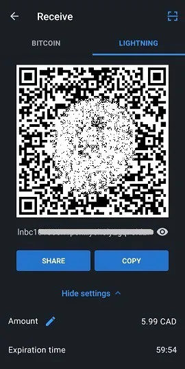

## LNURL機能の使用
Muunウォレットは、トランザクションを受け取るためにLNURLを使用する機能を提供します。この機能は、ページの右上にある四角いスキャンシンボルをタップすることでアクティブになり、トランザクションを受け取るために請求書を共有する必要を避けるなど、いくつかの利点があります。代わりに、QRコードをスキャンして支払い情報を受け取り、その後でトランザクションプロセスを確認するために検証する必要があります。
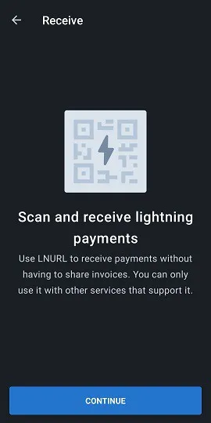

Muunは最初に説明ページ（上記のスクリーンショットを参照）を表示し、その後、アプリケーションを使用するために必要なデバイスのカメラ入力を有効にするように求めます。LNURLアドレスは現在、すべてのLightningウォレットでサポートされているわけではないことに注意してください。サポートしているものは、一般的にトランザクションを受け取るためにLNURLを使用する機能のみを提供し、送信するためには提供していません。

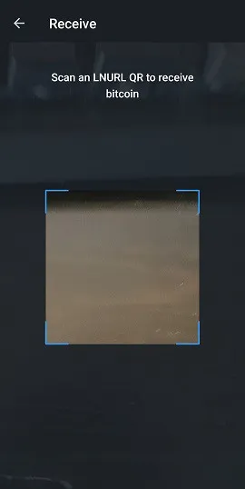

## トランザクションの送信

### ビットコインネットワーク経由

Muunでビットコインを受け取る方法を見てきましたが、次にビットコインを送る方法を探りましょう。ホームページの「Wallet」タブの下に戻ると、「Send」を押す必要があります。シンプルなページが表示され、指定されたフィールドにビットコインまたはライトニングアドレスをコピーするオプションが表示されるか、このフィールドの右側にあるQRコードアイコンを押してカメラをアクティブにし、QRコード形式のアドレスをスキャンできます。

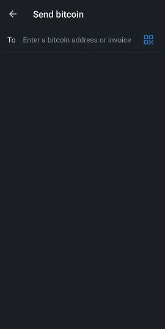
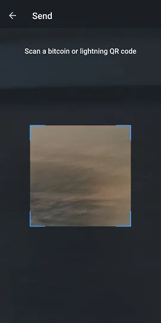

「Send」ページに到着すると、デバイスに既にアドレスがコピーされている場合、Muunはアドレス形式（ビットコインまたはライトニング）を認識し、フレーム付きメッセージを通じてトランザクションをブロードキャストすることを提案します。

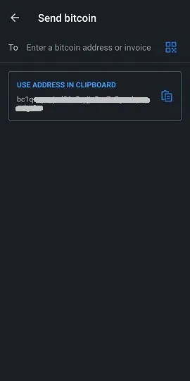
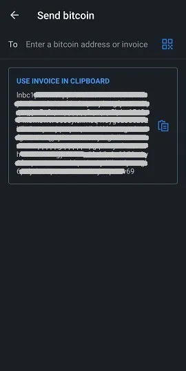

ビットコイントランザクションを準備する際には、送信する金額を入力する必要があります。画面上部に表示される宛先アドレスが、以前にコピーしたアドレスと一致していることを確認してください。送信する金額の下に、Muunはウォレットの残高を表示し、「dust」（いくつかのサトシ）を残さずにウォレットを完全に空にしたい場合に非常に便利な機能である、すべての資金を使用するオプションを提供します。

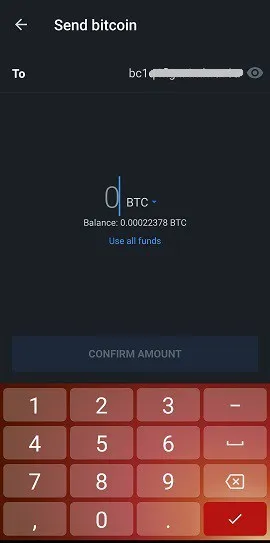

送信する金額を確認した後、Muunは次のページでメモを書くように求めます。これは追加の検証として機能し、関連するものでもないものでも、何でも自由に書くことができます。

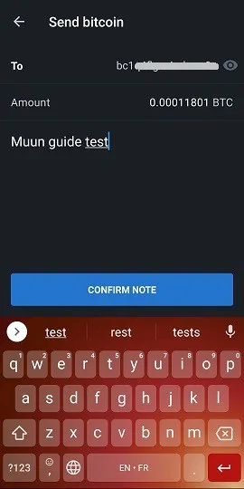

トランザクションの詳細を最終的にブロードキャストする前に、最終確認が必要です。入力されたアドレスと金額を検証し、必要に応じて「Network fee」の右側にある青い鉛筆アイコンを押してトランザクション手数料をカスタマイズしてください。ビットコイントランザクションプール（mempool）の基本を理解することは、時間をかけて多くのサトシを節約できる良い教育体験です！

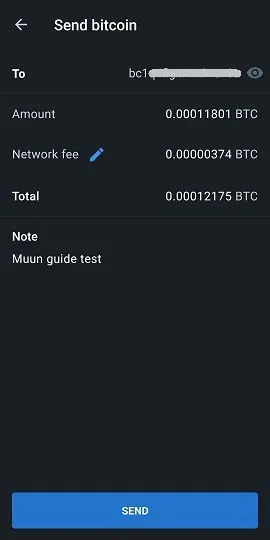

Muunのソフトウェアはデフォルトで、30分以内に確認が必要なトランザクション手数料を計算するアルゴリズムを実装しています。これは、トランザクション手数料を変更しようとすると表示されるものです。「Enter Fee Manually」ボタンを押すと、この詳細を自分でカスタマイズできる機能があり、より速い確認が必要な場合や、逆に余裕がある場合に非常に便利です。

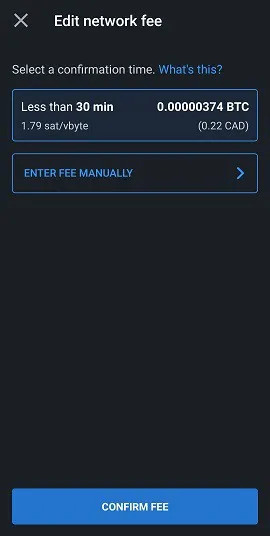
トランザクション手数料の金額を自分で入力することを選択すると、sat/vbyte（サトシ/仮想バイト）で入力する金額を示す新しいページに移動します。Muunは、選択した金額に関連する確認時間の見積もり、および選択した法定通貨でのBTCおよび費用の見積もりも表示します。
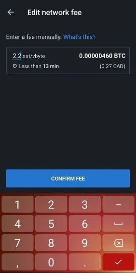
トランザクションの詳細概要ページに戻り、「送信」を押してください。ほら、あなたのトランザクションはBitcoinネットワークにブロードキャストされました！ウォレットのホームページにリダイレクトされ、残高からの差し引きが表示されます。画面の下部には、トランザクション履歴を調べることができる矢印があります。あなたが行ったトランザクションは、発行の初期時点に追加されます。
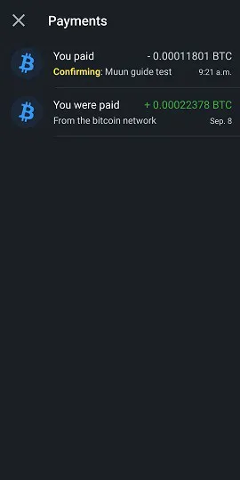

エントリーを押して、特定のトランザクションの詳細を表示します。マイナーがそれを含む新しいブロックをチェーンに追加すると、あなたのトランザクションは確認されます。Muunは画面の下部でトランザクションIDを共有し、ブロックエクスプローラーでトランザクションの状態を確認できるようにします。

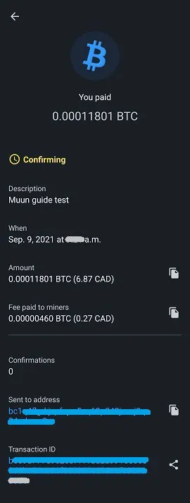

## ライトニングネットワーク経由

さあ、Bolt 11インボイス（伝統的/デフォルトのライトニングインボイス）を使用してトランザクションを行いましょう。「送信」ページでライトニングアドレスをコピーまたはスキャンします。現在のインボイスの詳細を表示する新しいページにリダイレクトされます。トランザクションの金額（ネットワーク手数料を含む）が表示され、インボイスに書かれたメモや説明、および画面下部の有効期限タイマーが表示されます。ライトニングトランザクションの手数料は変更できないことに注意してください。これらは、受取人に到達するために通過する必要があるチャネルのルートによって決定されます。

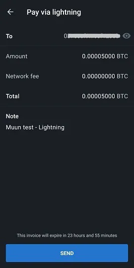

（これは、事前に記入された金額がないため空白のインボイスを使用する際に画面に表示される警告です。一部のウォレットはこのタイプのインボイスをサポートしており、自分で金額をカスタマイズできます。しかし、Muunの場合はそうではありません。）

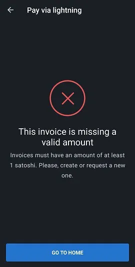

目のアイコンを押すと、このトランザクションで取引しているライトニングノードの詳細が表示されます。さらに情報を得るためにウェブエクスプローラーを表示するオプションもあります。これは、Muunによって達成された技術的抽象化の良い例です。

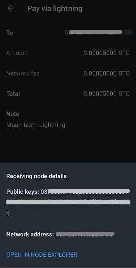

「送信」を押すと、トランザクションが開始され、通常、一瞬で完了します。支払った金額は残高から差し引かれ、アプリケーションのホームページに表示されます。支払いの即時確認を確認するために、トランザクション履歴に戻ってください。

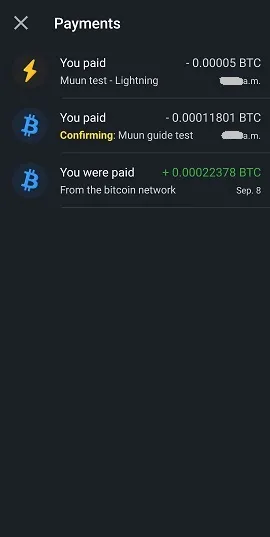

履歴では、ライトニングとBitcoinのトランザクションが異なるシンボルで区別されていることに注意してください。ライトニングトランザクションの詳細を表示するには、履歴画面でそれをタップします。

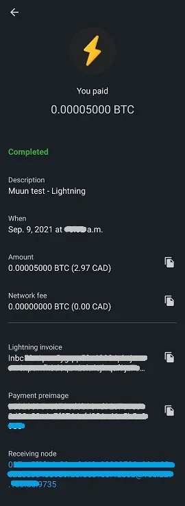

## アプリケーション設定

ホームページの3番目のタブ「設定」は、アプリケーション設定を見つけることができる場所です。このページは、他の人気のあるモバイルウォレットと比較して驚くほど短いです。私の意見では、これは不利ではなく、むしろシンプルさの点で利点だと考えています。

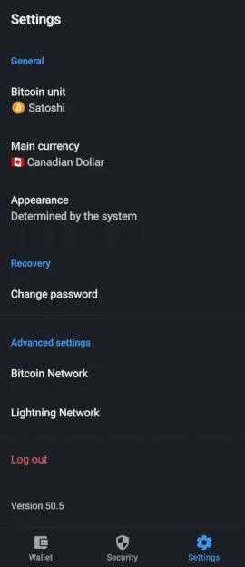

一般カテゴリーでは、好みの単位と通貨、およびアプリケーションの外観テーマ（ダークまたはライト）を選択できます。これは初期にはデバイスのシステムに基づいて決定されます。

アプリケーションの単位については、Bitcoin（BTC）またはSatoshi（SAT）の間で選択できます。ご存知のとおり、Satoshiはbitcoinの最小単位で、8番目の小数点（1 SAT = 0.00000001 BTC）です。小額を主に使用するライトニングネットワークを使用する場合、ウォレットをSatoshiで表示することがよく好まれます。

Muunは幅広い通貨を提供しており、トランザクションや個人的なニーズに必要なBTC換算を簡単に見つけることができます。
ウォレットの回復パスワードを変更する必要がある場合は、設定ページで変更できます。現在のパスワードまたは回復コードを持っていること、そしてメールへのアクセスが可能であることを確認してください。
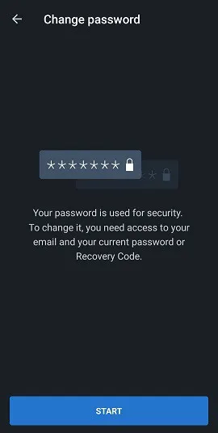

現在のパスワードを入力するか、回復コードを入力してリセットを開始します。Muunは以前に登録されたアドレスにメールを送信します。

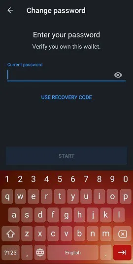
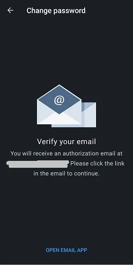

詳細設定セクションには、Bitcoin NetworkとLightning Networkの2つのエントリが含まれています。Bitcoin Networkでは、デフォルトでTaproot受信アドレス（bc1p、最新のアドレスタイプ）を有効にする選択肢が与えられます。

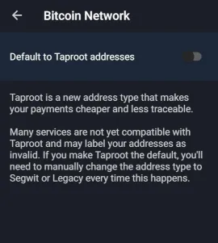

Lightning Network内では、以下を見つけることができます：

- 受信プロトコル：受信画面にデフォルトで表示される受信ネットワークを選択します。実験的な機能であるUnifiedも利用可能です。これは、BitcoinとLightningのアドレスの両方を統合するQRコードです。しかし、現在この機能をサポートしているBitcoinソフトウェアは少ないです。
- 
- Turboチャネル：このオプションを有効または無効にすることができます。デフォルトでは有効になっています。

Turboチャネルとは何かを理解するためには、まずLightningトランザクションがユーザー間でチャネルを介して行われ、これらのチャネルは初めにBitcoinブロックチェーン上のトランザクションによって資金提供されなければならないことを知る必要があります。

Turboチャネルを使用すると、オンチェーントランザクションが確認される前でも、Lightningネットワーク上でトランザクションを開始できます。この機能を無効にすると、Lightningネットワーク上でのトランザクションを行うまでにかなり長い時間を待たなければならなくなりますが、それと引き換えに、Muunが悪意を持って行動しない（非常に公然としたダブルスペンド）ことを信頼しなければならないため、資金のセキュリティが高まります。ブロックチェーン上でトランザクションが確認されるのを待っている間です。

設定ページの下部には「ログアウト」オプションがあります。現在認識されているウォレットの接続を切断したい場合にこの機能を使用できます。これにより、新しいウォレットを作成するか、既存のウォレットをインポート/回復することができます。

