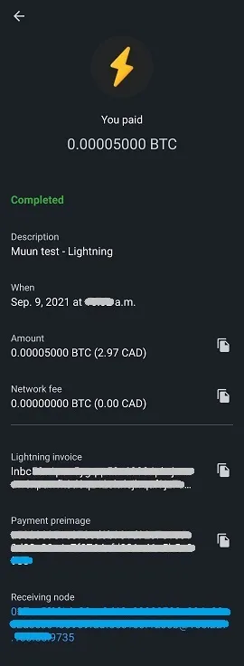

Muun (https://muun.com/) é uma carteira auto custodiante para bitcoin e lightning.

## tutorial em vídeo

## Muun Wallet - Guia completo de uso

Guia completo de uso (com capturas de tela) do aplicativo Muun; uma carteira móvel amigável para Bitcoin que permite transações na Lightning Network.

### Baixar o Muun e criar sua carteira

Primeiro, é necessário baixar o aplicativo móvel, disponível tanto para iOS quanto para Android. Certifique-se sempre de baixar a versão correta. Às vezes, existem réplicas fraudulentas no mercado. Eu recomendo que você encontre o site oficial da carteira Muun, que é https://muun.com/, e use o link para o seu sistema de escolha (iOS/Android), assim você terá certeza de que está usando o aplicativo oficial.

Ao abrir o aplicativo, você terá a opção de criar uma nova carteira ou recuperar uma existente. Vamos começar criando uma nova carteira. Demonstrarei as etapas de recuperação da carteira posteriormente. Toque em "Criar uma nova carteira".

Em seguida, o Muun wallet solicitará que você crie um número de identificação pessoal (NIP/PIN) de quatro dígitos. Com um PIN, você aumenta a segurança da sua carteira caso, por exemplo, alguém mal-intencionado roube seu telefone e, consequentemente, seus bitcoins.

Pronto, o aplicativo gerou uma nova carteira que agora será a página inicial. Agora é necessário proteger as informações relevantes para a recuperação da carteira antes de enviar fundos, o que seria uma prática arriscada.

### Backup da chave

Toque no quadro "Faça backup da sua carteira", você será redirecionado para a guia "Segurança". O processo de backup do Muun é convenientemente dividido em três etapas. Não é obrigatório completar todas as três etapas, mas a combinação delas oferece o máximo de precaução.

A primeira opção permite que você conecte sua carteira a um endereço de e-mail, além de protegê-la com uma senha. Esta opção é opcional e pode ser pulada sem problemas. Se você deseja usá-la, pressione "1: Fazer backup da sua carteira" e depois "Iniciar" na próxima tela e insira um endereço de e-mail. A próxima tela informará que você precisa validar o e-mail acessando sua caixa de entrada e clicando no link fornecido no e-mail da Muun.

Depois de verificar o e-mail, você será solicitado a criar uma senha. Em seguida, você precisará marcar duas caixas indicando que você entende que a recuperação da carteira, se necessário, exigirá o uso do e-mail e da senha recém-escolhida. Isso contrasta com programas tradicionais que oferecem a opção de redefinir sua senha em caso de perda ou esquecimento, então certifique-se de ter anotado tudo corretamente.

A guia "Segurança" agora indica que você tem um backup básico ("backup básico"). Portanto, você pode voltar para a guia "Carteira" e usar o aplicativo para concluir transações (essas funções serão detalhadas mais adiante neste guia), sabendo que a carteira agora é recuperável. No entanto, recomendo usar a opção de segurança #2 para gerar um código de backup adicional, caso a senha inserida na opção #1 seja comprometida ou se você preferir não usar a opção de recuperação por e-mail.

A opção "backup alternativo" do Muun é semelhante à frase mnemônica usada por várias carteiras de aplicativos às quais a maioria dos usuários de Bitcoin está acostumada. Pressione "Iniciar" para exibir seu código de recuperação e anote-o em um pedaço de papel (o aplicativo censura a captura de tela na página que exibe o código). Depois de anotado, compare-o com o código exibido na tela, pois você precisará digitá-lo novamente no aplicativo para confirmar sua validade.

Novamente, o Muun solicita que você confirme sua compreensão do problema, ou seja, que você precisará deste código de 32 caracteres no caso de perder sua senha estabelecida anteriormente.

O backup da carteira agora está amplamente seguro em relação aos padrões modernos que conhecemos. No entanto, o aplicativo Muun possui uma terceira opção de segurança chamada "Kit de Emergência". A criação do Kit de Emergência permitirá que você recupere sua carteira sem precisar passar pelo Muun. Em outras palavras, usando um software de carteira Bitcoin diferente do Muun.

Après avoir appuyé sur "Create an Emergency Kit", on vous explique que ce kit vient sous la forme d'un document PDF contenant les informations & instructions relatives au transfert de vos fonds de manière indépendante. Le kit peut être stocké sur le cloud sans souci puisqu'il nécessite votre "Recovery Code" pour être utilisé, lequel ne figure pas dans le document en question. Faites glisser l'écran pour accéder à la page de création du kit.

Trois options s'offrent à vous :

- Sauvegarder sur le cloud de votre compte Google.
- Envoyer un courriel à votre propre adresse pour sauvegarder votre kit et y accéder.
- Sauvegarder manuellement avec une application locale sur votre appareil.

Assurez-vous de pouvoir consulter votre kit une fois que vous l'aurez envoyé à votre destination de sauvegarde de choix car Muun vous demandera ensuite, à des fins de validation, d'entrer un code à six chiffres se trouvant dans le kit.

Une fois cette dernière étape complétée, votre configuration de sécurité et de récupération de portefeuille est désormais terminée. Nous allons maintenant explorer les différentes façons de récupérer votre portefeuille en utilisant les sauvegardes fraîchement créées.
Récupération d'un portefeuille

Il existe une multitude de scénarios où un utilisateur peut momentanément perdre l'accès à son portefeuille & ses fonds; perte de l'appareil, application désinstallée/disparue, numéro d'identification personnel oublié, déconnexion du portefeuille, etc. Il est donc impératif de savoir comment récupérer cet accès. Lors de la récupération via l'application Muun, appuyez sur l'option "I Already Have A Wallet" sur l'écran d'ouverture.

### Récupération avec adresse courriel

Si vous avez utilisé l'option de sauvegarde #1 de Muun, entrez le courriel ayant été choisi à ce moment. Puisque cette option est facultative, vous pouvez également opter de poursuivre plutôt avec le code de récupération, lequel se trouvant à être l'option #2 offerte par Muun. Survolons d'abord l'option via courriel.

Une fois votre adresse courriel entrée, Muun vous indiquera qu'un courriel vous a été envoyé et que vous devez y accéder pour autoriser la récupération du portefeuille. Vérifiez votre boîte aux lettres (ainsi que la section indésirables) et utilisez le lien fourni dans le courriel de Muun. Vous serez redirigé dans l'application où l'écran vous demandera maintenant d'entrer votre mot de passe associé à l'adresse courriel inscrite.

La dernière étape est de créer un numéro d'identification personnel, vous serez ensuite de retour en territoire familier à la page d'accueil du portefeuille, vous indiquant le solde lié à celui-ci.

### Utilização do "Código de Recuperação"

Ao recuperar o acesso a uma carteira existente, você pode optar por usar o código de recuperação ("Código de Recuperação" conforme designado pela Muun) que você anotou anteriormente se tiver escolhido a opção de backup #2.

Esse processo é semelhante ao detalhado na seção anterior; recuperação por e-mail. Basta escolher usar a opção "Recuperar com Código de Recuperação" e inserir o código nos campos apropriados exibidos na tela. Se sua carteira também estiver protegida por um e-mail, além do código de recuperação, a Muun solicitará que você verifique sua caixa de entrada para autorizar o processo de recuperação, que você poderá concluir assim que retornar ao aplicativo após clicar no link fornecido. Mais uma vez, você precisará criar um número de identificação pessoal. Pronto, você terá acesso à sua carteira novamente.

### Recuperação usando o Kit de Emergência

Para recuperar sua carteira sem usar o aplicativo Muun Wallet, você precisará do seu kit de emergência (Emergency Kit), a terceira opção de recuperação oferecida pela Muun. Essa opção permite que você envie os fundos mantidos em sua carteira Muun para qualquer outro endereço Bitcoin. Portanto, certifique-se de ter uma carteira alternativa que possa gerar um endereço para onde você enviará os fundos.

Acesse o documento PDF que você salvou ao criar o kit. Esse documento contém as instruções necessárias para recuperar sua carteira. Observe que essa funcionalidade requer o uso de um computador de mesa ou laptop, pois você precisará baixar um script criado pela equipe de desenvolvimento da Muun. O link está incluído no e-mail, mas vou compartilhá-lo aqui mesmo: https://github.com/muun/recovery

O kit de emergência possui um código de verificação, que você já usou anteriormente para confirmar a criação do kit, e duas chaves. As chaves serão necessárias quando você ativar o script de recuperação da Muun. Portanto, certifique-se de tê-las ao seu alcance durante a operação.

Aqui está a tradução das instruções:

Este procedimento de emergência ajudará você a recuperar seus fundos se não puder usar o Muun em seu dispositivo.

1. Encontre seu código de recuperação

Você escreveu esse código em um pedaço de papel antes de criar seu kit de emergência. Você precisará dele mais tarde.

2. Baixe a ferramenta de recuperação

Acesse a página https://github.com/muun/recovery e baixe a ferramenta em seu computador.

3. Recupere seus fundos

Execute a ferramenta de recuperação e siga as etapas. A ferramenta se encarregará de transferir seus fundos para um endereço Bitcoin de sua escolha.

'

Uma vez no script, você só precisa inserir as informações solicitadas na tela. O script cuidará do processo de transferência de fundos para você. Na página "github" fornecida acima, há um vídeo animado do processo disponível, que permitirá que você veja exatamente o que esperar ao iniciar o script de recuperação.

## Recebendo transações

### Guia Bitcoin

Agora vamos cobrir a seção "Receive" da carteira Muun, bem como suas diferentes funções. A página inicial do seu aplicativo é a guia "Wallet". Seu saldo é exibido no centro e você pode pressioná-lo para alternar entre ocultar e exibir o valor. Mais adiante neste artigo, abordaremos todas as configurações do aplicativo. Por enquanto, vamos pressionar "Receive" para explorar essa função.

Nesta página, você pode escolher receber uma transação tanto na rede Bitcoin quanto na Lightning. Um novo endereço (e o código QR associado a ele) correspondente à rede desejada será exibido. Por padrão, um endereço Bitcoin é exibido ao abrir a tela "Receive". Ao pressionar o código QR, o endereço será copiado para a área de transferência do seu dispositivo. Você pode facilmente compartilhar o endereço diretamente para outros aplicativos com o botão "Share" e também pode copiar o endereço com o botão "Copy". Ao pressionar o ícone do olho no final do endereço, ele será exibido completo, permitindo que você o compare com o endereço copiado ao compartilhar.

Essas informações contêm tudo o que você precisa para receber transações na rede Bitcoin. Além disso, o Muun oferece algumas opções de personalização no menu "Address settings". Primeiro, é possível adicionar um valor à descrição do endereço. Segundo, você pode escolher usar um endereço Segwit (a opção padrão) ou um endereço tradicional (legacy).

Ao pressionar "Add +", você pode adicionar um valor específico ao endereço, facilitando a tarefa do remetente. Essa opção é opcional. Observe que, uma vez que um valor é inserido, o botão "Copy" na página anterior adicionará informações ao endereço copiado ("bitcoin:" como prefixo e o valor como sufixo). Para evitar ter que ajustar isso, pressione diretamente o código QR para copiar o endereço. As informações do valor permanecerão vinculadas a ele. Além disso, o aplicativo permite que você escolha inserir o valor na moeda de sua escolha, simplificando o processo de conversão para BTC.

'

Em relação à seleção do tipo de endereço, Segwit ou Legacy, recomendo deixar o Segwit no lugar. Esse tipo de endereço (começando com "bc1") reduz a quantidade de dados da transação e, portanto, reduz as taxas de transação associadas. No entanto, pode ser necessário usar o sistema "Legacy" (endereço começando com "3") caso uma carteira ou software não seja compatível com endereços Segwit. Portanto, é importante saber distinguir entre os dois tipos.

## Aba Lightning

Para receber transações através da rede Lightning, você precisa clicar na aba com o mesmo nome na parte superior da tela. Agora será exibido um código QR contendo um endereço Lightning, que você pode copiar e compartilhar da mesma maneira que os endereços Bitcoin mencionados anteriormente neste guia. Lembro que a rede Lightning permite que você aproveite uma velocidade de transação quase instantânea, além de taxas de transação que são uma fração das da cadeia Bitcoin.

As opções de personalização estão localizadas no menu "Configurações de fatura". Aqui, você pode modificar o valor associado ao endereço clicando em "Adicionar +". Com base na minha experiência com a rede Lightning, acredito que é melhor inserir um valor ao criar a transação, pois várias carteiras não respondem bem a faturas em branco. Além disso, você notará que há um temporizador de expiração neste menu. Neste aplicativo, o temporizador está configurado para 60 minutos, após o qual o endereço será inválido. Observe que o Muun gera um novo endereço Lightning sempre que você faz uma alteração no valor ou sai e volta para a página.

## Usando a função LNURL

A carteira Muun oferece a opção de usar o LNURL para receber transações. Essa função, que é ativada ao clicar no ícone de varredura quadrado localizado no canto superior direito da página, possui algumas vantagens, incluindo evitar a necessidade de compartilhar uma fatura para receber uma transação. Em vez disso, você precisa escanear um código QR para receber as informações de pagamento, que você pode então validar para confirmar o processo de transação.

Inicialmente, o Muun mostrará uma página explicativa (veja a captura de tela acima) e, em seguida, solicitará que você ative a captura de câmera do seu dispositivo, uma etapa necessária para usar o aplicativo. Saiba que os endereços LNURL atualmente não são suportados por todas as carteiras Lightning. Aqueles que suportam geralmente oferecem apenas a opção de usar o LNURL para receber transações e não para emitir.

## Emitindo transações

### Através da rede Bitcoin

Maintenant que nous avons vu comment recevoir des bitcoins avec Muun, explorons comment en envoyer. De retour à la page d'accueil sous l’onglet “Wallet”, vous devrez appuyer sur “Send”. Une page toute simple s’affichera maintenant où vous aurez la possibilité de copier une adresse Bitcoin ou Lightning dans le champ prévu à cet effet ou d’appuyer sur l’icône de code QR à la droite de ce champ pour activer la caméra et balayer une adresse sous forme de code QR.​

Lorsque vous arrivez sur la page “Send”, si vous avez déjà une adresse en copie sur votre appareil, Muun reconnaîtra le format de l’adresse (Bitcoin ou Lightning) et vous suggérera via un message encadré d’utiliser cette dernière pour diffuser une transaction.​

Lors de la préparation d’une transaction Bitcoin, il vous faut inscrire le montant à émettre. Assurez-vous que l’adresse de destination affichée au haut de l’écran correspond bien à l’adresse copiée auparavant. Sous le montant à envoyer, Muun affiche le solde de votre portefeuille et vous donne l’option d’utiliser tous vos fonds (“Use all funds”), une fonctionnalité fort utile si vous souhaitez vider votre portefeuille complètement en évitant qu’il ne reste des “poussières” (quelques satoshis).

Après avoir confirmé le montant à émettre, Muun vous demande sur la page suivante d'écrire une note. Ceci sert de validation additionnelle, vous êtes libre d’écrire ce que vous voulez, avec pertinence ou non.

Une dernier survol des détails de la transaction est nécessaire avant d’enfin diffuser celle-ci. Validez l’adresse et le montant inscrits puis personnalisez les frais de transactions au besoin en appuyant sur l’icône de crayon bleu situé à la droite de “Network fee”. Prendre connaissance des grandes lignes sur le fonctionnement du bassin de transactions (mempool) Bitcoin est une bonne expérience éducative qui pourrait vous permettre d’économiser bien des satoshis au fil du temps!

Muun implémente par défaut dans son logiciel un algorithme calculant les frais de transaction nécessaires pour une confirmation en 30 minutes et moins. C’est ce qui s’affichera lorsque vous tenterez de modifier les frais de transaction. Le bouton “Enter Fee Manually” vous permet de personnaliser vous même ce détail, une fonctionnalité se voulant bien pratique dans l’éventualité où vous auriez besoin d’une confirmation plus rapide ou, au contraire, si vous disposez d’une large marge de manœuvre.

Ao optar por inserir você mesmo o valor das taxas de transação, você será levado a uma nova página que mostrará o valor a ser registrado em sat/vbyte (satoshis por byte virtual). A Muun até mesmo exibe uma estimativa do tempo de confirmação associado ao valor escolhido, além do custo em BTC e moeda fiduciária de sua escolha.

Volte para a página de visão geral dos detalhes da transação e clique em "Enviar". Pronto, sua transação será transmitida na rede Bitcoin! Você será redirecionado para a página inicial da carteira, onde poderá ver a dedução em seu saldo. No canto inferior da tela, há uma seta na qual você pode clicar para verificar seu histórico de transações. A transação que você acabou de fazer será adicionada ao momento inicial de sua emissão.

Clique em uma entrada para ver os detalhes de uma transação específica. Sua transação será confirmada quando um minerador adicionar um novo bloco, contendo essa transação, à cadeia. A Muun compartilha na parte inferior da tela o identificador da transação, permitindo que você verifique o status de sua transação em um explorador de blocos.

## Através da rede Lightning

Agora, vamos usar uma fatura Bolt 11 (fatura Lightning tradicional / padrão) para realizar uma transação. Copie ou escaneie um endereço Lightning na página "Enviar". Você será redirecionado para uma nova página que mostrará os detalhes da fatura atual. Os valores da transação serão exibidos (incluindo as taxas da rede), a nota ou descrição inserida na fatura, bem como o cronômetro de expiração na parte inferior. Observe que as taxas de transação não podem ser alteradas para transações Lightning, pois são determinadas pela rota do canal/canais que elas devem percorrer para chegar ao destinatário.

(Aqui está o aviso exibido na tela ao usar uma fatura em branco, ou seja, sem nenhum valor pré-definido. Alguns wallets suportam esse tipo de fatura e permitem que você personalize o valor. Isso não é possível com o Muun.)

Clicar no ícone do olho mostrará os detalhes do nó Lightning com o qual você está lidando nesta transação. Você até tem a opção de consultar um explorador web para obter mais informações. Isso é um bom exemplo da abstração técnica realizada pela Muun.

Assim que você clicar em "Enviar", sua transação será iniciada e, normalmente, concluída em questão de segundos. O valor pago será deduzido do seu saldo, visível na página inicial do aplicativo. Volte ao seu histórico de transações para visualizar a confirmação instantânea do pagamento.

Observe que no histórico, as transações Lightning & Bitcoin são diferenciadas por um símbolo diferente. Para ver os detalhes da transação Lightning, toque nela na tela do seu histórico.

## Configurações do aplicativo

A terceira guia da página inicial, "Configurações", é a das configurações. Esta página é surpreendentemente curta, especialmente em comparação com outras carteiras móveis populares. Na minha opinião, isso não é uma desvantagem, pelo contrário, eu vejo isso como uma vantagem em termos de simplicidade.

Na categoria geral, você pode selecionar suas preferências de unidade de conta e moeda, bem como o tema de aparência do aplicativo (escuro ou claro), que será inicialmente determinado pelo modo de exibição do seu dispositivo.

Para a unidade de conta do aplicativo, escolha entre uma denominação em Bitcoin (BTC) ou em Satoshi (SAT). Para sua informação, um Satoshi é a menor fração de um bitcoin, ou seja, a oitava casa decimal (1 SAT = 0.00000001 BTC). Denominar a carteira em Satoshis é frequentemente preferido quando usamos principalmente a rede Lightning com pequenas quantias.

Muun possui uma ampla seleção de moedas com as quais você pode encontrar mais facilmente a conversão BTC necessária para suas necessidades transacionais e/ou pessoais.

Se você achar necessário alterar sua senha de recuperação da carteira, você pode fazer isso na página de configurações. Certifique-se de ter a senha atual ou seu código de recuperação em mãos, e acesso ao seu e-mail.

Digite sua senha atual ou escolha inserir seu código de recuperação para iniciar a redefinição. Muun enviará um e-mail para o endereço previamente registrado.

A seção avançada das configurações ("Configurações avançadas") contém duas entradas: Rede Bitcoin e Rede Lightning. Em Rede Bitcoin, temos a opção de ativar os endereços de recebimento Taproot (bc1p, o tipo de endereço mais recente) por padrão.

Dentro da Rede Lightning, encontramos:

- Protocolo de Recebimento: Escolha sua rede de recebimento exibida por padrão na tela de Receber. Uma função experimental, Unified, também está disponível. É um código QR que unifica tanto os endereços Bitcoin quanto os Lightning. No entanto, poucos softwares Bitcoin suportam essa funcionalidade no momento.
- Canais Turbo: Essa opção permite ativar ou desativar a função de Canais Turbo. Por padrão, ela está ativada.

'

Para entender o que são os canais Turbo, primeiro precisamos saber que as transações Lightning são realizadas por meio de canais de usuário para usuário e que esses canais devem ser inicialmente financiados por uma transação na cadeia do Bitcoin.
Os canais Turbo permitem começar a transacionar na rede Lightning antes mesmo que qualquer transação on-chain seja confirmada. Desativar essa função fará com que você precise esperar significativamente mais tempo para transacionar na rede Lightning, em troca de uma maior segurança para seus fundos, já que, caso contrário, você precisa confiar que o Muun não agirá maliciosamente (um double-spend muito público) enquanto sua transação não for confirmada na blockchain.

No final da página de configurações, há a opção "Sair". Você pode usar essa função se desejar que o aplicativo desconecte a carteira atualmente reconhecida por ele. Isso permitirá que você crie uma nova carteira ou importe/recupere uma existente.

