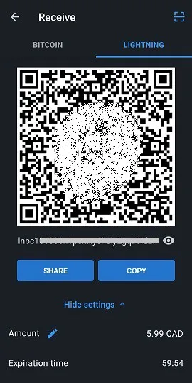
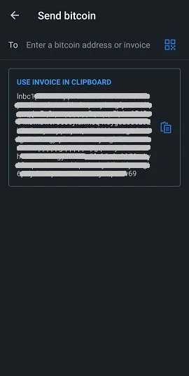
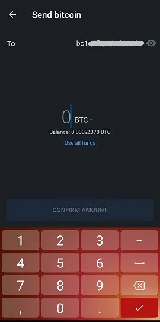
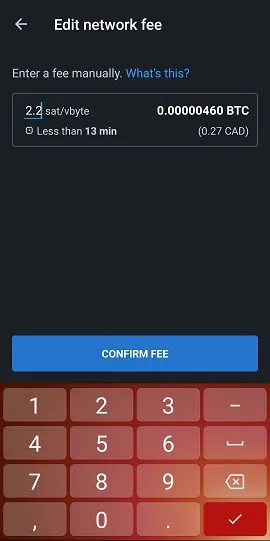
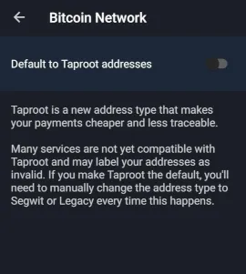

Muun (https://muun.com/) - это самохранимый кошелек для биткойна и сети Lightning.

## видеоурок

## Полное руководство пользователя кошелька Muun

Полное руководство пользователя (со скриншотами) для приложения Muun; удобный мобильный кошелек Bitcoin, который позволяет совершать транзакции в сети Lightning.

### Загрузите Muun и создайте свой кошелек

Сначала вам нужно загрузить мобильное приложение, доступное как на iOS, так и на Android. Всегда убедитесь, что вы загружаете правильную версию. Иногда на рынке появляются поддельные копии. Я рекомендую найти официальный сайт кошелька Muun, который находится по адресу https://muun.com/, и использовать ссылку для вашей системы (iOS/Android), оттуда вы можете быть уверены, что используете официальное приложение.

Когда вы откроете приложение, у вас будет возможность создать новый кошелек или восстановить существующий. Давайте начнем с создания нового кошелька. Шаги по восстановлению кошелька я продемонстрирую позже. Нажмите "Создать новый кошелек".

Затем кошелек Muun предложит вам создать четырехзначный персональный идентификационный номер (PIN). С помощью PIN-кода вы повышаете безопасность вашего кошелька на случай, если, например, злоумышленник украдет ваш телефон и, как следствие, ваши биткойны.

Вот и все, приложение создало совершенно новый кошелек, который теперь станет домашней страницей. Теперь вам нужно обезопасить соответствующую информацию для восстановления кошелька перед отправкой на него каких-либо средств, так как это было бы рискованной практикой.

### Резервное копирование ключа

Нажмите на поле "Сделать резервную копию вашего кошелька", и вы будете перенаправлены на вкладку "Безопасность". Процесс резервного копирования в Muun удобно разделен на три этапа. Не обязательно проходить все три этапа, но их комбинация предлагает максимальную предосторожность.

Первый вариант позволяет связать ваш кошелек с адресом электронной почты, помимо его защиты паролем. Этот вариант необязателен и может быть пропущен без каких-либо проблем. Если вы хотите его использовать, нажмите "1: Сделать резервную копию вашего кошелька", затем "Начать" на следующем экране и введите адрес электронной почты. На следующем экране вам скажут, что вам нужно подтвердить адрес электронной почты, зайдя в свой почтовый ящик и нажав на ссылку, предоставленную в письме от Muun.

После подтверждения электронной почты вам будет предложено создать пароль. Затем вам нужно будет отметить два поля, указывая, что вы понимаете, что для восстановления кошелька, если это будет необходимо, потребуется использование только что выбранного вами адреса электронной почты и пароля. Это контрастирует с традиционными программами, которые позволяют сбросить пароль в случае его утери или забывчивости, поэтому убедитесь, что вы все записали.

Теперь на вкладке "Безопасность" указано, что у вас есть базовая резервная копия. Теперь вы можете вернуться на вкладку "Кошелек" и использовать приложение для совершения транзакций (эти функции будут подробно описаны позже в этом руководстве), зная, что кошелек теперь можно восстановить. Однако я рекомендую использовать вариант безопасности №2 для генерации дополнительного резервного кода, на случай, если пароль, введенный в варианте №1, будет скомпрометирован или если вы предпочитаете не использовать опцию восстановления по электронной почте.

Альтернативный вариант резервного копирования в Muun аналогичен фразе-мнемонике, используемой многими приложениями для кошельков, с которой знакомы многие пользователи Bitcoin. Нажмите "Начать", чтобы отобразить ваш код восстановления и запишите его на листе бумаги (приложение блокирует снимок экрана на странице с отображением кода). После записи сравните его с кодом, отображаемым на экране, поскольку вам нужно будет ввести его в приложение для подтверждения его действительности.
Затем Muun снова просит вас подтвердить понимание того, что в случае потери ранее установленного пароля вам понадобится этот 32-значный код.

Теперь резервное копирование кошелька значительно защищено согласно современным стандартам, которые мы знаем. Однако в приложении Muun есть третий вариант безопасности, называемый "Аварийный набор". Создание Аварийного набора позволит вам восстановить ваш кошелек без необходимости обращения в Muun. Другими словами, используя другое программное обеспечение для Bitcoin кошелька, отличное от Muun.

После нажатия на "Создать Аварийный набор" вам будет объяснено, что этот набор представляет собой документ PDF, содержащий информацию и инструкции относительно самостоятельного перевода ваших средств. Набор можно хранить в облаке без беспокойства, поскольку для его использования требуется ваш "Код Восстановления", который не включен в документ. Проведите по экрану, чтобы перейти на страницу создания набора.

Вам доступны три варианта:

- Сохранить в облаке вашего аккаунта Google.
- Отправить электронное письмо на свой адрес для резервного копирования набора и доступа к нему.
- Ручное резервное копирование с помощью локального приложения на вашем устройстве.

Убедитесь, что вы можете получить доступ к вашему набору, как только отправите его в выбранное место резервного копирования, потому что затем Muun попросит вас, для целей проверки, ввести шестизначный код, найденный в наборе.

После завершения этого последнего шага настройка безопасности и восстановления вашего кошелька теперь завершена. Теперь мы рассмотрим различные способы восстановления вашего кошелька с использованием недавно созданных резервных копий.
Восстановление кошелька

Существует множество сценариев, когда пользователь может временно потерять доступ к своему кошельку и средствам; потеря устройства, удаленное/отсутствующее приложение, забытый персональный идентификационный номер, отключение кошелька и т. д. Поэтому крайне важно знать, как восстановить этот доступ. При восстановлении через приложение Muun нажмите опцию "У меня уже есть кошелек" на стартовом экране.

### Восстановление с использованием адреса электронной почты

Если вы использовали вариант резервного копирования №1 от Muun, введите адрес электронной почты, который был выбран в то время. Поскольку этот вариант является необязательным, вы также можете выбрать вместо этого процедуру с использованием кода восстановления, который является вариантом №2, предложенным Muun. Давайте сначала рассмотрим вариант с электронной почтой.

После ввода вашего адреса электронной почты Muun сообщит вам, что вам было отправлено электронное письмо, и вам нужно будет получить к нему доступ, чтобы авторизовать восстановление кошелька. Проверьте свой почтовый ящик (включая раздел со спамом) и используйте ссылку, предоставленную в письме от Muun. Вы будете перенаправлены в приложение, где экран теперь попросит вас ввести пароль, связанный с зарегистрированным адресом электронной почты.

Последний шаг - создать персональный идентификационный номер, и затем вы вернетесь на привычную домашнюю страницу кошелька, на которой будет указан связанный с ним баланс.

### Использование "Кода Восстановления"
Когда вы восстанавливаете доступ к существующему кошельку, вы можете выбрать использование кода восстановления ("Recovery Code", как обозначено Muun), который вы ранее записали, если выбрали вариант резервного копирования №2. Этот процесс аналогичен описанному в предыдущем разделе; восстановление по электронной почте. Просто выберите опцию "Восстановить с помощью кода восстановления" и введите его в соответствующие поля, отображаемые на экране. Если ваш кошелек также поддерживается электронной почтой в дополнение к коду восстановления, Muun попросит вас проверить свой почтовый ящик, чтобы авторизовать процесс восстановления, который вы можете завершить, вернувшись в приложение после нажатия на предоставленную ссылку. Снова вам придется создать персональный идентификационный номер. Вот и все, вы снова получите доступ к своему кошельку.

### Восстановление с использованием аварийного комплекта

Чтобы восстановить ваш кошелек без использования приложения Muun Wallet, вам понадобится ваш аварийный комплект, третий вариант восстановления, предлагаемый Muun. Этот вариант позволяет вам отправить средства, хранящиеся в вашем кошельке Muun, на любой другой адрес Bitcoin. Поэтому убедитесь, что у вас есть альтернативный кошелек, который может генерировать адрес, на который вы отправите средства.

Откройте PDF-документ, который вы сохранили при создании комплекта. Этот документ содержит инструкции, необходимые для восстановления вашего кошелька. Обратите внимание, что эта функция требует использования настольного или портативного компьютера, так как вам нужно будет загрузить скрипт, созданный командой разработчиков Muun. Ссылка включена в электронное письмо, но я все равно поделюсь ей здесь: https://github.com/muun/recovery

Аварийный комплект оснащен проверочным кодом, который вы уже использовали для подтверждения создания комплекта, а также двумя ключами. Ключи будут необходимы, когда вы активируете скрипт восстановления Muun. Так что убедитесь, что они у вас под рукой во время операции.

Вот перевод инструкций:

Эта аварийная процедура поможет вам восстановить ваши средства, если вы не можете использовать Muun на вашем устройстве.

1. Найдите ваш код восстановления

Вы записали этот код на листе бумаги перед созданием аварийного комплекта. Он вам понадобится позже.

2. Загрузите инструмент восстановления

Перейдите на страницу https://github.com/muun/recovery и загрузите инструмент на ваш компьютер.

3. Восстановите ваши средства

Запустите инструмент восстановления и следуйте инструкциям. Инструмент переведет ваши средства на адрес Bitcoin по вашему выбору.

Оказавшись в скрипте, все, что вам нужно сделать, это ввести запрошенную информацию на экране. Скрипт возьмет на себя процесс перевода средств за вас. На странице "github", указанной выше, доступно анимированное видео процесса, которое покажет вам, чего ожидать, когда вы инициируете скрипт восстановления.

## Получение транзакций

### Вкладка Bitcoin

Теперь мы рассмотрим раздел "Получить" кошелька Muun и его различные функции. Домашняя страница вашего приложения - это вкладка "Кошелек". Ваш баланс отображается в центре, и вы можете нажать на него, чтобы переключаться между скрытием суммы и ее отображением. Мы рассмотрим все настройки приложения позже в этой статье. А пока давайте нажмем "Получить", чтобы исследовать эту функцию.

На этой странице вы можете выбрать получение транзакции как в сети Bitcoin, так и в сети Lightning. Будет отображен новый адрес (и соответствующий QR-код), соответствующий выбранной сети. По умолчанию при переходе на экран "Получить" отображается адрес Bitcoin. Нажав на QR-код, адрес будет скопирован в буфер обмена вашего устройства. Вы можете легко поделиться адресом напрямую в другие приложения с помощью кнопки "Поделиться", а также скопировать адрес с помощью кнопки "Копировать". Нажатие на иконку глаза в конце адреса покажет полный адрес, что позволит вам сравнить его с тем, который был скопирован в буфер обмена при обмене.

Эта информация содержит все, что вам нужно для получения транзакций в сети Bitcoin. Кроме того, Muun предлагает вам некоторые настройки кастомизации в меню "Настройки адреса". Во-первых, вы можете добавить сумму к описанию адреса. Во-вторых, вы можете выбрать использование адреса Segwit (опция по умолчанию) или традиционного адреса (legacy).

Нажав "Добавить +", вы можете добавить к адресу конкретную сумму, что упростит процесс отправки для отправляющей стороны. Эта опция необязательна. Обратите внимание, что после ввода суммы кнопка "Копировать" на предыдущей странице добавит информацию к скопированному адресу ("bitcoin:" в качестве префикса, за которым следует сумма в качестве суффикса). Чтобы избежать необходимости внесения корректировок наспех, нажмите непосредственно на QR-код, чтобы скопировать адрес. Информация о сумме останется привязанной к нему. Кроме того, приложение позволяет вам выбрать ввод суммы в валюте вашего выбора, упрощая процесс конвертации в BTC.

Что касается выбора типа адреса, Segwit или Legacy, я рекомендую оставить Segwit. Этот тип адреса (начинающийся с "bc1") уменьшает размер данных транзакции и, таким образом, снижает связанные с ней комиссии. Однако возможно, что вам потребуется использовать систему "Legacy" (адрес, начинающийся с "3"), если кошелек или программное обеспечение не совместимо с адресами Segwit. Поэтому важно знать, как отличить эти два типа.

## Вкладка Lightning

Чтобы получать транзакции через сеть Lightning, вам нужно нажать на вкладку с тем же названием в верхней части экрана. Теперь будет отображен QR-код, содержащий адрес Lightning, который вы можете скопировать и поделиться так же, как и адреса Bitcoin, упомянутые ранее в этом руководстве. Напоминаю, что сеть Lightning позволяет вам наслаждаться почти мгновенной скоростью транзакции, помимо комиссий за транзакцию, которые составляют лишь долю от тех, что в цепочке Bitcoin.

Настройки кастомизации можно найти в меню "Настройки счета". Здесь вы можете изменить сумму, связанную с адресом, нажав на "Добавить +". Исходя из моего опыта работы с сетью Lightning, я считаю, что лучше вводить сумму при создании транзакции, поскольку несколько кошельков плохо реагируют на пустые счета. Вы также заметите, что в этом меню есть таймер истечения срока действия. В этом приложении таймер установлен на 60 минут, после чего адрес станет недействительным. Обратите внимание, что Muun генерирует новый адрес Lightning каждый раз, когда вы изменяете сумму или когда выходите и возвращаетесь на страницу.

## Использование функции LNURL
Кошелек Muun предлагает возможность использовать LNURL для получения транзакций. Эта функция, которая активируется нажатием на символ сканирования в виде квадрата, расположенного в верхнем правом углу страницы, имеет несколько преимуществ, включая избежание необходимости делиться счетом для получения транзакции. Вместо этого вам нужно отсканировать QR-код, чтобы получить информацию о платеже, которую затем можно подтвердить для завершения процесса транзакции.

Сначала Muun покажет вам пояснительную страницу (см. скриншот выше), а затем попросит вас включить ввод камеры вашего устройства, что является необходимым шагом для использования приложения. Обратите внимание, что адреса LNURL в настоящее время не поддерживаются всеми кошельками Lightning. Те из них, которые поддерживают, обычно предлагают возможность использовать LNURL только для получения транзакций, а не для их отправки.

## Отправка транзакций

### Через сеть Bitcoin

Теперь, когда мы рассмотрели, как получать биткоины с помощью Muun, давайте исследуем, как их отправлять. Вернувшись на главную страницу во вкладку "Кошелек", вам нужно будет нажать "Отправить". Теперь появится простая страница, где у вас будет возможность скопировать адрес Bitcoin или Lightning в указанное поле или нажать на иконку QR-кода справа от этого поля, чтобы активировать камеру и отсканировать адрес в форме QR-кода.

Когда вы попадете на страницу "Отправить", если у вас уже скопирован адрес на вашем устройстве, Muun распознает формат адреса (Bitcoin или Lightning) и предложит использовать его для трансляции транзакции через оформленное сообщение.

При подготовке транзакции Bitcoin вам нужно ввести сумму для отправки. Убедитесь, что адрес назначения, отображаемый в верхней части экрана, соответствует ранее скопированному адресу. Ниже суммы к отправке Muun отображает баланс вашего кошелька и предлагает вам возможность использовать все ваши средства, что может быть очень полезной функцией, если вы хотите полностью опустошить ваш кошелек и избежать оставления "пыли" (нескольких сатоши).

После подтверждения суммы к отправке Muun на следующей странице просит вас написать заметку. Это служит дополнительной валидацией, и вы свободны писать что угодно, актуальное или нет.

Перед окончательной трансляцией транзакции необходим финальный обзор деталей транзакции. Подтвердите введенный адрес и сумму, затем при необходимости настройте комиссию за транзакцию, нажав на синий значок карандаша справа от "Комиссия сети". Понимание основ работы пула транзакций Bitcoin (mempool) может стать хорошим образовательным опытом, который может сэкономить вам много сатоши со временем!

Программное обеспечение Muun по умолчанию использует алгоритм, который рассчитывает необходимую комиссию за транзакцию для подтверждения в течение 30 минут или меньше. Это то, что будет отображаться, когда вы попытаетесь изменить комиссию за транзакцию. Кнопка "Ввести комиссию вручную" позволяет вам самостоятельно настроить этот параметр, что может быть очень полезно, если вам нужно более быстрое подтверждение или, наоборот, если у вас есть широкий простор для маневра.

Выбрав ввод суммы комиссии самостоятельно, вы перейдете на новую страницу, указывающую сумму, которую нужно ввести в sat/vbyte (сатоши за виртуальный байт). Muun даже отображает оценку времени подтверждения, связанного с выбранной суммой, а также стоимость в BTC и выбранной вами фиатной валюте.

Вернитесь на страницу обзора деталей транзакции и нажмите "Отправить". Вуаля, ваша транзакция транслируется в сети Bitcoin! Вы будете перенаправлены на главную страницу кошелька, где увидите списание со своего баланса. В нижней части экрана есть стрелка, нажав на которую, вы можете просмотреть историю своих транзакций. Только что совершенная вами транзакция будет добавлена в начало списка исполнения.

Нажмите на запись, чтобы просмотреть детали конкретной транзакции. Ваша транзакция будет подтверждена, когда майнер добавит новый блок, содержащий ее, в цепочку. Muun делится идентификатором транзакции в нижней части экрана, позволяя вам проверить статус вашей транзакции в блок-эксплорере.

## Через сеть Lightning

Теперь давайте используем счет-фактуру Bolt 11 (традиционный/стандартный счет Lightning) для совершения транзакции. Скопируйте или отсканируйте адрес Lightning на странице "Отправить". Вы будете перенаправлены на новую страницу, показывающую детали текущего счета. Суммы транзакций будут отображены (включая сетевые комиссии), наряду с заметкой или описанием, указанным в счете, и таймером истечения срока в нижней части. Обратите внимание, что комиссии за транзакции не могут быть изменены для транзакций Lightning. Они определяются маршрутом(ами) канала(ов), по которым они должны пройти, чтобы достичь получателя.

(Вот предупреждение, отображаемое на экране при использовании пустого счета, что означает отсутствие предварительно заполненной суммы. Некоторые кошельки поддерживают этот тип счета и позволяют вам самостоятельно настраивать сумму. Это не относится к Muun.)

Нажатие на значок глаза показывает вам детали узла Lightning, с которым вы имеете дело в этой транзакции. У вас даже есть возможность просмотреть веб-эксплорер для получения дополнительной информации. Это хороший пример технической абстракции, достигнутой Muun.

Как только вы нажмете "Отправить", ваша транзакция будет запущена и, как правило, завершена за долю секунды. Списанная сумма будет видна на главной странице приложения. Вернитесь к истории транзакций, чтобы увидеть мгновенное подтверждение платежа.

Обратите внимание, что в истории транзакции Lightning и Bitcoin отличаются разными символами. Чтобы просмотреть детали транзакции Lightning, коснитесь ее на экране истории.

## Настройки приложения

Третья вкладка на главной странице, "Настройки", - это место, где вы можете найти настройки приложения. Эта страница удивительно коротка, особенно по сравнению с другими популярными мобильными кошельками. На мой взгляд, это не недостаток; напротив, я вижу это как преимущество с точки зрения простоты.

В общей категории вы можете выбрать предпочитаемую единицу учета и валюту, а также тему оформления приложения (темную или светлую), которая изначально будет определена на основе системы вашего устройства.

Для единицы учета приложения выберите между Bitcoin (BTC) или Satoshi (SAT). Для вашего сведения, Satoshi - это самая маленькая доля биткойна, которая находится на восьмом десятичном месте (1 SAT = 0.00000001 BTC). Обозначение кошелька в Satoshi часто предпочтительнее, когда в основном используется сеть Lightning с небольшими суммами.

Muun предлагает широкий выбор валют, что облегчает вам нахождение необходимого конверса BTC для ваших транзакционных и/или личных потребностей.
Если вам необходимо изменить пароль восстановления вашего кошелька, вы можете сделать это на странице настроек. Убедитесь, что у вас есть ваш текущий пароль или код восстановления и доступ к вашей электронной почте.

Введите ваш текущий пароль или выберите ввод вашего кода восстановления для начала сброса. Muun отправит письмо на ранее зарегистрированный адрес.

В разделе продвинутых настроек содержится два пункта: Bitcoin Network и Lightning Network. В разделе Bitcoin Network нам предоставляется выбор по умолчанию включить получающие адреса Taproot (bc1p, самый новый тип адреса).

Внутри Lightning Network вы найдете:

- Протокол приема: Выберите вашу стандартную сеть приема, отображаемую на экране приема. Также доступна экспериментальная функция, Unified. Это QR-код, который объединяет адреса Bitcoin и Lightning. Однако немногие программные обеспечения для Bitcoin в настоящее время поддерживают эту функцию.
-
- Turbo Channels: Эта опция позволяет включать или отключать функцию Turbo каналов. По умолчанию она включена.

Чтобы понять, что такое Turbo каналы, мы должны сначала знать, что транзакции Lightning проводятся через каналы от одного пользователя к другому, и что эти каналы изначально должны быть финансированы транзакцией в блокчейне Bitcoin.

Turbo каналы позволяют вам начать совершать транзакции в сети Lightning даже до того, как какая-либо транзакция в блокчейне будет подтверждена. Отключение этой функции будет означать, что вам придется значительно дольше ждать, чтобы совершать транзакции в сети Lightning, в обмен на повышенную безопасность ваших средств, так как иначе вам придется доверять, что Muun не будет действовать злонамеренно (очень публичный двойной расход) во время ожидания подтверждения вашей транзакции в блокчейне.

В нижней части страницы настроек находится опция "Выйти". Вы можете использовать эту функцию, если хотите, чтобы приложение отключило текущий распознанный кошелек. Это позволит вам создать новый кошелек или импортировать/восстановить существующий.

