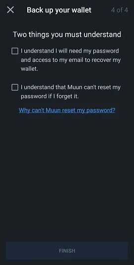
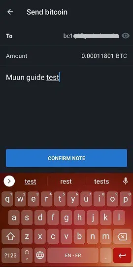
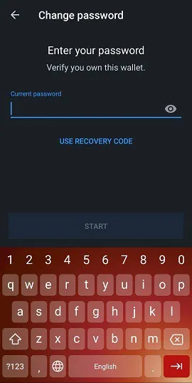

Muun (https://muun.com/) là một ví tự quản lý (self - custodial) dùng cho Bitcoin và Lightning.

## video hướng dẫn

## Hướng dẫn sử dụng ví Muun toàn tập

Hướng dẫn sử dụng đầy đủ (kèm ảnh chụp màn hình) cho ứng dụng Muun; một ví Bitcoin trên di động thân thiện với người dùng, cho phép bạn thực hiện giao dịch trên Lightning Network.

### Tải Muun và tạo ví của bạn

Đầu tiên, bạn cần tải ứng dụng di động, có sẵn trên cả iOS và Android. Luôn đảm bảo tải phiên bản chính thức từ nhà phát hành. Đôi khi có những bản sao lừa đảo trên thị trường. Tôi khuyên bạn nên tìm đến trang web chính thức của ví Muun, đó là https://muun.com/, và sử dụng liên kết cho hệ điều hành bạn chọn (iOS/Android), từ đó bạn có thể chắc chắn rằng bạn đang sử dụng ứng dụng chính thức.

Khi bạn mở ứng dụng, bạn sẽ có tùy chọn tạo một ví mới hoặc khôi phục một ví đã có. Hãy bắt đầu bằng cách tạo một ví mới. Sau đó, tôi sẽ hướng dẫn các bước để khôi phục ví. Nhấn "Tạo một ví mới - Create a new wallet".

Ví Muun sau đó yêu cầu bạn tạo một mã số cá nhân bốn chữ số (PIN). Với PIN, bạn tăng cường bảo mật cho ví của mình trong trường hợp, ví dụ, một kẻ xấu đánh cắp điện thoại và có thể đánh cắp bitcoin của bạn.

Và thế là ứng dụng đã tạo một ví hoàn toàn mới, nó sẽ trở thành trang chủ. Bây giờ bạn cần bảo vệ thông tin khôi phục ví liên quan trước khi gửi bất kỳ khoản tiền nào vào đó, nếu không, đó là một hành vi rủi ro.

### Sao lưu khóa

Nhấn vào ô "Sao lưu ví của bạn - Back up your wallet", và bạn sẽ được chuyển hướng đến tab "Bảo mật - Security". Quy trình sao lưu của Muun được chia tiện lợi thành ba bước. Không bắt buộc phải hoàn thành tất cả ba bước, nhưng sự kết hợp của chúng cung cấp mức độ bảo vệ tối đa.

Lựa chọn đầu tiên cho phép bạn kết nối ví của mình với một địa chỉ email, ngoài việc bảo vệ nó bằng mật khẩu. Đây là tùy chọn và bạn có thể bỏ qua mà không gặp vấn đề gì. Nếu bạn muốn sử dụng nó, nhấn "1: Sao lưu ví của bạn" và sau đó nhấn "Bắt đầu" trên màn hình tiếp theo và nhập một địa chỉ email. Màn hình tiếp theo sẽ thông báo rằng bạn cần xác nhận email bằng cách truy cập hộp thư của mình và nhấp vào liên kết được gửi đến từ email của Muun.

Một khi email được xác minh, bạn sẽ được yêu cầu tạo một mật khẩu. Sau đó, bạn sẽ cần click vào hai ô để đảm bảo bạn biết rằng việc khôi phục ví, nếu cần, sẽ yêu cầu sử dụng email và mật khẩu bạn vừa chọn. Điều này trái ngược với các ứng dụng truyền thống cho phép bạn đặt lại mật khẩu trong trường hợp mất hoặc quên, vì vậy hãy chắc chắn bạn đã ghi chép mọi thứ.

Lúc này, tab "Bảo mật" thông báo rằng bạn có một bản sao lưu cơ bản. Bây giờ bạn biết rằng ví của mình giờ đã có thể khôi phục được, do đo có thể quay lại tab "Ví" và sử dụng ứng dụng để hoàn thành các giao dịch (những chức năng này sẽ được chi tiết hóa sau trong hướng dẫn này). Tuy nhiên, tôi khuyên bạn nên sử dụng tùy chọn bảo mật số 2 để tạo một mã sao lưu bổ sung, trong trường hợp mật khẩu nhập trong tùy chọn số 1 bị xâm phạm hoặc nếu bạn không muốn sử dụng tùy chọn khôi phục qua email.
Tùy chọn "sao lưu thay thế - alternative backup" của Muun tương tự như cụm từ ghi nhớ (mnemonic phrase) được sử dụng bởi nhiều ứng dụng ví mà nhiều người dùng Bitcoin đã quen thuộc. Nhấn "Bắt đầu" để hiển thị mã khôi phục của bạn và ghi lại nó trên một tờ giấy (ứng dụng sẽ không cho phép chụp ảnh màn hình trang hiển thị mã code). Sau khi đã ghi chép lại, so sánh nó với mã code hiển thị trên màn hình vì bạn sẽ cần nhập lại nó trong ứng dụng để xác nhận tính hợp lệ của nó.

Một lần nữa, Muun yêu cầu bạn xác nhận rằng bản thân đã hiểu về vấn đề, đó là bạn sẽ cần mã 32 ký tự này trong trường hợp bạn mất mật khẩu đã thiết lập trước đó.

Việc sao lưu ví giờ đây đã được bảo mật đáng kể theo các tiêu chuẩn hiện đại mà chúng ta biết. Tuy nhiên, ứng dụng Muun có một tùy chọn bảo mật thứ ba được gọi là "Bộ dụng cụ khẩn cấp - Emergency Kit". Tạo Bộ dụng cụ khẩn cấp sẽ cho phép bạn khôi phục ví của mình mà không cần phải qua Muun. Nói cách khác, bằng cách sử dụng phần mềm ví Bitcoin khác với Muun.

Sau khi nhấn "Tạo bộ dụng cụ khẩn cấp", bạn sẽ được giải thích rằng bộ dụng cụ này có định dạng PDF chứa thông tin & hướng dẫn về việc chuyển tiền của bạn một cách độc lập. Bộ dụng cụ có thể được lưu trữ trên đám mây mà không lo lắng vì nó yêu cầu "Mã khôi phục - Recovery Code" của bạn để sử dụng, mã khôi phục này không được bao gồm trong tài liệu. Vuốt màn hình để truy cập trang tạo bộ dụng cụ.

Ba tùy chọn có sẵn cho bạn:

- Lưu vào đám mây trên tài khoản Google của bạn.
- Gửi email đến địa chỉ của bạn để sao lưu bộ dụng cụ và truy cập nó.
- Sao lưu thủ công với ứng dụng cục bộ trên thiết bị của bạn.

Hãy đảm bảo rằng bạn có thể truy cập bộ dụng cụ của mình sau khi bạn đã gửi nó đến điểm sao lưu mình chọn,  vì sau đó,  Muun sẽ yêu cầu bạn nhập mã sáu chữ số tìm thấy trong bộ dụng cụ để xác thực việc sao lưu của bạn.

Một khi bước cuối cùng này hoàn tất, cấu hình bảo mật và khôi phục ví của bạn đã hoàn thành. Bây giờ, chúng ta sẽ khám phá các cách sử dụng các bản sao lưu khác nhau vừa tạo ra ở trên để khôi phục ví của bạn.

### Khôi Phục Ví

Có nhiều tình huống mà người dùng có thể tạm thời mất quyền truy cập vào ví & tiền của họ; mất thiết bị, ứng dụng đã gỡ cài đặt/mất tích, quên mã PIN, ngắt kết nối ví, v.v. Do đó, việc biết cách lấy lại quyền truy cập này là rất quan trọng. Khi khôi phục qua ứng dụng Muun, nhấn tùy chọn "Tôi đã có ví - A Already Have A Wallet" trên màn hình.

#### Khôi phục bằng địa chỉ email

Nếu bạn đã sử dụng tùy chọn sao lưu thứ nhất của Muun, nhập địa chỉ email mà bạn đã chọn vào thời điểm đó. Vì mục này là tùy chọn, bạn cũng có thể chọn tiếp tục với mã khôi phục, đó là tùy chọn thứ hai được Muun cung cấp. Trước tiên, hãy xem qua tùy chọn email.

Một khi địa chỉ email của bạn được nhập, Muun sẽ thông báo cho bạn rằng một email đã được gửi đến hộp thư của bạn và bạn cần truy cập nó để ủy quyền khôi phục ví. Kiểm tra hộp thư của bạn (bao gồm cả phần thư rác) và sử dụng liên kết được gửi đến trong email của Muun. Lúc này, bạn sẽ được chuyển hướng đến màn hình, nơi sẽ yêu cầu bạn nhập mật khẩu liên kết với địa chỉ email đã đăng ký.

Bước cuối cùng là tạo một mã số cá nhân (PIN), và sau đó bạn sẽ trở lại với giao diện quen thuộc trên trang chủ của ví, hiển thị số dư liên kết với nó.

#### Sử dụng "Mã khôi phục - Recovery Code"
Khi khôi phục quyền truy cập vào ví hiện có, bạn có thể chọn sử dụng mã khôi phục ("Recovery Code" như được Muun chỉ định) mà bạn đã ghi chú trước đó nếu bạn chọn phương án sao lưu số 2. Quy trình này tương tự như quy trình được mô tả chi tiết trong phần trước: khôi phục qua email. Chỉ cần chọn sử dụng tùy chọn "Recover With Recovery Code" và nhập nó vào các trường thích hợp được hiển thị trên màn hình. Nếu ví của bạn cũng được sao lưu bằng email ngoài mã khôi phục, Muun sẽ yêu cầu bạn kiểm tra hộp thư để ủy quyền cho quá trình khôi phục. Sau khi click vào đường link được Muun gửi đến, bạn sẽ quay trở lại màn hình để hoàn tất việc khổi phục. Một lần nữa, bạn phải tạo một mã số cá nhân (PIN). Sau đó, bạn sẽ có quyền truy cập vào ví của mình trở lại.

#### Khôi phục sử dụng Bộ dụng cụ khẩn cấp

Để khôi phục ví của bạn mà không sử dụng ứng dụng Muun Wallet, bạn sẽ cần bộ dụng cụ khẩn cấp của mình, đây là phương án khôi phục thứ ba được Muun cung cấp. Phương án này cho phép bạn chuyển số tiền được giữ trong ví Muun của bạn đến bất kỳ địa chỉ Bitcoin nào khác. Vì vậy, hãy chắc chắn rằng bạn có một ví thay thế có thể tạo ra một địa chỉ mà bạn sẽ chuyển tiền đến.

Truy cập tài liệu PDF mà bạn đã lưu khi tạo bộ dụng cụ khẩn cấp. Tài liệu này chứa các hướng dẫn cần thiết để khôi phục ví của bạn. Lưu ý rằng tính năng này yêu cầu sử dụng máy tính để bàn hoặc laptop vì bạn cần tải xuống một script được nhóm phát triển Muun tạo ra. Liên kết được bao gồm trong email, nhưng tôi sẽ chia sẻ nó ở đây: https://github.com/muun/recovery

Bộ dụng cụ khẩn cấp được trang bị một mã xác minh, mà bạn đã sử dụng để xác nhận việc tạo bộ dụng cụ, cũng như hai chìa khóa. Bạn cần đến các chìa khoá khi kích hoạt script khôi phục Muun. Vì vậy, hãy chắc chắn rằng bạn có chúng trong tay khi thao tác.

Dưới đây là hướng dẫn:

Thủ tục khẩn cấp này sẽ giúp bạn khôi phục số tiền của mình nếu bạn không thể sử dụng Muun trên thiết bị của mình.

1. Tìm mã khôi phục của bạn (Recovery Code)

Bạn đã viết mã này trên một tờ giấy trước khi tạo bộ dụng cụ khẩn cấp của mình. Bạn sẽ cần nó sau này.

2. Tải công cụ khôi phục

Truy cập trang https://github.com/muun/recovery và tải công cụ này về máy tính của bạn.

3. Khôi phục số tiền của bạn

Chạy công cụ khôi phục và làm theo các bước. Công cụ sẽ chuyển số tiền của bạn đến một địa chỉ Bitcoin theo lựa chọn của bạn.

Một khi đã ở trong script, tất cả những gì bạn phải làm là nhập thông tin được yêu cầu trên màn hình. Script sẽ thực hiện quá trình chuyển tiền cho bạn. Trang "github" được cung cấp ở trên có sẵn một video hoạt hình để hướng dẫn bạn biết chính xác điều gì sẽ xảy ra khi bạn khởi động script khôi phục.

## Giao dịch nhận

### Tab Bitcoin

Bây giờ chúng ta sẽ xem xét phần "Nhận - Receive" của ví Muun và các chức năng khác nhau của nó. Trang chủ của ứng dụng là tab "Ví - Wallet". Số dư của bạn được hiển thị ở trung tâm, và bạn có thể chạm vào nó để chuyển đổi giữa việc ẩn hoặc hiển thị số tiền. Chúng ta sẽ xem xét tất cả các cài đặt ứng dụng ở phía sau trong bài viết này. Bây giờ, hãy nhấn "Nhận - Receive" để khám phá chức năng này.

Trên trang này, bạn có thể chọn nhận giao dịch trên cả hai mạng Bitcoin và Lightning. Một địa chỉ mới (và mã QR tương ứng) phù hợp với mạng mong muốn sẽ được hiển thị. Mặc định, một địa chỉ Bitcoin sẽ được hiển thị khi bạn đến màn hình "Nhận". Bằng cách chạm vào mã QR, địa chỉ sẽ được sao chép vào bộ nhớ tạm thiết bị của bạn. Bạn có thể dễ dàng chia sẻ địa chỉ trực tiếp đến các ứng dụng khác với nút "Chia sẻ", và bạn cũng có thể sao chép địa chỉ với nút "Sao chép". Nhấn vào biểu tượng con mắt ở cuối địa chỉ sẽ hiển thị địa chỉ đầy đủ, cho phép bạn so sánh nó với địa chỉ đã sao chép vào bộ nhớ tạm khi chia sẻ.

Thông tin này chứa đầy đủ mọi thứ bạn cần để nhận giao dịch trên mạng Bitcoin. Ngoài ra, Muun cung cấp cho bạn một số tùy chọn tùy chỉnh dưới menu "Cài đặt địa chỉ - Address settings". Đầu tiên, bạn có thể thêm một số tiền vào mô tả địa chỉ. Thứ hai, bạn có thể chọn sử dụng địa chỉ Segwit (lựa chọn mặc định) hoặc địa chỉ truyền thống (legacy).

Bằng cách nhấn "Thêm +", bạn có thể thêm một số tiền cụ thể vào địa chỉ, làm cho việc gửi tiền dễ dàng hơn. Tùy chọn này là không bắt buộc. Lưu ý rằng một khi số tiền được nhập, nút "Sao chép" trên trang trước sẽ thêm thông tin vào địa chỉ đã sao chép ("bitcoin:" là tiền tố, theo sau là số tiền làm hậu tố). Để tránh phải điều chỉnh này một cách bất ngờ, nhấn trực tiếp vào mã QR để sao chép địa chỉ. Thông tin số tiền sẽ được giữ nguyên với nó. Ngoài ra, ứng dụng cho phép bạn chọn nhập số tiền bằng đồng tiền của bạn, đơn giản hóa quá trình chuyển đổi sang BTC.

Về việc lựa chọn loại địa chỉ, Segwit hoặc Legacy, tôi khuyên bạn nên giữ Segwit. Loại địa chỉ này (bắt đầu với "bc1") giảm kích thước dữ liệu giao dịch và do đó giảm phí giao dịch liên quan. Tuy nhiên, có thể bạn sẽ cần sử dụng hệ thống "Legacy" (địa chỉ bắt đầu với "3") trong trường hợp ví hoặc phần mềm không tương thích với địa chỉ Segwit. Do đó, quan trọng là phải biết cách phân biệt giữa hai loại địa chỉ này.

## Tab Lightning

Để nhận giao dịch qua mạng Lightning, bạn cần chạm vào tab Lightning ở đầu màn hình. Một mã QR chứa địa chỉ Lightning sẽ được hiển thị, bạn có thể sao chép và chia sẻ theo cùng một cách như các địa chỉ Bitcoin đã được đề cập ở phía trên. Tôi muốn nhắc bạn rằng Lightning Network cho phép bạn tận hưởng tốc độ giao dịch gần như tức thì và phí giao dịch chỉ là một phần rất nhỏ so với phí onchain trên Bitcoin.

Các tùy chọn tùy chỉnh có thể được tìm thấy dưới menu "Cài đặt hóa đơn - Invoice settings". Tại đây, bạn có thể thay đổi số tiền liên quan đến địa chỉ bằng cách chạm vào "Thêm +". Dựa trên kinh nghiệm của mình với Lightning Network, tôi tin rằng tốt hơn hết là nhập một số tiền khi tạo giao dịch vì một số ví không phản hồi tốt với hóa đơn trống. Bạn cũng sẽ nhận thấy rằng có một bộ đếm thời gian hết hạn trong menu này. Trong ứng dụng này, bộ đếm thời gian được thiết lập cho 60 phút, sau đó địa chỉ sẽ không còn hợp lệ. Lưu ý rằng Muun tạo một địa chỉ Lightning mới mỗi khi bạn thay đổi số tiền hoặc khi bạn rời đi và quay trở lại trang.

## Sử dụng chức năng LNURL
Ví Muun cho phép sử dụng LNURL để nhận giao dịch. Chức năng này được kích hoạt bằng cách chạm vào biểu tượng quét hình vuông nằm ở góc trên bên phải của trang. Đây là chức năng có nhiều ưu điểm, bao gồm tránh được việc phải chia sẻ hóa đơn để nhận giao dịch. Thay vào đó, bạn chỉ cần quét mã QR để nhận thông tin thanh toán, sau đó bạn có thể xác nhận để hoàn tất quá trình giao dịch.

Ban đầu, Muun sẽ hiển thị cho bạn một trang giải thích (xem ảnh chụp màn hình ở trên) và sau đó yêu cầu bạn kích hoạt camera của thiết bị, một bước cần thiết để sử dụng ứng dụng. Lưu ý rằng hiện tại không phải tất cả các ví Lightning đều hỗ trợ địa chỉ LNURL. Các ví hỗ trợ thường chỉ cho phép sử dụng LNURL để nhận giao dịch chứ không phải để gửi chúng.

## Giao dịch gửi

### Qua mạng Bitcoin

Giờ đây, sau khi chúng ta đã biết cách nhận bitcoin với Muun, hãy khám phá cách gửi chúng. Quay lại trang chủ dưới tab "Ví", bạn sẽ cần nhấn "Gửi - Send". Một trang đơn giản sẽ xuất hiện, nơi bạn có tùy chọn sao chép địa chỉ Bitcoin hoặc Lightning vào trường được chỉ định hoặc nhấn biểu tượng mã QR bên phải trường này để kích hoạt camera và quét địa chỉ dưới dạng mã QR.

Khi chuyển đến trang "Gửi", nếu bạn đã có một địa chỉ được sao chép trên thiết bị của mình, Muun sẽ nhận diện định dạng địa chỉ (Bitcoin hoặc Lightning) và đề xuất sử dụng nó để phát sóng một giao dịch thông qua một thông điệp được chuẩn hoá.

Khi chuẩn bị một giao dịch Bitcoin, bạn cần nhập số tiền để gửi. Đảm bảo rằng địa chỉ nhận hiển thị ở đầu màn hình khớp với địa chỉ đã được sao chép trước đó. Dưới số tiền để gửi, Muun hiển thị số dư của ví bạn và cho bạn tùy chọn sử dụng toàn bộ số tiền của mình, một tính năng rất hữu ích nếu bạn muốn làm trống hoàn toàn ví của mình và tránh để lại "bụi" (một vài satoshis).

Sau khi xác nhận số tiền để gửi, Muun yêu cầu bạn viết một ghi chú trên trang tiếp theo. Điều này phục vụ như một bước xác nhận bổ sung, và bạn tự do viết bất cứ điều gì bạn muốn, có liên quan hay không liên quan tới giao dịch.

Một lần kiểm tra cuối cùng về chi tiết giao dịch trước khi phát sóng nó là điều rất cần thiết. Xác nhận địa chỉ và số tiền đã nhập, sau đó tùy chỉnh phí giao dịch nếu cần bằng cách nhấn vào biểu tượng bút chì màu xanh bên phải "Phí mạng lưới - Network fee". Hiểu cơ bản về cách hoạt động của mempool trên Bitcoin là một kiến thức hữu ích có thể giúp bạn tiết kiệm được nhiều satoshis theo thời gian!

Phần mềm của Muun mặc định thực hiện một thuật toán tính toán phí giao dịch cần thiết cho một xác nhận trong 30 phút hoặc ít hơn. Đây là những gì sẽ được hiển thị khi bạn cố gắng sửa đổi phí giao dịch. Nút "Nhập phí thủ công - Enter Fee Manually" cho phép bạn tự tùy chỉnh chi tiết này, một tính năng rất hữu ích nếu bạn cần một xác nhận nhanh hơn hoặc, ngược lại, nếu bạn có phạm vi thời gian chờ đợi xác thực thoải mái hơn.

Khi chọn nhập số tiền phí giao dịch thủ công, bạn sẽ được đưa đến một trang mới chỉ ra số tiền cần nhập theo sat/vbyte (satoshis trên mỗi byte ảo). Muun thậm chí còn hiển thị ước lượng thời gian xác nhận liên quan đến số tiền đã chọn, cũng như chi phí bằng BTC và tiền pháp định của bạn.

Quay lại trang tổng quan các chi tiết của giao dịch và nhấn "Gửi". Vậy là giao dịch của bạn đã được phát sóng trên mạng Bitcoin! Bạn sẽ được chuyển hướng đến trang chủ của ví, nơi bạn sẽ thấy số dư của mình đã bị trừ đi. Ở cuối màn hình, có một mũi tên mà bạn có thể nhấn để kiểm tra lịch sử giao dịch của mình. Giao dịch bạn vừa thực hiện sẽ được thêm vào lịch sử một khi bạn phát hành nó.

Nhấn vào một mục để xem chi tiết của một giao dịch cụ thể. Giao dịch của bạn sẽ được xác nhận khi một thợ đào thêm một khối mới chứa nó vào blockchain. Muun chia sẻ ID giao dịch ở cuối màn hình, cho phép bạn kiểm tra trạng thái của giao dịch trên một trình duyệt blockchain.

## Qua Lightning Network

Bây giờ, hãy sử dụng một hóa đơn Bolt 11 (hóa đơn Lightning truyền thống/mặc định) để thực hiện một giao dịch. Sao chép hoặc quét một địa chỉ Lightning trên trang "Gửi". Bạn sẽ được chuyển hướng đến một trang mới hiển thị chi tiết của hóa đơn hiện tại. Số tiền giao dịch sẽ được hiển thị (bao gồm cả phí mạng lưới), cùng với ghi chú hoặc mô tả được viết trên hóa đơn, và bộ đếm thời gian hết hạn ở phía cuối. Lưu ý rằng phí giao dịch không thể được chỉnh sửa cho các giao dịch trên Lightning Netwrok. Chúng được xác định bởi tuyến đường các kênh mà chúng sẽ phải đi qua để đến được người nhận.

(Đây là cảnh báo hiển thị trên màn hình khi sử dụng một hóa đơn trống, có nghĩa là nó không có số tiền được điền trước. Một số ví hỗ trợ loại hóa đơn này và cho phép bạn tự tùy chỉnh số tiền. Điều này không áp dụng cho Muun.)

Nhấn vào biểu tượng hình con mắt cho phép bạn xem chi tiết của node Lightning mà bạn tương tác với trong giao dịch này. Bạn thậm chí có tùy chọn để xem một trình duyệt web nhằm biết thêm thông tin. Đây là một ví dụ tốt về khả năng trừu tượng hoá kỹ thuật mà Muun đạt được.

Một khi bạn nhấn "Gửi", giao dịch của bạn sẽ được khởi động và, thông thường, hoàn thành trong một tích tắc. Số tiền đã trả sẽ được trừ từ số dư của bạn, hiển thị trên trang chủ của ứng dụng. Quay lại lịch sử giao dịch của bạn để xem xác nhận tức thì của việc thanh toán.

Lưu ý rằng trong lịch sử, giao dịch Lightning & Bitcoin được phân biệt bằng một biểu tượng khác nhau. Để xem chi tiết của giao dịch Lightning, hãy chạm vào nó trên màn hình lịch sử của bạn.

## Cài đặt ứng dụng

Tab thứ ba trên trang chủ, "Cài đặt - Settings", là nơi bạn có thể tìm thấy cài đặt của ứng dụng. Trang này ngắn một cách đáng ngạc nhiên, đặc biệt so với các ví di động phổ biến khác. Theo ý kiến của tôi, đây không phải là một nhược điểm; ngược lại, tôi coi đó là một lợi thế về độ đơn giản.

Trong danh mục chung, bạn có thể chọn đơn vị tài khoản và đồng tiền ưa thích của mình, cũng như phông giao diện của ứng dụng (tối hoặc sáng), ban đầu sẽ được xác định dựa trên hệ thống thiết bị của bạn.

Đối với đơn vị tài khoản của ứng dụng, chọn giữa Bitcoin (BTC) hoặc Satoshi (SAT). Có thể bạn chưa biết, một Satoshi là phần nhỏ nhất của một bitcoin, nằm ở vị trí chức số thập phân thứ tám (1 SAT = 0.00000001 BTC). Định giá ví bằng Satoshis thường được ưa chuộng khi bạn chủ yếu sử dụng Lightning Network với số lượng nhỏ.

Muun cung cấp một danh sách rộng lớn các loại tiền tệ, giúp bạn dễ dàng tìm thấy sự chuyển đổi BTC cần thiết cho nhu cầu giao dịch và/hoặc cá nhân của mình.
Nếu bạn thấy cần thiết phải thay đổi mật khẩu khôi phục ví của mình, bạn có thể làm điều đó trên trang cài đặt. Đảm bảo rằng bạn có mật khẩu hiện tại hoặc mã khôi phục và quyền truy cập vào email của mình để thực hiện thao tác này.

Nhập mật khẩu hiện tại của bạn hoặc chọn nhập mã khôi phục để bắt đầu quá trình đặt lại. Muun sẽ gửi một email đến địa chỉ bạn đã đăng ký trước đó.

Mục cài đặt nâng cao bao gồm hai mục: Mạng Bitcoin và Lightning Network. Trong mạng Bitcoin, chúng ta được lựa chọn kích hoạt địa chỉ nhận Taproot (bc1p, loại địa chỉ mới nhất) mặc định.

Bên trong Lightning Network, bạn sẽ tìm thấy:

- Giao thức nhận: Chọn mạng nhận mặc định hiển thị trên màn hình nhận. Một chức năng thử nghiệm, Unified, cũng có sẵn. Đây là một mã QR kết hợp cả địa chỉ Bitcoin và Lightning. Tuy nhiên, hiện tại ít phần mềm Bitcoin hỗ trợ tính năng này.

- Kênh Turbo: Tùy chọn này cho phép bạn kích hoạt hoặc vô hiệu hóa tính năng kênh Turbo. Theo mặc định, nó được kích hoạt.

Để hiểu được thứ được gọi là kênh Turbo, trước tiên chúng ta phải biết rằng các giao dịch Lightning được thực hiện thông qua các kênh từ người dùng này sang người dùng khác, và những kênh này ban đầu phải được cấp vốn bởi một giao dịch trên blockchain Bitcoin.

Kênh Turbo cho phép bạn bắt đầu giao dịch trên mạng Lightning ngay cả trước khi có bất kỳ giao dịch on-chain nào được xác nhận. Vô hiệu hóa chức năng này sẽ có nghĩa là bạn sẽ phải chờ đợi lâu hơn nhiều để thực hiện giao dịch trên mạng Lightning, đổi lại là tăng cường an toàn cho tiền của bạn, vì khi đó bạn sẽ không phải tin tưởng rằng Muun sẽ không hành động xấu (một hành động lặp chi công khai) trong khi chờ giao dịch của bạn được xác nhận trên blockchain.

Ở cuối trang cài đặt là tùy chọn "Đăng xuất". Bạn có thể sử dụng chức năng này nếu bạn muốn ứng dụng ngắt kết nối ví hiện tại. Điều này sẽ cho phép bạn tạo một ví mới hoặc nhập/khôi phục một ví đã có.

