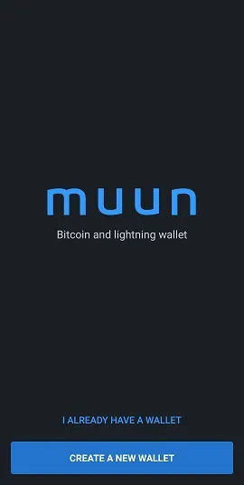
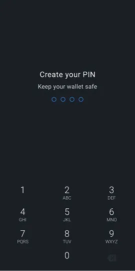
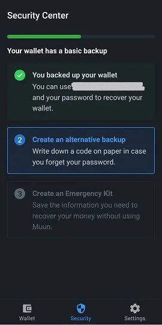
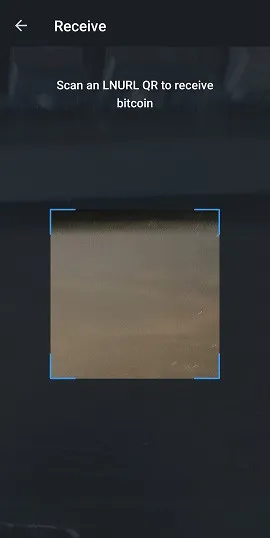

Muun (https://muun.com/) 是一个自托管的比特币和闪电网络钱包。

## 视频教程

## Muun钱包 - 完整用户指南

Muun应用的完整用户指南（附带截图）；一个用户友好的移动比特币钱包，允许您在闪电网络上进行交易。

### 下载Muun并创建您的钱包

首先，您需要下载移动应用程序，该应用程序在iOS和Android上都可用。始终确保下载正确的版本。市场上有时会出现欺诈性复制品。我推荐访问官方Muun钱包网站，即https://muun.com/，并使用您选择的系统（iOS/Android）的链接，从那里您可以确定您正在使用官方应用程序。

当您打开应用程序时，您将有选项创建一个新钱包或恢复现有的钱包。让我们开始创建一个新钱包。之后我将演示恢复钱包的步骤。点击“创建一个新钱包”。

然后Muun钱包要求您创建一个四位数的个人识别码（PIN）。通过PIN，您可以在例如有恶意行为者偷走您的手机并因此盗取您的比特币的情况下，增加您钱包的安全性。

就这样，应用程序已经生成了一个全新的钱包，现在将成为首页。现在您需要在向其发送任何资金之前，确保相关的钱包恢复信息已经安全，因为那将是一个风险做法。

### 密钥备份

点击“备份您的钱包”框，您将被重定向到“安全”标签。Muun的备份过程方便地分为三步。完成所有三个步骤不是强制性的，但它们的组合提供了最大的预防措施。

第一个选项允许您将钱包连接到一个电子邮件地址，并通过密码保护它。这个选项是可选的，可以不做任何问题地跳过。如果您想使用它，请按“1: 备份您的钱包”，然后在下一个屏幕上点击“开始”并输入一个电子邮件地址。下一个屏幕将告诉您需要通过访问您的邮箱并点击Muun邮件中提供的链接来验证电子邮件。

一旦电子邮件被验证，您将被提示创建一个密码。然后，您需要勾选两个框，表明您理解，如果需要恢复钱包，将需要使用您刚刚选择的电子邮件和密码。这与传统程序允许您在丢失或忘记密码的情况下重置密码形成对比，所以请确保您已经记录了一切。

“安全”标签现在表明您有了一个基本备份。您现在可以返回到“钱包”标签，并使用应用程序完成交易（这些功能将在本指南后面详细介绍），知道钱包现在是可恢复的。然而，我推荐使用安全选项#2生成一个额外的备份代码，以防在选项#1中输入的密码被泄露或如果您更愿意不使用电子邮件恢复选项。

Muun的“备用备份”选项类似于许多比特币用户熟悉的多个钱包应用程序使用的助记词。按“开始”显示您的恢复代码，并将其写在一张纸上（应用程序在显示代码的页面上禁止截图）。记录下来后，将其与屏幕上显示的代码进行比较，因为您需要在应用程序中重新输入它以确认其有效性。
Muun再次要求您确认您了解的问题，即如果您丢失了之前设置的密码，您将需要这个32个字符的代码。

根据我们所知的现代标准，钱包备份现在已经得到了显著的加固。然而，Muun应用程序有第三个安全选项，称为“紧急工具包”。创建紧急工具包将允许您在不需要通过Muun的情况下恢复您的钱包。换句话说，就是使用不同于Muun的比特币钱包软件。

按下“创建紧急工具包”后，将向您解释，此工具包以包含有关独立转移资金的信息和指示的PDF文档形式出现。该工具包可以无忧存储在云端，因为它需要您的“恢复代码”才能使用，而该代码不包含在文档中。滑动屏幕以访问工具包创建页面。

有三个选项可供您选择：

- 保存到您的Google账户的云端。
- 发送电子邮件到您自己的地址以备份您的工具包并访问它。
- 使用您设备上的本地应用程序手动备份。

确保一旦您将其发送到所选的备份目的地，您就可以访问您的工具包，因为Muun随后会要求您输入在工具包中找到的六位数代码，以便进行验证。

完成这最后一步后，您的钱包安全和恢复配置现已完成。我们现在将探索使用新创建的备份恢复您的钱包的不同方法。
钱包恢复

有许多情况下，用户可能会暂时失去对他们的钱包和资金的访问；设备丢失、卸载/缺失应用程序、忘记个人识别码、钱包断开连接等。因此，知道如何重新获得这种访问权限至关重要。通过Muun应用程序恢复时，在开屏幕上按“我已经有一个钱包”选项。

### 通过电子邮件地址恢复

如果您使用了Muun的备份选项#1，请输入当时选择的电子邮件地址。由于此选项是可选的，您也可以选择改用恢复代码，这恰好是Muun提供的选项#2。让我们首先讨论电子邮件选项。

一旦输入您的电子邮件地址，Muun将通知您已向您发送了一封电子邮件，并且您需要访问它以授权钱包恢复。检查您的邮箱（包括垃圾邮件部分），并使用Muun电子邮件中提供的链接。您将被重定向到应用程序，屏幕现在将要求您输入与注册电子邮件地址关联的密码。

最后一步是创建个人识别码，然后您将回到钱包主页的熟悉领域，显示与之关联的余额。

### 使用“恢复代码”
当您需要恢复对现有钱包的访问时，如果您选择了备份选项#2，可以选择使用您之前记录的恢复代码（Muun指定的“恢复代码”）。
这个过程与上一节详述的恢复过程相似；通过电子邮件恢复。只需选择“使用恢复代码恢复”选项，并在屏幕上显示的相应字段中输入它。如果您的钱包除了恢复代码外还通过电子邮件备份，Muun将要求您检查您的邮箱以授权恢复过程，点击提供的链接返回应用程序后，您可以完成此过程。再次，您必须创建一个个人识别码。这样，您将再次访问您的钱包。

### 使用紧急工具包恢复

要在不使用Muun钱包应用程序的情况下恢复您的钱包，您将需要您的紧急工具包，这是Muun提供的第三个恢复选项。此选项允许您将Muun钱包中持有的资金发送到任何其他比特币地址。因此，请确保您有一个可以生成地址的备用钱包，以便将资金发送到该地址。

访问您在创建工具包时保存的PDF文档。该文档包含恢复钱包所需的指令。请注意，此功能需要使用桌面或笔记本电脑，因为您需要下载Muun开发团队创建的脚本。链接包含在电子邮件中，但我还是会在这里分享：https://github.com/muun/recovery

紧急工具包配备了一个验证代码，您已经使用它来确认工具包的创建，以及两把钥匙。在激活Muun恢复脚本时，这些钥匙将是必需的。因此，请确保在操作过程中手头有它们。

以下是指令的翻译：

如果您无法在设备上使用Muun，这个紧急程序将帮助您恢复您的资金。

1. 找到您的恢复代码

在创建紧急工具包之前，您已经在一张纸上写下了这个代码。稍后您将需要它。

2. 下载恢复工具

访问页面 https://github.com/muun/recovery 并将工具下载到您的电脑上。

3. 恢复您的资金

运行恢复工具并按照步骤操作。该工具将把您的资金转移到您选择的比特币地址。

在脚本中，您所要做的就是在屏幕上输入请求的信息。脚本将为您处理资金转移过程。在上面提供的“github”页面上，有一个过程的动画视频可用，它将准确地向您展示当您启动恢复脚本时会发生什么。

## 接收交易

### 比特币标签

我们现在将介绍Muun钱包的“接收”部分及其各种功能。您应用程序的主页是“钱包”标签。您的余额显示在中心，您可以点击它来切换隐藏金额和显示金额。我们稍后将在本文中讨论所有应用程序设置。现在，让我们按“接收”来探索这个功能。

在这个页面上，您可以选择通过比特币和闪电网络接收交易。将显示与所需网络相对应的新地址（及其关联的二维码）。默认情况下，当您进入“接收”屏幕时，会显示一个比特币地址。通过点击二维码，地址将被复制到您的设备剪贴板上。您可以通过“分享”按钮直接将地址分享给其他应用程序，也可以通过“复制”按钮复制地址。按下地址末尾的眼睛图标将显示完整地址，允许您将其与分享时复制到剪贴板的地址进行比较。

这些信息包含了您在比特币网络上接收交易所需的一切。此外，Muun还在“地址设置”菜单下为您提供了一些自定义选项。首先，您可以在地址描述中添加金额。其次，您可以选择使用Segwit地址（默认选项）或传统地址（遗留）。

通过按“添加+”，您可以在地址中添加特定金额，使发送方更加方便。这个选项是可选的。请注意，一旦输入了金额，“复制”按钮在前一页将会向复制的地址添加信息（前缀为“bitcoin:”，后缀为金额）。为了避免不得不即兴调整，直接按二维码来复制地址。金额信息将与之固定。此外，应用程序允许您选择以您选择的货币输入金额，简化了转换为BTC的过程。

关于地址类型的选择，Segwit或Legacy，我建议保留Segwit。这种类型的地址（以“bc1”开头）减小了交易数据的大小，从而减少了相关的交易费用。然而，如果钱包或软件不兼容Segwit地址，您可能需要使用“Legacy”系统（地址以“3”开头）。因此，了解如何区分这两种类型是很重要的。

## 闪电网络标签

要通过闪电网络接收交易，您需要点击屏幕顶部同名的标签。现在将显示包含闪电地址的二维码，您可以以与前面指南中提到的比特币地址相同的方式复制和分享。我提醒您，闪电网络允许您享受几乎即时的交易速度，除此之外，交易费用只是比特币链上的一小部分。

自定义选项可以在“发票设置”菜单下找到。在这里，您可以通过点击“添加+”修改与地址关联的金额。根据我对闪电网络的经验，我认为在创建交易时输入金额是更好的，因为几个钱包对空白发票的响应不佳。您还会注意到这个菜单中有一个过期计时器。在这个应用程序中，计时器设置为60分钟，之后地址将无效。请注意，每次您更改金额或离开并返回页面时，Muun都会生成一个新的闪电地址。

## 使用LNURL功能
Muun 钱包提供了使用 LNURL 接收交易的功能。通过点击页面右上角的方形扫描符号激活此功能，它有几个优点，包括避免了分享发票以接收交易的需要。相反，您需要扫描二维码以接收支付信息，然后您可以验证以确认交易过程。

Muun 最初会向您展示一个说明页面（见上方截图），然后要求您启用设备的摄像头输入，这是使用应用程序的必要步骤。请注意，目前并非所有 Lightning 钱包都支持 LNURL 地址。那些支持的通常只提供使用 LNURL 接收交易的能力，而不是发送它们。

## 发送交易

### 通过比特币网络

现在我们已经看到了如何使用 Muun 接收比特币，让我们探索如何发送它们。回到主页下的“钱包”标签，您需要按“发送”。现在将出现一个简单的页面，在这里您可以选择将比特币或 Lightning 地址复制到指定字段中，或按该字段右侧的二维码图标激活摄像头并扫描二维码形式的地址。

当您到达“发送”页面时，如果您的设备上已经复制了一个地址，Muun 将识别地址格式（比特币或 Lightning）并建议使用它通过框架消息广播交易。

准备比特币交易时，您需要输入要发送的金额。确保屏幕顶部显示的目的地址与之前复制的地址匹配。在要发送的金额下方，Muun 显示您钱包的余额，并提供使用您所有资金的选项，这是一个非常有用的功能，如果您想完全清空您的钱包并避免留下“尘埃”（一些聪）。

确认发送金额后，Muun 在下一页要求您写一个备注。这作为额外的验证，您可以随意写下任何您想要的内容，无论相关与否。

在最终广播之前，需要最后审查交易详情。验证输入的地址和金额，然后如有需要，通过按“网络费用”右侧的蓝色铅笔图标来自定义交易费用。了解比特币交易池（mempool）的基础知识是一个很好的教育体验，可能会随着时间的推移为您节省许多聪！

Muun 的软件默认实现了一个算法，计算出 30 分钟或更短时间内确认所需的交易费用。当您尝试修改交易费用时，将显示这一点。"手动输入费用"按钮允许您自己自定义这个细节，如果您需要更快的确认或相反，如果您有较大的操作余地，这个功能可能非常有用。

选择自己输入交易费用金额后，您将被带到一个新页面，指示以 sat/vbyte（每虚拟字节的聪）输入的金额。Muun 甚至显示了与所选金额相关的确认时间估计，以及您选择的 BTC 和法定货币的成本。

返回到交易详情概览页面并按“发送”。瞧，您的交易已经在比特币网络上广播了！您将被重定向到钱包的首页，在那里您将看到您的余额已经减少。在屏幕的底部，有一个箭头，您可以按它来检查您的交易历史。您刚刚进行的交易将被添加到其发出的初始时刻。

按一个条目来查看特定交易的详情。当矿工将包含它的新区块添加到链上时，您的交易将被确认。Muun在屏幕底部分享了交易ID，允许您在区块浏览器上检查您的交易状态。

## 通过闪电网络

现在让我们使用Bolt 11发票（传统/默认的闪电发票）来进行交易。在“发送”页面复制或扫描一个闪电地址。您将被重定向到一个新页面，显示当前发票的详情。交易金额将被显示（包括网络费用），以及发票上写的备注或描述，以及底部的过期计时器。请注意，闪电交易的交易费用不能修改。它们由它们必须经过的通道路线来决定，以达到接收者。

（这是在使用空白发票时屏幕上显示的警告，意味着它没有预填充金额。一些钱包支持这种类型的发票，并允许您自己定制金额。Muun不是这种情况。）

按下眼睛图标可以显示您在此交易中处理的闪电节点的详情。您甚至有选项查看网络浏览器以获取更多信息。这是Muun实现的技术抽象的一个好例子。

一旦您按“发送”，您的交易将被启动，并且通常在一秒的一小部分内完成。支付的金额将从您的余额中扣除，可在应用的首页上看到。返回到您的交易历史，以查看支付的即时确认。

请注意，在历史记录中，闪电和比特币交易通过不同的符号区分。要查看闪电交易的详情，请在您的历史屏幕上点击它。

## 应用设置

首页上的第三个标签，“设置”，是您可以找到应用设置的地方。这个页面出奇地简短，尤其是与其他流行的移动钱包相比。在我看来，这不是一个缺点；相反，我认为这在简单性方面是一个优势。

在通用类别中，您可以选择您偏好的账户单位和货币，以及应用的外观主题（暗或亮），这将最初基于您设备的系统来确定。

对于应用的账户单位，可以在比特币（BTC）或Satoshi（SAT）之间选择。仅供您参考，一个Satoshi是比特币的最小分数，即第八个小数位（1 SAT = 0.00000001 BTC）。当主要使用闪电网络进行小额交易时，通常更喜欢以Satoshi来表示钱包。

Muun提供了广泛的货币选择，使您更容易找到所需的BTC转换，以满足您的交易和/或个人需求。
如果您觉得有必要更改您的钱包恢复密码，您可以在设置页面进行更改。请确保您拥有当前的密码或恢复码，并且能够访问您的电子邮件。

输入您当前的密码或选择输入您的恢复码以启动重置。Muun将向之前注册的地址发送一封电子邮件。

高级设置部分包含两个条目：比特币网络和闪电网络。在比特币网络中，我们可以选择默认启用Taproot接收地址（bc1p，最新的地址类型）。

在闪电网络内部，您将找到：

- 接收协议：选择在接收屏幕上默认显示的接收网络。一个实验功能，统一（Unified），也是可用的。这是一个统一比特币和闪电地址的二维码。然而，目前很少有比特币软件支持这个功能。

- Turbo通道：此选项允许您启用或禁用Turbo通道功能。默认情况下，它是启用的。

要理解所谓的Turbo通道，我们首先必须知道，闪电交易是通过一个用户到另一个用户的通道进行的，这些通道最初必须通过比特币区块链上的一笔交易来资助。

Turbo通道允许您在任何链上交易被确认之前就开始在闪电网络上进行交易。禁用此功能意味着您将不得不等待更长的时间才能在闪电网络上进行交易，以换取您资金的增加安全性，否则您必须信任Muun不会在等待您的交易在区块链上确认的同时恶意行动（一个非常公开的双重支付）。

在设置页面的底部是“登出”选项。如果您希望应用程序断开当前识别的钱包，您可以使用此功能。这将允许您创建一个新钱包或导入/恢复一个现有的钱包。

