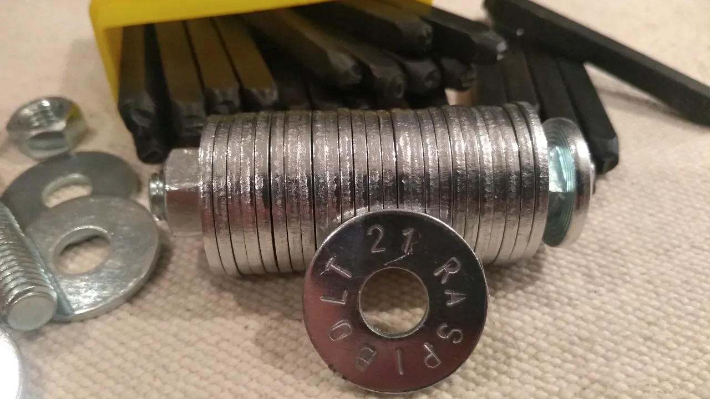
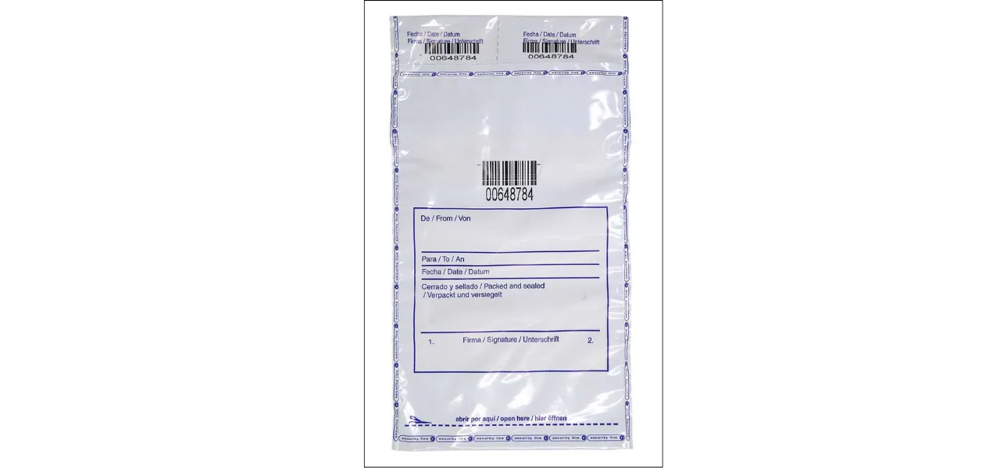
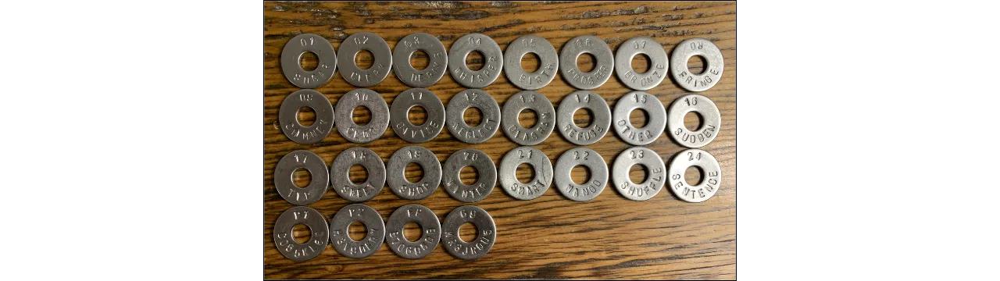

## 1.导言

**Ninja SAFU** 方法是一种**DIY（自己动手）**解决方案，可让您创建**助记词**（由 **BIP-39** 标准定义的 12 或 24 个单词组成的助记词）的**可持续、安全且隐蔽的**备份。此助记词对于恢复比特币钱包或任何其他兼容钱包至关重要。

您无需将助记词写在纸上（这种方法虽然简单但容易出错），而是将其刻在组装在**螺栓**上的**不锈钢垫圈**上。最终形成一个紧凑、防火、防腐蚀、防水和防震的备份。与易受火焰、潮湿或时间侵蚀的纸张不同，不锈钢即使在极端条件下（高达 1300°C 或 20 吨压力）也能保证长期保存。

Ninja SAFU 方法具有以下几个优势：

- **保密性**：您购买的并非专门用于加密货币备份的产品。其组件均为标准件（垫圈、螺栓、金属盒），五金店即可轻松购得，从而降低了因专业供应商数据泄露而成为攻击目标的风险。

- **经济实惠**：根据您已有的工具，此方案的成本在 **15 至 140 欧元** 之间。

- **可靠性**：该方法自 2020 年以来经过测试，并由 [Jameson Lopp](https://jlopp.github.io/metal-Bitcoin-storage-reviews/reviews/safu-ninja/)等安全专家进行了反复验证，他们对其进行了严格的压力测试（极端高温、腐蚀、机械压力）。

本分步指南将向您展示如何制作自己的 Ninja SAFU 备份，从而更好地保护您的比特币免遭丢失或损毁。如果您想了解更多关于备份和保护助记词的信息，请参阅附录。

### 2.1 所需材料

- **不锈钢垫圈（推荐 M8）**：
- **材质**：不锈钢（例如 304 或 V4A，以增强耐腐蚀性）
- **尺寸**：M8（内径 8 毫米，外径约 24 毫米）。M6 垫圈太小，难以刻字。
- **数量**：标准种子语句需要 12 或 24 个垫圈，另加可选垫圈（参见 3.4 节）以及大约 10 个用于测试或错误检查的垫圈。
- **不锈钢螺栓和螺母（M8）**：
- **规格**：长度为 2.5 至 5 厘米的螺栓，具体取决于垫圈的数量和厚度，直径 8 毫米。蝶形螺母方便无需工具即可打开，但也可以使用普通螺母。

- **字母和数字冲字套装（3 毫米或 6 毫米）**：
- **规格**：6 毫米高的字迹便于辨认，如果部分字迹已退化，可选择 6 毫米高的字迹。选择一套坚固的字体，以便反复使用。

- **锤子或大锤**：
  - 大锤是获得足够且精准的冲压力的理想选择。

- **铁砧或坚固表面**：
  - 厚实坚硬的表面（例如 1 公斤重的铁砧或 10 厘米厚的铺路石）可以吸收冲击力。

如果您不想购买冲压工具，也可以使用刻字笔在垫圈上刻字。这种方法通常更经济，但需要更加小心才能获得满意的效果。

### 2.2 可选工具

- **冲压装置**：用于固定垫圈并引导冲头，从而实现精准、干净的冲压，并确保字母方向正确且间距均匀。

- **密封装置**：密封袋或密封条。

- **密封容器**：用于存放垫圈块。

### 2.3 安全

- 建议佩戴手套**和安全眼镜**。
- 管扳手，将冲头滑入其中，用管扳手而不是手指握住冲头。

### 2.4 数量和估计费用

- 24 单词备份的数量：24 个垫圈（最少），1 个螺栓，1 个蝶形螺母，1 套冲头，1 个锤子/砧座，1 个砧座/支架。

- **总费用**：
 - 垫圈和螺栓/螺母：~ 15 欧元
 - 冲头套装：~ 45 欧元
 - 保护箱：~ 55 欧元
 - 包含所有配件：~ 140 欧元

- 设备示例请参见附录。

## 3. 步骤详解

1. **准备工作：**

 - 私密场所，无摄像头（包括智能手机）
 - 坚固耐用的减震表面
 - 手套和护目镜
 - 清洁垫圈上的所有油脂和污垢
 - 使用测试垫圈进行练习

2. **刻印助记词** ：

    - 在一面刻上完整的单词。不要只刻前四个字母，以防第四个字母损坏。
    - 用锤子用力敲击，并用管钳固定冲子。

3. **给垫圈编号** ：

    - 在同一面刻上单词的位置编号，如果垫圈松动，这一点至关重要。

4. **记录信息** （可选，建议使用）：

    - 在圆盘的另一面刻上冗余密码
    - 在另一块垫片上刻上钱包标识符
    - 在另一块垫片上刻上您正在使用的账户的派生路径。您可以在钱包软件的设置中找到此信息。例如，对于标准的 Taproot 钱包，默认的派生路径为：`m / 86' / 0' / 0' /`
    - 将用于解锁硬件钱包的 PIN 码烧录到卡片上，如果您使用的是 COLDCARD，则刻上反钓鱼词。

5. **请勿刻上密语：**

- 如果您使用密码短语（passphrase），请确保不要将其与助记词写在同一张卡片上。密语旨在保护您的钱包，以防助记词被盗。更多信息请参见附录。

6. **确保可读性** ：

    - 确保每个字和数字都清晰可辨。

7. **组装垫圈** ：

    - 按编号顺序将垫圈拧到螺栓上。
    - 可选：在两端添加空白垫圈。
    - 拧上蝶形螺母以固定电池。
    - 拧紧以增强防水、防火和抗机械应力性能。

8. **测试备份** ：

    - 使用新的备份，尝试恢复您的钱包。
- **密封备份**（可选，建议使用）：
 - 使用密封条或密封袋。。
 - 如果您使用密封袋，请记下其唯一识别码，以便确认它是正确的密封袋，而不是替换原装密封袋的假货。

## 4.存储

### 4.1 选择合适的存储位置

将备份存储在**隐蔽位置**，确保其不被别人看到，并可定期检查。选择**防火防水的存储方式**，例如在家中或您**完全掌控**的地方。

避免依赖第三方（例如银行保险箱、公证处）：您将失去对资金的自主控制权，这违背了比特币的主权原则。

切勿透露您使用了类似 Ninja SAFU 的方法。谨慎本身就是一种安全保障。

### 4.2 冗余备份

如有需要，请创建**多个副本**并将其存储在**不同的位置**。

即使您选择的设备材料防水防火，如果它被埋在您家中的瓦砾堆下，您也无法访问，而且即使不是完全不可能，也很难将其找回。

## 5.后续行动和维护

即使保存妥当，您的备份也需要**定期检查**：

- 存放于隐蔽处，每年**检查一到两次**备份。
- 如果**刻印损坏**，请重新制作一份新的备份，**进行测试**，然后**小心销毁旧副本**。
- 如果备份在密封袋中 ：
 - 检查您的信息
 - 检查其完整性
 - 定期打开信封检查雕刻的状况，如果一切正常，就将备份放入新的口袋中

**注意安全！**

## 附录

### A.1 保存您的助记词

https://planb.academy/tutorials/wallet/backup/backup-mnemonic-22c0ddfa-fb9f-4e3a-96f9-46e2a7954270

### A.2 了解 BIP39 Passphrase（助记词）

https://planb.academy/tutorials/wallet/backup/passphrase-a26a0220-806c-44b4-af14-bafdeb1adce7

### A.3 比特币钱包如何运作

https://planb.academy/courses/46b0ced2-9028-4a61-8fbc-3b005ee8d70f

### A.4 Ninja SAFU 方法的分类

根据 Jameson Lopp 的说法：

- 关于 Ninja SAFU 方法的[报告](https://jlopp.github.io/metal-Bitcoin-storage-reviews/reviews/safu-ninja/)

- 对比表[（完整版）](https://jlopp.github.io/metal-Bitcoin-storage-reviews/?ref=blog.lopp.net)

- 部分表格 ：

### A.5 硬件示例

- **垫圈**
 - [Titan](https://pleb.style/fr-fr/products/disques-de-seed-supplementaires-titan-Wallet)
- **垫圈 + 螺母 + 保护盒**（用于垫圈）
 - [Titan](https://pleb.style/fr-fr/products/titan-Wallet-premium-acier-steel-Wallet-backup?variant=50022696419664)
 - [TerraSteel](https://pleb.style/fr-fr/products/terrasteel-Wallet-plebstyle-acier-backup)
- 冲孔器套装
 - [PlebStyle](https://pleb.style/fr/products/schlagstempelset-a-z-0-9-3mm)
- **打字基础**
 - [PlebStyle](https://pleb.style/fr/products/schlagunterlage-10cm-x-10cm-x-1-5cm)
- **攻丝装置**（指南）
 - [TerraSteel](https://pleb.style/fr-fr/products/zubehor-einschlag-vorrichtung?_pos=1&_sid=2767fd66f&_ss=r)
- 密封装置
 - [密封袋](https://pleb.style/fr/products/zubehor-5x-sicherheitstasche-tamper-evident)
 - [密封条](https://pleb.style/fr/products/zubehor-5x-siegel-streifen-fur-dein-seed-backup)
- 全套**套件**
 - [Titan](https://pleb.style/fr-fr/products/titan-Wallet-diy-kit-premium-seed-backup-steelwallet-plebstyle?pr_prod_strat=e5_desc&pr_rec_id=aa9f36359&pr_rec_pid=8728733155664&pr_ref_pid=8730877788496&pr_seq=uniform)
 - [TerraSteel](https://pleb.style/fr-fr/products/kopie-von-terrasteel-Wallet-starter-kit)

注意：提供的网上商店链接仅供参考。

Plan B 与上述卖家和制造商之间不存在任何商业合作关系。

Plan B 对产品缺陷、价格波动或质量或交付问题概不负责。**请自行研究**

### A.6 照片来源

https://pleb.style/fr/

https://x.com/lopp/status/1463155802345193475

https://bitcointalk.org/index.php?topic=5389446.0

https://x.com/econoalchemist/status/1329271981712289797

https://www.waivio.com/@themarkymark/create-your-own-metal-seed-key-backup

https://github.com/minibolt-guide/minibolt/blob/main/bonus/Bitcoin/safu-ninja.md
