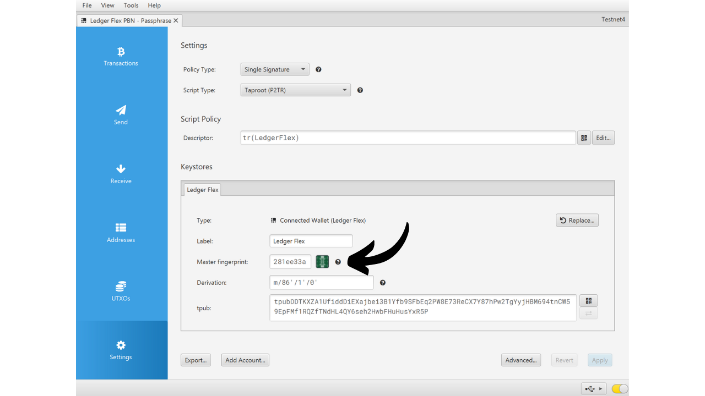

BIP39 heslo je volitelné heslo, které, když je kombinováno s vaší mnemonickou frází, poskytuje další úroveň zabezpečení pro deterministické a hierarchické Bitcoinové peněženky. V tomto tutoriálu si společně projdeme, jak nastavit heslo na vaší zabezpečené Bitcoinové peněžence na Ledgeru (bez ohledu na model).

Před zahájením tohoto tutoriálu, pokud nejste obeznámeni s konceptem hesla, jak funguje a jaké má důsledky pro vaši Bitcoinovou peněženku, vřele doporučuji konzultovat tento další teoretický článek, kde vše vysvětluji:

https://planb.network/tutorials/wallet/passphrase

## Jak funguje heslo na Ledgeru?

S zařízeními Ledger máte dvě různé možnosti, jak nakonfigurovat heslo na vaší peněžence: možnost "*PIN-vázaná*" a možnost "*dočasná*".

S možností "*PIN-vázaná*" spojíte heslo s druhým PINem na vašem Ledgeru. To znamená, že budete mít 2 PINy: jeden pro přístup k vaší běžné peněžence bez hesla a druhý pro přístup k vaší druhé peněžence chráněné heslem.

Zásadně, i s touto možností hesla vázaného na druhý PIN, vaše heslo zůstává vaším heslem. To znamená, že pokud ztratíte svůj Ledger a budete chtít obnovit své bitcoiny na jiném zařízení nebo softwaru, budete absolutně potřebovat vaši 24-slovnou frázi a vaše **kompletní heslo**. PIN spojený s heslem slouží pouze pro přístup k němu na vašem současném Ledgeru, ale na jiných Ledgerech nebo jiném softwaru nefunguje. Je tedy důležité plně zálohovat vaše heslo na fyzickém médiu. **Znát pouze sekundární PIN není dostatečné pro znovuzískání přístupu k vaší peněžence**; je to pouze pohodlná funkce na vašem Ledgeru.

Tato možnost druhého PINu je zvláště zajímavá pro řešení fyzických útoků. Například, pokud vás útočník donutí odemknout vaše zařízení, aby ukradl vaše prostředky, můžete použít první PIN pro přístup k návnadové peněžence obsahující malé množství bitcoinů, zatímco vaše hlavní prostředky zůstanou bezpečné za druhým PINem.

Navíc, tato možnost nabízí všechny bezpečnostní výhody BIP39 hesla bez nutnosti jeho ručního zadávání pokaždé, když používáte vaše podepisovací zařízení. To vám umožňuje použít dlouhé a náhodné heslo, čímž posiluje ochranu proti útokům hrubou silou, zatímco se vyhnete obtíži muset jej pokaždé ručně zadávat na malých tlačítkách zařízení.
Možnost "dočasného hesla" neukládá heslo na zařízení. Pokaždé, když chcete získat přístup k vaší chráněné peněžence, budete muset heslo ručně zadat na Ledgeru. To používání činí náročnějším, ale také mírně zvyšuje bezpečnost tím, že na zařízení nezanechává žádnou stopu hesla. Jakmile zařízení vypnete, vrátí se do svého výchozího stavu a vyžaduje nové zadání kompletního hesla pro přístup k skrytým účtům. Tato možnost "dočasného hesla" je tedy podobná provozu jiných hardwarových peněženek.
V tomto tutoriálu použiji jako příklad Ledger Flex. Pokud však používáte jiný model Ledgeru, postup zůstává stejný. Pro Ledger Stax je rozhraní stejné jako u Ledger Flex. Co se týče modelů Nano S, Nano S Plus a Nano X, i když je rozhraní odlišné, postup a názvy menu zůstávají stejné.
**Pozor:** Pokud jste již přijali bitcoiny na vašem Ledgeru před aktivací heslové fráze, budete je muset převést prostřednictvím Bitcoinové transakce. Heslová fráze generuje sadu nových klíčů, čímž vytváří peněženku, která je zcela nezávislá na vaší původní peněžence. Při přidání heslové fráze získáte novou peněženku, která bude prázdná. To však nemaže vaši první peněženku bez heslové fráze. Stále k ní můžete přistupovat, buď přímo přes váš Ledger bez zadání heslové fráze, nebo prostřednictvím jiného softwaru s použitím vaší 24slovní fráze.
Před zahájením tohoto návodu se ujistěte, že jste již inicializovali váš Ledger a vygenerovali vaši mnemonickou frázi. Pokud to není váš případ a váš Ledger je nový, postupujte podle konkrétního návodu pro váš model dostupného na PlanB Network. Jakmile je tento krok dokončen, můžete se vrátit k tomuto návodu.

https://planb.network/tutorials/wallet/ledger-flex
https://planb.network/tutorials/wallet/ledger-nano-s-plus
https://planb.network/tutorials/wallet/ledger

## Jak nastavit dočasnou heslovou frázi s Ledgerem?

Na domovské stránce vašeho Ledgeru klikněte na ozubené kolo nastavení.

Vyberte menu "Pokročilé", poté "Nastavit heslovou frázi".

Toto je krok, kde si můžete vybrat mezi možností "spojené s PINem" nebo "dočasná" možnost, o které jsme mluvili v předchozí části. Zde vysvětlím, jak nastavit dočasnou heslovou frázi, takže klikněte na "Nastavit dočasnou heslovou frázi".

Poté budete vyzváni k zadání vaší heslové fráze. Vyberte silnou heslovou frázi a ihned proveďte fyzickou zálohu, na médiu jako je papír nebo kov. V tomto příkladu jsem si vybral heslovou frázi: `fH3&kL@9mP#2sD5qR!82`. Po zadání vaší heslové fráze klikněte na tlačítko "*Pokračovat*".

Ověřte, že vaše heslová fráze odpovídá tomu, co jste si poznamenali na vaší fyzické záloze, poté klikněte na tlačítko "*Ano, je to správně*", abyste potvrdili.

Pro dokončení vytvoření vaší heslové fráze zadejte PIN kód vašeho Ledgeru. Odteď, kdykoli budete chtít přistupovat k vaší peněžence s heslovou frází na Ledgeru, budete muset postupovat přesně podle stejných kroků, jak jsou popsány zde.

Nyní můžete importovat vaši sadu veřejných klíčů do Sparrow Wallet, abyste spravovali vaši peněženku. Na Sparrow to bude odpovídat jiné peněžence než vaše původní peněženka bez heslové fráze.

Otevřete Sparrow Wallet. Ujistěte se, že software je připojen k uzlu, poté klikněte na záložku "*Soubor*" a vyberte "*Nová peněženka*".

Vyberte název pro vaši peněženku chráněnou heslovou frází. Pro tento příklad jsem si vybral název, který explicitně zahrnuje termín "*heslová fráze*". Pokud však dáváte přednost diskrétnosti této peněženky na vašem počítači, můžete si vybrat méně výmluvný název.

Vyberte typ skriptu pro vaši peněženku. Doporučuji vybrat "*Taproot*" nebo alternativně "*Native SegWit*".

Připojte svůj Ledger k počítači a poté klikněte na "*Connected Hardware Wallet*". Ujistěte se, že jste již zadali svou heslovou frázi do vašeho Ledgeru. Pokud ne, vraťte se prosím k předchozím krokům a zadejte svou heslovou frázi. Před pokračováním ke skenování si také nezapomeňte otevřít aplikaci "*Bitcoin*" na vašem Ledgeru.

Klikněte na tlačítko "*Scan...*".

Klikněte na "*Import Keystore*" vedle vašeho Ledgeru.

Vaše peněženka chráněná heslovou frází je nyní vytvořena v Sparrow. Pro potvrzení klikněte na tlačítko "*Apply*".

Vyberte silné heslo pro zabezpečení přístupu do Sparrow Wallet. Toto heslo zajistí bezpečnost přístupu k datům vaší peněženky v Sparrow, což pomáhá chránit vaše veřejné klíče, adresy, štítky a historii transakcí proti neoprávněnému přístupu.
Doporučuji vám toto heslo uložit v správci hesel, abyste na něj nezapomněli.

A máte to, vaše peněženka je nyní vytvořena! V menu "*Settings*" vám Sparrow poskytne vaši "*Master fingerprint*". To představuje otisk vašeho hlavního klíče, který se používá jako základ pro odvození vaší peněženky. Důrazně doporučuji si kopii tohoto otisku uchovat. V mém příkladu odpovídá: `281ee33a`.

Pamatujte na to, co jsme zmínili v předchozích částech: chyba, i malá, při zadávání vaší heslové fráze vygeneruje zcela novou peněženku s odlišnými klíči. Pokaždé, když potřebujete zajistit, že přistupujete ke správné peněžence s správnou heslovou frází, zkontrolujte, že otisk vašeho hlavního klíče odpovídá tomu, který jste si poznamenali. Tato informace sama o sobě nepředstavuje žádné riziko pro bezpečnost vašich prostředků nebo vaše soukromí.

Před použitím vaší peněženky s heslovou frází vám důrazně doporučuji provést test obnovy bez rizika. Poznamenejte si referenční informaci, jako je váš xpub nebo otisk vašeho hlavního klíče, poté resetujte váš Ledger, zatímco je peněženka stále prázdná. Poté se pokuste obnovit vaši peněženku na Ledgeru pomocí vašich papírových záloh 24-slovní fráze a heslové fráze. Zkontrolujte, že informace vygenerované po obnově odpovídají tomu, co jste si původně poznamenali. Pokud ano, můžete být ujištěni, že vaše papírové zálohy jsou spolehlivé.

## Jak nastavit heslovou frázi spojenou s PINem na Ledgeru?

Na domovské stránce vašeho Ledgeru klikněte na ozubené kolečko nastavení.

Vyberte menu "*Advanced*", poté "*Set passphrase*".

Toto je krok, kde si můžete vybrat mezi možností "*linked to PIN*" nebo "*temporary*", o kterých jsme mluvili v předchozí části. Zde vám vysvětlím, jak nastavit heslovou frázi připojenou k PINu, takže klikněte na "*Set passphrase and attach it to a new PIN*".

Poté musíte vybrat PIN kód, který bude spojen s vaší heslovou frází. Stejně jako u hlavního PIN kódu se doporučuje vybrat 8-místný PIN kód, co nejvíce náhodný. Také se ujistěte, že tento kód uložíte na jiném místě, než kde je uložen váš Ledger Flex.
V mém případě je hlavní PIN kód `58293647` a jako sekundární PIN kód spojený s heslovou frází jsem si zvolil `71425839`.

Poté budete vyzváni k zadání vaší heslové fráze. Vyberte silnou heslovou frázi a ihned přistupte k fyzické záloze na médiu, jako je papír nebo kov. V tomto příkladu jsem si zvolil heslovou frázi: `fH3&kL@9mP#2sD5qR!82`. Po zadání vaší heslové fráze klikněte na tlačítko "*Pokračovat*".

Ověřte, že vaše heslová fráze odpovídá tomu, co jste si zaznamenali na fyzickou zálohu, a poté klikněte na tlačítko "*Ano, je to správně*", abyste potvrdili.

Pro dokončení vytvoření vaší heslové fráze zadejte hlavní PIN kód vašeho Ledgeru (ne ten, který je spojen s heslovou frází).

Odteď, kdykoli budete chtít přistupovat k vaší peněžence s heslovou frází na Ledgeru, budete muset zadat ne hlavní PIN kód, ale sekundární PIN kód:
- Hlavní PIN kód (`58293647`) > peněženka bez heslové fráze.
- Sekundární PIN kód (`71425839`) > peněženka s heslovou frází.

Nyní můžete importovat svou sadu veřejných klíčů do Sparrow Wallet, abyste spravovali svou peněženku. Ve Sparrow to bude odpovídat jiné peněžence než vaše původní peněženka bez heslové fráze.

Otevřete Sparrow Wallet. Ujistěte se, že software je připojen k uzlu, poté klikněte na záložku "*Soubor*" a vyberte "*Nová peněženka*".

Vyberte název pro vaši peněženku chráněnou heslovou frází. Pro tento příklad jsem si zvolil název, který explicitně zahrnuje termín "*heslová fráze*". Pokud však dáváte přednost zachování diskrétnosti této peněženky na vašem počítači, můžete si vybrat méně výmluvný název.

Vyberte typ skriptu pro vaši peněženku. Doporučuji vybrat "*Taproot*" nebo pokud to není možné, "*Native SegWit*".

Připojte váš Ledger k počítači, poté klikněte na "*Připojená hardwarová peněženka*". Ujistěte se, že na vašem Ledgeru již máte svoji heslovou frázi tím, že jej odemknete sekundárním PIN kódem. Pokud ne, restartujte svůj Ledger a zadejte PIN kód spojený s heslovou frází. Před pokračováním ve skenování si také nezapomeňte otevřít aplikaci "*Bitcoin*" na vašem Ledgeru.

Klikněte na tlačítko "*Skenovat...*".

Klikněte na "*Importovat úložiště klíčů*".

Vaše peněženka chráněná heslovou frází je nyní vytvořena ve Sparrow. Pro potvrzení klikněte na tlačítko "*Použít*".

Vyberte silné heslo pro zabezpečení přístupu do Sparrow Wallet. Toto heslo zajistí bezpečnost přístupu k vašim údajům o peněžence ve Sparrow, což pomáhá chránit vaše veřejné klíče, adresy, štítky a historii transakcí proti jakémukoli neoprávněnému přístupu.

Doporučuji si toto heslo uložit v správci hesel, abyste na něj nezapomněli.

A máte to, vaše peněženka je nyní vytvořena! V menu "*Nastavení*", Sparrow vám poskytne vaši "*Hlavní otisk*". To představuje otisk vašeho hlavního klíče, používaného jako základ pro odvození vaší peněženky. Důrazně doporučuji si kopii tohoto otisku ponechat. V mém příkladu odpovídá: `281ee33a`.

Pamatujte na to, co jsme zmínili v předchozích částech: chyba, i malá, při zadávání vaší heslové fráze vygeneruje zcela novou peněženku s odlišnými klíči. Pokaždé, když potřebujete zajistit přístup k správné peněžence s pravou heslovou frází, ověřte, že otisk vašeho hlavního klíče odpovídá tomu, který jste si poznamenali. Tato informace sama o sobě nepředstavuje žádné riziko pro bezpečnost vašich prostředků nebo vaše soukromí.
Před použitím vaší peněženky s heslovou frází vám důrazně doporučuji provést test obnovy bez rizika. Poznamenejte si referenční informaci, jako je váš xpub nebo otisk vašeho hlavního klíče, poté resetujte váš Ledger, zatímco je peněženka stále prázdná. Poté se pokuste obnovit vaši peněženku na Ledgeru pomocí vašich papírových záloh 24-slovní fráze a heslové fráze. Zkontrolujte, zda informace vygenerované po obnově odpovídají tomu, co jste si původně poznamenali. Pokud tomu tak je, můžete být ujištěni, že vaše papírové zálohy jsou spolehlivé.

Gratuluji, vaše Bitcoinová peněženka je nyní zabezpečena heslovou frází! Pokud jste tento návod považovali za užitečný, ocenil bych, kdybyste níže zanechali palce nahoru. Neváhejte tento článek sdílet na vašich sociálních sítích. Velmi vám děkuji!

Doporučuji vám také prohlédnout si tento další úplný návod, jak používat váš Ledger Flex:

https://planb.network/tutorials/wallet/ledger-flex