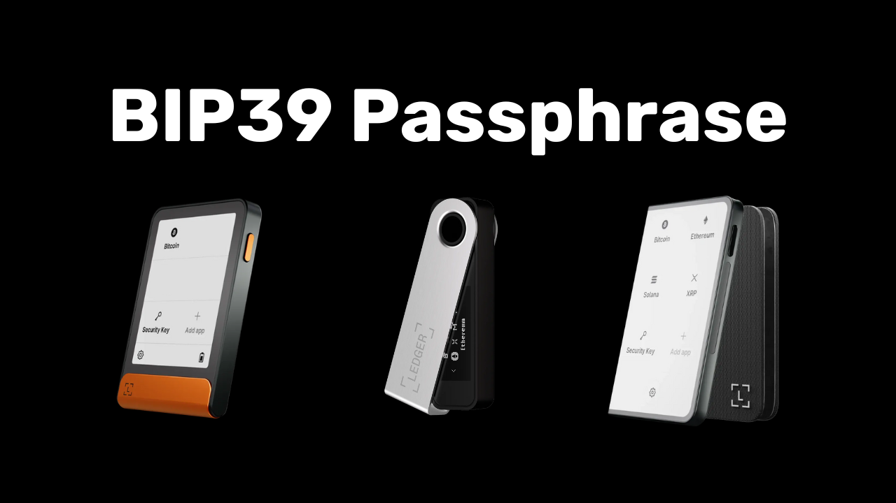

Eine BIP39-Passphrase ist ein optionales Passwort, das, wenn es mit Ihrer mnemonischen Phrase kombiniert wird, eine zusätzliche Sicherheitsebene für deterministische und hierarchische Bitcoin-Wallets bietet. In diesem Tutorial werden wir gemeinsam durchgehen, wie man eine Passphrase auf seinem sicheren Bitcoin-Wallet auf einem Ledger einrichtet (unabhängig vom Modell).

Bevor Sie mit diesem Tutorial beginnen, wenn Sie nicht mit dem Konzept einer Passphrase, ihrer Funktionsweise und ihren Auswirkungen auf Ihr Bitcoin-Wallet vertraut sind, empfehle ich dringend, diesen anderen theoretischen Artikel zu konsultieren, in dem ich alles erkläre:

https://planb.network/tutorials/wallet/passphrase

## Wie funktioniert die Passphrase auf einem Ledger?

Mit Ledger-Geräten haben Sie zwei verschiedene Optionen, um eine Passphrase auf Ihrem Wallet zu konfigurieren: die "*PIN-gebundene*" Option und die "*temporäre*" Option.

Mit der "*PIN-gebundenen*" Option verknüpfen Sie eine Passphrase mit einer zweiten PIN auf Ihrem Ledger. Das bedeutet, Sie haben 2 PINs: eine, um auf Ihr reguläres Wallet ohne Passphrase zuzugreifen, und die andere, um auf Ihr zweites, durch die Passphrase geschütztes Wallet zuzugreifen.

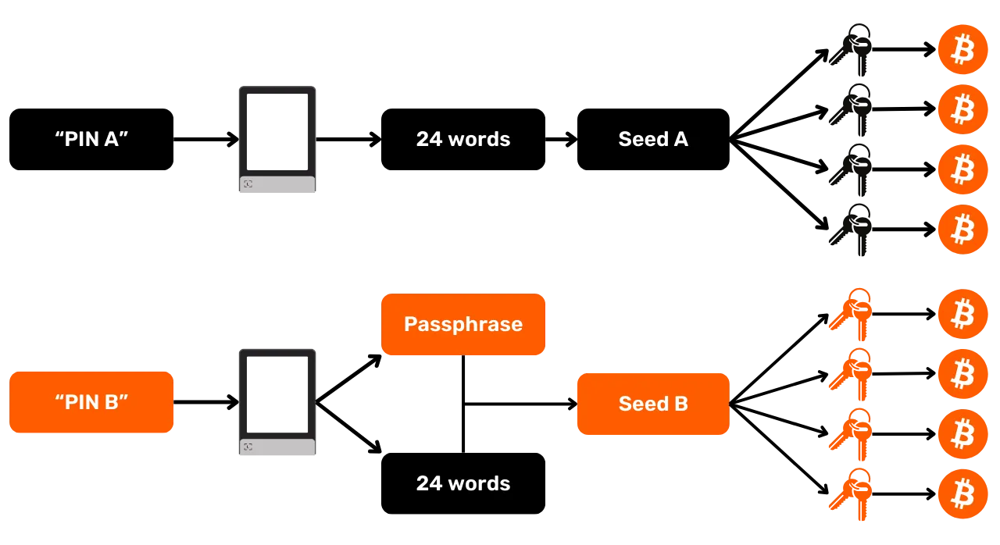

Grundsätzlich bleibt Ihre Passphrase auch mit dieser an die zweite PIN gebundenen Option Ihre Passphrase. Das bedeutet, dass Sie, wenn Sie Ihren Ledger verlieren und Ihre Bitcoins auf einem anderen Gerät oder einer anderen Software wiederherstellen möchten, unbedingt Ihre 24-Wort-Phrase und Ihre **vollständige Passphrase** benötigen. Die mit der Passphrase verknüpfte PIN wird nur verwendet, um darauf auf Ihrem aktuellen Ledger zuzugreifen, funktioniert aber nicht auf anderen Ledgern oder anderer Software. Es ist daher wichtig, Ihre Passphrase vollständig auf einem physischen Medium zu sichern. **Allein das Wissen um die sekundäre PIN reicht nicht aus, um wieder Zugang zu Ihrem Wallet zu erhalten**; es ist lediglich eine Komfortfunktion auf Ihrem Ledger.

Diese zweite PIN-Option ist besonders interessant, um sich gegen physische Angriffe zu schützen. Wenn beispielsweise ein Angreifer Sie zwingt, Ihr Gerät zu entsperren, um Ihre Mittel zu stehlen, können Sie die erste PIN verwenden, um auf ein Köder-Wallet mit einer kleinen Menge Bitcoins zuzugreifen, während Ihre Hauptmittel hinter der zweiten PIN sicher bleiben.

Darüber hinaus bietet diese Option alle Sicherheitsvorteile der BIP39-Passphrase, ohne die Einschränkung, sie jedes Mal manuell eingeben zu müssen, wenn Sie Ihr Signiergerät verwenden. Dies ermöglicht es Ihnen, eine lange und zufällige Passphrase zu verwenden, wodurch der Schutz gegen Brute-Force-Angriffe verstärkt wird, während die Schwierigkeit, sie jedes Mal manuell auf den kleinen Tasten des Geräts einzugeben, vermieden wird.
Die Option der "temporären Passphrase" speichert die Passphrase nicht auf dem Gerät. Jedes Mal, wenn Sie auf Ihr geschütztes Wallet zugreifen möchten, müssen Sie die Passphrase manuell auf dem Ledger eingeben. Dies macht die Nutzung umständlicher, erhöht aber auch leicht die Sicherheit, indem keine Spur der Passphrase auf dem Gerät hinterlassen wird. Sobald Sie das Gerät ausschalten, kehrt es in seinen Standardzustand zurück und erfordert eine neue Eingabe der vollständigen Passphrase, um auf die versteckten Konten zuzugreifen. Diese "temporäre Passphrase"-Option ist somit ähnlich wie die Funktionsweise anderer Hardware-Wallets.
In diesem Tutorial werde ich den Ledger Flex als Beispiel verwenden. Wenn Sie jedoch ein anderes Ledger-Modell verwenden, bleibt der Prozess gleich. Für den Ledger Stax ist die Schnittstelle dieselbe wie die des Ledger Flex. Was die Modelle Nano S, Nano S Plus und Nano X betrifft, obwohl die Schnittstelle unterschiedlich ist, bleiben der Prozess und die Namen der Menüs gleich.
**Achtung:** Wenn Sie bereits Bitcoins auf Ihrem Ledger erhalten haben, bevor Sie die Passphrase aktiviert haben, müssen Sie diese über eine Bitcoin-Transaktion übertragen. Die Passphrase generiert einen Satz neuer Schlüssel und erstellt somit eine Wallet, die vollständig unabhängig von Ihrer ursprünglichen Wallet ist. Wenn Sie die Passphrase hinzufügen, erhalten Sie eine neue Wallet, die leer sein wird. Dies löscht jedoch nicht Ihre erste Wallet ohne Passphrase. Sie können weiterhin darauf zugreifen, entweder direkt über Ihren Ledger, ohne die Passphrase einzugeben, oder über eine andere Software unter Verwendung Ihrer 24-Wort-Phrase.
Bevor Sie mit diesem Tutorial beginnen, stellen Sie sicher, dass Sie Ihren Ledger bereits initialisiert und Ihre mnemonische Phrase generiert haben. Wenn dies nicht der Fall ist und Ihr Ledger neu ist, folgen Sie dem spezifischen Tutorial für Ihr Modell, das auf PlanB Network verfügbar ist. Sobald dieser Schritt abgeschlossen ist, können Sie zu diesem Tutorial zurückkehren.

https://planb.network/tutorials/wallet/ledger-flex
https://planb.network/tutorials/wallet/ledger-nano-s-plus
https://planb.network/tutorials/wallet/ledger

## Wie richtet man eine temporäre Passphrase mit einem Ledger ein?

Klicken Sie auf der Startseite Ihres Ledger auf das Einstellungszahnrad.

Wählen Sie das Menü "Erweitert", dann "Passphrase einrichten".

Dies ist der Schritt, in dem Sie zwischen der Option "an PIN gebunden" oder "temporär" wählen können, über die wir im vorherigen Teil gesprochen haben. Hier erkläre ich, wie Sie eine temporäre Passphrase einrichten, also klicken Sie auf "Temporäre Passphrase einrichten".

Dann werden Sie aufgefordert, Ihre Passphrase einzugeben. Wählen Sie eine starke Passphrase und führen Sie sofort ein physisches Backup durch, auf einem Medium wie Papier oder Metall. In diesem Beispiel habe ich die Passphrase: `fH3&kL@9mP#2sD5qR!82` gewählt. Nachdem Sie Ihre Passphrase eingegeben haben, klicken Sie auf den "*Weiter*" Button.
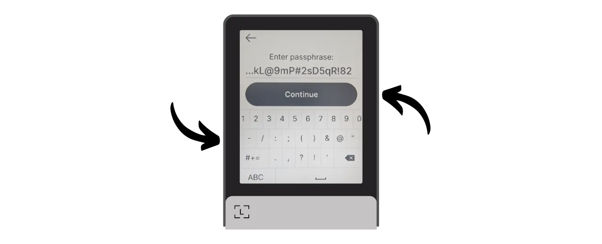

Überprüfen Sie, ob Ihre Passphrase mit dem übereinstimmt, was Sie auf Ihrem physischen Backup notiert haben, und klicken Sie dann auf den "*Ja, es ist korrekt*" Button, um zu bestätigen.

Um die Erstellung Ihrer Passphrase abzuschließen, geben Sie den PIN-Code Ihres Ledger ein. Von nun an müssen Sie, wann immer Sie mit einer Passphrase auf Ihre Wallet auf dem Ledger zugreifen möchten, genau die gleichen Schritte wie hier beschrieben befolgen.

Sie können jetzt Ihren Satz öffentlicher Schlüssel in Sparrow Wallet importieren, um Ihre Wallet zu verwalten. In Sparrow entspricht dies einer anderen Wallet als Ihrer ursprünglichen Wallet ohne Passphrase.

Öffnen Sie Sparrow Wallet. Stellen Sie sicher, dass die Software mit einem Knoten verbunden ist, dann klicken Sie auf den "*Datei*" Tab und wählen "*Neue Wallet*".

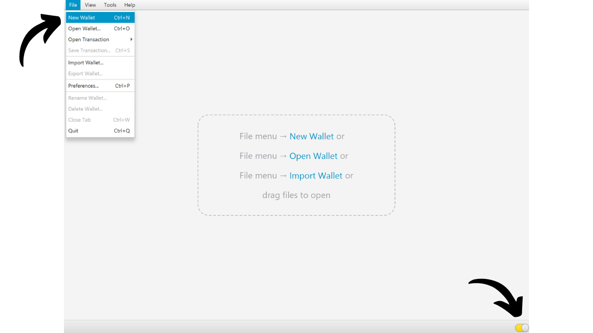

Wählen Sie einen Namen für Ihre durch eine Passphrase geschützte Wallet. Für dieses Beispiel habe ich mich für einen Namen entschieden, der den Begriff "*Passphrase*" explizit enthält. Wenn Sie jedoch die Diskretion dieser Wallet auf Ihrem Computer bevorzugen, können Sie einen weniger aussagekräftigen Namen wählen.

Wählen Sie den Typ des Skripts für Ihre Wallet. Ich rate Ihnen, "*Taproot*" oder alternativ "*Native SegWit*" zu wählen.

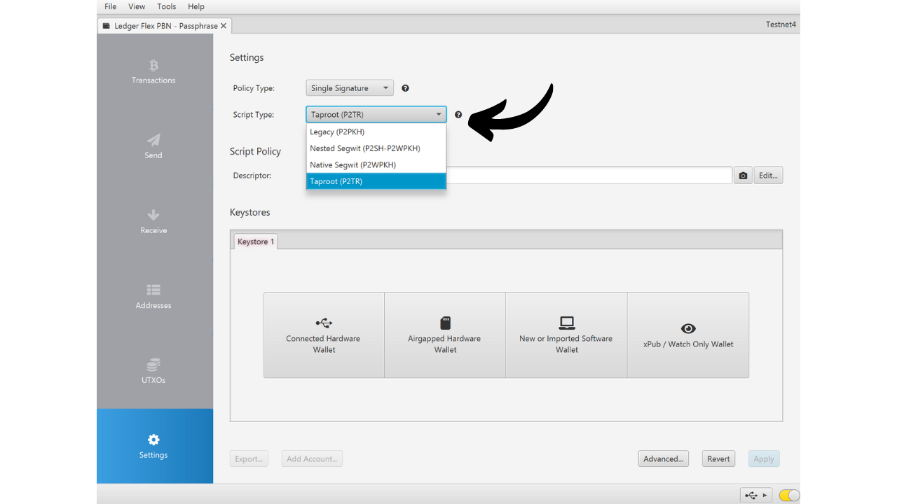
Verbinden Sie Ihren Ledger mit Ihrem Computer und klicken Sie dann auf "*Connected Hardware Wallet*". Stellen Sie sicher, dass Sie bereits Ihre Passphrase auf Ihrem Ledger eingegeben haben. Falls nicht, gehen Sie bitte zu den vorherigen Schritten zurück, um Ihre Passphrase einzugeben. Bevor Sie mit dem Scan fortfahren, denken Sie auch daran, die "*Bitcoin*" Anwendung auf Ihrem Ledger zu öffnen.
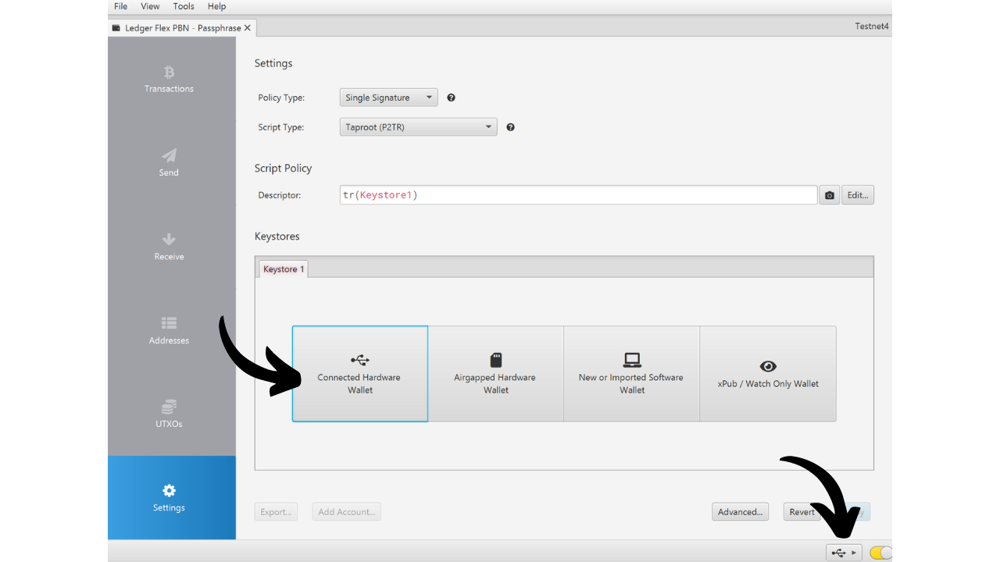

Klicken Sie auf den "*Scan...*" Button.

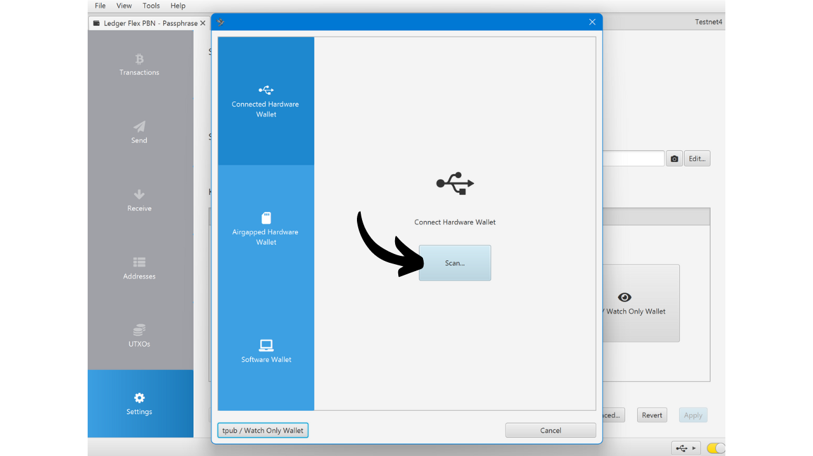

Klicken Sie neben Ihrem Ledger auf "*Import Keystore*".

Ihr durch die Passphrase geschütztes Wallet ist nun auf Sparrow erstellt. Um zu bestätigen, klicken Sie auf den "*Apply*" Button.

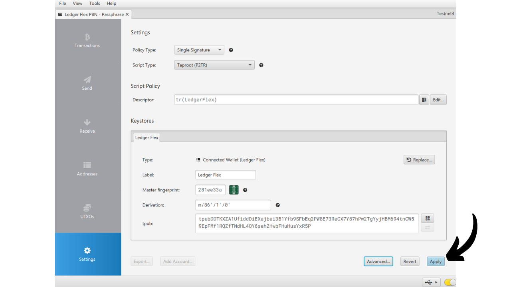
Wählen Sie ein starkes Passwort, um den Zugang zum Sparrow Wallet zu sichern. Dieses Passwort gewährleistet die Sicherheit des Zugriffs auf Ihre Wallet-Daten auf Sparrow, was Ihre öffentlichen Schlüssel, Adressen, Bezeichnungen und Transaktionshistorie vor unbefugtem Zugriff schützt.
Ich rate Ihnen, dieses Passwort in einem Passwort-Manager zu speichern, damit Sie es nicht vergessen.

Und voilà, Ihr Wallet ist jetzt erstellt! Im Menü "*Settings*" wird Sparrow Ihnen Ihren "*Master fingerprint*" zur Verfügung stellen. Dies repräsentiert den Fingerabdruck Ihres Master-Schlüssels, der als Basis für die Ableitung Ihres Wallets dient. Ich empfehle dringend, eine Kopie dieses Fingerabdrucks aufzubewahren. In meinem Beispiel entspricht er: `281ee33a`.

Denken Sie an das, was wir in den vorherigen Teilen erwähnt haben: Ein Fehler, auch ein kleiner, bei der Eingabe Ihrer Passphrase wird ein völlig neues Wallet mit anderen Schlüsseln generieren. Jedes Mal, wenn Sie sicherstellen müssen, dass Sie auf das richtige Wallet mit der korrekten Passphrase zugreifen, überprüfen Sie, ob der Fingerabdruck Ihres Master-Schlüssels mit dem übereinstimmt, den Sie notiert haben. Diese Information stellt an sich kein Risiko für die Sicherheit Ihrer Gelder oder Ihrer Privatsphäre dar.

Bevor Sie Ihr Wallet mit einer Passphrase verwenden, rate ich Ihnen dringend, einen Dry-Run-Recovery-Test durchzuführen. Notieren Sie sich ein Referenzstück Information wie Ihren xpub oder den Fingerabdruck Ihres Master-Schlüssels, dann setzen Sie Ihren Ledger zurück, während das Wallet noch leer ist. Versuchen Sie anschließend, Ihr Wallet auf dem Ledger mit Ihren Papier-Backups der 24-Wort-Phrase und der Passphrase wiederherzustellen. Überprüfen Sie, ob die nach der Wiederherstellung generierten Informationen mit dem übereinstimmen, was Sie ursprünglich notiert haben. Wenn das der Fall ist, können Sie sicher sein, dass Ihre Papier-Backups zuverlässig sind.

## Wie richtet man eine mit einem PIN verknüpfte Passphrase auf einem Ledger ein?

Klicken Sie auf der Startseite Ihres Ledger auf das Einstellungszahnrad.

Wählen Sie das Menü "*Advanced*", dann "*Set passphrase*".

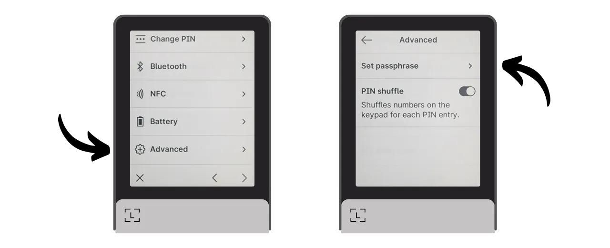

Dies ist der Schritt, in dem Sie zwischen der Option "*linked to PIN*" oder "*temporary*" wählen können, über die wir im vorherigen Teil gesprochen haben. Hier erkläre ich, wie man eine Passphrase einrichtet, die an einen neuen PIN angehängt wird, also klicken Sie auf "*Set passphrase and attach it to a new PIN*".

Danach müssen Sie den PIN-Code wählen, der mit Ihrer Passphrase verbunden wird. Wie beim Haupt-PIN-Code wird empfohlen, einen 8-stelligen PIN-Code zu wählen, so zufällig wie möglich. Stellen Sie außerdem sicher, dass Sie diesen Code an einem anderen Ort aufbewahren, als wo Ihr Ledger Flex gelagert wird.
In meinem Fall ist der Haupt-PIN-Code `58293647` und ich habe `71425839` als sekundären PIN-Code gewählt, der mit der Passphrase verbunden ist.

Dann werden Sie aufgefordert, Ihre Passphrase einzugeben. Wählen Sie eine starke Passphrase und gehen Sie sofort zu einer physischen Sicherung über, auf einem Medium wie Papier oder Metall. In diesem Beispiel habe ich die Passphrase: `fH3&kL@9mP#2sD5qR!82` gewählt. Nachdem Sie Ihre Passphrase eingegeben haben, klicken Sie auf den "*Weiter*" Button.

Überprüfen Sie, ob Ihre Passphrase mit dem übereinstimmt, was Sie auf Ihrer physischen Sicherung notiert haben, und klicken Sie dann auf den "*Ja, es ist korrekt*" Button, um zu bestätigen.

Um die Erstellung Ihrer Passphrase abzuschließen, geben Sie den Haupt-PIN-Code Ihres Ledger ein (nicht den, der mit der Passphrase verbunden ist).

Von nun an müssen Sie, wenn Sie mit einer Passphrase auf Ihre Wallet auf dem Ledger zugreifen möchten, nicht den Haupt-PIN-Code, sondern den sekundären PIN-Code eingeben:
- Haupt-PIN-Code (`58293647`) > Wallet ohne Passphrase.
- Sekundärer PIN-Code (`71425839`) > Wallet mit Passphrase.

Sie können jetzt Ihren Satz von öffentlichen Schlüsseln in Sparrow Wallet importieren, um Ihre Wallet zu verwalten. In Sparrow wird dies einer anderen Wallet entsprechen als Ihrer anfänglichen Wallet ohne Passphrase.

Öffnen Sie Sparrow Wallet. Stellen Sie sicher, dass die Software mit einem Knoten verbunden ist, klicken Sie dann auf den "*Datei*" Tab und wählen Sie "*Neue Wallet*".

Wählen Sie einen Namen für Ihre durch eine Passphrase geschützte Wallet. Für dieses Beispiel habe ich mich für einen Namen entschieden, der den Begriff "*Passphrase*" explizit enthält. Wenn Sie jedoch die Diskretion dieser Wallet auf Ihrem Computer bevorzugen, können Sie einen weniger aussagekräftigen Namen wählen.

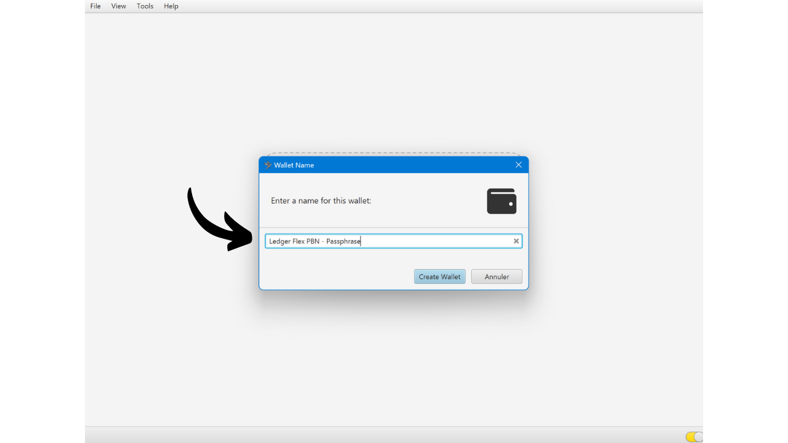

Wählen Sie den Skripttyp für Ihre Wallet. Ich rate Ihnen, "*Taproot*" oder, falls das nicht möglich ist, "*Native SegWit*" zu wählen.

Verbinden Sie Ihren Ledger mit Ihrem Computer und klicken Sie dann auf "*Verbundene Hardware-Wallet*". Stellen Sie sicher, dass Sie Ihre Passphrase bereits auf Ihrem Ledger haben, indem Sie ihn mit dem sekundären PIN-Code entsperren. Wenn nicht, starten Sie Ihren Ledger neu und geben Sie den PIN-Code ein, der mit der Passphrase verbunden ist. Bevor Sie mit dem Scannen fortfahren, denken Sie auch daran, die "*Bitcoin*" Anwendung auf Ihrem Ledger zu öffnen.

Klicken Sie auf den "*Scannen...*" Button.

Klicken Sie auf "*Keystore importieren*".

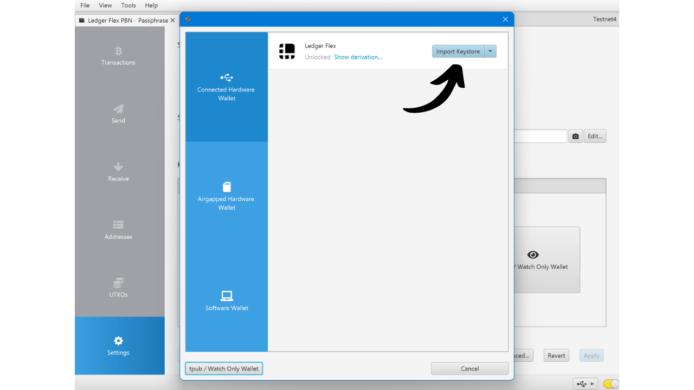

Ihre durch die Passphrase geschützte Wallet ist jetzt in Sparrow erstellt. Um zu bestätigen, klicken Sie auf den "*Anwenden*" Button.

Wählen Sie ein starkes Passwort, um den Zugang zu Sparrow Wallet zu sichern. Dieses Passwort wird die Sicherheit des Zugangs zu Ihren Wallet-Daten auf Sparrow gewährleisten, was hilft, Ihre öffentlichen Schlüssel, Adressen, Bezeichnungen und Transaktionshistorie gegen jeglichen unbefugten Zugriff zu schützen.

Ich rate Ihnen, dieses Passwort in einem Passwortmanager zu speichern, damit Sie es nicht vergessen.
Und da haben Sie es, Ihr Wallet ist nun erstellt! Im Menü "*Einstellungen*" wird Sparrow Ihnen Ihren "*Master fingerprint*" anzeigen. Dies repräsentiert den Fingerabdruck Ihres Master-Schlüssels, der an der Basis der Ableitung Ihres Wallets verwendet wird. Ich empfehle dringend, eine Kopie dieses Fingerabdrucks zu behalten. In meinem Beispiel entspricht er: `281ee33a`.

Denken Sie an das, was wir in den vorherigen Teilen erwähnt haben: Ein Fehler, selbst ein kleiner, bei der Eingabe Ihrer Passphrase wird ein völlig neues Wallet mit unterschiedlichen Schlüsseln generieren. Jedes Mal, wenn Sie sicherstellen müssen, Zugang zum richtigen Wallet mit der richtigen Passphrase zu haben, überprüfen Sie, ob der Fingerabdruck Ihres Master-Schlüssels mit dem übereinstimmt, den Sie notiert haben. Diese Information stellt für sich allein kein Risiko für die Sicherheit Ihrer Gelder oder Ihrer Privatsphäre dar.
Bevor Sie Ihr Wallet mit einer Passphrase verwenden, rate ich Ihnen dringend, einen Dry-Run-Recovery-Test durchzuführen. Notieren Sie sich eine Referenzinformation, wie Ihren xpub oder den Fingerabdruck Ihres Master-Schlüssels, dann setzen Sie Ihr Ledger zurück, während das Wallet noch leer ist. Versuchen Sie anschließend, Ihr Wallet auf dem Ledger mit Ihren Papier-Backups der 24-Wort-Phrase und der Passphrase wiederherzustellen. Überprüfen Sie, ob die nach der Wiederherstellung generierten Informationen mit dem übereinstimmen, was Sie ursprünglich notiert haben. Wenn dies der Fall ist, können Sie sicher sein, dass Ihre Papier-Backups zuverlässig sind.

Herzlichen Glückwunsch, Ihr Bitcoin-Wallet ist jetzt mit einer Passphrase gesichert! Wenn Sie dieses Tutorial hilfreich fanden, würde ich mich freuen, wenn Sie unten einen Daumen hoch hinterlassen könnten. Fühlen Sie sich frei, diesen Artikel in Ihren sozialen Netzwerken zu teilen. Vielen Dank!

Ich empfehle Ihnen auch, dieses weitere vollständige Tutorial darüber, wie Sie Ihr Ledger Flex verwenden, anzuschauen:

https://planb.network/tutorials/wallet/ledger-flex