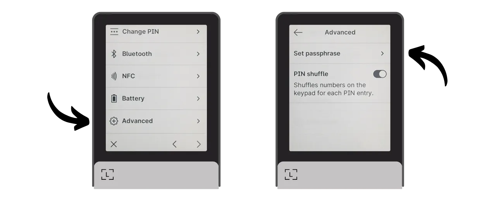
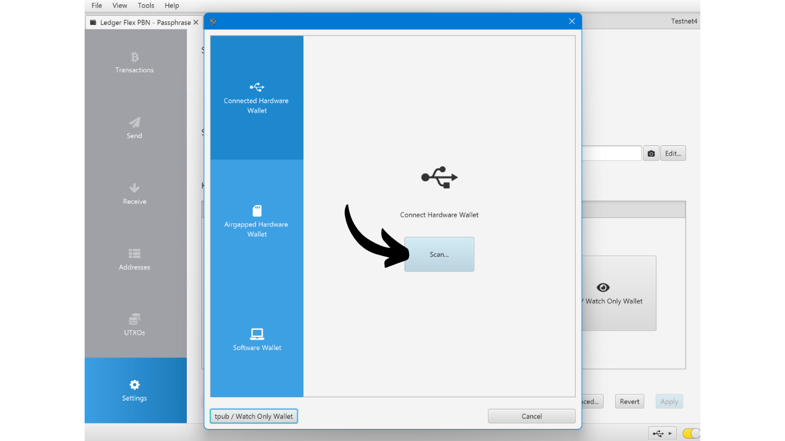

A BIP39 passphrase is an optional password that, when combined with your mnemonic phrase, provides an additional layer of security for deterministic and hierarchical Bitcoin wallets. In this tutorial, we will review together how to set up a passphrase on your secure Bitcoin wallet on a Ledger (regardless of the model).

Before starting this tutorial, if you are not familiar with the concept of a passphrase, how it works, and its implications for your Bitcoin wallet, I strongly recommend consulting this other theoretical article where I explain everything:

https://planb.network/tutorials/wallet/passphrase

## How does the passphrase function on a Ledger?

With Ledger devices, you have two different options for configuring a passphrase on your wallet: the "*PIN-tied*" option and the "*temporary*" option.

With the "*PIN-tied*" option, you associate a passphrase with a second PIN on your Ledger. This means you will have 2 PINs: one to access your regular wallet without a passphrase, and the other to access your second wallet protected by the passphrase.

Fundamentally, even with this passphrase option tied to the second PIN, your passphrase remains your passphrase. This means that if you lose your Ledger and wish to recover your bitcoins on another device or software, you will absolutely need your 24-word phrase and your **complete passphrase**. The PIN associated with the passphrase is only used to access it on your current Ledger, but it does not work on other Ledgers or other software. It is therefore important to fully back up your passphrase on a physical medium. **Knowing the secondary PIN alone is not enough to regain access to your wallet**; it's simply a convenience feature on your Ledger.

This second PIN option is particularly interesting for dealing with physical attacks. For example, if an attacker forces you to unlock your device to steal your funds, you can use the first PIN to access a decoy wallet containing a small amount of bitcoins, while keeping your main funds secure behind the second PIN.

Moreover, this option offers all the security benefits of the BIP39 passphrase without the constraint of having to enter it manually every time you use your signing device. This allows you to use a long and random passphrase, thereby strengthening protection against brute force attacks, while avoiding the difficulty of having to type it manually each time on the device's small buttons.
The option of the "temporary passphrase" does not store the passphrase on the device. Each time you want to access your protected wallet, you will need to manually enter the passphrase on the Ledger. This makes usage more cumbersome but also slightly increases security by leaving no trace of the passphrase on the device. As soon as you turn off the device, it reverts to its default state and requires a new entry of the complete passphrase to access the hidden accounts. This "temporary passphrase" option is thus similar to the operation of other hardware wallets.
In this tutorial, I will use the Ledger Flex as an example. However, if you are using another Ledger model, the process remains the same. For the Ledger Stax, the interface is the same as that of the Ledger Flex. As for the Nano S, Nano S Plus, and Nano X models, although the interface is different, the process and the names of the menus remain the same.

**Attention:** If you have already received bitcoins on your Ledger before activating the passphrase, you will need to transfer them via a Bitcoin transaction. The passphrase generates a set of new keys, thus creating a wallet that is completely independent of your initial wallet. When adding the passphrase, you will have a new wallet that will be empty. However, this does not delete your first wallet without a passphrase. You can still access it, either directly via your Ledger without entering the passphrase or through another software using your 24-word phrase.

Before starting this tutorial, make sure you have already initialized your Ledger and generated your mnemonic phrase. If this is not the case and your Ledger is new, follow the specific tutorial for your model available on PlanB Network. Once this step is completed, you can return to this tutorial.

https://planb.network/tutorials/wallet/ledger-flex
https://planb.network/tutorials/wallet/ledger-nano-s-plus
https://planb.network/tutorials/wallet/ledger

## How to set up a temporary passphrase with a Ledger?

On the homepage of your Ledger, click on the settings gear wheel.

Select the "Advanced" menu, then "Set passphrase".

This is the step where you can choose between the "linked to PIN" option or "temporary" option we talked about in the previous part. Here, I will explain how to set up a temporary passphrase, so click on "Set temporary passphrase".

You are then asked to enter your passphrase. Choose a strong passphrase and immediately proceed to a physical backup, on a medium such as paper or metal. In this example, I chose the passphrase: `fH3&kL@9mP#2sD5qR!82`. After entering your passphrase, click on the "*Continue*" button.

Verify that your passphrase matches what you have noted on your physical backup, then click on the "*Yes, it's correct*" button to confirm.

To finalize the creation of your passphrase, enter the PIN code of your Ledger. From now on, whenever you want to access your wallet with a passphrase on the Ledger, you will need to follow exactly the same steps as described here.

You can now import your set of public keys on Sparrow Wallet to manage your wallet. On Sparrow, this will correspond to a different wallet from your initial wallet without a passphrase.

Open Sparrow Wallet. Make sure the software is connected to a node, then click on the "*File*" tab and select "*New Wallet*".

Choose a name for your wallet protected by a passphrase. For this example, I opted for a name explicitly including the term "*passphrase*". However, if you prefer to keep the discretion of this wallet on your computer, you can choose a less evocative name.

Choose the type of script for your wallet. I advise you to choose "*Taproot*" or alternatively "*Native SegWit*".

Connect your Ledger to your computer, then click on "*Connected Hardware Wallet*". Make sure you have already entered your passphrase on your Ledger. If not, please go back to the previous steps to enter your passphrase. Before proceeding to the scan, also remember to open the "*Bitcoin*" application on your Ledger.

Click on the "*Scan...*" button.

Click on "*Import Keystore*" next to your Ledger.

Your wallet protected by the passphrase is now created on Sparrow. To confirm, click on the "*Apply*" button.

Choose a strong password to secure access to Sparrow Wallet. This password will ensure the security of access to your wallet data on Sparrow, which helps protect your public keys, addresses, labels, and transaction history against any unauthorized access.
I advise you to save this password in a password manager so you don't forget it.

And there you have it, your wallet is now created! In the "*Settings*" menu, Sparrow will provide you with your "*Master fingerprint*". This represents the fingerprint of your master key, used as the basis for deriving your wallet. I strongly recommend keeping a copy of this fingerprint. In my example, it corresponds to: `281ee33a`.

Remember what we mentioned in the previous parts: a mistake, even a minor one, in entering your passphrase will generate an entirely new wallet with different keys. Every time you need to ensure you're accessing the right wallet with the correct passphrase, check that the fingerprint of your master key matches the one you noted down. This information, by itself, poses no risk to the security of your funds or your privacy.

Before using your wallet with a passphrase, I strongly advise you to perform a dry-run recovery test. Note down a reference piece of information like your xpub or the fingerprint of your master key, then reset your Ledger while the wallet is still empty. Next, try to restore your wallet on the Ledger using your paper backups of the 24-word phrase and the passphrase. Check that the information generated after the restoration matches what you initially noted. If that's the case, you can be assured that your paper backups are reliable.

## How to set up a passphrase linked to a PIN with a Ledger?

On the homepage of your Ledger, click on the settings gear wheel.

Select the "*Advanced*" menu, then "*Set passphrase*".

This is the step where you can choose between the "*linked to PIN*" or "*temporary*" option we talked about in the previous part. Here, I'll explain how to set up a passphrase attached to a PIN, so click on "*Set passphrase and attach it to a new PIN*".

You must then choose the PIN code that will be associated with your passphrase. Just like with the main PIN code, it is recommended to choose an 8-digit PIN code, as random as possible. Also, make sure to save this code in a different location from where your Ledger Flex is stored.
In my case, the main PIN code is `58293647` and I chose `71425839` as the secondary PIN code associated with the passphrase.

You are then asked to enter your passphrase. Choose a strong passphrase and immediately proceed to a physical backup, on a medium such as paper or metal. In this example, I chose the passphrase: `fH3&kL@9mP#2sD5qR!82`. After entering your passphrase, click on the "*Continue*" button.

Verify that your passphrase matches what you have noted on your physical backup, then click on the "*Yes, it's correct*" button to confirm.

To finalize the creation of your passphrase, enter the main PIN code of your Ledger (not the one associated with the passphrase).

From now on, whenever you want to access your wallet with a passphrase on the Ledger, you will need to enter not the main PIN code, but the secondary PIN code:
- Main PIN code (`58293647`) > wallet without passphrase.
- Secondary PIN code (`71425839`) > wallet with passphrase.

You can now import your set of public keys on Sparrow Wallet to manage your wallet. On Sparrow, this will correspond to a different wallet from your initial wallet without a passphrase.

Open Sparrow Wallet. Make sure the software is connected to a node, then click on the "*File*" tab and select "*New Wallet*".

Choose a name for your wallet protected by a passphrase. For this example, I opted for a name explicitly including the term "*passphrase*". However, if you prefer to keep the discretion of this wallet on your computer, you can choose a less evocative name.

Choose the script type for your wallet. I advise you to choose "*Taproot*" or, failing that, "*Native SegWit*".

Connect your Ledger to your computer, then click on "*Connected Hardware Wallet*". Make sure you already have your passphrase on your Ledger by unlocking it with the secondary PIN code. If not, restart your Ledger and enter the PIN code associated with the passphrase. Before proceeding to scan, also remember to open the "*Bitcoin*" application on your Ledger.

Click on the "*Scan...*" button.

Click on "*Import Keystore*".

Your wallet protected by the passphrase is now created on Sparrow. To confirm, click on the "*Apply*" button.

Choose a strong password to secure access to Sparrow Wallet. This password will ensure the security of access to your wallet data on Sparrow, which helps to protect your public keys, addresses, labels, and transaction history against any unauthorized access.

I advise you to save this password in a password manager so you don't forget it.

And there you have it, your wallet is now created! In the "*Settings*" menu, Sparrow will provide you with your "*Master fingerprint*". This represents the fingerprint of your master key, used at the base of your wallet's derivation. I strongly recommend keeping a copy of this fingerprint. In my example, it corresponds to: `281ee33a`.

Remember what we mentioned in the previous parts: a mistake, even a minor one, in entering your passphrase will generate an entirely new wallet with different keys. Every time you need to ensure access to the correct wallet with the right passphrase, verify that the fingerprint of your master key matches the one you noted. This information, by itself, poses no risk to the security of your funds or your privacy.
Before using your wallet with a passphrase, I strongly advise you to perform a dry-run recovery test. Note down a reference piece of information such as your xpub or the fingerprint of your master key, then reset your Ledger while the wallet is still empty. Next, try to restore your wallet on the Ledger using your paper backups of the 24-word phrase and the passphrase. Check that the information generated after the restoration matches what you initially noted. If this is the case, you can be assured that your paper backups are reliable.

Congratulations, your Bitcoin wallet is now secured with a passphrase! If you found this tutorial helpful, I would appreciate it if you could leave a thumbs up below. Feel free to share this article on your social networks. Thank you very much!

I also recommend you check out this other complete tutorial on how to use your Ledger Flex:

https://planb.network/tutorials/wallet/ledger-flex