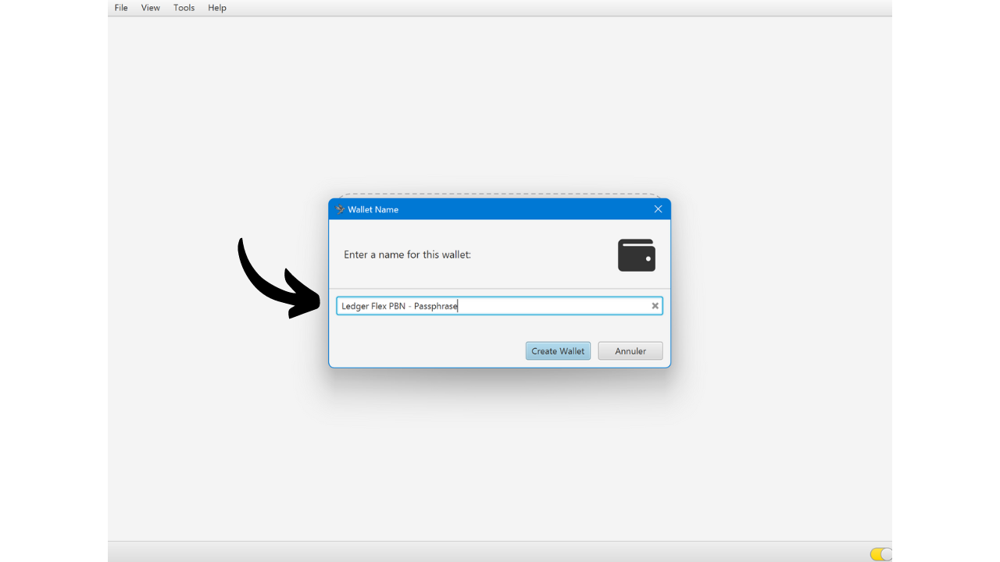
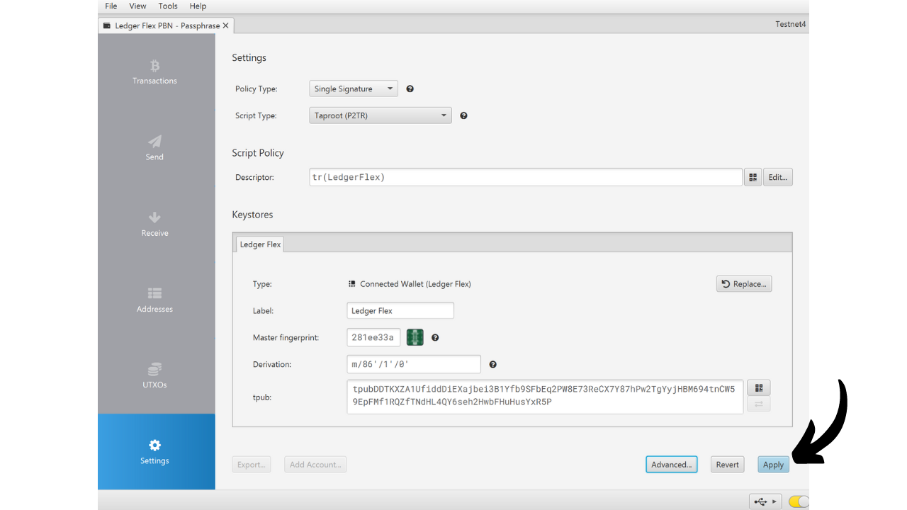

Una frase de contraseña BIP39 es una contraseña opcional que, combinada con tu frase mnemotécnica, proporciona una capa adicional de seguridad para los monederos de Bitcoin deterministas y jerárquicos. En este tutorial, revisaremos juntos cómo configurar una frase de contraseña en tu monedero seguro de Bitcoin en un Ledger (independientemente del modelo).

Antes de comenzar este tutorial, si no estás familiarizado con el concepto de una frase de contraseña, cómo funciona y sus implicaciones para tu monedero de Bitcoin, te recomiendo encarecidamente consultar este otro artículo teórico donde explico todo:

https://planb.network/tutorials/wallet/passphrase

## ¿Cómo funciona la frase de contraseña en un Ledger?

Con los dispositivos Ledger, tienes dos opciones diferentes para configurar una frase de contraseña en tu monedero: la opción "*vinculada al PIN*" y la opción "*temporal*".

Con la opción "*vinculada al PIN*", asocias una frase de contraseña con un segundo PIN en tu Ledger. Esto significa que tendrás 2 PINs: uno para acceder a tu monedero regular sin una frase de contraseña, y el otro para acceder a tu segundo monedero protegido por la frase de contraseña.

Fundamentalmente, incluso con esta opción de frase de contraseña vinculada al segundo PIN, tu frase de contraseña sigue siendo tu frase de contraseña. Esto significa que si pierdes tu Ledger y deseas recuperar tus bitcoins en otro dispositivo o software, necesitarás absolutamente tu frase de 24 palabras y tu **frase de contraseña completa**. El PIN asociado con la frase de contraseña solo se usa para acceder a ella en tu Ledger actual, pero no funciona en otros Ledger o en otro software. Por lo tanto, es importante hacer una copia de seguridad completa de tu frase de contraseña en un medio físico. **Conocer solo el PIN secundario no es suficiente para recuperar el acceso a tu monedero**; es simplemente una característica de conveniencia en tu Ledger.

Esta segunda opción de PIN es particularmente interesante para lidiar con ataques físicos. Por ejemplo, si un atacante te obliga a desbloquear tu dispositivo para robar tus fondos, puedes usar el primer PIN para acceder a un monedero señuelo que contenga una pequeña cantidad de bitcoins, mientras mantienes tus fondos principales seguros detrás del segundo PIN.

Además, esta opción ofrece todos los beneficios de seguridad de la frase de contraseña BIP39 sin la restricción de tener que ingresarla manualmente cada vez que uses tu dispositivo de firma. Esto te permite usar una frase de contraseña larga y aleatoria, fortaleciendo así la protección contra ataques de fuerza bruta, mientras evitas la dificultad de tener que teclearla manualmente cada vez en los pequeños botones del dispositivo.
La opción de la "frase de contraseña temporal" no almacena la frase de contraseña en el dispositivo. Cada vez que quieras acceder a tu monedero protegido, necesitarás ingresar manualmente la frase de contraseña en el Ledger. Esto hace que el uso sea más engorroso, pero también aumenta ligeramente la seguridad al no dejar rastro de la frase de contraseña en el dispositivo. Tan pronto como apagues el dispositivo, este vuelve a su estado predeterminado y requiere una nueva entrada de la frase de contraseña completa para acceder a las cuentas ocultas. Esta opción de "frase de contraseña temporal" es, por lo tanto, similar al funcionamiento de otros monederos hardware.
En este tutorial, usaré el Ledger Flex como ejemplo. Sin embargo, si estás usando otro modelo de Ledger, el proceso sigue siendo el mismo. Para el Ledger Stax, la interfaz es la misma que la del Ledger Flex. En cuanto a los modelos Nano S, Nano S Plus y Nano X, aunque la interfaz es diferente, el proceso y los nombres de los menús siguen siendo los mismos.
**Atención:** Si ya has recibido bitcoins en tu Ledger antes de activar la frase de paso, necesitarás transferirlos mediante una transacción de Bitcoin. La frase de paso genera un conjunto de nuevas claves, creando así una cartera completamente independiente de tu cartera inicial. Al añadir la frase de paso, tendrás una nueva cartera que estará vacía. Sin embargo, esto no elimina tu primera cartera sin frase de paso. Todavía puedes acceder a ella, ya sea directamente a través de tu Ledger sin ingresar la frase de paso o mediante otro software usando tu frase de 24 palabras.
Antes de comenzar este tutorial, asegúrate de haber inicializado tu Ledger y generado tu frase mnemotécnica. Si este no es el caso y tu Ledger es nuevo, sigue el tutorial específico para tu modelo disponible en PlanB Network. Una vez completado este paso, puedes volver a este tutorial.

https://planb.network/tutorials/wallet/ledger-flex
https://planb.network/tutorials/wallet/ledger-nano-s-plus
https://planb.network/tutorials/wallet/ledger

## ¿Cómo configurar una frase de paso temporal con un Ledger?

En la página de inicio de tu Ledger, haz clic en el engranaje de configuración.

Selecciona el menú "Avanzado", luego "Establecer frase de paso".

Este es el paso donde puedes elegir entre la opción "vinculada a PIN" o la opción "temporal" de la que hablamos en la parte anterior. Aquí, explicaré cómo configurar una frase de paso temporal, así que haz clic en "Establecer frase de paso temporal".

Luego se te pedirá que ingreses tu frase de paso. Elige una frase de paso fuerte y procede inmediatamente a hacer una copia de seguridad física, en un medio como papel o metal. En este ejemplo, elegí la frase de paso: `fH3&kL@9mP#2sD5qR!82`. Después de ingresar tu frase de paso, haz clic en el botón "*Continuar*".

Verifica que tu frase de paso coincida con lo que has anotado en tu copia de seguridad física, luego haz clic en el botón "*Sí, es correcto*" para confirmar.

Para finalizar la creación de tu frase de paso, ingresa el código PIN de tu Ledger. A partir de ahora, cada vez que quieras acceder a tu cartera con una frase de paso en el Ledger, necesitarás seguir exactamente los mismos pasos descritos aquí.

Ahora puedes importar tu conjunto de claves públicas en Sparrow Wallet para gestionar tu cartera. En Sparrow, esto corresponderá a una cartera diferente de tu cartera inicial sin frase de paso.

Abre Sparrow Wallet. Asegúrate de que el software esté conectado a un nodo, luego haz clic en la pestaña "*Archivo*" y selecciona "*Nueva cartera*".

Elige un nombre para tu cartera protegida por una frase de paso. Para este ejemplo, opté por un nombre que incluye explícitamente el término "*frase de paso*". Sin embargo, si prefieres mantener la discreción de esta cartera en tu computadora, puedes elegir un nombre menos evocativo.

Elige el tipo de script para tu cartera. Te aconsejo elegir "*Taproot*" o alternativamente "*SegWit Nativo*".

Conecta tu Ledger a tu computadora, luego haz clic en "*Connected Hardware Wallet*". Asegúrate de haber ingresado ya tu frase de paso en tu Ledger. Si no, por favor regresa a los pasos anteriores para ingresar tu frase de paso. Antes de proceder al escaneo, también recuerda abrir la aplicación "*Bitcoin*" en tu Ledger.

Haz clic en el botón "*Scan...*".

Haz clic en "*Import Keystore*" al lado de tu Ledger.

Tu billetera protegida por la frase de paso ahora está creada en Sparrow. Para confirmar, haz clic en el botón "*Apply*".

Elige una contraseña fuerte para asegurar el acceso a Sparrow Wallet. Esta contraseña asegurará la seguridad del acceso a los datos de tu billetera en Sparrow, lo que ayuda a proteger tus claves públicas, direcciones, etiquetas e historial de transacciones contra cualquier acceso no autorizado.
Te aconsejo guardar esta contraseña en un gestor de contraseñas para que no la olvides.

¡Y ahí lo tienes, tu billetera ahora está creada! En el menú de "*Settings*", Sparrow te proporcionará tu "*Master fingerprint*". Esto representa la huella digital de tu clave maestra, utilizada como base para derivar tu billetera. Te recomiendo encarecidamente mantener una copia de esta huella digital. En mi ejemplo, corresponde a: `281ee33a`.

Recuerda lo que mencionamos en las partes anteriores: un error, incluso uno menor, al ingresar tu frase de paso generará una nueva billetera completamente con diferentes claves. Cada vez que necesites asegurarte de que estás accediendo a la billetera correcta con la frase de paso correcta, verifica que la huella digital de tu clave maestra coincida con la que anotaste. Esta información, por sí sola, no representa un riesgo para la seguridad de tus fondos o tu privacidad.

Antes de usar tu billetera con una frase de paso, te aconsejo encarecidamente realizar una prueba de recuperación en seco. Anota una pieza de información de referencia como tu xpub o la huella digital de tu clave maestra, luego reinicia tu Ledger mientras la billetera aún esté vacía. A continuación, intenta restaurar tu billetera en el Ledger usando tus copias de seguridad en papel de la frase de 24 palabras y la frase de paso. Verifica que la información generada después de la restauración coincida con lo que inicialmente anotaste. Si ese es el caso, puedes estar seguro de que tus copias de seguridad en papel son confiables.

## ¿Cómo configurar una frase de paso vinculada a un PIN con un Ledger?

En la página de inicio de tu Ledger, haz clic en el engranaje de configuración.

Selecciona el menú "*Advanced*", luego "*Set passphrase*".

Este es el paso donde puedes elegir entre la opción "*linked to PIN*" o "*temporary*" de la que hablamos en la parte anterior. Aquí, explicaré cómo configurar una frase de paso adjunta a un nuevo PIN, así que haz clic en "*Set passphrase and attach it to a new PIN*".

Debes elegir entonces el código PIN que se asociará con tu frase de paso. Al igual que con el código PIN principal, se recomienda elegir un código PIN de 8 dígitos, tan aleatorio como sea posible. Además, asegúrate de guardar este código en un lugar diferente de donde se almacena tu Ledger Flex.
En mi caso, el código PIN principal es `58293647` y elegí `71425839` como el código PIN secundario asociado con la frase de paso.

Luego se te pedirá que ingreses tu frase de paso. Elige una frase de paso fuerte e inmediatamente procede a hacer una copia de seguridad física, en un medio como papel o metal. En este ejemplo, elegí la frase de paso: `fH3&kL@9mP#2sD5qR!82`. Después de ingresar tu frase de paso, haz clic en el botón "*Continuar*".

Verifica que tu frase de paso coincida con lo que has anotado en tu copia de seguridad física, luego haz clic en el botón "*Sí, es correcto*" para confirmar.

Para finalizar la creación de tu frase de paso, ingresa el código PIN principal de tu Ledger (no el asociado con la frase de paso).

A partir de ahora, cada vez que quieras acceder a tu billetera con una frase de paso en el Ledger, necesitarás ingresar no el código PIN principal, sino el código PIN secundario:
- Código PIN principal (`58293647`) > billetera sin frase de paso.
- Código PIN secundario (`71425839`) > billetera con frase de paso.

Ahora puedes importar tu conjunto de claves públicas en Sparrow Wallet para gestionar tu billetera. En Sparrow, esto corresponderá a una billetera diferente de tu billetera inicial sin frase de paso.

Abre Sparrow Wallet. Asegúrate de que el software esté conectado a un nodo, luego haz clic en la pestaña "*Archivo*" y selecciona "*Nueva Billetera*".

Elige un nombre para tu billetera protegida por una frase de paso. Para este ejemplo, opté por un nombre que incluye explícitamente el término "*frase de paso*". Sin embargo, si prefieres mantener la discreción de esta billetera en tu computadora, puedes elegir un nombre menos evocativo.

Elige el tipo de script para tu billetera. Te aconsejo elegir "*Taproot*" o, en su defecto, "*Native SegWit*".

Conecta tu Ledger a tu computadora, luego haz clic en "*Billetera de Hardware Conectada*". Asegúrate de ya tener tu frase de paso en tu Ledger desbloqueándolo con el código PIN secundario. Si no, reinicia tu Ledger e ingresa el código PIN asociado con la frase de paso. Antes de proceder al escaneo, también recuerda abrir la aplicación "*Bitcoin*" en tu Ledger.

Haz clic en el botón "*Escanear...*".

Haz clic en "*Importar Almacén de Claves*".

Tu billetera protegida por la frase de paso ahora está creada en Sparrow. Para confirmar, haz clic en el botón "*Aplicar*".

Elige una contraseña fuerte para asegurar el acceso a Sparrow Wallet. Esta contraseña asegurará la seguridad del acceso a los datos de tu billetera en Sparrow, lo que ayuda a proteger tus claves públicas, direcciones, etiquetas e historial de transacciones contra cualquier acceso no autorizado.

Te aconsejo guardar esta contraseña en un gestor de contraseñas para que no la olvides.

¡Y ahí lo tienes, tu billetera ya está creada! En el menú de "*Configuración*", Sparrow te proporcionará tu "*Master fingerprint*". Esto representa la huella digital de tu llave maestra, utilizada en la base de la derivación de tu billetera. Te recomiendo encarecidamente que guardes una copia de esta huella digital. En mi ejemplo, corresponde a: `281ee33a`.

Recuerda lo que mencionamos en las partes anteriores: un error, incluso uno menor, al ingresar tu frase de paso generará una nueva billetera completamente diferente con distintas llaves. Cada vez que necesites asegurarte de acceder a la billetera correcta con la frase de paso adecuada, verifica que la huella digital de tu llave maestra coincida con la que anotaste. Esta información, por sí misma, no representa un riesgo para la seguridad de tus fondos o tu privacidad.
Antes de usar tu billetera con una frase de paso, te aconsejo encarecidamente que realices una prueba de recuperación en seco. Anota una pieza de información de referencia como tu xpub o la huella digital de tu llave maestra, luego reinicia tu Ledger mientras la billetera aún esté vacía. A continuación, intenta restaurar tu billetera en el Ledger usando tus copias en papel de la frase de 24 palabras y la frase de paso. Comprueba que la información generada después de la restauración coincida con lo que inicialmente anotaste. Si este es el caso, puedes estar seguro de que tus copias de seguridad en papel son confiables.

¡Felicidades, tu billetera de Bitcoin ahora está asegurada con una frase de paso! Si encontraste útil este tutorial, te agradecería mucho si pudieras dejar un pulgar arriba abajo. Siéntete libre de compartir este artículo en tus redes sociales. ¡Muchas gracias!

También te recomiendo que revises este otro tutorial completo sobre cómo usar tu Ledger Flex:

https://planb.network/tutorials/wallet/ledger-flex