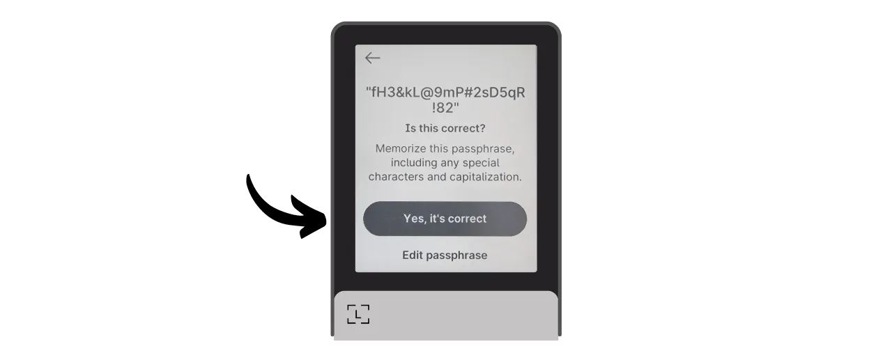

BIP39-salasana on valinnainen salasana, joka yhdistettynä mnemoniseen fraasiisi, tarjoaa lisäkerroksen turvallisuutta deterministisille ja hierarkkisille Bitcoin-lompakoille. Tässä oppaassa käymme yhdessä läpi, kuinka asettaa salasana turvalliseen Bitcoin-lompakkoosi Ledger-laitteella (mallista riippumatta).

Ennen tämän oppaan aloittamista, jos et ole tuttu salasanan konseptin, sen toiminnan ja sen vaikutusten kanssa Bitcoin-lompakkoosi, suosittelen vahvasti tutustumaan toiseen teoreettiseen artikkeliin, jossa selitän kaiken:

https://planb.network/tutorials/wallet/passphrase

## Kuinka salasana toimii Ledgerissä?

Ledger-laitteilla on kaksi eri vaihtoehtoa salasanan määrittämiseen lompakkoosi: "*PIN-sidottu*" vaihtoehto ja "*väliaikainen*" vaihtoehto.

"*PIN-sidottu*" vaihtoehdossa yhdistät salasanan toiseen PIN-koodiin Ledgerissäsi. Tämä tarkoittaa, että sinulla on 2 PIN-koodia: yksi päästäksesi tavalliseen lompakkoosi ilman salasanaa ja toinen päästäksesi toiseen lompakkoosi, joka on suojattu salasanalla.

Periaatteessa, vaikka tämä salasana onkin sidottu toiseen PIN-koodiin, salasanasi pysyy salasanana. Tämä tarkoittaa, että jos menetät Ledgerisi ja haluat palauttaa bitcoinsi toiselle laitteelle tai ohjelmistolle, tarvitset ehdottomasti 24-sanan fraasisi ja **täydellisen salasanasi**. Salasanaan liitetty PIN-koodi on käytössä vain nykyisessä Ledgerissäsi, mutta se ei toimi muissa Ledger-laitteissa tai muussa ohjelmistossa. On siis tärkeää varmuuskopioida salasanasi fyysiselle välineelle. **Pelkän toissijaisen PIN-koodin tietäminen ei riitä palauttamaan pääsyä lompakkoosi**; se on vain mukavuusominaisuus Ledgerissäsi.

Tämä toinen PIN-koodivaihtoehto on erityisen mielenkiintoinen fyysisiä hyökkäyksiä vastaan. Esimerkiksi, jos hyökkääjä pakottaa sinut avaamaan laitteesi varastaakseen varasi, voit käyttää ensimmäistä PIN-koodia päästäksesi harhautuslompakkoon, joka sisältää pienen määrän bitcoineja, samalla kun pidät päävarasi turvassa toisen PIN-koodin takana.

Lisäksi tämä vaihtoehto tarjoaa kaikki BIP39-salasanan turvaedut ilman, että sinun tarvitsee syöttää sitä manuaalisesti joka kerta, kun käytät allekirjoituslaitettasi. Tämä mahdollistaa pitkän ja satunnaisen salasanan käytön, mikä vahvistaa suojaa brute force -hyökkäyksiä vastaan, samalla välttäen vaikeuden, joka liittyy sen manuaaliseen kirjoittamiseen laitteen pienillä painikkeilla joka kerta.
"Väliaikainen salasana" -vaihtoehto ei tallenna salasanaa laitteeseen. Joka kerta, kun haluat päästä suojattuun lompakkoosi, sinun on manuaalisesti syötettävä salasana Ledgeriin. Tämä tekee käytöstä hankalampaa, mutta lisää myös hieman turvallisuutta jättämällä salasanan jäljen laitteeseen. Heti kun sammutat laitteen, se palautuu oletustilaansa ja vaatii uuden täydellisen salasanan syötön päästäksesi piilotettuihin tileihin. Tämä "väliaikainen salasana" -vaihtoehto on siis samankaltainen kuin muiden laitteistolompakkojen toiminta.
Tässä oppaassa käytän esimerkkinä Ledger Flexiä. Jos kuitenkin käytät toista Ledger-mallia, prosessi pysyy samana. Ledger Staxin käyttöliittymä on sama kuin Ledger Flexin. Nano S, Nano S Plus ja Nano X -malleissa, vaikka käyttöliittymä eroaa, prosessi ja valikoiden nimet pysyvät samoina.
**Huomio:** Jos olet jo vastaanottanut bitcoineja Ledgeriisi ennen salasanan aktivointia, sinun täytyy siirtää ne Bitcoin-siirrolla. Salasana luo uuden avainjoukon, luoden täysin itsenäisen lompakon alkuperäisestä lompakostasi. Salasanan lisäämisen jälkeen sinulla on uusi lompakko, joka on tyhjä. Tämä ei kuitenkaan poista ensimmäistä salasanatonta lompakkoasi. Voit edelleen päästä siihen käsiksi, joko suoraan Ledgerisi kautta ilman salasanan syöttämistä tai toisen ohjelmiston kautta käyttäen 24-sanan fraasiasi.
Ennen tämän oppaan aloittamista, varmista, että olet jo alustanut Ledgerisi ja luonut muistisanojesi fraasin. Jos näin ei ole ja Ledgerisi on uusi, seuraa mallisi mukaista erityisopasta PlanB Network -sivustolla. Kun tämä vaihe on suoritettu, voit palata tähän oppaaseen.

https://planb.network/tutorials/wallet/ledger-flex
https://planb.network/tutorials/wallet/ledger-nano-s-plus
https://planb.network/tutorials/wallet/ledger

## Kuinka asettaa väliaikainen salasana Ledgeriin?

Ledgerisi kotisivulla, klikkaa asetusten hammasratasta.

Valitse "Edistyneet" valikosta, sitten "Aseta salasana".

Tässä vaiheessa voit valita "liitetty PIN-koodiin" vaihtoehdon tai "väliaikainen" vaihtoehdon, josta puhuimme edellisessä osassa. Tässä selitän, kuinka asettaa väliaikainen salasana, joten klikkaa "Aseta väliaikainen salasana".

Sinua pyydetään sitten syöttämään salasanasi. Valitse vahva salasana ja siirry välittömästi fyysiseen varmuuskopiointiin, välineellä kuten paperi tai metalli. Tässä esimerkissä valitsin salasanan: `fH3&kL@9mP#2sD5qR!82`. Salasanan syöttämisen jälkeen klikkaa "*Jatka*" -painiketta.

Varmista, että salasanasi vastaa sitä, mitä olet merkinnyt fyysiseen varmuuskopioosi, ja klikkaa sitten "*Kyllä, se on oikein*" -painiketta vahvistaaksesi.

Salasanasi luomisen viimeistelläksesi, syötä Ledgerisi PIN-koodi. Tästä lähtien, aina kun haluat päästä käsiksi lompakkoosi salasanalla Ledgerissä, sinun täytyy seurata täsmälleen samoja vaiheita kuin tässä kuvattu.

Voit nyt tuoda julkisten avaintesi joukon Sparrow Walletiin hallitaksesi lompakkoasi. Sparrow'ssa tämä vastaa eri lompakkoa alkuperäisestä salasanattomasta lompakostasi.

Avaa Sparrow Wallet. Varmista, että ohjelmisto on yhdistetty nodeen, sitten klikkaa "*Tiedosto*" -välilehteä ja valitse "*Uusi lompakko*".

Valitse nimi salasanalla suojatulle lompakollesi. Tässä esimerkissä valitsin nimen, joka sisältää nimenomaisesti termin "*salasana*". Jos kuitenkin haluat säilyttää tämän lompakon hienovaraisuuden tietokoneellasi, voit valita vähemmän kuvailevan nimen.

Valitse lompakkosi skriptityyppi. Neuvon valitsemaan "*Taproot*" tai vaihtoehtoisesti "*Native SegWit*".

Yhdistä Ledgerisi tietokoneeseesi ja napsauta "*Connected Hardware Wallet*". Varmista, että olet jo syöttänyt salasanasi Ledgeriisi. Jos et ole, palaa takaisin edellisiin vaiheisiin salasanan syöttämiseksi. Ennen skannaukseen siirtymistä, muista myös avata "*Bitcoin*" sovellus Ledgerissäsi.

Napsauta "*Scan...*" painiketta.

Napsauta "*Import Keystore*" Ledgerisi vieressä.

Salasanalla suojattu lompakkosi on nyt luotu Sparrow'ssa. Vahvistaaksesi, napsauta "*Apply*" painiketta.

Valitse vahva salasana Sparrow Walletin käyttöoikeuden suojaamiseksi. Tämä salasana varmistaa lompakkotietojesi, kuten julkisten avainten, osoitteiden, nimikkeiden ja tapahtumahistorian, suojauksen luvattomalta pääsyltä Sparrow'ssa.
Neuvon sinua tallentamaan tämän salasanan salasananhallintaohjelmaan, jotta et unohda sitä.

Ja siinä se, lompakkosi on nyt luotu! "*Settings*" valikossa Sparrow tarjoaa sinulle "*Master fingerprint*". Tämä edustaa pääavaimesi sormenjälkeä, jota käytetään lompakkosi johdannaisena. Suosittelen vahvasti pitämään kopion tästä sormenjäljestä. Esimerkissäni se vastaa: `281ee33a`.

Muista mitä mainitsimme aiemmissa osissa: virhe, vaikkakin pieni, salasanan syöttämisessä luo täysin uuden lompakon eri avaimilla. Joka kerta kun tarvitset varmistaa, että pääset oikeaan lompakkoon oikealla salasanalla, tarkista, että pääavaimesi sormenjälki vastaa ylöskirjoittamaasi. Tämä tieto itsessään ei aiheuta riskiä varojesi turvallisuudelle tai yksityisyydellesi.

Ennen kuin käytät lompakkoasi salasanalla, neuvon sinua vahvasti suorittamaan kuivan harjoituksen palautustestin. Kirjaa ylös viitetieto, kuten xpub tai pääavaimesi sormenjälki, sitten nollaa Ledgerisi, kun lompakko on vielä tyhjä. Yritä seuraavaksi palauttaa lompakkosi Ledgeriin käyttäen paperivarmuuskopioitasi 24 sanan fraasista ja salasanasta. Tarkista, että palautuksen jälkeen generoitu tieto vastaa alun perin kirjaamaasi. Jos näin on, voit olla varma, että paperivarmuuskopiosi ovat luotettavia.

## Kuinka asettaa salasana PIN-koodiin liitettynä Ledgerissä?

Ledgerisi kotisivulla, napsauta asetusten hammasratasta.

Valitse "*Advanced*" valikko, sitten "*Set passphrase*".

Tässä on vaihe, jossa voit valita "*linked to PIN*" tai "*temporary*" vaihtoehdon, joista puhuimme aiemmassa osassa. Tässä selitän, kuinka asettaa salasana PIN-koodiin liitettynä, joten napsauta "*Set passphrase and attach it to a new PIN*".

Sinun täytyy sitten valita PIN-koodi, joka liitetään salasanaasi. Kuten pää-PIN-koodin kanssa, on suositeltavaa valita mahdollisimman satunnainen 8-numeroinen PIN-koodi. Varmista myös, että tallennat tämän koodin eri paikkaan kuin missä Ledger Flexisi säilytetään.
Minun tapauksessani pää-PIN-koodi on `58293647` ja valitsin `71425839` toissijaiseksi PIN-koodiksi, joka liittyy salalauseeseen.

Sinua pyydetään sitten syöttämään salalauseesi. Valitse vahva salalause ja siirry välittömästi fyysiseen varmuuskopiointiin, esimerkiksi paperille tai metallille. Tässä esimerkissä valitsin salalauseen: `fH3&kL@9mP#2sD5qR!82`. Salalauseen syöttämisen jälkeen klikkaa "*Jatka*" -painiketta.

Varmista, että salalauseesi vastaa sitä, mitä olet merkinnyt fyysiseen varmuuskopioosi, ja klikkaa sitten "*Kyllä, se on oikein*" -painiketta vahvistaaksesi.

Salalauseen luomisen viimeistelemiseksi, syötä Ledgerisi pää-PIN-koodi (ei se, joka liittyy salalauseeseen).

Tästä lähtien, kun haluat päästä käsiksi lompakkoosi salalauseen kanssa Ledgerissä, sinun tulee syöttää ei pää-PIN-koodi, vaan toissijainen PIN-koodi:
- Pää-PIN-koodi (`58293647`) > lompakko ilman salalausetta.
- Toissijainen PIN-koodi (`71425839`) > lompakko salalauseen kanssa.

Voit nyt tuoda julkisten avaintesi joukon Sparrow Walletiin hallitaksesi lompakkoasi. Sparrow'ssa tämä vastaa eri lompakkoa alkuperäisestä lompakostasi ilman salalausetta.

Avaa Sparrow Wallet. Varmista, että ohjelmisto on yhdistetty solmuun, klikkaa sitten "*Tiedosto*" -välilehteä ja valitse "*Uusi lompakko*".

Valitse nimi salalauseella suojatulle lompakollesi. Tässä esimerkissä valitsin nimen, joka sisältää nimenomaisesti termin "*salalause*". Jos kuitenkin haluat säilyttää tämän lompakon hienovaraisuuden tietokoneellasi, voit valita vähemmän kuvailevan nimen.

Valitse lompakollesi skriptityyppi. Neuvon valitsemaan "*Taproot*" tai, jos se ei ole mahdollista, "*Native SegWit*".

Yhdistä Ledger tietokoneeseesi ja klikkaa "*Yhdistetty laitteistolompakko*". Varmista, että sinulla on jo salalause Ledgerissäsi avaamalla se toissijaisella PIN-koodilla. Jos ei, käynnistä Ledger uudelleen ja syötä salalauseeseen liittyvä PIN-koodi. Ennen skannaukseen siirtymistä, muista myös avata "*Bitcoin*" -sovellus Ledgerissäsi.

Klikkaa "*Skannaa...*" -painiketta.

Klikkaa "*Tuo avainvarasto*".

Salalauseella suojattu lompakkosi on nyt luotu Sparrow'ssa. Vahvistaaksesi, klikkaa "*Käytä*" -painiketta.

Valitse vahva salasana Sparrow Walletin käyttöoikeuden suojaamiseksi. Tämä salasana varmistaa pääsyn lompakkotietoihisi Sparrow'ssa turvallisesti, mikä auttaa suojaamaan julkisia avaimiasi, osoitteitasi, etikettejäsi ja tapahtumahistoriaasi luvattomalta pääsyltä.

Neuvon tallentamaan tämän salasanan salasananhallintaohjelmaan, jotta et unohda sitä.
Ja siinä se on, lompakkosi on nyt luotu! "*Asetukset*" -valikossa Sparrow tarjoaa sinulle "*Master fingerprint*" -tunnisteen. Tämä edustaa pääavaimesi sormenjälkeä, jota käytetään lompakkosi johdannon perustana. Suosittelen vahvasti, että pidät kopion tästä sormenjäljestä. Esimerkissäni se vastaa: `281ee33a`.

Muista, mitä mainitsimme aiemmissa osissa: virhe, vaikkakin pieni, salasanasi syöttämisessä luo täysin uuden lompakon eri avaimilla. Aina kun tarvitset varmistaa pääsyn oikeaan lompakkoon oikealla salasanalla, varmista, että pääavaimesi sormenjälki vastaa merkitsemääsi. Tämä tieto itsessään ei aiheuta riskiä varojesi turvallisuudelle tai yksityisyydellesi.
Ennen kuin käytät lompakkoasi salasanalla, suosittelen vahvasti suorittamaan kuivan harjoituksen palautustestin. Merkitse viitetieto, kuten xpub tai pääavaimesi sormenjälki, sitten nollaa Ledgerisi, kun lompakko on vielä tyhjä. Yritä seuraavaksi palauttaa lompakkosi Ledgeriin käyttäen paperivarmuuskopioitasi 24-sanan fraasista ja salasanasta. Tarkista, että palautuksen jälkeen luotu tieto vastaa alun perin merkitsemääsi. Jos näin on, voit olla varma, että paperivarmuuskopiosi ovat luotettavia.

Onnittelut, Bitcoin-lompakkosi on nyt suojattu salasanalla! Jos pidit tätä opasta hyödyllisenä, arvostaisin, jos jättäisit peukun ylös alla. Voit vapaasti jakaa tämän artikkelin sosiaalisissa verkostoissasi. Suurkiitokset!

Suosittelen myös, että tutustut tähän toiseen kattavaan oppaaseen siitä, miten käytät Ledger Flexiäsi:

https://planb.network/tutorials/wallet/ledger-flex