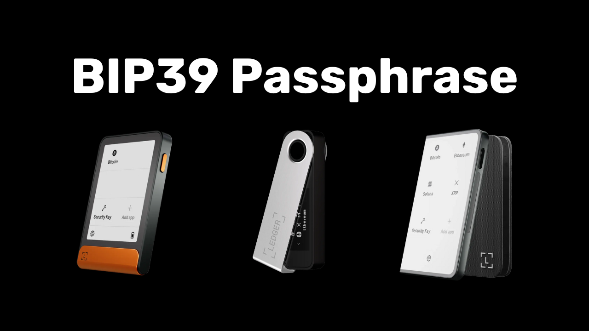

Une passphrase BIP39 est un mot de passe optionnel qui, combiné à la phrase mnémonique, offre une couche de sécurité supplémentaire pour les portefeuilles Bitcoin déterministes et hiérarchiques. Dans ce tutoriel, nous allons revoir ensemble les bases concernant le fonctionnement et le rôle d'une passphrase. Puis, nous verrons comment mettre en place une passphrase sur votre portefeuille Bitcoin sécurisé sur une Ledger (peu importe le modèle).

## C'est quoi une passphrase BIP39 ?

Les portefeuilles HD sont généralement générés à partir d’une phrase mnémonique constituée de 12 ou de 24 mots. Cette phrase est très importante, car elle permet de restaurer l'ensemble des clés d'un portefeuille en cas de perte de son support (comme un hardware wallet par exemple). Cependant, elle constitue un point de défaillance unique, car si elle est compromise, un attaquant pourrait voler l'intégralité des bitcoins.

01

C'est ici qu'intervient la passphrase. C'est un mot de passe optionnel, que vous pouvez choisir librement, qui s'ajoute à la phrase mnémonique dans la dérivation des clés pour renforcer la sécurité du portefeuille. 

02

Attention, la passphrase ne doit pas être confondue avec le code PIN de votre hardware wallet ou le mot de passe permettant de déverrouiller l'accès à votre portefeuille sur votre ordinateur. Contrairement à tous ces éléments, la passphrase joue un rôle dans la dérivation des clés de votre portefeuille. **Cela signifie que sans elle, vous ne pourrez jamais récupérer vos bitcoins.**

La passphrase fonctionne en tandem avec la phrase mnémonique, en modifiant la graine à partir de laquelle sont générées les clés. Ainsi, même si une personne obtient votre phrase de 12 ou de 24 mots, sans la passphrase, elle ne peut pas accéder à vos fonds. **L'utilisation d'une passphrase crée essentiellement un nouveau portefeuille avec des clés distinctes. Modifier (même légèrement) la passphrase générera un portefeuille différent.**

## Pourquoi devriez-vous utiliser une passphrase ?

La passphrase est arbitraire et peut être n'importe quelle combinaison de caractères choisie par l'utilisateur. L'utilisation d'une passphrase offre ainsi plusieurs avantages. Tout d'abord, elle réduit tous les risques liés à la compromission de la phrase mnémonique en nécessitant un second facteur pour accéder aux fonds (cambriolage, accès à votre domicile...).

Ensuite, elle peut être utilisée stratégiquement pour créer un portefeuille d’appât, afin de faire face à des contrainte physiques pour voler vos fonds comme la fameuse "$5 wrench attack". Dans ce scénario, l'idée est d'avoir un portefeuille sans passphrase contenant seulement une petite quantité de bitcoins, suffisante pour satisfaire un agresseur potentiel, tout en disposant d'un portefeuille caché. Ce dernier utilise la même phrase mnémonique, mais est sécurisé avec une passphrase additionnelle.

Enfin, l'utilisation d'une passphrase est intéressante lorsque l’on souhaite maitriser le caractère aléatoire de la génération de la graine du portefeuille HD.

## Comment choisir une bonne passphrase ?

Pour que la passphrase soit efficace, elle doit être suffisamment longue et aléatoire. Comme pour un mot de passe fort, je vous recommande de choisir une passphrase la plus longue et aléatoire possible, avec une diversité de lettres, de chiffres et de symboles pour rendre toute attaque par brute force impossible. 

Il est également important de bien sauvegarder cette passphrase, de la même manière que la phrase mnémonique. **La perdre revient à perdre l’accès aux bitcoins**. Je vous déconseille fortement de la retenir uniquement de tête, car cela augmente irraisonablement les risques de perte. L’idéal est de la noter sur un support physique (en papier ou en métal) séparé de la phrase mnémonique. Cette sauvegarde devra évidemment être stockée dans un lieu différent de celui où est stocké votre phrase mnémonique pour éviter que les deux soient compromis simultanément.

## Comment mettre en place une passphrase avec une Ledger ?

Dans ce tutoriel, je vais utiliser pour exemple la Ledger Flex. Cependant, si vous utilisez un autre modèle de Ledger, le processus reste identique. Pour les Ledger Stax, l'interface est la même que celle du Ledger Flex. Quant aux modèles Nano S, Nano S Plus, et Nano X, bien que l'interface soit différente, le processus et les noms des menus restent les mêmes.

