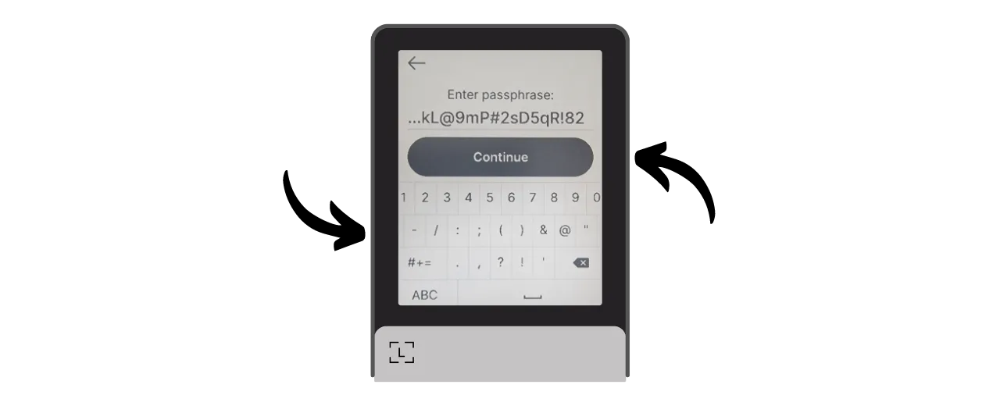
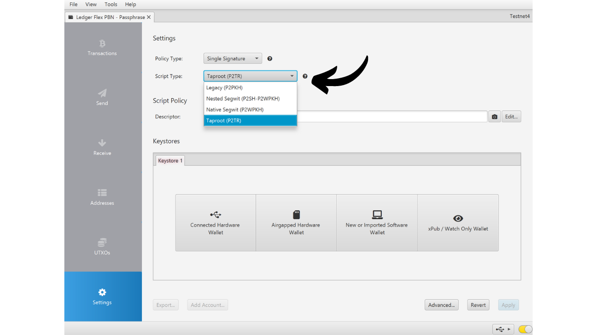

Une passphrase BIP39 est un mot de passe optionnel qui, combiné à la phrase mnémonique, offre une couche de sécurité supplémentaire pour les portefeuilles Bitcoin déterministes et hiérarchiques. Dans ce tutoriel, nous allons revoir ensemble comment mettre en place une passphrase sur votre portefeuille Bitcoin sécurisé sur une Ledger (peu importe le modèle).

Avant de commencer ce tutoriel, si vous n'êtes pas familier avec le concept de passphrase, son fonctionnement et ses implications pour votre portefeuille Bitcoin, je vous recommande fortement de consulter cet autre article théorique où je vous explique tout :

https://planb.network/tutorials/wallet/passphrase

## Comment fonctionne la passphrase sur une Ledger ?

Dans le cas des Ledger, vous avez deux options différentes pour configurer une passphrase sur votre portefeuille : l'option "*liée au code PIN*" et l'option "*temporaire*".

Avec l'option "*liée au code PIN*", vous associez une passphrase à un second code PIN sur votre Ledger. Cela signifie que vous aurez 2 codes PIN : l’un pour accéder à votre portefeuille ordinaire sans passphrase, et l’autre pour accéder à votre second portefeuille protégé par la passphrase.

Fondamentalement, même avec cette option de la passphrase liée au second code PIN, votre passphrase reste votre passphrase. Cela signifie que si vous perdez votre Ledger et souhaitez récupérer vos bitcoins sur un autre dispositif ou logiciel, vous aurez impérativement besoin de votre phrase de 24 mots et de votre **passphrase complète**. Le code PIN associé à la passphrase sert uniquement à accéder à celle-ci sur votre Ledger actuel, mais il ne fonctionne pas sur d'autres Ledger ou d'autres logiciels. Il est donc important de sauvegarder intégralement votre passphrase sur un support physique. **La connaissance du code PIN secondaire ne suffit pas pour récupérer l'accès à votre portefeuille** ; c'est simplement une facilité d'utilisation sur votre Ledger.

Cette option du second code PIN est particulièrement intéressante pour faire face aux attaques physiques. Par exemple, si un agresseur vous force à débloquer votre appareil pour voler vos fonds, vous pouvez utiliser le premier code PIN pour accéder à un portefeuille d’appât contenant peu de bitcoins, tout en gardant vos fonds principaux sécurisés derrière le second code PIN.

De plus, cette option vous offre tous les avantages de sécurité de la passphrase BIP39 sans la contrainte de devoir la saisir manuellement chaque fois que vous utilisez votre périphérique de signature. Cela vous permet d'utiliser une passphrase longue et aléatoire, afin de renforcer la protection contre les attaques par brute force, tout en évitant la difficulté de devoir la taper manuellement à chaque utilisation sur les petits boutons de l'appareil.

L'option de la "*passphrase temporaire*", quant à elle, ne stocke pas la passphrase sur l'appareil. Chaque fois que vous souhaitez accéder à votre portefeuille protégé, vous devrez saisir manuellement la passphrase sur la Ledger. Cela rend l’utilisation plus contraignante, mais augmente aussi légèrement la sécurité en ne laissant aucune trace de la passphrase sur le dispositif. Dès que vous éteignez l'appareil, il revient à son état par défaut, et nécessite une nouvelle saisie de la passphrase complète pour accéder aux comptes cachés. Cette option "*passphrase temporaire*" est donc similaire au fonctionnement des autres hardware wallets.

Dans ce tutoriel, je vais utiliser pour exemple la Ledger Flex. Cependant, si vous utilisez un autre modèle de Ledger, le processus reste identique. Pour les Ledger Stax, l'interface est la même que celle du Ledger Flex. Quant aux modèles Nano S, Nano S Plus, et Nano X, bien que l'interface soit différente, le processus et les noms des menus restent les mêmes.

**Attention :** Si vous avez déjà reçu des bitcoins sur votre Ledger avant d'activer la passphrase, vous devrez les transférer via une transaction Bitcoin. La passphrase génère un ensemble de nouvelles clés, ce qui crée ainsi un portefeuille totalement indépendant de votre portefeuille initial. Lors de l'ajout de la passphrase, vous aurez un nouveau portefeuille qui sera vide. Toutefois, cela ne supprime pas votre premier portefeuille sans passphrase. Vous pourrez toujours y accéder, soit directement via votre Ledger sans saisir la passphrase, soit via un autre logiciel en utilisant votre phrase de 24 mots.

Avant de commencer ce tutoriel, assurez-vous d'avoir déjà initialisé votre Ledger et généré votre phrase mnémonique. Si ce n'est pas le cas et que votre Ledger est neuf, suivez le tutoriel spécifique à votre modèle disponible sur PlanB Network. Une fois cette étape complétée, vous pourrez revenir à ce tutoriel.

https://planb.network/tutorials/wallet/ledger-flex
https://planb.network/tutorials/wallet/ledger-nano-s-plus
https://planb.network/tutorials/wallet/ledger

## Comment mettre en place une passphrase temporaire avec une Ledger ?

Sur la page d'accueil de votre Ledger, cliquez sur la roue crantée des paramètres.

Sélectionnez le menu "*Advanced*", puis "*Set passphrase*".

C'est à cette étape que vous pouvez choisir entre l'option "*liée au code PIN*" ou "*temporaire*" dont nous avons parlé dans la partie précédente. Ici, je vous explique comment mettre en place une passphrase temporaire, cliquez donc sur "*Set temporary passphrase*".

On vous demande ensuite de renseigner votre passphrase. Choisissez une passphrase forte et procédez immédiatement à une sauvegarde physique, sur un support tel que du papier ou du métal. Dans cet exemple, j'ai choisi la passphrase : `fH3&kL@9mP#2sD5qR!82`. Après avoir saisi votre passphrase, cliquez sur le bouton "*Continue*".

Vérifiez que votre passphrase correspond à ce que vous avez noté sur votre sauvegarde physique, puis cliquez sur le bouton "*Yes, it's correct*" pour confirmer.

Pour finaliser la création de votre passphrase, entrez le code PIN de votre Ledger. Désormais, chaque fois que vous voudrez accéder à votre portefeuille avec passphrase sur la Ledger, vous devrez suivre exactement les mêmes étapes que celles décrites ici.

Vous pouvez maintenant importer votre ensemble de clés publiques sur Sparrow Wallet pour gérer votre portefeuille. Sur Sparrow, cela correspondra à un portefeuille différent de votre portefeuille initial sans passphrase.

Ouvrez Sparrow Wallet. Assurez-vous que le logiciel est bien connecté à un nœud, puis cliquez sur l'onglet "*File*" et sélectionnez "*New Wallet*".

Choisissez un nom pour votre portefeuille protégé par une passphrase. Pour cet exemple, j'ai opté pour un nom incluant explicitement le terme "*passphrase*". Toutefois, si vous préférez maintenir la discrétion de ce portefeuille sur votre ordinateur, vous pouvez choisir un nom moins évocateur.

Choisissez le type de script de votre portefeuille. Je vous conseille de choisir "*Taproot*" ou à défaut "*Native SegWit*".

Connectez votre Ledger à votre ordinateur, puis cliquez sur "*Connected Hardware Wallet*". Assurez-vous d'avoir déjà saisi votre passphrase sur votre Ledger. Si ce n'est pas le cas, veuillez reprendre les étapes précédentes pour entrer votre passphrase. Avant de procéder au scan, n'oubliez pas également d'ouvrir l'application "*Bitcoin*" sur votre Ledger.

Cliquez sur le bouton "*Scan...*".

Cliquez sur "*Import Keystore*" à côté de votre Ledger.

Votre portefeuille protégé par la passphrase est bien créé sur Sparrow. Pour confirmer, cliquez sur le bouton "*Apply*".

Choisissez un mot de passe fort pour sécuriser l'accès à Sparrow Wallet. Ce mot de passe assurera la sécurité de l'accès aux données de votre portefeuille sur Sparrow, ce qui permet de protéger vos clés publiques, vos adresses, vos labels et l'historique de vos transactions contre tout accès non autorisé.

Je vous conseille de sauvegarder ce mot de passe dans un gestionnaire de mots de passe pour ne pas l'oublier.

Et voilà, votre portefeuille est désormais créé ! Dans le menu "*Settings*", Sparrow vous fournira votre "*Master fingerprint*". Cela représente l'empreinte de votre clé maîtresse, utilisée à la base de la dérivation de votre portefeuille. Je vous recommande vivement de conserver une copie de cette empreinte. Dans mon exemple, elle correspond à : `281ee33a`.

Rappelez-vous ce que nous avons mentionné dans les parties précédentes : une erreur, même minime, dans la saisie de votre passphrase générera un portefeuille entièrement nouveau avec des clés différentes. Chaque fois que vous devez vous assurer d'accéder au bon portefeuille avec la bonne passphrase, vérifiez que l'empreinte de votre clé maîtresse correspond à celle que vous aviez notée. Cette information, à elle seule, ne présente aucun risque pour la sécurité de vos fonds ni pour votre confidentialité.

Avant d'utiliser votre portefeuille avec passphrase, je vous conseille fortement de réaliser un test de récupération à vide. Notez une information de référence comme votre xpub ou bien l'empreinte de votre clé maîtresse, puis réinitialisez votre Ledger tant que le portefeuille est encore vide. Ensuite, essayez de restaurer votre portefeuille sur la Ledger en utilisant vos sauvegardes papier de la phrase de 24 mots et de la passphrase. Vérifiez que l'information générée après la restauration correspond à celle que vous aviez notée initialement. Si c'est le cas, vous pouvez être assuré que vos sauvegardes papier sont fiables.

## Comment mettre en place une passphrase liée au code PIN avec une Ledger ?

Sur la page d'accueil de votre Ledger, cliquez sur la roue crantée des paramètres.

Sélectionnez le menu "*Advanced*", puis "*Set passphrase*".

C'est à cette étape que vous pouvez choisir entre l'option "*liée au code PIN*" ou "*temporaire*" dont nous avons parlé dans la partie précédente. Ici, je vous explique comment mettre en place une passphrase attachée à un code PIN, cliquez donc sur "*Set passphrase and attach it to a new PIN*".

Vous devez ensuite choisir le code PIN qui sera associé à votre passphrase. De la même manière que pour le code PIN principal, il est recommandé de choisir un code PIN de 8 chiffres, le plus aléatoire possible. Assurez-vous également de sauvegarder ce code dans un lieu distinct de celui où est stocké votre Ledger Flex.

Dans mon cas, le code PIN principal est `58293647` et j'ai choisi comme code PIN secondaire associé à la passphrase : `71425839`.

On vous demande ensuite de renseigner votre passphrase. Choisissez une passphrase forte et procédez immédiatement à une sauvegarde physique, sur un support tel que du papier ou du métal. Dans cet exemple, j'ai choisi la passphrase : `fH3&kL@9mP#2sD5qR!82`. Après avoir saisi votre passphrase, cliquez sur le bouton "*Continue*".

Vérifiez que votre passphrase correspond à ce que vous avez noté sur votre sauvegarde physique, puis cliquez sur le bouton "*Yes, it's correct*" pour confirmer.

Pour finaliser la création de votre passphrase, entrez le code PIN principal de votre Ledger (pas celui associé à la passphrase). 

Désormais, chaque fois que vous voudrez accéder à votre portefeuille avec passphrase sur la Ledger, vous devrez renseigner non pas le code PIN principal, mais bien le code PIN secondaire :
- Code PIN principal (`58293647`) > portefeuille sans passphrase.
- Code PIN secondaire (`71425839`) > portefeuille avec passphrase.

Vous pouvez maintenant importer votre ensemble de clés publiques sur Sparrow Wallet pour gérer votre portefeuille. Sur Sparrow, cela correspondra à un portefeuille différent de votre portefeuille initial sans passphrase.

Ouvrez Sparrow Wallet. Assurez-vous que le logiciel est bien connecté à un nœud, puis cliquez sur l'onglet "*File*" et sélectionnez "*New Wallet*".

Choisissez un nom pour votre portefeuille protégé par une passphrase. Pour cet exemple, j'ai opté pour un nom incluant explicitement le terme "*passphrase*". Toutefois, si vous préférez maintenir la discrétion de ce portefeuille sur votre ordinateur, vous pouvez choisir un nom moins évocateur.

Choisissez le type de script de votre portefeuille. Je vous conseille de choisir "*Taproot*" ou à défaut "*Native SegWit*".

Connectez votre Ledger à votre ordinateur, puis cliquez sur "*Connected Hardware Wallet*". Assurez-vous d'avoir déjà votre passphrase sur votre Ledger en la débloquant à l'aide du code PIN secondaire. Si ce n'est pas le cas, redémarrez votre Ledger et saisissez le code PIN associé à la passphrase. Avant de procéder au scan, n'oubliez pas également d'ouvrir l'application "*Bitcoin*" sur votre Ledger.

Cliquez sur le bouton "*Scan...*".

Cliquez sur "*Import Keystore*".

Votre portefeuille protégé par la passphrase est bien créé sur Sparrow. Pour confirmer, cliquez sur le bouton "*Apply*".

Choisissez un mot de passe fort pour sécuriser l'accès à Sparrow Wallet. Ce mot de passe assurera la sécurité de l'accès aux données de votre portefeuille sur Sparrow, ce qui permet de protéger vos clés publiques, vos adresses, vos labels et l'historique de vos transactions contre tout accès non autorisé.

Je vous conseille de sauvegarder ce mot de passe dans un gestionnaire de mots de passe pour ne pas l'oublier.

Et voilà, votre portefeuille est désormais créé ! Dans le menu "*Settings*", Sparrow vous fournira votre "*Master fingerprint*". Cela représente l'empreinte de votre clé maîtresse, utilisée à la base de la dérivation de votre portefeuille. Je vous recommande vivement de conserver une copie de cette empreinte. Dans mon exemple, elle correspond à : `281ee33a`.

Rappelez-vous ce que nous avons mentionné dans les parties précédentes : une erreur, même minime, dans la saisie de votre passphrase générera un portefeuille entièrement nouveau avec des clés différentes. Chaque fois que vous devez vous assurer d'accéder au bon portefeuille avec la bonne passphrase, vérifiez que l'empreinte de votre clé maîtresse correspond à celle que vous aviez notée. Cette information, à elle seule, ne présente aucun risque pour la sécurité de vos fonds ni pour votre confidentialité.

Avant d'utiliser votre portefeuille avec passphrase, je vous conseille fortement de réaliser un test de récupération à vide. Notez une information de référence comme votre xpub ou bien l'empreinte de votre clé maîtresse, puis réinitialisez votre Ledger tant que le portefeuille est encore vide. Ensuite, essayez de restaurer votre portefeuille sur la Ledger en utilisant vos sauvegardes papier de la phrase de 24 mots et de la passphrase. Vérifiez que l'information générée après la restauration correspond à celle que vous aviez notée initialement. Si c'est le cas, vous pouvez être assuré que vos sauvegardes papier sont fiables.

Félicitations, votre portefeuille Bitcoin est désormais sécurisé par une passphrase ! Si vous avez trouvé ce tutoriel utile, je vous serais reconnaissant de laisser un pouce vert ci-dessous. N'hésitez pas à partager cet article sur vos réseaux sociaux. Merci beaucoup !

Je vous recommande également de consulter cet autre tutoriel complet pour savoir utiliser votre Ledger Flex :

https://planb.network/tutorials/wallet/ledger-flex
