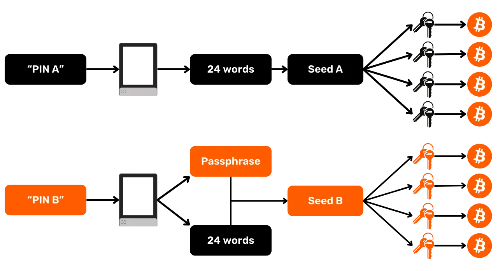
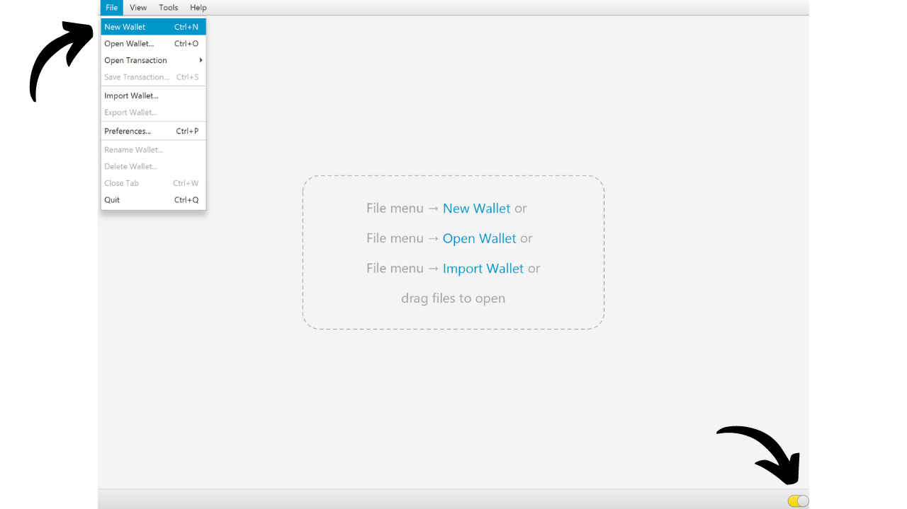

Passphrase BIP39 adalah kata sandi opsional yang, ketika digabungkan dengan frasa mnemonik Anda, memberikan lapisan keamanan tambahan untuk dompet Bitcoin deterministik dan hierarkis. Dalam tutorial ini, kita akan bersama-sama mengulas cara mengatur passphrase pada dompet Bitcoin aman Anda di Ledger (terlepas dari modelnya).

Sebelum memulai tutorial ini, jika Anda tidak familiar dengan konsep passphrase, bagaimana cara kerjanya, dan implikasinya terhadap dompet Bitcoin Anda, saya sangat merekomendasikan untuk berkonsultasi dengan artikel teoretis lain ini di mana saya menjelaskan semuanya:

https://planb.network/tutorials/wallet/passphrase

## Bagaimana fungsi passphrase pada Ledger?

Dengan perangkat Ledger, Anda memiliki dua opsi berbeda untuk mengonfigurasi passphrase pada dompet Anda: opsi "*PIN-tied*" dan opsi "*temporary*".

Dengan opsi "*PIN-tied*", Anda mengaitkan passphrase dengan PIN kedua pada Ledger Anda. Ini berarti Anda akan memiliki 2 PIN: satu untuk mengakses dompet reguler Anda tanpa passphrase, dan yang lainnya untuk mengakses dompet kedua Anda yang dilindungi oleh passphrase.

Pada dasarnya, bahkan dengan opsi passphrase ini yang terikat pada PIN kedua, passphrase Anda tetaplah passphrase Anda. Ini berarti jika Anda kehilangan Ledger Anda dan ingin memulihkan bitcoin Anda di perangkat atau perangkat lunak lain, Anda akan benar-benar membutuhkan frasa 24 kata dan **passphrase lengkap** Anda. PIN yang terkait dengan passphrase hanya digunakan untuk mengaksesnya di Ledger Anda saat ini, tetapi tidak berfungsi di Ledger lain atau perangkat lunak lain. Oleh karena itu, sangat penting untuk sepenuhnya mencadangkan passphrase Anda pada media fisik. **Mengetahui PIN sekunder saja tidak cukup untuk mendapatkan kembali akses ke dompet Anda**; ini hanya fitur kemudahan pada Ledger Anda.

Opsi PIN kedua ini sangat menarik untuk menghadapi serangan fisik. Misalnya, jika seorang penyerang memaksa Anda untuk membuka kunci perangkat Anda untuk mencuri dana Anda, Anda dapat menggunakan PIN pertama untuk mengakses dompet umpan yang berisi sejumlah kecil bitcoin, sementara menjaga dana utama Anda aman di balik PIN kedua.

Selain itu, opsi ini menawarkan semua manfaat keamanan dari passphrase BIP39 tanpa kendala harus memasukkannya secara manual setiap kali Anda menggunakan perangkat penandatanganan. Ini memungkinkan Anda untuk menggunakan passphrase panjang dan acak, sehingga memperkuat perlindungan terhadap serangan brute force, sambil menghindari kesulitan harus mengetiknya secara manual setiap kali pada tombol kecil perangkat.
Opsi "passphrase sementara" tidak menyimpan passphrase pada perangkat. Setiap kali Anda ingin mengakses dompet terlindungi Anda, Anda perlu memasukkan passphrase secara manual pada Ledger. Ini membuat penggunaan menjadi lebih merepotkan tetapi juga sedikit meningkatkan keamanan dengan tidak meninggalkan jejak passphrase pada perangkat. Segera setelah Anda mematikan perangkat, itu kembali ke keadaan default dan memerlukan entri baru dari passphrase lengkap untuk mengakses akun tersembunyi. Opsi "passphrase sementara" ini dengan demikian mirip dengan operasi dompet perangkat keras lainnya.
Dalam tutorial ini, saya akan menggunakan Ledger Flex sebagai contoh. Namun, jika Anda menggunakan model Ledger lain, prosesnya tetap sama. Untuk Ledger Stax, antarmukanya sama dengan Ledger Flex. Sedangkan untuk model Nano S, Nano S Plus, dan Nano X, meskipun antarmukanya berbeda, proses dan nama-nama menu tetap sama.
**Perhatian:** Jika Anda sudah menerima bitcoin di Ledger Anda sebelum mengaktifkan passphrase, Anda perlu mentransfernya melalui transaksi Bitcoin. Passphrase menghasilkan satu set kunci baru, sehingga menciptakan dompet yang sepenuhnya independen dari dompet awal Anda. Saat menambahkan passphrase, Anda akan memiliki dompet baru yang akan kosong. Namun, ini tidak menghapus dompet pertama Anda tanpa passphrase. Anda masih bisa mengaksesnya, baik langsung melalui Ledger Anda tanpa memasukkan passphrase atau melalui perangkat lunak lain menggunakan frasa 24 kata Anda.
Sebelum memulai tutorial ini, pastikan Anda sudah menginisialisasi Ledger Anda dan menghasilkan frasa mnemonik Anda. Jika ini tidak terjadi dan Ledger Anda baru, ikuti tutorial khusus untuk model Anda yang tersedia di PlanB Network. Setelah langkah ini selesai, Anda dapat kembali ke tutorial ini.

https://planb.network/tutorials/wallet/ledger-flex
https://planb.network/tutorials/wallet/ledger-nano-s-plus
https://planb.network/tutorials/wallet/ledger

## Bagaimana cara mengatur passphrase sementara dengan Ledger?

Di halaman utama Ledger Anda, klik pada roda gigi pengaturan.

Pilih menu "Advanced", kemudian "Set passphrase".

Ini adalah langkah di mana Anda dapat memilih antara opsi "linked to PIN" atau opsi "temporary" yang telah kita bahas di bagian sebelumnya. Di sini, saya akan menjelaskan cara mengatur passphrase sementara, jadi klik pada "Set temporary passphrase".

Anda kemudian diminta untuk memasukkan passphrase Anda. Pilih passphrase yang kuat dan segera lanjutkan ke cadangan fisik, pada media seperti kertas atau logam. Dalam contoh ini, saya memilih passphrase: `fH3&kL@9mP#2sD5qR!82`. Setelah memasukkan passphrase Anda, klik tombol "*Continue*".

Verifikasi bahwa passphrase Anda cocok dengan yang telah Anda catat pada cadangan fisik Anda, kemudian klik tombol "*Yes, it's correct*" untuk mengonfirmasi.

Untuk menyelesaikan pembuatan passphrase Anda, masukkan kode PIN Ledger Anda. Mulai sekarang, setiap kali Anda ingin mengakses dompet Anda dengan passphrase di Ledger, Anda perlu mengikuti langkah-langkah yang sama seperti yang dijelaskan di sini.

Anda sekarang dapat mengimpor set kunci publik Anda di Sparrow Wallet untuk mengelola dompet Anda. Di Sparrow, ini akan sesuai dengan dompet yang berbeda dari dompet awal Anda tanpa passphrase.

Buka Sparrow Wallet. Pastikan perangkat lunak terhubung ke node, kemudian klik pada tab "*File*" dan pilih "*New Wallet*".

Pilih nama untuk dompet Anda yang dilindungi oleh passphrase. Untuk contoh ini, saya memilih nama yang secara eksplisit menyertakan istilah "*passphrase*". Namun, jika Anda lebih suka menjaga kerahasiaan dompet ini di komputer Anda, Anda dapat memilih nama yang kurang sugestif.

Pilih jenis skrip untuk dompet Anda. Saya menyarankan Anda untuk memilih "*Taproot*" atau alternatifnya "*Native SegWit*".

Hubungkan Ledger Anda ke komputer, kemudian klik pada "*Connected Hardware Wallet*". Pastikan Anda sudah memasukkan passphrase pada Ledger Anda. Jika belum, silakan kembali ke langkah sebelumnya untuk memasukkan passphrase Anda. Sebelum melanjutkan ke pemindaian, ingat juga untuk membuka aplikasi "*Bitcoin*" pada Ledger Anda.

Klik pada tombol "*Scan...*".

Klik pada "*Import Keystore*" di sebelah Ledger Anda.

Dompet Anda yang dilindungi oleh passphrase sekarang telah dibuat di Sparrow. Untuk mengonfirmasi, klik pada tombol "*Apply*".

Pilihlah kata sandi yang kuat untuk mengamankan akses ke Sparrow Wallet. Kata sandi ini akan memastikan keamanan akses ke data dompet Anda di Sparrow, yang membantu melindungi kunci publik Anda, alamat, label, dan riwayat transaksi dari akses tidak sah.
Saya menyarankan Anda untuk menyimpan kata sandi ini di pengelola kata sandi agar Anda tidak lupa.

Dan sekarang, dompet Anda telah dibuat! Di menu "*Settings*", Sparrow akan memberikan Anda "*Master fingerprint*". Ini merupakan sidik jari dari kunci induk Anda, yang digunakan sebagai dasar untuk menurunkan dompet Anda. Saya sangat menyarankan untuk menyimpan salinan sidik jari ini. Dalam contoh saya, ini sesuai dengan: `281ee33a`.

Ingat apa yang kami sebutkan di bagian sebelumnya: kesalahan, meskipun kecil, dalam memasukkan passphrase Anda akan menghasilkan dompet baru yang sepenuhnya berbeda dengan kunci yang berbeda. Setiap kali Anda perlu memastikan Anda mengakses dompet yang tepat dengan passphrase yang benar, periksa bahwa sidik jari kunci induk Anda cocok dengan yang Anda catat. Informasi ini, dengan sendirinya, tidak menimbulkan risiko terhadap keamanan dana atau privasi Anda.

Sebelum menggunakan dompet Anda dengan passphrase, saya sangat menyarankan Anda untuk melakukan tes pemulihan dry-run. Catat informasi referensi seperti xpub Anda atau sidik jari kunci induk Anda, kemudian reset Ledger Anda sementara dompet masih kosong. Selanjutnya, coba pulihkan dompet Anda di Ledger menggunakan cadangan kertas dari frasa 24 kata dan passphrase. Periksa bahwa informasi yang dihasilkan setelah pemulihan cocok dengan yang Anda catat awalnya. Jika itu kasusnya, Anda dapat yakin bahwa cadangan kertas Anda dapat diandalkan.

## Bagaimana cara mengatur passphrase yang terkait dengan PIN pada Ledger?

Di halaman utama Ledger Anda, klik pada roda gigi pengaturan.

Pilih menu "*Advanced*", kemudian "*Set passphrase*".

Ini adalah langkah di mana Anda dapat memilih antara opsi "*linked to PIN*" atau "*temporary*" yang kami bahas di bagian sebelumnya. Di sini, saya akan menjelaskan cara mengatur passphrase yang terkait dengan PIN, jadi klik pada "*Set passphrase and attach it to a new PIN*".

Anda kemudian harus memilih kode PIN yang akan dikaitkan dengan passphrase Anda. Sama seperti dengan kode PIN utama, disarankan untuk memilih kode PIN 8 digit, sembarang mungkin. Juga, pastikan untuk menyimpan kode ini di lokasi yang berbeda dari tempat Ledger Flex Anda disimpan.
Dalam kasus saya, kode PIN utama adalah `58293647` dan saya memilih `71425839` sebagai kode PIN sekunder yang terkait dengan passphrase.

Anda kemudian diminta untuk memasukkan passphrase Anda. Pilih passphrase yang kuat dan segera lanjutkan ke cadangan fisik, pada media seperti kertas atau logam. Dalam contoh ini, saya memilih passphrase: `fH3&kL@9mP#2sD5qR!82`. Setelah memasukkan passphrase Anda, klik tombol "*Continue*".

Verifikasi bahwa passphrase Anda sesuai dengan yang telah Anda catat pada cadangan fisik, kemudian klik tombol "*Yes, it's correct*" untuk mengonfirmasi.

Untuk menyelesaikan pembuatan passphrase Anda, masukkan kode PIN utama Ledger Anda (bukan yang terkait dengan passphrase).

Mulai sekarang, setiap kali Anda ingin mengakses dompet Anda dengan passphrase di Ledger, Anda perlu memasukkan bukan kode PIN utama, melainkan kode PIN sekunder:
- Kode PIN utama (`58293647`) > dompet tanpa passphrase.
- Kode PIN sekunder (`71425839`) > dompet dengan passphrase.

Anda sekarang dapat mengimpor set kunci publik Anda di Sparrow Wallet untuk mengelola dompet Anda. Di Sparrow, ini akan sesuai dengan dompet yang berbeda dari dompet awal Anda tanpa passphrase.

Buka Sparrow Wallet. Pastikan perangkat lunak terhubung ke node, kemudian klik pada tab "*File*" dan pilih "*New Wallet*".

Pilih nama untuk dompet Anda yang dilindungi oleh passphrase. Untuk contoh ini, saya memilih nama yang secara eksplisit menyertakan istilah "*passphrase*". Namun, jika Anda lebih suka menjaga kerahasiaan dompet ini di komputer Anda, Anda dapat memilih nama yang kurang sugestif.

Pilih tipe skrip untuk dompet Anda. Saya menyarankan Anda untuk memilih "*Taproot*" atau, jika tidak tersedia, "*Native SegWit*".

Hubungkan Ledger Anda ke komputer, kemudian klik pada "*Connected Hardware Wallet*". Pastikan Anda sudah memiliki passphrase di Ledger Anda dengan membukanya menggunakan kode PIN sekunder. Jika tidak, restart Ledger Anda dan masukkan kode PIN yang terkait dengan passphrase. Sebelum melanjutkan ke pemindaian, ingat juga untuk membuka aplikasi "*Bitcoin*" di Ledger Anda.

Klik tombol "*Scan...*".

Klik pada "*Import Keystore*".

Dompet Anda yang dilindungi oleh passphrase sekarang telah dibuat di Sparrow. Untuk mengonfirmasi, klik tombol "*Apply*".

Pilih kata sandi yang kuat untuk mengamankan akses ke Sparrow Wallet. Kata sandi ini akan menjamin keamanan akses ke data dompet Anda di Sparrow, yang membantu melindungi kunci publik Anda, alamat, label, dan riwayat transaksi dari akses tidak sah.

Saya menyarankan Anda untuk menyimpan kata sandi ini di pengelola kata sandi agar Anda tidak lupa.

Dan sekarang, dompet Anda telah dibuat! Di menu "*Settings*", Sparrow akan memberikan Anda "*Master fingerprint*" Anda. Ini merupakan sidik jari dari kunci induk Anda, yang digunakan sebagai dasar dari turunan dompet Anda. Saya sangat merekomendasikan untuk menyimpan salinan sidik jari ini. Dalam contoh saya, ini sesuai dengan: `281ee33a`.

Ingat apa yang telah kami sebutkan di bagian sebelumnya: kesalahan, meskipun kecil, dalam memasukkan passphrase Anda akan menghasilkan dompet baru yang sepenuhnya berbeda dengan kunci yang berbeda. Setiap kali Anda perlu memastikan akses ke dompet yang benar dengan passphrase yang tepat, verifikasi bahwa sidik jari dari kunci induk Anda cocok dengan yang telah Anda catat. Informasi ini, dengan sendirinya, tidak menimbulkan risiko terhadap keamanan dana atau privasi Anda.
Sebelum menggunakan dompet Anda dengan passphrase, saya sangat menyarankan Anda untuk melakukan tes pemulihan tanpa risiko. Catat informasi referensi seperti xpub Anda atau sidik jari dari kunci induk Anda, kemudian reset Ledger Anda sementara dompet masih kosong. Selanjutnya, coba pulihkan dompet Anda di Ledger menggunakan cadangan kertas dari frasa 24 kata dan passphrase. Periksa bahwa informasi yang dihasilkan setelah pemulihan cocok dengan apa yang awalnya Anda catat. Jika ini kasusnya, Anda dapat yakin bahwa cadangan kertas Anda dapat diandalkan.

Selamat, dompet Bitcoin Anda sekarang diamankan dengan passphrase! Jika Anda merasa tutorial ini bermanfaat, saya akan sangat menghargai jika Anda bisa memberikan jempol ke atas di bawah ini. Jangan ragu untuk membagikan artikel ini di jaringan sosial Anda. Terima kasih banyak!

Saya juga merekomendasikan Anda untuk memeriksa tutorial lengkap lainnya tentang cara menggunakan Ledger Flex Anda:

https://planb.network/tutorials/wallet/ledger-flex