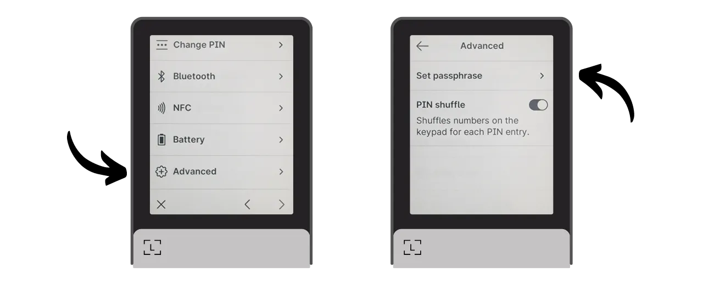

BIP39パスフレーズは、ニーモニックフレーズと組み合わせることで、決定論的かつ階層的なBitcoinウォレットに追加のセキュリティ層を提供するオプションのパスワードです。このチュートリアルでは、Ledger（モデルに関係なく）上のセキュアなBitcoinウォレットにパスフレーズを設定する方法を一緒に見ていきます。

このチュートリアルを始める前に、パスフレーズの概念、その仕組み、およびBitcoinウォレットに対するその意味について不慣れな場合は、すべてを説明するこの他の理論的な記事を参照することを強くお勧めします：

https://planb.network/tutorials/wallet/passphrase

## Ledgerでのパスフレーズ機能はどのように動作するのか？

Ledgerデバイスでは、ウォレットにパスフレーズを設定するための2つの異なるオプションがあります：「*PIN-tied*」オプションと「*temporary*」オプションです。

「*PIN-tied*」オプションでは、Ledgerの2番目のPINにパスフレーズを関連付けます。これは、パスフレーズなしで通常のウォレットにアクセスするための1つのPINと、パスフレーズで保護された2番目のウォレットにアクセスするための別のPINを持つことを意味します。

根本的に、このパスフレーズオプションが2番目のPINに結びついていても、あなたのパスフレーズはあなたのパスフレーズのままです。つまり、Ledgerを紛失した場合、別のデバイスやソフトウェアでビットコインを回復するためには、24語のフレーズと**完全なパスフレーズ**が絶対に必要です。パスフレーズに関連付けられたPINは、現在のLedgerでそれにアクセスするためにのみ使用されますが、他のLedgerや他のソフトウェアでは機能しません。したがって、物理的な媒体にパスフレーズを完全にバックアップすることが重要です。**副次的なPINを知っているだけでは、ウォレットへのアクセスを取り戻すには不十分です**。これは単にLedger上での利便性の機能に過ぎません。

この2番目のPINオプションは、物理的な攻撃に対処する場合に特に興味深いものです。例えば、攻撃者があなたのデバイスのロックを解除して資金を盗むよう強制した場合、少量のビットコインを含む囮のウォレットにアクセスするために最初のPINを使用することができ、主要な資金を2番目のPINの背後に安全に保持することができます。

さらに、このオプションは、サインデバイスを使用するたびに手動で入力する必要がないという制約なしに、BIP39パスフレーズのすべてのセキュリティ上の利点を提供します。これにより、長くランダムなパスフレーズを使用してブルートフォース攻撃に対する保護を強化することができ、デバイスの小さなボタンに毎回手動で入力する必要がある難しさを避けることができます。
「一時的なパスフレーズ」のオプションは、デバイスにパスフレーズを保存しません。保護されたウォレットにアクセスしたい場合は、毎回Ledgerにパスフレーズを手動で入力する必要があります。これにより使用がより煩雑になりますが、デバイスにパスフレーズの痕跡を残さないことでセキュリティをわずかに向上させます。デバイスをオフにすると、デフォルトの状態に戻り、隠されたアカウントにアクセスするためには完全なパスフレーズの新たな入力が必要になります。この「一時的なパスフレーズ」オプションは、他のハードウェアウォレットの動作と同様です。
このチュートリアルでは、例としてLedger Flexを使用します。しかし、他のLedgerモデルを使用している場合でも、プロセスは同じです。Ledger Staxについては、インターフェースはLedger Flexと同じです。Nano S、Nano S Plus、およびNano Xモデルについては、インターフェースが異なるものの、プロセスとメニューの名前は同じです。
**注意:** パスフレーズを有効にする前に既にLedgerにビットコインを受け取っている場合は、ビットコイントランザクションを介してそれらを転送する必要があります。パスフレーズは新しいキーセットを生成し、初期のウォレットとは完全に独立したウォレットを作成します。パスフレーズを追加すると、新しい空のウォレットができます。しかし、これはパスフレーズなしの最初のウォレットを削除するわけではありません。パスフレーズを入力せずにLedgerを直接使用するか、24語のフレーズを使用して別のソフトウェアを通じて、引き続きアクセスできます。
このチュートリアルを始める前に、既にLedgerを初期化し、ニーモニックフレーズを生成していることを確認してください。そうでない場合、またはLedgerが新しい場合は、PlanB Networkで利用可能なモデルに応じた特定のチュートリアルに従ってください。このステップが完了したら、このチュートリアルに戻ることができます。

https://planb.network/tutorials/wallet/ledger-flex
https://planb.network/tutorials/wallet/ledger-nano-s-plus
https://planb.network/tutorials/wallet/ledger

## Ledgerで一時的なパスフレーズを設定する方法は？

Ledgerのホームページで、設定の歯車アイコンをクリックします。

「Advanced」メニューを選択し、「Set passphrase」をクリックします。

ここで、「linked to PIN」オプションまたは前の部分で話した「temporary」オプションを選択できます。ここでは、一時的なパスフレーズの設定方法について説明しますので、「Set temporary passphrase」をクリックします。

次に、パスフレーズの入力を求められます。強力なパスフレーズを選び、直ちに紙や金属などの媒体に物理的なバックアップを行ってください。この例では、パスフレーズとして `fH3&kL@9mP#2sD5qR!82` を選びました。パスフレーズを入力したら、「*Continue*」ボタンをクリックします。

物理的なバックアップに記載されたパスフレーズと一致することを確認し、「*Yes, it's correct*」ボタンをクリックして確認します。

パスフレーズの作成を完了するために、LedgerのPINコードを入力します。これからは、Ledger上でパスフレーズを使用してウォレットにアクセスしたい場合は、ここで説明された手順を正確に実行する必要があります。

これで、公開キーセットをSparrow Walletにインポートして、ウォレットを管理できるようになりました。Sparrowでは、これはパスフレーズなしの初期ウォレットとは異なるウォレットに対応します。

Sparrow Walletを開きます。ソフトウェアがノードに接続されていることを確認し、「*File*」タブをクリックして「*New Wallet*」を選択します。

パスフレーズで保護されたウォレットに名前を選びます。この例では、「*passphrase*」という用語を明示的に含む名前を選びました。しかし、このウォレットをコンピュータ上で控えめに保ちたい場合は、それほど示唆に富む名前を選ばないこともできます。

ウォレットのスクリプトタイプを選択します。「*Taproot*」または代わりに「*Native SegWit*」を選択することをお勧めします。

Ledgerをコンピューターに接続し、「*Connected Hardware Wallet*」をクリックしてください。Ledgerにパスフレーズをすでに入力していることを確認してください。そうでない場合は、パスフレーズを入力するために前のステップに戻ってください。スキャンに進む前に、Ledger上で「*Bitcoin*」アプリケーションを開いていることも忘れずに確認してください。

「*Scan...*」ボタンをクリックします。

Ledgerの隣にある「*Import Keystore*」をクリックします。

パスフレーズで保護されたウォレットがSparrow上に作成されました。確認するには、「*Apply*」ボタンをクリックしてください。

Sparrow Walletへのアクセスを保護するために、強力なパスワードを選択してください。このパスワードは、公開鍵、アドレス、ラベル、およびトランザクション履歴への不正アクセスからウォレットデータのセキュリティを保護するのに役立ちます。
このパスワードをパスワードマネージャーに保存することをお勧めします。

これで、ウォレットの作成が完了しました！「*Settings*」メニューで、Sparrowはあなたの「*Master fingerprint*」を提供します。これは、ウォレットを導出するための基礎として使用されるマスターキーのフィンガープリントを表します。このフィンガープリントのコピーを保持することを強くお勧めします。私の例では、それは`281ee33a`に対応します。

前の部分で触れたように、パスフレーズの入力において、たとえ小さな間違いでも、異なるキーを持つ全く新しいウォレットが生成されることを覚えておいてください。正しいパスフレーズで正しいウォレットにアクセスしていることを確認するたびに、マスターキーのフィンガープリントがメモしたものと一致するかを確認してください。この情報自体は、資金のセキュリティやプライバシーにリスクをもたらすものではありません。

パスフレーズを使用してウォレットを使用する前に、ドライラン復旧テストを実施することを強くお勧めします。xpubやマスターキーのフィンガープリントのような参照情報をメモしてから、ウォレットがまだ空の状態でLedgerをリセットしてください。次に、24語のフレーズとパスフレーズの紙のバックアップを使用してLedger上でウォレットを復元しようとします。復元後に生成された情報が最初にメモしたものと一致するかを確認してください。その場合、紙のバックアップが信頼できることが確認できます。

## LedgerでPINにリンクされたパスフレーズを設定する方法は？

Ledgerのホームページで、設定の歯車ホイールをクリックします。

「*Advanced*」メニューを選択し、「*Set passphrase*」をクリックします。

ここでは、前の部分で話した「*linked to PIN*」または「*temporary*」オプションの間で選択できます。ここでは、PINに添付されたパスフレーズを設定する方法を説明しますので、「*Set passphrase and attach it to a new PIN*」をクリックします。

その後、パスフレーズに関連付けられるPINコードを選択する必要があります。メインのPINコードと同様に、できるだけランダムな8桁のPINコードを選択することをお勧めします。また、Ledger Flexが保管されている場所とは異なる場所にこのコードを保存してください。
私の場合、メインのPINコードは`58293647`で、パスフレーズに関連付けられたセカンダリPINコードとして`71425839`を選びました。

次に、パスフレーズの入力を求められます。強力なパスフレーズを選び、すぐに紙や金属などの媒体に物理的なバックアップを取ってください。この例では、パスフレーズとして`fH3&kL@9mP#2sD5qR!82`を選びました。パスフレーズを入力した後、"*Continue*"ボタンをクリックしてください。

物理的なバックアップに記載したパスフレーズと一致することを確認し、"*Yes, it's correct*"ボタンをクリックして確認してください。

パスフレーズの作成を完了するために、LedgerのメインPINコード（パスフレーズに関連付けられたものではない）を入力してください。

これからは、Ledger上でパスフレーズを使用してウォレットにアクセスしたい場合、メインPINコードではなく、セカンダリPINコードを入力する必要があります：
- メインPINコード（`58293647`）> パスフレーズなしのウォレット。
- セカンダリPINコード（`71425839`）> パスフレーズ付きのウォレット。

これで、Sparrow Walletに公開鍵のセットをインポートして、ウォレットを管理できるようになりました。Sparrowでは、これはパスフレーズなしの初期ウォレットとは異なるウォレットに対応します。

Sparrow Walletを開きます。ソフトウェアがノードに接続されていることを確認し、"*File*"タブをクリックして"*New Wallet*"を選択してください。

パスフレーズで保護されたウォレットに名前を選んでください。この例では、"*passphrase*"という用語を明示的に含む名前を選びました。しかし、このウォレットをコンピュータ上で控えめに保ちたい場合は、それほど示唆的ではない名前を選ぶこともできます。

ウォレットのスクリプトタイプを選択してください。"*Taproot*"または、それができない場合は"*Native SegWit*"を選ぶことをお勧めします。

Ledgerをコンピュータに接続し、"*Connected Hardware Wallet*"をクリックしてください。セカンダリPINコードでロックを解除してLedgerにパスフレーズが既にあることを確認してください。そうでない場合は、Ledgerを再起動し、パスフレーズに関連付けられたPINコードを入力してください。スキャンを進める前に、Ledger上で"*Bitcoin*"アプリケーションを開いていることも忘れずに。

"*Scan...*"ボタンをクリックしてください。

"*Import Keystore*"をクリックしてください。

これで、パスフレーズで保護されたウォレットがSparrow上に作成されました。確認するには、"*Apply*"ボタンをクリックしてください。

Sparrow Walletへのアクセスを保護するために強力なパスワードを選んでください。このパスワードは、公開鍵、アドレス、ラベル、取引履歴への不正アクセスから保護するために、Sparrow上のウォレットデータへのアクセスのセキュリティを確保します。

このパスワードを忘れないように、パスワードマネージャーに保存することをお勧めします。

これで、あなたのウォレットの作成が完了しました！"*設定*"メニューで、Sparrowはあなたの"*マスターフィンガープリント*"を提供します。これは、ウォレットの派生の基礎として使用されるマスターキーのフィンガープリントを表します。このフィンガープリントのコピーを保持することを強くお勧めします。私の例では、それは`281ee33a`に対応します。

前の部分で触れたことを覚えておいてください：パスフレーズの入力において、たとえ小さな間違いであっても、異なるキーを持つ全く新しいウォレットが生成されます。正しいパスフレーズで正しいウォレットにアクセスする必要があるたびに、マスターキーのフィンガープリントがメモしたものと一致するかを確認してください。この情報自体は、あなたの資金やプライバシーのセキュリティにリスクをもたらすものではありません。
パスフレーズを使用してウォレットを使用する前に、ドライラン回復テストを実施することを強くお勧めします。xpubやマスターキーのフィンガープリントなど、参照情報をメモしておき、ウォレットがまだ空の状態でLedgerをリセットします。次に、24語のフレーズとパスフレーズの紙のバックアップを使用してLedger上でウォレットを復元しようとします。復元後に生成された情報が最初にメモしたものと一致するかを確認します。この場合、紙のバックアップが信頼できることが確認できます。

おめでとうございます、あなたのBitcoinウォレットはパスフレーズで保護されています！このチュートリアルが役に立ったと思われる場合、以下でサムズアップをいただけると嬉しいです。この記事をあなたのソーシャルネットワークで共有してください。どうもありがとうございました！

また、Ledger Flexの使用方法に関するこの完全なチュートリアルもチェックすることをお勧めします：

https://planb.network/tutorials/wallet/ledger-flex