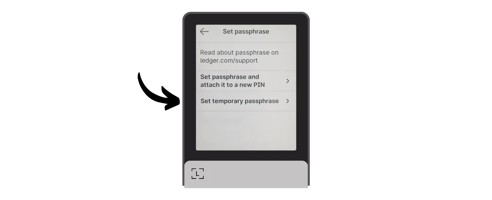

Парольная фраза BIP39 — это необязательный пароль, который, будучи использованным вместе с вашей мнемонической фразой, обеспечивает дополнительный уровень безопасности для детерминированных и иерархических биткойн-кошельков. В этом учебнике мы вместе рассмотрим, как настроить парольную фразу на вашем защищенном биткойн-кошельке на Ledger (независимо от модели).

Прежде чем начать этот учебник, если вы не знакомы с концепцией парольной фразы, как она работает и каковы ее последствия для вашего биткойн-кошелька, я настоятельно рекомендую проконсультироваться с этой другой теоретической статьей, где я все объясняю:

https://planb.network/tutorials/wallet/passphrase

## Как работает функция парольной фразы на Ledger?

С устройствами Ledger у вас есть два разных варианта для настройки парольной фразы на вашем кошельке: опция "*Привязанная к PIN*" и опция "*временная*".

С опцией "*Привязанная к PIN*", вы связываете парольную фразу со вторым PIN-кодом на вашем Ledger. Это означает, что у вас будет 2 PIN-кода: один для доступа к вашему обычному кошельку без парольной фразы и другой для доступа к вашему второму кошельку, защищенному парольной фразой.

В основе своей, даже с этой опцией парольной фразы, привязанной ко второму PIN-коду, ваша парольная фраза остается вашей парольной фразой. Это означает, что если вы потеряете свой Ledger и захотите восстановить свои биткойны на другом устройстве или программном обеспечении, вам абсолютно необходима ваша 24-словная фраза и ваша **полная парольная фраза**. PIN-код, связанный с парольной фразой, используется только для доступа к ней на вашем текущем Ledger, но он не работает на других Ledger или в другом программном обеспечении. Поэтому важно полностью сохранить вашу парольную фразу на физическом носителе. **Знание вторичного PIN-кода одного недостаточно для восстановления доступа к вашему кошельку**; это просто удобная функция на вашем Ledger.

Этот второй вариант PIN-кода особенно интересен для защиты от физических атак. Например, если нападающий заставит вас разблокировать ваше устройство, чтобы украсть ваши средства, вы можете использовать первый PIN-код для доступа к ложному кошельку, содержащему небольшое количество биткойнов, сохраняя при этом ваши основные средства в безопасности за вторым PIN-кодом.

Более того, этот вариант предлагает все преимущества безопасности парольной фразы BIP39 без необходимости вводить ее вручную каждый раз, когда вы используете ваше устройство для подписи. Это позволяет использовать длинную и случайную парольную фразу, тем самым усиливая защиту от атак методом подбора, избегая при этом сложности ее ручного ввода каждый раз на маленьких кнопках устройства.
Опция "временная парольная фраза" не сохраняет парольную фразу на устройстве. Каждый раз, когда вы хотите получить доступ к вашему защищенному кошельку, вам нужно будет вручную ввести парольную фразу на Ledger. Это делает использование более обременительным, но также немного повышает безопасность, не оставляя следов парольной фразы на устройстве. Как только вы выключаете устройство, оно возвращается к своему исходному состоянию и требует нового ввода полной парольной фразы для доступа к скрытым аккаунтам. Таким образом, опция "временная парольная фраза" аналогична работе других аппаратных кошельков.
В этом учебнике я буду использовать Ledger Flex в качестве примера. Однако, если вы используете другую модель Ledger, процесс остается тем же. Для Ledger Stax интерфейс такой же, как у Ledger Flex. Что касается моделей Nano S, Nano S Plus и Nano X, хотя интерфейс отличается, процесс и названия меню остаются теми же.
**Внимание:** Если вы уже получили биткойны на ваш Ledger до активации парольной фразы, вам нужно будет перевести их через биткойн-транзакцию. Парольная фраза генерирует набор новых ключей, создавая кошелек, который полностью независим от вашего первоначального кошелька. При добавлении парольной фразы у вас появится новый кошелек, который будет пустым. Однако это не удаляет ваш первый кошелек без парольной фразы. Вы все еще можете получить к нему доступ, либо напрямую через ваш Ledger, не вводя парольную фразу, либо через другое программное обеспечение, используя вашу 24-словную фразу.
Перед началом этого руководства убедитесь, что вы уже инициализировали ваш Ledger и сгенерировали вашу мнемоническую фразу. Если это не так и ваш Ledger новый, следуйте специальному руководству для вашей модели, доступному на PlanB Network. После завершения этого шага вы можете вернуться к этому руководству.

https://planb.network/tutorials/wallet/ledger-flex
https://planb.network/tutorials/wallet/ledger-nano-s-plus
https://planb.network/tutorials/wallet/ledger

## Как настроить временную парольную фразу с Ledger?

На главной странице вашего Ledger нажмите на колесико настроек.

Выберите меню "Advanced", затем "Set passphrase".

На этом этапе вы можете выбрать между опцией "linked to PIN" или "temporary", о которой мы говорили в предыдущей части. Здесь я объясню, как настроить временную парольную фразу, поэтому нажмите на "Set temporary passphrase".

Вам будет предложено ввести вашу парольную фразу. Выберите надежную парольную фразу и немедленно приступите к физическому резервному копированию на таком носителе, как бумага или металл. В этом примере я выбрал парольную фразу: `fH3&kL@9mP#2sD5qR!82`. После ввода вашей парольной фразы нажмите кнопку "*Continue*".

Убедитесь, что ваша парольная фраза совпадает с тем, что вы записали на вашем физическом носителе, затем нажмите кнопку "*Yes, it's correct*", чтобы подтвердить.

Для завершения создания вашей парольной фразы введите PIN-код вашего Ledger. С этого момента, когда вы захотите получить доступ к вашему кошельку с парольной фразой на Ledger, вам нужно будет следовать точно таким же шагам, как описано здесь.

Теперь вы можете импортировать ваш набор публичных ключей в Sparrow Wallet для управления вашим кошельком. В Sparrow это будет соответствовать другому кошельку, отличному от вашего первоначального кошелька без парольной фразы.

Откройте Sparrow Wallet. Убедитесь, что программное обеспечение подключено к узлу, затем нажмите на вкладку "*File*" и выберите "*New Wallet*".

Выберите имя для вашего кошелька, защищенного парольной фразой. Для этого примера я выбрал имя, явно включающее термин "*passphrase*". Однако, если вы предпочитаете сохранить дискретность этого кошелька на вашем компьютере, вы можете выбрать менее наглядное имя.

Выберите тип скрипта для вашего кошелька. Я советую выбрать "*Taproot*" или, в качестве альтернативы, "*Native SegWit*".

Подключите ваш Ledger к компьютеру, затем нажмите на "*Connected Hardware Wallet*". Убедитесь, что вы уже ввели вашу парольную фразу на вашем Ledger. Если нет, пожалуйста, вернитесь к предыдущим шагам, чтобы ввести вашу парольную фразу. Прежде чем переходить к сканированию, также не забудьте открыть приложение "*Bitcoin*" на вашем Ledger.

Нажмите на кнопку "*Scan...*".

Нажмите на "*Import Keystore*" рядом с вашим Ledger.

Ваш кошелек, защищенный парольной фразой, теперь создан в Sparrow. Для подтверждения нажмите на кнопку "*Apply*".

Выберите надежный пароль для защиты доступа к Sparrow Wallet. Этот пароль обеспечит безопасность доступа к данным вашего кошелька в Sparrow, что поможет защитить ваши публичные ключи, адреса, метки и историю транзакций от любого несанкционированного доступа.
Я советую вам сохранить этот пароль в менеджере паролей, чтобы вы его не забыли.

И вот, ваш кошелек теперь создан! В меню "*Settings*", Sparrow предоставит вам ваш "*Master fingerprint*". Это отпечаток вашего мастер-ключа, используемый в качестве основы для производства вашего кошелька. Я настоятельно рекомендую сохранить копию этого отпечатка. В моем примере он соответствует: `281ee33a`.

Помните, что мы упоминали в предыдущих частях: ошибка, даже незначительная, при вводе вашей парольной фразы создаст совершенно новый кошелек с другими ключами. Каждый раз, когда вам нужно убедиться, что вы получаете доступ к правильному кошельку с правильной парольной фразой, проверяйте, соответствует ли отпечаток вашего мастер-ключа тому, который вы записали. Эта информация сама по себе не представляет риска для безопасности ваших средств или вашей конфиденциальности.

Прежде чем использовать ваш кошелек с парольной фразой, я настоятельно советую вам выполнить тестовое восстановление без риска. Запишите справочную информацию, например, ваш xpub или отпечаток вашего мастер-ключа, затем сбросьте ваш Ledger, пока кошелек еще пуст. Затем попробуйте восстановить ваш кошелек на Ledger, используя ваши бумажные резервные копии 24-словной фразы и парольной фразы. Проверьте, соответствует ли информация, полученная после восстановления, тому, что вы изначально записали. Если это так, вы можете быть уверены, что ваши бумажные резервные копии надежны.

## Как настроить парольную фразу, связанную с PIN-кодом, на Ledger?

На главной странице вашего Ledger нажмите на шестеренку настроек.

Выберите меню "*Advanced*", затем "*Set passphrase*".

Это шаг, на котором вы можете выбрать между опцией "*linked to PIN*" или "*temporary*", о которой мы говорили в предыдущей части. Здесь я объясню, как настроить парольную фразу, прикрепленную к новому PIN-коду, поэтому нажмите на "*Set passphrase and attach it to a new PIN*".

Вам нужно будет выбрать PIN-код, который будет ассоциирован с вашей парольной фразой. Как и в случае с основным PIN-кодом, рекомендуется выбирать 8-значный PIN-код, настолько случайный, насколько это возможно. Также убедитесь, что вы сохраните этот код в другом месте, отличном от места хранения вашего Ledger Flex.
В моем случае основной PIN-код `58293647`, и я выбрал `71425839` в качестве вторичного PIN-кода, связанного с парольной фразой.

Затем вас попросят ввести вашу парольную фразу. Выберите надежную парольную фразу и немедленно приступите к созданию физической копии на носителе, таком как бумага или металл. В этом примере я выбрал парольную фразу: `fH3&kL@9mP#2sD5qR!82`. После ввода вашей парольной фразы нажмите на кнопку "*Продолжить*".

Убедитесь, что ваша парольная фраза совпадает с тем, что вы записали на вашем физическом носителе, затем нажмите на кнопку "*Да, все верно*", чтобы подтвердить.

Чтобы завершить создание вашей парольной фразы, введите основной PIN-код вашего Ledger (не тот, который связан с парольной фразой).

С этого момента, когда вы захотите получить доступ к вашему кошельку с парольной фразой на Ledger, вам нужно будет ввести не основной PIN-код, а вторичный PIN-код:
- Основной PIN-код (`58293647`) > кошелек без парольной фразы.
- Вторичный PIN-код (`71425839`) > кошелек с парольной фразой.

Теперь вы можете импортировать ваш набор публичных ключей в Sparrow Wallet для управления вашим кошельком. В Sparrow это будет соответствовать другому кошельку, отличному от вашего первоначального кошелька без парольной фразы.

Откройте Sparrow Wallet. Убедитесь, что программное обеспечение подключено к узлу, затем нажмите на вкладку "*Файл*" и выберите "*Новый кошелек*".

Выберите имя для вашего кошелька, защищенного парольной фразой. Для этого примера я выбрал имя, явно включающее термин "*парольная фраза*". Однако, если вы предпочитаете сохранить дискретность этого кошелька на вашем компьютере, вы можете выбрать менее наглядное имя.

Выберите тип скрипта для вашего кошелька. Я советую выбрать "*Taproot*" или, в крайнем случае, "*Native SegWit*".

Подключите ваш Ledger к компьютеру, затем нажмите на "*Подключенный аппаратный кошелек*". Убедитесь, что ваша парольная фраза уже есть на вашем Ledger, разблокировав его с помощью вторичного PIN-кода. Если нет, перезапустите ваш Ledger и введите PIN-код, связанный с парольной фразой. Прежде чем приступить к сканированию, также не забудьте открыть приложение "*Bitcoin*" на вашем Ledger.

Нажмите на кнопку "*Сканировать...*".

Нажмите на "*Импортировать хранилище ключей*".

Теперь ваш кошелек, защищенный парольной фразой, создан в Sparrow. Для подтверждения нажмите на кнопку "*Применить*".

Выберите надежный пароль для доступа к Sparrow Wallet. Этот пароль обеспечит безопасность доступа к данным вашего кошелька в Sparrow, что поможет защитить ваши публичные ключи, адреса, метки и историю транзакций от любого несанкционированного доступа.

Я советую сохранить этот пароль в менеджере паролей, чтобы вы не забыли его.

И вот, ваш кошелек теперь создан! В меню "*Настройки*", Sparrow предоставит вам ваш "*Основной отпечаток*". Это отпечаток вашего мастер-ключа, используемого в основе производного пути вашего кошелька. Я настоятельно рекомендую сохранить копию этого отпечатка. В моем примере он соответствует: `281ee33a`.

Помните, что мы упоминали в предыдущих частях: ошибка, даже незначительная, при вводе вашей парольной фразы создаст совершенно новый кошелек с другими ключами. Каждый раз, когда вам нужно будет обеспечить доступ к правильному кошельку с правильной парольной фразой, проверяйте, соответствует ли отпечаток вашего мастер-ключа тому, который вы записали. Эта информация сама по себе не представляет риска для безопасности ваших средств или вашей конфиденциальности.
Перед использованием вашего кошелька с парольной фразой, я настоятельно советую вам провести тестовое восстановление. Запишите справочную информацию, такую как ваш xpub или отпечаток вашего мастер-ключа, затем сбросьте ваш Ledger, пока кошелек еще пуст. Затем попробуйте восстановить ваш кошелек на Ledger, используя ваши бумажные резервные копии 24-словной фразы и парольной фразы. Проверьте, соответствует ли информация, полученная после восстановления, тому, что вы изначально записали. Если это так, вы можете быть уверены, что ваши бумажные резервные копии надежны.

Поздравляем, ваш Bitcoin кошелек теперь защищен парольной фразой! Если вы нашли этот учебник полезным, я был бы признателен, если бы вы могли оставить лайк ниже. Не стесняйтесь делиться этой статьей в своих социальных сетях. Большое спасибо!

Я также рекомендую вам ознакомиться с этим другим полным учебником о том, как использовать ваш Ledger Flex:

https://planb.network/tutorials/wallet/ledger-flex