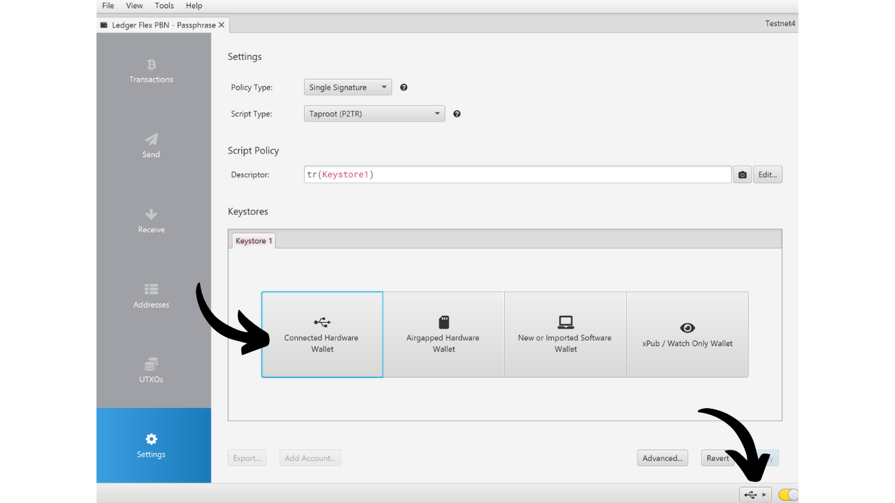
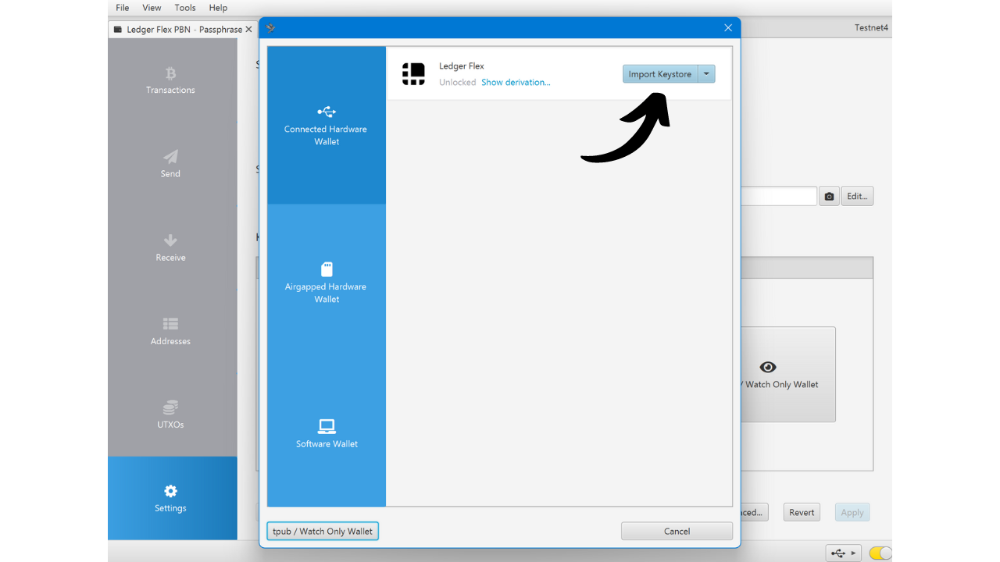

Mật khẩu BIP39 là một mật khẩu tùy chọn, khi kết hợp với cụm từ ghi nhớ của bạn, cung cấp một lớp bảo mật bổ sung cho ví Bitcoin xác định và phân cấp. Trong hướng dẫn này, chúng ta sẽ cùng nhau xem xét cách thiết lập một mật khẩu trên ví Bitcoin an toàn của bạn trên Ledger (bất kể mô hình).

Trước khi bắt đầu hướng dẫn này, nếu bạn không quen với khái niệm về mật khẩu, cách hoạt động và những hậu quả của nó đối với ví Bitcoin của bạn, tôi rất khuyên bạn nên tham khảo bài viết lý thuyết khác này nơi tôi giải thích mọi thứ:

https://planb.network/tutorials/wallet/passphrase

## Mật khẩu hoạt động như thế nào trên Ledger?

Với thiết bị Ledger, bạn có hai lựa chọn khác nhau để cấu hình một mật khẩu trên ví của mình: lựa chọn "*PIN-tied*" và lựa chọn "*tạm thời*".

Với lựa chọn "*PIN-tied*", bạn liên kết một mật khẩu với một PIN thứ hai trên Ledger của mình. Điều này có nghĩa là bạn sẽ có 2 PIN: một để truy cập ví thông thường của bạn không có mật khẩu, và cái khác để truy cập ví thứ hai được bảo vệ bởi mật khẩu.

Cơ bản, ngay cả với lựa chọn mật khẩu này liên kết với PIN thứ hai, mật khẩu của bạn vẫn là mật khẩu của bạn. Điều này có nghĩa là nếu bạn mất Ledger và muốn khôi phục bitcoin của mình trên một thiết bị hoặc phần mềm khác, bạn sẽ cần cụm từ 24 từ của mình và **mật khẩu đầy đủ** của bạn. PIN liên kết với mật khẩu chỉ được sử dụng để truy cập nó trên Ledger hiện tại của bạn, nhưng nó không hoạt động trên các Ledger khác hoặc phần mềm khác. Do đó, việc sao lưu đầy đủ mật khẩu của bạn trên một phương tiện vật lý là rất quan trọng. **Biết mỗi PIN thứ hai không đủ để lấy lại quyền truy cập vào ví của bạn**; nó chỉ là một tính năng tiện lợi trên Ledger của bạn.

Lựa chọn PIN thứ hai này đặc biệt thú vị để đối phó với các cuộc tấn công vật lý. Ví dụ, nếu một kẻ tấn công buộc bạn mở khóa thiết bị để ăn cắp tiền của bạn, bạn có thể sử dụng PIN đầu tiên để truy cập vào một ví giả mạo chứa một lượng nhỏ bitcoin, trong khi giữ an toàn cho quỹ chính của mình sau PIN thứ hai.

Hơn nữa, lựa chọn này mang lại tất cả các lợi ích bảo mật của mật khẩu BIP39 mà không phải chịu ràng buộc phải nhập nó thủ công mỗi lần bạn sử dụng thiết bị ký. Điều này cho phép bạn sử dụng một mật khẩu dài và ngẫu nhiên, do đó tăng cường bảo vệ chống lại các cuộc tấn công bằng cách sử dụng lực lượng brút, trong khi tránh khó khăn phải nhập nó thủ công mỗi lần trên các nút nhỏ của thiết bị.
Lựa chọn "mật khẩu tạm thời" không lưu trữ mật khẩu trên thiết bị. Mỗi lần bạn muốn truy cập vào ví được bảo vệ của mình, bạn sẽ cần phải nhập mật khẩu thủ công trên Ledger. Điều này làm cho việc sử dụng trở nên cồng kềnh hơn nhưng cũng tăng cường bảo mật một chút bằng cách không để lại dấu vết của mật khẩu trên thiết bị. Ngay khi bạn tắt thiết bị, nó trở về trạng thái mặc định và yêu cầu nhập lại mật khẩu đầy đủ để truy cập vào các tài khoản ẩn. Lựa chọn "mật khẩu tạm thời" do đó tương tự như hoạt động của các ví cứng khác.
Trong hướng dẫn này, tôi sẽ sử dụng Ledger Flex làm ví dụ. Tuy nhiên, nếu bạn đang sử dụng một mô hình Ledger khác, quy trình vẫn giống nhau. Đối với Ledger Stax, giao diện giống như của Ledger Flex. Còn đối với các mô hình Nano S, Nano S Plus và Nano X, mặc dù giao diện khác nhau, quy trình và tên của các menu vẫn giống nhau.
**Chú ý:** Nếu bạn đã nhận được bitcoin vào ví Ledger của mình trước khi kích hoạt cụm từ bí mật, bạn sẽ cần chuyển chúng qua một giao dịch Bitcoin. Cụm từ bí mật tạo ra một bộ khóa mới, từ đó tạo ra một ví hoàn toàn độc lập với ví ban đầu của bạn. Khi thêm cụm từ bí mật, bạn sẽ có một ví mới sẽ trống không. Tuy nhiên, điều này không xóa ví đầu tiên của bạn không có cụm từ bí mật. Bạn vẫn có thể truy cập nó, hoặc trực tiếp qua Ledger của mình mà không cần nhập cụm từ bí mật hoặc thông qua phần mềm khác sử dụng cụm từ 24 từ của bạn.
Trước khi bắt đầu hướng dẫn này, hãy chắc chắn bạn đã khởi tạo Ledger của mình và tạo ra cụm từ ghi nhớ của bạn. Nếu điều này chưa được thực hiện và Ledger của bạn là mới, hãy theo dõi hướng dẫn cụ thể cho mẫu của bạn có sẵn trên PlanB Network. Một khi bước này hoàn thành, bạn có thể quay lại hướng dẫn này.

https://planb.network/tutorials/wallet/ledger-flex
https://planb.network/tutorials/wallet/ledger-nano-s-plus
https://planb.network/tutorials/wallet/ledger

## Làm thế nào để thiết lập cụm từ bí mật tạm thời với Ledger?

Trên trang chủ của Ledger, nhấp vào bánh răng cài đặt.

Chọn menu "Nâng cao", sau đó "Thiết lập cụm từ bí mật".

Đây là bước bạn có thể chọn giữa tùy chọn "liên kết với PIN" hoặc tùy chọn "tạm thời" mà chúng tôi đã nói về trong phần trước. Tại đây, tôi sẽ giải thích cách thiết lập cụm từ bí mật tạm thời, vì vậy nhấp vào "Thiết lập cụm từ bí mật tạm thời".

Sau đó, bạn sẽ được yêu cầu nhập cụm từ bí mật của mình. Chọn một cụm từ bí mật mạnh và ngay lập tức tiến hành sao lưu vật lý, trên một phương tiện như giấy hoặc kim loại. Trong ví dụ này, tôi chọn cụm từ bí mật: `fH3&kL@9mP#2sD5qR!82`. Sau khi nhập cụm từ bí mật của bạn, nhấp vào nút "*Tiếp tục*".

Xác minh rằng cụm từ bí mật của bạn trùng khớp với những gì bạn đã ghi chú trên bản sao lưu vật lý của mình, sau đó nhấp vào nút "*Vâng, nó đúng*" để xác nhận.

Để hoàn tất việc tạo cụm từ bí mật của bạn, nhập mã PIN của Ledger. Từ bây giờ, bất cứ khi nào bạn muốn truy cập ví của mình với cụm từ bí mật trên Ledger, bạn sẽ cần phải thực hiện chính xác các bước như đã mô tả ở đây.

Bây giờ bạn có thể nhập bộ khóa công khai của mình trên Sparrow Wallet để quản lý ví của mình. Trên Sparrow, điều này sẽ tương ứng với một ví khác biệt so với ví ban đầu của bạn không có cụm từ bí mật.

Mở Sparrow Wallet. Đảm bảo phần mềm được kết nối với một nút, sau đó nhấp vào tab "*File*" và chọn "*Ví Mới*".

Chọn một tên cho ví của bạn được bảo vệ bởi cụm từ bí mật. Đối với ví dụ này, tôi đã chọn một tên bao gồm rõ ràng thuật ngữ "*cụm từ bí mật*". Tuy nhiên, nếu bạn muốn giữ kín ví này trên máy tính của mình, bạn có thể chọn một tên ít gợi ý hơn.

Chọn loại kịch bản cho ví của bạn. Tôi khuyên bạn nên chọn "*Taproot*" hoặc lựa chọn thay thế là "*Native SegWit*".

Kết nối Ledger của bạn với máy tính, sau đó nhấp vào "*Connected Hardware Wallet*". Đảm bảo bạn đã nhập passphrase trên Ledger của mình. Nếu chưa, vui lòng quay lại các bước trước để nhập passphrase. Trước khi tiến hành quét, cũng nhớ mở ứng dụng "*Bitcoin*" trên Ledger của bạn.

Nhấp vào nút "*Scan...*".

Nhấp vào "*Import Keystore*" bên cạnh Ledger của bạn.

Ví của bạn được bảo vệ bởi passphrase giờ đây đã được tạo trên Sparrow. Để xác nhận, nhấp vào nút "*Apply*".

Chọn một mật khẩu mạnh để bảo vệ quyền truy cập vào Sparrow Wallet. Mật khẩu này sẽ đảm bảo an ninh truy cập vào dữ liệu ví của bạn trên Sparrow, giúp bảo vệ khóa công khai, địa chỉ, nhãn và lịch sử giao dịch khỏi bất kỳ sự truy cập trái phép nào.
Tôi khuyên bạn nên lưu mật khẩu này trong một trình quản lý mật khẩu để bạn không quên nó.

Và đó là, ví của bạn giờ đây đã được tạo! Trong menu "*Settings*", Sparrow sẽ cung cấp cho bạn "*Master fingerprint*" của mình. Điều này đại diện cho dấu vân tay của khóa chính của bạn, được sử dụng làm cơ sở để phát sinh ví của bạn. Tôi rất khuyên bạn nên giữ một bản sao của dấu vân tay này. Trong ví dụ của tôi, nó tương ứng với: `281ee33a`.

Nhớ những gì chúng tôi đã đề cập trong các phần trước: một sai lầm, dù nhỏ, trong việc nhập passphrase sẽ tạo ra một ví hoàn toàn mới với các khóa khác nhau. Mỗi khi bạn cần đảm bảo mình đang truy cập đúng ví với passphrase chính xác, kiểm tra xem dấu vân tay của khóa chính có khớp với cái bạn đã ghi chép lại không. Thông tin này, bằng chính nó, không gây rủi ro cho an ninh của quỹ hoặc quyền riêng tư của bạn.

Trước khi sử dụng ví của bạn với passphrase, tôi rất khuyên bạn nên thực hiện một bài kiểm tra khôi phục khô. Ghi chép lại một thông tin tham chiếu như xpub của bạn hoặc dấu vân tay của khóa chính, sau đó đặt lại Ledger của bạn trong khi ví vẫn trống. Tiếp theo, thử khôi phục ví của bạn trên Ledger sử dụng bản sao giấy của cụm từ 24 từ và passphrase. Kiểm tra xem thông tin được tạo sau khi khôi phục có khớp với những gì bạn ban đầu ghi chép lại không. Nếu đúng như vậy, bạn có thể yên tâm rằng bản sao giấy của bạn là đáng tin cậy.

## Làm thế nào để thiết lập một passphrase liên kết với một PIN với Ledger?

Trên trang chủ của Ledger, nhấp vào bánh răng cài đặt.

Chọn menu "*Advanced*", sau đó "*Set passphrase*".

Đây là bước bạn có thể chọn giữa tùy chọn "*linked to PIN*" hoặc "*temporary*" mà chúng tôi đã nói về trong phần trước. Tại đây, tôi sẽ giải thích cách thiết lập một passphrase gắn với một PIN mới, vì vậy nhấp vào "*Set passphrase and attach it to a new PIN*".

Bạn phải chọn mã PIN sẽ được liên kết với passphrase của mình. Giống như với mã PIN chính, được khuyến nghị chọn một mã PIN 8 chữ số, càng ngẫu nhiên càng tốt. Ngoài ra, hãy chắc chắn lưu mã này ở một vị trí khác từ nơi bạn lưu trữ Ledger Flex của mình.
Trong trường hợp của tôi, mã PIN chính là `58293647` và tôi đã chọn `71425839` làm mã PIN phụ liên kết với cụm từ bí mật.

Sau đó, bạn sẽ được yêu cầu nhập cụm từ bí mật của mình. Hãy chọn một cụm từ bí mật mạnh và ngay lập tức tiến hành sao lưu vật lý, trên một phương tiện như giấy hoặc kim loại. Trong ví dụ này, tôi đã chọn cụm từ bí mật: `fH3&kL@9mP#2sD5qR!82`. Sau khi nhập cụm từ bí mật, nhấn vào nút "*Tiếp tục*".

Xác minh rằng cụm từ bí mật của bạn trùng khớp với những gì bạn đã ghi chú trên bản sao lưu vật lý, sau đó nhấn vào nút "*Vâng, nó đúng*" để xác nhận.

Để hoàn tất việc tạo cụm từ bí mật, nhập mã PIN chính của Ledger của bạn (không phải mã PIN liên kết với cụm từ bí mật).

Từ giờ trở đi, bất cứ khi nào bạn muốn truy cập vào ví của mình với cụm từ bí mật trên Ledger, bạn sẽ cần nhập không phải mã PIN chính, mà là mã PIN phụ:
- Mã PIN chính (`58293647`) > ví không có cụm từ bí mật.
- Mã PIN phụ (`71425839`) > ví có cụm từ bí mật.

Bây giờ bạn có thể nhập bộ khóa công khai của mình vào Sparrow Wallet để quản lý ví của mình. Trên Sparrow, điều này sẽ tương ứng với một ví khác biệt so với ví ban đầu của bạn không có cụm từ bí mật.

Mở Sparrow Wallet. Đảm bảo phần mềm được kết nối với một nút, sau đó nhấn vào tab "*File*" và chọn "*Ví Mới*".

Chọn một tên cho ví của bạn được bảo vệ bởi cụm từ bí mật. Đối với ví dụ này, tôi đã chọn một tên bao gồm rõ ràng thuật ngữ "*cụm từ bí mật*". Tuy nhiên, nếu bạn muốn giữ kín ví này trên máy tính của mình, bạn có thể chọn một tên ít gợi nhớ hơn.

Chọn loại kịch bản cho ví của bạn. Tôi khuyên bạn nên chọn "*Taproot*" hoặc nếu không được, chọn "*Native SegWit*".

Kết nối Ledger của bạn với máy tính, sau đó nhấn vào "*Connected Hardware Wallet*". Đảm bảo bạn đã có cụm từ bí mật trên Ledger của mình bằng cách mở khóa nó với mã PIN phụ. Nếu không, khởi động lại Ledger và nhập mã PIN liên kết với cụm từ bí mật. Trước khi tiến hành quét, cũng nhớ mở ứng dụng "*Bitcoin*" trên Ledger của bạn.

Nhấn vào nút "*Quét...*".

Nhấn vào "*Nhập Keystore*".

Ví của bạn được bảo vệ bởi cụm từ bí mật giờ đây đã được tạo trên Sparrow. Để xác nhận, nhấn vào nút "*Áp dụng*".

Chọn một mật khẩu mạnh để bảo vệ quyền truy cập vào Sparrow Wallet. Mật khẩu này sẽ đảm bảo an ninh truy cập vào dữ liệu ví của bạn trên Sparrow, giúp bảo vệ khóa công khai, địa chỉ, nhãn và lịch sử giao dịch của bạn khỏi bất kỳ sự truy cập trái phép nào.

Tôi khuyên bạn nên lưu mật khẩu này trong một trình quản lý mật khẩu để bạn không quên nó.
Và đó là, ví của bạn đã được tạo! Trong menu "*Cài đặt*", Sparrow sẽ cung cấp cho bạn "*Dấu vân tay chính*" của mình. Điều này đại diện cho dấu vân tay của khóa chính của bạn, được sử dụng ở cơ sở của sự phát triển ví của bạn. Tôi rất khuyến khích bạn giữ một bản sao của dấu vân tay này. Trong ví dụ của tôi, nó tương ứng với: `281ee33a`.

Nhớ những gì chúng tôi đã đề cập trong các phần trước: một sai lầm, dù nhỏ, trong việc nhập cụm từ bí mật của bạn sẽ tạo ra một ví hoàn toàn mới với các khóa khác nhau. Mỗi khi bạn cần đảm bảo quyền truy cập vào ví đúng với cụm từ bí mật đúng, hãy xác minh rằng dấu vân tay của khóa chính của bạn khớp với cái bạn đã ghi chú. Thông tin này, bởi chính nó, không gây rủi ro cho an toàn của quỹ của bạn hay quyền riêng tư của bạn.

Trước khi sử dụng ví của bạn với một cụm từ bí mật, tôi rất khuyến khích bạn thực hiện một bài kiểm tra khôi phục khô. Ghi chú một thông tin tham chiếu như xpub của bạn hoặc dấu vân tay của khóa chính của bạn, sau đó đặt lại Ledger của bạn trong khi ví vẫn trống. Tiếp theo, hãy thử khôi phục ví của bạn trên Ledger sử dụng bản sao giấy của cụm từ 24 từ và cụm từ bí mật. Kiểm tra xem thông tin được tạo ra sau khi khôi phục có khớp với những gì bạn ban đầu ghi chú không. Nếu đúng như vậy, bạn có thể yên tâm rằng bản sao giấy của bạn là đáng tin cậy.

Xin chúc mừng, ví Bitcoin của bạn giờ đây đã được bảo vệ bằng một cụm từ bí mật! Nếu bạn thấy hướng dẫn này hữu ích, tôi sẽ rất biết ơn nếu bạn có thể để lại một lượt thích bên dưới. Đừng ngần ngại chia sẻ bài viết này trên các mạng xã hội của bạn. Cảm ơn bạn rất nhiều!

Tôi cũng khuyên bạn nên xem qua hướng dẫn hoàn chỉnh khác này về cách sử dụng Ledger Flex của bạn:

https://planb.network/tutorials/wallet/ledger-flex