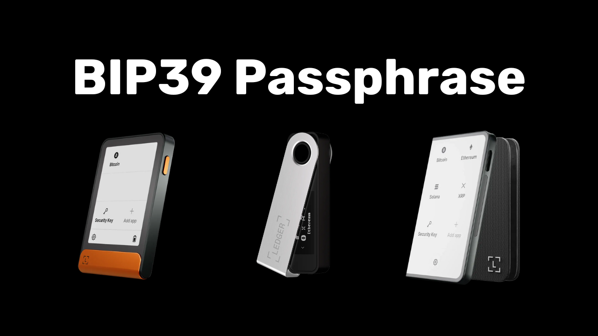

BIP39 Passphrase（密语）是一个可选密码，它与您的助记词结合使用，可为确定性分层比特币钱包提供额外的安全保障。在本教程中，我们将一起学习如何在 Ledger 钱包（无论型号如何）上设置安全的比特币钱包密语。

开始本教程之前，如果您还不熟悉密语的概念、工作原理及其对比特币钱包的影响，我强烈建议您先阅读这篇理论文章，其中详细解释了所有内容：

https://planb.academy/tutorials/wallet/backup/passphrase-a26a0220-806c-44b4-af14-bafdeb1adce7

## Ledger 上的密语功能如何运作？

使用 Ledger 设备，您可以通过两种不同的方式在钱包中配置密语：“PIN-tied”（与 PIN 码绑定）选项和 “temporary”（临时）选项。

使用 "*PIN-tied*" 选项时，您需要将密语与 Ledger 设备上的第二个 PIN 码关联起来。这意味着您将拥有两个 PIN 码：一个用于访问您无需密语的常规钱包，另一个用于访问受密语保护的第二个钱包。

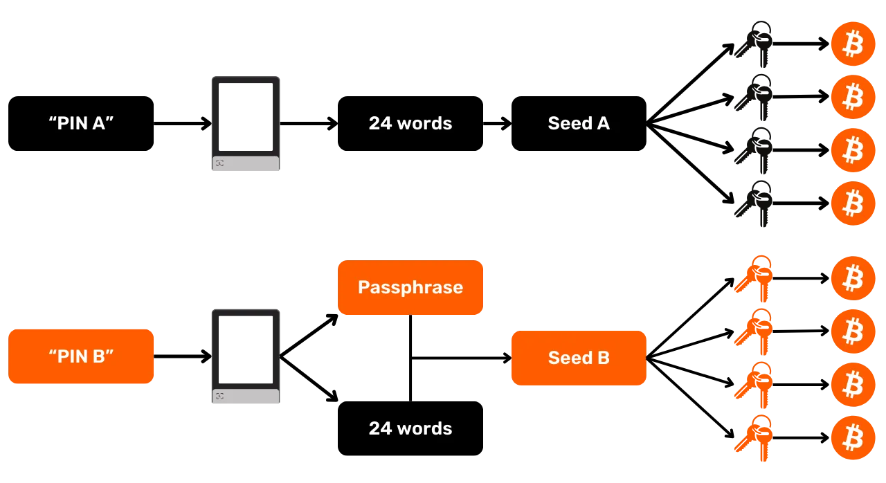

从根本上讲，即使将此密语选项与第二个 PIN 码关联，您的密语仍然是您的密语。这意味着，如果您丢失了 Ledger 设备，并希望在其他设备或软件上恢复您的比特币，您绝对需要您的 24 个单词的助记词和**完整的密语**。与密语关联的 PIN 码仅用于在您当前的 Ledger 设备上访问该设备，但它不能用于其他 Ledger 设备或其他软件。因此，将您的密语完整备份到物理介质上至关重要。**仅知道第二个 PIN 码不足以重新访问您的钱包**；它只是 Ledger 设备上的一项便捷功能。

此第二个 PIN 码选项在应对物理攻击方面尤其有用。例如，如果攻击者强迫您解锁设备以窃取资金，您可以使用第一个 PIN 码访问一个包含少量比特币的诱饵钱包，同时使用第二个 PIN 码保护您的主要资金安全。

此外，此选项提供 BIP39 密语的所有安全优势，而无需每次使用签名设备时都手动输入。这使您可以使用较长且随机的密语，从而增强对暴力破解攻击的防护，同时避免每次在设备的小按钮上手动输入密语的麻烦。

“临时密语” 的选项不会将密语存储在设备上。每次访问受保护的钱包时，您都需要在 Ledger 设备上手动输入密语。虽然这使得使用起来更加繁琐，但由于设备上不会留下任何密语痕迹，因此安全性也略有提高。设备关闭后，会恢复到默认状态，需要重新输入完​​整的密语才能访问隐藏账户。因此，“临时密语” 选项的操作与其他硬件钱包类似。

本教程将以 Ledger Flex 为例进行说明。但是，如果您使用其他 Ledger 型号，操作步骤也相同。Ledger Stax 的界面与 Ledger Flex 相同。至于 Nano S、Nano S Plus 和 Nano X 型号，虽然界面有所不同，但操作步骤和选单名称都相同。

**注意：**如果您在激活助记词之前已在 Ledger 设备上收到比特币，则需要通过比特币交易将其转入新钱包。助记词会生成一组新密钥，从而创建一个完全独立于您初始钱包的新钱包。添加助记词后，您将拥有一个全新的空钱包。但这不会删除您之前未设置助记词的钱包。您仍然可以访问它，可以直接通过 Ledger 设备访问（无需输入助记词），也可以通过其他软件使用您的 24 个单词的助记词访问。

在开始本教程之前，请确保您已初始化 Ledger 设备并生成助记词。如果您的 Ledger 设备是新的，请按照 Plan ₿ Academy 上针对您设备型号的特定教程进行操作。完成此步骤后，您可以返回本教程。

https://planb.academy/tutorials/wallet/hardware/ledger-flex-3728773e-74d4-4177-b39f-bd923700c76a

https://planb.academy/tutorials/wallet/hardware/ledger-nano-s-plus-75043cb3-2e8e-43e8-862d-ca243b8215a4

## 如何在 Ledger 上设置临时密语？

在您的 Ledger 的主页上，点击设置齿轮。

选择 "Advanced" 选单，然后选择 "Set passphrase"。

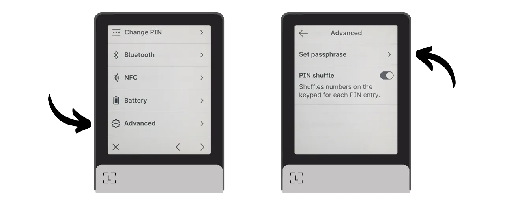

在此步骤中，您可以选择 “linked to PIN” 选项或我们在上一部分中提到的 “temporary” 选项。这里，我将解释如何设置临时密语，因此请点击 “Set temporary passphrase”。

接下来，系统会要求您输入密语。请选择一个强密语，并立即将其备份到纸质或金属等介质上。在本例中，我选择的密语是：`fH3&kL@9mP#2sD5qR!82`。输入密语后，点击 “*Continue*” 按钮。
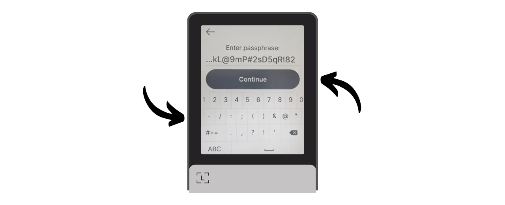

请确认您的密语与您在纸质备份上记录的密语一致，然后点击 “*Yes, it's correct*” 按钮进行确认。

为了完成创建您的密语，请输入您的 Ledger 的 PIN 码。从现在开始，每当您想要在 Ledger 上使用密语访问您的钱包时，您将需要遵循这里描述的完全相同的步骤。

您现在可以在 Sparrow Wallet 上导入您的公钥集合来管理您的钱包。在 Sparrow 上，这将对应于一个与您的初始没有密语的钱包不同的钱包。

打开 Sparrow Wallet。确保软件连接到一个节点，然后点击 “*File*” 标签并选择 “*New Wallet*”。

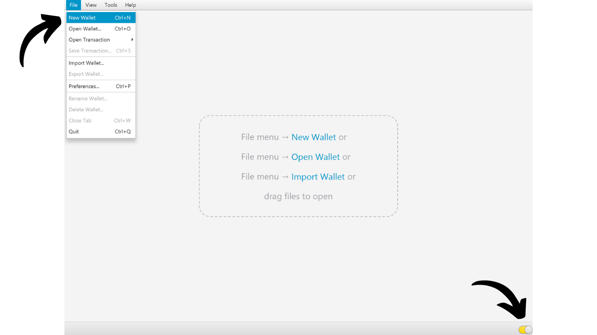

为您的密语保护的钱包选择一个名称。对于这个例子，我选择了一个明确包含 “*passphrase*” 术语的名称。然而，如果您更喜欢在您的电脑上保持这个钱包的隐私，您可以选择一个不那么引人注目的名称。

选择您的钱包的脚本类型。我建议您选择 “*Taproot*” 或 “*Native SegWit*”。

将您的 Ledger 连接到计算机，然后点击 “*Connected Hardware Wallet*”。确保您已经在您的Ledger 上输入了您的密语。如果没有，请返回到前面的步骤输入您的密语。在进行扫描之前，还要记得在您的 Ledger 上打开 “*Bitcoin*” 应用程序。

点击 “*Scan...*” 按钮。

点击您的 Ledger 旁边的 “*Import Keystore*”。

您通过密语保护的钱包现在已在 Sparrow 上创建。要确认，请点击 “*Apply*” 按钮。

选择一个强密码来保护您对 Sparrow 钱包的访问。此密码将确保您在 Sparrow 上访问钱包数据的安全，从而保护您的公钥、地址、标签和交易记录免受任何未经授权的访问。
我建议您将此密码保存在密码管理器中，以免忘记。

好了，您的钱包已创建完成！在 “*Settings*” 选单中，Sparrow 将为您提供您的 “*Master fingerprint*”。这代表您的主密钥的指纹，用于生成您的钱包。我强烈建议您保留此指纹的副本。在我的示例中，它对应于：`281ee33a`。

请记住我们在前面提到的内容：输入密语时哪怕是很小的错误，都会生成一个全新的钱包，并使用不同的密钥。每次需要确保使用正确的密语访问正确的钱包时，请检查主密钥的指纹是否与您记录的指纹一致。仅凭此信息本身，不会对您的资金安全或隐私构成任何风险。

在使用带有密语的钱包之前，我强烈建议您进行一次模拟恢复测试。记下一些参考信息，例如您的 xpub 或主密钥的指纹，然后在钱包为空的情况下重置您的 Ledger 设备。接下来，尝试使用您之前备份的 24 个单词的助记词和密语的纸质备份在 Ledger 设备上恢复您的钱包。检查恢复后生成的信息是否与您最初记录的信息一致。如果一致，则可以确定您的纸质备份是可靠的。

## 如何设置与 Ledger 上的 PIN 相关联的密语？

在 Ledger 设备的首页，点击设置齿轮图标。

选择 “*Advanced*” 选单，然后选择 “*Set passphrase*”。

这是您可以选择 “*linked to PIN*” 或 “*Temporary*” 选项的步骤，我们在前面部分已经讨论过。这里，我将解释如何设置与 PIN 码关联的密语，因此点击 “*Set passphrase and attach it to a new PIN*”。

接下来，您必须选择与您的密语关联的 PIN 码。与主 PIN 码一样，建议选择一个尽可能随机的 8 位 PIN 码。此外，请务必将此 PIN 码保存在与您的 Ledger Flex 设备不同的位置。

在我的案例中，主PIN码是`58293647`，我选择`71425839`作为与密语短语关联的次级PIN码。

然后系统会要求您输入您的密语。选择一个强密语，并立即进行物理备份，备份介质可以是纸张或金属。在这个例子中，我选择的密语是：`fH3&kL@9mP#2sD5qR!82`。输入您的密语后，点击 “*Continue*” 按钮。

请确认您的密语与您在物理备份上记录的内容一致，然后点击 “*Yes, it's correct*” 按钮进行确认。

为了完成密语的创建，请输入您的 Ledger 设备的主 PIN 码（不是与该密语关联的 PIN 码）。

从现在开始，每当您想在 Ledger 设备上使用密语访问您的钱包时，您需要输入的不是主 PIN 码，而是辅助 PIN 码：

- 主 PIN 码 (`58293647`) > 为了访问无密语钱包。
- 辅助 PIN 码 (`71425839`) > 为了访问有密语钱包。

您现在可以在 Sparrow Wallet 上导入您的公钥集合来管理您的钱包。在 Sparrow 上，这将对应于一个与您初始没有密语的钱包不同的钱包。

打开 Sparrow Wallet。确保软件已连接到节点，然后点击 “*File*” 标签并选择 “*New Wallet*”。

为您的密语保护的钱包选择一个名称。在这个例子中，我选择了一个明确包含 “*passphrase*” 术语的名称。然而，如果您更喜欢在计算机上保持这个钱包的隐私，您可以选择一个不那么引人注目的名称。

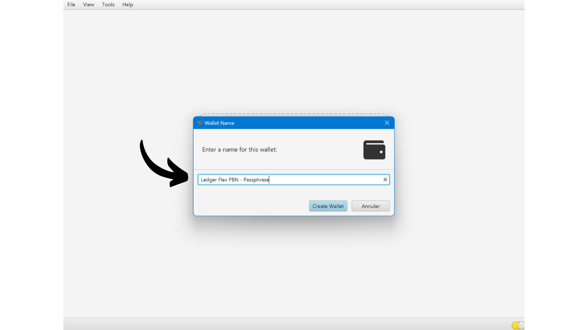

为您的钱包选择脚本类型。我建议您选择“*Taproot*”或者如果没有的话，“*Native SegWit*”。

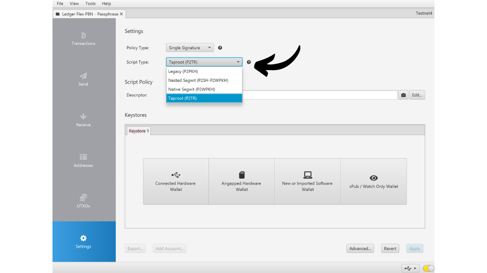

将您的 Ledger 连接到您的计算机，然后单击“*Connected Hardware Wallet*”。请确保您已使用辅助 PIN 码解锁 Ledger，并将密语保存在 Ledger 中。如果不行，请重启您的 Ledger 设备并输入与密语关联的 PIN 码。扫描前，请务必打开 Ledger 设备上的 “Bitcoin” 应用程序。

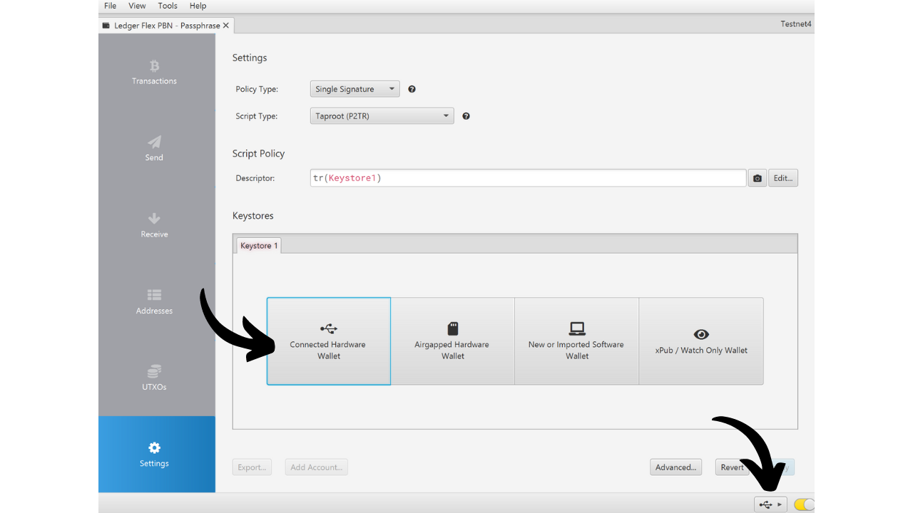

点击 “*Scan...*” 按钮。

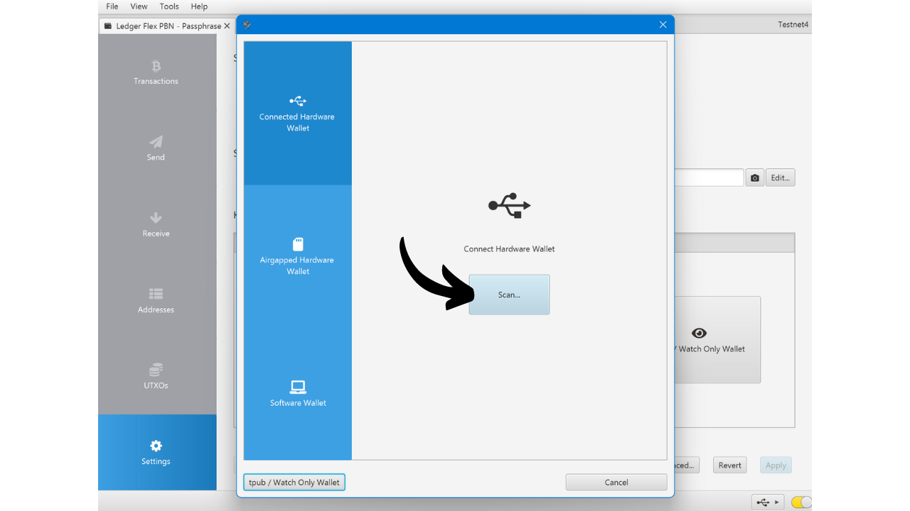

点击 “*Import Keystore*”。

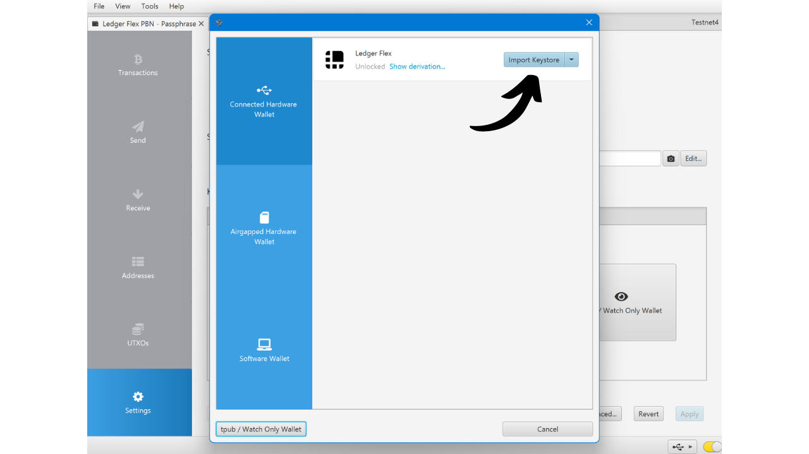

您的 Sparrow 钱包已创建完成，并已使用密语进行保护。点击 “Apply” 按钮进行确认。

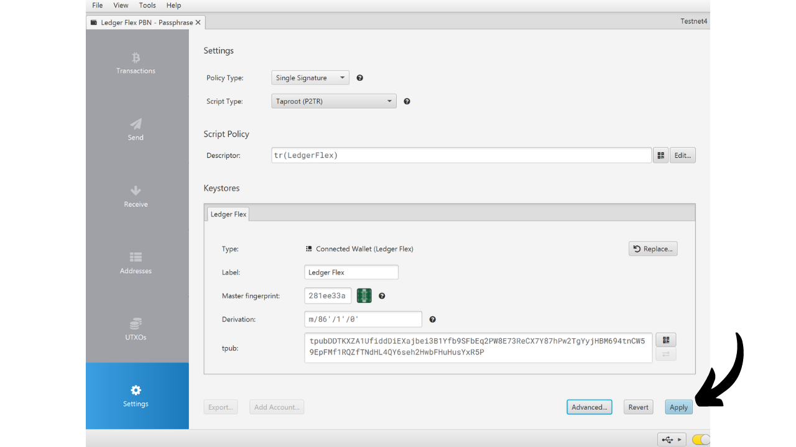

选择一个强密语来保护访问 Sparrow Wallet。这个密语将确保您在 Sparrow 上的钱包数据访问安全，有助于保护您的公钥、地址、标签和交易历史记录不受未经授权的访问。

我建议您在密语管理器中保存这个密语，以免忘记。

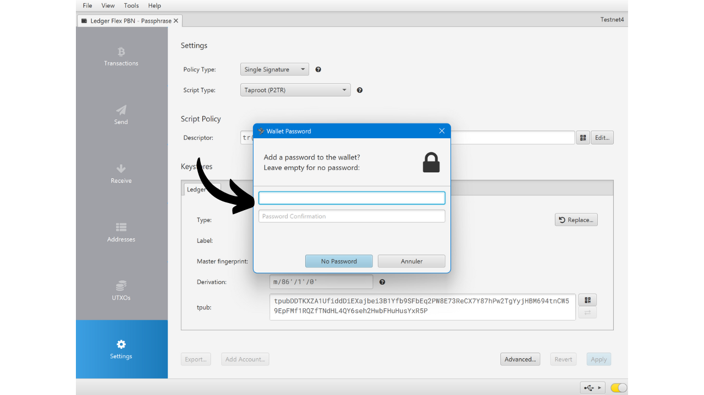
现在，您的钱包已经创建好了！在 “*Settings*” 选单中，Sparrow 将为您提供您的“*Master fingerprint*”。这代表了您钱包派生基础上的主密钥的指纹。我强烈推荐保留这个指纹的副本。在我的例子中，它对应的是：`281ee33a`。

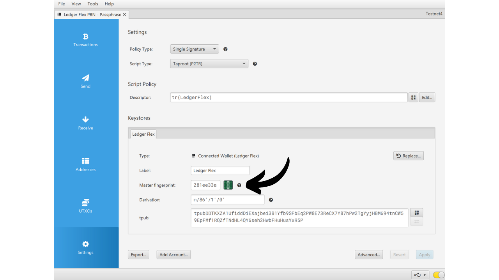

请记住我们在前面提到的内容：输入密语时哪怕是很小的错误，都会生成一个全新的钱包，并使用不同的密钥。每次需要确保使用正确的密语访问正确的钱包时，请验证您的主密钥指纹是否与您记录的指纹一致。此信息本身不会对您的资金安全或隐私构成任何风险。

在使用带有密语的钱包之前，我强烈建议您进行一次模拟恢复测试。记下一些参考信息，例如您的 xpub 或主密钥指纹，然后在钱包为空的情况下重置您的 Ledger 设备。接下来，尝试使用您之前备份的 24 个单词的助记词和密语在 Ledger 设备上恢复您的钱包。检查恢复后生成的信息是否与您最初记录的信息一致。如果一致，则可以确定您的纸质备份是可靠的。

恭喜，您的比特币钱包现在已通过密语保护！如果您觉得这篇教程有用，请在下方点赞。欢迎在社交网络上分享这篇文章。非常感谢！

我还推荐您查看这篇关于如何使用 Ledger Flex 的完整教程：
https://planb.academy/tutorials/wallet/hardware/ledger-flex-3728773e-74d4-4177-b39f-bd923700c76a
