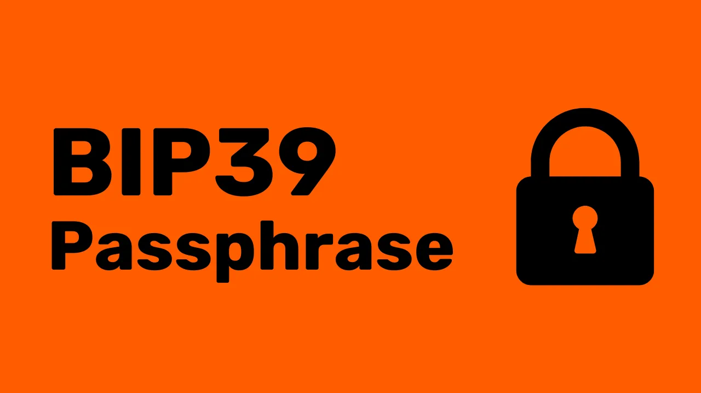
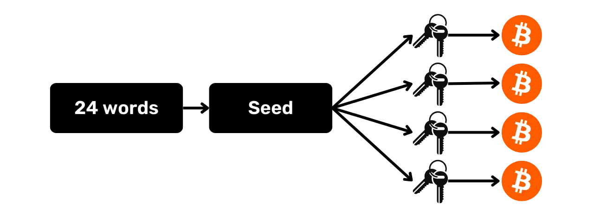
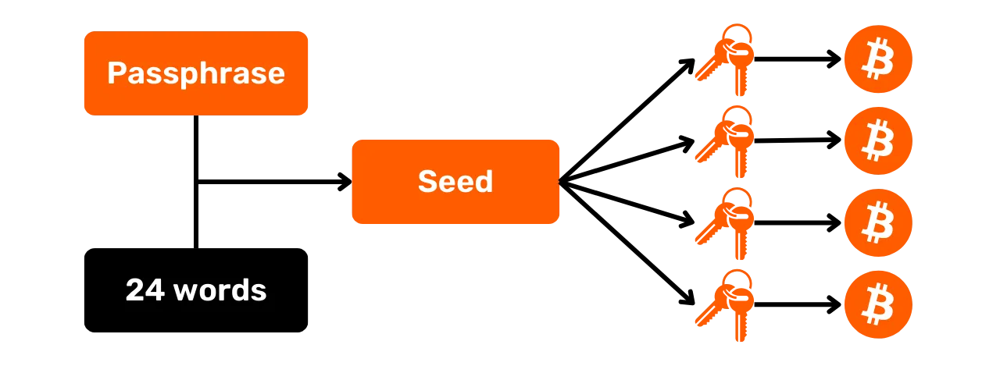

## Cos'è una passphrase BIP39?

I wallet HD sono tipicamente generati da una frase mnemonica composta da 12 o 24 parole. Questa frase è molto importante perché permette il ripristino di tutte le chiavi di un portafoglio in caso il suo supporto fisico (come un hardware wallet, ad esempio) venga perso. Tuttavia, costituisce un unico punto di fallimento perché se viene compromessa, un attaccante potrebbe rubare tutti i bitcoin.

Qui entra in gioco la passphrase. È una password opzionale che puoi scegliere liberamente, che viene aggiunta alla frase mnemonica nel processo di derivazione delle chiavi per migliorare la sicurezza del portafoglio.

Fai attenzione a non confondere la passphrase con il codice PIN del tuo hardware wallet o la password usata per sbloccare l'accesso al tuo portafoglio sul computer. A differenza di tutti questi elementi, la passphrase gioca un ruolo nella derivazione delle chiavi del tuo portafoglio. **Questo significa che senza di essa, non sarai mai in grado di recuperare i tuoi bitcoin.**

La passphrase lavora in tandem con la frase mnemonica, alterando il seme da cui vengono generate le chiavi. Così, anche se qualcuno ottiene la tua frase di 12 o 24 parole, senza la passphrase, non possono accedere ai tuoi fondi. **Usare una passphrase crea essenzialmente un nuovo portafoglio con chiavi distinte. Modificare (anche leggermente) la passphrase genererà un portafoglio diverso.**

## Perché dovresti usare una passphrase?

La passphrase è arbitraria e può essere qualsiasi combinazione di caratteri scelta dall'utente. Usare una passphrase offre quindi diversi vantaggi. Primo, riduce tutti i rischi associati al compromesso della frase mnemonica richiedendo un secondo fattore per accedere ai fondi (furto, accesso alla tua casa, ecc.).

Inoltre, può essere usata strategicamente per creare un portafoglio esca, per affrontare costrizioni fisiche per rubare i tuoi fondi come il famigerato "*attacco con chiave inglese da 5 dollari*". In questo scenario, l'idea è avere un portafoglio senza passphrase contenente solo una piccola quantità di bitcoin, abbastanza per soddisfare un potenziale aggressore, mentre si ha un portafoglio nascosto. Quest'ultimo utilizza la stessa frase mnemonica ma è protetto con una passphrase aggiuntiva.

Infine, usare una passphrase è interessante quando si desidera controllare la casualità della generazione del seme del wallet HD.

## Come scegliere una buona passphrase?
Perché la passphrase sia efficace, deve essere sufficientemente lunga e casuale. Proprio come per una password forte, raccomando di scegliere una passphrase il più lunga e casuale possibile, con una varietà di lettere, numeri e simboli per rendere qualsiasi attacco brute force impossibile.

È anche importante salvare correttamente questa passphrase, allo stesso modo della frase mnemonica. **Perderla significa perdere l'accesso ai tuoi bitcoin**. Sconsiglio vivamente di memorizzarla solamente nella tua testa, poiché ciò aumenta irragionevolmente il rischio di perdita. L'ideale è scriverla su un supporto fisico (carta o metallo) separato dalla frase mnemonica. Questo backup deve ovviamente essere conservato in un luogo diverso da dove si tiene la frase mnemonica per prevenire che entrambi vengano compromessi simultaneamente.

## Tutorial

Per impostare una passphrase su un dispositivo Ledger (Stax, Flex, o Nano), puoi consultare questo tutorial:

https://planb.network/tutorials/wallet/passphrase-ledger