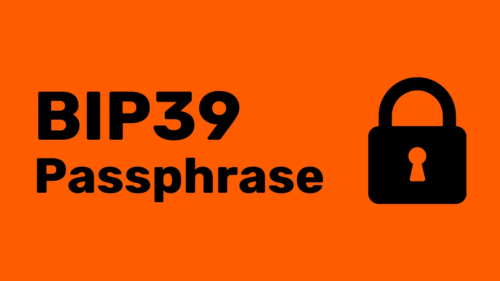
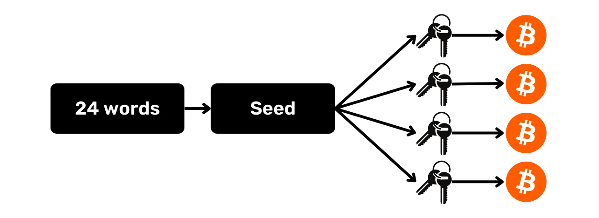
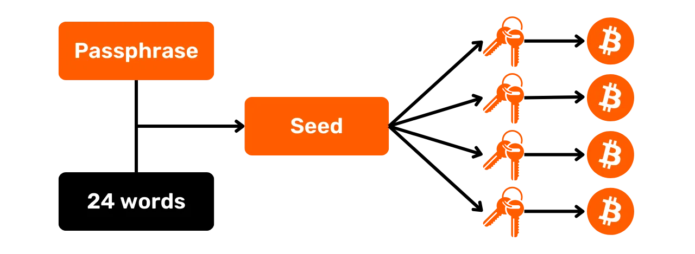

## 何为 BIP39 Passphrase（密语）？

分层确定性（HD）钱包通常由包含 12 个或 24 个单词的助记词生成。这个短语非常重要，因为它允许在钱包的物理介质（例如硬件钱包）丢失的情况下恢复钱包的所有密钥。然而，它构成了一个单点故障，因为如果它被泄露，攻击者可能会窃取所有的比特币。

这时就需要用到密语了。密语是一个可选的密码，您可以自由选择，它会在密钥派生过程中添加到助记词中，以增强钱包的安全性。

请注意不要将密语与您硬件钱包的 PIN 码或用于解锁您在计算机上访问钱包的密码混淆。与所有这些元素不同，密语在您钱包的密钥派生中起作用。**这意味着没有它，您将永远无法恢复您的比特币。**

密语与助记词配合使用，会改变生成密钥的种子。因此，即使有人获得了您的 12 或 24 个单词的助记词，如果没有密语，他们也无法访问您的资金。**使用密语实际上会创建一个具有不同密钥的新钱包。即使对密语进行细微修改，也会生成另一个不同的钱包。**

## 为什么您应该使用密语？

密语是任意的，可以是用户选择的任意字符组合。因此，使用密码有诸多优势。首先，它通过要求第二个因素（例如入室盗窃、非法闯入等）来降低助记词泄露带来的所有风险。

其次，它可以被策略性地用于创建诱饵钱包，以应对诸如臭名昭著的“5美元扳手攻击”等窃取资金的物理限制。在这种情况下，可以创建一个没有密语的钱包，其中只包含少量比特币，足以满足潜在攻击者的需求；同时，还有一个隐藏的钱包。后者使用相同的助记词，但额外设置了密语进行保护。

最后，当用户希望控制HD钱包种子生成的随机性时，使用密语也很有用。

## 如何选择一个好的密语？
为了确保密码的有效性，它必须足够长且随机。就像设置强密码一样，我建议选择尽可能长且随机的密码，包含各种字母、数字和符号，以使任何暴力破解攻击都无法奏效。

根据 [Trezor 于 2019 年进行的一项研究](https://blog.trezor.io/is-your-passphrase-strong-enough-d687f44c63af)，攻击者如果能够访问您的种子，并使用在 AWS 上租用的高端 GPU（例如 NVIDIA Tesla V100），只需 1 美元即可测试近 6.2 亿个密码。粗略估计，以 2019 年的技术水平，破解一个由 12 个随机小写字母组成的密码平均需要花费 7700 万美元。

然而，我建议您不要将密码长度限制在 12 个字符以内。相反，您应该以当前强密码的标准为目标：到 2025 年，密码长度至少应为 13 个随机字符，包括数字、大小写字母和符号；如果仅使用大小写字母，则应为 14 个字符。当然，我建议您设置更高的密码强度，例如选择一个包含符号的 20 个字符的密语，以应对未来的发展趋势并考虑到这些研究中未考虑到的人为风险。

妥善保存此密语至关重要，就像保存助记词一样。丢失密语意味着您将无法访问您的比特币。我强烈建议您不要仅仅将其记在脑子里，因为这会不合理地增加丢失的风险。理想的做法是将其写在与助记词分开的物理介质（纸张或金属）上。显然，此备份必须存放在与助记词不同的位置，以防止两者同时泄露。

## 教程

以下是在 Ledger 设备（Stax、Flex 或 Nano）上设置密语：

https://planb.academy/tutorials/wallet/backup/passphrase-ledger-9ae6d9a2-7293-438a-8fe0-e59147ef2f49

以下是在 COLDCARD 上设置密语教程：

https://planb.academy/tutorials/wallet/hardware/coldcard-q-advanced-b8cc3f29-eea9-48fe-a953-b003d5b115e0

以下是在 Jade Plus 上设置密语教程：

https://planb.academy/tutorials/wallet/hardware/jade-plus-sparrow-938abf16-e10a-4618-860d-cd771373a262

以下是在 Passport（batch-2）上设置密语教程：

https://planb.academy/tutorials/wallet/hardware/passport-74e53858-3fa2-43f9-b866-573297546236

以下是在 Trezor 设备上（Safe 3、Safe 5 或 Model One）设置密语教程

https://planb.academy/tutorials/wallet/backup/trezor-passphrase-0474b5bf-496f-4f97-aefe-445368fdca42

以下是在 Seedsigner 上设置密语教程：

https://planb.academy/tutorials/wallet/backup/seedsigner-passphrase-7a61f64d-aa03-4bcf-8308-00c89a74cffe

以下是在带有 Seedkeeper 的 SeedSigner 上设置密语教程：

https://planb.academy/tutorials/wallet/hardware/seedkeeper-seedsigner-45cca4c4-1f22-46bb-87ae-9cddb68aa579
