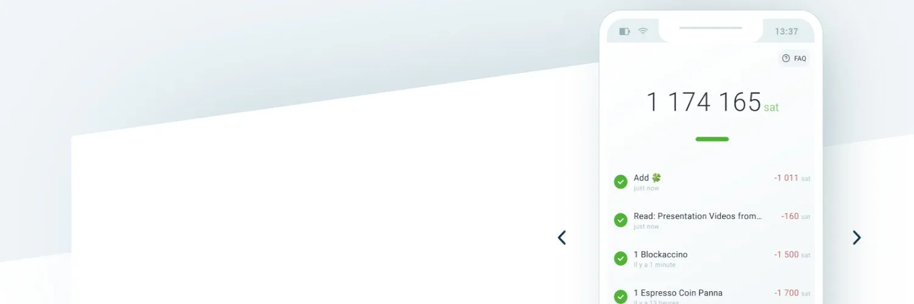

## Sissejuhatus

Phoenix on Acinq meeskonna loodud mittehoidmisõigusega Lightning rahakott, kes on tuntud Lightning Eclairi rakenduse taga.

Pidage meeles, et Phoenix on mobiilirakendus, mis keskendub Lightning maksetele, kuid toetab siiski ka ahelasiseseid makseid integreeritud vahetuste kaudu. See tähendab, et iga ahelasisene sissemakse Phoenixisse vahetatakse koheselt Lightning kanaliks.

Samuti, kui soovite saata ahelasisesele aadressile, teeb Phoenix vahetuse sisemiselt teie LN kanalist ahelasisese sihtkoha suunas. Olge teadlikud, et kõik need vahetused on tasulised, kuna need hõlmavad ahelasisest tasu.

Allpool "Alustamisjuhendi" jaotises käsitleme seadistusprotsessi ja selgitame ka, kuidas hallata Phoenixis Lightning likviidsust.

## Olulised ressursid
- Phoenixi ametlik veebileht - [https://phoenix.acinq.co](https://phoenix.acinq.co)
- Dokumentatsiooni / KKK leht - [https://phoenix.acinq.co/faq](https://phoenix.acinq.co/faq)
- [Githubi leht](https://github.com/ACINQ/phoenix/) | [Githubi väljalasete leht](https://github.com/ACINQ/phoenix/releases) (laadige otse alla apk)
- [Tugi ja arutelud](https://github.com/ACINQ/phoenix/discussions)
- [Acinqi blogi](https://acinq.co/blog) - teadaanded

## Videoõpetus

## Alustamisjuhend

Siin on samm-sammult juhend, kuidas alustada Phoenixiga, seadistada, teha / vastu võtta makseid, hallata likviidsust, varundamis- / taastamisprotsessi.

### Allalaadimine ja seadistamine
Phoenixi saate alla laadida ja installida: [App Store](https://apps.apple.com/us/app/phoenix-wallet/id1544097028) | [Google Play Store](https://play.google.com/store/apps/details?id=fr.acinq.phoenix.mainnet) | [Otsene allalaadimine apk](https://github.com/ACINQ/phoenix/releases)

Järgige juhiseid alates tervitusekraanist, samm-sammult.

Teile antakse teavet automaatsete Lightning kanalite loomise kohta.
Alates versioonist 2.0 on see oluline uuendus, mis toob Phoenixisse "splicing":
- üks dünaamiline kanal,
- enam pole 1% tasu sissetuleva likviidsuse eest
- parem ettearvatavus ja kontroll
- usaldusväärsed vahetused

Vaadake [Phoenixi blogipostitust](https://acinq.co/blog/phoenix-splicing-update) lisateabe saamiseks, eriti uue tasumudeli kohta.

### Likviidsuse kiirjuhend

Niisiis, kui olete sellesse rahakotti sisse maksnud / deponeerinud satse, avatakse automaatselt kanalid ACINQ sõlmega. Tavaliselt on kanalite suurus veidi suurem kui teie deposiidi summa. Seega, iga deposiidi puhul on teil alati uus kanal, välja arvatud juhul, kui te pole kanalit täielikult tühjendanud ja saate väiksema makse, siis see täidetakse uuesti.

Phoenix Lightningi likviidsuse jaoks soovitaksime järgmist stsenaariumi:

Uue versiooniga v0.2.0 tuleb uus LN funktsioon splicing. See tähendab, et edaspidi ei pea te enam tegelema paljude uute väikeste kanalitega iga saadud makse jaoks.

Kui sissetuleva likviidsuse jaoks pole piisavalt vahendeid, suurendab Phoenix teie esialgse kanali suurust, kuid see tähendab siiski ahelasisest tasu. Selle tasu saate igal juhul seadistada Phoenixi seadetes, maksevõimalustes ja tasudes.
Niisiis, soovitame alustada Phoenixi kasutamist suure kanaliga, näiteks 1-3-5M satsi. Teie kohustuslikud tasud on võrreldes kanali suurusega tühised ja ei mõjuta teid liialt. Samuti, selle asemel, et maksta 4-5 korda (või ükskõik mitu korda te väikeseid summasid deponeerite) vähemalt 3000 satsi tasu iga deposiidi eest, maksate ainult ühe korra kanali avamise tasu.
Kui hakkate sellest kanalist kulutama, ärge kulutage kõike, sest Phoenix sulgeb selle.

Kui jätate kanalisse mõned satsid ja teete teisest LN rahakotist / deposiidi allikast täiendava täitmise, on meil kaks olukorda, mida kaaluda:
- kui uus deposiidi summa on suurem kui teie kanali maht, suurendab Phoenix kanalit ja te peate maksma lisatasu.
- kui uus deposiidi summa on väiksem kui teie kanali maht, ei kaasne sellega tasusid.

Seega proovige oma esialgse kanali mahtu kohandada vastavalt teie isiklikele kulutamisvajadustele. Kulutamine ja asendamine kanali piirides ei too kaasa enam tasusid ja kogemus selle rahakoti äpi kasutamisel on sujuv.

### Varundamine
Järgmisel ekraanil teavitatakse teid, et Phoenixi äpp genereerib teie rahakoti varundamiseks seemnefraasi. Hiljem PEAB need seemnesõnad olema salvestatud turvalisse kohta!

Järgmine ekraan näitab, kas soovite luua uue rahakoti või taastada eelneva rahakoti seemnefraasi abil.

Kui uus rahakott on loodud, hoiatatakse teid, et peaksite tegema seemnefraasi varukoopia. Klõpsake nupul "Varunda rahakott".

Teid hoiatatakse, et need seemnesõnad on väga olulised ja tundlikud ning peaksite neid hoidma privaatsena.

Need seemnesõnad PEATE salvestama turvalisse kohta, nagu paroolihaldur ([KeePass](https://keepass.info/) või [Bitwarden](https://bitwarden.com/)), hoides selle paroolihalduri andmebaasi offline USB krüpteeritud pulgal täieliku turvalisuse tagamiseks.

### Maksete vastuvõtmine

Enne vastuvõtmise alustamist lugege palun eelnevat peatükki "Liquidity Quick Guide".

Nüüd olete valmis vastu võtma satse oma Phoenixi rahakotti!

Makse vastuvõtmiseks Phoenixis on teil järgmised võimalused:
- kasutades kuvatud QR-koodi, mis esindab "tühja" Lightningi arvet
- redigeerides Lightningi arvet (vaadake QR-koodi all olevat redigeerimisnuppu), kus saate lisada satside summa, lisada makse sooritajale kuvatava kommentaari
- kasutades / skaneerides LNURL-withdraw QR-koodi
- genereerides oma Phoenixi rahakotist on-chain Bitcoin aadressi. Pidage meeles, et see makse "konverteeritakse" uueks Lightningi kanaliks (kui te pole veel üht avanud) või olemasoleva Lightningi kanali suuruse muutmiseks.

Ekraan, mis kuvatakse uue Lightningi arve redigeerimiseks ja selle jaoks uue QR-koodi genereerimiseks:

See on ekraan, kus saate genereerida on-chain BTC aadressi ja teid teavitatakse, et makse sellele aadressile "konverteeritakse" lightningi likviidsuseks ja kaasnevad mõned tasud.

Kui makse on tehtud, kuvatakse kinnituskuva, kõik tehtud!

Vabatahtlikult võite iga saadud makse juurde lisada isikliku märkuse. Neid märkusi ei salvestata kusagil mujal, need hoitakse ainult teie seadmes. Kui taastate oma Phoenixi rahakoti, siis neid märkusi ei taastata. See on kasulik funktsioon, et jälgida teie saadetud ja saadud makseid.

### Maksete saatmine

Maksete saatmine on üsna lihtne protsess, lihtsalt vajutage peamenüü nuppu "Saada"

Teilt palutakse lubada Phoenixi rakendusel juurdepääs seadme kaamerale, et oleks võimalik skaneerida QR-koode.

Makse ekraanil on teil 3 valikut:
- skaneerige QR-kood saaja Lightningi arvelt / LNURL-ilt
- sisestage käsitsi (kleepige), Lightningi aadressi sisestus või LNURL-makse kood
- laadige QR-pilt kohalikult kettalt

Nagu selles ekraanil näha, on maksepäring skaneeritud ja detailid on juba täidetud. Peate lihtsalt vajutama nuppu "Maksa".

Kui makse on saadetud ja kinnitatud, kuvatakse kinnitusekraan makse lühidetailidega, sealhulgas tasutud tasuga. Kui soovite näha rohkem makse detaile, klõpsake nupul "Detailid".

Detailide ekraanil näete makse tehnilisi detaile, sealhulgas: makse hash ja päring, eelkujutis, sihtsõlme ja kestus. Mõnikord on need detailid kasulikud maksete jälgimiseks, vigade tuvastamiseks või konkreetse makse tuvastamiseks saajaga.

### Seaded

Seadete menüüs pole palju teha, Phoenix eelistab lihtsust. Kuid üks oluline aspekt siin on menüü maksekanalite ja tasude haldamiseks, kus saate seada soovitud tasemete tasud. Pidage meeles, et kõrgete tasudega mempooli keskkonnas ei tohiks kasutada väga madalaid tasusid, vastasel juhul teie maksed ja kanalite avamised katkestatakse ja/või ebaõnnestuvad.

Teised valikud Seadete menüüs:
- Kuva - vahetamiseks erinevate värviteemade vahel
- Electrumi server - kontrollimaks, millise Electrumi serveriga olete ühendatud või määramaks ühte
- Tor - kui soovite kasutada Phoenixi Tor-võrgu taga
- Rakenduse juurdepääsu seaded - määrake Phoenixile konkreetsed seadmeteenused
- Taastefraas - kui soovite kontrollida seemnesõnu ja/või teha uue varukoopia
- Kanalite loend - kuvab teie Lightningi kanalite oleku ja saadaoleva likviidsuse (sisse/välja)
- Logid - kuvab silumislogid
- Sulge kõik kanalid - Ohtlik valik, mida tuleks kasutada AINULT juhul, kui soovite oma Phoenixi sõlme lõplikult sulgeda ja taastada vahendid oma onchain aadressile. Seda aadressi saab hiljem taastada kasutades Electrumi rahakotti, kasutades teie Phoenixi seemnefraasi.

### Lähtesta

Kui olete olukorras, kus teie Phoneixi rakendus on raskustes (ei tee makseid, ei ühendu Electrumi serveritega, ei saa makseid vastu võtta) või soovite lihtsalt selle teisele seadmele viia, PEATE olema kindel kahe aspekti suhtes:
- teil on varukoopia oma seemnefraasist
- peatage rakendus oma seadmes - minge rakenduse detailidesse ja sundpeata teenus
- desinstallige see vanast seadmest, kui soovite selle uude seadmesse viia
- ÄRGE käivitage sama Phoenixi rahakotti mitmel seadmel!

Kui olete selle uuesti installinud või installinud uuele seadmele, klõpsake nupul "Taasta" ja järgige juhiseid

Te ei saa kasutada teist tüüpi seemet, mis on genereeritud teistest rahakoti rakendustest. [Vaadake siit](https://walletsrecovery.org/) lisateavet teiste rahakoti tüüpide ja nende seemne tüübi ning tuletustee kohta. Kõik ei ole ühilduvad!

Te peate sisestama eelnevalt salvestatud seemnesõnad ükshaaval, kindlas järjekorras. Kui olete 12 sõna sisestamise lõpetanud, klõpsake nuppu "Import" ja valmis.

Mõne hetke pärast näete oma eelmist saldot. Samuti saate teate seemne varundamise kohta. Kui olete seda juba teinud, võite lihtsalt minna menüüsse ja valida "Ma salvestasin varukoopia".

Valmis! Õnnelikku Lightningut!