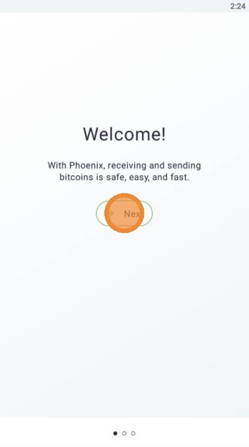
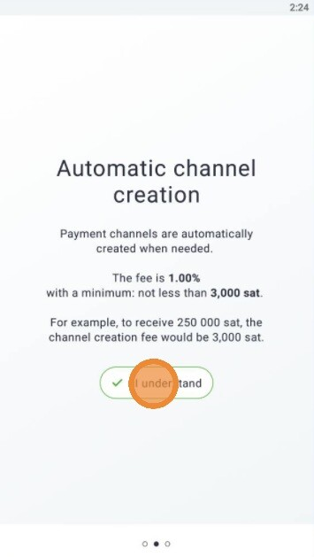
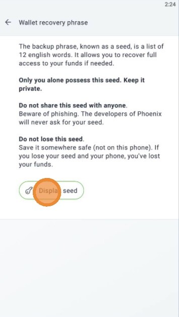
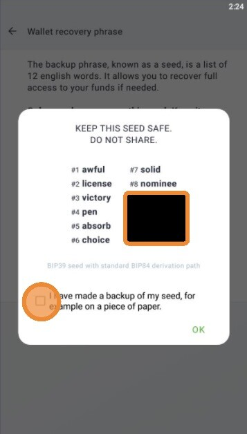
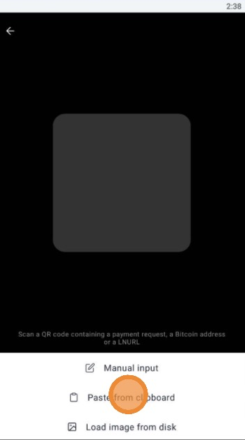
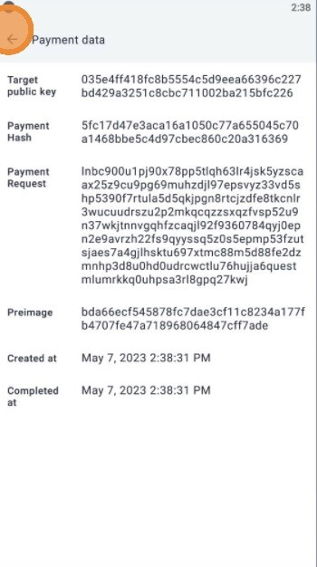
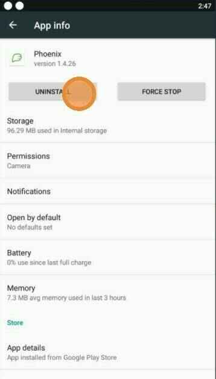
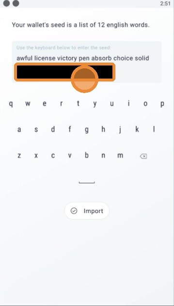
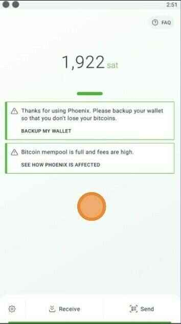

Phoenix è un portafoglio lightning non custodiale creato da Acind, il team dietro l'implementazione di Lightning Eclair.

Per trovare la loro documentazione ufficiale, consultate la loro guida FAQ: https://phoenix.acinq.co/faq

## Tutorial Video

## Guide scritte

Testo da scrivere ^^' seguite le immagini

### Download e configurazione

### Backup

### Ricevere

### Inviare

### Impostazioni

### Ripristino

