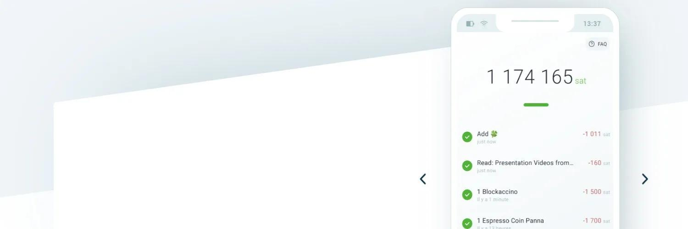

## はじめに

Phoenixは、Lightning Eclairの実装を手掛けるAcinqチームによって作られた非預託型のライトニングウォレットです。

Phoenixはライトニング支払いに焦点を当てたモバイルアプリであることを覚えておいてくださいが、統合されたスワップを通じてオンチェーン支払いもサポートしています。これは、Phoenixにオンチェーンで預け入れた任意の資金が、即座にライトニングチャネルにスワップされることを意味します。

また、オンチェーンアドレスに送金したい場合、Phoenixは内部であなたのLNチャネルからオンチェーンの宛先へスワップを行います。これらのスワップにはコストがかかることに注意してください。なぜなら、オンチェーン手数料が発生するからです。

以下の「入門ガイド」セクションでは、セットアッププロセスを順を追って説明し、Phoenixでのライトニング流動性の管理方法についても詳しく説明します。

## 重要なリソース
- Phoenix公式ウェブページ - [https://phoenix.acinq.co](https://phoenix.acinq.co)
- ドキュメント / FAQページ - [https://phoenix.acinq.co/faq](https://phoenix.acinq.co/faq)
- [Githubページ](https://github.com/ACINQ/phoenix/) | [Githubリリースページ](https://github.com/ACINQ/phoenix/releases) (apkを直接ダウンロード)
- [サポートとディスカッション](https://github.com/ACINQ/phoenix/discussions)
- [Acinqブログ](https://acinq.co/blog) - アナウンスメント

## ビデオチュートリアル

## 入門ガイド

ここでは、Phoenixの開始、セットアップ、支払いの送受信、流動性の管理、バックアップ/復元プロセスについて、ステップバイステップのガイドを紹介します。

### ダウンロード＆セットアップ
Phoenixは、以下からダウンロードしてインストールできます: [App Store](https://apps.apple.com/us/app/phoenix-wallet/id1544097028) | [Google Play Store](https://play.google.com/store/apps/details?id=fr.acinq.phoenix.mainnet) | [直接ダウンロードapk](https://github.com/ACINQ/phoenix/releases)

ウェルカム画面から始まり、ステップバイステップで指示に従ってください。

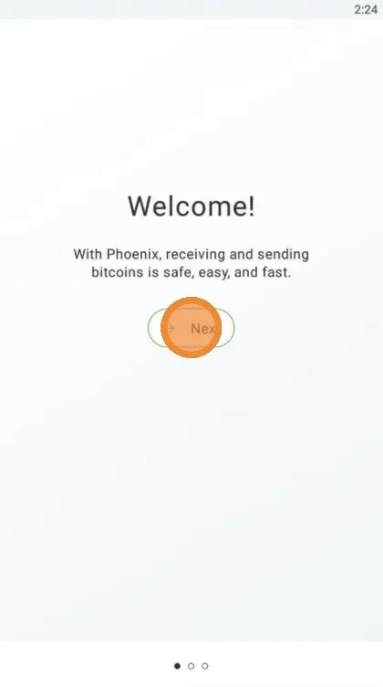

自動的なライトニングチャネルの作成について説明されます。
v2.0からは、Phoenixに「スプライシング」という大きなアップグレードがもたらされました：
- 単一のダイナミックチャネル
- 受信流動性に対する1%の手数料なし
- より良い予測可能性とコントロール
- 信頼できるスワップ

特に新しい手数料モデルについては、[Phoenixブログ投稿](https://acinq.co/blog/phoenix-splicing-update)で詳細を確認してください。

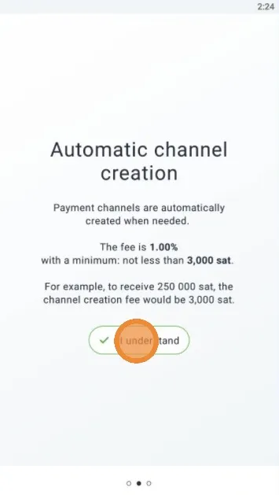

### 流動性クイックガイド

このウォレットにsatsを受け取ったり預け入れたりすると、自動的にACINQノードとのチャネルが開設されます。通常、チャネルのサイズは預け入れた金額よりもわずかに大きくなります。したがって、完全にチャネルを使い切っていない場合に小額の支払いを受け取ると、それが補充される形で新しいチャネルが常に用意されます。

新しいバージョンv0.2.0では、新しいLN機能のスプライシングが導入されました。これにより、これからは受け取った各支払いに対して多くの新しい小さなチャネルを扱う必要がなくなります。

十分な受信流動性がない場合、Phoenixは初期チャネルのサイズを増やしますが、それでもオンチェーン手数料が発生します。Phoenixの設定で、支払いオプションと手数料でその手数料を設定できます。
したがって、大きなチャネルを使用してPhoenixを始めることをお勧めします。例えば、1-3-5M satsのような。あなたのコミット手数料はチャネルのサイズと比較して無視できるものであり、あまり影響を受けません。また、小額を何度も預け入れる場合に4-5回（またはそれ以上）支払う最低3000 satsの手数料の代わりに、チャネル開設手数料を一度だけ支払います。
そのチャネルから支出を始める場合は、全てを使い切らないでください。なぜなら、Phoenixはそれを閉じるからです。

チャネルにいくらかのsatsを残して、別のLNウォレット/預金源から再度補充する場合、考慮すべき2つの状況があります：
- 新しい預金額がチャネル容量を超える場合、Phoenixはチャネルをリサイズし、追加手数料を支払います。
- 新しい預金額がチャネル容量未満の場合、手数料は発生しません。

したがって、支出の個人的なニーズに合わせて、最初のチャネル容量をサイズ設定してください。チャネルの限界内での支出と補充では、これ以上手数料が発生せず、このウォレットアプリを使用する経験はスムーズになります。

### バックアップ
次の画面では、Phoenixアプリがウォレットのバックアップ用にシードフレーズを生成することが通知されます。後で、これらのシードワードは安全な場所に保存する必要があります！

次の画面は、新しいウォレットを作成するか、シードフレーズから以前のウォレットを復元するかを示します。

新しいウォレットが作成されると、シードフレーズのバックアップを行うようにアラートが表示されます。「バックアップウォレット」ボタンをクリックします。

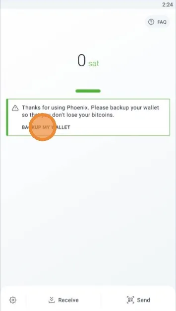

これらのシードワードは非常に重要でデリケートであるため、プライベートに保つべきだと警告されます。

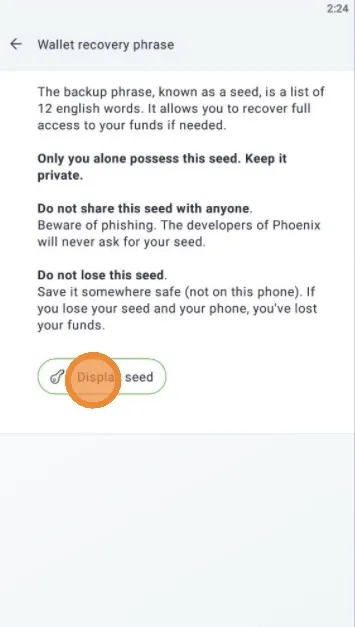

これらのシードワードは、パスワードマネージャー（[KeePass](https://keepass.info/) や [Bitwarden](https://bitwarden.com/)など）に保存し、このパスワードマネージャーのデータベースを完全な安全性のためにオフラインUSB暗号化スティックに保管する必要があります。

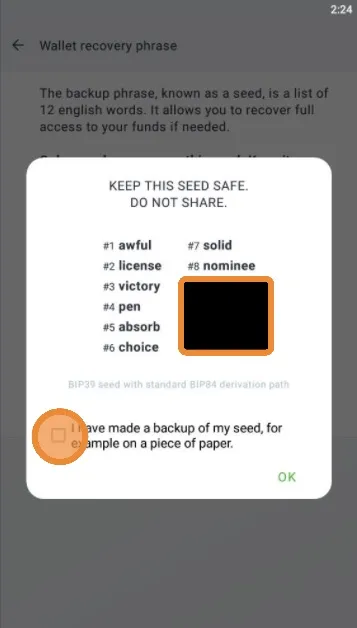

### 支払いの受け取り

受け取りを始める前に、上記の「流動性クイックガイド」を読んでください。

これで、Phoenixウォレットにsatsを受け取る準備ができました！

Phoenixで支払いを受け取るには、以下のオプションがあります：
- 表示されたQRコードを使用して、「空」のLightning請求書を表す
- Lightning請求書を編集して（QRコードの下の編集ボタンを参照）、satsの金額を追加し、支払い人に表示されるコメントを追加する
- LNURL-withdraw QRコードを使用/スキャンする
- PhoenixウォレットからオンチェーンBitcoinアドレスを生成する。この支払いは、新しいLightningチャネルに「変換」される（まだ開いていない場合）か、既存のLightningチャネルのサイズを変更することになります。

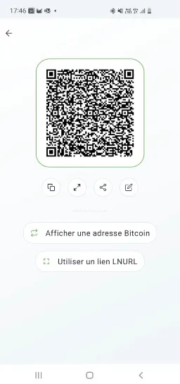

新しいLightning請求書を編集し、それ用の新しいQRコードを生成する画面が表示されます：

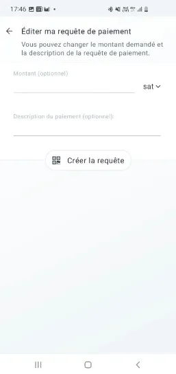

この画面では、オンチェーンBTCアドレスを生成し、このアドレスへの支払いがlightning流動性に「変換」され、いくつかの手数料が発生することが通知されます。

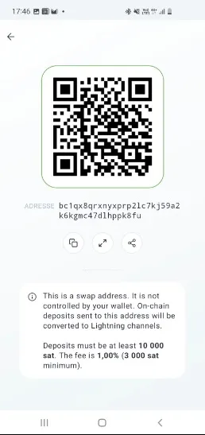

支払いが完了すると、確認画面が表示され、すべて完了です！

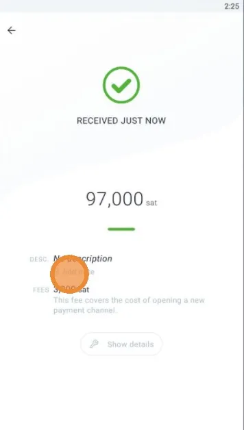
任意で、受け取った支払いごとに個人的なメモを追加することができます。これらのメモは他の場所には保存されず、あなたのデバイス内にのみ保持されます。Phoenixウォレットを復元した場合、これらのメモは復元されません。これは、送受信した支払いを追跡するのに便利な機能です。
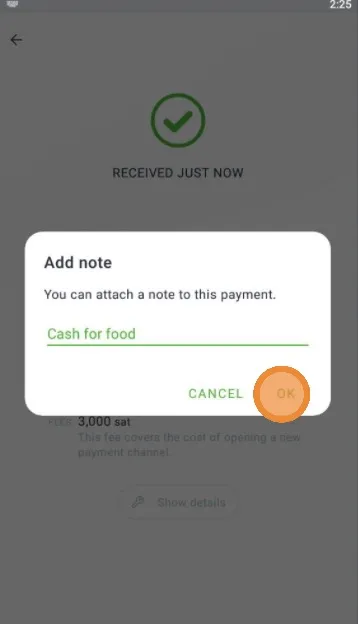

### 支払いの送信

支払いを送信するプロセスは非常にシンプルで、メイン画面の「Send」ボタンをクリックするだけです。

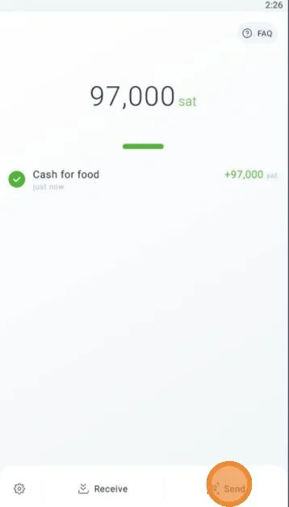

Phoenixアプリがデバイスのカメラにアクセスすることを許可するよう求められます。これにより、QRコードをスキャンできるようになります。

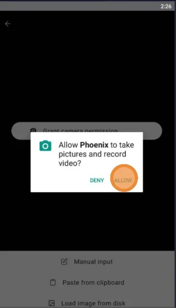

支払い画面では、3つのオプションがあります：
- 受信者のLightning請求書 / LNURLからQRコードをスキャン
- Lightningアドレスの入力またはLNURL-payコードを手動で入力（貼り付け）
- ローカルディスクからQRイメージを読み込む

この画面でわかるように、支払いリクエストがスキャンされ、詳細がすでに入力されています。「Pay」ボタンを押すだけです。

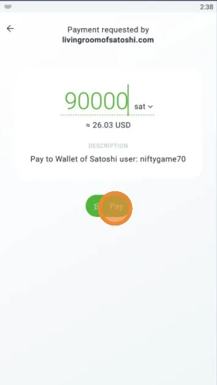

支払いが送信され、確認されると、支払いの短い詳細を含む確認画面が表示されます。これには、支払われた手数料も含まれます。より多くの支払いの詳細を見たい場合は、「Details」ボタンをクリックしてください。

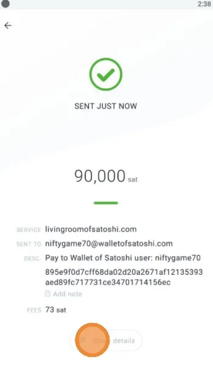

詳細画面では、支払いの技術的な詳細を見ることができます。これには、支払いハッシュとリクエスト、プリイメージ、宛先ノード、および期間が含まれます。これらの詳細は、支払いを追跡したり、デバッグしたり、受信者と特定の支払いを特定するのに役立つことがあります。

### 設定

設定メニューでは、あまり多くのことをする必要はありません。Phoenixはシンプルさを重視しています。しかし、ここでの重要な側面は、支払いチャネルと手数料を管理するためのメニューで、希望する手数料のレベルを設定できます。メンプールの手数料が高い環境では、非常に低い手数料を使用すべきではないことに注意してください。そうしないと、支払いやチャネルの開設が中断されたり、失敗したりする可能性があります。

設定メニューの他のオプション：
- Display - 異なるカラーテーマに切り替える
- Electrumサーバー - 接続しているElectrumサーバーの状態を確認するか、指定する
- Tor - PhoenixをTorネットワークの背後で使用したい場合
- アプリアクセス設定 - 特定のデバイスサービスへのPhoenixのアクセス許可を設定する
- リカバリーフレーズ - シードワードを確認したり、新しいバックアップを作成したい場合
- チャネルリスト - Lightningチャネルの状態と利用可能な流動性（入/出）を表示する
- ログ - デバッグログを表示する
- すべてのチャネルを閉じる - Phoenixノードを無期限にシャットダウンし、資金をオンチェーンアドレスに回収したい場合にのみ使用すべき危険なオプション。そのアドレスは後で、Phoenixのシードフレーズを使用してElectrumウォレットで取得できます。

### リセット

Phoenixアプリがトラブルを抱えている（支払いができない、Electrumサーバーに接続できない、支払いを受け取れない）場合や、単に別のデバイスに移動したい場合は、以下の2点を確実に行う必要があります：
- シードフレーズのバックアップを持っている
- デバイスでアプリを停止する - アプリの詳細に移動し、サービスを強制停止する
- 古いデバイスからアンインストールし、新しいデバイスに移動したい場合
- 複数のデバイスで同じPhoenixウォレットを実行しないでください！

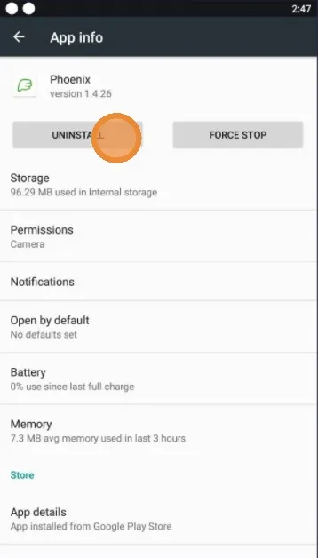

新しいデバイスに再インストールするか、新しいデバイスにインストールする場合は、「Restore」ボタンをクリックし、指示に従ってください

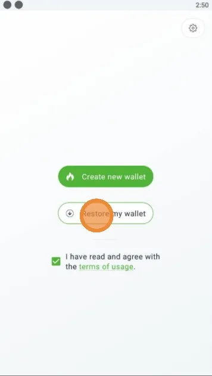
他のウォレットアプリから生成された異なるタイプのシードを使用することはできません。他のウォレットタイプとそのシード及び導出パスについて[こちらで詳細をご覧ください](https://walletsrecovery.org/)。すべてが互換性を持っているわけではありません！
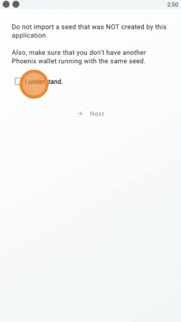

以前に保存したシードワードを、特定の順序で一つずつ入力する必要があります。12語を入力し終えたら、「Import」ボタンをクリックして完了です。

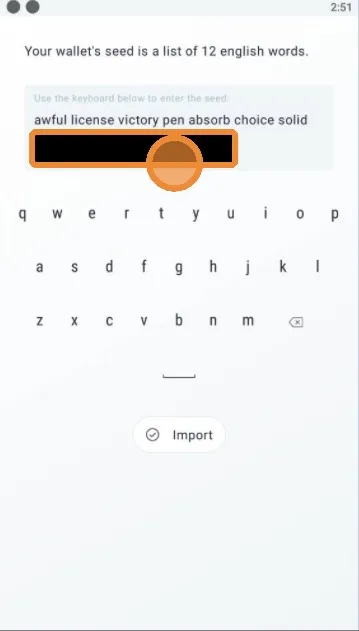

数瞬間で、以前の残高が表示されます。また、シードのバックアップを取るようにアラートが表示されます。既にバックアップを取っている場合は、メニューに行って「I saved the backup」を選択するだけです。

完了！ハッピーライトニング！