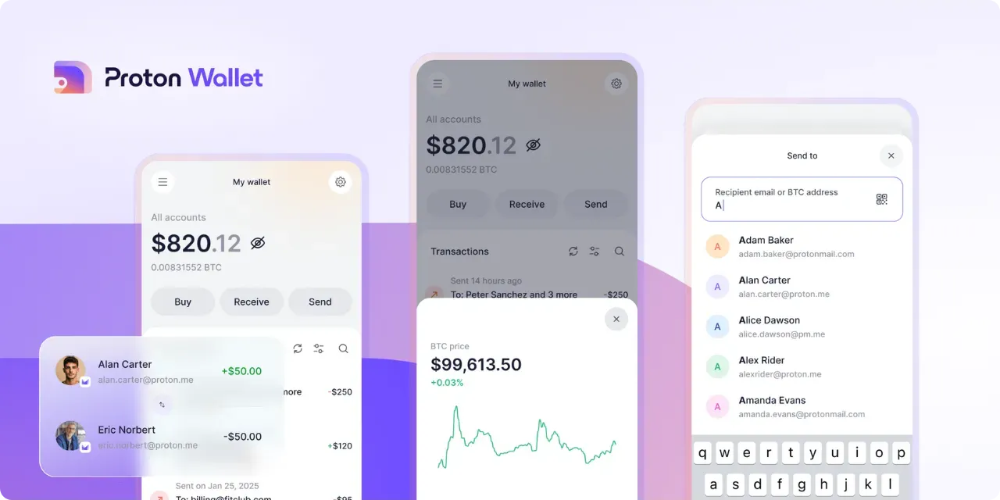

Proton adalah perusahaan asal Swiss yang fokus pada privasi digital, didirikan tahun 2014 oleh para ilmuwan CERN. Dikenal lewat solusi open source, Proton menawarkan berbagai layanan seperti Proton Mail, Proton VPN, dan Proton Drive.

Baru-baru ini, Proton meluncurkan Proton Wallet, sebuah dompet Bitcoin open-source dengan model self-custody. Dompet ini tersedia sebagai aplikasi mobile maupun klien web, dan terhubung langsung dengan akun Proton kamu. Fungsinya saat ini masih tergolong standar, tapi sudah mencakup fitur penting yang biasanya ada di dompet Bitcoin, seperti RBF (Replace-By-Fee), label/tagging, dan opsi menambahkan seedphrase BIP39.

Yang bikin Proton Wallet unik adalah kemampuannya mengirim bitcoin lewat alamat email penerima. Sistem Proton akan otomatis membuat alamat Bitcoin kosong yang langsung terhubung ke dompet si penerima. Ke depan, Proton juga berencana menambahkan fitur baru, termasuk Lightning dan coinjoin (kemungkinan lewat Whirlpool, seperti yang terlihat dari aktivitas di repositori GitHub mereka).

## Buat akun Proton

Untuk bisa pakai Proton Wallet, kamu perlu punya akun Proton. Kamu bisa bikin akun gratis dengan mengikuti langkah pertama di tutorial ini yang khusus membahas cara membuat Proton Mail (cukup ikuti bagian Membuat akun Proton saja). Setelah akunmu jadi, kamu bisa lanjut ke bagian berikutnya dari tutorial ini.

https://planb.network/tutorials/computer-security/communication/proton-mail-c3b010ce-254d-4546-b382-19ab9261c6a2

## Hubungkan ke Dompet Proton

Kunjungi [situs web Proton Wallet] (https://proton.me/wallet) dan klik tombol "*Dapatkan Proton Wallet*".

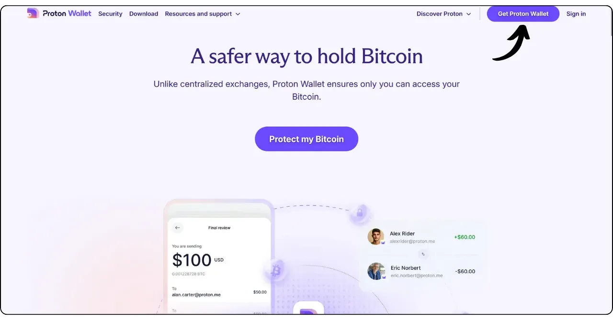

Pilih opsi berlangganan "*Gratis*", lalu klik "*Masuk*".

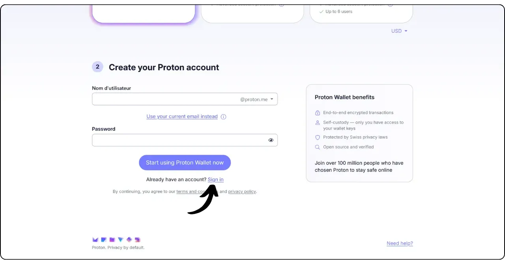

Masukkan email dan kata sandi yang terhubung dengan akun Proton kamu untuk masuk.

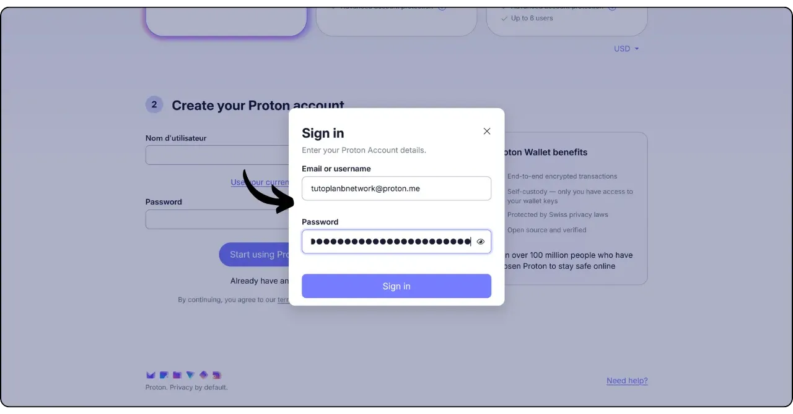

Sekarang akunmu bakal ditampilkan. Klik "*Mulai menggunakan Proton Wallet sekarang*".

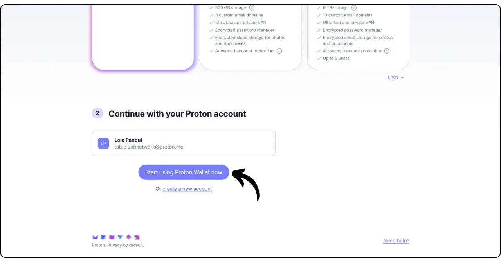

## Membuat dompet Bitcoin

Pilih mata uang fiat default untuk akunmu, lalu klik "*Buat dompet baru*".

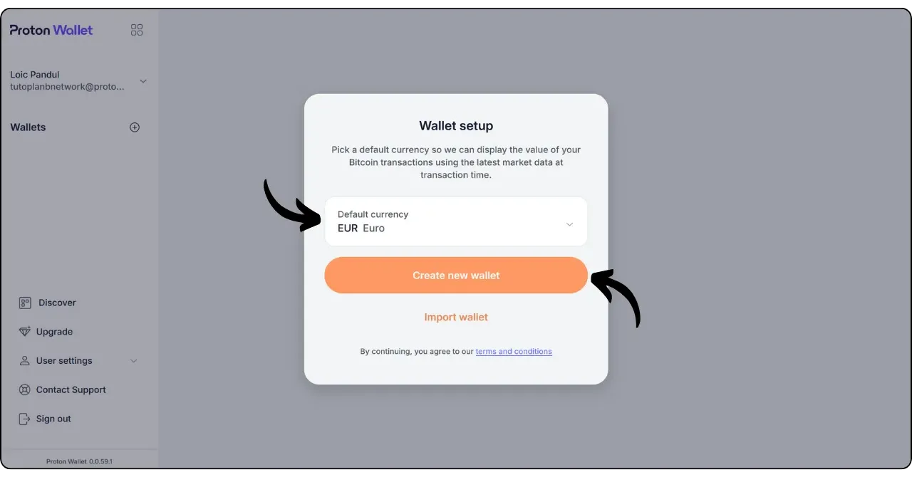

Dompet Bitcoin kamu sekarang sudah berhasil dibuat. Secara teori, kamu bisa langsung memakainya, tapi yang paling penting adalah menyimpan mnemonic kamu terlebih dulu. Caranya, klik tombol Secure your wallet di pojok kanan atas antarmuka.

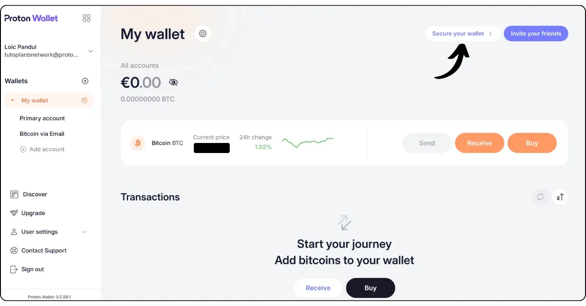

Kalau kamu belum melakukannya di Proton, kamu akan diminta untuk membuat backup akun dan mengamankannya dengan 2FA. Langkah keamanan ini berlaku untuk seluruh akun Proton kamu, tapi akan jadi lebih penting lagi ketika dompet Bitcoin sudah terintegrasi di dalamnya. Aku sangat nyaranin kamu buat mengaktifkannya.

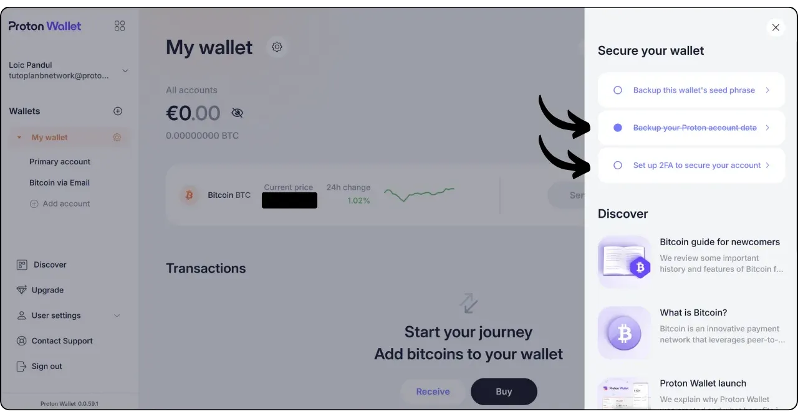

Untuk menyimpan mnemonic phrase milikmu, klik "*Cadangkan frasa unggulan dompet ini*".

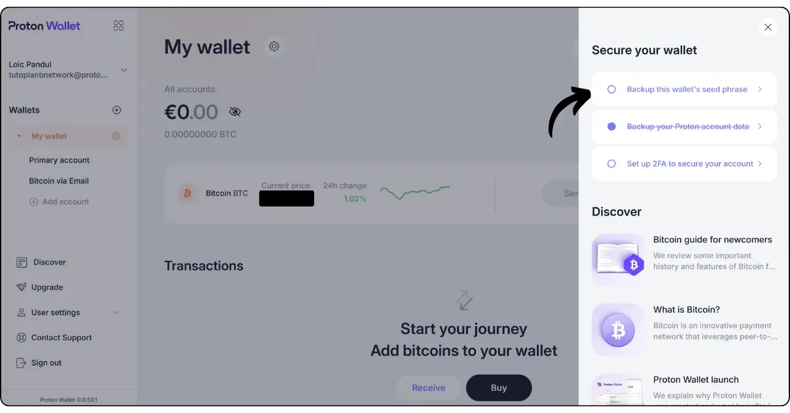

Masukkan kata sandi Proton.

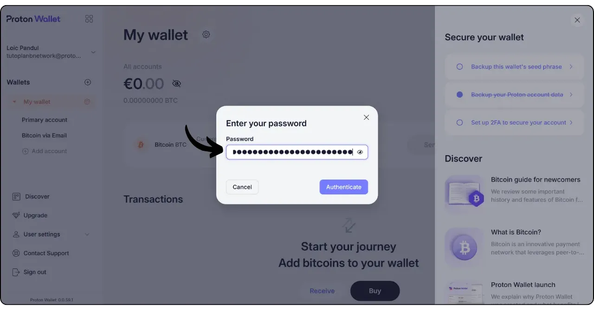

Kemudian klik "*Lihat seedphrase wallet*" untuk menampilkan frasa mnemonik wallet Anda.

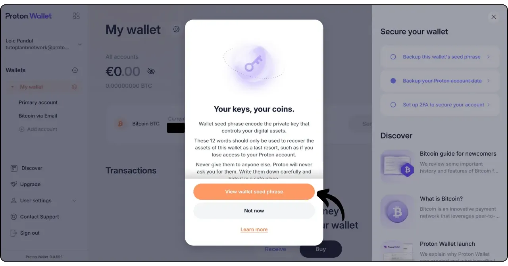

Proton Wallet akan menampilkan **seedphrase 12 kata kamu**. **Seedphrase ini memberi akses penuh tanpa batas ke semua bitcoin kamu. Siapa pun yang tahu seedphrase tersebut bisa mencuri dana kamu, bahkan tanpa harus masuk ke akun Proton**. Seedphrase ini juga bisa dipakai untuk memulihkan akses ke bitcoin kalau suatu saat kamu kehilangan akses ke akun. Karena itu, sangat penting buat menyimpannya dengan hati-hati di tempat yang aman.

Kamu bisa menuliskannya di kertas, atau kalau mau lebih aman lagi, sebaiknya ukir seedphrase itu di lempengan baja tahan karat supaya tetap terlindungi dari risiko kebakaran, banjir, atau keruntuhan.

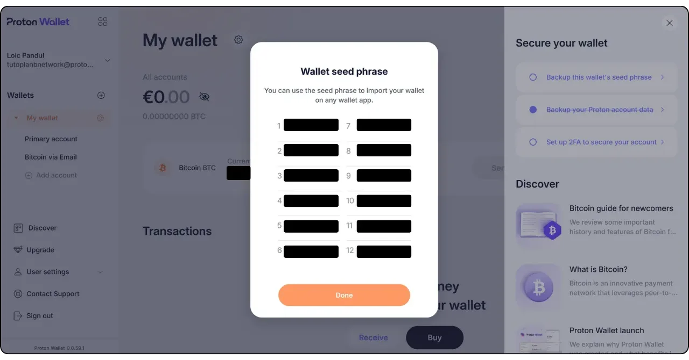

Untuk info lebih lanjut tentang cara yang tepat menyimpan dan mengelola seedphrase, aku sangat nyaranin kamu buat ikuti tutorial lain yang tersedia, terutama kalau kamu masih pemula:

https://planb.network/tutorials/wallet/backup/backup-mnemonic-22c0ddfa-fb9f-4e3a-96f9-46e2a7954270

_**Tentu saja, kamu nggak boleh memotret kata-kata ini, tidak seperti yang aku lakukan dalam tutorial ini.**_

Klik tombol "*Selesai*" setelah Anda menyimpan frasa Anda.

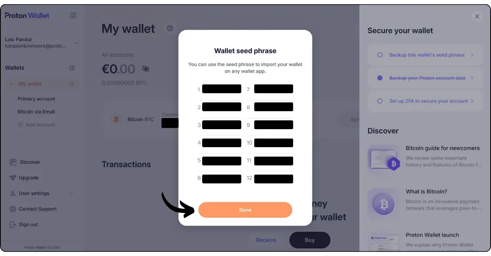

## Temukan antarmuka

Antarmuka Proton Wallet dibuat cukup intuitif. Di sisi kiri, kamu bisa lihat berbagai dompet dan akun terkait. Akun *Primary* adalah akun utama kamu. Demi menjaga privasi, bitcoin yang masuk lewat alamat email Proton akan otomatis ditempatkan di akun terpisah bernama *Bitcoin via Email.*

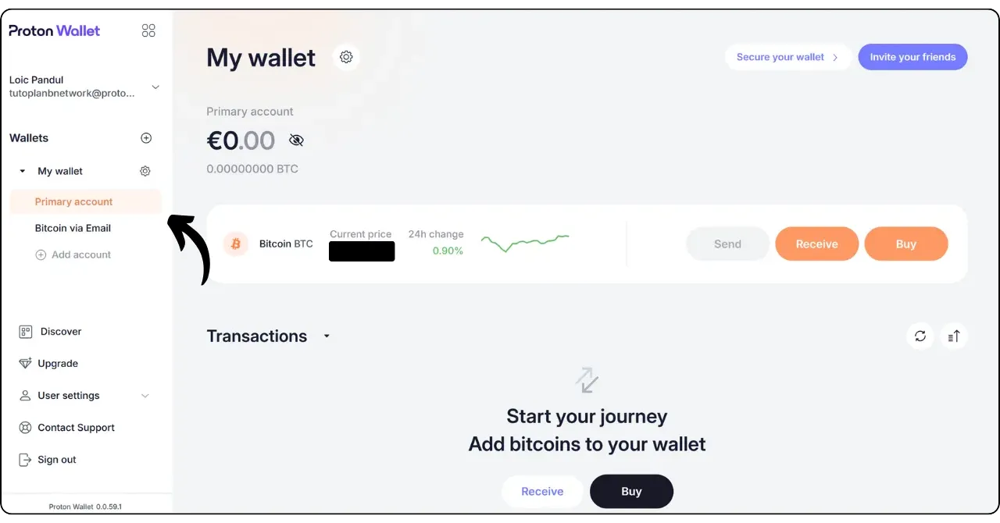

Untuk menambahkan akun baru, klik "*Tambah akun*".

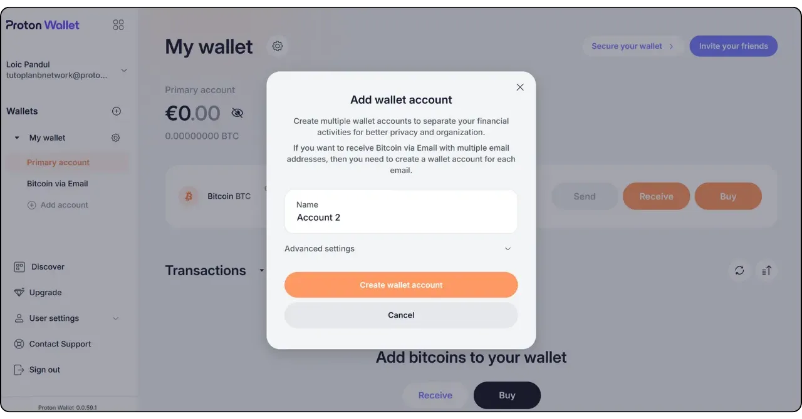

Untuk membuat portofolio baru, klik simbol "*+*" di sebelah "*Dompet*".

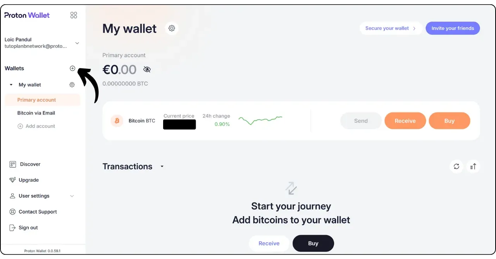

Di sinilah kamu bisa menambahkan kata sandi BIP39 ke dompet baru.

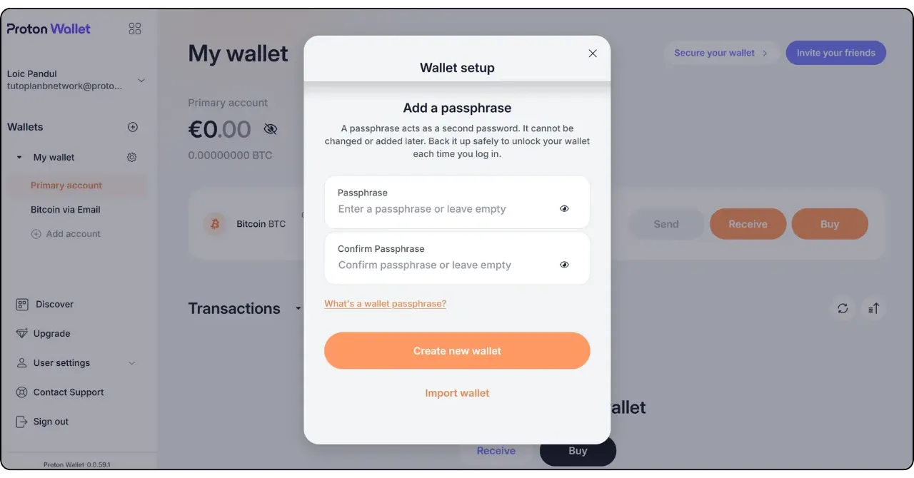

Untuk memperdalam pengetahuan tentang passphrase, aku merekomendasikan tutorial ini:

https://planb.network/tutorials/wallet/backup/passphrase-a26a0220-806c-44b4-af14-bafdeb1adce7

## Menerima bitcoin

Untuk menerima bitcoin di dompetmu, pilih akun yang diinginkan di sebelah kiri antarmuka, lalu klik tombol "*Terima*".

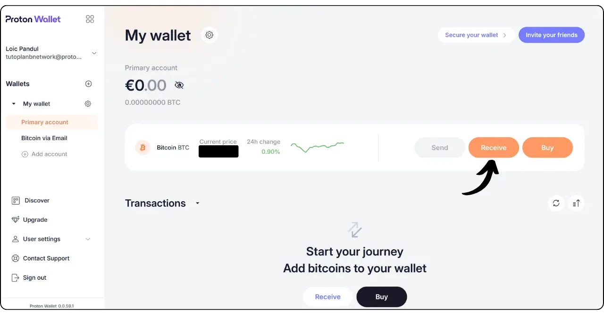

Proton Wallet kemudian secara otomatis menghasilkan alamat baru yang kosong.

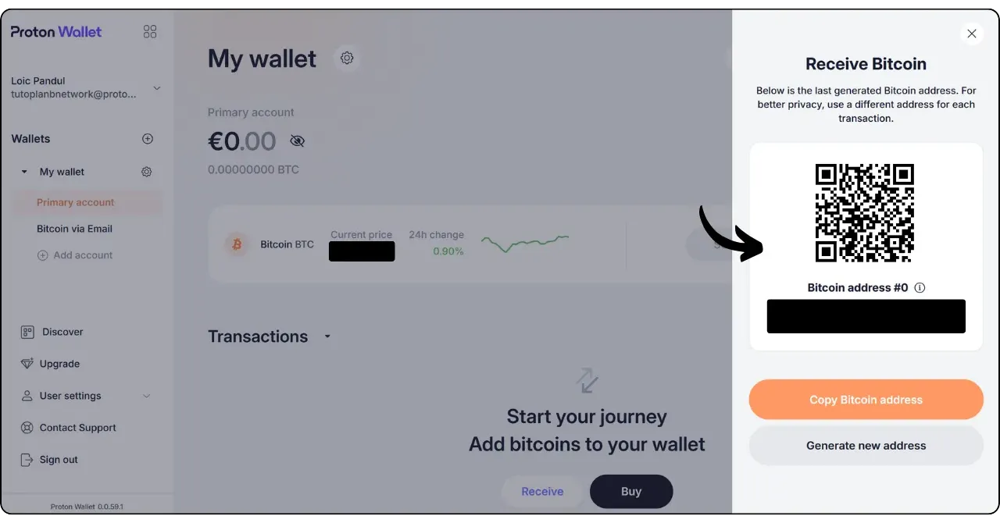

Setelah transaksi selesai, kamu akan menemukannya di bagian "*Transaksi*". Klik "*+Tambah*" untuk memberikan label pada transaksi.

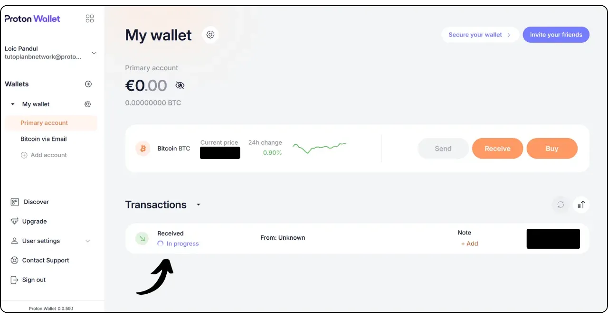

## Kirim bitcoin

Setelah kamu memiliki bitcoin di dalam dompet, kamu bisa mengirimkannya. Pilih akun pilihanmu di sisi kiri antarmuka, lalu klik "*Kirim*".

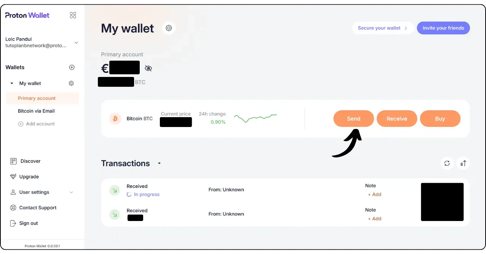

Masukkan alamat Bitcoin penerima. Kamu juga bisa scan kode QR dengan klik ikon kecil di sampingnya. Kalau mau kirim lewat email, langsung aja ketik alamat email di kolom ini. Setelah alamat dimasukkan, klik tanda panah kecil lalu pilih *Konfirmasi.*

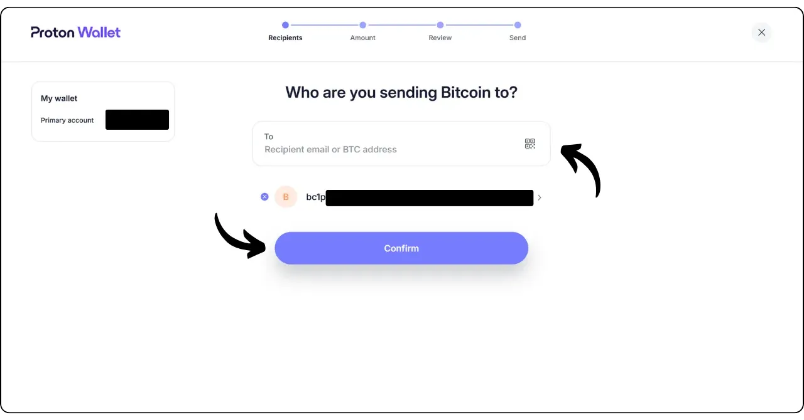

Masukkan jumlah yang akan dikirim, baik dalam mata uang fiat atau bitcoin, lalu klik "*Tinjau*".

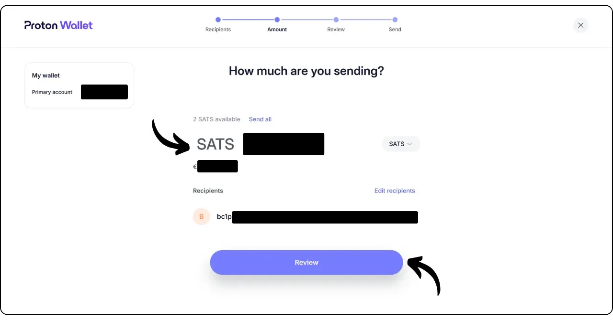

Pilih biaya transaksi berdasarkan situasi pasar saat ini.

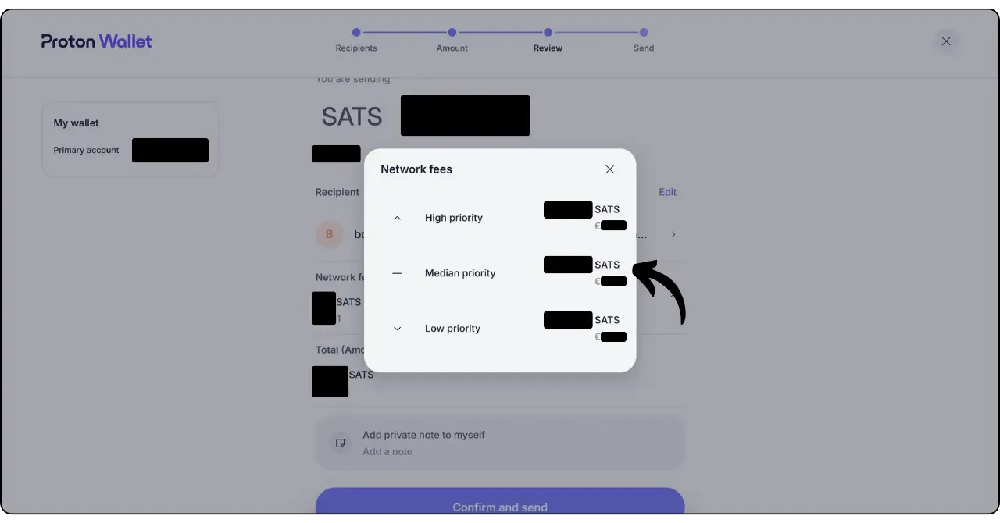

Tambahkan label pada transaksi kamu, lalu cek lagi semua detailnya. Kalau sudah benar, klik Konfirmasi dan kirim untuk menandatangani sekaligus mengirim transaksi.

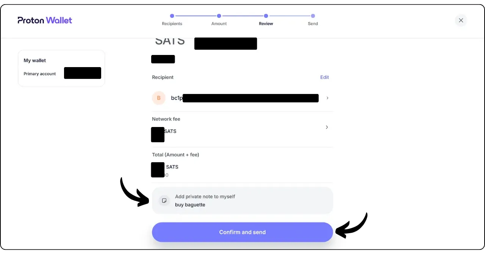

Sekarang transaksi kamu akan muncul menunggu konfirmasi di bagian "*Transaksi*" di akun milikmu.

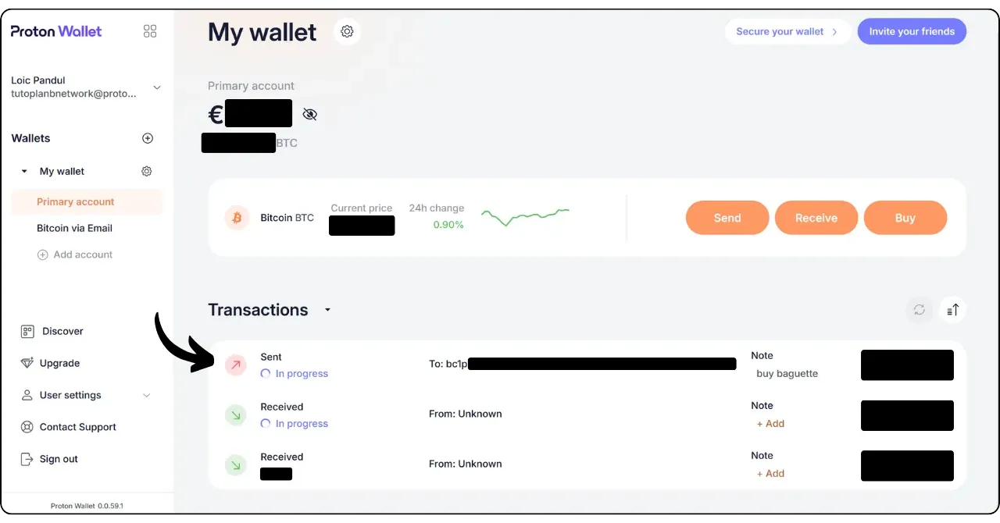

## Masuk ke aplikasi

Selain lewat klien web, Proton Wallet juga bisa diakses lewat aplikasi mobile. Dengan menautkan dompet ke akun Proton kamu, dompet akan otomatis tersinkron antara klien web dan aplikasi mobile.

Unduh Proton Wallet dari toko aplikasi yang ada di smartphone kamu:

- [Di App Store](https://apps.apple.com/us/app/proton-wallet-secure-btc/id6479609548);
- [Di Google Play Store](https://play.google.com/store/apps/details?id=me.proton.wallet.android).

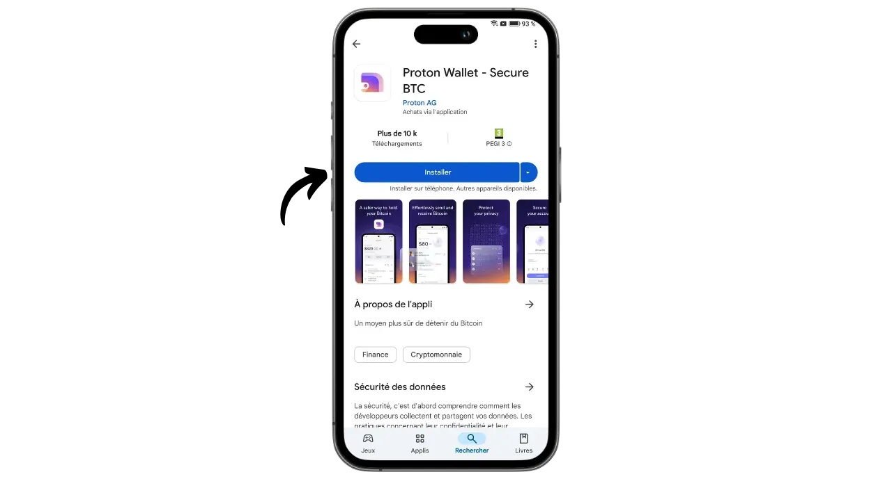

Setelah instalasi, klik "*Log in*" dan masukkan alamat email dan kata sandi Proton.

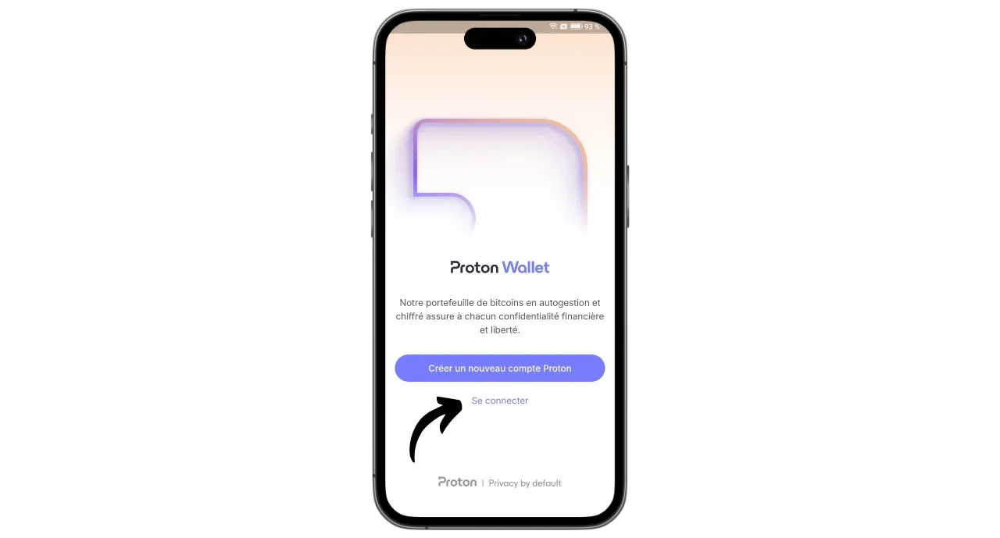

Kemudian kamu akan memiliki akses ke dompet Bitcoin milikmu, dengan fitur yang sama seperti pada klien web.

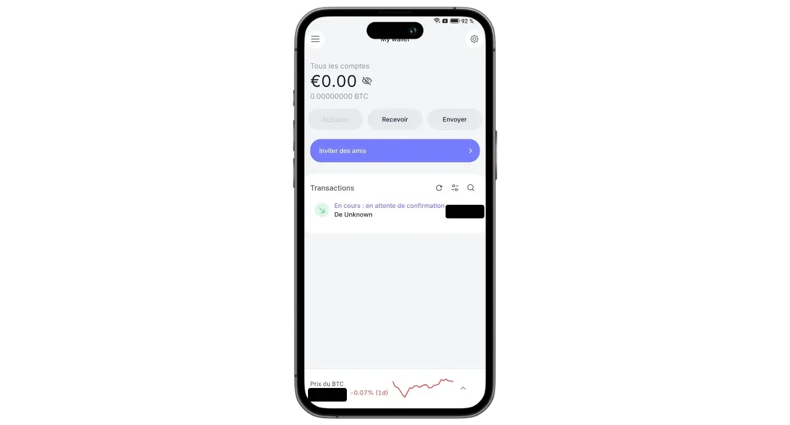

Selamat, sekarang kamu sudah tahu cara mengatur dan menggunakan Proton Wallet. Kalau kamu merasa tutorial ini bermanfaat, aku bakal seneng banget kalau kamu kasih jempol hijau di bawah. Jangan ragu juga buat bagiin artikel ini ke media sosial kamu. Makasih sudah ikut berbagi!

Kalau mau lanjut lebih jauh, aku nyaranin kamu cek juga tutorial tentang Jade Plus, hardware wallet terbaru dari Blockstream:

https://planb.network/tutorials/wallet/hardware/jade-plus-sparrow-938abf16-e10a-4618-860d-cd771373a262
