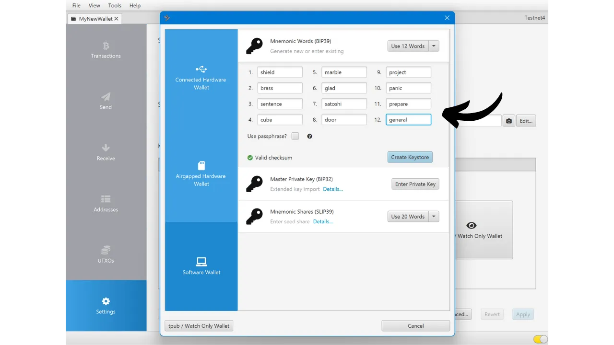

Při vytváření Bitcoin peněženky se od vás požaduje, abyste si poznamenali mnemonickou frázi, obvykle se skládající z 12 nebo 24 slov. Tato fráze vám umožňuje obnovit přístup k vašim bitcoinům v případě ztráty, poškození nebo krádeže zařízení, na kterém je vaše peněženka uložena. Předtím, než začnete používat vaši novou Bitcoin peněženku, je velmi důležité ověřit platnost této mnemonické fráze. Nejlepší způsob, jak to udělat, je provedení testu obnovy bez skutečného použití.

Tento test zahrnuje simulaci obnovy peněženky před vložením jakýchkoli bitcoinů do ní. Dokud je peněženka prázdná, simulujeme situaci, kdy je zařízení uchovávající naše klíče ztraceno, a vše, co nám zbylo, je naše mnemonická fráze pro pokus o obnovu našich bitcoinů.


## Jaký je účel?

Tento testovací proces vám umožňuje ověřit, že fyzická záloha vaší mnemonické fráze, ať už na papíře nebo kovu, je funkční. Neúspěch během tohoto testu obnovy signalizuje chybu v záloze fráze, čímž vystavuje vaše bitcoiny riziku. Na druhou stranu, pokud je test úspěšný, potvrzuje, že vaše mnemonická fráze je plně funkční, a můžete pak s klidem v duši používat tuto peněženku pro zabezpečení vašich bitcoinů.

Provedení testu obnovy bez skutečného použití má dvojí výhodu. Nejenže vám umožňuje ověřit přesnost vaší mnemonické fráze, ale také vám dává příležitost seznámit se s procesem obnovy peněženky. Tímto způsobem objevíte potenciální obtíže předtím, než se vám skutečná situace přihodí. V den, kdy budete skutečně potřebovat obnovit vaši peněženku, budete méně stresováni, protože proces již budete znát, což snižuje riziko chyby. Proto je důležité tento testovací krok nezanedbat a věnovat potřebný čas k jeho správnému provedení.

## Co je test obnovy?

Proces testu je poměrně jednoduchý:
- Po vytvoření vaší nové Bitcoin peněženky a před vložením vašich prvních satoshi si poznamenejte svědectví, jako je xpub, první přijímací adresa nebo dokonce otisk hlavního klíče;
- Poté záměrně smažte stále prázdnou peněženku, například resetováním vaší hardwarové peněženky na tovární nastavení;
- Následně simulujte obnovu vaší peněženky pouze pomocí papírových záloh vaší mnemonické fráze a vaší heslové fráze, pokud ji používáte;
- Nakonec zkontrolujte, zda se svědectví shoduje s tím v regenerovaném portfoliu. Pokud se informace shodují, můžete být ujištěni o spolehlivosti vaší fyzické zálohy, a poté můžete poslat vaše první bitcoiny do této peněženky.
Buďte opatrní, během testu obnovy **musíte použít stejné zařízení určené pro vaši finální peněženku**, aby nedošlo ke zvýšení útočné plochy vaší peněženky. Například, pokud vytvoříte peněženku na Trezor Safe 5, ujistěte se, že test obnovy provedete na tomto stejném Trezor Safe 5. Je důležité nevkládat vaši obnovovací frázi do jakéhokoli jiného softwaru, protože by to ohrozilo bezpečnost poskytovanou vaší hardwarovou peněženkou, i když je peněženka stále prázdná.

## Jak provést test obnovy?

V tomto návodu vám vysvětlím, jak provést test obnovy na Bitcoin softwarové peněžence, používaje Sparrow Wallet (pro hot peněženku). Proces však zůstává stejný pro jakýkoli jiný typ zařízení. Opět, **pokud používáte hardwarovou peněženku, neprovádějte test obnovy na Sparrow Wallet** (viz předchozí sekce).
Právě jsem si vytvořil novou hot peněženku na Sparrow Wallet. V tuto chvíli jsem do ní ještě neposlal žádné bitcoiny. Je prázdná.


Pečlivě jsem si zapsal svou 12slovnou mnemonickou frázi na kus papíru. A protože chci zvýšit bezpečnost této peněženky, nastavil jsem také BIP39 heslo, které jsem si uložil na další kus papíru:

```txt
1. štít
2. mosaz
3. věta
4. krychle
5. mramor
6. rád
7. satoshi
8. dveře
9. projekt
10. panika
11. připravit
12. obecný
```

```text
Heslo: YfaicGzXH9t5C#g&47Kzbc$JL
```

***Samozřejmě byste nikdy neměli sdílet svou mnemonickou frázi a heslo na internetu, na rozdíl od toho, co dělám v tomto tutoriálu. Tato ukázková peněženka nebude použita a na konci tutoriálu bude smazána.***

Nyní si na návrh zapíšu svědectví z mé peněženky. Můžete si vybrat různé informace, jako je první přijímací adresa, xpub nebo otisk hlavního klíče. Osobně doporučuji vybrat první přijímací adresu. To vám umožní ověřit, že jste schopni najít úplnou první odvozenou cestu vedoucí k této adrese.

Na Sparrow klikněte na záložku "*Adresy*".


Poté si na kus papíru zapište úplně první přijímací adresu vaší peněženky. V mém příkladu je adresa:

```txt
Po zapsání informací přejděte do menu "*Soubor*", poté vyberte "*Smazat peněženku*". Připomínám vám ještě jednou, že vaše Bitcoinová peněženka musí být prázdná, než s touto operací pokračujete.


Pokud je vaše peněženka skutečně prázdná, potvrďte smazání peněženky.


Nyní musíte opakovat proces vytváření peněženky, ale použít naše papírové zálohy. Klikněte na menu "*Soubor*" a poté na "*Nová peněženka*".


Znovu zadejte název vaší peněženky.


V menu "*Typ skriptu*" musíte vybrat stejný typ skriptu jako u peněženky, kterou jste dříve smazali.


Poté klikněte na tlačítko "*Nová nebo importovaná softwarová peněženka*".


Vyberte správný počet slov pro vaše semínko.


Do softwaru zadejte svou mnemonickou frázi. Pokud se objeví zpráva "*Neplatný kontrolní součet*", to znamená, že záloha vaší mnemonické fráze je nesprávná. Poté budete muset začít s vytvářením vaší peněženky od začátku, protože váš test obnovy selhal.


Pokud máte heslo, jako v mém případě, také jej zadejte.



Klikněte na "*Vytvořit úložiště klíčů*", poté na "*Importovat úložiště klíčů*".


A nakonec klikněte na tlačítko "*Použít*".


Nyní se můžete vrátit na záložku "*Adresy*".


Nakonec ověřte, zda první přijímací adresa odpovídá té, kterou jste si jako svědka poznamenali na svůj koncept.


Pokud se přijímací adresy shodují, váš test obnovy je úspěšný a můžete používat svou novou Bitcoin peněženku. Pokud se neshodují, může to znamenat buď chybu ve výběru typu skriptu, což způsobuje nesprávnou cestu derivace, nebo problém se zálohou vaší mnemonické fráze nebo vaší heslové fráze. V obou případech důrazně doporučuji začít od začátku a vytvořit novou Bitcoin peněženku od základů, abyste se vyhnuli jakémukoli riziku. Tentokrát si dejte pozor, abyste mnemonickou frázi poznamenali bez chyb.
Gratuluji, nyní jste plně připraveni provádět test obnovy! Doporučuji vám tento proces zobecnit pro vytváření všech vašich Bitcoin peněženek. Pokud se vám tento návod zdál užitečný, ocenil bych, kdybyste níže mohli zanechat palce nahoru. Neváhejte tento článek sdílet na svých sociálních sítích. Velmi vám děkuji!