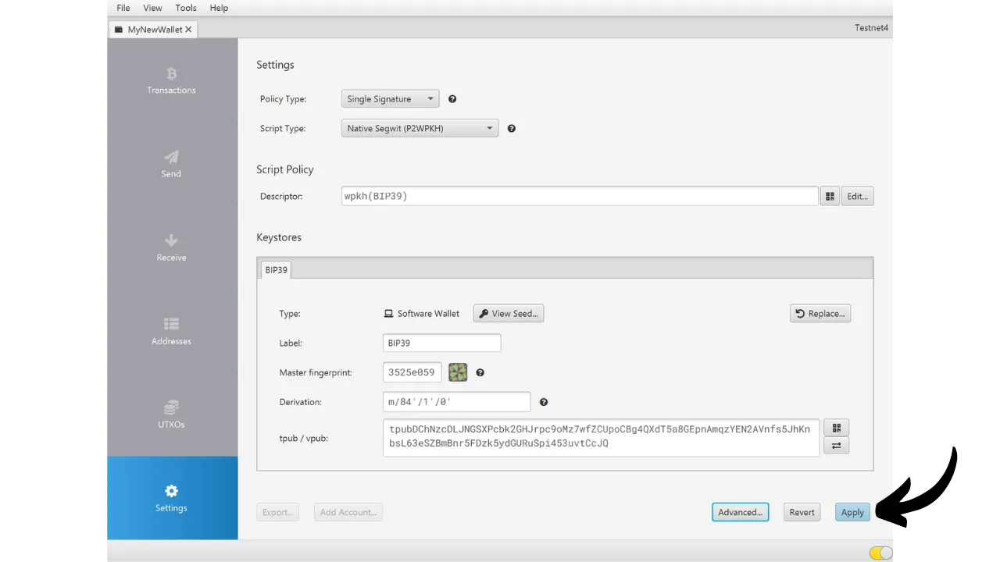

Wenn Sie eine Bitcoin-Wallet erstellen, werden Sie aufgefordert, eine mnemonische Phrase zu notieren, die normalerweise aus 12 oder 24 Wörtern besteht. Diese Phrase ermöglicht es Ihnen, den Zugang zu Ihren Bitcoins wiederherzustellen, falls das Gerät, auf dem Ihre Wallet gespeichert ist, verloren geht, beschädigt wird oder gestohlen wird. Bevor Sie Ihre neue Bitcoin-Wallet in Gebrauch nehmen, ist es sehr wichtig, die Gültigkeit dieser mnemonischen Phrase zu überprüfen. Der beste Weg, dies zu tun, ist die Durchführung eines Dry-Run-Recovery-Tests.

Dieser Test beinhaltet die Simulation einer Wallet-Wiederherstellung, bevor irgendwelche Bitcoins darauf eingezahlt werden. Solange die Wallet leer ist, simulieren wir eine Situation, in der das Gerät, das unsere Schlüssel hostet, verloren gegangen ist, und alles, was uns bleibt, ist unsere mnemonische Phrase, um zu versuchen, unsere Bitcoins wiederherzustellen.


## Was ist der Zweck?

Dieser Testprozess ermöglicht es Ihnen zu überprüfen, ob das physische Backup Ihrer mnemonischen Phrase, ob auf Papier oder Metall, funktionsfähig ist. Ein Fehlschlag während dieses Recovery-Tests signalisiert einen Fehler im Backup der Phrase und setzt somit Ihre Bitcoins einem Risiko aus. Andererseits, wenn der Test erfolgreich ist, bestätigt dies, dass Ihre mnemonische Phrase voll funktionsfähig ist, und Sie können dann mit Ruhe Bitcoins in dieser Wallet sichern.

Die Durchführung eines Dry-Run-Recovery-Tests hat einen doppelten Vorteil. Nicht nur, dass Sie die Genauigkeit Ihrer mnemonischen Phrase überprüfen können, sondern es gibt Ihnen auch die Gelegenheit, sich mit dem Wallet-Wiederherstellungsprozess vertraut zu machen. Auf diese Weise entdecken Sie potenzielle Schwierigkeiten, bevor sich eine reale Situation Ihnen präsentiert. Am Tag, an dem Sie tatsächlich Ihre Wallet wiederherstellen müssen, werden Sie weniger gestresst sein, da Sie den Prozess bereits kennen, was das Risiko eines Fehlers reduziert. Deshalb ist es wichtig, diesen Testschritt nicht zu vernachlässigen und sich die notwendige Zeit zu nehmen, um ihn korrekt durchzuführen.

## Was ist ein Recovery-Test?

Der Prozess des Tests ist ziemlich einfach:
- Nachdem Sie Ihre neue Bitcoin-Wallet erstellt haben und bevor Sie Ihre ersten Satoshis einzahlen, notieren Sie eine Zeugeninformation wie eine xpub, die erste Empfangsadresse oder sogar den Master-Key-Fingerabdruck;
- Löschen Sie dann absichtlich die noch leere Wallet, zum Beispiel durch Zurücksetzen Ihres Hardware-Wallets auf die Werkseinstellungen;
- Simulieren Sie anschließend eine Wiederherstellung Ihrer Wallet, indem Sie nur die Papier-Backups Ihrer mnemonischen Phrase und Ihrer Passphrase verwenden, falls Sie eine verwenden;
- Überprüfen Sie schließlich, ob die Zeugeninformationen mit denen des neu generierten Portfolios übereinstimmen. Wenn die Informationen übereinstimmen, können Sie sich auf die Zuverlässigkeit Ihres physischen Backups verlassen, und Sie können dann Ihre ersten Bitcoins an diese Wallet senden.
Seien Sie vorsichtig, während eines Recovery-Tests, **müssen Sie dasselbe Gerät verwenden, das für Ihre endgültige Wallet vorgesehen ist**, um die Angriffsfläche Ihrer Wallet nicht zu erhöhen. Wenn Sie beispielsweise eine Wallet auf einem Trezor Safe 5 erstellen, stellen Sie sicher, dass Sie den Recovery-Test auf diesemselben Trezor Safe 5 durchführen. Es ist wichtig, Ihre Wiederherstellungsphrase nicht in eine andere Software einzugeben, da dies die Sicherheit, die Ihr Hardware-Wallet bietet, kompromittieren würde, selbst wenn die Wallet noch leer ist.

## Wie führt man einen Recovery-Test durch?

In diesem Tutorial werde ich erklären, wie man einen Recovery-Test auf einer Bitcoin-Software-Wallet durchführt, unter Verwendung von Sparrow Wallet (für ein Hot Wallet). Der Prozess bleibt jedoch für jede andere Art von Gerät gleich. Nochmals, **wenn Sie ein Hardware-Wallet verwenden, führen Sie den Recovery-Test nicht auf Sparrow Wallet durch** (siehe vorheriger Abschnitt).
Ich habe gerade eine neue Hot Wallet bei Sparrow Wallet erstellt. Im Moment habe ich noch keine Bitcoins darauf gesendet. Sie ist leer.


Ich habe meine 12-Wort-Mnemonic-Phrase sorgfältig auf einem Stück Papier notiert. Und da ich die Sicherheit dieser Wallet erhöhen möchte, habe ich auch eine BIP39-Passphrase eingerichtet, die ich auf einem anderen Stück Papier gespeichert habe:

```txt
1. Schild
2. Messing
3. Satz
4. Würfel
5. Marmor
6. froh
7. Satoshi
8. Tür
9. Projekt
10. Panik
11. vorbereiten
12. allgemein
```

```text
Passphrase: YfaicGzXH9t5C#g&47Kzbc$JL
```

***Offensichtlich sollte man seine Mnemonic-Phrase und seine Passphrase niemals im Internet teilen, anders als ich es in diesem Tutorial mache. Diese Beispiel-Wallet wird nicht verwendet und am Ende des Tutorials gelöscht.***

Ich werde jetzt auf einem Entwurf ein Zeugnisstück Informationen aus meiner Wallet notieren. Man kann verschiedene Informationen wählen, wie die erste Empfangsadresse, den xpub oder den Master Key Fingerprint. Persönlich empfehle ich, die erste Empfangsadresse zu wählen. Dies ermöglicht es Ihnen zu überprüfen, dass Sie den kompletten ersten Ableitungspfad finden können, der zu dieser Adresse führt.

Klicken Sie bei Sparrow auf den Tab "*Adressen*".


Notieren Sie dann auf einem Stück Papier die allererste Empfangsadresse Ihrer Wallet. In meinem Beispiel ist die Adresse:

```txt
Nachdem Sie die Informationen notiert haben, gehen Sie zum Menü "*Datei*", dann wählen Sie "*Wallet löschen*". Ich erinnere Sie noch einmal daran, dass Ihre Bitcoin-Wallet leer sein muss, bevor Sie mit dieser Operation fortfahren.


Wenn Ihre Wallet tatsächlich leer ist, bestätigen Sie die Löschung Ihrer Wallet.


Nun müssen Sie den Wallet-Erstellungsprozess wiederholen, jedoch unter Verwendung unserer Papier-Backups. Klicken Sie auf das Menü "*Datei*" und dann auf "*Neue Wallet*".


Geben Sie den Namen Ihrer Wallet erneut ein.


Im Menü "*Script Type*" müssen Sie denselben Skripttyp wie bei der zuvor gelöschten Wallet wählen.


Dann klicken Sie auf den Button "*Neue oder importierte Software-Wallet*".


Wählen Sie die korrekte Anzahl an Wörtern für Ihren Seed.


Geben Sie Ihre Mnemonic-Phrase in die Software ein. Wenn eine Meldung "*Ungültige Prüfsumme*" erscheint, deutet dies darauf hin, dass das Backup Ihrer Mnemonic-Phrase falsch ist. Sie müssen dann die Erstellung Ihrer Wallet von Grund auf neu beginnen, da Ihr Wiederherstellungstest fehlgeschlagen ist.


Wenn Sie eine Passphrase haben, wie in meinem Fall, geben Sie diese ebenfalls ein.


Klicken Sie auf "*Keystore erstellen*", dann auf "*Keystore importieren*".


Und schließlich klicken Sie auf den Button "*Anwenden*".


Sie können nun zum Tab "*Adressen*" zurückkehren.


Schließlich überprüfen Sie, ob die erste Empfangsadresse mit der übereinstimmt, die Sie als Zeugen auf Ihrem Entwurf notiert hatten.


Wenn die Empfangsadressen übereinstimmen, ist Ihr Wiederherstellungstest erfolgreich, und Sie können Ihr neues Bitcoin-Wallet verwenden. Stimmen sie nicht überein, kann dies entweder auf einen Fehler bei der Auswahl des Skripttyps hinweisen, was den Ableitungspfad falsch macht, oder auf ein Problem mit der Sicherung Ihrer mnemonischen Phrase oder Ihres Passwortsatzes. In beiden Fällen empfehle ich dringend, von vorne zu beginnen und ein neues Bitcoin-Wallet von Grund auf neu zu erstellen, um jegliches Risiko zu vermeiden. Achten Sie diesmal darauf, die mnemonische Phrase ohne Fehler zu notieren.
Herzlichen Glückwunsch, Sie sind jetzt auf dem neuesten Stand, wie man einen Wiederherstellungstest durchführt! Ich rate Ihnen, diesen Prozess für die Erstellung all Ihrer Bitcoin-Wallets zu verallgemeinern. Wenn Sie dieses Tutorial hilfreich fanden, würde ich mich freuen, wenn Sie unten einen Daumen hoch hinterlassen könnten. Fühlen Sie sich frei, diesen Artikel in Ihren sozialen Netzwerken zu teilen. Vielen Dank!