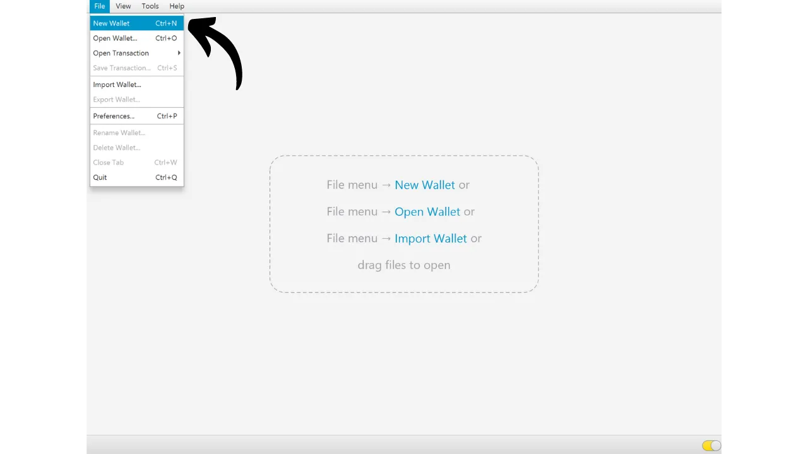
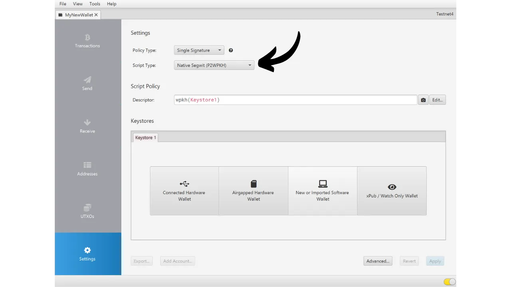

Al crear una cartera de Bitcoin, se te pide anotar una frase mnemotécnica, que generalmente consiste en 12 o 24 palabras. Esta frase te permite recuperar el acceso a tus bitcoins en caso de pérdida, daño o robo del dispositivo que aloja tu cartera. Antes de empezar a usar tu nueva cartera de Bitcoin, es muy importante verificar la validez de esta frase mnemotécnica. La mejor manera de hacerlo es realizando una prueba de recuperación en seco.

Esta prueba implica simular una restauración de la cartera antes de depositar cualquier bitcoin en ella. Mientras la cartera esté vacía, simulamos una situación en la que el dispositivo que aloja nuestras claves se pierde, y todo lo que nos queda es nuestra frase mnemotécnica para intentar recuperar nuestros bitcoins.


## ¿Cuál es el propósito?

Este proceso de prueba te permite verificar que la copia física de tu frase mnemotécnica, ya sea en papel o metal, es funcional. Un fallo durante esta prueba de recuperación señala un error en la copia de seguridad de la frase, poniendo así en riesgo tus bitcoins. Por otro lado, si la prueba es exitosa, confirma que tu frase mnemotécnica está completamente operativa, y entonces puedes asegurar bitcoins con tranquilidad usando esta cartera.

Realizar una prueba de recuperación en seco tiene una doble ventaja. No solo te permite comprobar la precisión de tu frase mnemotécnica, sino que también te da la oportunidad de familiarizarte con el proceso de recuperación de la cartera. De esta manera, descubrirás posibles dificultades antes de que se te presente una situación real. El día que realmente necesites recuperar tu cartera, estarás menos estresado, ya que ya conocerás el proceso, reduciendo el riesgo de error. Por eso es importante no descuidar este paso de prueba y tomarse el tiempo necesario para hacerlo correctamente.

## ¿Qué es una prueba de recuperación?

El proceso de la prueba es bastante simple:
- Después de crear tu nueva cartera de Bitcoin, y antes de depositar tus primeros satoshis, anota una información de testigo como un xpub, la primera dirección de recepción, o incluso la huella digital de la clave maestra;
- Luego, elimina deliberadamente la cartera aún vacía, por ejemplo, restableciendo tu cartera de hardware a los ajustes de fábrica;
- A continuación, simula una recuperación de tu cartera usando solo las copias de seguridad en papel de tu frase mnemotécnica y tu frase de paso si usas una;
- Finalmente, verifica si la información de testigo coincide con la de la cartera regenerada. Si la información coincide, puedes estar seguro de la fiabilidad de tu copia de seguridad física, y entonces puedes enviar tus primeros bitcoins a esta cartera.
Ten cuidado, durante una prueba de recuperación, **debes usar el mismo dispositivo destinado para tu cartera final**, para no aumentar la superficie de ataque de tu cartera. Por ejemplo, si creas una cartera en un Trezor Safe 5, asegúrate de realizar la prueba de recuperación en este mismo Trezor Safe 5. Es importante no introducir tu frase de recuperación en ningún otro software, ya que esto comprometería la seguridad proporcionada por tu cartera de hardware, incluso si la cartera aún está vacía.

## ¿Cómo realizar una prueba de recuperación?

En este tutorial, explicaré cómo realizar una prueba de recuperación en una cartera de software de Bitcoin, usando Sparrow Wallet (para una cartera caliente). Sin embargo, el proceso sigue siendo el mismo para cualquier otro tipo de dispositivo. De nuevo, **si estás usando una cartera de hardware, no realices la prueba de recuperación en Sparrow Wallet** (ver la sección anterior).
Acabo de crear una nueva hot wallet en Sparrow Wallet. Por el momento, no he enviado ningún bitcoin a ella. Está vacía.


He anotado cuidadosamente mi frase mnemotécnica de 12 palabras en un pedazo de papel. Y dado que quiero mejorar la seguridad de esta wallet, también he configurado una passphrase BIP39 que he guardado en otro pedazo de papel:

```txt
1. escudo
2. latón
3. oración
4. cubo
5. mármol
6. contento
7. satoshi
8. puerta
9. proyecto
10. pánico
11. preparar
12. general
```

```text
Passphrase: YfaicGzXH9t5C#g&47Kzbc$JL
```

***Obviamente, nunca deberías compartir tu frase mnemotécnica y tu passphrase en internet, a diferencia de lo que estoy haciendo en este tutorial. Esta wallet de ejemplo no será utilizada y será eliminada al final del tutorial.***

Ahora anotaré en un borrador una pieza de información de testigo de mi wallet. Puedes elegir diferentes piezas de información, como la primera dirección de recepción, el xpub o la huella digital de la llave maestra. Personalmente, recomiendo elegir la primera dirección de recepción. Esto te permite verificar que eres capaz de encontrar el camino de derivación completo que lleva a esta dirección.

En Sparrow, haz clic en la pestaña "*Direcciones*".


Luego, anota en un pedazo de papel la primera dirección de recepción de tu wallet. En mi ejemplo, la dirección es:

```txt
Después de anotar la información, ve al menú "*Archivo*", luego selecciona "*Eliminar Wallet*". Te recuerdo una vez más que tu wallet de Bitcoin debe estar vacía antes de proceder con esta operación.


Si tu wallet está efectivamente vacía, confirma la eliminación de tu wallet.


Ahora necesitas repetir el proceso de creación de la wallet, pero utilizando nuestros respaldos en papel. Haz clic en el menú "*Archivo*" y luego en "*Nueva Wallet*".


Ingresa nuevamente el nombre de tu wallet.



En el menú "*Tipo de Script*", necesitas elegir el mismo tipo de script que la wallet que previamente eliminaste.


Luego haz clic en el botón "*Nueva o Importada Software Wallet*".



Selecciona el número correcto de palabras para tu semilla.


Ingresa tu frase mnemotécnica en el software. Si aparece un mensaje de "*Checksum Inválido*", esto indica que el respaldo de tu frase mnemotécnica es incorrecto. Entonces tendrás que empezar la creación de tu wallet desde cero, ya que tu prueba de recuperación ha fallado.


Si tienes una passphrase, como en mi caso, también ingrésala.


Haz clic en "*Crear Keystore*", luego en "*Importar Keystore*".


Y finalmente, haz clic en el botón "*Aplicar*".


Ahora puedes volver a la pestaña "*Direcciones*".


Finalmente, verifica que la primera dirección de recepción coincida con la que habías anotado como testigo en tu borrador.


Si las direcciones de recepción coinciden, tu prueba de recuperación ha sido exitosa, y puedes usar tu nueva cartera de Bitcoin. Si no coinciden, esto puede indicar ya sea un error en la elección del tipo de script, lo que hace que la ruta de derivación sea incorrecta, o un problema con la copia de seguridad de tu frase mnemotécnica o tu frase de paso. En ambos casos, te recomiendo encarecidamente empezar desde cero y crear una nueva cartera de Bitcoin desde el principio para evitar cualquier riesgo. Esta vez, asegúrate de anotar la frase mnemotécnica sin errores.
¡Felicidades, ahora estás al día sobre cómo realizar una prueba de recuperación! Te aconsejo generalizar este proceso para la creación de todas tus carteras de Bitcoin. Si encontraste útil este tutorial, te agradecería mucho si pudieras dejar un pulgar arriba abajo. No dudes en compartir este artículo en tus redes sociales. ¡Muchas gracias!