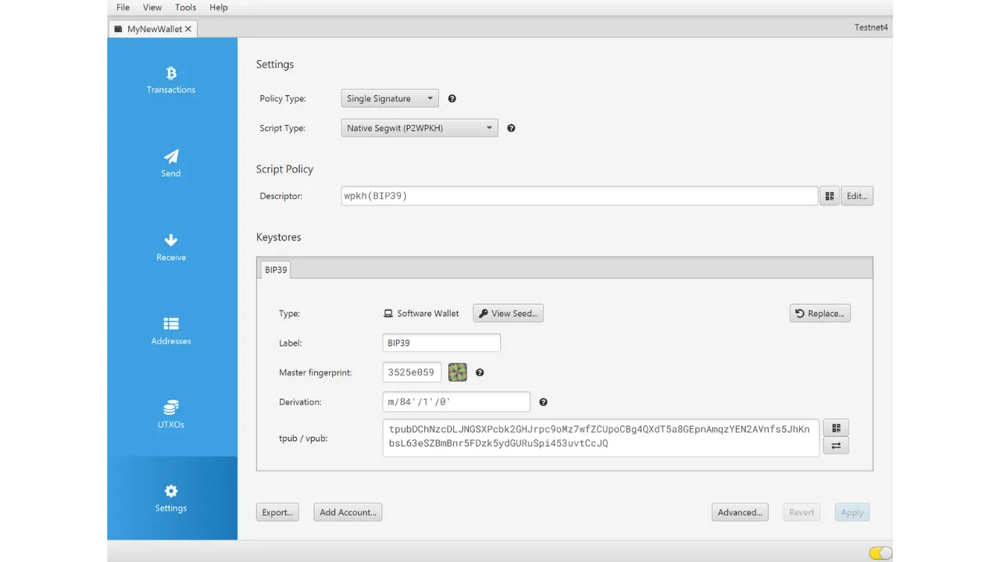

Bitcoin'i rahakoti loomisel palutakse teil üles märkida mnemooniline fraas, mis tavaliselt koosneb 12 või 24 sõnast. See fraas võimaldab teil taastada juurdepääsu oma bitcoinidele juhul, kui seade, kus teie rahakott asub, kaob, saab kahjustada või varastatakse. Enne uue Bitcoin'i rahakoti kasutamist on väga oluline kontrollida selle mnemoonilise fraasi kehtivust. Parim viis selleks on teostada kuiva jooksuga taastamise test.

See test hõlmab rahakoti taastamise simuleerimist enne ühtegi bitcoini sinna hoiustamist. Niikaua kui rahakott on tühi, simuleerime olukorda, kus seade, mis hoiab meie võtmeid, on kadunud, ja kõik, mis meil on jäänud, on meie mnemooniline fraas, et üritada taastada meie bitcoine.


## Mis on eesmärk?

See testimisprotsess võimaldab teil kontrollida, kas teie mnemoonilise fraasi füüsiline varukoopia, olgu see siis paberil või metallil, on toimiv. Ebaõnnestumine selle taastamise testi ajal näitab viga fraasi varukoopias, seades seeläbi ohtu teie bitcoinid. Teisest küljest, kui test on edukas, kinnitab see, et teie mnemooniline fraas on täielikult töökorras, ja saate seejärel oma bitcoine selles rahakotis rahuliku südamega turvata.

Kuiva jooksuga taastamise testi tegemisel on kahekordne eelis. Mitte ainult ei võimalda see teil kontrollida oma mnemoonilise fraasi täpsust, vaid annab teile ka võimaluse tutvuda rahakoti taastamise protsessiga. Nii avastate võimalikud raskused enne, kui tegelik olukord teile esitatakse. Päeval, mil peate tegelikult oma rahakotti taastama, olete vähem stressis, kuna teate juba protsessi, vähendades vea riski. Seetõttu on oluline mitte eirata seda testimisetappi ja võtta vajalik aeg, et seda korrektselt teha.

## Mis on taastamise test?

Testi protsess on üsna lihtne:
- Pärast uue Bitcoin'i rahakoti loomist ja enne oma esimeste satoshi'de hoiustamist märkige üles tunnistaja informatsioon, nagu näiteks xpub, esimene vastuvõttev aadress või isegi peamise võtme sõrmejälg;
- Seejärel kustutage tahtlikult veel tühi rahakott, näiteks lähtestades oma riistvara rahakoti tehaseseadetele;
- Järgmisena simuleerige oma rahakoti taastamist kasutades ainult oma mnemoonilise fraasi ja paroolifraasi paberil varukoopiaid, kui te neid kasutate;
- Lõpuks kontrollige, kas tunnistaja informatsioon ühtib taasloodud portfelli omaga. Kui informatsioon ühtib, võite olla kindel oma füüsilise varukoopia usaldusväärsuses ja seejärel saata oma esimesed bitcoinid sellesse rahakotti.
Olge ettevaatlik, taastamise testi ajal **peate kasutama sama seadet, mis on ette nähtud teie lõplikuks rahakotiks**, et mitte suurendada oma rahakoti ründepinda. Näiteks, kui loote rahakoti Trezor Safe 5 peal, veenduge, et teostate taastamise testi sellel samal Trezor Safe 5-l. On oluline mitte sisestada oma taastefraasi ühtegi teise tarkvarasse, kuna see kompromiteeriks teie riistvara rahakoti poolt pakutavat turvalisust, isegi kui rahakott on veel tühi.

## Kuidas teostada taastamise testi?

Selles õpetuses selgitan, kuidas teostada taastamise testi Bitcoin'i tarkvara rahakotil, kasutades Sparrow Wallet'i (sooja rahakoti jaoks). Siiski jääb protsess samaks mis tahes muu tüüpi seadme puhul. Taaskord, **kui kasutate riistvara rahakotti, ärge teostage taastamise testi Sparrow Wallet'is** (vt eelmine jaotis).
Ma olen just loonud uue kuum rahakoti Sparrow Wallet'is. Praegu ei ole ma sinna veel ühtegi bitcoini saatnud. See on tühi.


Olen hoolikalt üles märkinud oma 12-sõnalise mnemoonilise fraasi paberitükile. Ja kuna tahan selle rahakoti turvalisust suurendada, olen seadistanud ka BIP39 paroolifraasi, mille olen salvestanud teisele paberitükile:

```txt
1. kilp
2. messing
3. lause
4. kuup
5. marmor
6. rõõmus
7. satoshi
8. uks
9. projekt
10. paanika
11. valmistu
12. üldine
```

```text
Paroolifraas: YfaicGzXH9t5C#g&47Kzbc$JL
```

***Ilmselgelt ei tohiks te kunagi jagada oma mnemoonilist fraasi ja oma paroolifraasi internetis, erinevalt sellest, mida ma teen selles õpetuses. See näidisrahakott ei hakka olema kasutuses ja see kustutatakse õpetuse lõpus.***

Ma märgin nüüd mustandile üles tunnistuse osa oma rahakotist. Võite valida erinevaid teabe osi, nagu esimene vastuvõttev aadress, xpub või peamise võtme sõrmejälg. Isiklikult soovitan valida esimese vastuvõtva aadressi. See võimaldab teil kontrollida, kas suudate leida täieliku esimese tuletusteekonna, mis viib selle aadressini.

Sparrow'is klõpsake vahekaardil "*Addresses*".


Seejärel märkige paberitükile üles oma rahakoti esimene vastuvõttev aadress. Minu näites on aadress:

```txt
Pärast teabe ülesmärkimist minge "*File*" menüüsse, seejärel valige "*Delete Wallet*". Tuletan teile veel kord meelde, et teie Bitcoin'i rahakott peab enne selle toimingu sooritamist olema tühi.


Kui teie rahakott on tõepoolest tühi, kinnitage rahakoti kustutamine.


Nüüd peate kordama rahakoti loomise protsessi, kasutades meie paberil varukoopiaid. Klõpsake "*File*" menüül ja seejärel "*New Wallet*".


Sisestage oma rahakoti nimi uuesti.


"*Script Type*" menüüs peate valima sama skripti tüübi nagu eelnevalt kustutatud rahakotil.


Seejärel klõpsake nupul "*New or Imported Software Wallet*".


Valige oma seemne jaoks õige sõnade arv.


Sisestage oma mnemooniline fraas tarkvarasse. Kui ilmub teade "*Invalid Checksum*", tähendab see, et teie mnemoonilise fraasi varukoopia on vale. Siis peate alustama oma rahakoti loomist otsast peale, kuna teie taastamistest ebaõnnestus.


Kui teil on paroolifraas, nagu minu puhul, sisestage see ka.


Klõpsake "*Create Keystore*", seejärel "*Import Keystore*".


Ja lõpuks klõpsake nupul "*Apply*".


Nüüd võite naasta vahekaardile "*Addresses*".


Lõpuks kontrollige, et esimene saaja aadress ühtib sellega, mille olite oma mustandis tunnistajana märkinud.


Kui saaja aadressid ühtivad, on teie taastamistest edukas ja võite kasutada oma uut Bitcoin'i rahakotti. Kui need ei ühti, võib see viidata kas skripti tüübi valikul esinevale veale, mis teeb tuletusteekonna valeks, või probleemile teie mnemoonilise fraasi või paroolilause varundamisel. Mõlemal juhul soovitan tungivalt alustada algusest ja luua uus Bitcoin'i rahakott, et vältida igasugust riski. Seekord olge ettevaatlik ja märkige mnemooniline fraas vigadeta üles.
Palju õnne, nüüd olete taastamistesti läbiviimisega kursis! Soovitan teil seda protsessi üldistada kõigi oma Bitcoin'i rahakottide loomisel. Kui leidsite selle õpetuse kasulikuks, oleksin tänulik, kui jätaksite allapoole pöidla üles. Julgelt jagage seda artiklit oma sotsiaalvõrgustikes. Suur tänu!