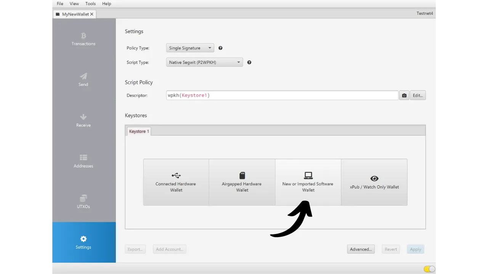

Bitcoin-lompakon luomisen yhteydessä sinua pyydetään kirjaamaan ylös muistilause, joka koostuu yleensä 12 tai 24 sanasta. Tämä lause mahdollistaa pääsyn palauttamisen bitcoineihisi, jos laite, jossa lompakkosi sijaitsee, katoaa, vahingoittuu tai varastetaan. Ennen kuin alat käyttää uutta Bitcoin-lompakkoasi, on erittäin tärkeää varmistaa tämän muistilauseen pätevyys. Paras tapa tehdä tämä on suorittamalla kuiva-ajon palautustesti.

Tämä testi sisältää lompakon palauttamisen simuloinnin ennen kuin siihen on talletettu yhtään bitcoineja. Niin kauan kuin lompakko on tyhjä, simuloimme tilannetta, jossa laite, jossa avaimemme sijaitsevat, on kadonnut, ja meillä on jäljellä vain muistilauseemme yrittääksemme palauttaa bitcoinejamme.


## Mikä on tarkoitus?

Tämä testausprosessi mahdollistaa fyysisen muistilauseesi varmuuskopion, olipa se sitten paperilla tai metallilla, toimivuuden varmistamisen. Epäonnistuminen tässä palautustestissä viestii virheestä lauseen varmuuskopiossa, asettaen siten bitcoinit vaaraan. Toisaalta, jos testi onnistuu, se vahvistaa muistilauseesi olevan täysin toiminnallinen, ja voit sen jälkeen turvata bitcoinit mielenrauhalla käyttäen tätä lompakkoa.

Kuiva-ajon palautustestin suorittamisella on kaksinkertainen etu. Se ei ainoastaan salli sinun tarkistaa muistilauseesi tarkkuutta, vaan antaa myös mahdollisuuden tutustua lompakon palautusprosessiin. Näin ollen, löydät potentiaaliset vaikeudet ennen kuin todellinen tilanne esittäytyy sinulle. Sinä päivänä, kun todella tarvitset palauttaa lompakkosi, olet vähemmän stressaantunut, koska tiedät jo prosessin, vähentäen virheen riskiä. Siksi on tärkeää, ettei tätä testausvaihetta laiminlyödä ja että otetaan tarvittava aika sen oikeaoppiseen suorittamiseen.

## Mikä on palautustesti?

Testin prosessi on melko yksinkertainen:
- Luotuasi uuden Bitcoin-lompakkosi, ja ennen ensimmäisten satoshiesi tallettamista, kirjaa ylös todistetieto, kuten xpub, ensimmäinen vastaanotto-osoite tai jopa pääavaimen sormenjälki;
- Poista sitten tarkoituksella vielä tyhjä lompakko, esimerkiksi palauttamalla laitteistosi tehdasasetuksiin;
- Simuloi seuraavaksi lompakkosi palautusta käyttäen vain muistilauseesi ja salasanasi paperivarmuuskopioita, jos käytät sellaista;
- Tarkista lopuksi, vastaako todistetieto uudelleengeneroidun portfolion tietoja. Jos tiedot täsmäävät, voit olla varma fyysisen varmuuskopiosi luotettavuudesta, ja voit sen jälkeen lähettää ensimmäiset bitcoinit tähän lompakkoon.
Ole varovainen, suorittaessasi palautustestiä, **sinun tulee käyttää samaa laitetta, jota aiot käyttää lopullisessa lompakossasi**, jotta et lisää lompakkosi hyökkäyspintaa. Esimerkiksi, jos luot lompakon Trezor Safe 5:lla, varmista, että suoritat palautustestin tällä samalla Trezor Safe 5:lla. On tärkeää, ettet syötä palautusfraasia mihinkään muuhun ohjelmistoon, sillä tämä vaarantaisi laitteistolompakkosi tarjoaman turvallisuuden, vaikka lompakko olisikin vielä tyhjä.

## Kuinka suorittaa palautustesti?

Tässä oppaassa selitän, kuinka suorittaa palautustesti Bitcoin-ohjelmistolompakolla, käyttäen Sparrow Walletia (kuumalle lompakolle). Prosessi pysyy kuitenkin samana minkä tahansa muun tyyppiselle laitteelle. Jälleen, **jos käytät laitteistolompakkoa, älä suorita palautustestiä Sparrow Walletilla** (katso edellinen osio).
Olen juuri luonut uuden hot walletin Sparrow Walletissa. Tällä hetkellä en ole vielä lähettänyt siihen yhtään bitcoineja. Se on tyhjä.


Olen huolellisesti merkinnyt 12 sanan muistilauseeni paperille. Ja koska haluan parantaa tämän lompakon turvallisuutta, olen myös asettanut BIP39-salalauseen, jonka olen tallentanut toiselle paperille:

```txt
1. shield
2. brass
3. sentence
4. cube
5. marble
6. glad
7. satoshi
8. door
9. project
10. panic
11. prepare
12. general
```

```text
Salalause: YfaicGzXH9t5C#g&47Kzbc$JL
```

***Ilmeisesti sinun ei pitäisi koskaan jakaa muistilausettasi ja salalausettasi internetissä, toisin kuin teen tässä opetusohjelmassa. Tämä esimerkkilompakko ei tule olemaan käytössä ja se poistetaan opetusohjelman lopussa.***

Merkitään nyt luonnokseen lompakostani todistuskappaleen tiedot. Voit valita erilaisia tietoja, kuten ensimmäisen vastaanotto-osoitteen, xpubin tai pääavaimen sormenjäljen. Henkilökohtaisesti suosittelen valitsemaan ensimmäisen vastaanotto-osoitteen. Tämä mahdollistaa sen, että pystyt varmistamaan, että löydät täydellisen ensimmäisen johdannaispolun, joka johtaa tähän osoitteeseen.

Sparrow'ssa, klikkaa "*Osoitteet*" -välilehteä.


Merkitse sitten paperille lompakkosi ensimmäinen vastaanotto-osoite. Esimerkissäni osoite on:

```txt
Tiedon merkitsemisen jälkeen, mene "*Tiedosto*" -valikkoon, sitten valitse "*Poista Lompakko*". Muistutan sinua jälleen kerran, että Bitcoin-lompakkosi on oltava tyhjä ennen tämän toimenpiteen suorittamista.


Jos lompakkosi on todellakin tyhjä, vahvista lompakon poistaminen.


Nyt sinun täytyy toistaa lompakon luontiprosessi, mutta käyttäen paperivarmuuskopioitamme. Klikkaa "*Tiedosto*" -valikkoa ja sitten "*Uusi Lompakko*".


Anna lompakollesi nimi uudelleen.


"*Script Type*" -valikossa sinun täytyy valita sama skriptityyppi kuin aiemmin poistamassasi lompakossa.


Klikkaa sitten "*Uusi tai Tuotu Ohjelmistolompakko*" -nappia.


Valitse oikea sanojen määrä siemenellesi.



Syötä muistilauseesi ohjelmistoon. Jos esiin tulee "*Invalid Checksum*" -viesti, tämä osoittaa, että muistilauseesi varmuuskopio on virheellinen. Sinun täytyy silloin aloittaa lompakon luonti alusta, koska palautustestisi on epäonnistunut.


Jos sinulla on salalause, kuten minulla, syötä se myös.


Klikkaa "*Luo Keystore*", sitten "*Tuo Keystore*".


Ja lopuksi, klikkaa "*Käytä*" -nappia.


Voit nyt palata "*Osoitteet*" -välilehteen.


Lopuksi, varmista, että ensimmäinen vastaanotto-osoite vastaa sitä, jonka olet merkinnyt todistajaksi luonnokseesi.


Jos vastaanotto-osoitteet täsmäävät, palautustestisi on onnistunut, ja voit käyttää uutta Bitcoin-lompakkoasi. Jos ne eivät täsmää, tämä voi viitata joko virheeseen skriptityypin valinnassa, mikä tekee johdannaispolusta virheellisen, tai ongelmaan mnemonisen lausekkeesi tai salasanasi varmuuskopioinnissa. Molemmissa tapauksissa suosittelen vahvasti aloittamaan alusta ja luomaan uuden Bitcoin-lompakon alusta välttääksesi minkä tahansa riskin. Tällä kertaa, muista merkitä mnemoninen lauseke virheettömästi.
Onnittelut, olet nyt ajan tasalla palautustestin suorittamisessa! Neuvon sinua yleistämään tämän prosessin kaikkien Bitcoin-lompakkojesi luomiseen. Jos pidit tätä opasta hyödyllisenä, arvostaisin, jos voisit jättää peukun ylös alla. Voit vapaasti jakaa tämän artikkelin sosiaalisissa verkostoissasi. Suurkiitokset!