Lors de la création d'un portefeuille Bitcoin, il vous est demandé de noter une phrase mnémonique, généralement composée de 12 ou 24 mots. Cette phrase vous permet de récupérer l'accès à vos bitcoins en cas de perte, casse ou vol de l'appareil hébergeant votre portefeuille. Avant de commencer à utiliser votre nouveau portefeuille Bitcoin, il est très important de vérifier la validité de cette phrase mnémonique. Le meilleur moyen de le faire est d'effectuer un test de récupération à vide.

Ce test consiste à simuler une restauration du portefeuille avant d'y déposer des bitcoins. Tant que le portefeuille est vide, on simule une situation où le dispositif hébergeant nos clés est perdu, et il ne nous reste que notre phrase mnémonique pour tenter de récupérer nos bitcoins.

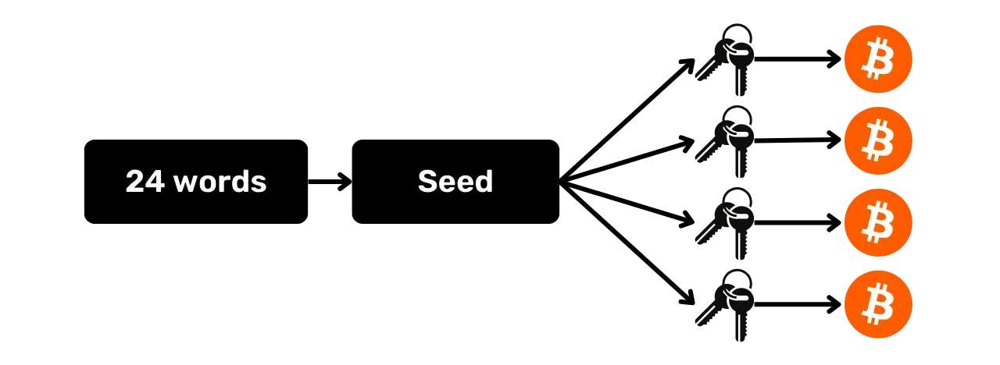

## À quoi ça sert ?

Ce processus de test permet de vérifier que la sauvegarde physique de votre phrase mnémonique, que ce soit sur papier ou métal, est fonctionnelle. Un échec lors de ce test de récupération signale une erreur dans la sauvegarde de la phrase, et met donc vos bitcoins en danger. En revanche, si le test est réussi, cela confirme que votre phrase mnémonique est parfaitement opérationnelle, et vous pouvez alors sécuriser des bitcoins en toute sérénité avec ce portefeuille.

Effectuer un test de récupération à vide présente un double avantage. Non seulement cela vous permet de vérifier l'exactitude de votre phrase mnémonique, mais cela vous donne également l'occasion de vous familiariser avec le processus de récupération de votre portefeuille. Vous découvrirez ainsi les difficultés potentielles avant qu'une situation réelle ne se présente à vous. Le jour où vous aurez réellement besoin de récupérer votre portefeuille, vous serez moins stressé, car vous connaîtrez déjà le processus, ce qui réduit le risque d'erreur. C'est pourquoi il est important de ne pas négliger cette étape de test et de prendre le temps nécessaire pour la réaliser correctement.

## C'est quoi un test de récupération ?

Le processus du test est assez simple :
- Après avoir créé votre nouveau portefeuille Bitcoin, et avant d'y déposer vos premiers satoshis, notez une information témoin telle qu'une xpub, la première adresse de réception ou encore l'empreinte de la clé maîtresse ;
- Ensuite, supprimez volontairement le portefeuille encore vide, par exemple, en réinitialisant votre hardware wallet aux paramètres d'usine ;
- Puis, simulez une récupération de votre portefeuille en utilisant uniquement les sauvegardes papier de votre phrase mnémonique et de votre passphrase si vous en utilisez une ;
- Enfin, vérifiez si l'information témoin correspond à celle du portefeuille régénéré. Si les informations coïncident, vous êtes assuré de la fiabilité de votre sauvegarde physique et vous pouvez donc envoyer vos premiers bitcoins sur ce portefeuille.

Attention, lors d'un test de récupération, **vous devez utiliser le même dispositif que celui prévu pour votre portefeuille final**, afin de ne pas augmenter la surface d'attaque de votre wallet. Par exemple, si vous créez un portefeuille sur une Trezor Safe 5, assurez-vous de réaliser le test de récupération sur cette même Trezor Safe 5. Il est important de ne pas entrer votre phrase de récupération dans un autre logiciel, car cela compromettrait la sécurité amenée par votre hardware wallet, même si le portefeuille est encore vide.

## Comment faire un test de récupération ?

Dans ce tutoriel, je vais vous expliquer comment réaliser un test de récupération sur un portefeuille Bitcoin logiciel, en utilisant Sparrow Wallet (pour un portefeuille chaud). Cependant, le processus reste identique pour tout autre type de dispositif. Encore une fois, **si vous utilisez un hardware wallet, n'effectuez pas le test de récupération sur Sparrow Wallet** (voir la partie précédente).

Je viens de créer un nouveau portefeuille chaud sur Sparrow Wallet. Pour le moment, je n'y ai pas encore envoyé de bitcoins. Il est vide.

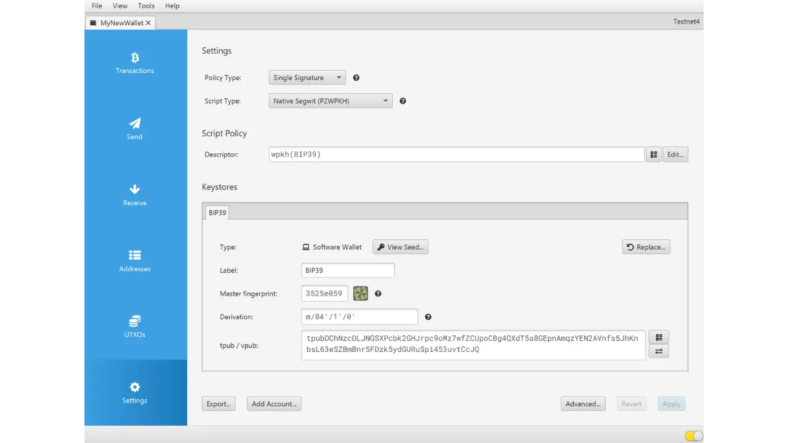

J'ai soigneusement noté ma phrase mnémonique de 12 mots sur un papier. Et puisque je souhaite renforcer la sécurité de ce portefeuille, j'ai également configuré une passphrase BIP39 que j'ai sauvegardée sur un autre bout de papier :

```txt
1. shield
2. brass
3. sentence
4. cube
5. marble
6. glad
7. satoshi
8. door
9. project
10. panic
11. prepare
12. general
```

```text
Passphrase : YfaicGzXH9t5C#g&47Kzbc$JL
```

***Évidemment, vous ne devez jamais partager votre phrase mnémonique et votre passphrase sur internet, contrairement à ce que je fais dans ce tutoriel. Ce portefeuille en exemple ne sera pas utilisé et sera supprimé à l'issue du tutoriel.***

Je vais maintenant noter sur un brouillon une information témoin de mon portefeuille. Vous pouvez choisir différentes informations, comme la première adresse de réception, la xpub, ou l'empreinte de la clé maîtresse. Personnellement, je recommande de choisir la première adresse de réception. Cela permet de vérifier que vous êtes capable de retrouver le premier chemin de dérivation complet menant à cette adresse.

Sur Sparrow, cliquez sur l'onglet "*Addresses*".

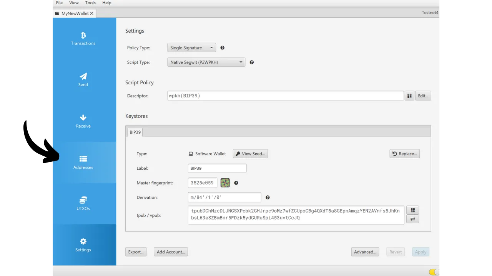

Ensuite, notez sur un bout de papier la toute première adresse de réception de votre portefeuille. Dans mon exemple, l'adresse est :

```txt
tb1qxv56mma5x5r7uhdkn0ldvcx6m0gj6f3kre0gwd
```

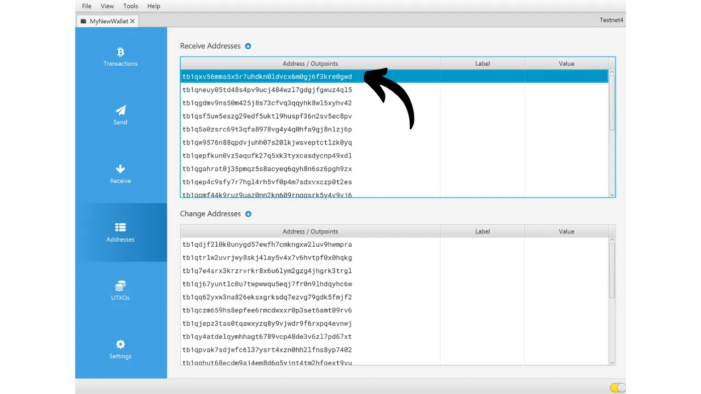

Après avoir noté l'information, allez dans le menu "*File*", puis sélectionnez "*Delete Wallet*". Je vous rappelle une fois de plus que votre portefeuille Bitcoin doit être vide avant de procéder à cette opération.


Si votre portefeuille est bien vide, confirmez la suppression de votre portefeuille.

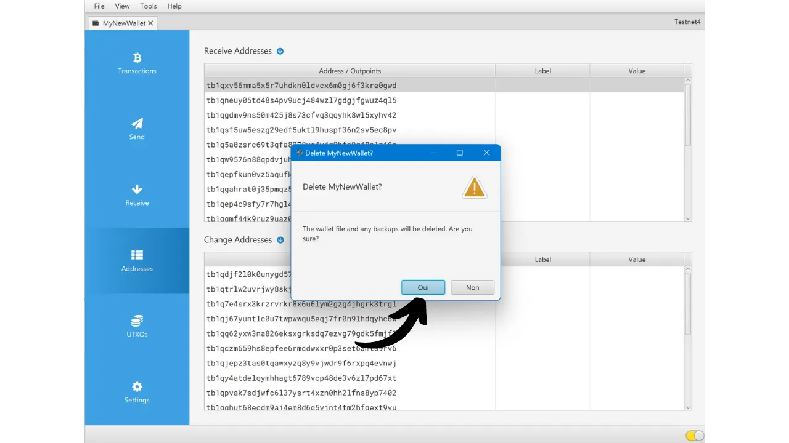

Maintenant il faut répéter le processus de création du portefeuille, mais en utilisant nos sauvegardes papier. Cliquez sur le menu "*File*" puis sur "*New Wallet*".

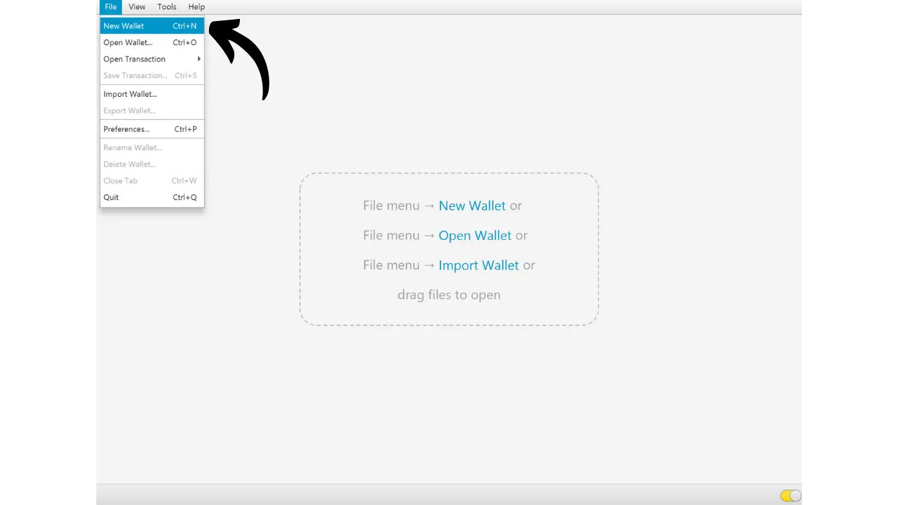

Entrez de nouveau le nom de votre portefeuille.

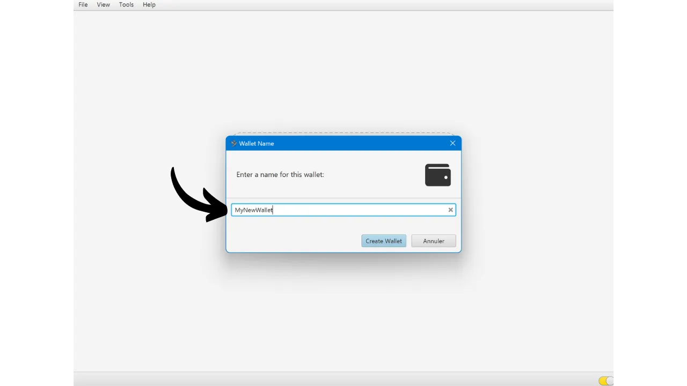

Dans le menu "*Script Type*", il faut que vous choisissiez le même type de script que le portefeuille précédemment supprimé.

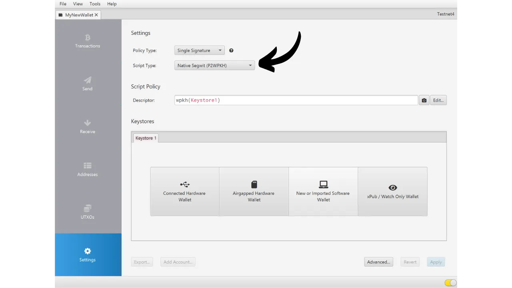

Puis cliquez sur le bouton "*New or Imported Software Wallet*".


Sélectionnez le bon nombre de mots pour votre seed.

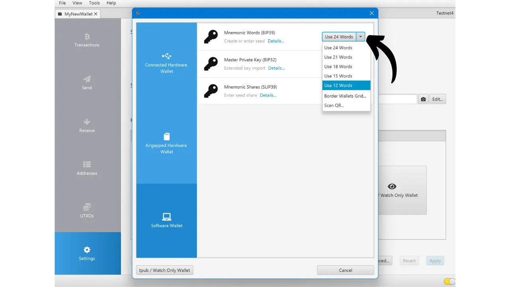

Entrez votre phrase mnémonique dans le logiciel. Si un message "*Invalid Checksum*" s'affiche, cela indique que la sauvegarde de votre phrase mnémonique est incorrecte. Vous devrez alors recommencer la création de votre portefeuille de zéro, car votre test de récupération a échoué.

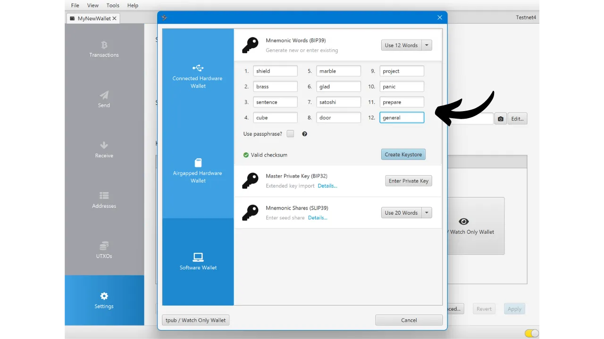

Si vous disposez d'une passphrase, comme dans mon cas, renseignez-la également.

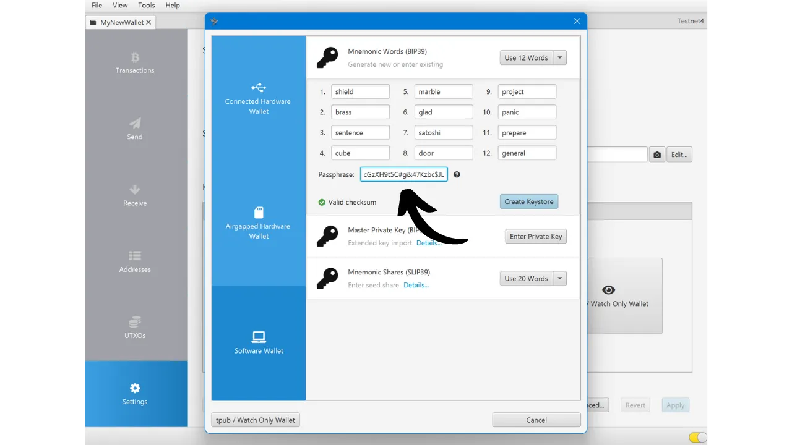

Cliquez sur "*Create Keystore*", puis sur "*Import Keystore*".

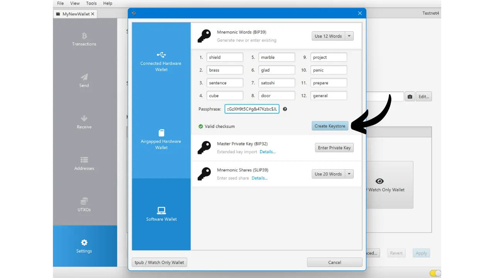

Et enfin, cliquez sur le bouton "*Apply*".

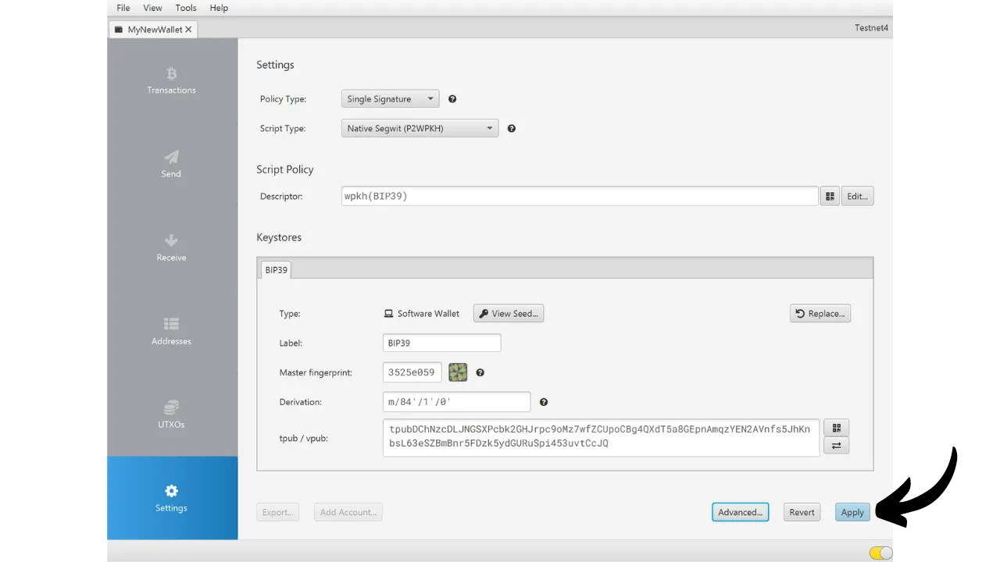

Vous pouvez maintenant retourner dans l'onglet "*Addresses*".

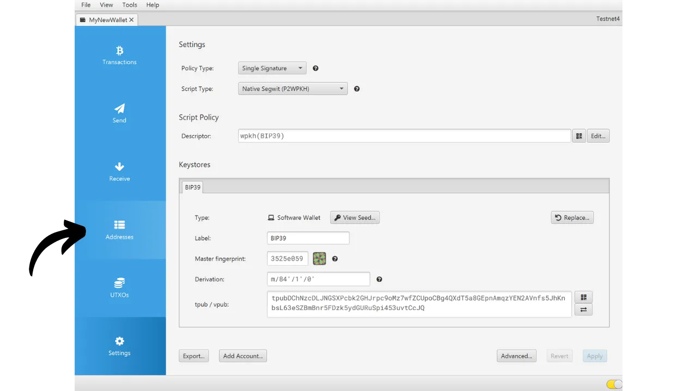

Enfin, vérifiez que la première adresse de réception correspond bien à celle que vous aviez notée comme témoin sur votre brouillon.

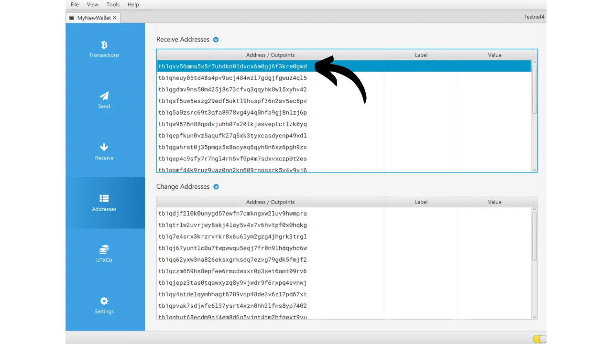

Si les adresses de réception correspondent, votre test de récupération est réussi, et vous pouvez utiliser votre nouveau portefeuille Bitcoin. Si elles ne correspondent pas, cela peut indiquer soit une erreur dans le choix du type de script, ce qui rend le chemin de dérivation incorrect, soit un problème avec la sauvegarde de votre phrase mnémonique ou de votre passphrase. Dans les deux cas, je vous recommande fortement de recommencer de zéro et de créer un nouveau portefeuille Bitcoin depuis le début pour éviter tout risque. Cette fois, prenez soin de bien noter la phrase mnémonique sans erreurs.

Félicitations, vous êtes maintenant au point sur la réalisation d'un test de récupération ! Je vous conseille de généraliser ce processus à la création de tous vos portefeuilles Bitcoin. Si vous avez trouvé ce tutoriel utile, je vous serais reconnaissant de laisser un pouce vert ci-dessous. N'hésitez pas à partager cet article sur vos réseaux sociaux. Merci beaucoup !
