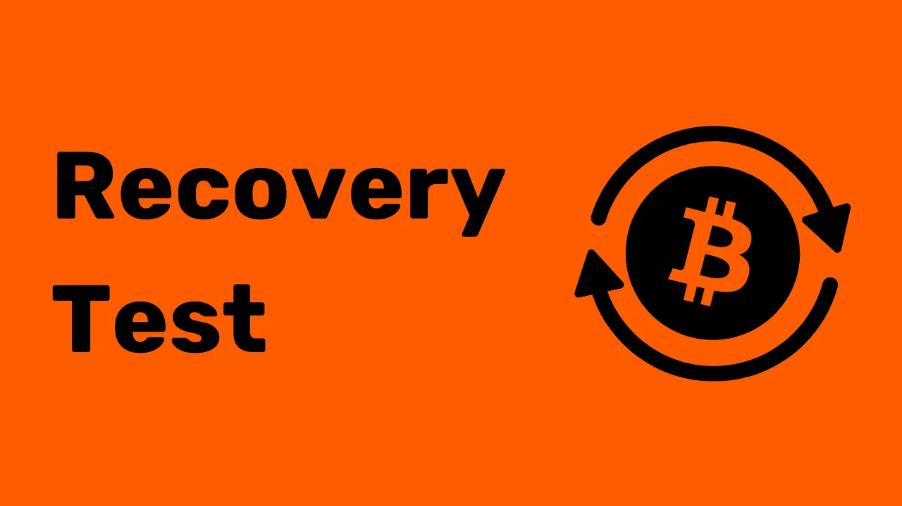

Saat membuat dompet Bitcoin, kamu diminta untuk mencatat *seedphrase*, biasanya terdiri dari 12 atau 24 kata. *Seedphrase* ini memungkinkan kamu untuk memulihkan akses ke bitcoinmu jika perangkat yang menyimpan dompetmu hilang, rusak, atau dicuri. Sebelum mulai menggunakan dompet Bitcoin baru, sangat penting untuk memverifikasi keabsahan *seedphrase* ini. Cara terbaik untuk melakukannya adalah dengan melakukan tes pemulihan secara simulasi.

Tes ini melibatkan simulasi pemulihan dompet sebelum kamu menyetorkan bitcoin apa pun ke dalamnya. Selama dompet masih kosong, kita mensimulasikan situasi di mana perangkat yang menyimpan kunci hilang, dan yang kita miliki hanyalah *seedphrase* untuk mencoba memulihkan bitcoin kita.

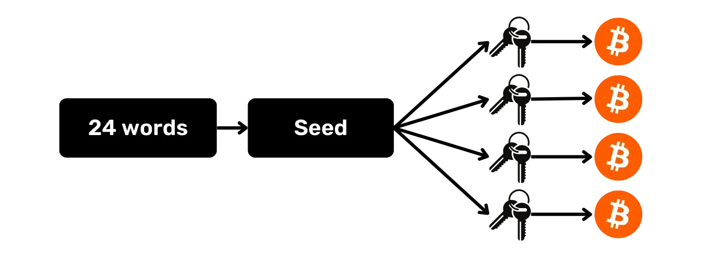

## Apa tujuannya?

Proses pengujian ini memungkinkan kamu untuk memverifikasi bahwa cadangan fisik dari *seedphrase*-mu, baik di kertas atau logam, berfungsi. Kegagalan selama tes pemulihan ini menandakan adanya kesalahan dalam cadangan *seedphrase*, sehingga menempatkan bitcoinmu dalam risiko. Sebaliknya, jika tes berhasil, ini mengonfirmasi bahwa *seedphrase* kamu sepenuhnya operasional, dan kamu bisa mengamankan bitcoin dengan tenang menggunakan dompet ini.

Melakukan tes pemulihan secara simulasi punya keuntungan ganda. Tidak hanya memungkinkan kamu memeriksa keakuratan *seedphrase*, tapi juga memberi kesempatan untuk membiasakan diri dengan proses pemulihan dompet. Dengan cara ini, kamu akan menemukan potensi kesulitan sebelum situasi nyata terjadi. Saat benar-benar perlu memulihkan dompet, kamu akan lebih tenang karena sudah tahu prosesnya, mengurangi risiko kesalahan. Itulah kenapa penting untuk tidak melewatkan langkah pengujian ini dan mengambil waktu yang diperlukan untuk melakukannya dengan benar.

## Apa itu tes pemulihan?

Proses tes cukup sederhana:
- Setelah membuat dompet Bitcoin baru, dan sebelum menyetorkan satoshi pertamamu, catat informasi saksi seperti *xpub*, alamat penerimaan pertama, atau bahkan sidik jari kunci utama;
- Kemudian, sengaja hapus dompet yang masih kosong, misalnya dengan mereset dompet perangkat keras ke pengaturan pabrik;
- Selanjutnya, simulasi pemulihan dompet hanya menggunakan cadangan kertas dari *seedphrase* dan *passphrase* jika kamu menggunakannya;
- Akhirnya, periksa apakah informasi saksi cocok dengan portofolio yang diregenerasi. Jika cocok, kamu bisa yakin akan keandalan cadangan fisik, dan kemudian mengirim bitcoin pertamamu ke dompet ini.

Hati-hati, selama tes pemulihan, **kamu harus menggunakan perangkat yang sama yang dimaksudkan untuk dompet akhir**, agar tidak meningkatkan permukaan serangan dompetmu. Misalnya, jika kamu membuat dompet di Trezor Safe 5, pastikan melakukan tes pemulihan di Trezor Safe 5 yang sama. Penting untuk tidak memasukkan *seedphrase* ke perangkat lunak lain, karena ini bisa mengompromikan keamanan dompet perangkat keras, meskipun dompet masih kosong.

## Bagaimana cara melakukan tes pemulihan?

Dalam tutorial ini, aku akan menjelaskan cara melakukan tes pemulihan pada dompet perangkat lunak Bitcoin, menggunakan Sparrow Wallet (untuk dompet panas). Namun, prosesnya tetap sama untuk jenis perangkat lain. Lagi pula, **jika kamu menggunakan dompet perangkat keras, jangan melakukan tes pemulihan di Sparrow Wallet** (lihat bagian sebelumnya).  
Aku baru saja membuat dompet panas baru di Sparrow Wallet. Saat ini, aku belum mengirimkan bitcoin apa pun ke sana. Ini masih kosong.
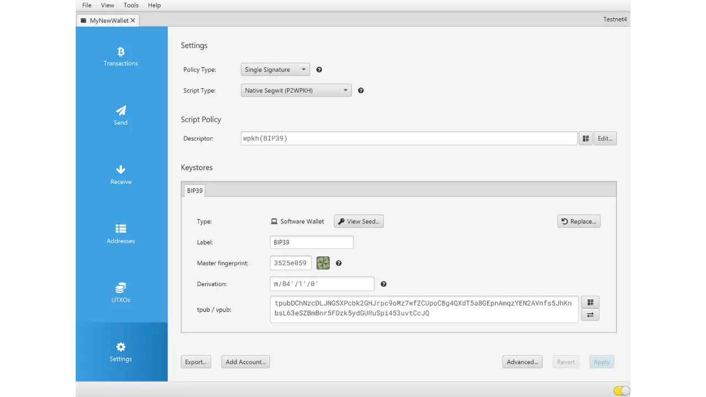

Aku telah dengan hati-hati mencatat *seedphrase* 12 kata di selembar kertas. Dan karena ingin meningkatkan keamanan dompet ini, aku juga menyiapkan *passphrase* BIP39 yang aku simpan di selembar kertas lain:

```txt
1. shield
2. brass
3. sentence
4. cube
5. marble
6. glad
7. satoshi
8. door
9. project
10. panic
11. prepare
12. general
```

```text
Passphrase: YfaicGzXH9t5C#g&47Kzbc$JL
```

***Jelas, kamu seharusnya tidak pernah membagikan *seedphrase* dan *passphrase* di internet, tidak seperti yang aku lakukan dalam tutorial ini. Dompet contoh ini tidak akan digunakan dan akan dihapus di akhir tutorial.***

Sekarang aku akan mencatat di draf sebuah informasi saksi dari dompet. Kamu bisa memilih berbagai informasi, seperti alamat penerimaan pertama, *xpub*, atau sidik jari kunci utama. Secara pribadi, aku merekomendasikan memilih alamat penerimaan pertama. Ini memungkinkan kamu memverifikasi bahwa kamu dapat menemukan jalur derivasi pertama lengkap yang menuju ke alamat ini.


Di Sparrow, klik pada tab "*Alamat*".

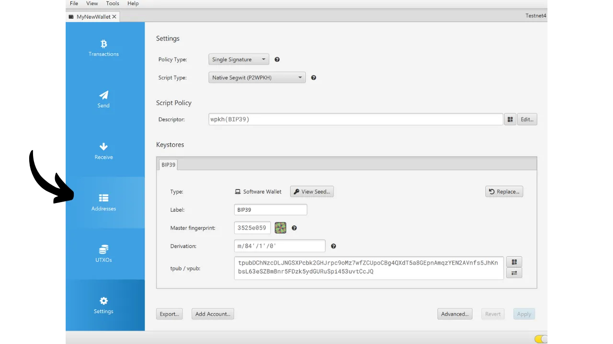

Kemudian, catat di selembar kertas alamat penerimaan pertama dompet kamu. Dalam contoh ini, alamatnya adalah:

```txt
tb1qxv56mma5x5r7uhdkn0ldvcx6m0gj6f3kre0gwd
```

Setelah mencatat informasi, pergi ke menu "*File*", lalu pilih "*Hapus Dompet*". Aku ingatkan sekali lagi bahwa dompet Bitcoin kamu harus kosong sebelum melanjutkan dengan operasi ini.

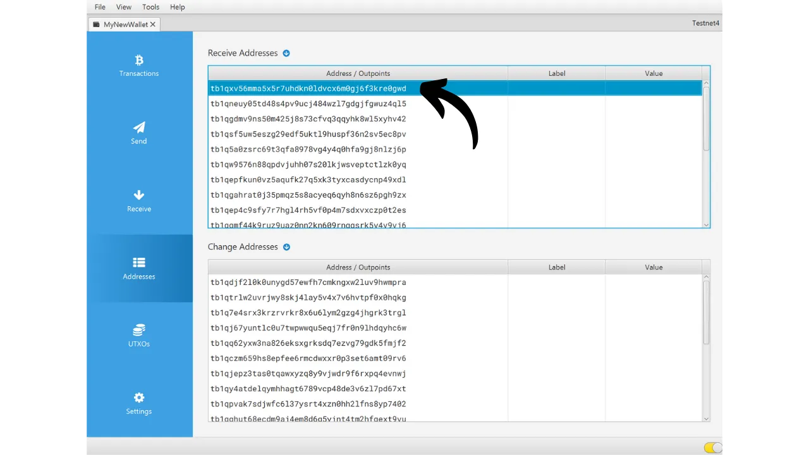

Jika dompet kamu memang kosong, konfirmasikan penghapusan dompet.

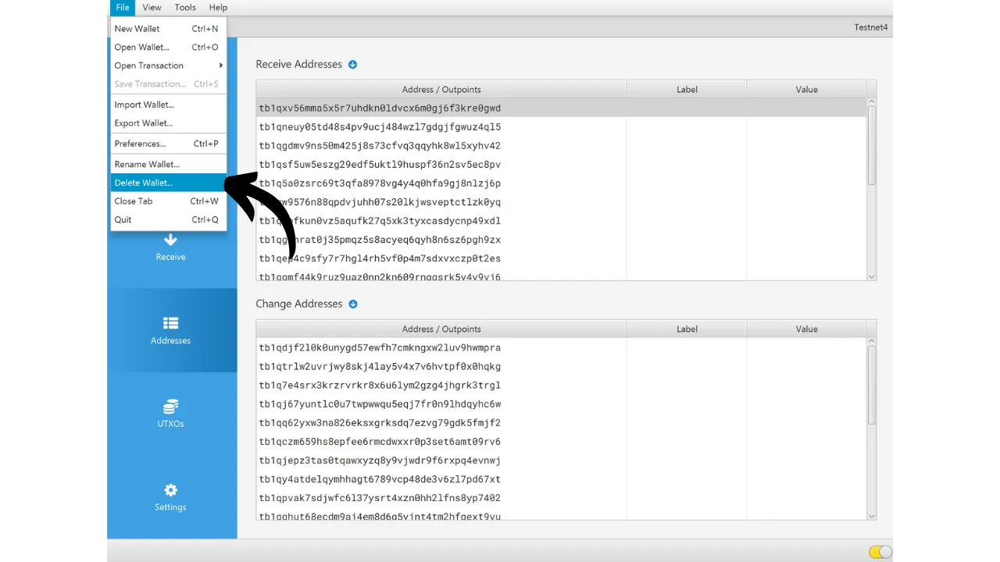

Sekarang kamu perlu mengulangi proses pembuatan dompet, tetapi menggunakan cadangan kertas kami. Klik pada menu "*File*" dan kemudian pada "*Dompet Baru*".

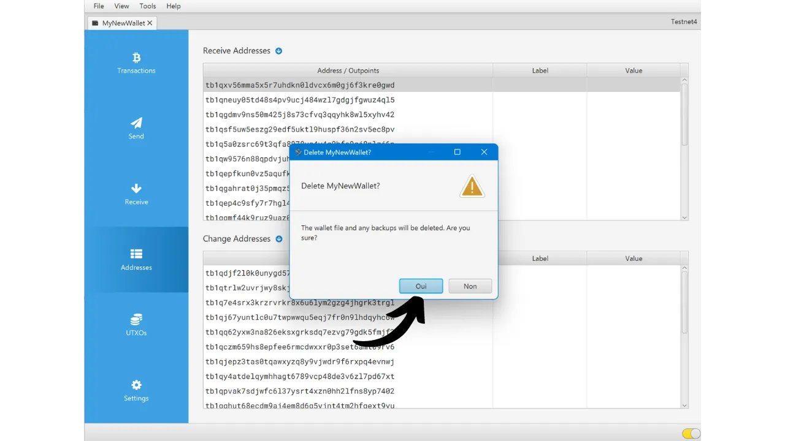

Masukkan nama dompet kamu lagi.

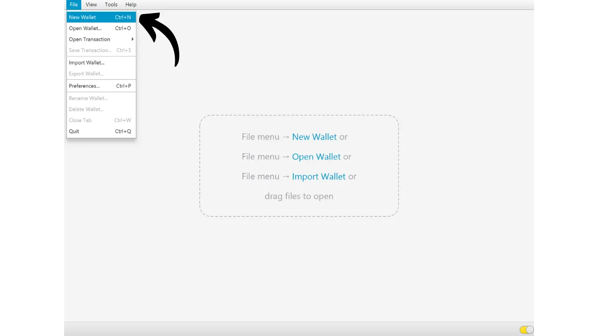

Di menu "*Tipe Skrip*", Kamu perlu memilih tipe skrip yang sama dengan dompet yang sebelumnya dihapus.

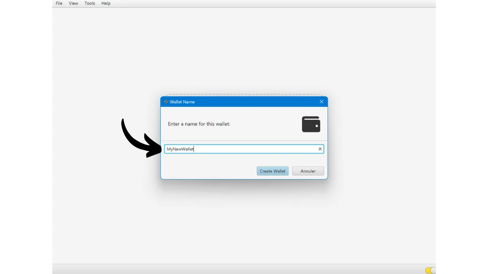

Kemudian klik pada tombol "*Dompet Perangkat Lunak Baru atau Diimpor*".

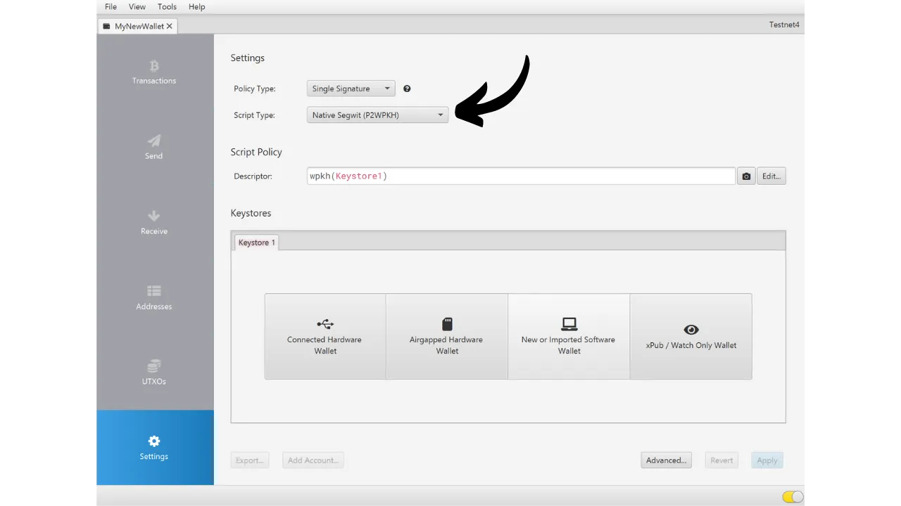

Pilih jumlah kata yang benar untuk benih kamu.

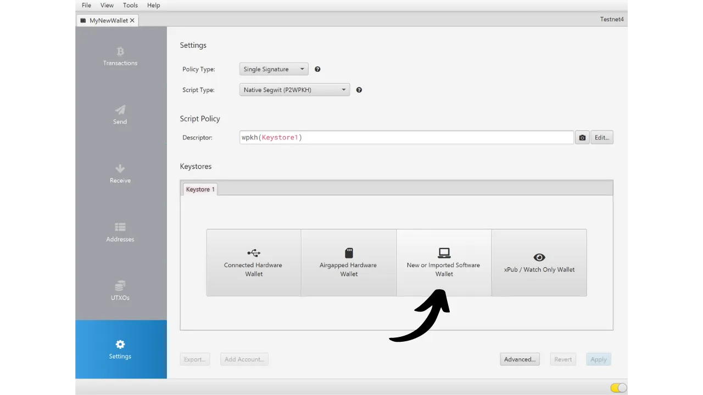

Masukkan *seedphrase* ke dalam perangkat lunak. Jika muncul pesan "*Checksum Tidak Valid*", ini menunjukkan bahwa cadangan *seedphrase* salah. Kamu kemudian harus memulai pembuatan dompet dari awal, karena tes pemulihan telah gagal.

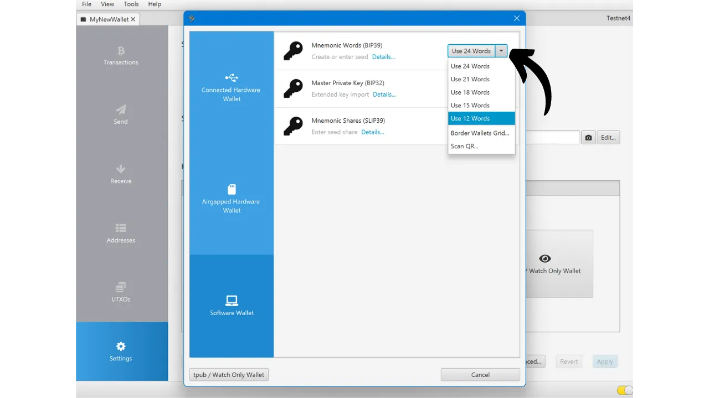

Jika kamu memiliki *passphrase*, seperti dalam kasusku, masukkan juga.

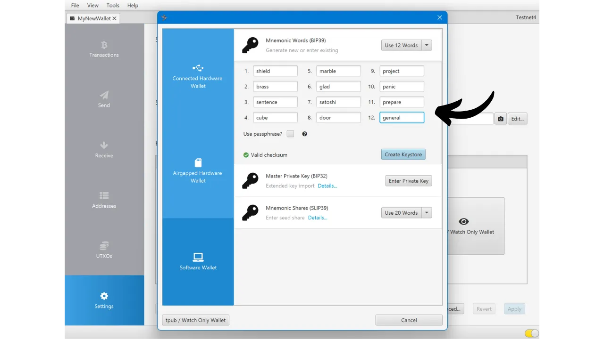

Klik pada "*Buat Keystore*", lalu pada "*Impor Keystore*".

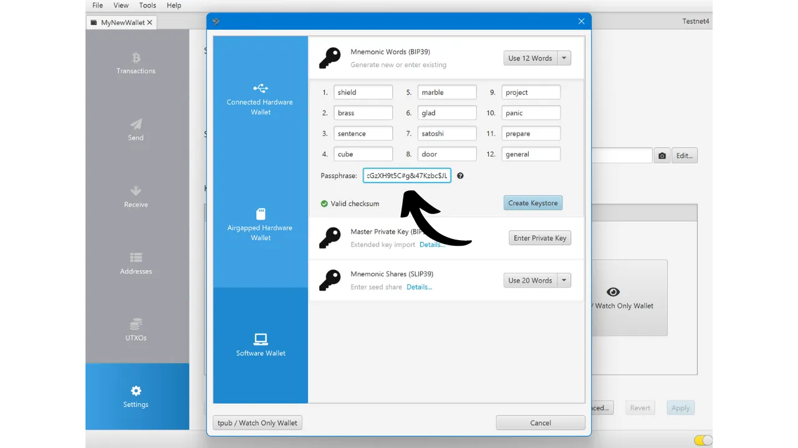

Dan akhirnya, klik pada tombol "*Terapkan*".

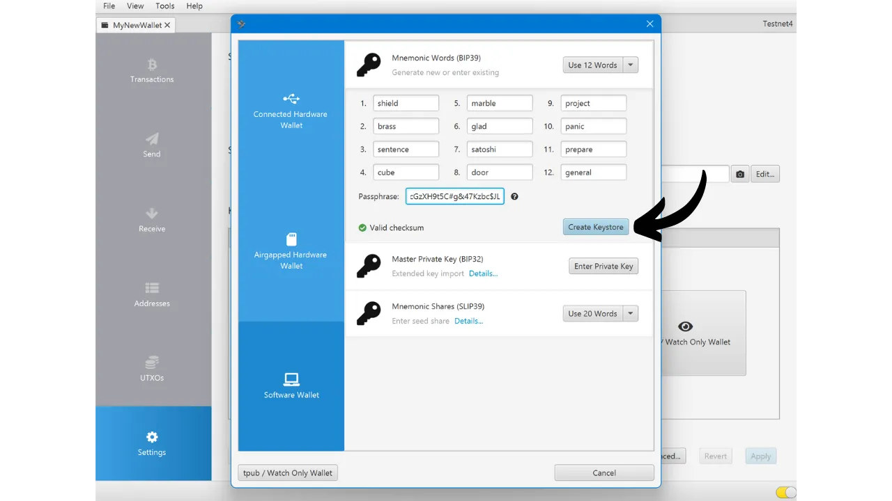

Sekarang kamu dapat kembali ke tab "*Alamat*".

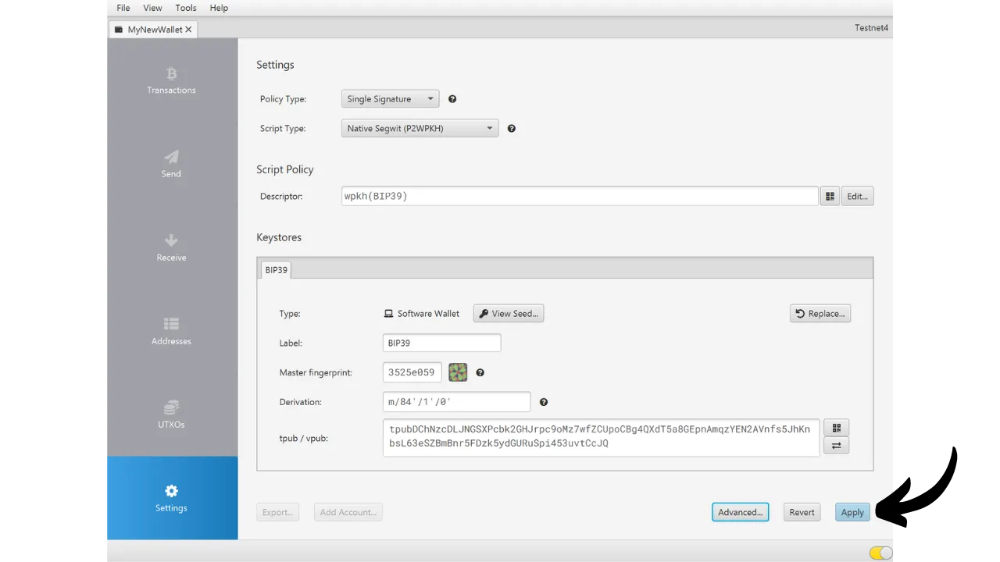
Akhirnya, verifikasi bahwa alamat penerima pertama cocok dengan yang telah kamu catat sebagai saksi pada draf.
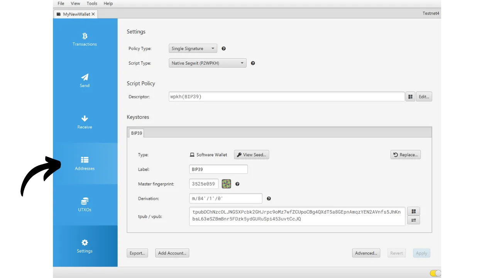

Jika alamat penerima cocok, tes pemulihan berhasil, dan kamu bisa menggunakan dompet Bitcoin baru. Jika tidak cocok, ini mungkin menunjukkan kesalahan dalam pemilihan jenis skrip, yang membuat jalur derivasi tidak benar, atau masalah dengan cadangan *seedphrase* atau *passphrase*. Dalam kedua kasus, aku sangat menyarankan untuk memulai dari awal dan membuat dompet Bitcoin baru untuk menghindari risiko apa pun. Kali ini, pastikan mencatat *seedphrase* tanpa kesalahan.

Selamat, kamu sekarang sudah mengerti cara melakukan tes pemulihan! Aku menyarankan untuk menggeneralisasi proses ini untuk pembuatan semua dompet Bitcoinmu. Jika kamu merasa tutorial ini bermanfaat, aku akan sangat menghargai jika kamu meninggalkan jempol ke atas di bawah ini. Jangan ragu untuk membagikan artikel ini di jaringan sosialmu. Terima kasih banyak!
