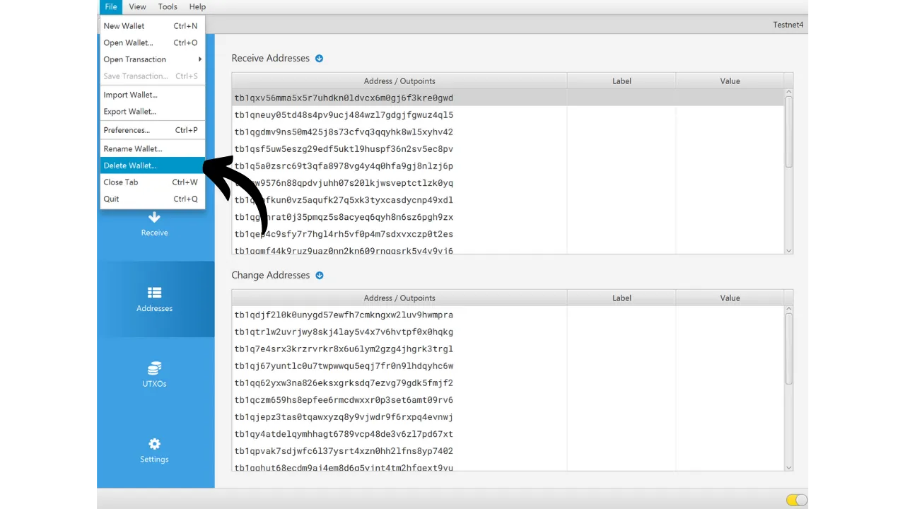
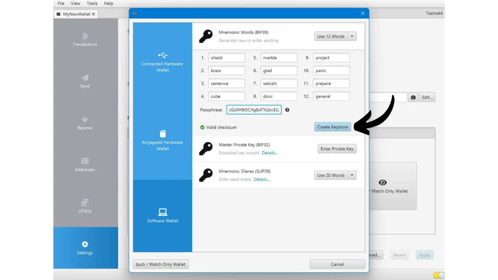

Saat membuat dompet Bitcoin, Anda diminta untuk mencatat frasa mnemonik, biasanya terdiri dari 12 atau 24 kata. Frasa ini memungkinkan Anda untuk memulihkan akses ke bitcoin Anda dalam kasus kehilangan, kerusakan, atau pencurian perangkat yang menyimpan dompet Anda. Sebelum Anda mulai menggunakan dompet Bitcoin baru Anda, sangat penting untuk memverifikasi validitas frasa mnemonik ini. Cara terbaik untuk melakukan ini adalah dengan melakukan tes pemulihan secara simulasi.

Tes ini melibatkan simulasi pemulihan dompet sebelum menyetorkan bitcoin apa pun ke dalamnya. Selama dompet masih kosong, kita mensimulasikan situasi di mana perangkat yang menyimpan kunci kita hilang, dan yang kita miliki hanyalah frasa mnemonik kita untuk mencoba memulihkan bitcoin kita.


## Apa tujuannya?

Proses pengujian ini memungkinkan Anda untuk memverifikasi bahwa cadangan fisik dari frasa mnemonik Anda, baik di kertas atau logam, berfungsi. Kegagalan selama tes pemulihan ini menandakan adanya kesalahan dalam cadangan frasa tersebut, sehingga menempatkan bitcoin Anda dalam risiko. Di sisi lain, jika tes berhasil, ini mengonfirmasi bahwa frasa mnemonik Anda sepenuhnya operasional, dan Anda kemudian dapat mengamankan bitcoin dengan tenang menggunakan dompet ini.

Melakukan tes pemulihan secara simulasi memiliki keuntungan ganda. Tidak hanya memungkinkan Anda untuk memeriksa keakuratan frasa mnemonik Anda, tetapi juga memberi Anda kesempatan untuk membiasakan diri dengan proses pemulihan dompet. Dengan cara ini, Anda akan menemukan potensi kesulitan sebelum situasi nyata terjadi pada Anda. Pada hari Anda benar-benar perlu memulihkan dompet Anda, Anda akan kurang stres, karena Anda sudah tahu prosesnya, mengurangi risiko kesalahan. Itulah mengapa penting untuk tidak mengabaikan langkah pengujian ini dan mengambil waktu yang diperlukan untuk melakukannya dengan benar.

## Apa itu tes pemulihan?

Proses tes cukup sederhana:
- Setelah membuat dompet Bitcoin baru Anda, dan sebelum menyetorkan satoshi pertama Anda, catat informasi saksi seperti xpub, alamat penerimaan pertama, atau bahkan sidik jari kunci utama;
- Kemudian, sengaja hapus dompet yang masih kosong, misalnya, dengan mereset dompet perangkat keras Anda ke pengaturan pabrik;
- Selanjutnya, simulasi pemulihan dompet Anda hanya menggunakan cadangan kertas dari frasa mnemonik Anda dan passphrase Anda jika Anda menggunakannya;
- Akhirnya, periksa apakah informasi saksi cocok dengan portofolio yang diregenerasi. Jika informasi cocok, Anda dapat yakin akan keandalan cadangan fisik Anda, dan Anda kemudian dapat mengirim bitcoin pertama Anda ke dompet ini.
Hati-hati, selama tes pemulihan, **Anda harus menggunakan perangkat yang sama yang dimaksudkan untuk dompet akhir Anda**, agar tidak meningkatkan permukaan serangan dompet Anda. Misalnya, jika Anda membuat dompet di Trezor Safe 5, pastikan untuk melakukan tes pemulihan di Trezor Safe 5 yang sama. Penting untuk tidak memasukkan frasa pemulihan Anda ke dalam perangkat lunak lain, karena ini akan mengompromikan keamanan yang disediakan oleh dompet perangkat keras Anda, bahkan jika dompet masih kosong.

## Bagaimana cara melakukan tes pemulihan?

Dalam tutorial ini, saya akan menjelaskan cara melakukan tes pemulihan pada dompet perangkat lunak Bitcoin, menggunakan Sparrow Wallet (untuk dompet panas). Namun, prosesnya tetap sama untuk jenis perangkat lain. Lagi pula, **jika Anda menggunakan dompet perangkat keras, jangan melakukan tes pemulihan di Sparrow Wallet** (lihat bagian sebelumnya).
Saya baru saja membuat dompet panas baru di Sparrow Wallet. Saat ini, saya belum mengirimkan bitcoin apa pun ke sana. Ini masih kosong.


Saya telah dengan hati-hati mencatat frasa mnemonik 12 kata saya di selembar kertas. Dan karena saya ingin meningkatkan keamanan dompet ini, saya juga telah menyiapkan frasa sandi BIP39 yang saya simpan di selembar kertas lain:

```txt
1. shield
2. brass
3. sentence
4. cube
5. marble
6. glad
7. satoshi
8. door
9. project
10. panic
11. prepare
12. general
```

```text
Passphrase: YfaicGzXH9t5C#g&47Kzbc$JL
```

***Jelas, Anda seharusnya tidak pernah membagikan frasa mnemonik dan frasa sandi Anda di internet, tidak seperti yang saya lakukan dalam tutorial ini. Dompet contoh ini tidak akan digunakan dan akan dihapus di akhir tutorial.***

Sekarang saya akan mencatat di draf sebuah informasi saksi dari dompet saya. Anda dapat memilih berbagai informasi, seperti alamat penerimaan pertama, xpub, atau sidik jari kunci utama. Secara pribadi, saya merekomendasikan memilih alamat penerimaan pertama. Ini memungkinkan Anda untuk memverifikasi bahwa Anda dapat menemukan jalur derivasi pertama lengkap yang menuju ke alamat ini.

Di Sparrow, klik pada tab "*Alamat*".


Kemudian, catat di selembar kertas alamat penerimaan pertama dompet Anda. Dalam contoh saya, alamatnya adalah:

```txt
Setelah mencatat informasi, pergi ke menu "*File*", lalu pilih "*Hapus Dompet*". Saya ingatkan sekali lagi bahwa dompet Bitcoin Anda harus kosong sebelum melanjutkan dengan operasi ini.


Jika dompet Anda memang kosong, konfirmasikan penghapusan dompet Anda.



Sekarang Anda perlu mengulangi proses pembuatan dompet, tetapi menggunakan cadangan kertas kami. Klik pada menu "*File*" dan kemudian pada "*Dompet Baru*".


Masukkan nama dompet Anda lagi.


Di menu "*Tipe Skrip*", Anda perlu memilih tipe skrip yang sama dengan dompet yang sebelumnya Anda hapus.


Kemudian klik pada tombol "*Dompet Perangkat Lunak Baru atau Diimpor*".


Pilih jumlah kata yang benar untuk benih Anda.


Masukkan frasa mnemonik Anda ke dalam perangkat lunak. Jika muncul pesan "*Checksum Tidak Valid*", ini menunjukkan bahwa cadangan frasa mnemonik Anda salah. Anda kemudian harus memulai pembuatan dompet Anda dari awal, karena tes pemulihan Anda telah gagal.


Jika Anda memiliki frasa sandi, seperti dalam kasus saya, masukkan juga.


Klik pada "*Buat Keystore*", lalu pada "*Impor Keystore*".


Dan akhirnya, klik pada tombol "*Terapkan*".



Anda sekarang dapat kembali ke tab "*Alamat*".


Akhirnya, verifikasi bahwa alamat penerima pertama cocok dengan yang telah Anda catat sebagai saksi pada draf Anda.


Jika alamat penerima cocok, tes pemulihan Anda berhasil, dan Anda dapat menggunakan dompet Bitcoin baru Anda. Jika tidak cocok, ini mungkin menunjukkan kesalahan dalam pemilihan jenis skrip, yang membuat jalur derivasi tidak benar, atau masalah dengan cadangan frasa mnemonik atau passphrase Anda. Dalam kedua kasus, saya sangat menyarankan untuk memulai dari awal dan membuat dompet Bitcoin baru dari awal untuk menghindari risiko apa pun. Kali ini, pastikan untuk mencatat frasa mnemonik tanpa kesalahan.
Selamat, Anda sekarang sudah mengerti tentang melakukan tes pemulihan! Saya menyarankan Anda untuk menggeneralisasi proses ini untuk pembuatan semua dompet Bitcoin Anda. Jika Anda merasa tutorial ini bermanfaat, saya akan sangat menghargai jika Anda bisa meninggalkan jempol ke atas di bawah ini. Jangan ragu untuk membagikan artikel ini di jaringan sosial Anda. Terima kasih banyak!