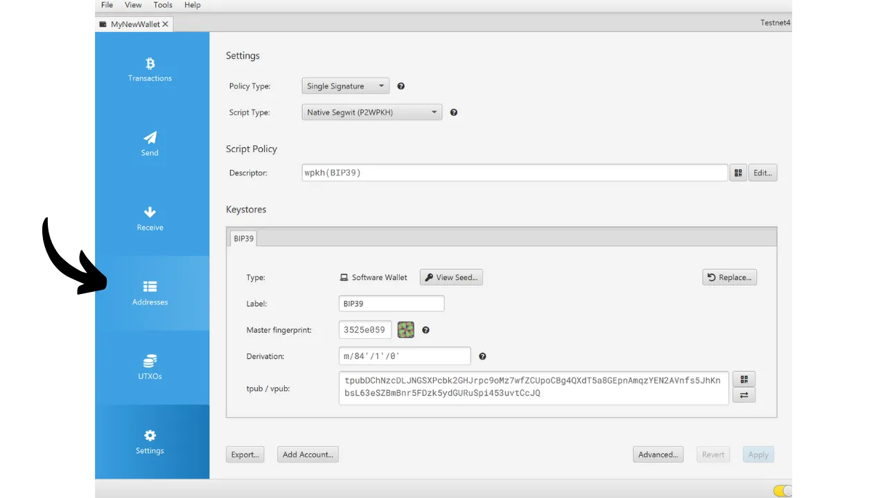

Quando crei un portafoglio Bitcoin, ti viene chiesto di annotare una frase mnemonica, solitamente composta da 12 o 24 parole. Questa frase ti permette di recuperare l'accesso ai tuoi bitcoin in caso di perdita, danneggiamento o furto del dispositivo che ospita il tuo portafoglio. Prima di iniziare a utilizzare il tuo nuovo portafoglio Bitcoin, è molto importante verificare la validità di questa frase mnemonica. Il modo migliore per farlo è eseguire un test di recupero a secco.

Questo test comporta la simulazione di un ripristino del portafoglio prima di depositare qualsiasi bitcoin al suo interno. Finché il portafoglio è vuoto, simuliamo una situazione in cui il dispositivo che ospita le nostre chiavi è perso, e tutto ciò che ci rimane è la nostra frase mnemonica per tentare di recuperare i nostri bitcoin.


## Qual è lo scopo?

Questo processo di test ti permette di verificare che il backup fisico della tua frase mnemonica, sia esso su carta o metallo, sia funzionale. Un fallimento durante questo test di recupero segnala un errore nel backup della frase, mettendo così a rischio i tuoi bitcoin. D'altra parte, se il test ha successo, conferma che la tua frase mnemonica è pienamente operativa, e puoi quindi mettere al sicuro i bitcoin con tranquillità utilizzando questo portafoglio.

Eseguire un test di recupero a secco ha un duplice vantaggio. Non solo ti permette di controllare l'accuratezza della tua frase mnemonica, ma ti dà anche l'opportunità di familiarizzare con il processo di recupero del portafoglio. In questo modo, scoprirai potenziali difficoltà prima che si presenti una situazione reale. Il giorno in cui avrai effettivamente bisogno di recuperare il tuo portafoglio, sarai meno stressato, poiché conoscerai già il processo, riducendo il rischio di errore. Ecco perché è importante non trascurare questo passaggio di test e prendersi il tempo necessario per farlo correttamente.

## Cos'è un test di recupero?

Il processo del test è abbastanza semplice:
- Dopo aver creato il tuo nuovo portafoglio Bitcoin, e prima di depositare i tuoi primi satoshi, annota una informazione testimone come un xpub, il primo indirizzo di ricezione o anche l'impronta della chiave principale;
- Poi, cancella deliberatamente il portafoglio ancora vuoto, ad esempio, ripristinando il tuo hardware wallet alle impostazioni di fabbrica;
- Successivamente, simula un recupero del tuo portafoglio utilizzando solo i backup cartacei della tua frase mnemonica e della tua passphrase se ne usi una;
- Infine, verifica se le informazioni testimone corrispondono a quelle del portafoglio rigenerato. Se le informazioni corrispondono, puoi essere assicurato dell'affidabilità del tuo backup fisico, e puoi quindi inviare i tuoi primi bitcoin a questo portafoglio.
Attenzione, durante un test di recupero, **devi utilizzare lo stesso dispositivo previsto per il tuo portafoglio finale**, per non aumentare la superficie di attacco del tuo portafoglio. Ad esempio, se crei un portafoglio su un Trezor Safe 5, assicurati di eseguire il test di recupero su questo stesso Trezor Safe 5. È importante non inserire la tua frase di recupero in nessun altro software, poiché ciò comprometterebbe la sicurezza fornita dal tuo hardware wallet, anche se il portafoglio è ancora vuoto.

## Come eseguire un test di recupero?

In questo tutorial, spiegherò come eseguire un test di recupero su un portafoglio software Bitcoin, utilizzando Sparrow Wallet (per un hot wallet). Tuttavia, il processo rimane lo stesso per qualsiasi altro tipo di dispositivo. Ancora una volta, **se stai utilizzando un hardware wallet, non eseguire il test di recupero su Sparrow Wallet** (vedi la sezione precedente).
Ho appena creato un nuovo portafoglio hot su Sparrow Wallet. Al momento, non ho ancora inviato alcun bitcoin. È vuoto.


Ho annotato con attenzione la mia frase mnemonica di 12 parole su un pezzo di carta. E poiché voglio aumentare la sicurezza di questo portafoglio, ho anche impostato una passphrase BIP39 che ho salvato su un altro pezzo di carta:

```txt
1. scudo
2. ottone
3. frase
4. cubo
5. marmo
6. contento
7. satoshi
8. porta
9. progetto
10. panico
11. preparare
12. generale
```

```text
Passphrase: YfaicGzXH9t5C#g&47Kzbc$JL
```

***Ovviamente, non dovresti mai condividere la tua frase mnemonica e la tua passphrase su internet, a differenza di quanto sto facendo in questo tutorial. Questo portafoglio di esempio non verrà utilizzato e verrà cancellato alla fine del tutorial.***

Ora annoterò su una bozza un pezzo di informazione di testimonianza dal mio portafoglio. Puoi scegliere diverse informazioni, come il primo indirizzo di ricezione, l'xpub o l'impronta digitale della chiave principale. Personalmente, consiglio di scegliere il primo indirizzo di ricezione. Questo ti permette di verificare che sei in grado di trovare il completo primo percorso di derivazione che porta a questo indirizzo.

Su Sparrow, clicca sulla scheda "*Indirizzi*".



Quindi, annota su un pezzo di carta il primissimo indirizzo di ricezione del tuo portafoglio. Nel mio esempio, l'indirizzo è:

```txt
Dopo aver annotato le informazioni, vai al menu "*File*", quindi seleziona "*Elimina Portafoglio*". Ti ricordo ancora una volta che il tuo portafoglio Bitcoin deve essere vuoto prima di procedere con questa operazione.


Se il tuo portafoglio è effettivamente vuoto, conferma l'eliminazione del tuo portafoglio.


Ora devi ripetere il processo di creazione del portafoglio, ma utilizzando i nostri backup su carta. Clicca sul menu "*File*" e poi su "*Nuovo Portafoglio*".


Inserisci nuovamente il nome del tuo portafoglio.


Nel menu "*Tipo di Script*", devi scegliere lo stesso tipo di script del portafoglio che hai precedentemente eliminato.


Poi clicca sul pulsante "*Nuovo o Importa Portafoglio Software*".


Seleziona il numero corretto di parole per il tuo seed.


Inserisci la tua frase mnemonica nel software. Se appare un messaggio "*Checksum Invalido*", ciò indica che il backup della tua frase mnemonica è incorretto. Dovrai quindi iniziare la creazione del tuo portafoglio da capo, poiché il tuo test di recupero è fallito.


Se hai una passphrase, come nel mio caso, inseriscila anche.


Clicca su "*Crea Keystore*", poi su "*Importa Keystore*".


E infine, clicca sul pulsante "*Applica*".


Ora puoi tornare alla scheda "*Indirizzi*".


Infine, verifica che il primo indirizzo di ricezione corrisponda a quello che avevi annotato come testimone sulla tua bozza.


Se gli indirizzi di ricezione corrispondono, il tuo test di recupero è riuscito e puoi utilizzare il tuo nuovo portafoglio Bitcoin. Se non corrispondono, ciò può indicare o un errore nella scelta del tipo di script, che rende il percorso di derivazione incorretto, o un problema con il backup della tua frase mnemonica o della tua passphrase. In entrambi i casi, ti consiglio vivamente di iniziare da capo e creare un nuovo portafoglio Bitcoin dall'inizio per evitare qualsiasi rischio. Questa volta, fai attenzione a notare la frase mnemonica senza errori.
Congratulazioni, ora sei aggiornato su come condurre un test di recupero! Ti consiglio di generalizzare questo processo per la creazione di tutti i tuoi portafogli Bitcoin. Se hai trovato utile questo tutorial, apprezzerei se potessi lasciare un pollice in su qui sotto. Sentiti libero di condividere questo articolo sui tuoi social network. Grazie mille!