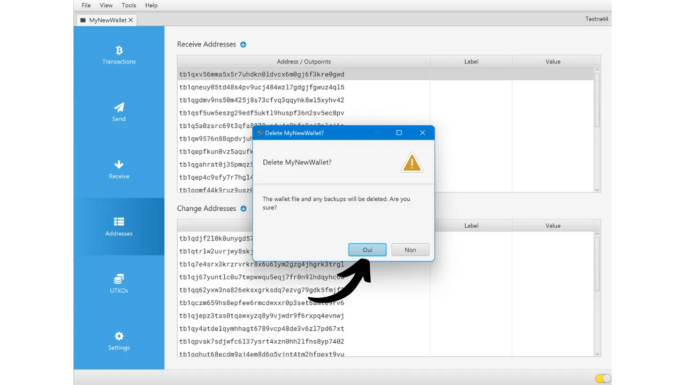

ビットコインウォレットを作成する際、通常12または24の単語からなるニーモニックフレーズをメモするよう求められます。このフレーズにより、ウォレットをホストしているデバイスの紛失、損傷、盗難の場合にビットコインへのアクセスを回復できます。新しいビットコインウォレットを使用する前に、このニーモニックフレーズの有効性を確認することが非常に重要です。これを行う最良の方法は、ドライランリカバリーテストを実行することです。

このテストは、ビットコインをウォレットに預ける前に、ウォレットの復元をシミュレートすることを含みます。ウォレットが空の間、私たちが持っているのはニーモニックフレーズだけで、私たちの鍵をホストするデバイスが失われた状況をシミュレートします。これにより、ビットコインを回復しようと試みます。


## その目的は？

このテストプロセスにより、ニーモニックフレーズの物理的なバックアップ（紙または金属にかかわらず）が機能していることを確認できます。このリカバリーテスト中の失敗は、フレーズのバックアップにエラーがあることを示し、ビットコインを危険にさらします。一方、テストが成功した場合、ニーモニックフレーズが完全に機能していることが確認され、このウォレットを使用して安心してビットコインを保護できます。

ドライランリカバリーテストを実行することには二重の利点があります。ニーモニックフレーズの正確性をチェックできるだけでなく、ウォレットの回復プロセスに慣れる機会も得られます。この方法で、実際の状況が自分に提示される前に潜在的な困難を発見できます。ウォレットを回復する必要がある日には、プロセスをすでに知っているため、ストレスが少なくなり、エラーのリスクが減少します。そのため、このテストステップを軽視せず、正しく行うために必要な時間を取ることが重要です。

## リカバリーテストとは？

テストのプロセスは非常にシンプルです：
- 新しいビットコインウォレットを作成した後、最初のサトシを預ける前に、xpub、最初の受信アドレス、またはマスターキーのフィンガープリントなどの証人情報をメモしてください。
- 次に、まだ空のウォレットを意図的に削除します。例えば、ハードウェアウォレットを工場出荷時の設定にリセットすることによります。
- 次に、ニーモニックフレーズと、使用している場合はパスフレーズの紙のバックアップのみを使用して、ウォレットの回復をシミュレートします。
- 最後に、証人情報が再生成されたポートフォリオのものと一致するかどうかを確認します。情報が一致する場合、物理的なバックアップの信頼性が保証され、最初のビットコインをこのウォレットに送ることができます。
注意してください、リカバリーテスト中には、ウォレットの攻撃面を増やさないために、**最終的なウォレット用に意図された同じデバイスを使用する必要があります**。例えば、Trezor Safe 5でウォレットを作成する場合は、この同じTrezor Safe 5でリカバリーテストを実行してください。ウォレットがまだ空であっても、他のソフトウェアにリカバリーフレーズを入力すると、ハードウェアウォレットによって提供されるセキュリティが損なわれるため、重要です。

## リカバリーテストの実行方法は？

このチュートリアルでは、Sparrow Wallet（ホットウォレット用）を使用してビットコインソフトウェアウォレットでリカバリーテストを実行する方法を説明します。ただし、プロセスは他のタイプのデバイスにも同じです。再度、**ハードウェアウォレットを使用している場合は、Sparrow Walletでリカバリーテストを実行しないでください**（前のセクションを参照）。
私はちょうどSparrow Walletで新しいホットウォレットを作成しました。現時点では、まだビットコインを送っていません。それは空です。


私は紙に12語のニーモニックフレーズを慎重に記録しました。そして、このウォレットのセキュリティを強化したいので、別の紙に保存したBIP39パスフレーズも設定しました：

```txt
1. shield
2. brass
3. sentence
4. cube
5. marble
6. glad
7. satoshi
8. door
9. project
10. panic
11. prepare
12. general
```

```text
Passphrase: YfaicGzXH9t5C#g&47Kzbc$JL
```

***明らかに、このチュートリアルで私がしているように、インターネット上でニーモニックフレーズとパスフレーズを共有してはいけません。この例のウォレットは使用されず、チュートリアルの終わりに削除されます。***

私は今、私のウォレットからの情報の証人の部分を下書きにメモします。最初の受信アドレス、xpub、またはマスターキーのフィンガープリントなど、異なる情報を選択できます。個人的には、最初の受信アドレスを選択することをお勧めします。これにより、このアドレスに至る完全な最初の導出パスを見つけることができるかどうかを確認できます。

Sparrowで、「*Addresses*」タブをクリックします。


次に、ウォレットの最初の受信アドレスを紙にメモします。私の例では、アドレスは以下の通りです：

```txt
情報をメモした後、「*File*」メニューに移動し、「*Delete Wallet*」を選択します。もう一度思い出させてくださいが、この操作を進める前にBitcoinウォレットが空である必要があります。


ウォレットが実際に空であれば、ウォレットの削除を確認します。


これで、紙のバックアップを使用してウォレットの作成プロセスを繰り返す必要があります。「*File*」メニューに移動し、「*New Wallet*」をクリックします。



ウォレットの名前を再度入力します。


「*Script Type*」メニューでは、以前に削除したウォレットと同じスクリプトタイプを選択する必要があります。


次に、「*New or Imported Software Wallet*」ボタンをクリックします。


シードの正しい単語数を選択します。


ソフトウェアにニーモニックフレーズを入力します。「*Invalid Checksum*」メッセージが表示された場合、ニーモニックフレーズのバックアップが正しくないことを示します。その場合、リカバリーテストが失敗したため、ウォレットの作成を最初からやり直す必要があります。


パスフレーズがある場合、私の場合のように、それも入力します。


「*Create Keystore*」をクリックし、「*Import Keystore*」をクリックします。


最後に、「*Apply*」ボタンをクリックします。


これで、「*Addresses*」タブに戻ることができます。


最後に、最初に受け取ったアドレスが、ドラフトで証人として記録したアドレスと一致するか確認してください。


受け取ったアドレスが一致すれば、リカバリーテストは成功です。新しいBitcoinウォレットを使用できます。一致しない場合、スクリプトタイプの選択ミスにより導出パスが間違っているか、ニーモニックフレーズやパスフレーズのバックアップに問題があることを示している可能性があります。どちらの場合も、リスクを避けるために最初からやり直し、新しいBitcoinウォレットを作成することを強くお勧めします。今回は、ニーモニックフレーズを間違いなくメモするように注意してください。
おめでとうございます、リカバリーテストの実施方法をマスターしました！このプロセスをすべてのBitcoinウォレットの作成に一般化することをお勧めします。このチュートリアルが役に立ったと思われる場合、以下でサムズアップをしていただけると嬉しいです。この記事をソーシャルネットワークで共有してください。どうもありがとうございました！