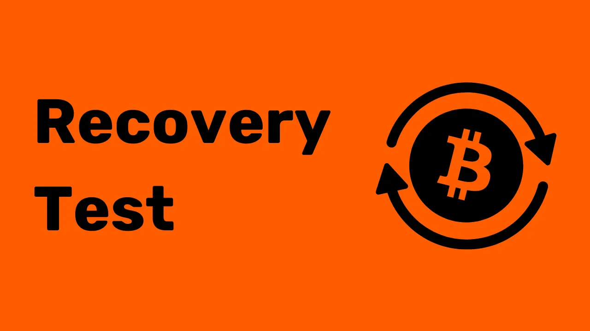
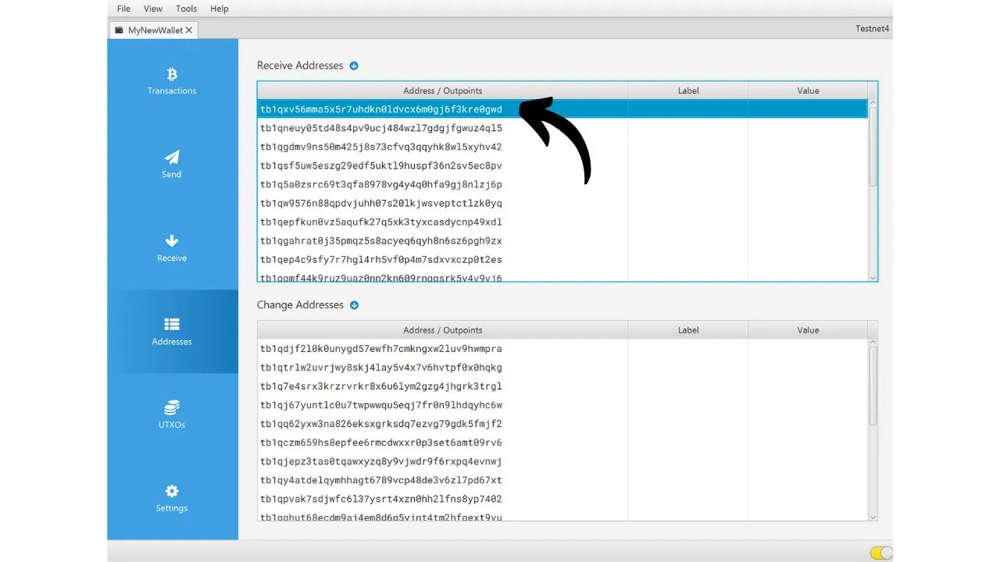
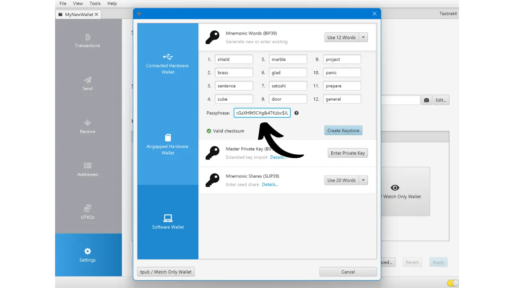

При создании биткойн-кошелька вам предлагается записать мнемоническую фразу, обычно состоящую из 12 или 24 слов. Эта фраза позволяет вам восстановить доступ к вашим биткойнам в случае потери, повреждения или кражи устройства, на котором хранится ваш кошелек. Прежде чем начать использовать ваш новый биткойн-кошелек, очень важно проверить действительность этой мнемонической фразы. Лучший способ сделать это - выполнить тестовое восстановление без реального использования кошелька.

Этот тест включает в себя симуляцию восстановления кошелька до того, как вы внесете в него какие-либо биткойны. Пока кошелек пуст, мы симулируем ситуацию, когда устройство, хранящее наши ключи, потеряно, и у нас осталась только наша мнемоническая фраза для попытки восстановить наши биткойны.


## Какова цель?

Этот процесс тестирования позволяет вам проверить, что физическая резервная копия вашей мнемонической фразы, будь то на бумаге или металле, функционирует. Сбой во время этого теста восстановления сигнализирует об ошибке в резервной копии фразы, тем самым подвергая ваши биткойны риску. С другой стороны, если тест успешен, это подтверждает, что ваша мнемоническая фраза полностью работоспособна, и вы можете затем с миром души использовать этот кошелек для хранения биткойнов.

Выполнение теста восстановления без реального использования имеет двойное преимущество. Это не только позволяет вам проверить точность вашей мнемонической фразы, но также дает вам возможность ознакомиться с процессом восстановления кошелька. Таким образом, вы обнаружите потенциальные трудности до того, как наступит реальная ситуация. В день, когда вам действительно потребуется восстановить ваш кошелек, вы будете менее встревожены, так как уже будете знать процесс, что снижает риск ошибки. Вот почему важно не пренебрегать этим этапом тестирования и уделить необходимое время для его правильного выполнения.

## Что такое тест восстановления?

Процесс теста довольно прост:
- После создания вашего нового биткойн-кошелька и до внесения ваших первых сатоши, запишите информацию-свидетельство, такую как xpub, первый адрес получения или даже отпечаток мастер-ключа;
- Затем, намеренно удалите все еще пустой кошелек, например, сбросив ваш аппаратный кошелек до заводских настроек;
- Далее, симулируйте восстановление вашего кошелька, используя только бумажные резервные копии вашей мнемонической фразы и вашу парольную фразу, если вы ее используете;
- Наконец, проверьте, совпадает ли информация-свидетельство с той, что у воссозданного портфеля. Если информация совпадает, вы можете быть уверены в надежности вашей физической резервной копии, и тогда вы можете отправить ваши первые биткойны в этот кошелек.
Будьте осторожны, во время теста восстановления **вы должны использовать то же устройство, которое предназначено для вашего окончательного кошелька**, чтобы не увеличивать поверхность атаки вашего кошелька. Например, если вы создаете кошелек на Trezor Safe 5, убедитесь, что вы выполняете тест восстановления на этом же Trezor Safe 5. Важно не вводить вашу фразу восстановления в какое-либо другое программное обеспечение, так как это может подорвать безопасность, предоставляемую вашим аппаратным кошельком, даже если кошелек еще пуст.

## Как выполнить тест восстановления?

В этом руководстве я объясню, как выполнить тест восстановления на биткойн-кошельке программного обеспечения, используя Sparrow Wallet (для горячего кошелька). Однако процесс остается тем же для любого другого типа устройства. Опять же, **если вы используете аппаратный кошелек, не выполняйте тест восстановления на Sparrow Wallet** (см. предыдущий раздел).
Я только что создал новый горячий кошелек в Sparrow Wallet. На данный момент я еще не отправил туда никаких биткойнов. Он пуст.


Я внимательно записал свою 12-словную мнемоническую фразу на листе бумаги. И поскольку я хочу повысить безопасность этого кошелька, я также установил фразу-пароль BIP39, которую сохранил на другом листе бумаги:

```txt
1. shield
2. brass
3. sentence
4. cube
5. marble
6. glad
7. satoshi
8. door
9. project
10. panic
11. prepare
12. general
```

```text
Passphrase: YfaicGzXH9t5C#g&47Kzbc$JL
```

***Очевидно, что вы никогда не должны делиться своей мнемонической фразой и парольной фразой в интернете, в отличие от того, что я делаю в этом учебнике. Этот пример кошелька не будет использоваться и будет удален в конце учебника.***

Теперь я запишу на черновик информацию-свидетельство из моего кошелька. Вы можете выбрать разные части информации, например, первый адрес получения, xpub или отпечаток мастер-ключа. Лично я рекомендую выбрать первый адрес получения. Это позволяет вам проверить, что вы можете найти полный первый путь производного ключа, ведущий к этому адресу.

В Sparrow нажмите на вкладку "*Адреса*".


Затем запишите на листе бумаги самый первый адрес получения вашего кошелька. В моем примере адрес:

```txt
После записи информации перейдите в меню "*Файл*", затем выберите "*Удалить кошелек*". Я напоминаю вам еще раз, что ваш биткойн-кошелек должен быть пуст перед выполнением этой операции.



Если ваш кошелек действительно пуст, подтвердите удаление кошелька.


Теперь вам нужно повторить процесс создания кошелька, но используя наши бумажные резервные копии. Нажмите на меню "*Файл*" и затем на "*Новый кошелек*".


Введите имя вашего кошелька снова.


В меню "*Тип скрипта*" вам нужно выбрать тот же тип скрипта, что и у кошелька, который вы ранее удалили.


Затем нажмите на кнопку "*Новый или импортированный программный кошелек*".


Выберите правильное количество слов для вашей сид-фразы.


Введите вашу мнемоническую фразу в программу. Если появляется сообщение "*Неверная контрольная сумма*", это указывает на то, что резервная копия вашей мнемонической фразы неверна. Вам тогда придется начать создание вашего кошелька с нуля, так как ваш тест восстановления провалился.


Если у вас есть парольная фраза, как в моем случае, также введите ее.


Нажмите на "*Создать хранилище ключей*", затем на "*Импортировать хранилище ключей*".



И, наконец, нажмите на кнопку "*Применить*".


Теперь вы можете вернуться на вкладку "*Адреса*".


Наконец, убедитесь, что первый получаемый адрес совпадает с тем, который вы записали как свидетеля в вашем черновике.


Если получаемые адреса совпадают, ваш тест восстановления прошел успешно, и вы можете использовать ваш новый Bitcoin кошелек. Если они не совпадают, это может указывать либо на ошибку в выборе типа скрипта, из-за чего путь производных становится некорректным, либо на проблему с резервным копированием вашей мнемонической фразы или вашей парольной фразы. В обоих случаях я настоятельно рекомендую начать сначала и создать новый Bitcoin кошелек с нуля, чтобы избежать любых рисков. На этот раз будьте внимательны, записывая мнемоническую фразу без ошибок.
Поздравляю, теперь вы в курсе, как проводить тест восстановления! Я советую вам обобщить этот процесс для создания всех ваших Bitcoin кошельков. Если вы нашли этот учебник полезным, я был бы признателен, если бы вы могли оставить лайк ниже. Не стесняйтесь делиться этой статьей в ваших социальных сетях. Большое спасибо!