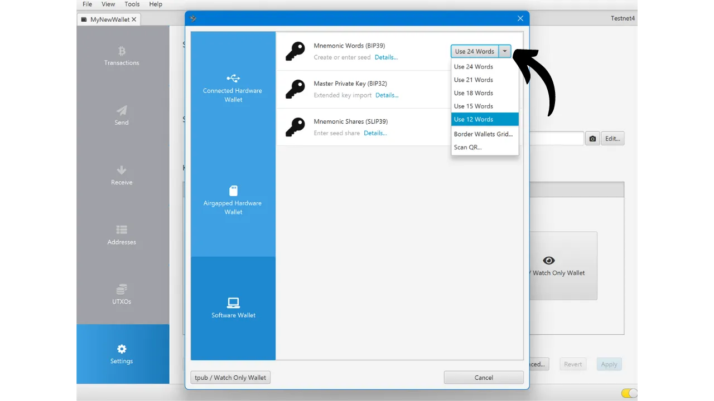

创建比特币钱包时，系统会要求您记录一个助记词短语，通常由12个或24个单词组成。这个短语允许您在设备丢失、损坏或被盗的情况下恢复对比特币的访问权限。在开始使用新的比特币钱包之前，验证这个助记词短语的有效性非常重要。最好的验证方法是执行一次干运行恢复测试。

这个测试涉及在往钱包中存入任何比特币之前模拟钱包恢复的过程。只要钱包是空的，我们就模拟一种情况，即托管我们密钥的设备丢失了，我们只剩下助记词短语来尝试恢复我们的比特币。


## 目的是什么？

这个测试过程允许您验证助记词短语的物理备份（无论是纸质的还是金属的）是否可用。在这次恢复测试中出现失败表明短语备份中存在错误，从而使您的比特币面临风险。另一方面，如果测试成功，它确认您的助记词短语完全可用，然后您可以使用这个钱包安心地保护您的比特币。

执行干运行恢复测试有双重优势。它不仅允许您检查助记词短语的准确性，还给您机会熟悉钱包恢复过程。这样，您将在真正的情况出现之前发现潜在的困难。在您真正需要恢复钱包的那一天，您会感到压力较小，因为您已经知道了过程，减少了出错的风险。这就是为什么不要忽视这个测试步骤并且需要花必要的时间正确地做它的原因。

## 什么是恢复测试？

测试过程相当简单：
- 在创建新的比特币钱包，并在存入您的第一个satoshi之前，记录一个见证信息，比如一个xpub、第一个接收地址，甚至是主密钥指纹；
- 然后，故意删除仍然为空的钱包，例如，通过将您的硬件钱包重置为出厂设置；
- 接下来，仅使用您的助记词短语和您的密码短语（如果您使用的话）的纸质备份模拟恢复您的钱包；
- 最后，检查见证信息是否与重新生成的投资组合匹配。如果信息匹配，您可以确信您的物理备份的可靠性，然后您可以向这个钱包发送您的第一笔比特币。
注意，在进行恢复测试时，**您必须使用预定用于您最终钱包的相同设备**，以免增加您钱包的攻击面。例如，如果您在Trezor Safe 5上创建一个钱包，请确保在同一个Trezor Safe 5上执行恢复测试。重要的是不要将您的恢复短语输入到任何其他软件中，因为这将会威胁到您的硬件钱包提供的安全性，即使钱包仍然是空的。

## 如何执行恢复测试？

在本教程中，我将解释如何在比特币软件钱包上执行恢复测试，使用Sparrow Wallet（对于热钱包）。然而，对于任何其他类型的设备，过程保持不变。再次强调，**如果您使用的是硬件钱包，请不要在Sparrow Wallet上执行恢复测试**（见上一节）。
我刚刚在Sparrow Wallet上创建了一个新的热钱包。目前，我还没有向它发送任何比特币。它是空的。


我已经仔细地将我的12个单词的助记词短语记在了一张纸上。而且，因为我想增强这个钱包的安全性，我还设置了一个BIP39密码短语，并将其保存在另一张纸上：

```txt
1. shield
2. brass
3. sentence
4. cube
5. marble
6. glad
7. satoshi
8. door
9. project
10. panic
11. prepare
12. general
```

```text
密码短语: YfaicGzXH9t5C#g&47Kzbc$JL
```

***显然，你永远不应该像我在这个教程中所做的那样，在互联网上分享你的助记词短语和密码短语。这个示例钱包将不会被使用，并且在教程结束时将被删除。***

我现在将在草稿上记录我钱包中的一个见证信息。你可以选择不同的信息，比如第一个接收地址、xpub或主密钥指纹。个人来说，我推荐选择第一个接收地址。这允许你验证你能够找到通往这个地址的完整第一个派生路径。

在Sparrow上，点击“*地址*”标签。


然后，在一张纸上记下你钱包的第一个接收地址。在我的例子中，地址是：

```txt
记录信息后，转到“*文件*”菜单，然后选择“*删除钱包*”。我再次提醒你，在进行这个操作之前，你的比特币钱包必须是空的。


如果你的钱包确实是空的，确认删除你的钱包。


现在你需要重复钱包创建过程，但使用我们的纸质备份。点击“*文件*”菜单，然后点击“*新建钱包*”。


再次输入你的钱包名称。


在“*脚本类型*”菜单中，你需要选择与你之前删除的钱包相同的脚本类型。


然后点击“*新建或导入软件钱包*”按钮。


选择你的种子的正确单词数量。


将你的助记词短语输入到软件中。如果出现“*校验和无效*”消息，这表明你的助记词短语备份是不正确的。那么你将不得不从头开始创建你的钱包，因为你的恢复测试失败了。



如果你有密码短语，像我这样，也输入它。


点击“*创建密钥库*”，然后点击“*导入密钥库*”。


最后，点击“*应用*”按钮。


你现在可以返回到“*地址*”标签。


最后，验证第一个接收地址是否与您在草稿中作为见证人记录的地址匹配。


如果接收地址匹配，您的恢复测试就成功了，您可以使用您的新比特币钱包。如果它们不匹配，这可能表明脚本类型选择错误，导致派生路径不正确，或者是您的助记词短语或密码短语备份存在问题。在这两种情况下，我强烈建议从头开始，重新创建一个新的比特币钱包，以避免任何风险。这次，注意无误地记录助记词短语。
恭喜你，现在你已经掌握了进行恢复测试的方法！我建议你将这个过程普及到所有比特币钱包的创建中。如果你觉得这个教程有帮助，我会很感激你能在下面点个赞。随时在你的社交网络上分享这篇文章。非常感谢！