Po zatčení zakladatelů Samourai Wallet a zabavení jejich serverů 24. dubna jsou některé funkce aplikace nyní nefunkční a uživatelé, kteří nemají vlastní Dojo, již nemohou odesílat transakce.

Po pomoci několika uživatelům s obnovou jejich bitcoinů v posledních dnech se domnívám, že jsem narazil na většinu problémů, které mohou při obnově Samourai Wallet nastat. Proto tento návod začne situací, kde identifikujeme funkce, které zůstávají operativní, a ty, které už v ekosystému Samourai Wallet a v software, který byl tímto incidentem ovlivněn, nejsou dostupné. Dále budeme postupovat krok za krokem k obnově Samourai Wallet pomocí softwaru Sparrow Wallet. Prozkoumáme všechny potenciální překážky, které se během tohoto procesu mohou objevit, a uvidíme řešení, jak je vyřešit. Nakonec, v poslední části, objevíte potenciální rizika pro vaše soukromí po zabavení serverů.

*Velké poděkování patří [@Louferlou](https://twitter.com/Louferlou), který pomohl několika uživatelům s jejich obnovou a podělil se se mnou o své zkušenosti, a který také přispěl k testování, aby určil, co je stále funkční.*

## Funguje Samourai Wallet stále?

Ano, **aplikace Samourai Wallet stále funguje**, ale za určitých podmínek.

Za prvé, je nutné, aby aplikace byla předtím nainstalována na vašem smartphonu. Google Play Store aplikaci odstranil a APK bylo hostováno na zabavené webové stránce. Proto je v současné době instalace Samourai komplikovaná. Můžete najít APK online, ale nedoporučuji je stahovat, pokud si nejste jisti zdrojem.

Vzhledem k tomu, že stránka Samourai Wallet již není dostupná na Google Play Store, není možné zakázat automatické aktualizace. Pokud se aplikace vrátí na platformy pro stahování, bylo by moudré **zakázat automatické aktualizace**, dokud nebudou k dispozici další informace týkající se vývoje případu.

Pokud je Samourai Wallet již nainstalován na vašem smartphonu, měli byste mít stále přístup k aplikaci. Pro použití funkce peněženky Samourai je nezbytné připojit Dojo. Dříve uživatelé bez osobního Dojo záviseli na serverech Samourai pro přístup k informacím o Bitcoin blockchainu a pro odesílání transakcí. S zabavením těchto serverů aplikace již nemůže přistupovat k těmto datům.
Pokud jste předtím neměli připojené Dojo, ale nyní ano, můžete jej nastavit pro opětovné použití vaší aplikace Samourai. To zahrnuje kontrolu vašich záloh, smazání peněženky (peněženky, nikoli aplikace) a obnovu peněženky připojením vašeho Dojo k aplikaci. Pro více detailů k těmto krokům se můžete poradit s [tímto návodem, v sekci "_Příprava vaší Samourai Wallet_" : COINJOIN - DOJO](https://planb.network/en/tutorials/privacy/coinjoin-dojo).
Pokud byla vaše aplikace Samourai již připojena k vašemu vlastnímu Dojo, pak část peněženky pro vás funguje perfektně. Stále můžete vidět váš zůstatek a odesílat transakce. Navzdory všemu, co se děje, si myslím, že Samourai Wallet zůstává v současnosti nejlepším mobilním softwarem pro peněženky. Osobně plánuji jeho používání pokračovat.
Hlavním problémem, se kterým se můžete setkat, je nedostupnost účtů Whirlpool v aplikaci. Obvykle se Samourai pokouší navázat spojení s vaším Whirlpool CLI a spustit cykly coinjoin, než vám umožní přístup k těmto účtům. Nicméně, jelikož toto spojení již není možné, aplikace neustále hledá bez toho, aby vám kdy poskytla přístup k účtům Whirlpool. V tomto případě můžete tyto účty obnovit v jiném softwaru pro peněženky, zatímco na Samourai si ponecháte pouze účet pro vklady.
### Jaké nástroje jsou stále dostupné na Samourai?

Na druhou stranu, některé nástroje jsou buď ovlivněny vypnutím serveru, nebo úplně nedostupné.

Pokud jde o individuální nástroje pro utrácení, vše funguje normálně, samozřejmě za předpokladu, že máte vlastní Dojo. Normální transakce Stonewall (a ne Stonewall x2) fungují bez jakéhokoli problému.

Komentáře na Twitteru upozornily na to, že soukromí nabízené transakcí Stonewall by nyní mohlo být sníženo. Přidaná hodnota transakce Stonewall spočívá ve skutečnosti, že je z hlediska struktury nerozeznatelná od transakce Stonewall x2. Když analytik narazí na tento konkrétní vzor, nemůže určit, zda jde o standardní Stonewall s jedním uživatelem nebo o Stonewall x2 s účastí dvou uživatelů. Avšak, jak uvidíme v následujících odstavcích, provádění transakcí Stonewall x2 se stalo složitějším kvůli nedostupnosti Sorobanu. Někteří proto myslí, že analytik by nyní mohl předpokládat, že jakákoli transakce s touto strukturou je normální Stonewall. Osobně s tímto předpokladem nesouhlasím. I když mohou být transakce Stonewall x2 méně časté (a myslím, že už před tímto incidentem byly), skutečnost, že jsou stále možné, může zneplatnit celou analýzu založenou na předpokladu, že nejsou.
**[-> Dozvědět se více o transakcích Stonewall.](https://planb.network/tutorials/privacy/stonewall)**
Pokud jde o Ricochet, nebyl jsem schopen ověřit, zda je služba stále funkční, protože nemám Dojo na Testnetu, a raději neriskuji utrácení `100 000 sats` směrem k peněžence, která by mohla být kontrolována úřady. Pokud jste měli nedávno příležitost tento nástroj otestovat, zvu vás, abyste se se mnou spojili, abychom mohli tento článek aktualizovat.

Pokud potřebujete použít Ricochet, mějte na paměti, že tuto operaci můžete vždy provést ručně s jakýmkoli softwarem pro peněženky. Jak správně provést jednotlivé skoky ručně, doporučuji konzultovat tento další článek: [**RICOCHET**](https://planb.network/tutorials/privacy/ricochet).

Nástroj JoinBot již není funkční, jelikož byl zcela závislý na účasti peněženky spravované Samourai.

Pokud jde o další typy spolupracujících transakcí, často označované jako "cahoots", zůstávají možné, ale pouze ručně. Před vypnutím serveru jste měli dvě možnosti, jak provést transakce Stonewall x2 nebo Stowaway (PayJoin):
- Použít síť Soroban pro automatickou a vzdálenou výměnu PSBT;
- Nebo provést tyto výměny ručně skenováním několika QR kódů.

Po několika testech se ukázalo, že Soroban již nefunguje. Provedení těchto spolupracujících transakcí tedy musí proběhnout ručně. Zde jsou dvě možnosti, jak provést tuto výměnu:
- Pokud jste fyzicky blízko svému spolupracovníkovi, můžete postupně skenovat QR kódy.
- Pokud jste od svého spolupracovníka vzdáleni, můžete si PSBTs vyměňovat prostřednictvím externího komunikačního kanálu aplikace. Buďte ovšem opatrní, protože data obsažená v těchto PSBTs jsou citlivá z hlediska soukromí. Doporučuji použít šifrovanou zprávu, abyste zajistili důvěrnost výměny.
**[-> Dozvědět se více o transakcích Stonewall x2.](https://planb.network/tutorials/privacy/stonewall-x2)**

**[-> Dozvědět se více o transakcích Stowaway.](https://planb.network/tutorials/privacy/payjoin-samourai-wallet)**

Co se týče Whirlpool, protokol již zdá se nefunguje, ani pro uživatele, kteří mají vlastní Dojo. Poslední dny jsem sledoval svůj RoninDojo a pokusil se o některé základní manipulace, ale Whirlpool CLI se od vypnutí serveru nepodařilo připojit.

Nicméně stále doufám, že tento protokol může být znovu aktivován nebo možná představen jinak v nadcházejících týdnech, v závislosti na tom, jak se situace vyvine. Tato pauza by mohla být příležitostí prozkoumat nové přístupy nebo potenciální zlepšení tohoto systému.
### Jaké externí nástroje jsou stále dostupné?
Pokud jde o další nástroje související s prostředím Samourai, některé jsou stále dostupné, zatímco jiné ne.

Webová stránka pro analýzu řetězců OXT.me bohužel není momentálně dostupná.

Nástroj Whirlpool Stats Tool již není dostupný ke stažení, protože byl hostován na GitLabu Samourai. I když jste si tento Python nástroj dříve stáhli lokálně na svůj počítač, nebo pokud byl nainstalován na vašem uzlu RoninDojo, WST momentálně nebude fungovat. Skutečně závisel na datech poskytovaných webem OXT.me pro svou činnost, a tento web již není přístupný. Aktuálně WST není zvláště užitečný, protože protokol Whirlpool je neaktivní.

Web KYCP.org momentálně také není přístupný.

GitLab, který hostil kód pro nástroj Boltzmann Calculator Python, byl také zabaven. V tuto chvíli tedy není možné tento nástroj stáhnout. Ale pokud máte RoninDojo, můžete pokračovat v používání Boltzmann Calculator stejným způsobem jako dříve.

Co se týče RoninDojo, tento software node-in-box stále správně funguje navzdory nedostupnosti určitých specifických nástrojů, jako jsou Whirlpool CLI a WST. Stále jej lze používat pro jiný software peněženky díky Fulcrum nebo Electrs. Pokud si přejete získat více informací o RoninDojo nebo máte konkrétní otázky, doporučuji se připojit k [jejich Telegramové skupině](https://t.me/RoninDojoNode).

Nicméně zdrojový kód pro RoninDojo momentálně není přístupný, protože byl hostován na GitLabu Samourai. V tuto chvíli tedy není možné jej ručně nainstalovat na Raspberry Pi.

Pokud jde o software peněženky pouze pro sledování Sentinel, situace je podobná jako u aplikace Samourai. Pokud máte vlastní Dojo, můžete Sentinel používat bez problémů. Pokud však nemáte Dojo, nebude možné navázat spojení. Na rozdíl od Samourai je webová stránka Sentinel stále přístupná online. Buďte ale opatrní s tímto webem a nabízeným APK, protože není jasné, kdo v současnosti tyto zdroje kontroluje.

### Je Sparrow Wallet ovlivněn?
Sparrow Wallet pokračuje v normálním provozu, s výjimkou nástrojů Samourai, které již nejsou dostupné. V současné době již není možné provádět coinjoins prostřednictvím Sparrow. Podobně, nástroje pro společné výdaje již nejsou přístupné, jelikož Sparrow nenabízí možnost manuální výměny PSBT, na rozdíl od Samourai. Pro všechny ostatní funkce Sparrow funguje bez problémů. Tento software můžete také použít k obnovení peněženky Samourai, pokud je to nutné.

## Jak obnovit peněženku Samourai?
Jak jsme viděli v předchozích částech, pokud vlastníte vlastní Dojo, není nutně vyžadováno přechod na jiný software. **Samourai zůstává vynikající volbou hot peněženky** pro vaše denní výdaje. Pokud však nemáte Dojo nebo pokud dáváte přednost jinému softwaru, vysvětlím kompletní proces obnovy, včetně možných překážek, které byste mohli potkat.

V každém případě je důležité si dát čas a zajistit, abyste neudělali žádné chyby. Pamatujte, není kam spěchat, protože držíte své privátní klíče a zabavení serverů Samourai to nijak neovlivňuje. Ať se stane cokoliv, nemohou samozřejmě přistupovat k vašim privátním klíčům.

### Ověřte heslovou frázi

Pro obnovu vaší peněženky musíte mít vaši heslovou frázi, i když se rozhodnete pro obnovu prostřednictvím záložního souboru. Začněte ověřením platnosti této heslové fráze. Otevřete aplikaci Samourai Wallet, klikněte na vaši ikonu Paynym v levém horním rohu, poté vyberte `Settings`.

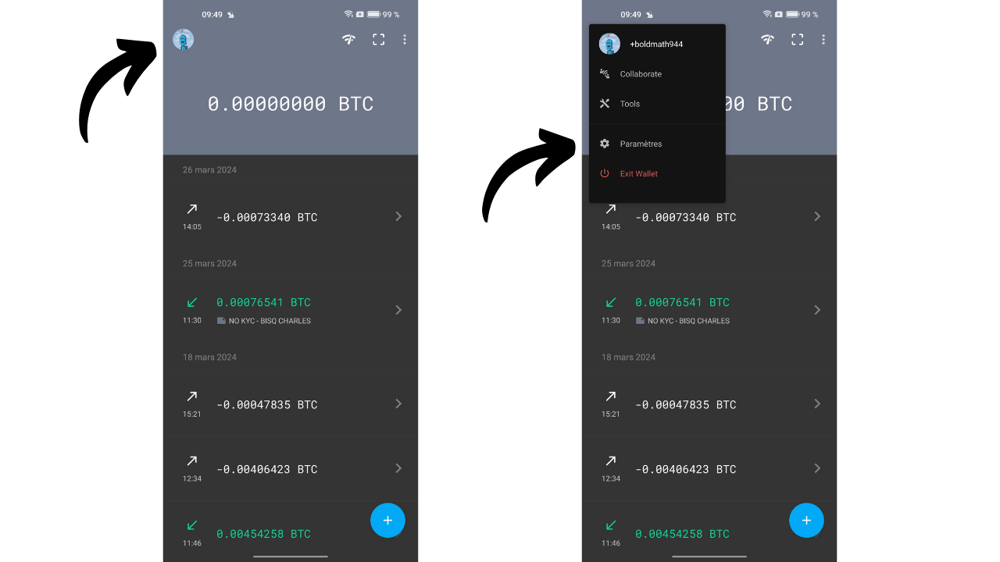

Dále klikněte na `Troubleshooting` a poté na `Passphrase/backup test`.

Zadejte vaši heslovou frázi a klikněte na `Ok`. Pokud je správná, Samourai to potvrdí. Máte také možnost ověřit záložní soubor, pokud plánujete jeho pozdější použití.

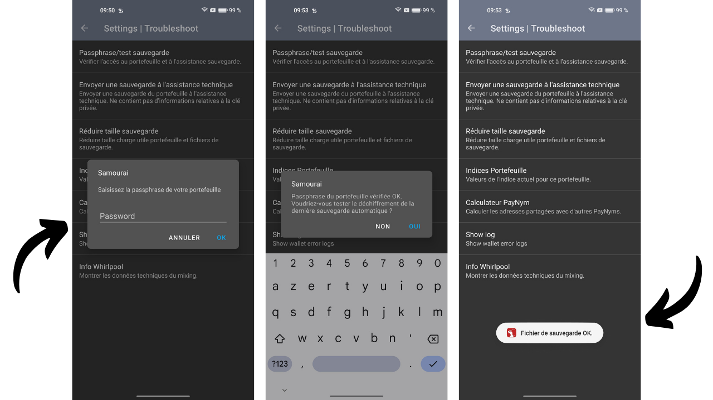

Tento krok je volitelný, ale doporučený. Potvrzuje, že heslová fráze je správná, eliminuje potenciální zdroj problémů později. Pokud Samourai v této fázi uvede, že heslová fráze je nesprávná, obnova nebude možná. Ujistěte se, že jste heslovou frázi zadali správně a zkontrolujte ji znovu.

### Možnost 1: Obnovit peněženku na Sparrow s pomocí záložního souboru

Od verze 1.8.6 Sparrow Wallet je možné přímo importovat vaši peněženku Samourai pomocí záložního textového souboru pojmenovaného `samourai.txt`, který vaše aplikace automaticky generuje. Tento soubor obsahuje všechny potřebné informace pro obnovu vaší peněženky a je zašifrován vaší heslovou frází pro zabezpečení.

Pokud si vyberete tuto možnost, budete potřebovat váš aktuální soubor `samourai.txt` a vaši heslovou frázi. Pro generování tohoto souboru v Samourai Wallet klikněte na tři malé tečky v pravém horním rohu, poté vyberte `Export wallet backup`.

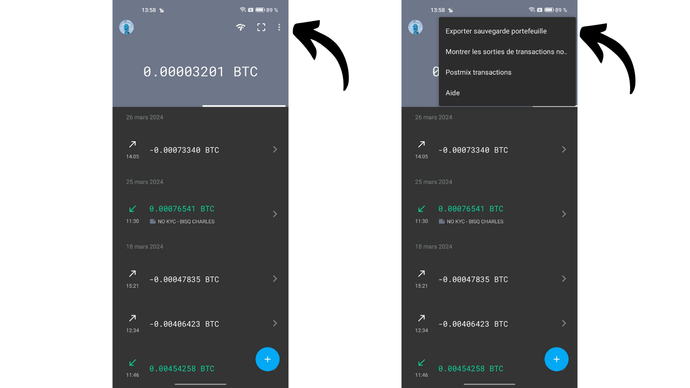
Poté vyberte `Export to Clipboard`. Poté budete muset tento soubor bezpečně přenést na váš PC. Jelikož je soubor zašifrován, ale heslová fráze sama o sobě postačuje k jeho dešifrování, je důležité při jeho přenosu zachovat opatrnost. Pokud se rozhodnete pro přímý přenos jako prostý text, budete muset na vašem PC vytvořit soubor `samourai.txt` a vložit do něj obsah schránky. Alternativou by mohlo být přímé načtení souboru `samourai.txt` ze souborů uložených ve vašem telefonu.
Jakmile máte přístup k souboru na vašem PC, otevřete Sparrow Wallet, klikněte na záložku `File` a vyberte `Import Wallet` pro zahájení importu vaší peněženky.

Posuňte se dolů k `Samourai Backup`, klikněte na `Importovat soubor` a poté vyberte svůj soubor `samourai.txt`.

Sparrow vás poté požádá o heslo pro dešifrování souboru. Toto heslo je ve skutečnosti vaše heslová fráze. Zadejte ji do příslušného pole a klikněte na `Importovat`.

Pokud v této fázi vaše peněženka neobjeví, je možné, že jste udělali chybu při kopírování souboru `samourai.txt` nebo při zadávání heslové fráze. Pro další pomoc můžete konzultovat sekci pro řešení problémů.

Co se týče typu skriptu, pokud jste v Samourai nenastavili jiné skripty, měli byste normálně používat pouze SegWit V0 (Native SegWit / P2WPKH). Ponechte tento výchozí skript a klikněte na `Importovat`.

Pojmenujte svou peněženku, například "Samourai Recovery", a poté klikněte na `Vytvořit peněženku`.

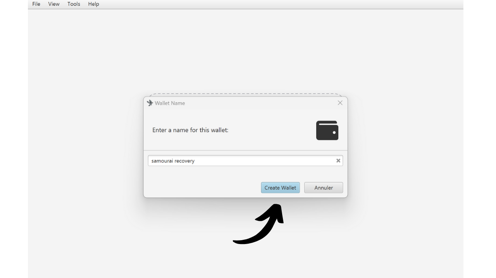

Sparrow vás poté požádá o zvolení hesla. Toto heslo chrání pouze přístup k vaší peněžence na tomto PC a nesouvisí s odvozením klíčů vaší peněženky. Ujistěte se, že si vyberete silné heslo, zapište si ho, abyste si ho pamatovali, a klikněte na `Nastavit heslo`.

Sparrow poté odvodí klíče vaší peněženky a vyhledá odpovídající transakce.

Zatím je přístupný pouze váš účet pro vklady. Pokud jste Samourai používali pouze pro tento účet, měli byste vidět všechny své prostředky. Pokud jste však používali také Whirlpool, budete muset odvodit účty `premix`, `postmix` a `badbank`. Na Sparrow jednoduše klikněte na záložku `Nastavení`, poté na `Přidat účty...`.

V otevřeném okně vyberte z rozevíracího menu `Whirlpool Accounts`, poté klikněte na `OK`.

Poté uvidíte své různé účty Whirlpool a Sparrow odvodí potřebné klíče pro použití přidružených bitcoinů.

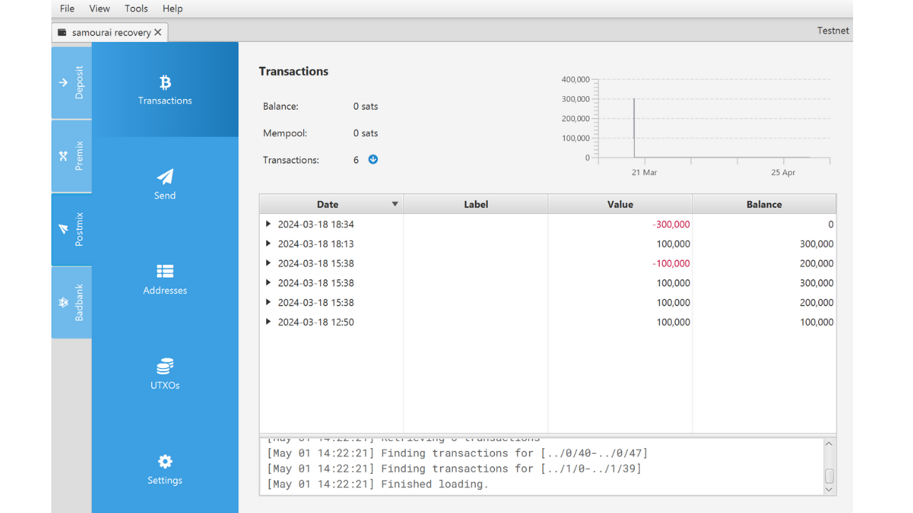

Pokud používáte k obnově vaší peněženky Samourai jiný software než Sparrow, jako je Electrum, zde jsou indexy účtů Whirlpool pro manuální obnovu:
- Vklad: `m/84'/0'/0'`
- Bad Bank: `m/84'/0'/2147483644'`
- Premix: `m/84'/0'/2147483645'`
- Postmix: `m/84'/0'/2147483646'`

Nyní máte přístup ke svým bitcoinům na Sparrow. Pokud potřebujete pomoc s používáním Sparrow Wallet, můžete také zkontrolovat [náš věnovaný tutoriál](https://planb.network/tutorials/wallet/sparrow).

Doporučuji také ručně importovat štítky, které jste měli spojené s vašimi UTXOs na Samourai. To vám umožní následně provádět efektivní kontrolu mincí na Sparrow.

### Možnost 2: Obnovit peněženku na Sparrow pomocí mnemonické fráze

Pokud nechcete provádět obnovu pomocí záložního souboru, můžete zvolit tradičnější metodu jednoduše použitím vaší 12slovné obnovovací fráze a vaší heslové fráze. Tato druhá možnost je často jednodušší.
Na začátku se ujistěte, že máte po ruce svou obnovovací frázi a heslovou frázi. Poté otevřete software Sparrow Wallet, klikněte na záložku `File` a vyberte `Import Wallet` pro zahájení importu vaší peněženky.

Vyberte `Mnemonic Words (BIP39)` a v rozbalovacím menu klikněte na `Use 12 Words`.

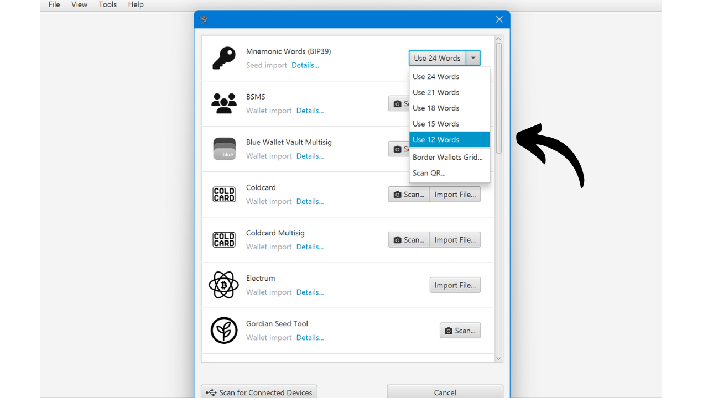

Zadejte 12 slov vaší obnovovací fráze ve správném pořadí.

Pokud Sparrow zobrazí zprávu `Invalid Checksum`, to znamená, že kontrolní součet obnovovací fráze není platný, což pravděpodobně znamená, že jste udělali chybu při zadávání slov.

Pokud je vaše fráze správná, zaškrtněte políčko `Use Passphrase?` a zadejte vaši heslovou frázi do příslušného pole. Nakonec, pokud všechno vypadá správně, klikněte na tlačítko `Discover Wallet`.

Pojmenujte svou peněženku, například "Samourai Recovery", a poté klikněte na `Create Wallet`.

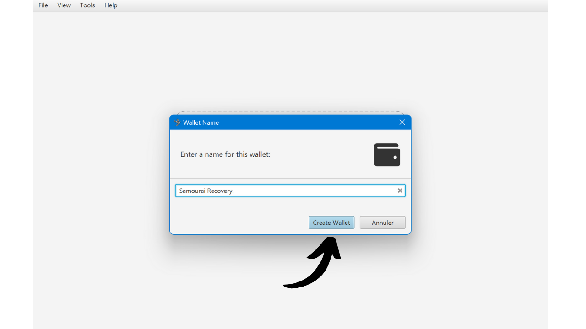
Sparrow vás poté požádá o výběr hesla. Toto heslo chrání pouze přístup k vaší peněžence na tomto PC a nesouvisí s odvozením klíčů vaší peněženky. Ujistěte se, že si vyberete silné heslo, zapište si ho, abyste si ho pamatovali, a klikněte na `Set Password`.

Sparrow poté odvodí klíče pro vaši peněženku a vyhledá odpovídající transakce.

Pokud v této fázi vaše peněženka neobjeví, je možné, že jste udělali chybu při zadávání heslové fráze nebo obnovovací fráze. Pro další pomoc můžete konzultovat příslušnou sekci řešení problémů.

Prozatím je přístupný pouze váš účet pro vklady. Pokud jste používali Samourai pouze pro tento účet, měli byste vidět všechny své prostředky. Pokud jste však používali také Whirlpool, budete muset odvodit účty `premix`, `postmix` a `badbank`. Na Sparrow jednoduše klikněte na záložku `Settings`, a poté na `Add Accounts...`.

V otevřeném okně vyberte z rozbalovacího seznamu `Whirlpool Accounts`, a poté klikněte na `OK`.

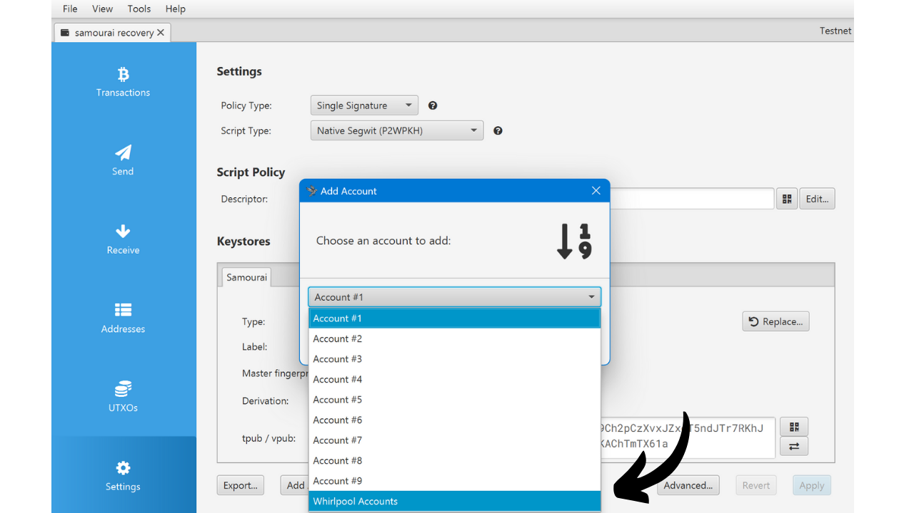

Poté uvidíte vaše různé účty Whirlpool a Sparrow odvodí potřebné klíče pro použití přidružených bitcoinů.

Pokud používáte jiný software, jako je Electrum, pro obnovu vaší peněženky Samourai, zde jsou indexy účtů Whirlpool pro ruční obnovu:
- Deposit: `m/84'/0'/0'`
- Bad Bank: `m/84'/0'/2147483644'`
- Premix: `m/84'/0'/2147483645'`
- Postmix: `m/84'/0'/2147483646'`

Nyní máte přístup k vašim bitcoinům na Sparrow. Pokud potřebujete pomoc s používáním Sparrow Wallet, můžete také konzultovat [náš dedikovaný tutoriál](https://planb.network/tutorials/wallet/sparrow).

Doporučuji také ručně importovat štítky, které jste spojili s vašimi UTXOs na Samourai. To vám umožní efektivně kontrolovat mince na Sparrow následně.

### Jaké jsou běžné problémy, které se vyskytují?
Po pomoci několika lidem v posledních dnech se domnívám, že jsem narazil na většinu problémů, které mohou zabránit obnově vaší peněženky. Pokud stále nemůžete získat přístup k vaší peněžence navzdory předchozím návodům, zde jsou některá další doporučení. Především, pro úspěšnou obnovu je naprosto nezbytné, aby byla obnovovací fráze správná. Pokud nemůžete najít svou 12slovnou frázi, můžete použít *možnost 1* pro obnovu ze záložního souboru Samourai. K přímému přístupu k vaší obnovovací frázi v peněžence Samourai můžete také přejít do `Nastavení`, poté `Peněženka`, a nakonec vybrat `Zobrazit 12slovnou obnovovací frázi`.

Dále, chyba při psaní vaší heslové fráze během obnovy povede k nesprávně odvozeným klíčům, což zabrání obnově vaší peněženky na Sparrow. **Heslová fráze musí být naprosto přesná!**

Pro vyřešení tohoto problému nejprve doporučuji zkontrolovat platnost vaší heslové fráze v aplikaci Samourai, jak je popsáno v sekci "_Ověření heslové fráze_" tohoto článku:
1. **Ověření v Samourai:** Pokud Samourai potvrdí, že heslová fráze je správná, zkuste obnovu znovu od začátku, přičemž se ujistěte, že heslovou frázi do Sparrow zadáváte přesně bez chyby;
2. **Chyba heslové fráze:** Pokud Samourai naznačí, že heslová fráze je nesprávná, pokračování pokusů na Sparrow je zbytečné. Dokud není nalezena správná heslová fráze, obnova vaší peněženky je nemožná. Pokud jste svou heslovou frázi trvale ztratili, uchovávejte svou aplikaci Samourai v bezpečí. Vše, co můžete dělat, je doufat, že servery budou restartovány, aby bylo možné provádět výdaje přímo z aplikace bez potřeby obnovy. **V tomto případě se nepokoušejte připojit Dojo**, protože by to znamenalo resetování vaší peněženky na Samourai, což vyžaduje přístup k heslové frázi.

Mezi dalšími narazilými chybami, mnoho z nich souvisí s konfigurací sítě na Sparrow.

Nejprve se ujistěte, že Sparrow je správně nakonfigurován v režimu `mainnet` namísto `testnet`. Pokud Sparrow hledá vaše transakce na Testnetu, nenajde nic, protože vaše peněženka je na Mainnetu. Testnet je alternativní verze Bitcoinu, používaná výhradně pro testování a vývoj, a funguje na samostatné síti od hlavní sítě (Mainnet), s vlastními bloky a transakcemi. Pro zkontrolování, na které síti jste, klikněte na záložku `Nástroje`, poté na `Restartovat v`. Pokud je zobrazena možnost `Mainnet`, pak nejste na hlavní síti. Vyberte ji pro restartování Sparrow na Mainnetu a poté znovu zahajte proces obnovy.

Někteří také narazili na potíže při připojování Sparrow k jejich uzlu. V pravém dolním rohu Sparrow barevný přepínač ukazuje, zda je váš software správně připojen k Bitcoinovému uzlu. Pro načtení vašich transakcí Samourai je zásadní, aby byl software dobře připojen. Zkontrolujte, zda je přepínač aktivován, jak je vidět na mé fotografii níže (žlutá pro veřejný uzel, zelená pro Bitcoin Core a modrá pro server Electrum).

Pokud přepínač není aktivován, klikněte na něj pro reaktivaci spojení.

Pokud problém přetrvává, zde jsou některá možná řešení:
- Pokud se pokoušíte připojit k vlastnímu serveru Electrum (modrá) nebo vašemu Bitcoin Core (zelená) a Sparrow se nemůže připojit, zkontrolujte informace o připojení v `Soubor > Předvolby... > Server`;

- Pokud problém s připojením přetrvává, může to být způsobeno nedokončenou synchronizací vašeho uzlu. Ujistěte se, že váš uzel a váš indexer jsou synchronizovány na 100 %. Pokud je to nutné jako poslední možnost, odpojte váš uzel od Sparrow a připojte se k veřejnému uzlu; - Pokud jste již byli připojeni k veřejnému uzlu a připojení selže, zkuste změnit uzel výběrem jiného z rozevíracího seznamu.

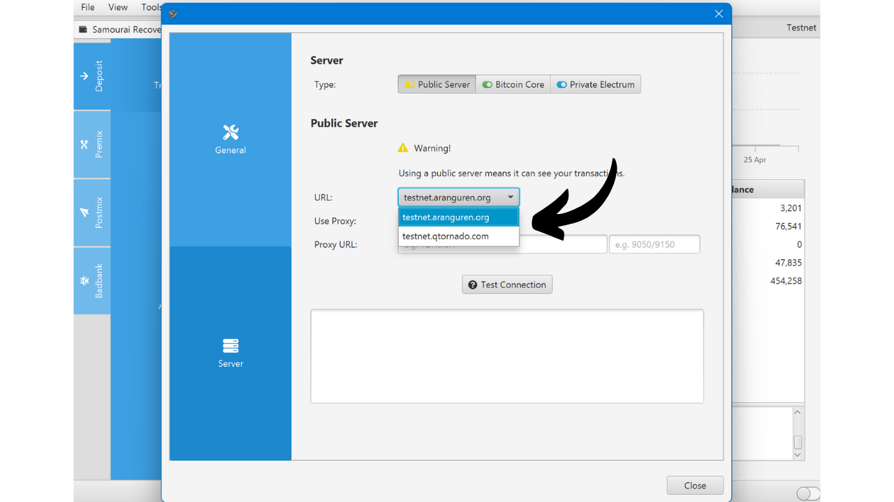

Pokud se vám podařilo úspěšně obnovit vaši peněženku, ale zdá se, že je neúplná, může to být problém související s derivací.

Problém může nastat, pokud jste použili váš Samourai vkladový účet s jiným typem skriptu než `P2WPKH`. Samourai výchozí používá tento typ skriptu, ale pokud jste jej ručně změnili, musíte toto nastavení upravit i při obnově v Sparrow.

Pro derivaci větví pro jiné typy skriptů je potřeba opakovat proces obnovy pro každý použitý typ skriptu. Pro toto přejděte na `Soubor > Nová peněženka` v Sparrow, vyberte jiný typ skriptu z rozevíracího seznamu, klikněte na `Nová nebo importovaná softwarová peněženka` a postupujte stejnými kroky jako v původním návodu.

Další problém s derivací, se kterým jsem se setkal, souvisí s hodnotou Gap Limit. Tato hodnota Sparrow říká, po kolika prázdných adresách má přestat odvozovat nové adresy. Pokud po obnově zjistíte, že některé transakce chybí, může to být způsobeno příliš nízkou hodnotou Gap Limit. Pro vyřešení tohoto problému přejděte na účet, který způsobuje problém, například na postmix účet (pokud jsou dotčeny více účty, opakujte tuto operaci pro každý).

Klikněte na záložku `Nastavení` a poté na tlačítko `Pokročilé...`.
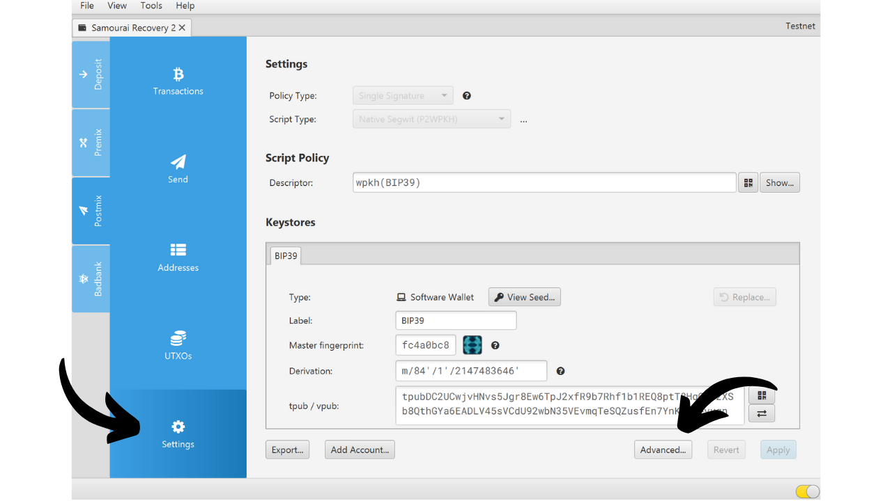
Postupně zvyšujte hodnotu Gap Limit, například zde jsem ji nastavil na `400`. Poté klikněte na tlačítko `Zavřít`.

Klikněte na `Použít` pro dokončení. Sparrow poté odvodí větší počet adres a vyhledá na nich prostředky, což by mělo pomoci obnovit všechny vaše transakce.

To pokrývá různé problémy s obnovou, se kterými jsem se za poslední dny setkal. Pokud po vyzkoušení všech těchto řešení stále máte problémy, zvu vás, abyste se připojili k [Discover Bitcoin Discord](https://discord.gg/xKKm29XGBb) a požádali o pomoc. Pravidelně navštěvuji tento Discord a byl bych rád, kdybych pomohl, pokud mám řešení. Další bitcoinoví uživatelé také budou moci sdílet své zkušenosti a nabídnout svou pomoc. **V každém případě je zásadní uchovat vaši obnovovací frázi, záložní soubor a heslo v tajnosti**. Nesdílejte je s nikým, protože by to mohlo umožnit krádež vašich bitcoinů.

Jakmile je obnova dokončena, nyní máte přístup k vašim bitcoinům. To je dobrá věc, ale nemusí to být dostatečné. Skutečně, zabavení serverů přináší nová potenciální rizika pro vaše soukromí. V následující části podrobně prozkoumáme tato rizika a nastíníme opatření, která je třeba přijmout k ochraně vašeho soukromí.

## Jaké jsou důsledky pro soukromí vašich transakcí?

### Jako uživatel Samourai bez Dojo

Pokud jste používali peněženku Samourai bez připojení vlastního Dojo, vaše xpuby musely být sděleny serverům Samourai, aby aplikace fungovala. S zabavením těchto serverů je možné, že úřady nyní mají přístup k těmto xpubům.
Tento scénář zůstává hypotetický. Nevíme, zda byly tyto xpub zaznamenány, zda bylo jakékoli potenciální úložiště zničeno, zda orgány tyto údaje získaly a zda je plánují použít pro analýzu řetězce. Avšak v takové situaci je rozumné zvážit nejhorší možný scénář, kdy mají orgány xpub uživatelů, kteří nepřipojili svůj vlastní Dojo. Pro referenci, xpub je řetězec znaků, který obsahuje všechny potřebné prvky pro generování dětských veřejných klíčů (veřejný klíč + řetězec kódů). Používá se v hierarchických deterministických peněženkách pro generování přijímacích adres a sledování transakcí účtu bez vystavení přidružených soukromých klíčů. To umožňuje například vytvoření "pouze pro sledování" peněženky. Avšak zveřejnění xpub může ohrozit soukromí uživatele, protože umožňuje třetím stranám sledovat transakce a vidět zůstatky přidružených účtů.
Každý, kdo zná vaše xpub, tak může vidět všechny přijímací adresy vaší peněženky, ty použité v minulosti i ty, které budou vytvořeny v budoucnu.

Pro uživatele bez Dojo má potenciální únik vašich xpub dvě hlavní důsledky:
- Coinjoins, které jste mohli provést, jsou z hlediska soukromí neúčinné pro každého, kdo zná vaše xpub, a tedy vaše mince ztrácejí veškerou anonymitu;
- Tato osoba může také sledovat všechny přijímací adresy vaší peněženky Samourai.

Je tedy důležité zvážit nejhorší možný scénář a rozloučit se s touto peněženkou, která je z hlediska soukromí potenciálně ohrožena. K tomu vytvořte zcela novou peněženku od začátku s jiným softwarem, jako je Sparrow Wallet. Po ověření platnosti vašich záloh převeďte všechny své prostředky provedením transakcí. Ačkoli tato operace neláme sledovatelnost vašich mincí, zabrání orgánům v jistotě znát adresy vaší nové peněženky.

Během této převodní operace doporučuji vyhnout se konsolidaci vašich mincí. Pokud předpokládáme, že vaše xpub jsou ohroženy, konsolidace nebude mít žádný dopad z pohledu osoby, která má přístup k těmto xpub, protože vaše soukromí je s nimi již ohroženo. Avšak doporučuji nekonsolidovat vaše mince příliš, hlavně kvůli ochraně vašeho soukromí před ostatními lidmi. V nejhorším případě mohou mít přístup k vašim xpub pouze orgány, ale zbytek světa o nich neví. Tedy z pohledu ostatních by konsolidace vašich mincí mohla vážně poškodit vaše soukromí kvůli heuristice společného vlastnictví vstupu (CIOH).

Nakonec, aby se definitivně přerušilo sledování, zvažte také provádění coinjoins z této nové peněženky.
**Varování:** Pouhé načtení vaší peněženky Samourai do Sparrow Wallet nestačí. Je nutné vytvořit zcela novou peněženku s novou obnovovací frází, pokud chcete vyhnout používání xpub, které mohly uniknout. Pokud importujete své stávající semínko do Sparrow, měníte pouze software pro správu peněženky, ale peněženka zůstává stejná.

### Jako uživatel Sparrow nebo Samourai s Dojo

Pokud je vaše peněženka spravována pouze na Sparrow Wallet, vaše xpub nemohly uniknout, ať už používáte veřejný uzel nebo svůj vlastní Bitcoin uzel. Podobně, pokud používáte aplikaci Samourai a od vytvoření vaší peněženky jste tuto aplikaci vždy připojovali k vašemu vlastnímu Dojo, vaše xpub jsou také v bezpečí.
Pokud jste však používali stejnou peněženku v období **bez vlastního Dojo** a poté s vlastním Dojo, je možné, že servery Samourai mohly mít přístup k vašim xpubs, a tedy by je mohly znát i úřady. Pokud se nacházíte v této konkrétní situaci, doporučuji vám, abyste postupovali podle doporučení předchozí sekce a považovali vaše xpubs za kompromitované.
Pro ty, kteří vždy používali Sparrow nebo Samourai se svým vlastním Dojo, hlavním rizikem je, že anonsety vašich mincí by mohly být potenciálně sníženy. Předpokládejme, v nejhorším případě, že všichni uživatelé bez Dojo mají své xpubs v rukou úřadů, pak by cesta jejich mincí skrze cykly coinjoin mohla být těmito úřady sledována.

Abychom to ilustrovali, vezměme si konkrétní příklad. Představte si, že jste se zúčastnili prvního cyklu coinjoin, následovaného dvěma dalšími downstream cykly coinjoin. Pokud xpubs uživatelů bez Dojo neunikly, pak by potenciální anonset vaší mince byl 13.

Pokud však zvážíme, že xpubs unikly a že jste během počátečního coinjoin narazili na uživatele bez dojo a poté na 2 během prvního downstream coinjoin, pak by váš potenciální anonset byl pouze 10 místo 13 z pohledu úřadů.

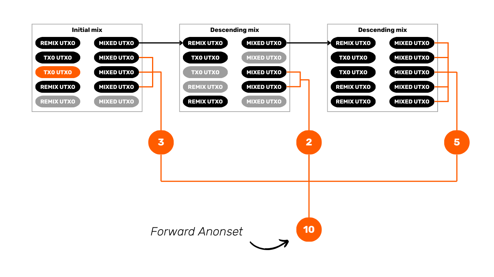
Tento potenciální pokles v anonsetu je složité kvantifikovat, protože závisí na mnoha faktorech a každá mince je ovlivněna odlišně. Například, uživatel bez Dojo potkaný v raných cyklech ovlivňuje potenciální anonset mnohem více než ten, který je potkán v pozdějších cyklech. Abych vám dal představu o situaci, která zůstává hypotetická, nejnovější statistiky poskytnuté Samouraiem ukázaly, že mezi 85% a 90% mincí zapojených do coinjoins pocházelo od uživatelů s Dojo, Sparrow nebo Bitcoin Keeper, tedy od uživatelů, kteří by, i v nejhorším případě, neviděli své xpubs uniknout.
Ačkoliv jsou tyto údaje obtížně ověřitelné, zdají se mi být konzistentní z dvou důvodů:
- Sparrow Wallet je široce používán;
- Většina softwaru node-in-box nabízí implementace Dojo a tyto hlavní softwary jako Umbrel jsou v současnosti velmi populární.

Takže je třeba zvážit několik aspektů. Pokud je pro vás soukromí vašich mincí vůči úřadům extrémně důležité, bylo by rozumné připravit se na nejhorší scénář a je obtížné zaručit 100%, že vaše cykly Whirlpool coinjoin by nemohly být vystopovány kvůli potenciálnímu úniku xpubs od uživatelů bez Dojo. Ačkoli je tato předpoklad vysoce nepravděpodobný, není nemožný.

Na druhou stranu, pokud pro vás soukromí vašich mincí vůči úřadu potenciálně v držení těchto xpubs není zásadní, pak lze situaci posuzovat jinak.

Specifikuji "vůči úřadu", protože je důležité si pamatovat, že pouze úřad, který zabavil servery, je potenciálně vědom těchto xpubs. Pokud byl váš cíl při používání coinjoin zabránit vašemu pekaři v možnosti sledovat vaše finanční prostředky, pak není lépe informován než před zabavením serveru.
Nakonec je nezbytné zvážit počáteční anonset vaší mince před zajištěním serveru. Vezměme si příklad mince, která dosáhla potenciálního anonsetu 40 000; pravděpodobný pokles tohoto anonsetu je pravděpodobně zanedbatelný. Skutečně, s již velmi vysokým základním anonsetem, je nepravděpodobné, že by přítomnost několika uživatelů bez Dojo mohla radikálně změnit situaci. Pokud však vaše mince měla anonset 40, pak by tento potenciální únik mohl vážně ovlivnit vaše anonsety a potenciálně umožnit sledování. S nástrojem WST nyní mimo provoz po zastavení OXT.me, můžete tyto anonsety pouze odhadovat. Co se týče retrospektivního anonsetu, není se příliš čeho obávat, protože model Whirlpool zajišťuje, že je velmi vysoký již od prvního coinjoinu, díky odkazu vašich vrstevníků. Jediný případ, kdy by to mohlo představovat problém, je, pokud vaše mince nebyla remixována několik let a byla smíchána na začátku spuštění poolu. Pokud jde o perspektivní anonset, můžete zkoumat dobu, po kterou byla vaše mince k dispozici pro coinjoins. Pokud to bylo několik měsíců, pak pravděpodobně má extrémně vysoký perspektivní anonset. Naopak, pokud byla přidána do poolu jen několik hodin před zajištěním serverů, pak je její perspektivní anonset pravděpodobně velmi nízký.
[**-> Dozvědět se více o anonsetech a jejich metodě výpočtu.**](https://planb.network/tutorials/privacy/wst-anonsets)

Dalším aspektem, který je třeba zvážit, je dopad konsolidací na anonsety mincí, které byly smíchány. Vzhledem k tomu, že účty Whirlpool již nejsou přístupné prostřednictvím aplikace Samourai, je pravděpodobné, že mnoho uživatelů převedlo svou peněženku do jiného softwaru a pokusilo se vybrat své prostředky z Whirlpoolu. Zejména minulý víkend, kdy byly transakční poplatky v síti Bitcoin relativně vysoké, existoval silný technický a ekonomický podnět k konsolidaci mincí po smíchání. To znamená, že je pravděpodobné, že mnoho uživatelů provedlo významné konsolidace.

Problém s těmito konsolidacemi po smíchání je, že vždy snižují anonsety, nejen pro uživatele, který je provádí, ale také pro uživatele, se kterými se setkali během svých cyklů coinjoinu. Ačkoli jsem tento jev nemohl přesně ověřit ani kvantifikovat, ekonomické pobídky související s transakčními poplatky v té době nás mohou vést k předpokladu, že anonsety jsou potenciálně nižší.

### Jako uživatel Sentinel

Provoz sítě aplikace pro sledování pouze peněženky Sentinel je podobný jako u Samourai. Pro přístup k informacím o vaší peněžence musí aplikace přenést xpubs, veřejné klíče a adresy, které jste poskytli, do Dojo. Pokud jste vždy používali své vlastní Dojo na Sentinelu, není problém a můžete aplikaci používat bez obav. Pokud jste však byli závislí na serverech Samourai pro váš Sentinel, je možné, že vaše xpubs byly vystaveny. V tomto případě je doporučeno postupovat podle stejného procesu změny peněženky, který je doporučen pro Samourai Wallet při připojení k serverům Samourai.

V nepravděpodobném případě, že jste používali své Dojo s Samourai, ale ne s Sentinelem, bylo by moudřejší považovat vaše xpubs za kompromitované.

## Závěr
Děkuji, že jste si přečetli tento článek až do konce. Pokud si myslíte, že chybí informace, nebo máte návrhy, neváhejte mě kontaktovat a sdílet své myšlenky. Kromě toho, pokud potřebujete další pomoc s obnovou vaší peněženky Samourai navzdory tomuto návodu, zvu vás, abyste se připojili na [Discover Bitcoin Discord](https://discord.gg/xKKm29XGBb) a požádali o pomoc. Pravidelně navštěvuji tento Discord a byl bych potěšen vám pomoci, pokud budu mít řešení. Další bitcoinoví uživatelé také budou moci sdílet své zkušenosti a nabídnout svou podporu. **V každém případě je zásadní uchovat vaši obnovovací frázi, záložní soubor a heslo v tajnosti**. Nesdílejte je s nikým, protože by to mohlo umožnit krádež vašich bitcoinů.