4 月 24 日，Samourai Wallet 的创始人被捕，其服务器也被查封。此后，该应用程序的部分功能已无法使用，没有Dojo 的用户也无法再进行交易广播。

最近几天，我帮助多位用户恢复了他们的比特币，因此我相信我已经遇到了 Samourai Wallet 恢复过程中可能遇到的大部分问题。本教程将首先进行情况报告，说明 Samourai Wallet 生态系统和受此事件影响的软件中哪些功能仍然可用，哪些功能已无法使用。接下来，我们将逐步讲解如何使用 Sparrow Wallet 软件恢复 Samourai Wallet。我们将分析此过程中可能遇到的所有障碍，并探讨相应的解决方案。最后，在最后一部分，您将了解服务器被查封后您的隐私可能面临的风险。

*非常感谢[@Louferlou](https://twitter.com/Louferlou)，他帮助了多位用户进行恢复并与我分享了他的经验，他还参与了测试以确定什么功能仍然可用。*

## Samourai Wallet 还能正常运作吗？

是的，**Samourai Wallet 应用仍然可以使用**，但需要满足一些条件。

首先，您必须之前已在智能手机上安装过该应用。Google Play 商店已下架该应用，APK 文件托管在被查封的网站上。因此，目前安装 Samourai 比较困难。您或许可以在网上找到 APK 文件，但我建议您不要下载，除非您能确定其来源。

由于 Samourai Wallet 页面已从 Google Play Store 下架，因此无法禁用自动更新。如果该应用重新上架下载平台，建议您**暂时禁用自动更新**，直到案件进展有更多消息公布。

如果您的智能手机上已安装 Samourai Wallet，您仍然可以访问该应用。为了使用 Samourai Wallet 的功能，必须连接 Dojo。此前，没有个人 Dojo 的用户依赖 Samourai 的服务器来访问比特币区块链信息并广播交易。由于这些服务器被查封，该应用将无法再访问这些数据。

如果您之前没有连接 Dojo，但现在已连接，您可以重新设置以使用 Samourai 应用。这包括检查您的备份、删除钱包（注意是钱包，不是应用），然后通过将 Dojo 连接到应用来恢复钱包。为了了解这些步骤的更多详细信息，您可以参考 COINJOIN - DOJO 教程中的 “准备您的 Samourai Wallet” 部分。

如果您的 Samourai 应用已连接到您自己的 Dojo，那么钱包功能对您来说一切正常。您仍然可以查看余额并广播交易。尽管目前情况不妙，但我认为 Samourai Wallet 仍然是目前最好的移动钱包软件。就我个人而言，我打算继续使用它。

您可能遇到的主要问题是无法通过应用访问 Whirlpool 账户。通常情况下，Samourai 会尝试与您的 Whirlpool CLI 建立连接并启动混币（coinjoin）循环，然后才会允许您访问这些账户。然而，由于此连接已无法建立，应用会无限期地持续搜索，但始终无法让您访问 Whirlpool 账户。在这种情况下，您可以将这些账户转移到其他钱包软件，同时保留 Samourai 上的存款账户。

### Samourai Wallet 上还有哪些工具可用？

另一方面，部分工具因服务器关闭而受到影响，或完全无法使用。

就个人消费工具而言，只要您拥有自己的 Dojo，一切功能正常。普通的 Stonewall 交易（而非 Stonewall x2）运行良好。

Twitter 上的评论指出，Stonewall 交易提供的隐私性可能有所降低。Stonewall 交易的优势在于其结构与 Stonewall x2 交易几乎完全相同。当分析师遇到这种特定模式时，他们无法判断这是单用户的标准 Stonewall 交易还是双用户 Stonewall x2 交易。然而，正如我们将在下文中看到的，由于 Soroban 已不可用，执行 Stonewall x2 交易变得更加复杂。因此，有人认为分析师现在可能会将任何具有这种结构的交易都视为普通的 Stonewall 交易。就我个人而言，我并不认同这种观点。尽管 Stonewall x2 交易的频率可能有所降低（而且我认为在此次事件之前就已经如此），但其仍然存在的事实可能会推翻之前基于其不存在的假设而进行的整个分析。
**[-> 了解更多关于 Stonewall 交易的信息。](https://planb.academy/tutorials/privacy/on-chain/ashigaru-stonewall-033daa45-d42c-40e1-9511-cea89751c3d4)**
关于 Ricochet，由于我没有在测试网上拥有 Dojo，因此无法验证该服务是否仍然可用。我也不愿冒着将 `100,000 聪` 花费在一个可能被当局控制的钱包的风险。如果您最近有机会测试过此工具，请与我联系，以便我们更新本文。

如果您需要使用 Ricochet，请注意，您始终可以使用任何钱包软件手动执行此操作。为了学习如何正确手动执行各种跳转操作，我建议您参考这篇文章：[**RICOCHET**](https://planb.academy/tutorials/privacy/on-chain/ashigaru-ricochet-e0bb1afe-becd-44a6-a940-88a463756589)

JoinBot 工具已停止运行，因为它完全依赖于 Samourai 管理的钱包。

至于其他类型的协作交易（通常称为 “cahoots”），它们仍然可行，但只能手动操作。在服务器关闭之前，您可以通过两种方式执行 Stonewall x2 或 Stowaway (PayJoin) 交易：

- 使用 Soroban 网络自动远程交换 PSBT；
- 或者通过扫描多个二维码手动进行这些交换。

经过多次测试，Soroban 似乎已停止运行。因此，为了这些合作式交易，数据交换必须手动完成。以下是进行此信息交换的两种方式：

- 如果您与合作者距离很近，您可以依次扫描二维码；

- 如果您与合作者距离较远，您可以通过外部通信渠道与应用程序交换 PSBT。但是，请务必小心，因为这些 PSBT 中包含的数据涉及隐私敏感信息。我建议使用加密消息服务来确保信息交换的保密性。

**[-> 了解更多关于 Stonewall x2 交易的信息。](https://planb.academy/tutorials/privacy/on-chain/ashigaru-stonewall-x2-05120280-f6f9-4e14-9fb8-c9e603f73e5b)**

**[-> 了解更多关于 Stowaway 交易的信息。](https://planb.academy/tutorials/privacy/on-chain/ashigaru-stowaway-48a5c711-ee3d-44db-b812-c55913080eab)**

至于 Whirlpool，该协议似乎已停止运行，即使是拥有自己 Dojo 的用户也无法使用。过去几天我一直在监控我的 RoninDojo，并尝试了一些基本操作，但自从服务器关闭以来，Whirlpool CLI 就一直无法连接。

然而，我仍然希望这项协议能够在未来几周内重新启动，或者根据形势发展情况进行不同的调整。这段暂停期或许可以成为一个契机，让我们探索新的方法或对该系统进行潜在的改进。

### 什么外部工具仍然可用？

关于与 Samourai 环境相关的其他工具，部分工具仍然可用，而另一些则已无法使用。

免费链分析网站 OXT.me 目前已无法访问。

Whirlpool Stats Tool 已无法下载，因为它托管在 Samourai 的 GitLab 上。即使您之前已将此 Python 工具下载到本地计算机或安装在 RoninDojo 节点上，WST 目前也无法使用。实际上，它的运行依赖于 OXT.me 提供的数据，而该网站已无法访问。目前，由于 Whirlpool 协议已停止运行，WST 的作用不大。

KYCP.org 网站目前也无法访问。

托管 Boltzmann Calculator Python 工具代码的 GitLab 也已被查封。因此，目前无法下载此工具。但如果您拥有 RoninDojo，您可以像以前一样继续使用 Boltzmann Calculator。

至于 RoninDojo，尽管某些特定工具（例如 Whirlpool CLI 和 WST）不可用，但这款内置节点软件仍能正常运行。借助 Fulcrum 或 Electrs，它仍然可以用于其他钱包软件。如果您想了解更多关于 RoninDojo 的信息或有任何疑问，我建议您加入他们的 [Telegram 群组](https://t.me/RoninDojoNode)。

然而，由于 RoninDojo 的源代码托管在 Samourai 的 GitLab 上，目前已无法访问。因此，目前无法将其手动安装到 Raspberry Pi 上。

关于仅供查看的钱包软件 Sentinel，情况与 Samourai 应用类似。如果您拥有自己的 Dojo，则可以继续毫无问题地使用 Sentinel。但是，如果您没有 Dojo，您将无法再建立连接。与 Samourai 不同，Sentinel 网站仍然可以访问。但请谨慎使用该网站及其提供的 APK，因为目前尚不清楚谁控制着这些资源。

### Sparrow Wallet 是否受到影响？

Sparrow Wallet 继续正常运行，但部分 Samourai 工具已无法使用。目前，无法通过 Sparrow 进行混币操作。同样，合作式消费工具也无法使用，因为 Sparrow 不像 Samourai 那样提供手动兑换 PSBT 的选项。Sparrow 的其他所有功能均可正常运行。如有必要，您也可以使用此软件恢复 Samourai 钱包。

## 如何恢复 Samourai Wallet？

正如我们在前面的章节中看到的，如果您拥有自己的 Dojo，则不一定需要切换软件。**Samourai 仍然是您日常消费的绝佳热钱包选择**。但是，如果您没有 Dojo 或更倾向于使用其他软件，我将详细解释完整的恢复流程，并说明您可能遇到的任何潜在障碍。

无论如何，请务必耐心操作，确保万无一失。请记住，无需着急，因为您掌握着自己的私钥，Samourai 服务器被查封不会对此造成任何影响。无论发生什么，他们显然都无法访问您的私钥。

### 验证 Passphrase（密语）

即使您选择通过备份文件恢复钱包，也必须拥有密语才能恢复钱包。首先，请验证此密语的有效性。打开您的 Samourai Wallet 应用程序，点击左上角的 Paynym 图标，然后选择 `Settings`。

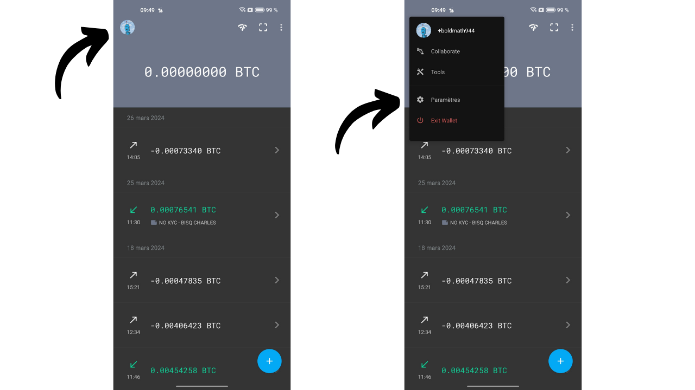

接下来，点击 `Troubleshooting`，然后点击 `Passphrase/backup test`。

输入您的密语并点击 `Ok`。如果正确，Samourai 将确认它。如果您计划稍后使用它，您也有选项来验证备份文件。

此步骤为可选步骤，但强烈建议执行。它可以确认密语是否正确，从而避免日后出现问题。如果 Samourai 在此阶段提示密语错误，则无法进行恢复。请确保您已正确输入密语并再次检查。

### 选项 1：使用备份文件在麻雀钱包上恢复钱包

自 Sparrow Wallet 1.8.6 版本起，您可以使用名为 `samourai.txt` 的备份文本文件直接导入您的 Samourai 钱包。该文件由您的应用程序自动生成，包含恢复钱包所需的所有信息，并使用您的密语进行加密以确保安全。

如果您选择此选项，则需要最新的 `samourai.txt` 文件和您的密语。要在 Samourai Wallet 中生成此文件，请点击右上角的三个小点，然后选择 `Export wallet backup`。

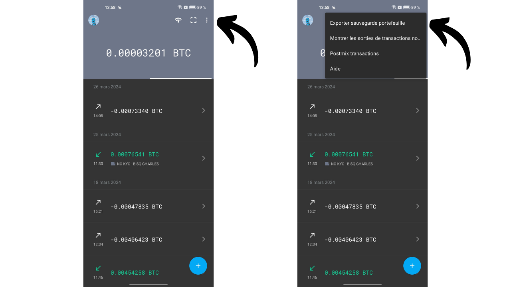
接下来，选择 `Export to Clipboard`。之后，您需要将此文件安全地传输到您的电脑。由于该文件已加密，但仅凭密语即可解密，因此在传输过程中务必采取预防措施。如果您选择以纯文本形式直接转账，您需要在电脑上创建一个名为 `samourai.txt` 的文件，并将剪贴板的内容粘贴到该文件中。另一种方法是直接从手机的文件存储中找到 `samourai.txt` 文件。

在电脑上找到该文件后，打开 Sparrow Wallet，点击 `File` 选项卡，然后选择 `Import Wallet` 开始导入您的钱包。

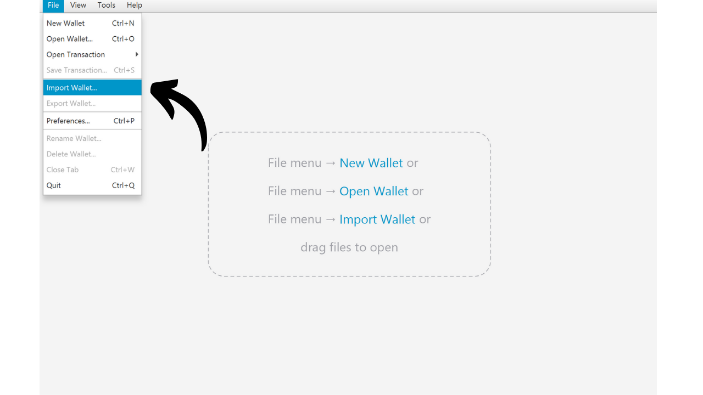
向下滚动到 `Samourai Backup`，点击 `Import File`，然后选择您的 `samourai.txt` 文件。

Sparrow 会要求您输入密码来解密该文件。此密码实际上是您的密语。在相应的字段中输入通行短语，然后点击 `Import`。

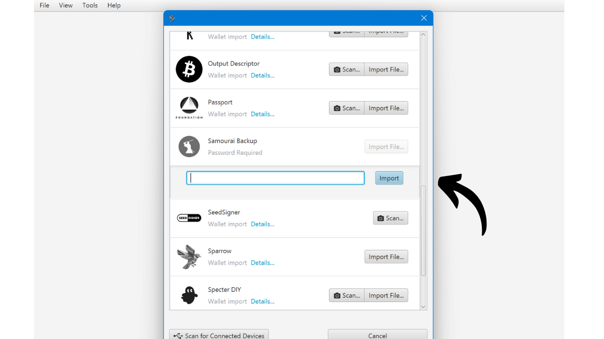

如果在这个阶段，您的钱包没有出现，可能是您在复制 `samourai.txt` 文件或输入助记词时出了错。您可以查阅故障排除部分以获取更多帮助。

对于脚本类型，如果您在Samourai中没有配置其他脚本，您通常应该只使用SegWit V0（原生SegWit / P2WPKH）。保持这个默认脚本并点击 `Import`。

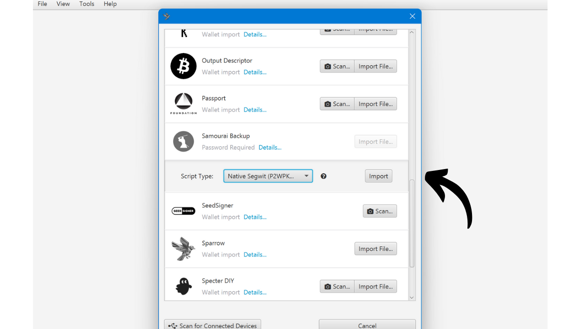

为您的钱包命名，例如，“Samourai Recovery”，然后点击 `Create Wallet`。

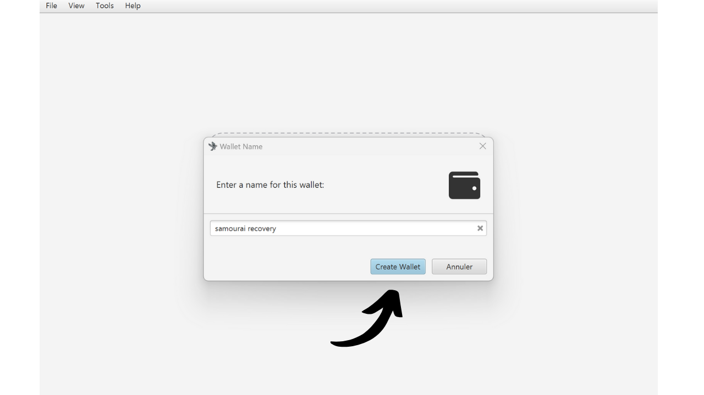

Sparrow 接下来会要求您选择一个密码。这个密码仅保护您在这台计算机上访问您的钱包，并不涉及到您钱包密钥的派生。确保选择一个强密码，记下来以便记住，然后点击 `Set Password`。

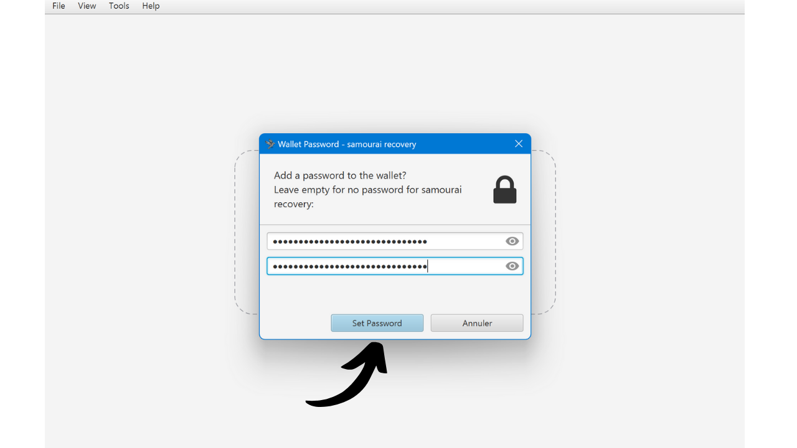

Sparrow 接下来会派生您钱包的密钥并搜索相应的交易。

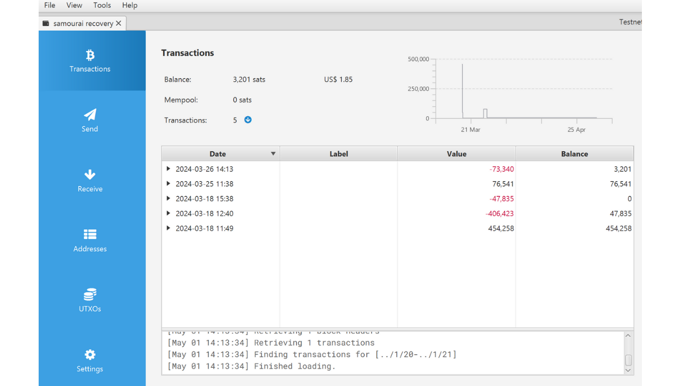

目前，您只能访问您的存款账户。如果您仅使用 Samourai 管理此账户，则应该可以看到所有资金。但是，如果您还使用了 Whirlpool，则需要派生 `premix`、`postmix` 和 `badbank` 账户。在 Sparrow 上，只需点击 `Settings` 标签，然后点击 `Add Accounts...`。

在打开的窗口中，从下拉选单中选择 `Whirlpool Accounts`，然后单击 `OK`。

接下来您将看到您的各种 Whirlpool 账户出现，Sparrow 将派生必要的密钥来使用关联的比特币。

如果您使用的是 Sparrow 以外的软件，如 Electrum，来恢复您的 Samourai Wallet，这里是手动恢复的 Whirlpool 账户索引：
- 存款的账户：`m/84'/0'/0'`
- 坏账的账户：`m/84'/0'/2147483644'`
- 混币前账户：`m/84'/0'/2147483645'`
- 混币后账户：`m/84'/0'/2147483646'`

您现在可以在 Sparrow 上访问您的比特币了。如果您需要帮助使用 Sparrow Wallet，您也可以查看[我们的专门教程](https://planb.academy/tutorials/wallet/desktop/sparrow-c674e2ac-d46f-4c82-92a7-7d1b0e262f5d)。

我还建议手动导入您在 Samourai 上与您的 UTXO 关联的标签。这将允许您随后在 Sparrow 上进行有效的币控制。

### 选项 2：使用助记词在 Sparrow 上恢复钱包

如果您不想使用备份文件进行恢复，可以选择更传统的方法，即使用您的 12 个单词的助记词和密语。第二种方法通常更为简单。
首先，请确保您手边有助记词和密语。然后，打开 Sparrow Wallet 软件，点击 “Files” 选项卡，选择 “Import Wallet” 开始导入您的钱包。
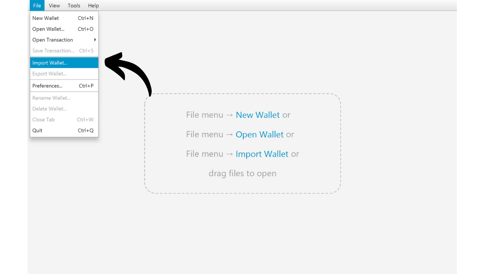

选择 `Mnemonic Words (BIP39)`，在下拉选单中点击 `Use 12 Words`。

按正确顺序输入您的 12 个助记词。

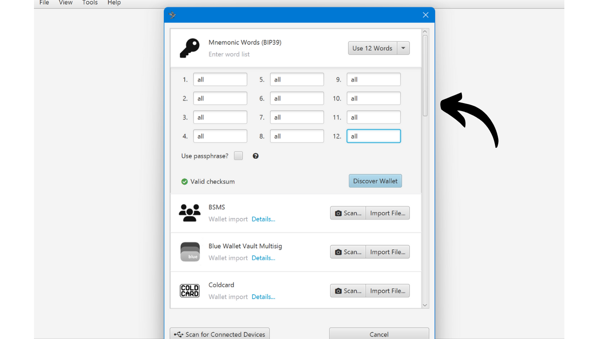

如果 Sparrow 显示`Invalid Checksum`消息，这表明恢复助记词的校验和无效，可能在输入单词时出错。

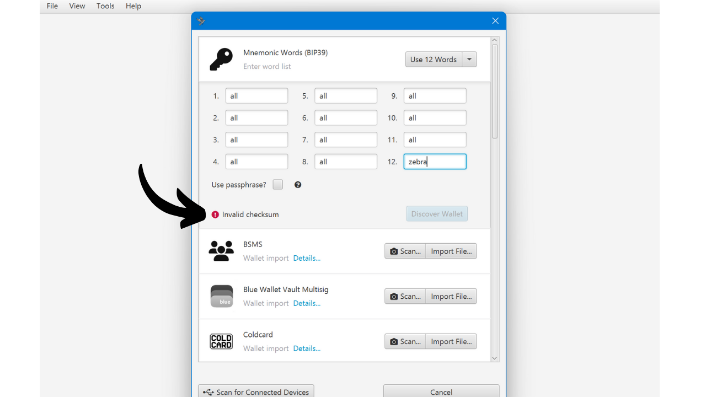

如果您的短语正确，勾选 `Use Passphrase?` 框，并在专用字段中输入您的密语。最后，如果一切看起来都正确，点击 `Discover Wallet` 按钮。

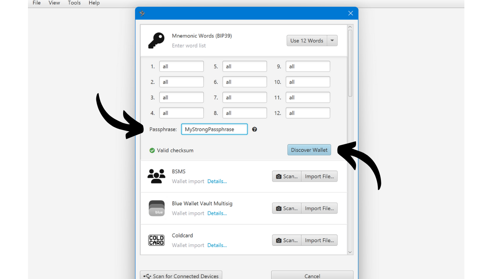

为您的钱包命名，例如，“Samourai Recovery”，然后点击 `Create Wallet`。

然后 Sparrow 会要求您选择一个密码。该密码仅保护对您在这台电脑上的钱包的访问，与您钱包密钥的派生无关。确保选择一个强密码，将其写下来以便记住，然后单击 `Set Password`。

然后 Sparrow 将导出您钱包的密钥并搜索相应的交易。

如果在此阶段您的钱包没有出现，则可能是您在输入密码或恢复短语时犯了错误。您可以查阅专门的故障排除部分以获得更多帮助。

目前，只能访问您的存款账户。如果您仅将 Samourai 用于此账户，您应该会看到您的所有资金。但是，如果您还使用 Whirlpool，则需要派生` premix`、`postmix`、 和 `badbank` 账户。在 Sparrow 上，只需单击 `Settings` 选项卡，然后单击 `Add Accounts...`。

在打开的窗口中，从下拉列表中选择 `Whirlpool Accounts`，然后点击`OK`。

然后您将看到您的各种 Whirlpool 账户出现，Sparrow 将派生必要的密钥以使用关联的比特币。

如果您正在使用另一个软件如 Electrum 来恢复您的 Samourai Wallet，这里是手动恢复的 Whirlpool账户索引：
- 存款的账户：`m/84'/0'/0'`
- 坏账的账户：`m/84'/0'/2147483644'`
- 混币前账户：`m/84'/0'/2147483645'`
- 混币后账户：`m/84'/0'/2147483646'`

您现在可以在 Sparrow 上访问您的比特币了。如果您需要帮助使用 Sparrow Wallet，您也可以查阅[我们的专用教程](https://planb.academy/tutorials/wallet/desktop/sparrow-c674e2ac-d46f-4c82-92a7-7d1b0e262f5d)。

我还建议手动导入您在 Samourai 上与您的 UTXO 关联的标签。这将允许您随后在 Sparrow 上进行有效的币控制。

### 常见问题有哪些？

在过去几天协助了几个人之后，我相信我已经遇到了大部分可以阻止您的钱包恢复的问题。如果尽管阅读了之前的教程，您仍然无法访问您的钱包，这里有一些额外的建议。
首先，为了使恢复发挥作用，助记词的正确性至关重要。如果您无法找到 12 个单词的助记词，您可以使用_选项 1_ 从 Samourai 的备份文件中恢复。您还可以直接在 Samourai Wallet 中访问您的助记词，方法是依次前往到 `Settings` > `Wallet` > `Show 12-word recovery phrase`。

接下来，在恢复过程中密语输入错误将导致派生密钥不正确，这将阻止在 Sparrow 上恢复您的钱包。 **密语必须完全准确！**

为了解决此问题，我首先建议您检查 Samourai 应用程序中密码的有效性，如本文 “_Verify the passphrase_” 部分所述：

1. **在 Samourai Wallet 中验证：** 如果 Samourai 确认密语已正确，则从头开始再次尝试恢复，确保在 Sparrow 中准确输入密语，没有错误；
2. **密语错误：** 如果 Samourai Wallet 指示密语不正确，则继续尝试 Sparrow 是没有意义的。只要找不到正确的密语，就不可能恢复您的钱包。如果您永久丢失了密码，请确保 Samourai 应用程序的安全。您所能做的就是希望服务器重新启动，这样您就可以直接从应用程序中进行支出，而不需要恢复。**在这种情况下，请勿尝试连接 Dojo**，因为这意味着在 Samourai 上重置您的钱包，这需要访问密码。

在遇到的其他错误中，许多都与 Sparrow 上的网络配置有关。

首先，确保 Sparrow 在“mainnet”模式下正确配置，而不是在“testnet”模式下。事实上，如果 Sparrow 在测试网上搜索您的交易，它什么也找不到，因为您的钱包在主网上。测试网是比特币的替代版本，仅用于测试和开发，并在与主网络（主网）分开的网络上运行，具有自己的区块和交易。要检查您所在的网络，请单击“工具”选项卡，然后单击“重新启动”。如果显示“Mainnet”选项，则说明您不在主网络上。选择它以在主网上重新启动 Sparrow，然后再次开始恢复过程。

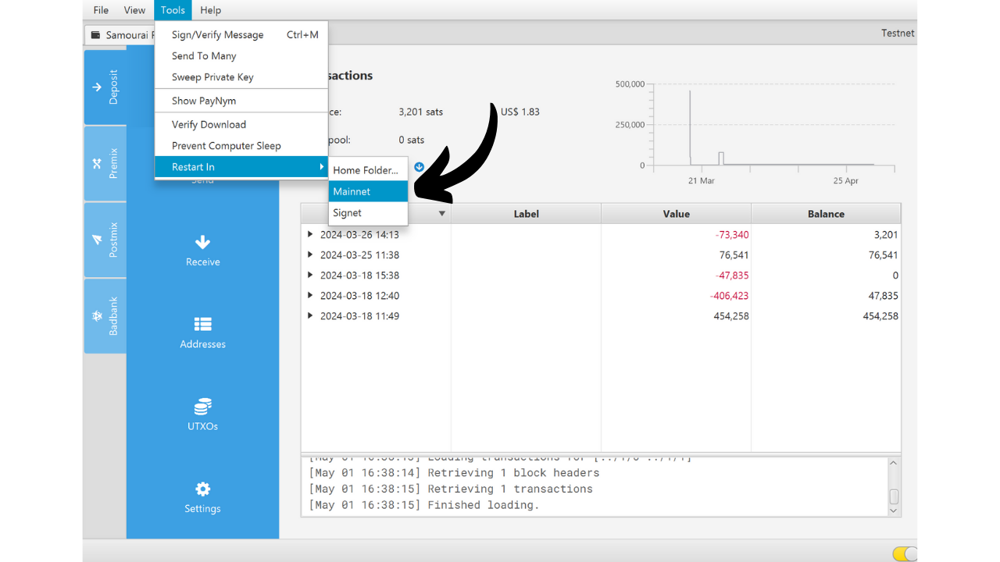
一些用户也遇到了 Sparrow 连接到节点的问题。在 Sparrow 的右下角，有一个彩色开关，用于指示您的软件是否已正确连接到比特币节点。要检索您的 Samourai 交易记录，软件必须连接良好。请检查该开关是否已激活，如下图所示（黄色代表公共节点，绿色代表 Bitcoin Core，蓝色代表 Electrum 服务器）。

如果开关没有激活，点击它以重新激活连接。

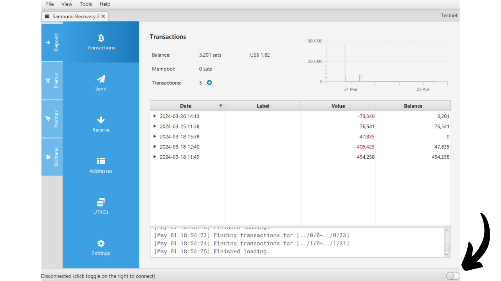

如果问题仍然存在，以下是一些可能的解决方案：

- 如果您尝试连接到您自己的 Electrum 服务器（蓝色）或 Bitcoin Core（绿色），但 Sparrow 无法连接，请检查 `File > Preferences... > Server` 下的连接信息；

- 如果连接问题仍然存在，可能是由于您的节点未完全同步造成的。确保您的节点和索引器已 100% 同步。如果必要，作为最后手段，将您的节点与 Sparrow 断开连接，并连接到一个公共节点；- 如果您已经连接到一个公共节点，但连接失败，请尝试通过从下拉列表中选择另一个节点来更换节点。

如果您已成功恢复钱包，但钱包似乎不完整，则可能存在与派生相关的问题。

如果您使用 Samourai 存款账户时使用了除 `P2WPKH` 以外的其他脚本类型，则可能会出现问题。Samourai 默认使用此脚本类型，但如果您手动更改了脚本类型，则在 Sparrow 上恢复时也必须进行相应的调整。

为了为其他脚本类型派生分支，您需要为每种使用的脚本类型重复恢复过程。为此，请在 Sparrow 中依次点击 `File > New Wallet`，从下拉列表中选择其他脚本类型，点击 `New or Imported Software Wallet`，然后按照初始教程中的步骤操作。

我遇到的另一个派生问题与间隙限制（Gap Limit）值有关。这个值使 Sparrow 在多少个空地址后应该停止派生新地址。如果恢复后您注意到一些交易丢失，这可能是由于 Gap Limit 太低。为了解决这个问题，请转到导致问题的账户，例如，postmix 账户（如果有几个账户受到影响，重复此操作）。

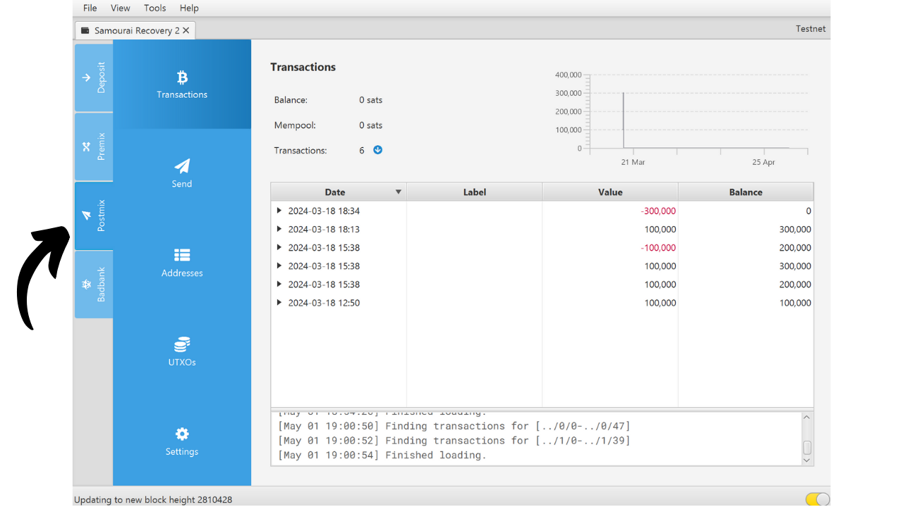

点击 `Settings` 标签，然后点击 `Advanced...` 按钮。

逐渐增加 Gap Limit 的值，例如，我在这里将它设置为`400`，然后点击 `Close` 按钮。

点击 `Apply` 以完成。Sparrow 随后会派生更多地址并在它们上搜索资金，这应该有助于恢复您的所有交易。

以上涵盖了我过去几天遇到的各种恢复问题。如果您尝试了所有这些解决方案后仍然遇到问题，我邀请您加入 [Discover Bitcoin Discord](https://discord.gg/xKKm29XGBb) 寻求帮助。我会定期访问这个 Discord 服务器，如果我有解决方案，我很乐意提供帮助。其他比特币爱好者也可以分享他们的经验并提供帮助。无论如何，务必对您的恢复助记词、备份文件和密语保密。切勿与任何人分享这些信息，否则您的比特币可能被盗。

恢复完成后，您现在可以访问您的比特币。这固然是好事，但可能还不够。事实上，服务器被查封会给您的隐私带来新的潜在风险。在接下来的章节中，我们将详细探讨这些风险，并概述保护隐私的预防措施。
## 您的交易隐私的后果是什么？

### 没有 Dojo 的 Samourai 用户

如果您在使用 Samourai Wallet 时未连接自己的 Dojo，则您的 xpub 必须传输到 Samourai 的服务器才能使应用程序正常运行。由于这些服务器已被查封，当局现在有可能访问这些 xpub。

这种情况目前仍属假设。我们尚不清楚这些 xpub 是否已被记录，是否有任何潜在的存储被销毁，当局是否已恢复这些 xpub，以及他们是否计划将其用于链分析。然而，在这种情况下，谨慎考虑最坏的情况是，当局可能已掌握未连接 Dojo 的用户的 xpub。

作为参考，xpub 是一串字符，其中包含生成子公钥（公钥 + 链码）所需的所有元素。它用于分层确定性钱包中，以生成接收地址并观察账户的交易，而无需暴露关联的私钥。例如，这使得创建 “仅观察” 钱包成为可能。然而，泄露 xpubs 信息会损害用户的隐私，因为这会让第三方能够追踪交易并查看关联账户的余额。

任何知道您 xpubs 信息的人都可以看到您钱包的所有收款地址，包括过去使用过的和将来生成的。

对于没有 Dojo 的用户来说，xpubs 信息泄露会带来两个主要后果：

- 对于知道您 xpub 信息的人来说，您进行的混币操作在隐私方面将失效，因此您的代币将失去所有隐私保护；
- 此人还可以追踪您 Samourai Wallet 的所有接收地址。

因此，务必考虑最坏的情况，并放弃这个可能存在隐私泄露风险的钱包。为此，请使用其他软件（例如 Sparrow Wallet）从头创建一个新钱包。在验证备份的有效性后，通过交易转移所有资金。虽然此操作不会破坏您加密货币的可追溯性，但它会阻止当局确切地知道您新钱包的地址。

在本次转账操作期间，我建议您避免合并您的加密货币。假设您的 xpub 已被泄露，那么对于能够访问这些 xpub 的人来说，合并操作不会产生任何影响，因为您的隐私已经泄露。但是，我建议您不要过度整合加密货币，主要是为了保护您的隐私。在最坏的情况下，可能只有当局能够访问您的 xpub，而其他人对此一无所知。因此，从他人的角度来看，由于通用输入所有权启发式 (CIOH) 的存在，整合您的加密货币可能会严重损害您的隐私。

**注意：** 为了彻底破坏追踪，您还可以考虑从这个新钱包进行混币操作。

**警告：** 仅仅在 Sparrow Wallet 上找回您的 Samourai Wallet 是不够的。如果您想避免使用可能已泄露的 xpub，则必须创建一个全新的钱包并设置新的助记词。如果您将现有助记词导入 Sparrow，则只会更换钱包管理软件，钱包本身并不会泄露。

### Sparrow 或 Samourai 用户（使用 Dojo）

如果您的钱包仅由 Sparrow Wallet 管理，无论您使用的是公共节点还是自建比特币节点，您的 xpubs 都不会泄露。同样，如果您使用 Samourai 应用，并且自创建钱包以来一直将该应用连接到您自己的 Dojo，则您的 xpubs 也是安全的。

但是，如果您在一段时间内**未使用您自己的 Dojo** 使用同一个钱包，之后又使用了您自己的 Dojo，则 Samourai 服务器可能已经访问了您的 xpub，因此监管机构可能会知晓这些信息。如果您遇到这种情况，我建议您遵循上一节中的建议，并将您的 xpub 视为已泄露。

对于那些一直使用 Sparrow 或 Samourai 并拥有自己 Dojo 的用户来说，主要风险在于他们的代币收益可能会减少。假设在最坏的情况下，所有没有 Dojo 的用户的 xpub 都被当局掌握，那么这些当局就可以追踪他们的代币在混币循环中的流转路径。

为了说明这一点，我们来看一个具体的例子。假设您参与了第一个混币循环，随后又参与了两个下游的混币循环。如果未加入 Dojo 的用户的 xpub 没有泄露，那么您的代币向前匿名集 anonset 将为 13。

然而，如果我们考虑到 xpub 已经泄露，并且您在初始混币中遇到了一个没有 dojo 的用户，然后在第一个下游 coinjoin 中遇到了 2 个，那么从当局的角度看，您的向前匿名集将只有10 而不是 13。

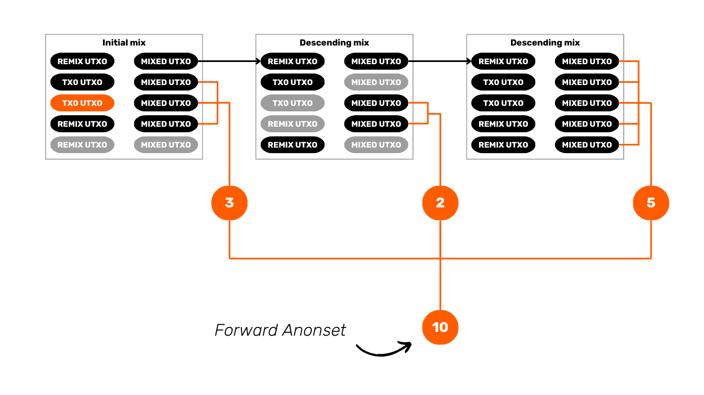
这种潜在的交易量下降难以量化，因为它取决于诸多因素，而且每种币种受到的影响也各不相同。例如，在早期周期遇到的未使用 Dojo 的用户，其对预期交易量的影响远大于在后期周期遇到的用户。为了让您更好地理解这种情况（目前仍属假设），Samourai 提供的最新统计数据显示，参与混币的币种中，85% 到 90% 来自使用 Dojo、Sparrow 或 Bitcoin Keeper 的用户，也就是说，即使在最坏的情况下，这些用户的 xpub 也不会泄露。

尽管这些数据难以验证，但我认为它们具有一致性，原因有二：

- Sparrow Wallet 使用广泛；
- 大多数开箱即用的节点软件都提供 Dojo 实现，而像 Umbrel 这样的主流软件如今非常流行。

因此，我们需要考虑多个方面。如果您极其重视您的比特币隐私，那么做好最坏的打算是明智之举。由于未使用 Dojo 的用户可能泄露 xpub，因此很难 100% 保证您的 Whirlpool 比特币绑定周期不会被追踪。虽然这种可能性极低，但并非完全不可能。

另一方面，如果您并不在意您的代币隐私，因为可能掌握这些 xpub 的机构可能并不了解这些信息，那么情况就有所不同。

我特意强调 “机构”，是因为只有查封服务器的机构才有可能知晓这些 xpub。如果您使用代币绑定的目的是为了防止您的烘焙师追踪您的资金，那么在服务器被查封后，他仍然掌握着与之前相同的信息。

最后，务必考虑服务器被查封之前您的代币的初始发行情况。我们以一个向前匿名集数量达到 40,000 为例；该代币的潜在减少可能微乎其微。事实上，由于其基础初始代币数量已经非常高，少数没有 Dojo 的用户不太可能从根本上改变现状。然而，如果您的代币初始代币数量只有 40，那么这种潜在的泄露可能会严重影响您的初始代币数量，并可能导致您的比特币被追踪。

由于 OXT.me 关闭，WST 工具也已停止服务，因此您只能估算这些代币的预期收益 (anonset)。对于回顾性预期收益，无需过于担心，因为 Whirlpool 模型会确保其在首次 coinjoin 时就非常高，这得益于其他参与者的贡献。唯一可能出现问题的情况是，如果您的代币几年内没有进行过混币，并且是在矿池启动初期加入的。关于向前匿名集，您可以查看您的代币可用于 coinjoin 的时长。如果已持续数月，则其预期预期收益可能非常高。相反，如果它是在服务器被查封前几个小时才加入矿池的，那么其向前匿名集可能非常低。

**-> 了解更多关于匿名集及其计算方法的信息。**

另一个需要考虑的方面是合并操作对已混合匿名集的影响。鉴于 Whirlpool 账户已无法通过 Samourai 应用访问，许多用户可能已将钱包转移到其他软件，并尝试从 Whirlpool 提取资金。尤其是在上周末，比特币网络的交易费用相对较高，因此合并混币后的比特币具有很强的技术和经济动力。这意味着许多用户可能进行了大量的整合操作。

这些混币后整合的操作的问题在于，它们总是会降低代币收益，不仅对执行合并操作的用户而言如此，对他们在代币合并过程中遇到的其他用户也是如此。虽然我无法精确地验证或量化这种现象，但当时的交易费用所带来的经济激励可能使我们推断代币收益实际上更低。

### Sentinel 用户

Sentinel 是一款仅供查看的钱包应用，其网络运行方式与 Samourai 类似。为了访问您的钱包信息，该应用必须将您提供给 Dojo 的 xpub、公钥和地址传输出去。如果您一直使用自己的 Dojo 连接 Sentinel，则不会有问题，您可以继续安心使用该应用。但是，如果您之前依赖 Samourai 的服务器来运行 Sentinel，则您的 xpub 可能已经泄露。在这种情况下，建议您按照连接到 Samourai 服务器时 Samourai Wallet 推荐的钱包变更流程进行操作。

如果您之前只在 Samourai 上使用过 Dojo，而没有在 Sentinel 上使用过，则最好考虑您的 xpub 可能已经泄露。

## 结论
感谢您阅读本文至此。如果您认为信息有遗漏或有任何建议，请随时与我联系，分享您的想法。此外，如果您在阅读本教程后仍无法恢复您的 Samourai 钱包，欢迎加入 [Discover Bitcoin Discord](https://discord.gg/xKKm29XGBb) 寻求帮助。我会定期访问该 Discord 服务器，如果我有解决方案，非常乐意为您提供帮助。其他比特币用户也可以分享他们的经验并提供支持。**无论如何，请务必对您的助记词、备份文件和密语保密。**切勿与任何人分享这些信息，否则您的比特币可能会被盗。
