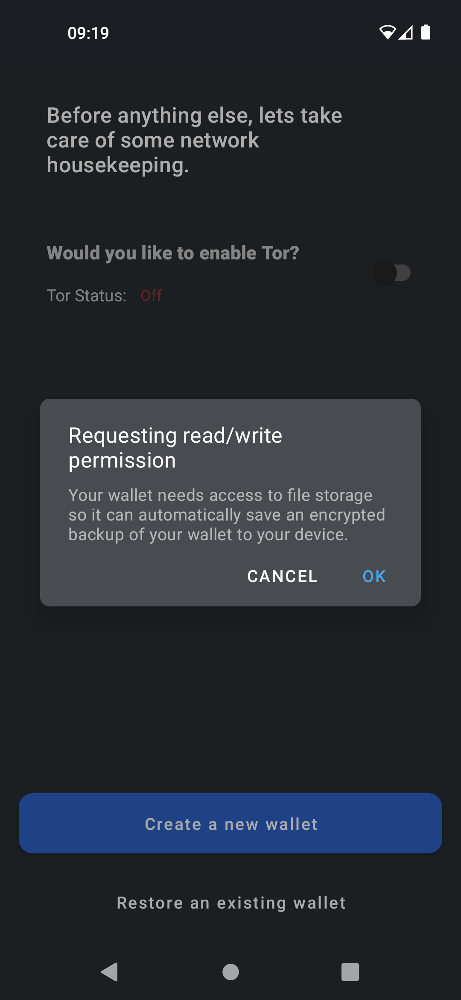
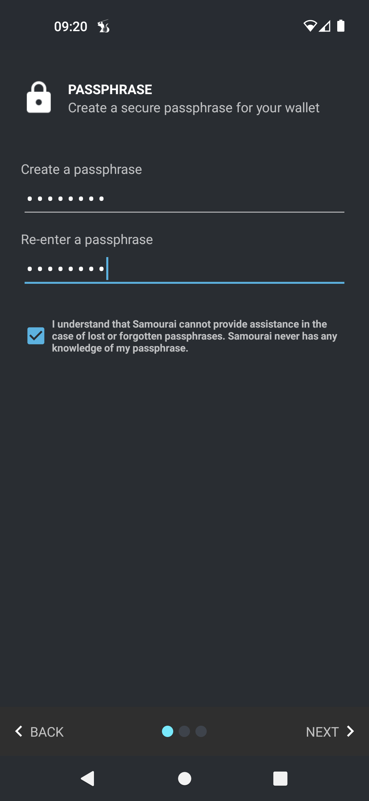

# Samourai Wallet - Diseñada para la privacidad

**Samourai Wallet** es una billetera dedicada a la privacidad. A pesar de su interfaz fácil de usar, ofrece una gran flexibilidad en su uso y seguridad.

Siendo **100% no custodial**, deberás **respaldar** tus 12 palabras y definitivamente incluir una **frase de contraseña** que no debes perder.

Una vez dentro de la billetera, el envío y la recepción se realizan de la manera tradicional, pero con una gran cantidad de herramientas de privacidad como **Ricochet**, **Stonewall**, **Whirlpool**, **JoinMarket**, **PayNyms** y otros.

Para obtener explicaciones sobre cada una de estas herramientas, puedes consultar la sección de **"Herramientas de privacidad"** en el tutorial o visitar el [**sitio oficial de documentación de Samourai Wallet**](https://docs.samourai.io/)

## Samourai Wallet en video

## Guía

### Instalación rápida para principiantes

> Tomado de https://docs.samourai.io/wallet/start

Nuestra nueva pantalla de bienvenida muestra una vista previa de las características de nuestra billetera. Cuando hayas leído esto, toca 'Comenzar'.

Permisos

Concede los permisos necesarios para que la billetera pueda crear automáticamente una copia de seguridad encriptada de tu billetera.

Tor

La mayoría de los usuarios deben habilitar Tor para la privacidad a nivel de red. Luego, toca Crear una nueva billetera.

Creación de una frase de contraseña

Crea una frase de contraseña segura pero memorable. Esta frase de contraseña proporcionará seguridad adicional a tu billetera y es compatible con cualquier billetera que haya implementado la ampliamente compatible especificación BIP39.

Tu frase de contraseña es un componente necesario al restaurar mediante mnemotécnico (a veces llamado Palabras de recuperación) o al emparejar con aplicaciones de escritorio Whirlpool. Es esencial que no pierdas ni olvides tu frase de contraseña.

> No tenemos conocimiento de tu frase de contraseña, si la olvidas no podemos ayudarte a restablecerla.
> ¡No olvides tu frase de contraseña!

Crear un código PIN

Ahora se te pedirá que crees y confirmes un código PIN de entre 5 y 8 dígitos. El código PIN se utiliza para desbloquear fácilmente tu billetera sin necesidad de ingresar tu frase de contraseña.

Si olvidas tu código PIN, siempre puedes acceder a tu billetera con tu frase de contraseña.

Crear una copia de seguridad en papel

Ahora has creado una nueva billetera de Bitcoin. Se te mostrarán 12 palabras aleatorias. Es crucial que anotes y asegures estas 12 palabras secretas.

Estas palabras, cuando se usan junto con tu frase de contraseña, pueden regenerar toda tu billetera, saldo e historial en cualquier software de billetera compatible.

> Hoja de trabajo de copia de seguridad en papel Proporcionamos una plantilla para crear tu propia copia de seguridad en papel sin conexión

> Tus palabras secretas deben mantenerse en secreto. Cualquier persona que conozca tus palabras secretas y tu frase de contraseña podrá robar tus bitcoins. Nunca guardes tus palabras guardadas en una computadora o en la nube.

Reclama tu PayNym Bot

Un PayNym es un tipo de dirección oculta que es diferente de las direcciones normales de Bitcoin, ya que es seguro compartirlo públicamente sin revelar nada sobre tu billetera, incluido el saldo o el historial de transacciones.

Después de que se haya creado correctamente tu billetera, se te pedirá que reclames un PayNym Bot. Esta es una representación visual del hash SHA-256 de la dirección de tu billetera PayNym.
Una vez reclamado, se te asignará un nombre de bot único que se cargará en el directorio público de bots de PayNym, que se puede encontrar en https://paynym.is

## úsalo

En esta etapa, simplemente puedes recibir y enviar bitcoin. La billetera Samourai es bastante avanzada en opciones técnicas, las cuales cubriremos en una próxima guía pronto.
