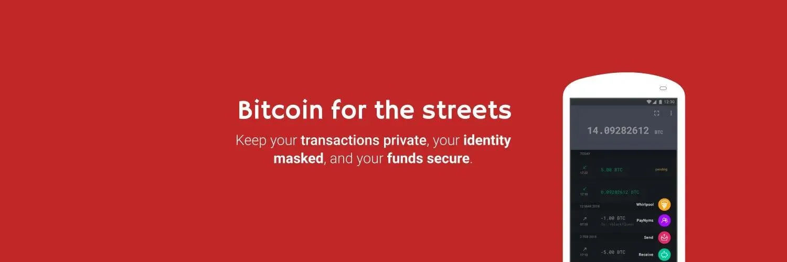
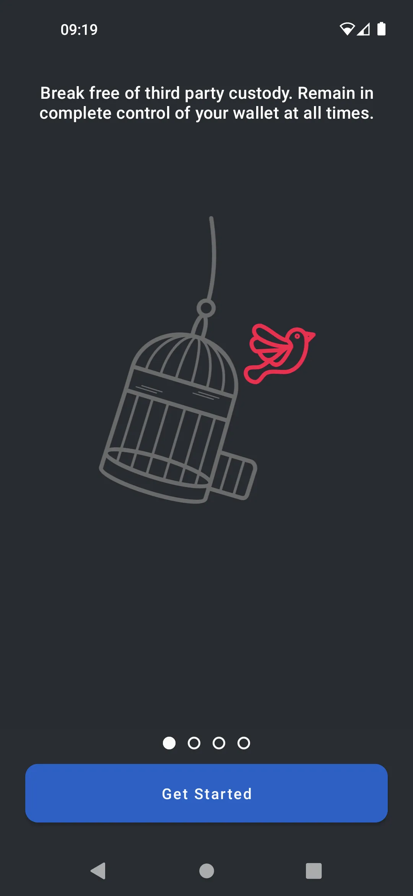
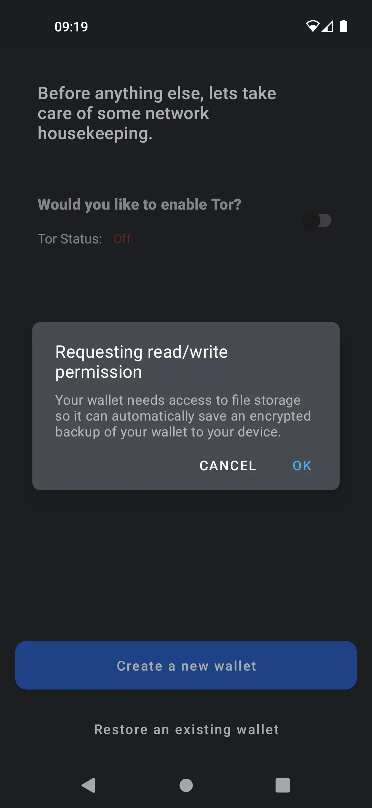
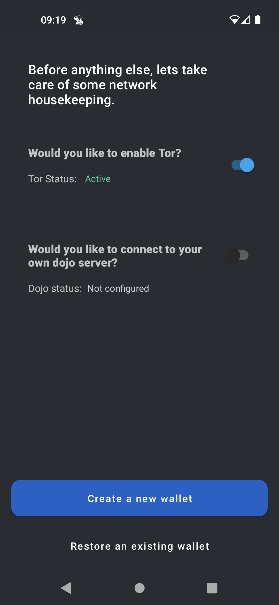
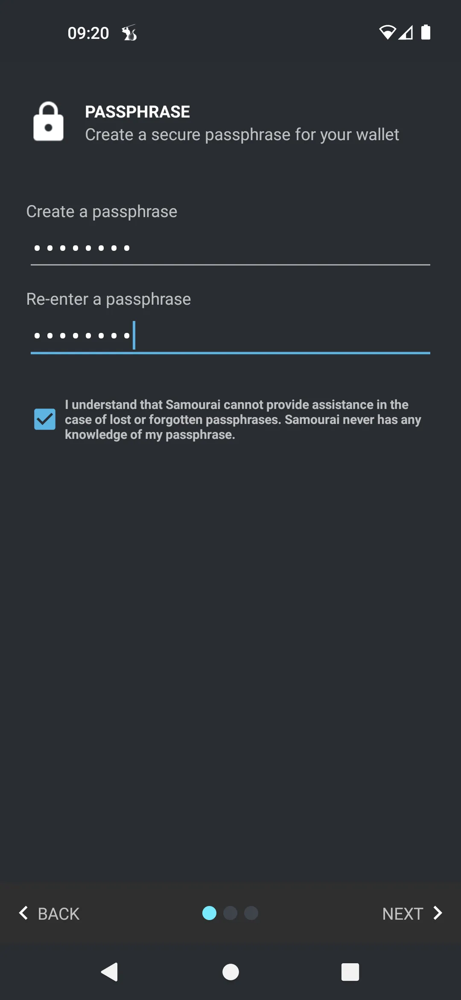
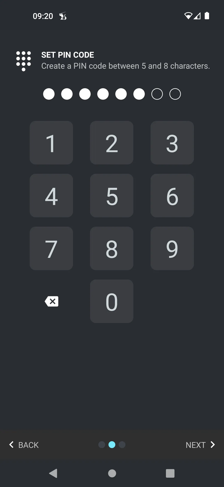
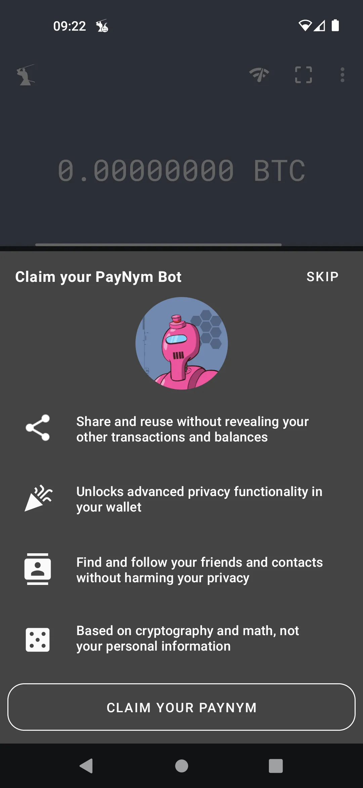

---

***PERINGATAN:** Menyusul penangkapan pendiri Samourai Wallet dan penyitaan server mereka pada 24 April, aplikasi Samourai masih tetap bisa dipakai, **tapi kamu wajib pakai Dojo milikmu sendiri** untuk mengakses informasi blockchain dan melakukan transaksi.*

_Kita terus memantau perkembangan kasus ini dan juga perkembangan terkait alat-alat yang berhubungan. Tenang aja, kita bakal memperbarui tutorial ini begitu ada informasi baru yang tersedia.._

_Tutorial ini dibuat semata-mata untuk tujuan edukasi dan informasi. Kami nggak mendukung atau mendorong penggunaan alat-alat ini buat hal-hal kriminal. Setiap pengguna tetap bertanggung jawab untuk mematuhi hukum di yurisdiksi masing-masing._

---

**Dompet Samourai** adalah dompet yang fokus penuh pada privasi. Walaupun tampilan halamannya ramah pengguna, dompet ini tetap menawarkan fleksibilitas tinggi dalam penggunaan dan juga tingkat keamanan yang kuat.

Karena bersifat **100% non-custodial**, kamu perlu **mencadangkan** 12 kata Anda dan pastikan termasuk **frasa sandi** yang nggak boleh kamu lupakan.

Setelah masuk ke dalam dompet, pengiriman dan penerimaan dilakukan dengan cara tradisional, namun dengan berbagai alat privasi seperti **Ricochet**, **Stonewall**, **Whirlpool**, **JoinMarket**, **PayNyms**, dan lainnya.

Untuk penjelasan tentang masing-masing alat ini, kamu bisa merujuk ke bagian **"Alat Privasi"** dalam tutorial atau kunjungi [**situs dokumentasi resmi Dompet Samourai**](https://docs.samourai.io/)

## Dompet Samourai dalam video

## Panduan

### instalasi cepat untuk pemula

> Diambil dari https://docs.samourai.io/wallet/start

Layar sambutan baru kami ngasih pratinjau fitur-fitur dompet. Setelah kamu baca ini, ketuk 'Mulai'.

Izin

Kasih izin yang diperlukan supaya dompet bisa otomatis bikin cadangan terenkripsi dari dompetmu.

Tor

Sebagian besar pengguna harus mengaktifkan Tor untuk privasi tingkat jaringan. Kemudian ketuk Buat Dompet Baru.

Membuat frasa sandi

Buat passphrase yang aman tapi tetap mudah diingat. Passphrase ini bakal ngasih lapisan keamanan tambahan buat dompetmu dan kompatibel dengan dompet apa pun yang mendukung spesifikasi BIP39.

Passphrase ini jadi komponen penting saat kamu melakukan pemulihan dengan seedphrase (kadang disebut Kata Pemulihan) atau waktu kamu mau pairing ke aplikasi Desktop Whirlpool. Sangat penting buat nggak sampai kehilangan atau lupa passphrase ini.

> Kita tidak memiliki pengetahuan tentang passphrase milikmu, kalau kamu lupa passphrse-mu kami tidak dapat membantumu untuk meresetnya.
> Jangan lupa passphrase-mu!

Buat Kode PIN

Sekarang kamu bakal diminta buat bikin dan mengonfirmasi kode PIN dengan panjang 5 sampai 8 digit. PIN ini dipakai supaya kamu bisa dengan mudah membuka dompet tanpa harus masukin passphrase.

Kalau kamu lupa PIN, kamu tetap bisa akses dompetmu dengan passphrase.

Buat Cadangan Kertas

Sekarang kamu udah berhasil bikin dompet Bitcoin baru. Kamu bakal ditunjukin 12 kata acak. Sangat penting buat kamu menuliskan dan menyimpan dengan aman 12 kata rahasia ini.

Kata-kata ini, kalau dipakai bareng passphrase, bisa meregenerasi seluruh dompet, saldo, dan riwayatmu di software dompet yang kompatibel.

> Lembar Kerja Cadangan Kertas Kami menyediakan template untuk membuat cadangan kertas offline milik kamu sendiri
Kata-kata rahasiamu harus benar-benar dijaga tetap rahasia. Siapa pun yang tahu seedphrase dan passphrase-mu bisa mencuri bitcoinmu. Jangan pernah nyimpen kata-kata itu di komputer atau cloud.

Klaim Bot PayNym-mu

PayNym adalah jenis alamat tersembunyi yang berbeda dari alamat bitcoin biasa, karena aman dibagikan secara publik tanpa ngungkapin apa pun tentang dompetmu, termasuk saldo atau riwayat transaksinya.

Begitu dompetmu berhasil dibuat, kamu bakal diminta buat klaim Bot PayNym. Bot ini adalah representasi visual dari hash SHA-256 alamat PayNym dompetmu.

Setelah kamu klaim, kamu bakal dapet Nama Bot unik yang diunggah ke direktori publik Bot PayNym, yang bisa ditemukan di https://paynym.is

## menggunakannya

Di tahap ini, kamu udah bisa dengan mudah menerima dan mengirim bitcoin. Samourai Wallet punya banyak opsi teknis yang cukup dalam, dan itu bakal kita bahas di panduan selanjutnya.
