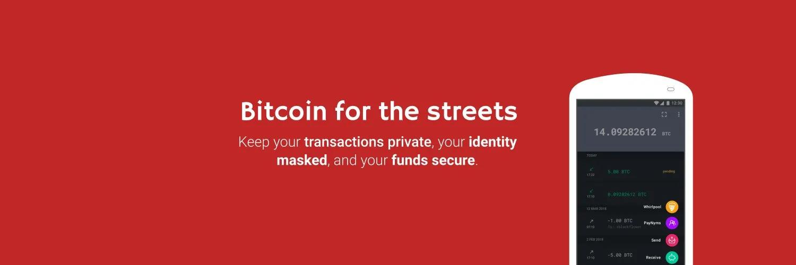

**サムライウォレット**は、プライバシーに特化したウォレットです。ユーザーフレンドリーなインターフェースにもかかわらず、使用とセキュリティにおいて大きな柔軟性を提供します。

**100%非預託**であるため、12語の**バックアップ**を取り、絶対に失うべきではない**パスフレーズ**を含める必要があります。

ウォレット内では、送受信は従来の方法で行われますが、**リコシェ**、**ストーンウォール**、**ワールプール**、**ジョインマーケット**、**ペイニム**などのプライバシーツールが豊富に用意されています。

これらのツールの説明については、チュートリアルの**「プライバシーツール」**セクションを参照するか、[**公式サムライウォレットドキュメントサイト**](https://docs.samourai.io/)を訪れてください。

## サムライウォレットのビデオ

## ガイド

### 初心者向けのクイックインストール

> https://docs.samourai.io/wallet/start から引用

新しいウェルカム画面では、ウォレットの機能のプレビューが表示されます。これらを読んだら、「Get Started」をタップします。

許可

ウォレットがウォレットの暗号化バックアップを自動的に作成できるように、必要な許可を与えてください。

Tor

ほとんどのユーザーは、ネットワークレベルのプライバシーのためにTorを有効にするべきです。その後、「Create a New Wallet」をタップします。

パスフレーズの作成

安全で覚えやすいパスフレーズを作成します。このパスフレーズは、広くサポートされているBIP39仕様を実装している任意のウォレットと互換性があり、ウォレットに追加のセキュリティを提供します。

パスフレーズは、ニーモニック（時にはリカバリーワードと呼ばれる）による復元やワールプールデスクトップアプリへのペアリング時に必要なコンポーネントです。パスフレーズを失ったり忘れたりしないことが重要です。

> パスフレーズを忘れた場合、リセットをお手伝いすることはできません。
> パスフレーズを忘れないでください！

PINコードの作成

5桁から8桁の長さのPINコードを作成して確認するように求められます。PINコードは、パスフレーズを入力せずにウォレットを簡単にアンロックするために使用されます。

PINコードを忘れた場合でも、パスフレーズを使用してウォレットにアクセスすることができます。

紙のバックアップの作成

これで、新しいビットコインウォレットが作成されました。12のランダムな単語が表示されます。これら12の秘密の単語を書き留めて安全に保管することが非常に重要です。

これらの単語は、パスフレーズと組み合わせて使用することで、任意の互換性のあるウォレットソフトウェアでウォレット全体、残高、履歴を再生成することができます。

> 紙のバックアップワークシート 自分のオフライン紙のバックアップを作成するためのテンプレートを提供します

> 秘密の単語は秘密にしておく必要があります。秘密の単語とパスフレーズを知っている人は、あなたのビットコインを盗むことができます。単語をコンピューターやクラウドに保存しないでください。

PayNym Botの請求

PayNymは、通常のビットコインアドレスとは異なり、ウォレットに関する情報（残高や取引履歴など）を公開することなく公に共有できるステルスアドレスの一種です。

ウォレットが正常に作成された後、PayNym Botの請求を求められます。これは、ウォレットのPayNymアドレスのSHA-256ハッシュの視覚的表現です。
一度申請すると、公開されているPayNymボットのディレクトリにアップロードされるユニークなボット名が割り当てられます。これは https://paynym.is で確認できます。

## 使用方法

この段階では、ビットコインを受け取ったり送ったりすることができます。Samouraiウォレットは技術的なオプションがかなり深いため、これについては近いうちにガイドで詳しく説明します。