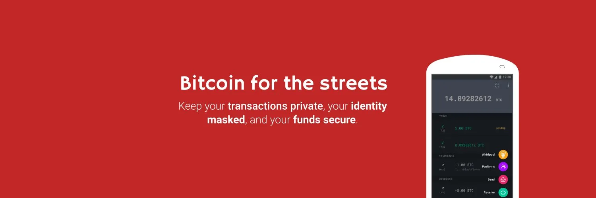
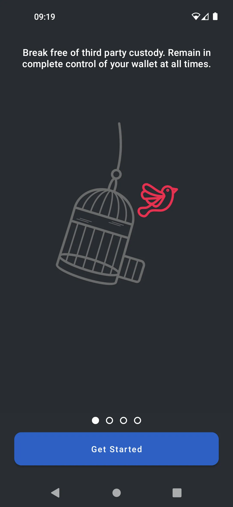
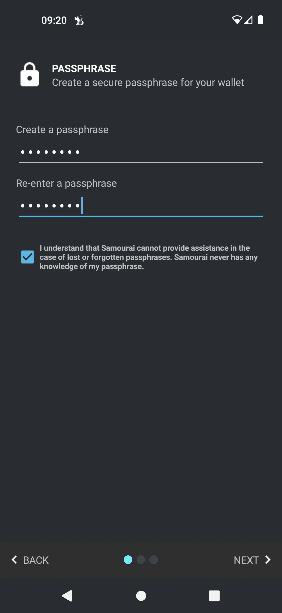
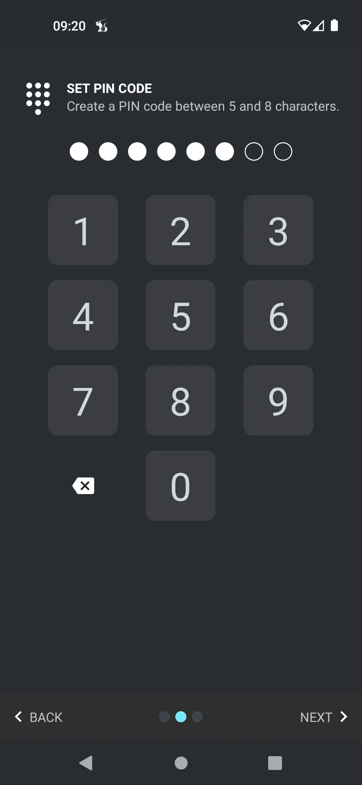
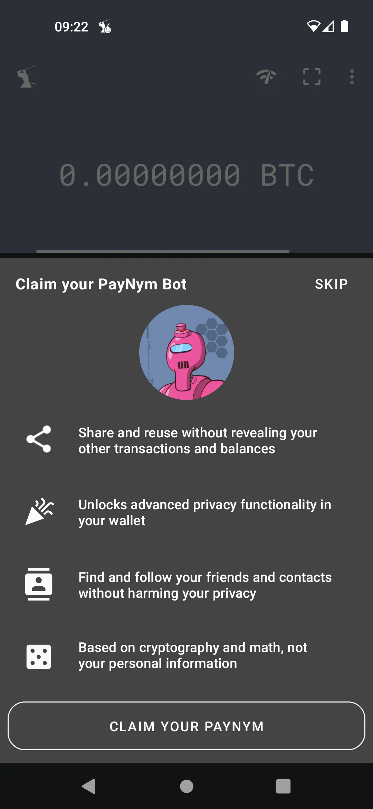

---

***CẢNH BÁO:** Sau vụ bắt giữ các nhà sáng lập của Samourai Wallet và việc tịch thu máy chủ của họ vào ngày 24 tháng 4, ứng dụng Samourai vẫn tiếp tục hoạt động, nhưng bạn **bắt buộc phải sử dụng Dojo của riêng mình** để truy cập thông tin blockchain và phát sóng giao dịch.*

_Chúng tôi đang theo dõi sát sao các diễn biến của vụ việc này cũng như những tiến triển liên quan đến các công cụ kèm theo. Hãy yên tâm rằng chúng tôi sẽ cập nhật hướng dẫn này khi có thông tin mới._

_Hướng dẫn này được cung cấp chỉ cho mục đích giáo dục và thông tin. Chúng tôi không ủng hộ hoặc khuyến khích việc sử dụng các công cụ này cho mục đích phạm tội. Mỗi người dùng có trách nhiệm tuân thủ luật pháp trong khu vực lãnh thổ của họ._

---

**Samourai Wallet** là một ví tập trung vào quyền riêng tư. Mặc dù có giao diện thân thiện với người dùng, nó mang lại sự linh hoạt cao trong việc sử dụng và bảo mật.

Là **100% không giữ hộ (non-custody)**, bạn sẽ cần **sao lưu** 12 từ của mình và chắc chắn bao gồm một **cụm từ bí mật - passphrase**, những thứ mà bạn không nên để mất.

Một khi đã vào trong ví, việc gửi và nhận được thực hiện theo cách truyền thống, nhưng với một loạt các công cụ gia tăng quyền riêng tư như **Ricochet**, **Stonewall**, **Whirlpool**, **JoinMarket**, **PayNyms**, và các công cụ khác.

Để hiểu rõ về từng công cụ này, bạn có thể tham khảo mục **"Công cụ quyền riêng tư"** trong hướng dẫn hoặc truy cập [**trang tài liệu chính thức của Ví Samourai**](https://docs.samourai.io/)

## Ví Samourai qua video

## Hướng dẫn

### Cài đặt nhanh cho người mới bắt đầu

> Trích từ https://docs.samourai.io/wallet/start

Màn hình chào mừng mới của chúng ta giới thiệu trước về các tính năng của ví. Khi bạn đã đọc xong, hãy chạm vào 'Bắt Đầu - Get Started'.

Cấp quyền

Cấp các quyền cần thiết để ví có thể tự động tạo một bản sao lưu mã hóa của ví của bạn.

Tor

Hầu hết người dùng sau đó nên kích hoạt Tor để bảo mật ở cấp độ mạng lưới. Sau đó chạm vào 'Tạo ví mới - Create a New Wallet'.

Tạo cụm từ bí mật - passphrase

Tạo một cụm từ bí mật an toàn nhưng dễ nhớ. Cụm từ bí mật này sẽ cung cấp bảo mật bổ sung cho ví của bạn và tương thích với bất kỳ ví nào đã hỗ trợ BIP39.

Cụm từ bí mật của bạn là một thành phần bắt buộc khi khôi phục bằng cụm từ gợi nhớ (đôi khi được gọi là cụm từ khôi phục) hoặc khi ghép nối với các ứng dụng Whirlpool Desktop. Bạn không được mất hoặc quên cụm từ bí mật của mình.

> Chúng tôi không biết cụm từ bí mật của bạn, nếu bạn quên cụm từ bí mật chúng tôi không thể giúp bạn đặt lại.
> Đừng quên cụm từ bí mật của bạn!

Tạo mã PIN

Bây giờ bạn sẽ được yêu cầu tạo và xác nhận một mã PIN từ 5 đến 8 chữ số. Mã PIN được sử dụng để dễ dàng mở khóa ví của bạn mà không cần nhập cụm từ bí mật.

Nếu bạn quên mã PIN của mình, bạn luôn có thể truy cập ví của mình bằng cụm từ bí mật.

Tạo bản sao lưu bằng giấy

Bây giờ bạn đã tạo một ví Bitcoin hoàn toàn mới. Bạn sẽ được hiển thị 12 từ gợi nhớ (Cụm từ khôi phục) ngẫu nhiên. Điều quan trọng là bạn phải viết và bảo mật cụm 12 từ bí mật này.

Những từ này, khi được sử dụng cùng với cụm từ bí mật (passphrase) của bạn, có thể tái tạo toàn bộ ví, số dư và lịch sử trong bất kỳ phần mềm ví tương thích nào.

> Chúng tôi cung cấp một mẫu để bạn tạo bản sao lưu giấy ngoại tuyến của riêng mình, tham khảo Paper Backup Worksheet
Các từ bí mật của bạn phải được giữ kín. Bất kỳ ai biết các từ khôi phục và cụm từ bí mật của bạn đều có thể ăn cắp bitcoin của bạn. Đừng bao giờ lưu các từ bí mật của bạn trên máy tính hoặc đám mây.

Lấy PayNym Bot của bạn

PayNym là một loại địa chỉ ẩn danh. PayNym khác với các địa chỉ bitcoin thông thường ở chỗ nó có thể được chia sẻ công khai mà không tiết lộ bất kỳ thông tin nào về ví của bạn bao gồm số dư hoặc lịch sử giao dịch.

Sau khi ví được tạo thành công, bạn sẽ được yêu cầu nhận lấy một PayNym Bot. Đây là biểu diễn hình ảnh của mã băm SHA-256 của địa chỉ PayNym ví của bạn.

Một khi đã yêu cầu, bạn sẽ được gán một Tên Bot duy nhất được tải lên thư mục công khai của các bot PayNym, có thể được tìm thấy tại https://paynym.is

## Sử dụng nó

Tại giai đoạn này, bạn có thể đơn giản nhận và gửi bitcoin. Ví Samourai đi khá sâu vào các tùy chọn kỹ thuật, chúng tôi sẽ giới thiệu điều này trong một hướng dẫn sắp tới.
