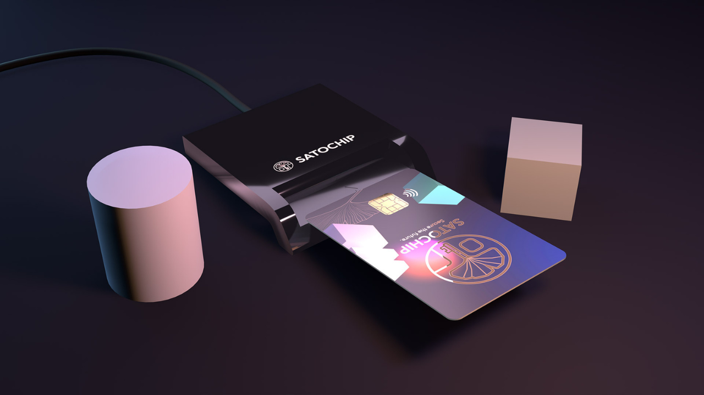
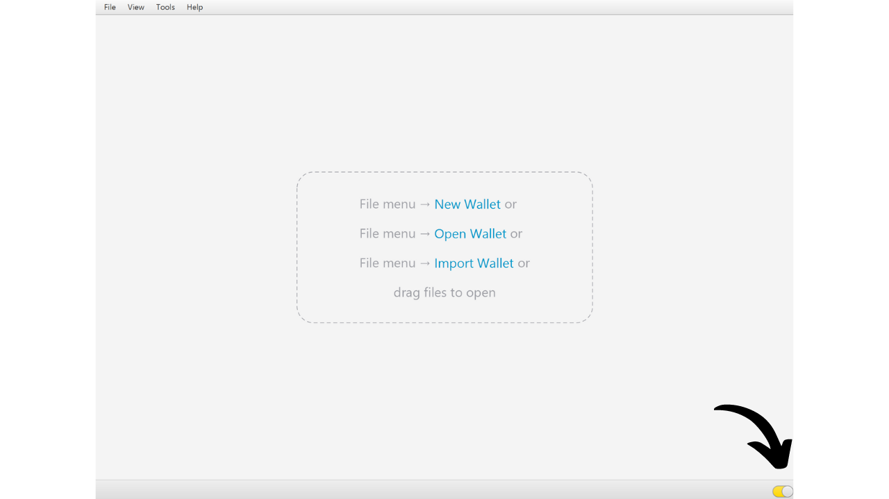
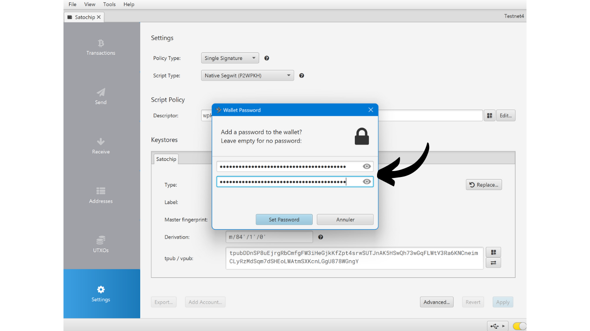
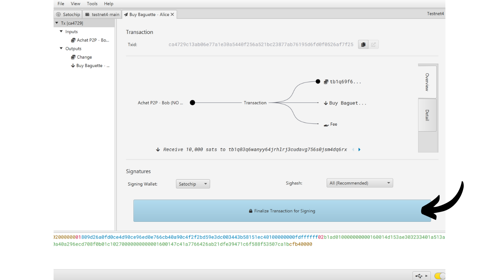
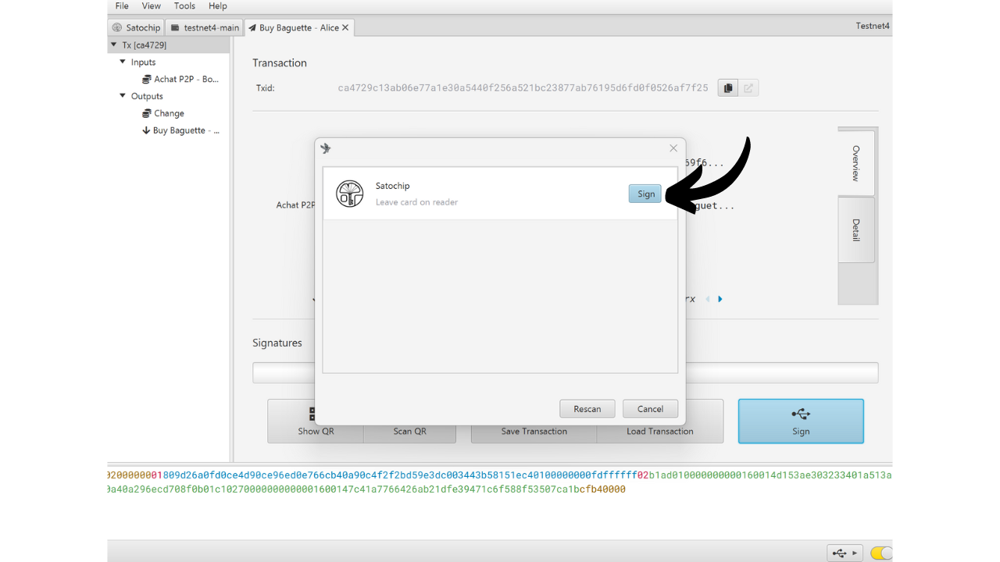

Hardwarová peněženka je elektronické zařízení určené k správě a zabezpečení soukromých klíčů Bitcoin peněženky. Na rozdíl od softwarových peněženek (neboli hot wallets) instalovaných na všeobecně používaných zařízeních často připojených k internetu, hardwarové peněženky umožňují fyzickou izolaci soukromých klíčů, čímž snižují rizika hackování a krádeže.

Hlavním cílem hardwarové peněženky je minimalizovat funkce zařízení, aby se snížila jeho útočná plocha. Menší útočná plocha také znamená méně potenciálních vektorů útoku, tj. méně slabých míst v systému, které by útočníci mohli využít k přístupu k bitcoinům.

Doporučuje se používat hardwarovou peněženku k zabezpečení vašich bitcoinů, zejména pokud držíte významné množství, ať už v absolutní hodnotě nebo jako procento vašich celkových aktiv.

Hardwarové peněženky se používají ve spojení se softwarem pro správu peněženek na počítači nebo chytrém telefonu. Tento software spravuje vytváření transakcí, ale kryptografický podpis nezbytný k ověření těchto transakcí se provádí výhradně v rámci hardwarové peněženky. To znamená, že soukromé klíče nejsou nikdy vystaveny potenciálně zranitelnému prostředí.

Hardwarové peněženky nabízejí dvojí ochranu pro uživatele: na jedné straně zabezpečují vaše bitcoiny proti vzdáleným útokům tím, že udržují soukromé klíče offline, a na druhé straně obecně nabízejí lepší fyzickou odolnost proti pokusům o extrakci klíčů. A právě na těchto 2 bezpečnostních kritériích lze posuzovat a řadit různé dostupné modely na trhu.

V tomto tutoriálu navrhuji objevit jedno z těchto řešení: Satochip.

## Úvod do Satochipu

Satochip je hardwarová peněženka ve formě karty s čipem certifikovaným *EAL6+*, což je velmi vysoký bezpečnostní standard (*NXP JCOP*). Je vyráběn belgickou společností.

Tato chytrá karta se prodává za 25 €, což je velmi dostupná cena ve srovnání s jinými hardwarovými peněženkami na trhu. Čip je bezpečný prvek, který zajišťuje velmi dobrou odolnost proti fyzickým útokům. Navíc je jeho kód open-source (*AGPLv3*).
Nicméně kvůli svému formátu Satochip nenabízí tolik možností jako jiné hardwarové peněženky. Zřejmě nemá baterii, kameru ani čtečku micro SD karet, jelikož je to karta. Jeho největší nevýhodou je podle mého názoru nedostatek obrazovky na hardwarové peněžence, což ji činí více zranitelnou vůči určitým typům vzdálených útoků. To nutí uživatele podepisovat "naslepo" a důvěřovat tomu, co vidí na obrazovce svého počítače.

Přes svá omezení zůstává Satochip zajímavý kvůli své snížené ceně. Tato peněženka může být zejména použita k zvýšení bezpečnosti výdajové peněženky ve spojení s úspornou peněženkou chráněnou hardwarovou peněženkou vybavenou obrazovkou. Také představuje dobré řešení pro ty, kteří drží malé množství bitcoinů a nechtějí investovat stovky eur do sofistikovanějšího zařízení. Navíc použití Satochipů v multisig konfiguracích, nebo potenciálně v systémech peněženek s časovým zámkem v budoucnu, může nabídnout zajímavé výhody.

Společnost Satochip také nabízí 2 další produkty. Jedná se o Satodime, což je nosná karta navržená k offline ukládání bitcoinů, ale neumožňuje transakce. Je to jakýsi papírový peněženka, která je mnohem bezpečnější, a může být použita například jako dárek. Nakonec je zde Seedkeeper, což je správce mnemonických frází. Lze jej použít k bezpečnému uložení našeho seedu, aniž by byl přímo zapsán na kus papíru.

## Jak koupit Satochip?
Satochip je k dispozici k prodeji [na oficiálních stránkách](https://satochip.io/product/satochip/). Pokud ho chcete koupit v kamenném obchodě, můžete také najít [seznam certifikovaných prodejců](https://satochip.io/resellers/) na webových stránkách Satochip.
Pro interakci s vaším softwarem pro správu peněženky nabízí Satochip dvě možnosti: prostřednictvím komunikace NFC nebo přes čtečku chytrých karet. Pro možnost NFC se ujistěte, že vaše zařízení je kompatibilní s touto technologií, nebo si pořiďte externí čtečku NFC. Satochip pracuje na standardní frekvenci 13,56 MHz. V opačném případě si můžete také koupit čtečku chytrých karet. Jednu můžete najít na webových stránkách Satochip nebo jinde.

## Jak nastavit Satochip s Sparrow?

Jakmile obdržíte svůj Satochip, prvním krokem je prohlédnout balení, abyste se ujistili, že nebylo otevřeno. Balení Satochipu by mělo obsahovat pečeť. Pokud tato pečeť chybí nebo je poškozená, může to naznačovat, že chytrá karta byla kompromitována a nemusí být autentická.

Uvnitř najdete Satochip.

Pro správu peněženky v tomto návodu navrhuji použít Sparrow. Pokud software ještě nemáte, [navštivte oficiální webové stránky pro jeho stažení](https://sparrowwallet.com/download/). Můžete se také podívat na náš návod na Sparrow Wallet (brzy přijde).

Vložte svůj Satochip do čtečky chytrých karet nebo jej položte na čtečku NFC a připojte čtečku k počítači, na kterém je otevřen Sparrow.

Otevřete Sparrow Wallet a ujistěte se, že jste správně připojeni k Bitcoinovému uzlu. K tomu zkontrolujte zaškrtávací políčko v pravém dolním rohu: mělo by být žluté, pokud jste připojeni k veřejnému uzlu, zelené pro připojení k Bitcoin Core nebo modré pro Electrum.

Na Sparrow Wallet klikněte na záložku "*File*".

Poté na menu "*New Wallet*".

Vyberte název pro vaši peněženku a poté klikněte na "*Create Wallet*".

Klikněte na tlačítko "*Connected Hardware Wallet*".

Klikněte na tlačítko "*Scan...*".

Měl by se objevit váš Satochip. Klikněte na "*Import Keystore*".

Dále musíte nastavit PIN kód pro odemčení vašeho Satochipu. Vyberte silné heslo, mezi 4 a 16 znaky. Udělejte si zálohu tohoto hesla.

Mějte na paměti, že toto heslo není passphrase. To znamená, že i bez tohoto hesla vám vaše mnemonická fráze umožní znovu importovat vaši peněženku do softwaru, pokud je to nutné. Heslo slouží pouze k zabezpečení přístupu k samotnému Satochipu. Je ekvivalentem PIN kódu, který se nachází na jiných hardwarových peněženkách.

Po zadání hesla klikněte znovu na tlačítko "*Import Keystore*".

Znovu si poznamenejte heslo, poté klikněte na tlačítko "*Initialize*".

Poté se dostanete do okna pro generování vaší mnemonické fráze. Klikněte na tlačítko "*Generate New*".

Vytvořte jednu nebo více fyzických kopií vaší obnovovací fráze zapsáním na papír nebo kovové médium. Buďte si vědomi, že tato fráze poskytuje plný přístup k vašim bitcoinům bez jakékoli další ochrany. Pokud by ji tedy někdo objevil, mohl by vaše bitcoiny okamžitě ukrást, i bez přístupu k vašemu Satochipu nebo jeho PIN kódu. Je tedy důležité tyto zálohy zabezpečit. Navíc vám tato fráze umožňuje znovu získat přístup k vašim bitcoinům v případě ztráty, poškození Satochipu nebo pokud zapomenete svůj PIN kód.

Vaše Bitcoinová peněženka byla úspěšně vytvořena.

Klikněte znovu na tlačítko "*Import Keystore*".

Vaše peněženka je nyní vytvořena. Vaše soukromé klíče jsou nyní uloženy na smart kartě vašeho Satochipu. Klikněte na tlačítko "*Apply*", abyste pokračovali.

Doporučuje se nastavit dodatečné heslo pro zabezpečení veřejných informací spravovaných Sparrow Wallet, kromě PIN kódu vašeho Satochipu. Toto heslo zajistí bezpečnost přístupu k Sparrow Wallet, což pomáhá chránit vaše veřejné klíče, adresy a historii transakcí proti jakémukoli neautorizovanému přístupu.

Zadejte své heslo do obou polí, poté klikněte na tlačítko "*Set Password*".

A to je vše, váš Satochip je nyní nakonfigurován na Sparrow Wallet.

Nyní, když je vaše peněženka vytvořena, můžete odpojit svůj Satochip. Uchovávejte jej na bezpečném místě!

## Jak přijímat bitcoiny s Satochipem?

Jakmile jste ve své peněžence, klikněte na záložku "*Receive*".

Sparrow Wallet generuje adresu pro vaši peněženku. Obvykle se u jiných hardwarových peněženek doporučuje kliknout na "*Display Address*", aby se adresa ověřila přímo na obrazovce zařízení. Bohužel, tato možnost není dostupná u Satochipu, ale ujistěte se, že ji použijete pro vaše ostatní peněženky.

Můžete přidat "*Label*", abyste popsal zdroj bitcoinů, které budou s touto adresou zabezpečeny. To je dobrá praxe, která vám pomáhá lépe spravovat vaše UTXO.

Pro více informací o označování doporučuji také zkontrolovat tento další tutoriál:

https://planb.network/tutorials/privacy/utxo-labelling

Poté můžete tuto adresu použít k přijímání bitcoinů.

## Jak posílat bitcoiny s Satochipem?
Nyní, když jste přijali své první satoshi do své zabezpečené peněženky s Satochipem, můžete je také utratit! Připojte svůj Satochip k počítači, spusťte Sparrow Wallet a poté přejděte na záložku "*Send*", abyste sestavili novou transakci.

Pokud chcete provádět kontrolu mincí, tedy specificky vybírat, které UTXO použít v transakci, přejděte na záložku "*UTXOs*". Vyberte UTXO, které chcete utratit, a poté klikněte na "*Odeslat vybrané*". Budete přesměrováni na stejnou obrazovku záložky "*Odeslat*", ale s vašimi již vybranými UTXO pro transakci.

Zadejte cílovou adresu. Můžete také zadat více adres kliknutím na tlačítko "*+ Přidat*".

Poznamenejte si "*Štítek*", abyste si pamatovali účel této výdaje.

Vyberte částku, která má být na tuto adresu odeslána.

Upravte sazbu poplatku vaší transakce podle aktuálního trhu.

Ujistěte se, že všechny parametry vaší transakce jsou správné, a poté klikněte na "*Vytvořit transakci*".

Pokud je vše k vaší spokojenosti, klikněte na "*Finalizovat transakci pro podepsání*".

Klikněte na "*Podepsat*".

Klikněte znovu na "*Podepsat*" vedle vašeho Satochipu.

Zadejte PIN k vašemu Satochipu, a poté klikněte znovu na "*Podepsat*", abyste podepsali vaši transakci.

Vaše transakce je nyní podepsaná. Klikněte na "*Odeslat transakci*" pro její odeslání do Bitcoinové sítě.

Najdete ji na záložce "*Transakce*" ve Sparrow Wallet.

Gratulujeme, nyní se vyznáte v používání Satochipu! Pokud se vám tento návod líbil, ocenil bych palce nahoru níže. Neváhejte tento článek sdílet na vašich sociálních sítích. Moc vám děkuji!