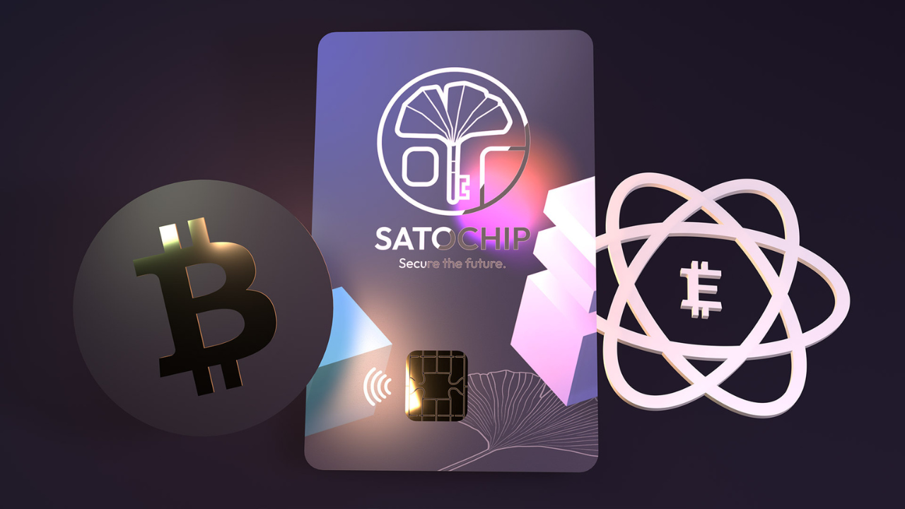
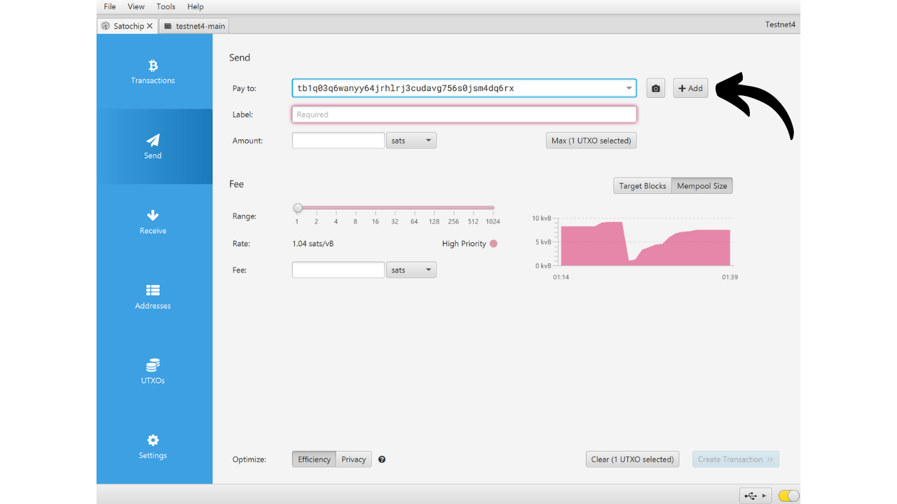
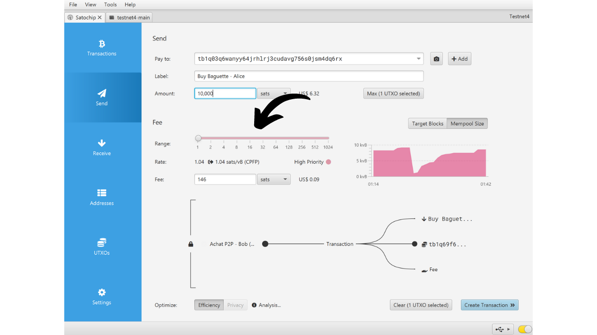

Eine Hardware-Wallet ist ein elektronisches Gerät, das speziell für die Verwaltung und Sicherung der privaten Schlüssel einer Bitcoin-Wallet entwickelt wurde. Im Gegensatz zu Software-Wallets (oder Hot Wallets), die auf allgemeinen Maschinen installiert sind, die oft mit dem Internet verbunden sind, ermöglichen Hardware-Wallets die physische Isolierung privater Schlüssel, wodurch die Risiken von Hacking und Diebstahl verringert werden.

Das Hauptziel einer Hardware-Wallet ist es, die Funktionalitäten des Geräts zu minimieren, um seine Angriffsfläche zu reduzieren. Eine kleinere Angriffsfläche bedeutet auch weniger potenzielle Angriffsvektoren, d.h. weniger Schwachstellen im System, die Angreifer ausnutzen könnten, um auf die Bitcoins zuzugreifen.

Es wird empfohlen, eine Hardware-Wallet zu verwenden, um Ihre Bitcoins zu sichern, insbesondere wenn Sie bedeutende Mengen halten, sei es im absoluten Wert oder als Anteil an Ihrem Gesamtvermögen.

Hardware-Wallets werden in Kombination mit Wallet-Management-Software auf einem Computer oder Smartphone verwendet. Diese Software verwaltet die Erstellung von Transaktionen, aber die kryptografische Signatur, die notwendig ist, um diese Transaktionen zu validieren, erfolgt ausschließlich innerhalb der Hardware-Wallet. Das bedeutet, dass die privaten Schlüssel nie einer potenziell gefährdeten Umgebung ausgesetzt sind.

Hardware-Wallets bieten dem Benutzer einen doppelten Schutz: einerseits sichern sie Ihre Bitcoins gegen Fernangriffe, indem sie die privaten Schlüssel offline halten, und andererseits bieten sie in der Regel eine bessere physische Widerstandsfähigkeit gegen Versuche, die Schlüssel zu extrahieren. Und genau anhand dieser 2 Sicherheitskriterien kann man die verschiedenen auf dem Markt erhältlichen Modelle beurteilen und einordnen.

In diesem Tutorial schlage ich vor, eine dieser Lösungen zu entdecken: den Satochip.

## Einführung in Satochip

Der Satochip ist eine Hardware-Wallet in Form einer Karte mit einem *EAL6+* zertifizierten Chip, was einen sehr hohen Sicherheitsstandard darstellt (*NXP JCOP*). Er wird von einem belgischen Unternehmen hergestellt.

Diese Smartcard wird für 25 € verkauft, was im Vergleich zu anderen Hardware-Wallets auf dem Markt sehr erschwinglich ist. Der Chip ist ein sicheres Element, das eine sehr gute Widerstandsfähigkeit gegen physische Angriffe gewährleistet. Darüber hinaus ist sein Code Open-Source (*AGPLv3*).
Aufgrund seines Formats bietet der Satochip jedoch nicht so viele Optionen wie andere Hardware. Es gibt offensichtlich keine Batterie, keine Kamera und keinen Micro-SD-Kartenleser, da es sich um eine Karte handelt. Sein größter Nachteil ist meiner Meinung nach das Fehlen eines Bildschirms auf der Hardware-Wallet, was sie anfälliger für bestimmte Arten von Fernangriffen macht. Tatsächlich zwingt dies den Benutzer, blind zu signieren und dem zu vertrauen, was er auf seinem Computerbildschirm sieht.

Trotz seiner Einschränkungen bleibt der Satochip interessant wegen seines reduzierten Preises. Diese Wallet kann insbesondere dazu verwendet werden, die Sicherheit einer Ausgaben-Wallet in Ergänzung zu einer Spar-Wallet zu erhöhen, die durch eine Hardware-Wallet mit Bildschirm geschützt ist. Es stellt auch eine gute Lösung für diejenigen dar, die kleine Mengen an Bitcoins halten und nicht hundert Euro in ein ausgefeilteres Gerät investieren möchten. Darüber hinaus kann die Verwendung von Satochips in Multisig-Konfigurationen oder potenziell in Wallet-Systemen mit Timelock in der Zukunft interessante Vorteile bieten.

Das Unternehmen Satochip bietet auch 2 weitere Produkte an. Da ist zum einen der Satodime, eine Trägerkarte, die dazu gedacht ist, Bitcoins offline zu speichern, aber keine Transaktionen zulässt. Es ist eine Art von Paper-Wallet, die viel sicherer ist und beispielsweise als Geschenk verwendet werden kann. Schließlich gibt es den Seedkeeper, einen Manager für mnemonische Phrasen. Er kann verwendet werden, um unseren Seed sicher zu speichern, ohne dass er direkt auf einem Stück Papier notiert wird.

## Wie kauft man einen Satochip?
Der Satochip ist [auf der offiziellen Website](https://satochip.io/product/satochip/) zum Verkauf verfügbar. Um ihn in einem physischen Geschäft zu kaufen, können Sie auch [die Liste der zertifizierten Wiederverkäufer](https://satochip.io/resellers/) auf der Satochip-Website finden.
Um mit Ihrer Wallet-Verwaltungssoftware zu interagieren, bietet der Satochip zwei Möglichkeiten: über NFC-Kommunikation oder über einen Smartcard-Leser. Für die NFC-Option stellen Sie sicher, dass Ihr Gerät mit dieser Technologie kompatibel ist oder besorgen Sie sich einen externen NFC-Leser. Der Satochip arbeitet mit der Standardfrequenz von 13,56 MHz. Andernfalls können Sie auch einen Smartcard-Leser kaufen. Sie können einen auf der Satochip-Website oder anderswo finden.

## Wie richtet man einen Satochip mit Sparrow ein?

Sobald Sie Ihren Satochip erhalten haben, ist der erste Schritt, die Verpackung zu überprüfen, um sicherzustellen, dass sie nicht geöffnet wurde. Die Verpackung des Satochip sollte einen Siegelaufkleber enthalten. Wenn dieser Aufkleber fehlt oder beschädigt ist, könnte dies darauf hinweisen, dass die Smartcard kompromittiert wurde und möglicherweise nicht authentisch ist.

Sie werden den Satochip darin finden.

Um die Wallet zu verwalten, schlage ich in diesem Tutorial vor, Sparrow zu verwenden. Wenn Sie die Software noch nicht haben, [besuchen Sie die offizielle Website, um sie herunterzuladen](https://sparrowwallet.com/download/). Sie können auch unser Tutorial über Sparrow Wallet (demnächst verfügbar) ansehen.

Stecken Sie Ihren Satochip in den Smartcard-Leser oder legen Sie ihn auf den NFC-Leser und verbinden Sie den Leser mit Ihrem Computer, auf dem Sparrow geöffnet ist.

Öffnen Sie Sparrow Wallet und stellen Sie sicher, dass Sie ordnungsgemäß mit einem Bitcoin-Node verbunden sind. Überprüfen Sie dazu das Häkchen unten rechts: Es sollte gelb sein, wenn Sie mit einem öffentlichen Node verbunden sind, grün für eine Verbindung zu Bitcoin Core oder blau für Electrum.

Klicken Sie in Sparrow Wallet auf den Tab "*File*".

Dann auf das Menü "*New Wallet*".

Wählen Sie einen Namen für Ihre Wallet und klicken Sie dann auf "*Create Wallet*".

Klicken Sie auf den Button "*Connected Hardware Wallet*".

Klicken Sie auf den Button "*Scan...*".

Ihr Satochip sollte erscheinen. Klicken Sie auf "*Import Keystore*".

Als Nächstes müssen Sie einen PIN-Code einrichten, um Ihren Satochip zu entsperren. Wählen Sie ein starkes Passwort, zwischen 4 und 16 Zeichen. Machen Sie eine Sicherungskopie dieses Passworts.

Beachten Sie, dieses Passwort ist keine Passphrase. Das bedeutet, dass selbst ohne dieses Passwort Ihre mnemonische Phrase es Ihnen ermöglichen wird, Ihre Wallet bei Bedarf in Software zu re-importieren. Das Passwort dient nur dazu, den Zugang zum Satochip selbst zu sichern. Es entspricht dem PIN-Code, der bei anderen Hardware-Wallets zu finden ist.

Nachdem das Passwort eingegeben wurde, klicken Sie erneut auf den Button "*Import Keystore*".

Notieren Sie das Passwort erneut, dann klicken Sie auf den Button "*Initialize*".

Sie gelangen dann zum Fenster für die Erstellung Ihrer mnemonischen Phrase. Klicken Sie auf den Button "*Generate New*".

Erstellen Sie eine oder mehrere physische Kopien Ihrer Wiederherstellungsphrase, indem Sie sie auf einem Papier- oder Metallmedium notieren. Beachten Sie, dass diese Phrase vollen Zugriff auf Ihre Bitcoins ohne jeglichen zusätzlichen Schutz gewährt. Daher könnte jemand, der sie entdeckt, Ihre Bitcoins sofort stehlen, selbst ohne Zugang zu Ihrem Satochip oder dessen PIN-Code. Es ist daher wichtig, diese Backups zu sichern. Außerdem ermöglicht Ihnen diese Phrase, im Falle eines Verlusts, einer Beschädigung des Satochip oder wenn Sie Ihren PIN-Code vergessen haben, wieder Zugang zu Ihren Bitcoins zu erhalten.

Ihr Bitcoin-Wallet wurde erfolgreich erstellt.

Klicken Sie erneut auf den Button "*Import Keystore*".

Ihr Wallet ist nun erstellt. Ihre privaten Schlüssel sind jetzt auf der Smartcard Ihres Satochip gespeichert. Klicken Sie auf den Button "*Apply*", um fortzufahren.

Es wird empfohlen, ein zusätzliches Passwort einzurichten, um die von Sparrow Wallet verwalteten öffentlichen Informationen zusätzlich zum PIN-Code Ihres Satochip zu sichern. Dieses Passwort gewährleistet die Sicherheit des Zugriffs auf Sparrow Wallet, was dazu beiträgt, Ihre öffentlichen Schlüssel, Adressen und Transaktionshistorie vor unbefugtem Zugriff zu schützen.

Geben Sie Ihr Passwort in die beiden Felder ein und klicken Sie dann auf den Button "*Set Password*".

Und voilà, Ihr Satochip ist nun auf Sparrow Wallet konfiguriert.

Jetzt, da Ihr Wallet erstellt ist, können Sie Ihren Satochip trennen. Bewahren Sie ihn an einem sicheren Ort auf!

## Wie empfange ich Bitcoins mit dem Satochip?

Klicken Sie in Ihrem Wallet auf den Tab "*Receive*".

Sparrow Wallet generiert eine Adresse für Ihr Wallet. Normalerweise wird bei anderen Hardware-Wallets empfohlen, auf "*Display Address*" zu klicken, um die Adresse direkt auf dem Bildschirm des Geräts zu überprüfen. Leider ist diese Option beim Satochip nicht verfügbar, aber stellen Sie sicher, dass Sie sie für Ihre anderen Wallets verwenden.

Sie können ein "*Label*" hinzufügen, um die Quelle der Bitcoins zu beschreiben, die mit dieser Adresse gesichert werden. Dies ist eine gute Praxis, die Ihnen hilft, Ihre UTXOs besser zu verwalten.

Für weitere Informationen zum Labeling empfehle ich auch, dieses andere Tutorial zu überprüfen:

https://planb.network/tutorials/privacy/utxo-labelling

Sie können dann diese Adresse verwenden, um Bitcoins zu empfangen.

## Wie sende ich Bitcoins mit Satochip?
Jetzt, da Sie Ihre ersten Sats in Ihrem sicheren Wallet mit Satochip erhalten haben, können Sie sie auch ausgeben! Verbinden Sie Ihren Satochip mit Ihrem Computer, starten Sie Sparrow Wallet und gehen Sie dann zum Tab "*Send*", um eine neue Transaktion zu erstellen.

Wenn Sie Coin Control durchführen möchten, das heißt, spezifisch auswählen möchten, welche UTXOs in der Transaktion verbraucht werden sollen, gehen Sie zum Tab "*UTXOs*". Wählen Sie die UTXOs aus, die Sie ausgeben möchten, und klicken Sie dann auf "*Send Selected*". Sie werden zur gleichen Ansicht des Tabs "*Send*" weitergeleitet, aber mit Ihren bereits für die Transaktion ausgewählten UTXOs.

Geben Sie die Zieladresse ein. Sie können auch mehrere Adressen eingeben, indem Sie auf den Button "*+ Add*" klicken.

Notieren Sie ein "*Label*", um sich an den Zweck dieser Ausgabe zu erinnern.

Wählen Sie den Betrag, der an diese Adresse gesendet werden soll.

Passen Sie die Gebührenrate Ihrer Transaktion entsprechend dem aktuellen Markt an.

Stellen Sie sicher, dass alle Parameter Ihrer Transaktion korrekt sind, und klicken Sie dann auf "*Create Transaction*".

Wenn alles zu Ihrer Zufriedenheit ist, klicken Sie auf "*Finalize Transaction for Signing*".

Klicken Sie auf "*Sign*".

Klicken Sie erneut neben Ihrem Satochip auf "*Sign*".

Geben Sie den PIN-Code Ihres Satochip ein und klicken Sie dann erneut auf "*Sign*", um Ihre Transaktion zu signieren.

Ihre Transaktion ist jetzt signiert. Klicken Sie auf "*Broadcast Transaction*", um sie im Bitcoin-Netzwerk zu verbreiten.

Sie finden sie im Tab "*Transactions*" des Sparrow Wallet.

Herzlichen Glückwunsch, Sie wissen jetzt, wie man Satochip verwendet! Wenn Sie dieses Tutorial hilfreich fanden, würde ich mich über einen Daumen nach oben unten freuen. Fühlen Sie sich frei, diesen Artikel in Ihren sozialen Netzwerken zu teilen. Vielen Dank!