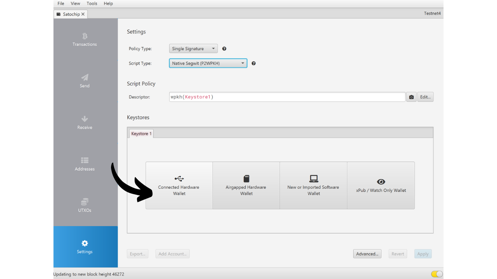
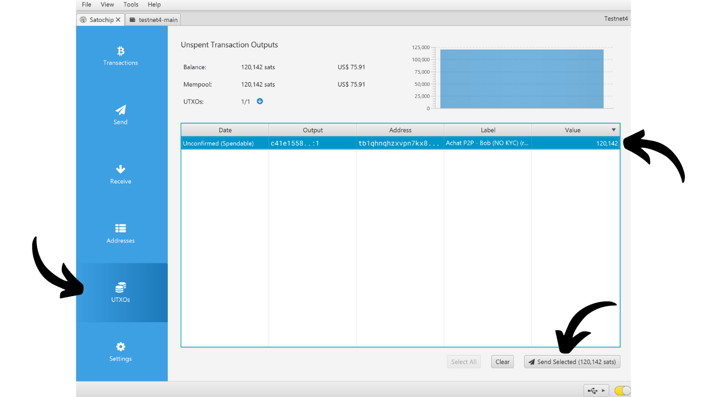

A hardware wallet is an electronic device dedicated to managing and securing the private keys of a Bitcoin wallet. Unlike software wallets (or hot wallets) installed on general-purpose machines often connected to the Internet, hardware wallets allow for the physical isolation of private keys, reducing the risks of hacking and theft.

The main goal of a hardware wallet is to minimize the device's functionalities to reduce its attack surface. A smaller attack surface also means fewer potential attack vectors, i.e., fewer weaknesses in the system that attackers could exploit to access the bitcoins.

It is recommended to use a hardware wallet to secure your bitcoins, especially if you hold significant amounts, whether in absolute value or as a proportion of your total assets.

Hardware wallets are used in combination with wallet management software on a computer or smartphone. This software manages the creation of transactions, but the cryptographic signature necessary to validate these transactions is done solely within the hardware wallet. This means that the private keys are never exposed to a potentially vulnerable environment.

Hardware wallets offer dual protection for the user: on one hand, they secure your bitcoins against remote attacks by keeping the private keys offline, and on the other hand, they generally offer better physical resistance against attempts to extract the keys. And it is precisely on these 2 security criteria that one can judge and rank the different models available on the market.

In this tutorial, I propose to discover one of these solutions: the Satochip.

## Introduction to Satochip

The Satochip is a hardware wallet in the form of a card with an *EAL6+* certified chip, which is a very high security standard (*NXP JCOP*). It is produced by a Belgian company.

This smart card is sold for €25, which is very affordable compared to other hardware wallets on the market. The chip is a secure element that ensures very good resistance against physical attacks. Moreover, its code is open-source (*AGPLv3*).
However, due to its format, the Satochip does not offer as many options as other hardware. There is obviously no battery, no camera, nor a micro SD card reader, as it is a card. Its biggest disadvantage, in my opinion, is the lack of a screen on the hardware wallet, which makes it more vulnerable to certain types of remote attacks. Indeed, this forces the user to sign blindly and to trust what they see on their computer screen.

Despite its limitations, the Satochip remains interesting because of its reduced price. This wallet can notably be used to enhance the security of a spending wallet in addition to a savings wallet protected by a hardware wallet equipped with a screen. It also constitutes a good solution for those who hold small amounts of bitcoins and do not wish to invest a hundred euros in a more sophisticated device. Moreover, the use of Satochips in multisig configurations, or potentially in wallet systems with timelock in the future, can offer interesting advantages.

The Satochip company also offers 2 other products. There is the Satodime, which is a bearer card designed to store bitcoins offline, but does not allow for transactions. It's a kind of paper wallet that is much more secure, which can be used, for example, to make a gift. Finally, there is the Seedkeeper, which is a mnemonic phrase manager. It can be used to securely save our seed without it being directly noted on a piece of paper.

## How to buy a Satochip?

The Satochip is available for sale [on the official website](https://satochip.io/product/satochip/). To buy it in a physical store, you can also find [the list of certified resellers](https://satochip.io/resellers/) on the Satochip website.

To interact with your wallet management software, the Satochip offers two possibilities: through NFC communication or via a smart card reader. For the NFC option, make sure your machine is compatible with this technology or get an external NFC reader. The Satochip operates at the standard frequency of 13.56 MHz. Otherwise, you can also buy a smart card reader. You can find one on the Satochip website or elsewhere.

## How to set up a Satochip with Sparrow?

Once you have received your Satochip, the first step is to examine the packaging to ensure it has not been opened. The Satochip's packaging should include a sealing sticker. If this sticker is missing or damaged, it could indicate that the smart card has been compromised and might not be authentic.

You will find the Satochip inside.

To manage the wallet, in this tutorial, I suggest using Sparrow. If you do not yet have the software, [visit the official website to download it](https://sparrowwallet.com/download/). You can also check out our tutorial on Sparrow Wallet (coming soon).

Insert your Satochip into the smart card reader or place it on the NFC reader, and connect the reader to your computer on which Sparrow is open.

Open Sparrow Wallet and make sure you are properly connected to a Bitcoin node. To do this, check the tick at the bottom right: it should be yellow if you are connected to a public node, green for a connection to Bitcoin Core, or blue for Electrum.

On Sparrow Wallet, click on the "*File*" tab.

Then on the "*New Wallet*" menu.

Choose a name for your wallet and then click on "*Create Wallet*".

Click on the "*Connected Hardware Wallet*" button.

Click on the "*Scan...*" button.

Your Satochip should appear. Click on "*Import Keystore*".

Next, you need to set up a PIN code to unlock your Satochip. Choose a strong password, between 4 and 16 characters. Make a backup of this password.

Be aware, this password is not a passphrase. This means that even without this password, your mnemonic phrase will allow you to re-import your wallet into software if necessary. The password is only used to secure access to the Satochip itself. It is equivalent to the PIN code found on other hardware wallets.

Once the password is entered, click again on the "*Import Keystore*" button.

Note the password again, then click on the "*Initialize*" button.

You then arrive at the window for generating your mnemonic phrase. Click on the "*Generate New*" button.

Make one or more physical copies of your recovery phrase by writing it down on a paper or metal medium. Be aware, this phrase grants full access to your bitcoins without any additional protection. Therefore, if someone were to discover it, they could instantly steal your bitcoins, even without access to your Satochip or its PIN code. It is thus important to secure these backups. Moreover, this phrase allows you to regain access to your bitcoins in case of loss, damage to the Satochip, or if you forget your PIN code.

Your Bitcoin wallet has been successfully created.

Click again on the "*Import Keystore*" button.

Your wallet is now created. Your private keys are now stored on the smartcard of your Satochip. Click on the "*Apply*" button to continue.

It is recommended to set up an additional password to secure the public information managed by Sparrow Wallet, in addition to the PIN code of your Satochip. This password will ensure the security of access to Sparrow Wallet, which helps to protect your public keys, addresses, and transaction history against any unauthorized access.

Enter your password in the two fields, then click on the "*Set Password*" button.

And there you have it, your Satochip is now configured on Sparrow Wallet.

Now that your wallet is created, you can disconnect your Satochip. Keep it in a safe place!

## How to receive bitcoins with the Satochip?

Once in your wallet, click on the "*Receive*" tab.

Sparrow Wallet generates an address for your wallet. Usually, for other hardware wallets, it is advised to click on "*Display Address*" to verify the address directly on the device's screen. Unfortunately, this option is not available with the Satochip, but make sure to use it for your other wallets.

You can add a "*Label*" to describe the source of the bitcoins that will be secured with this address. This is a good practice that helps you better manage your UTXOs.

For more information on labeling, I also recommend checking out this other tutorial:

https://planb.network/tutorials/privacy/utxo-labelling

You can then use this address to receive bitcoins.

## How to Send Bitcoins with Satochip?
Now that you have received your first sats in your secure wallet with Satochip, you can also spend them! Connect your Satochip to your computer, launch Sparrow Wallet, and then go to the "*Send*" tab to construct a new transaction.

If you want to perform coin control, that is, specifically choose which UTXOs to consume in the transaction, go to the "*UTXOs*" tab. Select the UTXOs you wish to spend, then click on "*Send Selected*". You will be redirected to the same screen of the "*Send*" tab, but with your UTXOs already selected for the transaction.

Enter the destination address. You can also enter multiple addresses by clicking on the "*+ Add*" button.

Note a "*Label*" to remember the purpose of this expenditure.

Choose the amount sent to this address.

Adjust the fee rate of your transaction according to the current market.

Ensure all the parameters of your transaction are correct, then click on "*Create Transaction*".

If everything is to your satisfaction, click on "*Finalize Transaction for Signing*".

Click on "*Sign*".

Click on "*Sign*" again next to your Satochip.

Enter the PIN code of your Satochip, then click on "*Sign*" again to sign your transaction.

Your transaction is now signed. Click on "*Broadcast Transaction*" to broadcast it to the Bitcoin network.

You can find it in the "*Transactions*" tab of Sparrow Wallet.

Congratulations, you are now knowledgeable about using Satochip! If you found this tutorial helpful, I would appreciate a thumbs up below. Feel free to share this article on your social networks. Thank you very much!