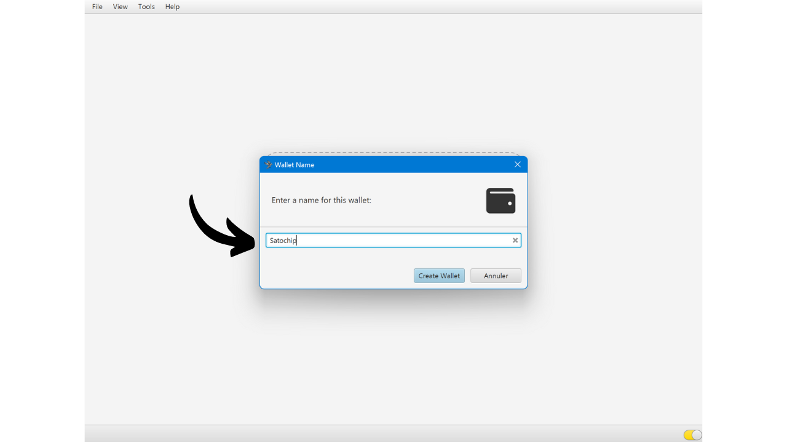
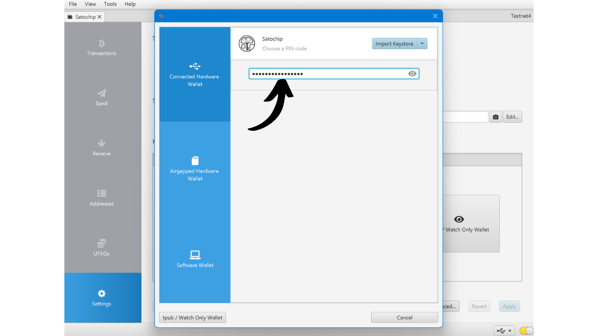

Riistvarakott on elektrooniline seade, mis on pühendatud Bitcoini rahakoti privaatvõtmete haldamisele ja turvamisele. Erinevalt tarkvaralistest rahakottidest (või kuumadest rahakottidest), mis on paigaldatud üldotstarbelistele masinatele, mis on tihti ühendatud internetiga, võimaldavad riistvarakotid privaatvõtmete füüsilist isoleerimist, vähendades häkkimise ja varguse riske.

Riistvarakoti peamine eesmärk on vähendada seadme funktsionaalsusi, et vähendada selle rünnakupinda. Väiksem rünnakupind tähendab ka vähem potentsiaalseid rünnakute vektoreid, st vähem süsteemi nõrkusi, mida ründajad võiksid ära kasutada bitcoini juurdepääsuks.

On soovitatav kasutada riistvarakotti oma bitcoinide turvamiseks, eriti kui omate olulisi summasid, kas absoluutväärtuses või kui osa teie koguvarast.

Riistvarakotte kasutatakse koos rahakoti haldamise tarkvaraga arvutis või nutitelefonis. See tarkvara haldab tehingute loomist, kuid krüptograafiline allkiri, mis on vajalik nende tehingute valideerimiseks, tehakse ainult riistvarakotis. See tähendab, et privaatvõtmed ei ole kunagi avatud potentsiaalselt haavatavale keskkonnale.

Riistvarakotid pakuvad kasutajale kahekordset kaitset: ühelt poolt kaitsevad nad teie bitcoine kaugrünnakute eest, hoides privaatvõtmeid võrguühenduseta, ja teiselt poolt pakuvad nad üldiselt paremat füüsilist vastupanu võtmete kättesaamise katsetele. Ja just nendel 2 turvakriteeriumil saab hinnata ja järjestada turul saadaolevaid erinevaid mudeleid.

Selles õpetuses pakun avastada ühte neist lahendustest: Satochipi.

## Satochipi tutvustus

Satochip on riistvarakott kaardi kujul, millel on *EAL6+* sertifitseeritud kiip, mis on väga kõrge turvastandard (*NXP JCOP*). Selle toodab Belgia ettevõte.

See nutikaart müüakse hinnaga 25 €, mis on väga soodne võrreldes teiste turul olevate riistvarakottidega. Kiip on turvaelement, mis tagab väga hea vastupanu füüsilistele rünnakutele. Lisaks on selle kood avatud lähtekoodiga (*AGPLv3*).
Siiski, oma formaadi tõttu ei paku Satochip nii palju võimalusi kui teised riistvarad. Ilmselgelt ei ole sellel akut, kaamerat ega mikro-SD kaardilugejat, kuna see on kaart. Minu arvates on selle suurim puudus riistvarakotil ekraani puudumine, mis muudab selle teatud tüüpi kaugrünnakute suhtes haavatavamaks. Tõepoolest, see sunnib kasutajat pimesi allkirjastama ja usaldama seda, mida nad näevad oma arvutiekraanil.

Hoolimata oma piirangutest, jääb Satochip huvitavaks oma soodsa hinna tõttu. See rahakott võib eriti olla kasulik kulutuste rahakoti turvalisuse tõstmiseks lisaks säästurahakotile, mida kaitseb ekraaniga varustatud riistvarakott. Samuti on see hea lahendus neile, kes hoiavad väikeseid bitcoini summasid ja ei soovi investeerida sadu eurosid keerukamasse seadmesse. Lisaks võivad Satochipide kasutamine multisig konfiguratsioonides või potentsiaalselt tulevikus ajalukuga rahakottide süsteemides pakkuda huvitavaid eeliseid.

Satochipi ettevõte pakub ka 2 muud toodet. On olemas Satodime, mis on kandekaart, mis on mõeldud bitcoinide offline salvestamiseks, kuid ei võimalda tehinguid. See on omamoodi paberist rahakott, mis on palju turvalisem, mida saab kasutada näiteks kingituse tegemiseks. Lõpuks on olemas Seedkeeper, mis on mnemoonilise fraasi haldur. Seda saab kasutada meie seemne turvaliseks salvestamiseks ilma, et see oleks otse paberile märgitud.

## Kuidas osta Satochipi?
Satochip on müügil [ametlikul veebilehel](https://satochip.io/product/satochip/). Füüsilisest poest ostmiseks leiate [sertifitseeritud edasimüüjate nimekirja](https://satochip.io/resellers/) Satochipi veebilehelt.
Satochipiga oma rahakoti haldustarkvaraga suhtlemiseks on kaks võimalust: NFC kommunikatsiooni kaudu või nutikaardilugeja abil. NFC valiku puhul veenduge, et teie seade ühildub selle tehnoloogiaga või hankige väline NFC lugeja. Satochip töötab standardse sagedusega 13,56 MHz. Vastasel juhul võite osta ka nutikaardilugeja. Ühe leiate Satochipi veebilehelt või mujalt.

## Kuidas seadistada Satochipi Sparrow'ga?

Kui olete oma Satochipi kätte saanud, on esimene samm pakendi kontrollimine, et veenduda, et seda ei ole avatud. Satochipi pakend peaks sisaldama pitserkleebist. Kui see kleebis puudub või on kahjustatud, võib see viidata, et nutikaart on kompromiteeritud ja ei pruugi olla autentne.

Leiate Satochipi seest.

Rahakoti haldamiseks soovitan selles õpetuses kasutada Sparrow'd. Kui teil tarkvara veel ei ole, [külastage ametlikku veebilehte selle allalaadimiseks](https://sparrowwallet.com/download/). Vaadake ka meie õpetust Sparrow Wallet'i kohta (varsti saadaval).

Sisestage oma Satochip nutikaardilugejasse või asetage see NFC lugejale ja ühendage lugeja arvutiga, millel Sparrow on avatud.

Avage Sparrow Wallet ja veenduge, et olete korrektselt ühendatud Bitcoin'i noodiga. Selleks kontrollige alumises paremas nurgas olevat märget: see peaks olema kollane, kui olete ühendatud avaliku noodiga, roheline Bitcoin Core'iga ühenduse puhul või sinine Electrum'i puhul.

Sparrow Wallet'is klõpsake vahekaardil "*File*".

Seejärel menüül "*New Wallet*".

Valige oma rahakotile nimi ja seejärel klõpsake nupul "*Create Wallet*".

Klõpsake nupul "*Connected Hardware Wallet*".

Klõpsake nupul "*Scan...*".

Teie Satochip peaks ilmuma. Klõpsake nupul "*Import Keystore*".

Järgmisena peate seadistama PIN-koodi, et oma Satochipi avada. Valige tugev parool, 4 kuni 16 tähemärgi vahel. Tehke sellest paroolist varukoopia.

Olge teadlikud, et see parool ei ole parafraas. See tähendab, et isegi ilma selle paroolita võimaldab teie mnemooniline fraas vajadusel teie rahakoti tarkvarasse uuesti importida. Parooli kasutatakse ainult juurdepääsu turvamiseks Satochipile endale. See on võrdväärne teiste riistvaraliste rahakottide leitava PIN-koodiga.

Kui parool on sisestatud, klõpsake uuesti nupul "*Import Keystore*".

Märkige parool uuesti üles, seejärel klõpsake nupul "*Initialize*".

Seejärel jõuate aknani, kus saate genereerida oma mnemoonilise fraasi. Klõpsake nupul "*Generate New*".

Tehke oma taastefraasist üks või mitu füüsilist koopiat, kirjutades selle paberile või metallkandjale. Olge teadlikud, et see fraas annab täieliku juurdepääsu teie bitcoinidele ilma lisakaitseta. Seega, kui keegi selle avastab, võiksid nad teie bitcoine koheselt varastada, isegi ilma juurdepääsuta teie Satochipile või selle PIN-koodile. Seetõttu on oluline need varukoopiad turvata. Lisaks võimaldab see fraas teil taastada juurdepääsu oma bitcoinidele juhul, kui kaotate Satochipi, see saab kahjustada või unustate oma PIN-koodi.

Teie Bitcoin rahakott on edukalt loodud.

Klõpsake uuesti nupul "*Import Keystore*".

Teie rahakott on nüüd loodud. Teie privaatvõtmed on nüüd salvestatud teie Satochipi nutikaardile. Klõpsake nupul "*Apply*", et jätkata.

Soovitatav on seadistada lisaparool, et kaitsta Sparrow Walletis hallatavat avalikku teavet, lisaks teie Satochipi PIN-koodile. See parool tagab juurdepääsu turvalisuse Sparrow Walletile, aidates kaitsta teie avalikke võtmeid, aadresse ja tehingute ajalugu volitamata juurdepääsu eest.

Sisestage oma parool mõlemasse välja, seejärel klõpsake nupul "*Set Password*".

Ja ongi kõik, teie Satochip on nüüd Sparrow Walletis seadistatud.

Nüüd, kui teie rahakott on loodud, võite oma Satochipi lahti ühendada. Hoidke seda turvalises kohas!

## Kuidas vastu võtta bitcoine Satochipiga?

Oma rahakotis olles klõpsake vahekaardil "*Receive*".

Sparrow Wallet genereerib teie rahakotile aadressi. Tavaliselt soovitatakse teiste riistvaraliste rahakottide puhul klõpsata nupul "*Display Address*", et aadressi otse seadme ekraanil kontrollida. Kahjuks pole see võimalus Satochipiga saadaval, kuid veenduge, et kasutate seda oma teiste rahakottide jaoks.

Võite lisada "*Label*"i, et kirjeldada bitcoine, mis selle aadressiga turvatakse. See on hea tava, mis aitab teil paremini hallata oma UTXO-sid.

Lisateabe saamiseks sildistamise kohta soovitan samuti tutvuda selle teise õpetusega:

https://planb.network/tutorials/privacy/utxo-labelling

Seejärel võite kasutada seda aadressi bitcoinide vastuvõtmiseks.

## Kuidas saata bitcoine Satochipiga?
Nüüd, kui olete oma esimesed satoshid oma turvalisse rahakotti Satochipiga vastu võtnud, saate neid ka kulutada! Ühendage oma Satochip arvutiga, käivitage Sparrow Wallet ja seejärel minge vahekaardile "*Send*", et koostada uus tehing.

Kui soovite teostada müntide kontrolli, see tähendab, valida spetsiifiliselt, milliseid UTXO-sid tehingus kasutada, minge vahekaardile "*UTXOs*". Valige UTXO-d, mida soovite kulutada, seejärel klõpsake nupul "*Saada Valitud*". Teid suunatakse sama ekraani juurde, mis on vahekaardil "*Saada*", kuid teie valitud UTXO-d on juba tehingu jaoks valitud.

Sisestage sihtkoha aadress. Saate sisestada ka mitu aadressi, klõpsates nupul "*+ Lisa*".

Märkige "*Silt*", et meeles pidada selle kulutuse eesmärki.

Valige sellele aadressile saadetav summa.

Kohandage oma tehingu tasumäära vastavalt praegusele turule.

Veenduge, et kõik teie tehingu parameetrid on õiged, seejärel klõpsake nupul "*Loo Tehing*".

Kui kõik on teie rahuloluks, klõpsake nupul "*Finaliseeri Tehing Allkirjastamiseks*".

Klõpsake nupul "*Allkirjasta*".

Klõpsake uuesti nupul "*Allkirjasta*" oma Satochipi kõrval.

Sisestage oma Satochipi PIN-kood, seejärel klõpsake uuesti nupul "*Allkirjasta*", et oma tehing allkirjastada.

Teie tehing on nüüd allkirjastatud. Klõpsake nupul "*Edasta Tehing*", et see Bitcoin'i võrku edastada.

Seda saate leida Sparrow Wallet'i vahekaardilt "*Tehingud*".

Palju õnne, nüüd olete teadlik, kuidas kasutada Satochipi! Kui leidsite selle õpetuse kasuliku, hindaksin ma allpool pöidla üles. Julgelt jagage seda artiklit oma sotsiaalvõrgustikes. Suur tänu!